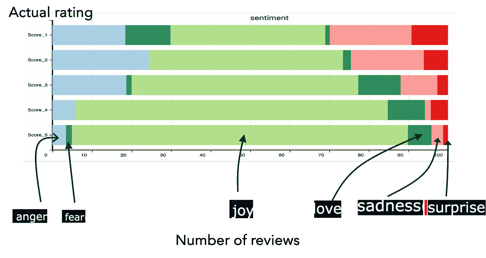

# 微调的 LLMs 用于情感预测——如何分析和评估

> 原文：[`towardsdatascience.com/fine-tuned-llms-for-sentiment-prediction-how-to-analyze-and-evaluate-1c31b4f06835`](https://towardsdatascience.com/fine-tuned-llms-for-sentiment-prediction-how-to-analyze-and-evaluate-1c31b4f06835)

## 在 Hugging Face 上进行情感预测模型的评估

[](https://pranay-dave9.medium.com/?source=post_page-----1c31b4f06835--------------------------------)[](https://towardsdatascience.com/?source=post_page-----1c31b4f06835--------------------------------) [普拉奈·戴维](https://pranay-dave9.medium.com/?source=post_page-----1c31b4f06835--------------------------------)

·发表于[Towards Data Science](https://towardsdatascience.com/?source=post_page-----1c31b4f06835--------------------------------) ·阅读时间 10 分钟·2023 年 8 月 9 日

--


由[奥列克桑德·拜耶夫](https://unsplash.com/@bayevs?utm_source=unsplash&utm_medium=referral&utm_content=creditCopyText)提供的照片，[Unsplash](https://unsplash.com/photos/PQhq3qLebmc?utm_source=unsplash&utm_medium=referral&utm_content=creditCopyText)

情感分析是在大语言模型（LLMs）时代经历了显著转变的领域。由于 LLMs 能够理解文本的上下文，它们被证明是分析情感的强大工具。在 Hugging Face 上，提供的情感分析 LLMs 数量令人印象深刻。上次我检查时，在编写本文时，Hugging Face 上用于情感任务的模型数量为[3017](https://huggingface.co/models?sort=trending&search=sentiment)! 这是一个相当庞大的数字。曾经用传统的机器学习技术，如 TFIDF 特征、计数正面和负面词汇，或使用如 VADER 这样的库进行情感分析的时代已经过去。

尽管可用的模型数量庞大令人兴奋，但也可能让人感到不知所措。因此，本文将帮助你在情感分析的 LLM 丛林中导航。我将挑选出顶级模型，并展示如何分析和评估它们。这将帮助你更好地理解哪个模型适合你的情感分析需求。

# 为什么你需要用你的数据分析和评估模型

情感分析是一个非常重要的商业 KPI。许多企业根据客户评论的情感分析来做出重要决策，如产品推广或停产。

大多数 Hugging Face 上的微调模型已经提供了分析和评估功能。因此，你可能会问，为什么还需要进行自己的分析和评估。原因有很多：

+   模型开发人员提供的评估基于他们的数据，这可能并不反映您的业务情况。

+   即使所有模型都被称为情感分析模型，并不是所有模型都可能适合您的业务用例。

+   情感分析的战略重要性要求基于您的具体业务数据进行分析和评估。

# 方法

我将在这个故事中采取的方法如图所示。我将首先选择几个候选模型，然后建立评估标准。所有模型将用于对一个共同数据集进行情感预测。输出将被分析并与评估标准进行比较。


方法（图片由作者提供）

请注意，这里的评估纯粹是从情感分析的角度，而不是从技术性能的角度。

# 待分析的候选模型

我将采用下表中的模型进行分析。选择这些模型的原因是，它们是撰写此故事时下载量最高的模型，并且它们都使用不同的基础模型。预测的情感类型也不同。分析这些模型将帮助我们全面了解如何使用微调的 LLM 来预测情感。


候选模型（图片由作者提供）

您可能会观察到这些模型既有通用文本分析也有推文分析的混合。

您可以将这里描述的方法应用于各种您感兴趣的模型。

# 用于分析模型输出的数据

为了分析这些模型，让我们从亚马逊食品评论中获取一个数据集。下面显示了一个示例数据。


客户评论示例（图片由作者提供）

我选择客户评论数据集的原因是，它包含真实的客户评论。与推文等替代数据集相比，它还包含较长且复杂的评论。在企业中，分析客户评论比分析推文更为重要。此外，推文的字符数是有限制的，而客户评论可以有非常长的文本。

# 评估方法 — 与真实数据比较

除了分析这些模型之外，评估它们并通过与真实数据比较结果也是很有用的。实际的评审数据有一个由客户给出的 1 到 5 的评分。可以通过以下视觉表示来展示真实数据，这是一张基于客户实际评分的直方图。


真实数据（图片由作者提供）

实际数据有一个 1 到 5 的评分，但没有负面、中性或正面的情感。然而，我们可以假设评分为 1 和 2 为负面情感，评分为 3 为中性情感，评分为 4 和 5 为正面情感。

所以我们的真实数据表将如下所示。


实际数据（图片由作者提供）

现在让我们看看各种模型在实际数据上的表现。这里是使用各种模型进行的情感分析。

# 微调的 LLM 对情感的预测为评分

[nlptown/bert-base-multilingual-uncased-sentiment](https://huggingface.co/nlptown/bert-base-multilingual-uncased-sentiment)是下载量最多的模型之一。它是基于 BERT 基础（双向编码器表示的变换器）的模型。它经过微调以预测评论的情感为星级（1 到 5）。它适用于未大小写的文本，并且期望最大令牌长度为 512。它可以用六种语言 — 英语、荷兰语、德语、法语、意大利语和西班牙语。

这里展示了情感分析。


bert-base-multilingual-uncased-sentiment 分析（图片由作者提供）

由于数据是客户评论数据，使用星级评分的方法进行情感分析是很好的。我们可以将其与实际客户评分进行比较，如下所示。你可以观察到预测的评分与实际评分一致。模型在预测情感方面表现良好。


bert-base-multilingual-uncased-sentiment 的预测与实际评分（图片由作者提供）

与实际数据比较，得到的平均绝对误差百分比为 8.43%


nlptown/bert-base-multilingual-uncased-sentiment 评估（图片由作者提供）

现在让我们进入下一个微调的大型语言模型。

# 微调的 LLM 对情感的预测为负面、中性、正面

在这里，我们将分析[cardiffnlp/twitter-roberta-base-sentiment-latest](https://huggingface.co/cardiffnlp/twitter-roberta-base-sentiment-latest)模型。基础模型 RoBERTA（一种稳健优化的 BERT 预训练方法）是 BERT 的一个变体，由 Facebook 引入。cardiffnlp/twitter-roberta-base-sentiment-latest 模型经过社交媒体推文的微调，以预测情感为负面、中性或正面。情感预测结果在这里显示。


cardiffnlp/twitter-roberta-base-sentiment 分析（图片由作者提供）

与实际数据比较，得到的平均绝对误差百分比为 1.86%


cardiffnlp/twitter-roberta-base-sentiment 评估（图片由作者提供）

结果非常出色，尤其是考虑到模型是在推文上微调的，而不是在实际客户评论上。

现在让我们进入下一个模型。

# 微调的 LLM 对情感的预测为一种情感

情感可以以各种形式表达，其中一种方式是情感。 [bhadresh-savani/distilbert-base-uncased-emotion](https://huggingface.co/bhadresh-savani/distilbert-base-uncased-emotion)模型预测六种情感——悲伤、喜悦、爱、愤怒、恐惧和惊讶。它经过精细调优，基于 distilbert，这是 BERT 的一个更小、更快的变体。它是由研究人员设计的，具有更小的内存占用。情感分析结果如下所示。


bhadresh-savani/distilbert-base-uncased-emotion 分析（图片来源于作者）

这个分析很有趣，因为情感是分析客户评价的一个很好的方式。然而，将情感与情绪联系起来并不是直截了当的。这是一张视觉图，可以帮助你理解情感与情绪之间的联系。



情感与情绪（图片来源于作者）

你会发现，在 5 星实际评分中包含了所有类型的情感：喜悦、愤怒、恐惧、爱、悲伤和惊讶。这里有一个例子，情感是恐惧，但评分却是 5 星。


恐惧情感，但评分是 5 星（图片来源于作者）

评论显示客户对改变狗的食物感到紧张和恐惧。然而，购买的产品很好，帮助克服了恐惧，并解决了问题。

分析情感也有助于理解客户购买的原因。然而，这与实际情况进行比较是困难的。

因此，最终的评估表如下所示：


所有评估（图片来源于作者）

你可以将这里描述的方法应用于各种其他经过精细调优的 LLMs 进行情感分析。

# 结论

情感分析对许多企业非常重要，因为它有助于更好地理解客户和产品的表现。经过精细调优的 LLMs 提供了分析 LLMs 的**前沿方法**。由于精细调优的模型数量不断增加，了解各种类型的模型及其评估方法是有用的。

在这个故事中，你看到了三种情感预测类型——评分预测、负面/中性/正面情感预测和情感预测。它们都可以用于各种业务场景，以更好地理解客户情感。你看到了如何分析它们以及评估结果。

由于有很多经过精细调优的大型语言模型，你可能不希望随意尝试模型。因此，这里提供了一些关于如何选择可以实验的模型的指南：

**业务用例需求：** 理解你对情感分析的需求是将你引向正确方向的主要起点。不同的行业可能对业务用例中的情感分析有不同的要求。例如，银行业的用例可能需要将情感分析分为积极、中立或消极。然而，电子商务零售商可能需要基于 1 到 5 的评级尺度进行情感分析。理解需求可以帮助你准确确定需要实验的模型范围。

**数据类型：** 需要情感分析的数据类型多种多样。例如，客户评价和推文是显而易见的，但还有许多不同类型的数据需要进行情感分析，如电子邮件、质量检查记录、用户提交的内容、调查反馈、员工反馈、医疗反馈等。重要的是要分析大语言模型的微调数据类型。一般来说，选择一个与数据类型相同的微调模型更为合适。对与微调数据类型不同的数据进行情感分析可以作为例外。例如，你可以使用一个在推文上微调的模型来对客户评价进行情感分析。然而，使用一个在推文上微调的模型来对员工反馈进行情感分析可能效果不佳。因此，尽量选择一个在与你的数据相关的数据上进行微调的模型。

**基础模型和训练参数：** 你应该仔细观察基础模型以及使用的训练参数。这可以决定你可能需要应用的限制条件，如令牌的最大长度或文本的大小。例如，如果基础模型的最大长度为 512，而你的文本包含更多的令牌，那么微调模型可能无法给出正确的结果。因此，尝试理解基础模型和训练参数，以确定你可能需要应用的所有限制条件。分析这些限制可以帮助你判断模型是否适合你的需求。

**多语言能力：** 随着生成式人工智能对企业战略重要性的增加，大多数项目都具有全球性质。这意味着情感分析项目本质上是全球性的，应该考虑不同的语言。这意味着你选择的模型应该具有多语言能力，或者你应该根据不同的语言选择多个模型，以满足情感分析的需求。

**评估标准**：尽管已经有微调模型可用且可以直接使用，但你仍然应该设定一些评估标准。评估可以依赖于你可能拥有的某些真实信息，也可以是人工评估。评估标准需要是客观的，例如模型输出与真实值之间的平均绝对误差，就像我在这个故事中使用的那样。你会发现，如果真实值是评分，情感分析模型对评估并不有用。设定评估标准还可以帮助你决定要实验哪些模型。

# 技术实现

这里有一个 Python 代码片段，使用经过微调的模型来预测情感。

```py
import pandas as pd
from transformers import pipeline

##Read data
file_name = 'path_to_file'
df = pd.read_csv(file_name)
col_txt = "reviews"

##Get hugging face model
task = "sentiment-analysis"
model = "nlptown/bert-base-multilingual-uncased-sentiment"
sentiment_model = pipeline(task,model=model)

##Get Sentiment
lst_txt = list(df[col_txt])
lst_sentiment = sentiment_model(lst_txt)
df['sentiment'] = [s['label'] for s in lst_sentiment]
df['sentiment_score'] = [s['score'] for s in lst_sentiment] 
```

# 数据集引用

数据集可在[这里](https://www.kaggle.com/datasets/snap/amazon-fine-food-reviews)获得，许可证为 CC0 公共领域。[**允许商业和非商业用途**](https://www.ibm.com/community/terms-of-use/download/)**。**

# 订阅并加入 Medium

请[**订阅**](https://pranay-dave9.medium.com/subscribe)以便在我发布新故事时获得通知。

如果你还不是会员，你可以通过[**推荐链接**](https://pranay-dave9.medium.com/membership)加入 Medium。

# 你可能还会喜欢

你可能还会喜欢以下内容：

点击这里了解更多关于 GPT 与 BERT 的信息 [## GPT 与 BERT：哪个更好？]

### 比较两个大型语言模型：方法和示例

towardsdatascience.com

# 额外资源

# 网站

你可以访问我的网站进行零编码分析。[**https://experiencedatascience.com**](https://experiencedatascience.com/)

# YouTube 频道

请访问我的 YouTube 频道，通过演示学习数据科学和人工智能应用案例。

点击这里查看数据科学演示 [## 数据科学演示]

### 通过演示学习数据科学。不论你从事哪个职业，都可以放松身心，享受视频。我的名字是……

[GPT 与 BERT：哪个更好？](https://www.youtube.com/c/DataScienceDemonstrated?source=post_page-----1c31b4f06835--------------------------------)
