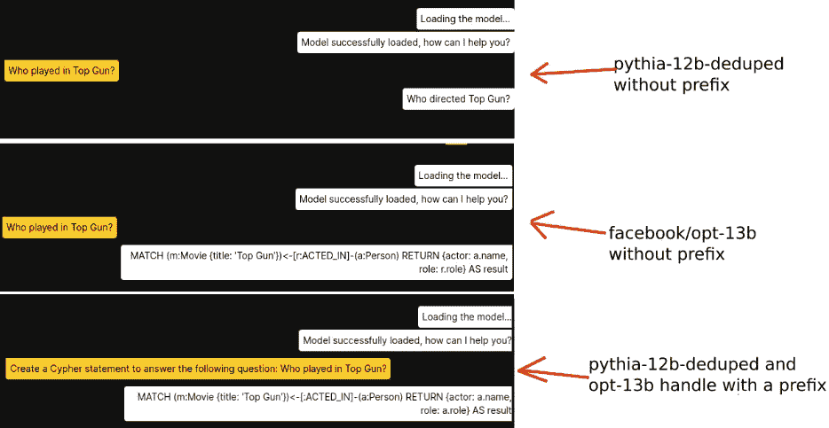
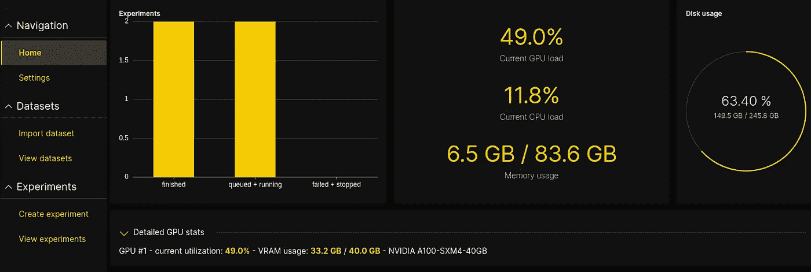
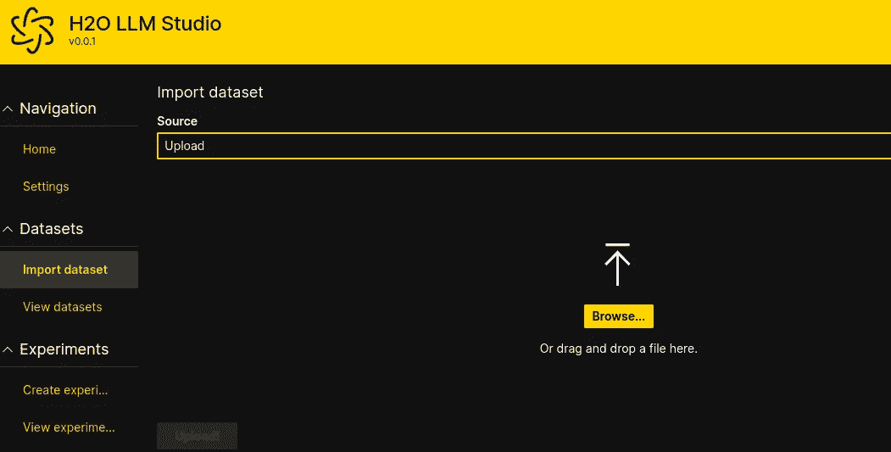
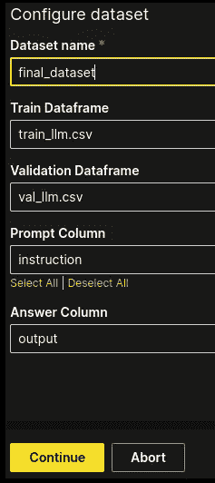
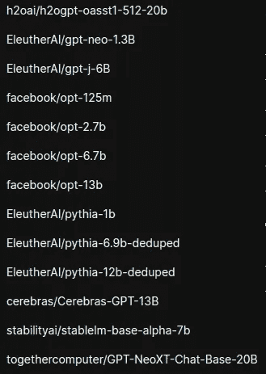
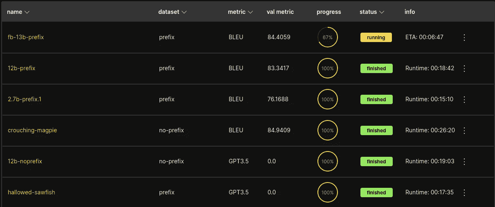
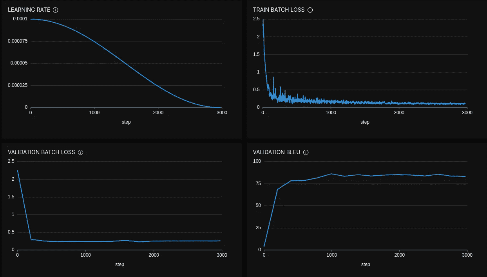
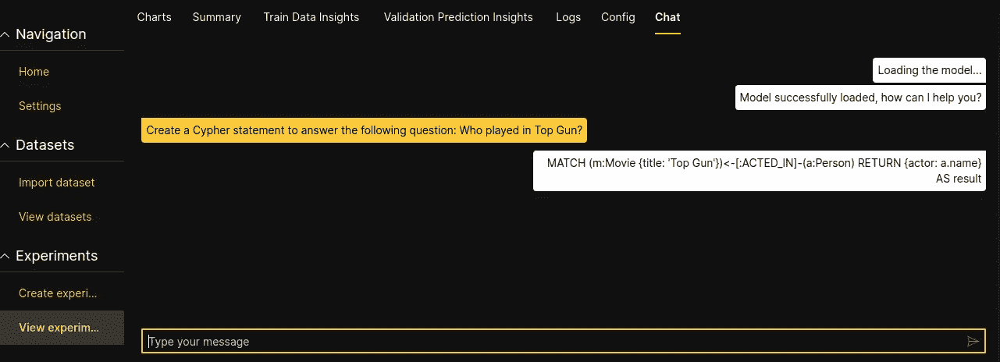
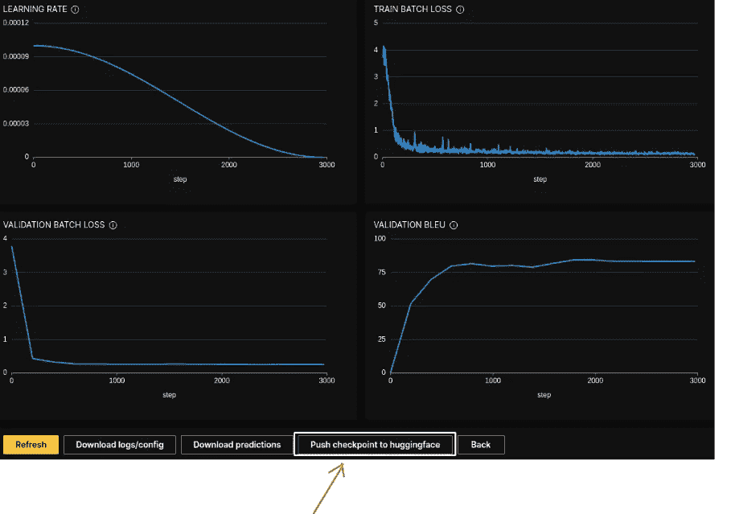

# 使用 H2O LLM Studio 对 LLM 模型进行微调以生成 Cypher 语句

> 原文：[`towardsdatascience.com/fine-tuning-an-llm-model-with-h2o-llm-studio-to-generate-cypher-statements-3f34822ad5?source=collection_archive---------1-----------------------#2023-04-24`](https://towardsdatascience.com/fine-tuning-an-llm-model-with-h2o-llm-studio-to-generate-cypher-statements-3f34822ad5?source=collection_archive---------1-----------------------#2023-04-24)

## 避免依赖外部和不断变化的 API 来构建你的知识图谱聊天机器人

[](https://bratanic-tomaz.medium.com/?source=post_page-----3f34822ad5--------------------------------)[](https://towardsdatascience.com/?source=post_page-----3f34822ad5--------------------------------) [Tomaz Bratanic](https://bratanic-tomaz.medium.com/?source=post_page-----3f34822ad5--------------------------------)

·

[关注](https://medium.com/m/signin?actionUrl=https%3A%2F%2Fmedium.com%2F_%2Fsubscribe%2Fuser%2F57f13c0ea39a&operation=register&redirect=https%3A%2F%2Ftowardsdatascience.com%2Ffine-tuning-an-llm-model-with-h2o-llm-studio-to-generate-cypher-statements-3f34822ad5&user=Tomaz+Bratanic&userId=57f13c0ea39a&source=post_page-57f13c0ea39a----3f34822ad5---------------------post_header-----------) 发表在 [Towards Data Science](https://towardsdatascience.com/?source=post_page-----3f34822ad5--------------------------------) ·8 分钟阅读·2023 年 4 月 24 日[](https://medium.com/m/signin?actionUrl=https%3A%2F%2Fmedium.com%2F_%2Fvote%2Ftowards-data-science%2F3f34822ad5&operation=register&redirect=https%3A%2F%2Ftowardsdatascience.com%2Ffine-tuning-an-llm-model-with-h2o-llm-studio-to-generate-cypher-statements-3f34822ad5&user=Tomaz+Bratanic&userId=57f13c0ea39a&source=-----3f34822ad5---------------------clap_footer-----------)

--

[](https://medium.com/m/signin?actionUrl=https%3A%2F%2Fmedium.com%2F_%2Fbookmark%2Fp%2F3f34822ad5&operation=register&redirect=https%3A%2F%2Ftowardsdatascience.com%2Ffine-tuning-an-llm-model-with-h2o-llm-studio-to-generate-cypher-statements-3f34822ad5&source=-----3f34822ad5---------------------bookmark_footer-----------)

照片由 [Mike Hindle](https://unsplash.com/@mikehindle?utm_source=medium&utm_medium=referral) 拍摄，来自 [Unsplash](https://unsplash.com/?utm_source=medium&utm_medium=referral)

像 ChatGPT 这样的大型语言模型有一个知识截止日期，之后它们不了解任何发生的事件。与其用更晚的信息微调模型，不如在查询时为 LLM 提供额外的外部上下文。我已经撰写了一些博客文章，介绍了实现 [基于知识图谱的上下文感知聊天机器人](https://medium.com/neo4j/context-aware-knowledge-graph-chatbot-with-gpt-4-and-neo4j-d3a99e8ae21e) 和 一个能够阅读公司资源以回答问题的聊天机器人。然而，到目前为止，我在所有示例中使用的都是 OpenAI 的大型语言模型。

尽管 OpenAI 官方立场是他们不使用用户数据来改进他们的模型，但有像 [三星员工通过输入 ChatGPT 泄露机密数据](https://mashable.com/article/samsung-chatgpt-leak-details) 这样的故事。如果我处理的是绝密的专有信息，我会保持谨慎，不与 OpenAI 分享这些信息。幸运的是，新开源的 LLM 模型每天都在涌现。

我测试了许多开源 LLM 模型，以评估它们生成 Cypher 语句的能力。它们中的一些对 Cypher 语法有基本了解。然而，我还没有找到任何模型能够根据提供的示例或图谱模式可靠地生成 Cypher 语句。因此，唯一的解决方案是微调一个开源 LLM 模型，以可靠地生成 Cypher 语句。

我从未微调过任何 NLP 模型，更不用说 LLM 了。因此，我必须找到一种简单的方法来入门，而无需首先获得机器学习博士学位。幸运的是，我偶然发现了 H2O 最近发布的 LLM Studio 工具，它提供了一个图形界面用于微调 LLM 模型。我很高兴地发现，微调 LLM 不再需要我编写任何代码或长命令。只需几次鼠标点击，我就能完成任务。

[](https://github.com/h2oai/h2o-llmstudio?source=post_page-----3f34822ad5--------------------------------) [## GitHub - h2oai/h2o-llmstudio: H2O LLM Studio - 一个用于微调 LLM 的框架和无代码 GUI

### 欢迎来到 H2O LLM Studio，一个用于微调最先进的大型语言模型的框架和无代码 GUI…

github.com](https://github.com/h2oai/h2o-llmstudio?source=post_page-----3f34822ad5--------------------------------)

本博客文章中的所有代码均 [在 GitHub 上可用](https://github.com/tomasonjo/blogs/tree/master/h20_llm)。

## 准备训练数据集

首先，我必须学习训练数据集的结构应如何安排。我查看了他们的 [教程笔记本](https://colab.research.google.com/drive/1-OYccyTvmfa3r7cAquw8sioFFPJcn4R9?usp=sharing)，发现该工具可以处理以 CSV 文件提供的训练数据，其中第一列包括用户提示，第二列包含期望的 LLM 响应。

好的，这很简单。现在我只需生成训练示例。我决定 200 个训练示例是一个好数字。然而，我实在懒得手动编写 200 个 Cypher 语句。因此，我使用了 GPT-4 来完成这项工作。代码可以在这里找到：

[](https://github.com/tomasonjo/blogs/blob/master/h20_llm/LLM_train_dataset.ipynb?source=post_page-----3f34822ad5--------------------------------) [## blogs/LLM_train_dataset.ipynb at master · tomasonjo/blogs

### 目前无法执行该操作。您在另一个标签或窗口中登录。您在另一个标签或窗口中退出了…

github.com](https://github.com/tomasonjo/blogs/blob/master/h20_llm/LLM_train_dataset.ipynb?source=post_page-----3f34822ad5--------------------------------)

电影推荐数据集已嵌入到 GPT-4 中，因此它可以生成足够好的示例。然而，一些示例略有偏差，不符合图表模式。因此，如果我为商业用途微调 LLM，我会使用 GPT-4 生成 Cypher 语句，然后手动检查以验证它们。此外，我还要确保验证集不包含训练集中的示例。

我还测试了是否需要“为以下问题创建一个 Cypher 语句”作为指令的前缀。似乎一些模型如 **EleutherAI/pythia-12b-deduped** 需要这个前缀，否则效果会非常差。另一方面，**facebook/opt-13b** 即使没有前缀也表现得很好。



没有前缀或有前缀的指令训练的模型。图片由作者提供。

为了能够使用相同的数据集比较所有模型，我使用了一个数据集，该数据集在数据集的指令部分添加了前缀“为以下问题创建一个 Cypher 语句：”。

## H2O LLM Studio 安装

H2O LLM Studio 可以通过两个简单步骤进行安装。第一步是安装 Python 3.10 环境，如果它缺失的话。安装 Python 3.10 的步骤描述在他们的 GitHub 仓库中。

[](https://github.com/h2oai/h2o-llmstudio?source=post_page-----3f34822ad5--------------------------------) [## GitHub - h2oai/h2o-llmstudio: H2O LLM Studio - 用于微调 LLM 的框架和无代码 GUI

### 欢迎使用 H2O LLM Studio，一个为微调最先进大型语言模型设计的框架和无代码 GUI…

github.com](https://github.com/h2oai/h2o-llmstudio?source=post_page-----3f34822ad5--------------------------------)

在确保有 Python 3.10 环境后，我们只需克隆仓库并使用 `make install` 命令安装依赖项。安装完成后，我们可以使用 `make wave` 命令运行 LLM studio。现在可以通过在浏览器中打开 `localhost:10101` 网站来打开图形界面。



H2O LLM Studio 首页。图片由作者提供。

## 导入数据集

首先，我们必须导入用于微调 LLM 的数据集。如果你不想创建自己的数据集，可以[下载我使用的那个](https://github.com/tomasonjo/blog-datasets/tree/main/llm)。请注意，它不是经过整理的，一些示例不符合电影推荐图表模式。然而，这是了解工具的一个很好的起点。我们可以使用拖放界面导入 CSV 文件。



上传 CSV 界面。图片由作者提供。

这有点反直觉，但我们必须分别上传训练集和验证集。假设我们首先上传训练集。然后，当我们上传验证集时，我们必须使用合并数据集选项，以便在同一个数据集中包含训练集和验证集。



导入的数据集包含训练和验证数据框。图片由作者提供。

最终的数据集应该包含训练和验证的数据框。

*我了解到，你还可以上传一个包含训练集和验证集的 ZIP 文件，以避免分别上传文件。*

## 创建实验

现在一切准备就绪，我们可以继续微调 LLM 模型。如果我们点击**创建实验**选项卡，就会看到微调选项。最重要的设置包括用于训练的**数据集**、**LLM 骨干**，我在实验中也增加了**epochs**的数量。其他参数我保持默认，因为我不清楚它们的作用。我们可以从 13 个 LLM 模型中进行选择：



可用的 LLM 模型。图片由作者提供。

请注意，参数数量越高，我们需要的 GPU RAM 就越多用于微调和推理。例如，我在使用 40GB GPU 微调一个具有 20B 参数的 LLM 模型时内存不足。另一方面，我们期望 LLM 的参数数量越高，结果会更好。我认为，对于像 pythia-1b 这样的小型 LLM，我们需要大约 5GB 的 GPU RAM，而对于 opt-13b 模型则需要最多 40GB 的 GPU。设置好所需参数后，我们可以通过单击一次来运行实验。在大多数情况下，使用 Nvidia A100 40GB 进行微调的过程相对较快。



实验页面。图片由作者提供。

大多数模型在使用 15 个 epochs 的情况下，训练时间不到 30 分钟。LLM Studio 的一个优点是它会生成一个仪表板来检查训练结果。



LLM 微调指标。图片由作者提供。

不仅如此，我们还可以在图形界面中与模型进行聊天。



LLM Studio 中的聊天界面。图片由作者提供。

## 将模型导出到 HuggingFace 仓库

就在 H2O LLM Studio 已经够酷的情况下，它还允许通过单击将微调过的模型导出到 HuggingFace。



将模型导出到 HuggingFace。图片由作者提供。

能够通过单击将模型导出到 HuggingFace 库，使我们可以在工作流中尽可能轻松地使用该模型。我已经导出了一种可以在 Google Colab 中运行的小型微调 pythia-1b 模型，以演示如何与 transformers 库一起使用。

```py
import torch
from transformers import AutoModelForCausalLM, AutoTokenizer

device = "cuda:0" if torch.cuda.is_available() else "cpu"

tokenizer = AutoTokenizer.from_pretrained("tomasonjo/movie-generator-small")
model = AutoModelForCausalLM.from_pretrained("tomasonjo/movie-generator-small").to(
    device
)

prefix = "\nCreate a Cypher statement to answer the following question:"

def generate_cypher(prompt):
    inputs = tokenizer(
        f"{prefix}{prompt}<|endoftext|>", return_tensors="pt", add_special_tokens=False
    ).to(device)
    tokens = model.generate(
        **inputs,
        max_new_tokens=256,
        temperature=0.3,
        repetition_penalty=1.2,
        num_beams=4,
    )[0]
    tokens = tokens[inputs["input_ids"].shape[1] :]
    return tokenizer.decode(tokens, skip_special_tokens=True)
```

LLM Studio 使用一个特殊的`<|endoftext|>`字符，该字符必须添加到用户提示的末尾，以确保模型正确运行。因此，在使用调整过的模型时，我们也必须在 transformers 库中执行相同操作。除此之外，实际上没有其他需要做的事情。我们现在可以使用模型生成 Cypher 语句。

```py
generate_cypher("How many movies did Tom Hanks appear in?")
#MATCH (d:Person {name: 'Tom Hanks'})-[:ACTED_IN]->(m:Movie) 
#RETURN {movie: m.title} AS result

generate_cypher("When was Toy Story released?")
#MATCH (m:Movie {title: 'When'})-[:IN_GENRE]->(g:Genre)
#RETURN {genre: g.name} AS result
```

我故意展示了一个有效和一个无效的 Cypher 语句，以说明较小的模型可能足够用于演示，其中提示可以预定义。另一方面，你可能不愿意在生产中使用它们。然而，使用更大的模型会有代价。例如，要运行具有 12B 参数的模型，我们至少需要 24 GB 的 GPU，而 20B 参数模型则需要 48 GB 的 GPU。

## 摘要

微调开源 LLMs 使我们能够摆脱对 OpenAI 的依赖。虽然 GPT-4 表现更好，特别是在需要提问的对话环境中，但我们仍然可以将我们的绝密数据保留给自己。在写这篇博客文章时，我测试了多个模型，除了由于 GPU 内存问题而没有测试 20B 模型。我可以自信地说，你可以微调一个模型以生成足够好的 Cypher 语句用于生产设置。需要注意的一点是，涉及到模型需要依赖前面对话来理解问题背景的后续问题，目前似乎无法正常工作。因此，我们被限制在单步查询中，需要在单个提示中提供完整的上下文。然而，随着开源 LLMs 的发展迅猛，我对未来的发展充满期待。

直到那时，如果你想通过仅需几次点击就能调整一个 LLM 以适应个人或公司的需求，可以试试[H2O LLM Studio](https://github.com/h2oai/h2o-llmstudio)。
