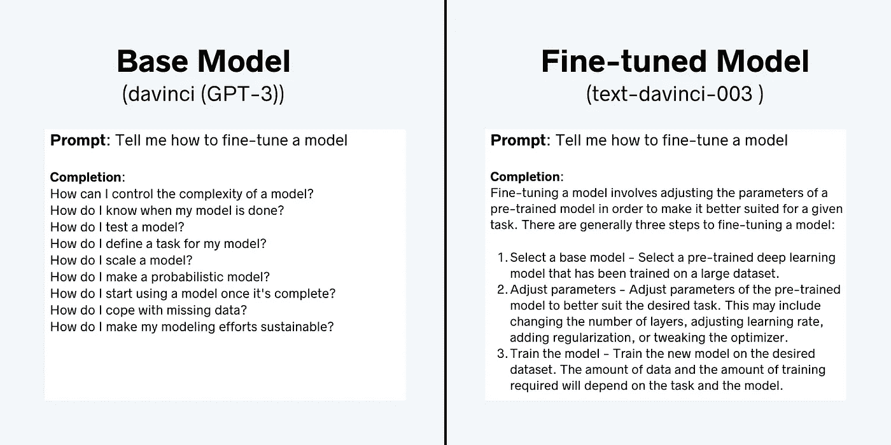
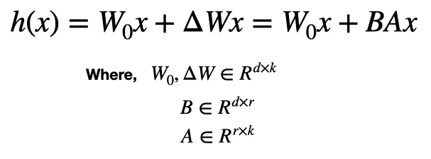

# 微调大型语言模型（LLMs）

> 原文：[`towardsdatascience.com/fine-tuning-large-language-models-llms-23473d763b91`](https://towardsdatascience.com/fine-tuning-large-language-models-llms-23473d763b91)

## 一个带有示例 Python 代码的概念概述

[](https://shawhin.medium.com/?source=post_page-----23473d763b91--------------------------------)[](https://towardsdatascience.com/?source=post_page-----23473d763b91--------------------------------) [Shaw Talebi](https://shawhin.medium.com/?source=post_page-----23473d763b91--------------------------------)

·发表于[Towards Data Science](https://towardsdatascience.com/?source=post_page-----23473d763b91--------------------------------) ·14 分钟阅读·2023 年 9 月 11 日

--

这是关于[使用大型语言模型](https://medium.com/towards-data-science/a-practical-introduction-to-llms-65194dda1148)（LLMs）实践的第 5 篇文章。在这篇文章中，我们将讨论如何对预训练的 LLM 进行微调（FT）。我们将首先介绍关键的 FT 概念和技术，然后通过一个具体的示例，演示如何使用 Python 和 Hugging Face 的软件生态系统在本地微调模型。


调整语言模型。图像由作者提供。

在[本系列的上一篇文章](https://medium.com/towards-data-science/prompt-engineering-how-to-trick-ai-into-solving-your-problems-7ce1ed3b553f)中，我们看到如何通过将提示工程整合到 Python 代码中来构建实用的 LLM 驱动应用程序。对于绝大多数 LLM 使用案例，这是我推荐的初步方法，因为它比其他方法需要的资源和技术专长少得多，同时仍然能提供许多好处。

然而，存在一些情况，其中直接提示现有的 LLM 并不够有效，需要更复杂的解决方案。这就是模型微调可以发挥作用的地方。

附加视频。

# **什么是微调？**

**微调**是对一个预训练的模型进行**至少一个内部模型参数的训练**（即权重）。在 LLMs 的上下文中，这通常是将一个通用的基础模型（例如 GPT-3）转变为一个针对特定用例的专业模型（例如 ChatGPT）[1]。

这种方法的**主要优势**在于，与仅依赖监督训练的模型相比，模型可以在需要（远）少得多的人工标记示例的情况下实现更好的性能。

虽然严格的自监督基础模型在借助提示工程[2]的帮助下可以在各种任务上展现出令人印象深刻的表现，但它们仍然是词预测器，可能生成的完成结果并不完全有用或准确。例如，让我们比较 davinci（基础 GPT-3 模型）和 text-davinci-003（一个经过微调的模型）的完成结果。



davinci（基础 GPT-3 模型）和 text-davinci-003（一个经过微调的模型）的完成结果比较。图片由作者提供。

注意，基础模型仅仅是通过列出一系列问题来完成文本，就像谷歌搜索或作业任务一样，而**微调模型提供了更有帮助的响应**。text-davinci-003 所使用的微调方法是**对齐微调**，其目的是使大型语言模型的响应更有帮助、更诚实和无害，但稍后会详细介绍[3,4]。

# **为什么要微调**

微调不仅能提高基础模型的性能，而且**较小的（微调的）模型在训练的任务集上往往能超越更大的（更昂贵的）模型**[4]。OpenAI 通过其第一代“InstructGPT”模型证明了这一点，其中 1.3B 参数的 InstructGPT 模型在完成结果上优于 175B 参数的 GPT-3 基础模型，尽管它小了 100 倍[4]。

虽然我们今天可能与之互动的大多数大型语言模型并非像 GPT-3 那样严格的自监督模型，但对现有的微调模型进行特定用例的提示仍然存在缺陷。

一个重要的问题是，大型语言模型有一个有限的上下文窗口。因此，模型可能在需要大量知识基础或特定领域信息的任务上表现不佳[1]。微调模型可以通过在微调过程中“学习”这些信息来避免这个问题。这也避免了在提示中塞入额外的上下文，从而可以降低推理成本。

# **微调的三种方法**

有**三种通用的模型微调方法**：自监督、监督和强化学习。这些方法并非相互排斥，可以按顺序组合使用这三种方法来微调一个模型。

## **自监督学习**

**自监督学习**包括**基于训练数据的固有结构来训练模型**。在大型语言模型的背景下，这通常表现为给定一个词（或更准确地说是令牌）的序列，预测下一个词（令牌）。

尽管这是许多现今预训练语言模型的开发方式，但它也可以用于模型微调。一个潜在的应用场景是开发一个能够模拟某人写作风格的模型，给定一组示例文本。

## **监督学习**

下一种，也许是最流行的，微调模型的方法是通过**监督学习**。这涉及到**对特定任务的输入-输出对进行模型训练**。一个例子是**指令调整**，其目的是提升模型在回答问题或回应用户提示时的表现[1,3]。

监督学习中的**关键步骤**是**策划训练数据集**。一种简单的方法是创建问答对并将其整合到提示模板中[1,3]。例如，问答对：*谁是美国第 35 任总统？—— 约翰·F·肯尼迪* 可以粘贴到下面的提示模板中。更多示例提示模板可以在参考文献[4]的 A.2.1 节中找到。

```py
"""Please answer the following question.

Q: {Question}

A: {Answer}"""
```

使用提示模板很重要，因为像 GPT-3 这样的基础模型本质上是“文档补全器”。这意味着，给定一些文本，模型会生成在该上下文中（统计上）有意义的更多文本。这回到本系列的[上一篇博客](https://medium.com/towards-data-science/prompt-engineering-how-to-trick-ai-into-solving-your-problems-7ce1ed3b553f)和通过提示工程“欺骗”语言模型来解决问题的想法。

[](/prompt-engineering-how-to-trick-ai-into-solving-your-problems-7ce1ed3b553f?source=post_page-----23473d763b91--------------------------------) ## 提示工程 — 如何“欺骗”AI 来解决你的问题

### 7 个提示技巧、Langchain 和 Python 示例代码

towardsdatascience.com

## **强化学习**

最后，可以使用**强化学习（RL）**来微调模型。RL**使用奖励模型来指导基础模型的训练**。这可以采取多种形式，但基本思想是训练奖励模型以对语言模型的完成情况进行评分，使其反映人类标注者的偏好[3,4]。然后，奖励模型可以与强化学习算法（例如，近端策略优化（PPO））结合使用，以微调预训练模型。

OpenAI 的 InstructGPT 模型展示了如何使用强化学习进行模型微调，这些模型是通过**3 个关键步骤**开发的[4]。

1.  生成高质量的提示-响应对，并使用监督学习微调预训练模型。（~13k 训练提示） *注意：可以（可选地）跳到步骤 2，使用预训练模型[3]。*

1.  使用微调后的模型生成完成，并让人工标注者根据其偏好对响应进行排名。使用这些偏好来训练奖励模型。（~33k 训练提示）

1.  使用奖励模型和强化学习算法（例如 PPO）进一步微调模型。（~31k 训练提示）

尽管上述策略通常会导致 LLM 完成度显著优于基础模型，但这也可能导致在某些任务上的性能下降。这种性能下降也被称为**对齐成本**[3,4]。

# **监督微调步骤（高级）**

如上所述，可以通过许多方法微调现有语言模型。然而，本文剩余部分将专注于通过监督学习进行微调。以下是监督模型微调的高级程序[1]。

1.  **选择微调任务**（例如总结、问答、文本分类）

1.  **准备训练数据集**即创建（100–10k）输入输出对并预处理数据（即标记化、截断和填充文本）。

1.  **选择基础模型**（尝试不同模型并选择在所需任务上表现最佳的一个）。

1.  **通过监督学习微调模型**

1.  **评估模型性能**

虽然这些步骤中的每一个都可以成为一篇文章，但我想专注于**第 4 步**并讨论如何训练微调后的模型。

# **参数训练的 3 种选项**

在微调拥有~100M-100B 参数的模型时，需要考虑计算成本。在这方面，一个重要的问题是——*我们（重新）训练哪些参数？*

在处理大量参数时，我们有无数的选择来决定训练哪些参数。在这里，我将专注于**三种通用选项**。

## **选项 1：重新训练所有参数**

第一个选项是**训练所有内部模型参数**（称为**完全参数调优**）[3]。虽然这个选项在概念上很简单，但它是最耗费计算资源的。此外，完全参数调优的一个已知问题是灾难性遗忘现象。这是模型“遗忘”了在初始训练中“学到”的有用信息[3]。

我们可以通过冻结模型参数的大部分来缓解选项 1 的缺点，这就引出了选项 2。

## **选项 2：迁移学习**

**迁移学习（TL）**的核心思想是保留模型从过去训练中学到的有用表示/特征，并将模型应用于新任务时使用。这通常包括**“去掉神经网络（NN）的头部并用新的头部替换它”**（例如，添加具有随机权重的新层）。*注意：神经网络的头部包括其最终层，这些层将模型的内部表示转换为输出值。*

虽然保持大部分参数不变可以减轻训练 LLM 的巨大计算成本，但 TL 可能无法解决灾难性遗忘问题。为了更好地处理这两个问题，我们可以转向一组不同的方法。

## **选项 3：参数高效微调（PEFT）**

**PEFT** 涉及 **用相对少量的可训练参数增强基础模型**。其关键结果是一种微调方法，能够在极低的计算和存储成本下展示出与完全参数调整相当的性能 [5]。

PEFT 封装了一系列技术，其中之一是流行的 **LoRA (低秩适配)** 方法 [6]。LoRA 的基本思想是选择现有模型中的一部分层，并根据以下方程式修改它们的权重。



方程式显示了如何使用 LoRA 修改权重矩阵以进行微调 [6]。图片由作者提供。

其中 *h()* = 一个将被调整的隐藏层，*x* = 输入到 *h()* 的数据，*W₀* = *h* 的原始权重矩阵，而 *ΔW* = 注入到 *h* 的可训练参数矩阵。*ΔW* 根据 *ΔW*=*BA* 被分解，其中 *ΔW* 是一个 d 乘 k 的矩阵，*B* 是 d 乘 r 的矩阵，而 *A* 是 r 乘 k 的矩阵。r 是 *ΔW* 的假定“内在秩”（可以小到 1 或 2）[6]。

对不起有这么多数学公式，但**关键点是 *W₀* 中的 (d * k) 权重是冻结的，因此不包括在优化中**。相反，构成矩阵 *B* 和 *A* 的 ((d * r) + (r * k)) 权重是唯一经过训练的。

通过将一些虚构的数字代入 d=100, k=100 和 r=2 来感受效率提升，**可训练参数的数量从 10,000 降到 400**。实际上，LoRA 论文的作者提到，使用 LoRA 微调 GPT-3 相比完全参数调整，**参数检查点大小减少了 10,000 倍** [6]。

为了使这更加具体，让我们看看如何使用 LoRA 高效地微调语言模型，以便在个人计算机上运行。

# **示例代码：使用 LoRA 微调 LLM**

在这个示例中，我们将使用 Hugging Face 生态系统来微调语言模型，以将文本分类为“正面”或“负面”。在这里，我们微调 [*distilbert-base-uncased*](https://huggingface.co/distilbert-base-uncased)，一个基于 [BERT](https://arxiv.org/pdf/1810.04805.pdf) 的约 70M 参数模型。由于这个基础模型是为了语言建模而不是分类训练的，我们采用 **迁移学习** 将基础模型头部替换为分类头。此外，我们使用 **LoRA** 高效地微调模型，使其可以在我的 Mac Mini（M1 芯片，16GB 内存）上在合理时间内（约 20 分钟）运行。

代码以及 conda 环境文件可以在 [GitHub 仓库](https://github.com/ShawhinT/YouTube-Blog/tree/main/LLMs/fine-tuning) 中找到。最终模型和 [数据集](https://huggingface.co/datasets/shawhin/imdb-truncated) [7] 可在 Hugging Face 上获得。

[](https://github.com/ShawhinT/YouTube-Blog/tree/main/LLMs/fine-tuning?source=post_page-----23473d763b91--------------------------------) [## YouTube-Blog/LLMs/fine-tuning at main · ShawhinT/YouTube-Blog

### 代码以补充 YouTube 视频和 Medium 上的博客文章。 - YouTube-Blog/LLMs/fine-tuning at main ·…

github.com](https://github.com/ShawhinT/YouTube-Blog/tree/main/LLMs/fine-tuning?source=post_page-----23473d763b91--------------------------------)

## 导入

我们从导入有用的库和模块开始。[Datasets](https://huggingface.co/docs/datasets/index)、[transformers](https://huggingface.co/docs/transformers/index)、[peft](https://huggingface.co/docs/peft/index) 和 [evaluate](https://huggingface.co/docs/evaluate/index) 都是来自[Hugging Face](https://huggingface.co/) (HF) 的库。

```py
from datasets import load_dataset, DatasetDict, Dataset

from transformers import (
    AutoTokenizer,
    AutoConfig, 
    AutoModelForSequenceClassification,
    DataCollatorWithPadding,
    TrainingArguments,
    Trainer)

from peft import PeftModel, PeftConfig, get_peft_model, LoraConfig
import evaluate
import torch
import numpy as np
```

## 基础模型

接下来，我们加载基础模型。这里的基础模型相对较小，但我们还可以使用其他几个（更大的）模型（例如 roberta-base、llama2、gpt2）。完整列表请参见[这里](https://huggingface.co/docs/transformers/model_doc/auto#transformers.AutoModelForSequenceClassification)。

```py
model_checkpoint = 'distilbert-base-uncased'

# define label maps
id2label = {0: "Negative", 1: "Positive"}
label2id = {"Negative":0, "Positive":1}

# generate classification model from model_checkpoint
model = AutoModelForSequenceClassification.from_pretrained(
    model_checkpoint, num_labels=2, id2label=id2label, label2id=label2id)
```

## 加载数据

然后，我们可以从 HF 的数据集库中加载我们的[训练和验证数据](https://huggingface.co/datasets/shawhin/imdb-truncated)。这是一个包含 2000 条电影评论（1000 条用于训练，1000 条用于验证）的数据集，其中的二元标签表示评论是积极的（还是消极的）。

```py
# load dataset
dataset = load_dataset("shawhin/imdb-truncated")
dataset

# dataset = 
# DatasetDict({
#     train: Dataset({
#         features: ['label', 'text'],
#         num_rows: 1000
#     })
#     validation: Dataset({
#         features: ['label', 'text'],
#         num_rows: 1000
#     })
# }) 
```

## 预处理数据

接下来，我们需要预处理数据，以便用于训练。这包括使用分词器将文本转换为基础模型可以理解的整数表示。

```py
# create tokenizer
tokenizer = AutoTokenizer.from_pretrained(model_checkpoint, add_prefix_space=True)
```

要将分词器应用于数据集，我们使用.*map()*方法。这需要一个自定义函数来指定文本应如何预处理。在这种情况下，该函数称为*tokenize_function()*。除了将文本转换为整数之外，此函数还会截断整数序列，使其不超过 512 个数字，以符合基础模型的最大输入长度。

```py
# create tokenize function
def tokenize_function(examples):
    # extract text
    text = examples["text"]

    #tokenize and truncate text
    tokenizer.truncation_side = "left"
    tokenized_inputs = tokenizer(
        text,
        return_tensors="np",
        truncation=True,
        max_length=512
    )

    return tokenized_inputs

# add pad token if none exists
if tokenizer.pad_token is None:
    tokenizer.add_special_tokens({'pad_token': '[PAD]'})
    model.resize_token_embeddings(len(tokenizer))

# tokenize training and validation datasets
tokenized_dataset = dataset.map(tokenize_function, batched=True)
tokenized_dataset

# tokenized_dataset = 
# DatasetDict({
#     train: Dataset({
#        features: ['label', 'text', 'input_ids', 'attention_mask'],
#         num_rows: 1000
#     })
#     validation: Dataset({
#         features: ['label', 'text', 'input_ids', 'attention_mask'],
#         num_rows: 1000
#     })
# })
```

此时，我们还可以创建一个数据整理器，它将在训练期间动态填充每个批次中的示例，以使它们都具有相同的长度。这比将所有示例填充到整个数据集中的相同长度更具计算效率。

```py
# create data collator
data_collator = DataCollatorWithPadding(tokenizer=tokenizer)
```

## 评估指标

我们可以通过自定义函数定义如何评估我们微调后的模型。在这里，我们定义了*compute_metrics()*函数来计算模型的准确率。

```py
# import accuracy evaluation metric
accuracy = evaluate.load("accuracy")

# define an evaluation function to pass into trainer later
def compute_metrics(p):
    predictions, labels = p
    predictions = np.argmax(predictions, axis=1)

    return {"accuracy": accuracy.compute(predictions=predictions, 
                                          references=labels)}
```

## 未训练模型的性能

在训练模型之前，我们可以评估基础模型在随机初始化分类头上的一些示例输入的表现。

```py
# define list of examples
text_list = ["It was good.", "Not a fan, don't recommed.", 
"Better than the first one.", "This is not worth watching even once.", 
"This one is a pass."]

print("Untrained model predictions:")
print("----------------------------")
for text in text_list:
    # tokenize text
    inputs = tokenizer.encode(text, return_tensors="pt")
    # compute logits
    logits = model(inputs).logits
    # convert logits to label
    predictions = torch.argmax(logits)

    print(text + " - " + id2label[predictions.tolist()])

# Output:
# Untrained model predictions:
# ----------------------------
# It was good. - Negative
# Not a fan, don't recommed. - Negative
# Better than the first one. - Negative
# This is not worth watching even once. - Negative
# This one is a pass. - Negative
```

正如预期的那样，模型的性能等同于随机猜测。让我们看看如何通过微调来改善这一点。

## 使用 LoRA 微调

要使用 LoRA 进行微调，我们首先需要一个配置文件。这设置了 LoRA 算法的所有参数。有关更多详细信息，请参见代码块中的注释。

```py
peft_config = LoraConfig(task_type="SEQ_CLS", # sequence classification
                        r=4, # intrinsic rank of trainable weight matrix
                        lora_alpha=32, # this is like a learning rate
                        lora_dropout=0.01, # probablity of dropout
                        target_modules = ['q_lin']) # we apply lora to query layer only
```

然后，我们可以创建一个新的模型版本，该模型可以通过 PEFT 进行训练。注意到可训练参数的规模减少了大约 100 倍。

```py
model = get_peft_model(model, peft_config)
model.print_trainable_parameters()

# trainable params: 1,221,124 || all params: 67,584,004 || trainable%: 1.8068239934408148
```

接下来，我们定义模型训练的超参数。

```py
# hyperparameters
lr = 1e-3 # size of optimization step 
batch_size = 4 # number of examples processed per optimziation step
num_epochs = 10 # number of times model runs through training data

# define training arguments
training_args = TrainingArguments(
    output_dir= model_checkpoint + "-lora-text-classification",
    learning_rate=lr,
    per_device_train_batch_size=batch_size, 
    per_device_eval_batch_size=batch_size,
    num_train_epochs=num_epochs,
    weight_decay=0.01,
    evaluation_strategy="epoch",
    save_strategy="epoch",
    load_best_model_at_end=True,
)
```

最后，我们创建一个 trainer()对象并微调模型！

```py
# creater trainer object
trainer = Trainer(
    model=model, # our peft model
    args=training_args, # hyperparameters
    train_dataset=tokenized_dataset["train"], # training data
    eval_dataset=tokenized_dataset["validation"], # validation data
    tokenizer=tokenizer, # define tokenizer
    data_collator=data_collator, # this will dynamically pad examples in each batch to be equal length
    compute_metrics=compute_metrics, # evaluates model using compute_metrics() function from before
)

# train model
trainer.train()
```

上述代码将在训练期间生成以下指标表。


模型训练指标。图片由作者提供。

## 训练模型性能

为了查看模型性能的提升，我们来将其应用于之前的相同 5 个示例。

```py
model.to('mps') # moving to mps for Mac (can alternatively do 'cpu')

print("Trained model predictions:")
print("--------------------------")
for text in text_list:
    inputs = tokenizer.encode(text, return_tensors="pt").to("mps") # moving to mps for Mac (can alternatively do 'cpu')

    logits = model(inputs).logits
    predictions = torch.max(logits,1).indices

    print(text + " - " + id2label[predictions.tolist()[0]])

# Output:
# Trained model predictions:
# ----------------------------
# It was good. - Positive
# Not a fan, don't recommed. - Negative
# Better than the first one. - Positive
# This is not worth watching even once. - Negative
# This one is a pass. - Positive # this one is tricky
```

微调后的模型相较于之前的随机猜测有了显著改善，正确分类了上述代码中的所有示例，除了一个。这与我们在训练过程中看到的约 90%准确率指标相符。

链接: [代码库](https://github.com/ShawhinT/YouTube-Blog/tree/main/LLMs/fine-tuning) | [模型](https://huggingface.co/shawhin/distilbert-base-uncased-lora-text-classification) | [数据集](https://huggingface.co/datasets/shawhin/imdb-truncated)

# 结论

虽然微调现有模型比使用开箱即用的模型需要更多的计算资源和技术专长，（较小的）微调模型可以在特定用例中超过（较大的）预训练基础模型，即使在使用巧妙的提示工程策略时也是如此。此外，借助所有可用的开源 LLM 资源，微调模型以满足自定义应用从未如此简单。

本系列的下一篇文章将超越模型微调，讨论如何从头开始训练一个语言模型。

👉 **更多关于 LLMs**: 介绍 | [OpenAI API](https://medium.com/towards-data-science/cracking-open-the-openai-python-api-230e4cae7971) | [Hugging Face Transformers](https://medium.com/towards-data-science/cracking-open-the-hugging-face-transformers-library-350aa0ef0161) | [提示工程](https://medium.com/towards-data-science/prompt-engineering-how-to-trick-ai-into-solving-your-problems-7ce1ed3b553f) | 构建 LLM | QLoRA | [RAG](https://medium.com/towards-data-science/how-to-improve-llms-with-rag-abdc132f76ac) | 文本嵌入


[Shaw Talebi](https://shawhin.medium.com/?source=post_page-----23473d763b91--------------------------------)

## 大型语言模型（LLMs）

[查看列表](https://shawhin.medium.com/list/large-language-models-llms-8e009ae3054c?source=post_page-----23473d763b91--------------------------------)13 个故事

# 资源

**联系**: [我的网站](https://shawhintalebi.com/) | [预约通话](https://calendly.com/shawhintalebi) | [问我任何问题](https://shawhintalebi.com/contact/)

**社交媒体**: [YouTube 🎥](https://www.youtube.com/channel/UCa9gErQ9AE5jT2DZLjXBIdA) | [LinkedIn](https://www.linkedin.com/in/shawhintalebi/) | [Twitter](https://twitter.com/ShawhinT)

**支持**: [请我喝咖啡](https://www.buymeacoffee.com/shawhint) ☕️

[](https://shawhin.medium.com/subscribe?source=post_page-----23473d763b91--------------------------------) [## 免费获取我写的每个新故事

### 免费获取我写的每个新故事 P.S. 我不会将您的邮件分享给任何人 注册即创建一个…

shawhin.medium.com](https://shawhin.medium.com/subscribe?source=post_page-----23473d763b91--------------------------------)

[1] Deeplearning.ai 大型语言模型微调短课程: [`www.deeplearning.ai/short-courses/finetuning-large-language-models/`](https://www.deeplearning.ai/short-courses/finetuning-large-language-models/)

[2] [arXiv:2005.14165](https://arxiv.org/abs/2005.14165) **[cs.CL] (**GPT-3 论文)

[3] [arXiv:2303.18223](https://arxiv.org/abs/2303.18223) **[cs.CL] (**LLMs 综述)

[4] [arXiv:2203.02155](https://arxiv.org/abs/2203.02155) **[cs.CL] (**InstructGPT 论文)

[5] 🤗 PEFT: 在低资源硬件上对亿级规模模型进行参数高效微调: [`huggingface.co/blog/peft`](https://huggingface.co/blog/peft)

[6] [arXiv:2106.09685](https://arxiv.org/abs/2106.09685) **[cs.CL]** (LoRA 论文)

[7] 原始数据集来源 — Andrew L. Maas, Raymond E. Daly, Peter T. Pham, Dan Huang, Andrew Y. Ng, 和 Christopher Potts. 2011\. [学习词向量进行情感分析](https://aclanthology.org/P11-1015)。在*第 49 届计算语言学协会年会：人类语言技术会议论文集*，第 142–150 页，美国俄勒冈州波特兰市。计算语言学协会。
