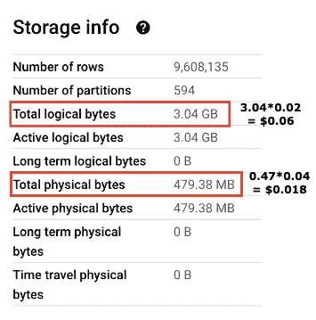

# FinOps：降低 BigQuery 存储成本的四种方法

> 原文：[`towardsdatascience.com/finops-four-ways-to-reduce-your-bigquery-storage-cost-82d99c47f139`](https://towardsdatascience.com/finops-four-ways-to-reduce-your-bigquery-storage-cost-82d99c47f139)

## 不要忽视云存储成本

[](https://medium.com/@xiaoxugao?source=post_page-----82d99c47f139--------------------------------)[](https://towardsdatascience.com/?source=post_page-----82d99c47f139--------------------------------) [小徐高](https://medium.com/@xiaoxugao?source=post_page-----82d99c47f139--------------------------------)

·发表在 [Towards Data Science](https://towardsdatascience.com/?source=post_page-----82d99c47f139--------------------------------) ·9 分钟阅读·2023 年 1 月 30 日

--


图片来源：[Nathan Dumlao](https://unsplash.com/@nate_dumlao) 在 [Unsplash](https://unsplash.com/)

在当前经济形势下，最大限度地利用现金并制定一系列成本优化策略比以往任何时候都更加重要。云服务的广泛使用不仅带来了许多商业机会，还带来了管理挑战的潜在风险，可能导致成本超支等问题。

FinOps 是一个新引入的概念，是一个不断发展的操作框架和文化转变，它通过云转型将技术、财务和业务结合起来，使组织能够获得最大业务价值。其关键支柱之一是支出控制。它并不是要削减业务，而是更清楚地了解云上的可能性，并优化资源，以更少的支出实现相同的目标。

我们今天关注的领域是 BigQuery 存储成本。许多人认为存储便宜，这并非完全错误。根据云存储和数据备份公司 Backblaze 的数据，自 2009 年以来，每千兆字节的成本已经下降了 90%。


来源：[Backblaze](https://www.backblaze.com/blog/hard-drive-cost-per-gigabyte/)

这是否意味着我们在存储上花费的钱会越来越少？不，事实是数据量在过去 10 年里激增了[1900%的增长](https://www.statista.com/statistics/871513/worldwide-data-created/)，而且[云存储价格在过去五年里停滞不前](https://www.storj.io/blog/the-high-price-of-traditional-cloud-storage)。由于通货膨胀的影响，许多供应商甚至提高了 2023 年的存储价格。因此，请确保在组织的所有层级中都有一个（接近）实时的计费仪表板，以获得这些洞察。

在这篇文章中，我想介绍四种方法来帮助你的组织降低 BigQuery 存储成本。你会对结果感到惊讶！

> 我还有一些关于成本优化的文章：[BigQuery 的 7 种成本优化实践](https://medium.com/towards-data-science/7-cost-optimization-practices-for-bigquery-6f776582e62d)，[我如何构建一个实时 BigQuery 管道以节省成本和进行容量规划](https://medium.com/towards-data-science/how-i-build-a-real-time-bigquery-pipeline-for-cost-saving-and-capacity-planning-15712c97f058)。也可以随时查看它们。

## BigQuery 存储定价模型

让我们首先看看 BigQuery 存储的定价模型（2023 年 1 月的价格）。BigQuery 提供两种定价模型：逻辑和物理。它是数据集级别的一个属性，称为`[storage_billing_model](https://cloud.google.com/bigquery/docs/updating-datasets#update_storage_billing_models)`：

+   逻辑：这是数据集的默认计费模型。数据大小是根据各个列的数据类型来计算的。例如，`INT64` 类型占用 8 个逻辑字节。

+   物理：数据大小是根据压缩后存储在磁盘上的数据来计算的。值得注意的是，它包括用于[时间旅行](https://cloud.google.com/bigquery/docs/time-travel)存储的字节（默认 7 天）。


BigQuery 存储定价模型（作者创建）

在这两种定价模型中，我们为活跃存储和长期存储支付不同的价格。BigQuery 根据修改自动标记数据为活跃或长期。

+   活跃：在过去 90 天内被修改过的表或表分区。操作包括将数据加载、复制和流式传输到表中，以及使用 DML、DDL 等。仅仅查询表不会使其变为活跃状态。

+   长期：在 90 天内没有被修改的表或表分区。活跃存储和长期存储在性能、耐久性或可用性上没有区别。

## 将 storage_billing_model 切换到物理

BigQuery 以列式格式存储数据 — [Capacitor](https://cloud.google.com/blog/products/bigquery/inside-capacitor-bigquerys-next-generation-columnar-storage-format)，这可以实现高达 1:10 的压缩比和高扫描吞吐量。物理模型按压缩字节收费，但它总是比逻辑模型便宜吗？让我们来看几个 [BigQuery 公共数据集](https://cloud.google.com/bigquery/public-data) 的例子。

+   `bigquery-public-data.cloud_storage_geo_index.landsat_index` — 这个表每天都会重新创建，因此每个字节都是活动字节，它没有时间旅行数据。这个表有大约 3GB 的逻辑字节和约 480MB 的物理字节。压缩率接近 86%。相当令人印象深刻！就价格而言，物理模型要便宜得多，因为它没有时间旅行字节，且压缩率超过 50%。



`landsat_index` 表的存储信息

+   `bigquery-public-data.google_cloud_release_notes.release_note` — 这个表每天更新。总的物理字节数多于逻辑字节数，因为它包括时间旅行数据。由于每个字节都是活动的，切换到物理计费模型实际上会花费更多。


`release_note` 表的存储信息

+   `bigquery-public-data.crypto_bitcoin.transactions` — 这个表每天都会更新，超过 90%的存储被标记为长期存储。就价格而言，物理模型稍微便宜一些。


``transactions`` 表的存储信息

目前我们不能得出一个计费模型比另一个更具成本效益的结论，因为这取决于数据集中的表是如何被修改的。但这里有一些规则可以帮助你决定：（假设压缩率超过 50%）。

1.  如果表没有（或很少有）时间旅行字节，那么选择物理模型。

1.  如果表只有活动字节并且使用默认的时间旅行设置，那么考虑保持逻辑模型。

1.  如果表中有高比例的长期字节并且使用默认的时间旅行设置，物理模型可能会更便宜，但差别不大。

一个重要的注意事项是，如果你将数据集的存储计费模型更改为使用物理字节，你不能将其更改回使用逻辑字节。因此，切换时请谨慎。

如果你不确定是否切换，可以使用 BigQuery `information_schema.table_storage_timeline_by_project` 表来每天或每月监控存储元数据，并在趋势更加稳定时进行切换。

## 使用表克隆/快照而不是表复制

如果你经常需要复制表，这个提示会很有帮助。你可以每天复制表以保持历史记录，或者将表从生产环境复制到测试环境以供测试。有四种方式可以复制表：

+   数据传输服务

+   表复制

+   表克隆

+   表快照

[数据传输服务](https://cloud.google.com/bigquery/docs/dts-introduction)可以在计划管理的基础上自动将数据移动到 BigQuery 中。它可以复制表格和数据集，并将外部数据导入 BigQuery。[表格复制](https://cloud.google.com/bigquery/docs/managing-tables#copy-table)是一种表级操作，会创建表格的完整副本。在这两种方法中，复制的表格都是“BASE TABLE”类型。这意味着 BigQuery 将按复制表格的完整存储量收费。

> 我们可以从 `information_schema.tables` 中找出表格类型。

[**表克隆**](https://cloud.google.com/bigquery/docs/table-clones-intro)

表克隆是基表的轻量、可写副本。最棒的是，你只为表克隆中与基表不同的数据存储付费。因此，初始时表克隆没有存储成本！以下图表说明了成本情况。


基表与表克隆之间的存储差异（作者创建）

初始时，当你克隆表格时，新表格没有存储成本，因为它与基表相同。只有当存在差异时才会收费，以下是公式。

```py
New base table: original table + new data - deleted data
                [0-9] + [A] + [B] + [C] - [0] - [1]
New table clone: changed data + new data
                [0]+[1]+[4]+[7]+[8]+[9]+[D]
[0] + [1] : deleted data in base table which exists in table clone
[4] + [9] : modified data in base table which exists in table clone
[7] + [8] : modified data in table clone which exists in base table
[D]: new data
```

值得注意的是，对基表的一些更改可能导致你为表克隆支付全部存储费用。例如，如果你修改了带有集群的基表，你将为该基表的任何克隆表中更新的分区支付全部存储费用。在以下图表中，P2 中的一个值更改更新了整个 P2，因此收费整个分区。


基表分区和集群化时的存储差异（作者创建）

拥有分区可以始终帮助降低表克隆的存储成本，因为 BigQuery 仅对修改过的数据分区收费，而不是整个表格。

当你将表复制到测试项目中用于测试目的，并且只更新表格的一部分（例如 20%）时，推荐使用表克隆。在这种情况下，你可以节省原始存储成本的 80%。在最坏的情况下，当你更新整个表格时，表克隆的存储成本将与使用普通表格复制相同。因此，绝对值得一试！

但有一些限制。例如，你不能创建视图、物化视图或外部表的克隆。表克隆必须与基表位于同一地区。此功能目前处于预览阶段（2023 年 1 月），可能支持有限。

[**表快照**](https://cloud.google.com/bigquery/docs/table-snapshots-intro)

表克隆的另一种变体称为表快照。表克隆和表快照之间的区别在于表快照是只读的。它保留了基表在特定时间的内容。对于存储费用，BigQuery 仅对基表中不再存在或已更改的数据收取费用。例如：


基表与表快照之间的存储差异（作者创建）

类似于表克隆，初始存储成本为零。以下是基表更新时的费用。

```py
New table snapshot: deleted from or changed in base table
                [0]+[1]+[4]+[9]
[0] + [1] : deleted data in base table which exists in table snapshot
[4] + [9] : modified data in base table which exists in table snapshot
```

基表中的分区也有助于降低表快照的存储成本。在限制方面，它们类似于表克隆。但表快照是 GA 功能，因此有更多文档支持，并获得 GCP 的更多支持。

如果您希望保留表的历史记录超过 7 天，表快照是有益的。通过 BigQuery 时间旅行，您只能访问 7 天前的表数据。表快照可以根据您的需要保留只读数据。

## 设置表过期时间

节省成本的一个简单方法是删除未使用的表或表分区。我们经常在测试环境中遇到这样的表。BigQuery 允许我们在分区级、表级和数据集级别设置过期时间。

```py
-- partition level
ALTER TABLE mydataset.mytable SET OPTIONS (partition_expiration_days = 5);
-- table level
ALTER TABLE mydataset.mytable SET OPTIONS (expiration_timestamp = TIMESTAMP '2025-02-03 12:34:56');
-- dataset level
ALTER SCHEMA mydataset SET OPTIONS( default_table_expiration_days = 3.75);
```

到期后，表或分区将自动删除。请注意，如果您更新数据集的默认表过期时间，它只会适用于新创建的表。

## 将旧数据保留在 BigQuery 中，而不是导出

BigQuery 不是传统的数据仓库。它已经发展成一个数据湖仓，这是一个结合了数据仓库和数据湖最佳元素的新架构。

我们可以通过查看它们的定价模型来感知这一点。逻辑模型中的活动和长期字节的存储成本与云存储中的标准和近线存储类型相同。然而，云存储有操作费用，如下表所示。


GCP 云存储定价模型（作者创建）

BigQuery 没有这种操作费用，简单查询长期表不会将其更改为活动状态。因此，从成本和操作的角度来看，将旧数据保留在 BigQuery 是一个更可取的选择。

## 结论

一如既往，希望您觉得这篇文章鼓舞人心且有用。2022 年是运营业务最艰难的一年之一。各种挑战促使工程师从不同的角度审视他们的技术堆栈，从如何扩展系统到如何控制成本以提高业务的韧性。

如果您使用 BigQuery，请与您的同事分享这四个小贴士。我相信它们能对您的业务产生巨大影响，并使公司能够将资金分配到更关键的领域。如果您有任何想法，请在评论中告知我。谢谢！
