# 使用 Apache Spark 进行机器学习的第一步

> 原文：[`towardsdatascience.com/first-steps-in-machine-learning-with-apache-spark-672fe31799a3?source=collection_archive---------8-----------------------#2023-01-04`](https://towardsdatascience.com/first-steps-in-machine-learning-with-apache-spark-672fe31799a3?source=collection_archive---------8-----------------------#2023-01-04)

## Spark MLlib 包的基本概念和主题

[](https://joaopedro214.medium.com/?source=post_page-----672fe31799a3--------------------------------)[](https://towardsdatascience.com/?source=post_page-----672fe31799a3--------------------------------) [João Pedro](https://joaopedro214.medium.com/?source=post_page-----672fe31799a3--------------------------------)

·

[关注](https://medium.com/m/signin?actionUrl=https%3A%2F%2Fmedium.com%2F_%2Fsubscribe%2Fuser%2Fb111eee95c&operation=register&redirect=https%3A%2F%2Ftowardsdatascience.com%2Ffirst-steps-in-machine-learning-with-apache-spark-672fe31799a3&user=Jo%C3%A3o+Pedro&userId=b111eee95c&source=post_page-b111eee95c----672fe31799a3---------------------post_header-----------) 发表在 [Towards Data Science](https://towardsdatascience.com/?source=post_page-----672fe31799a3--------------------------------) ·11 分钟阅读·2023 年 1 月 4 日 [](https://medium.com/m/signin?actionUrl=https%3A%2F%2Fmedium.com%2F_%2Fvote%2Ftowards-data-science%2F672fe31799a3&operation=register&redirect=https%3A%2F%2Ftowardsdatascience.com%2Ffirst-steps-in-machine-learning-with-apache-spark-672fe31799a3&user=Jo%C3%A3o+Pedro&userId=b111eee95c&source=-----672fe31799a3---------------------clap_footer-----------)

--

[](https://medium.com/m/signin?actionUrl=https%3A%2F%2Fmedium.com%2F_%2Fbookmark%2Fp%2F672fe31799a3&operation=register&redirect=https%3A%2F%2Ftowardsdatascience.com%2Ffirst-steps-in-machine-learning-with-apache-spark-672fe31799a3&source=-----672fe31799a3---------------------bookmark_footer-----------)

照片来自 [Element5 Digital](https://unsplash.com/es/@element5digital?utm_source=medium&utm_medium=referral) 在 [Unsplash](https://unsplash.com/?utm_source=medium&utm_medium=referral)

# 介绍

Apache Spark 是大数据背景下数据处理和分析的主要工具之一。它是一个非常完整（且复杂）的数据处理框架，其功能大致可以分为四组：SparkSQL & DataFrames，用于通用数据处理需求；Spark Structured Streaming，用于处理数据流；Spark MLlib，专注于机器学习和数据科学；GraphX，图形处理 API。

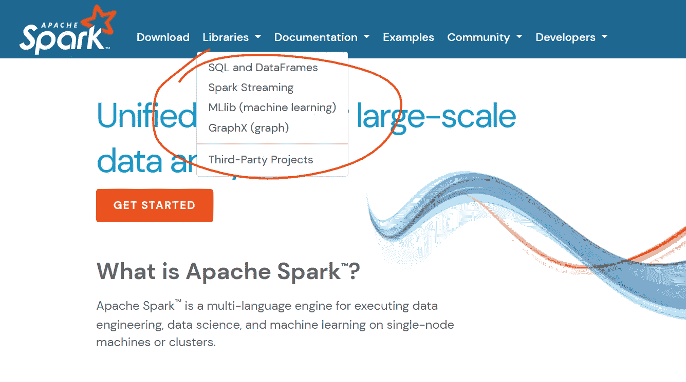

官方文档中的 Spark 库部分。打印由作者提供。

我已经在其他文章中介绍了前两个：[创建一个数据仓库的 ETL 过程](https://joaopedro214.medium.com/creating-a-simple-etl-pipeline-with-apache-spark-825cc17c8cf6) 和 将 Spark 和 Kafka 集成进行流处理。今天我们要讨论第三个——让我们使用 Spark MLlib 进行机器学习。

机器学习在我心中占有特殊的位置，因为它是我进入数据科学领域的入口门槛，并且像你们中的许多人一样，我是通过经典的 [Scikit-Learn](https://scikit-learn.org/stable/) 库开始的。

我本可以写一整篇文章来说明为什么 Scikit-learn 库是如此出色的软件。它对初学者友好，易于使用，涵盖了大部分机器学习周期，文档写得非常好，等等。

但我为什么要谈论这个呢？如果你像我一样，习惯于使用 sklearn 编码，请记住 Apache Spark 的路径并不那么直接。虽然不难，但学习曲线更陡峭。

在这篇文章中，我们将学习如何通过一个动手示例完成数据预处理、特征工程、模型训练和验证的“完整机器学习周期”。

# Apache Spark 概述

Apache Spark 是一个基于分布式内存的数据转换引擎。它旨在在分布式环境中运行，通过在机器之间并行处理，利用其惰性计算哲学和查询优化来实现高性能转换。

这就是学习这种工具的主要原因——性能。

即使进行了优化，当数据集变得过大时，Sklearn 包（以及其他 Python 包）也会遇到困难。这是 Spark 能够覆盖的潜在盲点之一。由于 Spark 具有横向扩展的能力，因此更容易增加计算能力来训练大数据上的模型。

# 问题

我选择了 [Avocado Price Dataset](https://www.kaggle.com/datasets/neuromusic/avocado-prices) 来进行这个项目。我们在这个数据集中的任务是预测给定牛油果类型、日期、可用牛油果袋数及其他特征的平均牛油果价格。有关更多信息，请查看 [Kaggle 数据集页面](https://www.kaggle.com/datasets/neuromusic/avocado-prices)。

## 环境设置

你只需要安装 docker 和 docker-compose。代码可以在 [GitHub](https://github.com/jaumpedro214/spark-ml-first-steps/settings) 上找到。

文章中描述的架构（在 *docker-compose.yaml* 文件中）如下面的图像所示。

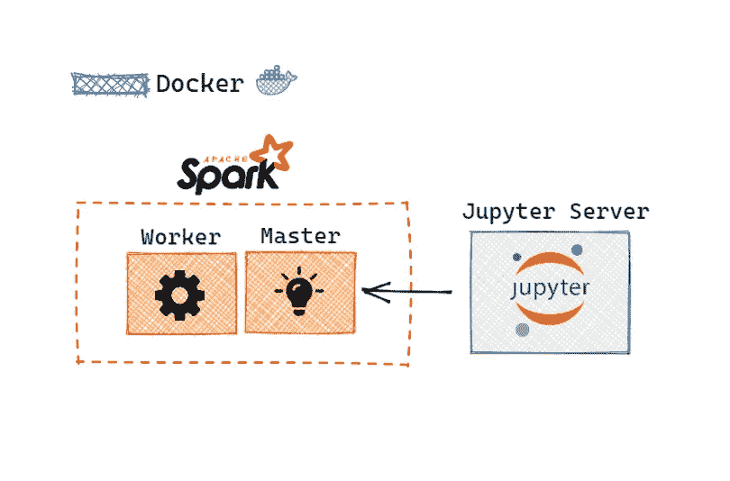

项目的架构与 Docker 容器。图片由作者提供。

所有代码都在一个 [jupyter/pyspark-notebook](https://hub.docker.com/r/jupyter/pyspark-notebook) 容器内开发，所有 pyspark 依赖项都已配置好。

要启动环境，只需运行：

```py
docker-compose up
```

# 实现

我们的目标是学习如何使用 Spark 实现我们通常的机器学习流水线，涵盖内容包括：加载数据并将其分为训练集/测试集，清理数据，预处理+特征工程，模型定义，超参数调整和最终评分。

以下章节将详细说明如何完成这些步骤。

## 连接到 Spark

首先需要连接到 Spark 集群，这一步相当简单。

```py
from pyspark.sql import SparkSession
import pyspark.sql.functions as F

# SparkSession
URL_SPARK = "spark://spark:7077"

spark = (
    SparkSession.builder
    .appName("spark-ml")
    .config("executor.memory", "4g")
    .master(URL_SPARK)
    .getOrCreate()
)
```

在第一次运行时可能需要几秒钟。

## 加载数据

现在是处理数据的时候了。这部分与 Spark 的 MLlib 包无关，仅涉及使用 Spark SQL 加载数据。

```py
df_avocado = spark.read.csv(
  "/data/avocado.csv", 
  header=True, 
  inferSchema=True
)

# cache data
df_avocado.cache()
df_avocado.show(4)
```

由于 Spark 是 [惰性计算](https://stackoverflow.com/questions/38027877/spark-transformation-why-is-it-lazy-and-what-is-the-advantage) 的，缓存数据集在内存中可以加快后续步骤的执行。

让我们查看一下数据：

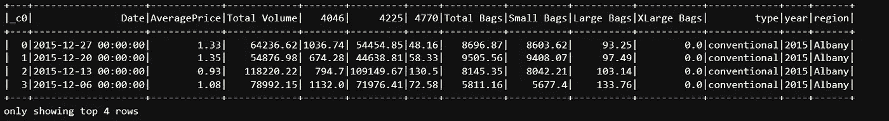

关于列的更多细节可以在原始数据集的 Kaggle 页面上找到。

接下来，我们使用 *randomSplit()* 方法将 DataFrame 拆分为训练集（75%）和测试集（25%）。

```py
df_avocado_train, df_avocado_test = df_avocado.randomSplit([0.75, 0.25], seed=214)
```

## 预处理数据

在继续之前，让我们了解一下我们将使用的工具。Spark MLlib 包有两种主要类型的对象：[变换器和估算器](https://spark.apache.org/docs/1.6.0/ml-guide.html)。

**变换器** 是能够变换 DataFrame 的对象。它们接收原始 DataFrame 并返回处理后的 DataFrame。常见的变换器包括 PolynomialExpansion、SQLTransformer 和 VectorAssembler（非常重要，后面会讨论）。

**估算器**，另一方面，是需要在数据上进行拟合/训练以生成变换器的对象。这些包括机器学习预测器（线性回归、逻辑回归、决策树等）、降维算法（PCA、卡方选择器），以及其他列变换器（标准化器、最小最大缩放器、TF-IDF 等）。

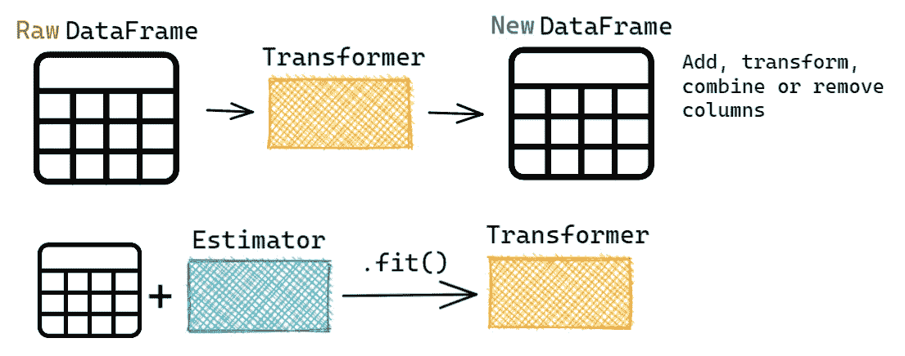

Spark MLlib 上的变换器和估算器。作者提供的图片。

我们先用 **SQLTransformer** 来处理数据。这是一个强大的变换器，允许使用 SQL 查询选择和变换列。

```py
COLUMNS = ['AveragePrice', 'type']
COLUMNS = [f"`{col}`" for col in COLUMNS]

LOG_COLUMNS =  ['4225', '4770', 'Small Bags', 'Large Bags', 'XLarge Bags']
LOG_COLUMNS = [f"LOG(`{col}`+1) AS `LOG {col}`" for col in LOG_COLUMNS]

sql_trans = SQLTransformer(
    statement=f"""

    SELECT
    {', '.join(COLUMNS)}
    , {', '.join(LOG_COLUMNS)}
    ,YEAR(__THIS__.Date)-2000 AS year
    ,MONTH(__THIS__.Date) AS month

    FROM __THIS__

    """
)

# Visualize the data
sql_trans.transform(df_avocado_train).show(4)
```

上面的代码选择了 *AveragePrice* 和 *type* 列，使用对数函数转换了数值列，并创建了两个新列，提取 *year*（2000 年后）和 *month*。

> __THIS__ 是当前正在变换的 DataFrame 的默认名称。

结果：

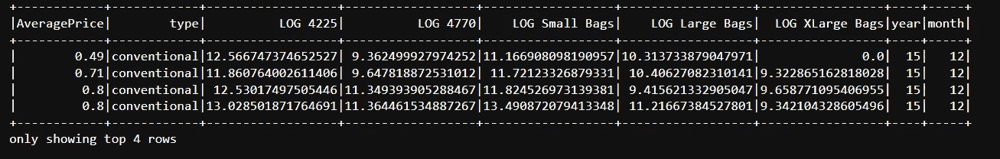

缩放是在数据预处理中的一种常见做法。让我们使用最小-最大缩放技术缩放 **month** 列，将所有值放在 [0, 1] 区间内。MinMaxScaler 是一种 **估算器**，因此需要先在数据上进行拟合，然后才能用来变换数据。

大多数估算器（包括所有预测模型）要求输入列为向量形式。向量是一种在 Spark MLlib 中主要使用的特殊列类型。它正如名字所示，是一个固定大小的数字数组。

为了将列合并成一个单一的向量列，我们使用 VectorAssembler Transformer。

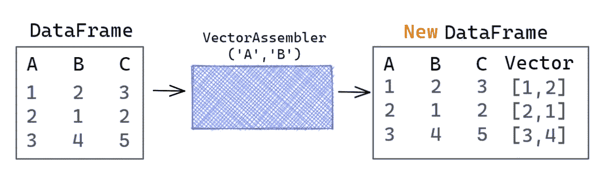

Vector Assembler 正在运行。图片来自作者。

```py
from pyspark.ml.feature import MinMaxScaler

# Creating a Month vector column
month_vec_ass = VectorAssembler(inputCols=['month'], outputCol='month_vec')

df_avocado_month_ass = month_vec_ass.transform(sql_trans.transform(df_avocado_train))

# Scaling the month column
month_scaler = MinMaxScaler(inputCol='month_vec', outputCol='month_scaled')
month_scaler = month_scaler.fit(df_avocado_month_ass)

month_scaler\
  .transform(df_avocado_month_ass)\
  .select( ['month', 'month_vec', 'month_scaled'] )\
  .show(10)
```

下面的图片详细说明了这个过程。

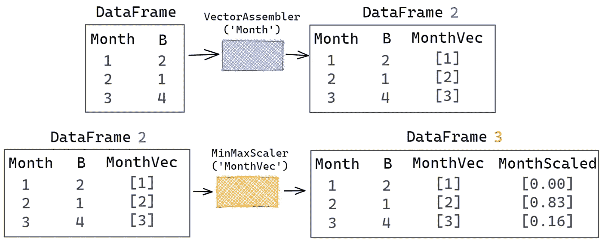

对列应用 MinMaxScaler 的过程。图片来自作者。

结果：

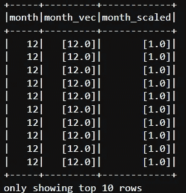

牢记这些概念，只需了解可用的变换器并在我们的管道中使用它们。

例如，列**type**有两个值，"*conventional*"和"*organic*"，需要映射成数字。负责此操作的变换器是 StringIndexer。

它将列中的每个类别分配一个数值。由于“type”列只有两个类别，它将被转换成一个只有两个值的列：0 和 1，这相当于应用了独热编码技术。

```py
str_indexer = StringIndexer(inputCol="type", outputCol="type_index")

str_indexer = str_indexer.fit(df_avocado_train)

str_indexer\
  .transform(df_avocado_train)\
  .select( ["type", "type_index"] )\
  .show(4)
```

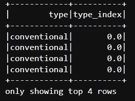

从现在开始，我将总结所做的工作。

生成的数值特征（所有列，除了*type_index*）被组装成一个名为“features_num”的单一向量，这个最终向量通过一个 StandardScaler。

```py
# Apply transformations
## SQL transformer
df_avocado_train_transformed = sql_trans.transform(df_avocado_train)

## String indexer
df_avocado_train_transformed = str_indexer.transform(df_avocado_train_transformed)

## Month scaler (vector assembler + minmax scaler)
df_avocado_train_transformed = month_vec_ass.transform(df_avocado_train_transformed)
df_avocado_train_transformed = month_scaler.transform(df_avocado_train_transformed)

# Join all features into a single vector
numerical_vec_ass = VectorAssembler(
    inputCols=[
      'year', 'month_scaled', 'LOG 4225', 
      'LOG 4770', 'LOG Small Bags', 
      'LOG Large Bags', 'LOG XLarge Bags'
    ],
    outputCol='features_num'
)
df_avocado_train_transformed = numerical_vec_ass.transform(df_avocado_train_transformed)

# Join all categorical features into a single vector
categorical_vec_ass = VectorAssembler(
    inputCols=['type_index'],
    outputCol='features_cat'
)
df_avocado_train_transformed = categorical_vec_ass.transform(df_avocado_train_transformed)

# See the result
df_avocado_train_transformed.select(['features_cat', 'features_num', 'AveragePrice']).show(4, False)
```

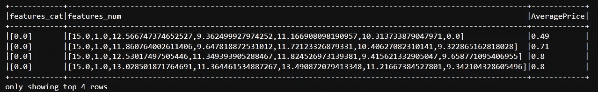

```py
# Scaling the numerical features using a StandardScaler
std_scaler = StandardScaler(
    inputCol="features_num",
    outputCol="features_scaled",
    withStd=True,
    withMean=True
)

std_scaler = std_scaler.fit(df_avocado_train_transformed)
std_scaler.transform(df_avocado_train_transformed).select(['features_scaled']).show(5, False)
```

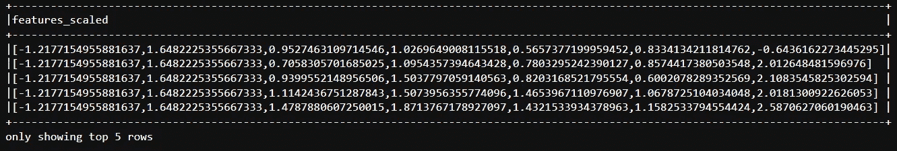

然后将类别列“type_index”添加到最终向量中。

最后一步是将创建的所有变换器合并成一个**管道**。管道只是一个用于封装一组变换器和估算器的对象，以便将它们顺序应用于数据。这有助于避免单独处理每个中间转换步骤（如我们至今所做的）。

```py
# Machine learning pipeline
from pyspark.ml import Pipeline

# Create a preprocessing pipeline
prepro_pipe = Pipeline(stages=[
    sql_trans,
    str_indexer,
    month_vec_ass,
    month_scaler,
    numerical_vec_ass,
    categorical_vec_ass,
    std_scaler,

    # Join all features into a single vector
    VectorAssembler(
        inputCols=['features_scaled', 'features_cat'],
        outputCol='features'
    ),
])

# Fit the pipeline
pipeline_model = prepro_pipe.fit(df_avocado_train)

# Transform the data
df_avocado_train_transformed = pipeline_model.transform(df_avocado_train)

# See the result
df_avocado_train_transformed.select(['features', 'AveragePrice']).show(4, False)
```

最终结果：

```py
+--------------------------------------------------------------------------------------------------------------------------------------------+------------+
|features                                                                                                                                    |AveragePrice|
+--------------------------------------------------------------------------------------------------------------------------------------------+------------+
|[-1.2177154955881637,1.6482225355667333,0.9527463109714546,1.0269649008115518,0.5657377199959452,0.8334134211814762,-0.6436162273445295,0.0]|0.49        |
|[-1.2177154955881637,1.6482225355667333,0.7058305701685025,1.0954357394643428,0.7803295242390127,0.8574417380503548,2.012648481596976,0.0]  |0.71        |
|[-1.2177154955881637,1.6482225355667333,0.9399552148956506,1.5037797059140563,0.8203168521795554,0.6002078289352569,2.1083545825302594,0.0] |0.8         |
|[-1.2177154955881637,1.6482225355667333,1.1142436751287843,1.5073956355774096,1.4653967110976907,1.0678725104034048,2.0181300922626053,0.0] |0.8         |
+--------------------------------------------------------------------------------------------------------------------------------------------+------------+
only showing top 4 rows
```

## 模型训练

这就是我们都在等待的时刻。

在经过漫长的数据预处理路径之后，所有特征已经以其所需的最终向量形式存在，我们准备好训练模型了。

不幸的是，这部分将比前一部分短很多 ¯\_(ツ)_/¯

如前所述，ML 模型只是估算器，因此过程会重复：实例化、拟合和转换。

让我们训练一个线性回归模型：

```py
from pyspark.ml.regression import LinearRegression

# Create a linear regression model
lin_reg = LinearRegression(
    featuresCol='features',
    labelCol='AveragePrice',
    predictionCol='prediction',

    # Hyperaparameters
    maxIter=1000,
    regParam=0.3,       # Regularization
    elasticNetParam=0.8 # Regularization mixing parameter. 1 for L1, 0 for L2.
)
```

必须指定特征列、目标/标签列以及预测列的名称。就像我们遇到的其他估算器一样，ML 模型只会向 DataFrame 中添加另一列。

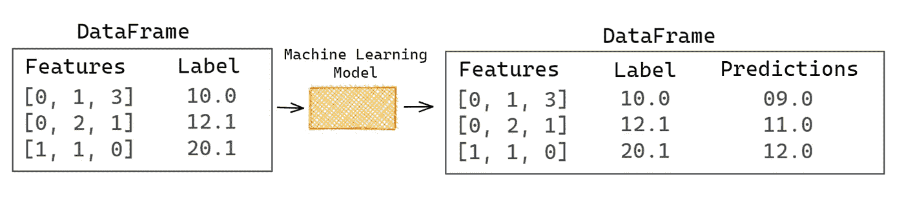

机器学习模型只是一个估算器。图片来自作者。

```py
# Fit the model
lin_reg_model = lin_reg.fit(df_avocado_train_transformed)

# See the output
df_avocado_train_pred = lin_reg_model.transform(df_avocado_train_transformed)
df_avocado_train_pred.select(
  ['features', 'AveragePrice', 'prediction']
).show(4, False)
```

见下图结果：

```py
+--------------------------------------------------------------------------------------------------------------------------------------------+------------+------------------+
|features                                                                                                                                    |AveragePrice|prediction        |
+--------------------------------------------------------------------------------------------------------------------------------------------+------------+------------------+
|[-1.2177154955881637,1.6482225355667333,0.9527463109714546,1.0269649008115518,0.5657377199959452,0.8334134211814762,-0.6436162273445295,0.0]|0.49        |1.4003505112793717|
|[-1.2177154955881637,1.6482225355667333,0.7058305701685025,1.0954357394643428,0.7803295242390127,0.8574417380503548,2.012648481596976,0.0]  |0.71        |1.4003505112793717|
|[-1.2177154955881637,1.6482225355667333,0.9399552148956506,1.5037797059140563,0.8203168521795554,0.6002078289352569,2.1083545825302594,0.0] |0.8         |1.4003505112793717|
|[-1.2177154955881637,1.6482225355667333,1.1142436751287843,1.5073956355774096,1.4653967110976907,1.0678725104034048,2.0181300922626053,0.0] |0.8         |1.4003505112793717|
+--------------------------------------------------------------------------------------------------------------------------------------------+------------+------------------+
only showing top 4 rows
```

## 模型评估

要评估模型的性能，我们需要一个**评估器**。我认为它的名字已经很直观了，它将计算真实标签与模型预测之间的性能指标。

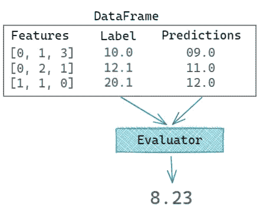

评估器在操作中。图像来源：作者。

在下面的单元格中，实例化一个 RegressionEvaluator 来测量预测值与实际值（在训练数据上）之间的 RMSE（*均方根误差*）。

```py
from pyspark.ml.evaluation import RegressionEvaluator

reg_eval = RegressionEvaluator(
    labelCol='AveragePrice',
    predictionCol='prediction',
    metricName='rmse' # Root mean squared error
)

# Evaluate the model
reg_eval.evaluate(df_avocado_train_pred)

# Output >> 0.3978489578943717
```

## 使用交叉验证进行超参数调优

[超参数调优](https://en.wikipedia.org/wiki/Hyperparameter_optimization)是机器学习管道中的最后阶段之一，因此我们的冒险即将结束。

在这一步，我们测试模型/管道的多个超参数变体，以根据选择的指标挑选最佳的一个。常用的方法是使用[交叉验证技术](https://scikit-learn.org/stable/modules/cross_validation.html)。

在这里，我们遇到了今天文章中的最后构建块——**ParamGridBuilder**和**CrossValidator**。

从 ParamGridBuilder 开始：这是用来构建超参数网格的对象。

```py
from pyspark.ml.tuning import ParamGridBuilder, CrossValidator

ml_pipeline = Pipeline(stages=[
    prepro_pipe, # Preprocessing pipeline
    lin_reg      # Linear regression model
])

param_grid = ParamGridBuilder() \
    .addGrid(lin_reg.regParam, [0.0, 0.1, 0.3, 0.5]) \
    .addGrid(lin_reg.elasticNetParam, [0.0, 0.5, 1.0]) \
    .build()
```

在上面的代码中，为线性回归的*regParam*和*elasticNetParam*指定了几个值。重要的是要注意，原始对象用于引用这些参数。

然后，**CrossValidator**将所有内容（估计器、超参数网格和评估器）结合起来……

```py
reg_eval = RegressionEvaluator(
    labelCol='AveragePrice',
    predictionCol='prediction',
    metricName='rmse' # Root mean squared error
)

# Join everything together using a CrossValidator object.
crossval_ml = CrossValidator(
    estimator=ml_pipeline, 
    estimatorParamMaps=param_grid, 
    evaluator=reg_eval, 
    numFolds=4
)
```

… 并在调用方法*fit*()时，对给定数量的折数进行交叉验证。

```py
crossval_ml_model = crossval_ml.fit(df_avocado_train)
```

结果通过拟合的交叉验证对象来访问。下面的代码打印出最佳模型的名称和得分。

```py
best_model = crossval_ml_model.bestModel
best_score = crossval_ml_model.avgMetrics[0]

print("Best model: ", best_model)
print("Best score: ", best_score)

# Output >>>
# > Best model:  PipelineModel_dc90de555ac1
# > Best score:  0.2833541578138277
```

让我们还查看一下线性回归的最佳参数。

```py
# The last stage in the pipeline is the Linear Regression
best_lin_reg_params = best_model.stages[-1].extractParamMap()

print("Best score (RMSE):", best_score, end="\n\n")
for parameter, value in best_lin_reg_params.items():
    print(f"{str(parameter):50s}, {value}")
```

输出：

```py
Best score (RMSE): 0.2833541578138277

LinearRegression_eeaa1d8bf6ea__aggregationDepth   , 2
LinearRegression_eeaa1d8bf6ea__elasticNetParam    , 0.0
LinearRegression_eeaa1d8bf6ea__epsilon            , 1.35
LinearRegression_eeaa1d8bf6ea__featuresCol        , features
LinearRegression_eeaa1d8bf6ea__fitIntercept       , True
LinearRegression_eeaa1d8bf6ea__labelCol           , AveragePrice
LinearRegression_eeaa1d8bf6ea__loss               , squaredError
LinearRegression_eeaa1d8bf6ea__maxBlockSizeInMB   , 0.0
LinearRegression_eeaa1d8bf6ea__maxIter            , 1000
LinearRegression_eeaa1d8bf6ea__predictionCol      , prediction
LinearRegression_eeaa1d8bf6ea__regParam           , 0.0
LinearRegression_eeaa1d8bf6ea__solver             , auto
LinearRegression_eeaa1d8bf6ea__standardization    , True
LinearRegression_eeaa1d8bf6ea__tol                , 1e-06
```

## 在测试集上评估最佳模型

所有的一切都汇聚到这一刻。这是我们在测试数据上衡量最佳模型性能的步骤。

幸运的是，这里没有新的内容需要学习，这只是将最佳模型应用于测试数据，并将结果传递给评估器的问题。

```py
df_avocado_test_pred = best_model.transform(df_avocado_test)

# show scores
print(reg_eval.evaluate(df_avocado_test_pred))

# Output
# > 0.28368085199676235
```

性能与交叉验证步骤中获得的性能非常相似。

# 结论

随着 ML 应用的普及和其要求的复杂化，掌握各种用途不同的工具知识变得至关重要。

在这篇文章中，我们了解了如何通过 Spark MLlib 模块在机器学习的背景下使用 Apache Spark。通过一个实际项目，我们创建了一个通用的 ML 管道，涵盖了该模块的主要概念和基本主题。

学习一种新工具主要涉及熟悉其词汇，*即*，理解组成它的基本部分以及如何利用它们来解决问题。因此，我们专注于理解 Spark MLlib 的基础知识：估计器、转换器、评估器和管道。

我希望这篇简短的文章能帮助你理解 Spark 如何在机器学习应用中使用。

一如既往，这篇文章只是略微触及了所探讨主题的表面，因此我强烈建议进一步阅读，见下文的参考文献。

感谢阅读 ;)

# 参考文献

> 所有代码都可以在这个[GitHub 仓库](https://github.com/jaumpedro214/spark-ml-first-steps)中找到。
> 
> 使用的数据 — [鳄梨价格](https://www.kaggle.com/datasets/neuromusic/avocado-prices)*,* [*ODbL v1.0：开放数据库*](https://opendatacommons.org/licenses/odbl/1-0/)*, Kaggle.*

[1] Chambers, B., & Zaharia, M. (2018). *Spark: 终极指南：简化的大数据处理*。“ O’Reilly Media, Inc.”

[2] Spark 示例 — [`sparkbyexamples.com/`](https://sparkbyexamples.com/)

[3] Géron, A. (2022). *动手实践机器学习：使用 Scikit-Learn、Keras 和 TensorFlow*。“ O’Reilly Media, Inc.”.

[4] 概述：估算器、转换器和管道 — spark.ml。[Spark 官方文档](https://spark.apache.org/docs/1.6.0/ml-guide.html).
