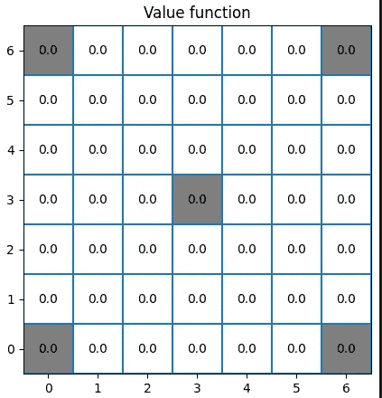
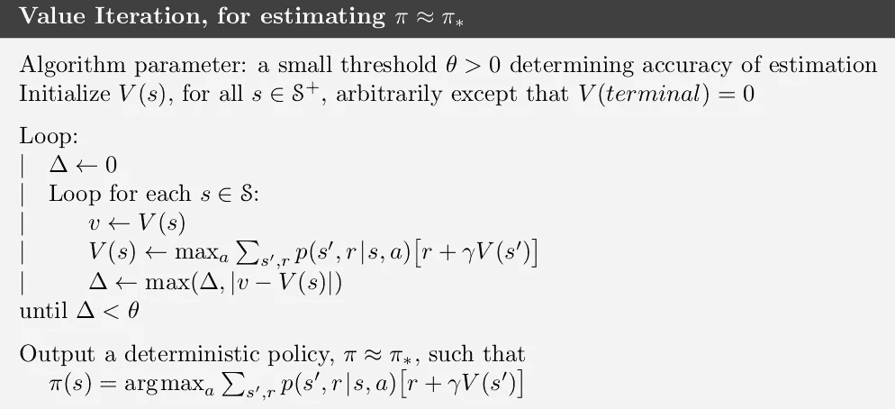

# 使用 Python 探索强化学习的第一步

> 原文：[`towardsdatascience.com/first-steps-in-the-world-of-reinforcement-learning-using-python-b843b76538e3`](https://towardsdatascience.com/first-steps-in-the-world-of-reinforcement-learning-using-python-b843b76538e3)

## 原始的 Python 实现，展示了如何在强化学习的基本世界之一——网格世界中找到最佳位置

[](https://eligijus-bujokas.medium.com/?source=post_page-----b843b76538e3--------------------------------)[](https://towardsdatascience.com/?source=post_page-----b843b76538e3--------------------------------) [Eligijus Bujokas](https://eligijus-bujokas.medium.com/?source=post_page-----b843b76538e3--------------------------------)

·发表于 [Towards Data Science](https://towardsdatascience.com/?source=post_page-----b843b76538e3--------------------------------) ·15 分钟阅读·2023 年 1 月 13 日

--


网格世界矩阵；作者提供的照片

本文的目的是使用 Python 代码和注释介绍强化学习（以下简称**RL**）中的基本概念和定义。

这篇文章深受以下伟大强化学习课程的启发：[`www.coursera.org/learn/fundamentals-of-reinforcement-learning`](https://www.coursera.org/learn/fundamentals-of-reinforcement-learning)

理论见书¹：[`www.incompleteideas.net/book/RLbook2020.pdf`](http://www.incompleteideas.net/book/RLbook2020.pdf)

我所有的强化学习实验代码可以在我的 Gitlab 仓库中查看：[`github.com/Eligijus112/rl-snake-game`](https://github.com/Eligijus112/rl-snake-game)

网格世界问题是强化学习中的一个经典问题，我们希望为代理创建一个优化的策略以穿越网格。

网格是一个方形的单元格矩阵，代理可以在每个单元格中向任意四个方向（上、下、左、右）移动。代理每移动一步会获得-1 的奖励，若达到目标单元格则获得+10 的奖励。奖励的数值是任意的，可以由用户定义。

在强化学习框架中，代理被正式定义为**做出采取何种行动的决策的组件**。代理在具体的时间步骤中采取行动。

在网格世界设置中，整个动作集合由以下集合定义：


动作集合

或


动作集合

无论我们的代理处于何处，它只能向左、向右、向上或向下移动。现在让我们定义并可视化我们的网格世界：

```py
def array_index_to_matplot_coords(i: int, j: int, n_cols: int) -> Tuple[int, int]:
    """Converts an array index to a matplot coordinate"""
    x = j
    y = n_cols - i - 1
    return x, y

def plot_matrix(
    M: np.array, 
    goal_coords: list = [],
    img_width: int = 5, 
    img_height: int = 5, 
    title: str = None,
    annotate_goal: bool = True
    ) -> None: 
    """
    Plots a matrix as an image.
    """
    height, width = M.shape

    fig = plt.figure(figsize=(img_width, img_width))
    ax = fig.add_subplot(111, aspect='equal')

    for y in range(height):
        for x in range(width):
            # By default, the (0, 0) coordinate in matplotlib is the bottom left corner,
            # so we need to invert the y coordinate to plot the matrix correctly
            matplot_x, matplot_y = array_index_to_matplot_coords(x, y, height)

            # If there is a tuple of (x, y) in the goal_coords list, we color the cell gray 
            if (x, y) in goal_coords:
                ax.add_patch(matplotlib.patches.Rectangle((matplot_x - 0.5, matplot_y - 0.5), 1, 1, facecolor='gray'))
                if annotate_goal:
                    ax.annotate(str(M[x][y]), xy=(matplot_x, matplot_y), ha='center', va='center')
            else: 
                ax.annotate(str(M[x][y]), xy=(matplot_x, matplot_y), ha='center', va='center')

    offset = .5    
    ax.set_xlim(-offset, width - offset)
    ax.set_ylim(-offset, height - offset)

    ax.hlines(y=np.arange(height+1)- offset, xmin=-offset, xmax=width-offset)
    ax.vlines(x=np.arange(width+1) - offset, ymin=-offset, ymax=height-offset)

    plt.title(title)
    plt.show()
```

```py
# Importing the array library
import numpy as np

# Defining the number of blocks of a n x n grid 
n = 7

# Defining the value for the hole and the goal
goal = 10
step = -1

# Initiating an empty dataframe of size n x n
R = np.ones((n,n))

# Defining the coordinates of the goal
goal_coords = [(0, n-1), (n-1, 0), (0, 0), (n-1, n-1), (n // 2, n // 2)]

# Adding the goal values to the center and the corners
for goal_coord in goal_coords:
    R[goal_coord[1], goal_coord[0]] = goal

# Every other step is -1
R[R == 1] = step

# Converting the G matrix to int 
R = R.astype(int)

# Ploting
plot_matrix(R, goal_cords, title='Gridworld')
```


网格世界；作者照片

在上述示例中，我们定义了第一个所需的矩阵——**R**矩阵或**奖励矩阵**。目标位于网格世界的中心和角落。当代理进入其中一个单元格时，它会获得该单元格的奖励值。

让我们定义另一个关键矩阵——状态矩阵**S**：

```py
S = np.arange(0, n*n).reshape(n, n)

plot_matrix(S, goal_coords, title='State space')
```


状态空间；作者照片

在我们定义的网格世界中，总共有**49 个状态**，代理可以处于其中的任何一个状态。每个状态可以通过矩阵中的整数来识别。

假设我们的代理在状态 17 并向下移动。该动作值**，表示为 q，**是：


状态 17 中动作‘down’的动作值

动作值为 10，因为网格 24 的奖励等于 10。因此，当我们使用动作值时，需要注意网格**S**索引和奖励矩阵**G**。可以很容易猜到，从同一状态向右移动的奖励是-1：


状态 17 中动作‘right’的动作值

一般来说，函数 q，称为动作值，将一个数字映射到状态—动作对：


动作值函数

数字越高，对代理的“奖励”就越大，因此，代理总是希望采取**最大化****当前状态下的 q**的动作。

到目前为止，我们已经定义了矩阵**R**（奖励）和**S**（状态）。另一个关键矩阵是状态值矩阵**V**。**V**矩阵的维度与 S 和 G 矩阵相同，每个**V**矩阵中的元素评估给定状态的“好坏”。这里的“好坏”指的是方程：


状态 s 的值[1]

我们可以将上述方程读作：

> 给定策略 pi 的状态 s 的值等于在时间步 t 给定状态为 s 时的期望回报。

我们计算所有状态的上述值并将其存储在矩阵**V**中。我们在这里引入了新的变量，所以让我们定义它们。


时间步 t 的总回报[1]


折扣因子[1]

**K**索引称为终端状态，其中代理达到网格世界中的任意目标。换句话说，**每个状态中 G 的值表示从给定状态开始朝向目标的代理路径的折扣奖励总和。值越大，状态越受欢迎。**

状态方程中的 pi 项称为**策略**，是采取状态 s 中某一动作的概率：


策略

让我们初始化初始值矩阵**V**：

```py
# Initiating the empty Value function 
V = np.zeros((n, n))

plot_matrix(V, goal_coords, title='Value function')
```



初始状态值矩阵；作者照片

由于我们尚未探索我们创建的网格世界，因此所有状态的回报都是 0。

我们需要的最后一个矩阵是策略矩阵**P**。

```py
def plot_policy_matrix(P: dict, S:np.array, goal_coords: list = [], img_width: int = 5, img_height: int = 5, title: str = None) -> None: 
    """ 
    Plots the policy matrix out of the dictionary provided; The dictionary values are used to draw the arrows 
    """
    height, width = S.shape

    fig = plt.figure(figsize=(img_width, img_width))
    ax = fig.add_subplot(111, aspect='equal')
    for y in range(height):
        for x in range(width):
            matplot_x, matplot_y = array_index_to_matplot_coords(x, y, height)

            # If there is a tuple of (x, y) in the goal_coords list, we color the cell gray 
            if (x, y) in goal_coords:
                ax.add_patch(matplotlib.patches.Rectangle((matplot_x - 0.5, matplot_y - 0.5), 1, 1, facecolor='gray'))

            else:
                # Adding the arrows to the plot
                if 'up' in P[S[x, y]]:
                    plt.arrow(matplot_x, matplot_y, 0, 0.3, head_width = 0.05, head_length = 0.05)
                if 'down' in P[S[x, y]]:
                    plt.arrow(matplot_x, matplot_y, 0, -0.3, head_width = 0.05, head_length = 0.05)
                if 'left' in P[S[x, y]]:
                    plt.arrow(matplot_x, matplot_y, -0.3, 0, head_width = 0.05, head_length = 0.05)
                if 'right' in P[S[x, y]]:
                    plt.arrow(matplot_x, matplot_y, 0.3, 0, head_width = 0.05, head_length = 0.05)

    offset = .5    
    ax.set_xlim(-offset, width - offset)
    ax.set_ylim(-offset, height - offset)

    ax.hlines(y=np.arange(height+1)- offset, xmin=-offset, xmax=width-offset)
    ax.vlines(x=np.arange(width+1) - offset, ymin=-offset, ymax=height-offset)

    plt.title(title)

# Saving all the unique states to a vector 
states = np.unique(S)

# Dictionary to hold each action for a given state
P = {}
for s in states: 
    s_dict = {}

    # Checking which index is the current state in the S matrix 
    s_index = np.where(S == s)

    # If the state is in the top left corner, we can only move right and down
    if s_index == (0, 0):
        s_dict['right'] = 0.5
        s_dict['down'] = 0.5

    # If the state is in the top right corner, we can only move left and down
    elif s_index == (0, n - 1):
        s_dict['left'] = 0.5
        s_dict['down'] = 0.5

    # If the state is in the bottom left corner, we can only move right and up
    elif s_index == (n - 1, 0):
        s_dict['right'] = 0.5
        s_dict['up'] = 0.5

    # If the state is in the bottom right corner, we can only move left and up
    elif s_index == (n - 1, n - 1):
        s_dict['left'] = 0.5
        s_dict['up'] = 0.5

    # If the state is in the first row, we can only move left, right, and down
    elif s_index[0] == 0:
        s_dict['left'] = 0.333
        s_dict['right'] = 0.333
        s_dict['down'] = 0.333

    # If the state is in the last row, we can only move left, right, and up
    elif s_index[0] == n - 1:
        s_dict['left'] =  0.333
        s_dict['right'] = 0.333
        s_dict['up'] = 0.333

    # If the state is in the first column, we can only move up, down, and right
    elif s_index[1] == 0:
        s_dict['up'] = 0.333
        s_dict['down'] = 0.333
        s_dict['right'] = 0.333

    # If the state is in the last column, we can only move up, down, and left
    elif s_index[1] == n - 1:
        s_dict['up'] = 0.333
        s_dict['down'] = 0.333
        s_dict['left'] = 0.333

    # If the state is in the middle, we can move in all directions
    else:
        s_dict['up'] = 0.25
        s_dict['down'] = 0.25
        s_dict['left'] = 0.25
        s_dict['right'] = 0.25

    # Saving the current states trasition probabilities
    P[s] = s_dict
```

```py
# Drawing a plot for the policy matrix with arrows; In one cell there can be the maximum of 4 arrows each indicating the action an agent can take 
plot_policy_matrix(P, S, goal_coords, title='Policy matrix')
```


初始策略矩阵；作者照片

网格中的每个箭头代表代理可以采取的可用动作。初始矩阵中的概率是均匀的，目标状态中没有可用的移动。

拥有**R, P, S**和**V**矩阵后，我们可以最终开始计算我们 RL 问题的答案。但我们还需定义 RL 目标。

**RL 算法的目标是使代理找到最优策略 P，以最大化每个状态的回报。**

另一种表述是**目标是计算矩阵 V 中的最优状态值。**

假设我们有一个 5 乘 5 的网格，目标在中央：


示例网格世界；作者照片

为了建立直观理解，我已经计算了最佳值和策略。我们将在本文章的下一部分找到如何实现，但现在让我们解释以下**V**和**P**矩阵：


已解决的值和策略矩阵；作者照片

记住，V 矩阵中的每个值是总的累计折扣奖励。因此，我们的代理将始终希望前往具有最高值的状态。用数学表达就是，在每个状态下，代理将根据以下方程选择下一个状态：


每个状态的最佳选择 [1]

在每个状态下，我们将选择一个动作，使我们进入状态**s prime**，在这里**r + gamma * (new state value)**是最高的。

更简单的直观理解是，我们可以列出当前状态下所有可用的动作，检查哪个可用状态具有最高的**V(s)**值，然后前往那里。从上面的矩阵中，我们可以看到，例如，状态 8 有两个最佳选择——**下**和**左**。这是因为这些动作将使代理进入同样好的状态。因此，拥有**V**矩阵后，我们将始终推断出 P 矩阵。

现在，如何从全零的 V 矩阵转换为具有值的矩阵？我们需要为每个状态定义贝尔曼方程：


状态 s 的贝尔曼方程与策略 pi [1]

上面的方程令人望而生畏，且具有递归特性。对于网格世界示例，我们可以简化方程，并将其写出，而无需中间的条件概率。


简化方程 [1]

我们可以这样做，因为当我们在状态 s 中执行一个动作时，我们可以保证只会进入一个下一个状态。

在已解决的矩阵示例中，回顾一下


状态 0 的值

这意味着从位置 0 开始，我们的代理在长期内将累计 -6.07 的总奖励。为了估计这一点并将递归公式转换为可以通过简单循环评估的公式，我们将使用以下算法：



价值迭代算法 [1]

我们将简化网格世界问题算法的中间部分：


价值迭代算法简化；作者拍摄

现在让我们将一切转到 Python 代码中。

```py
def get_next_state(a: str, s: int, S: np.array): 
    """ 
    Function that returns the next state's coordinates given an action and a state 
    """
    # Getting the current indexes 
    s_index = np.where(S == s)
    s_row = s_index[0][0]
    s_col = s_index[1][0]

    # Defining the indexes of the next state
    next_row = s_row 
    next_col = s_col

    if a == 'up':
        next_row = s_row - 1
        next_col = s_col
    elif a == 'down':
        next_row = s_row + 1
        next_col = s_col
    elif a == 'left':
        next_row = s_row
        next_col = s_col - 1
    elif a == 'right':
        next_row = s_row
        next_col = s_col + 1

    return next_row, next_col
```

```py
def bellman_value(
    s: int, 
    S: np.array, 
    P: dict, 
    G: np.array, 
    V: np.array, 
    gamma: float = 0.9
    ) -> Tuple: 
    """
    Calculates the Belman equation value for the given state
    """
    # Extracting all the available actions for the given state
    actions = P[s]

    # Placeholder to hold the sum 
    sum = 0
    for action in actions: 
        # Extracting the probability of the given action 
        prob = actions[action]

        # Getting the next states indexes
        next_row, next_col = get_next_state(action, s, S)

        # Extracting the expected reward 
        reward = G[next_row, next_col]

        # Extracting the value of the next state
        value_prime = V[next_row, next_col]

        # Adding to the sum 
        sum += prob * (reward + gamma * value_prime)

    return sum
```

上述函数找到状态 **s** 的贝尔曼方程值。

```py
def get_max_return(s: int, S: np.array, P: dict, G: np.array, V: np.array, gamma: float = 0.9) -> Tuple:
    """
    Returns the best action and the Bellman's value for the given state
    """
    # Extracting all the available actions for the given state
    actions = P[s]

    # Placeholder to hold the best action and the max return 
    best_action = None
    max_return = -np.inf

    for action in actions: 
        # Getting the probability of the action 
        prob = actions[action]

        # Getting the next states indexes
        next_row, next_col = get_next_state(action, s, S)

        # Extracting the expected reward 
        reward = G[next_row, next_col]

        # Extracting the value of the next state
        value_prime = V[next_row, next_col]

        # Calculating the return 
        _return = prob * (reward + gamma * value_prime)

        # Checking if the return is greater than the current max return
        if _return > max_return:
            best_action = action
            max_return = _return

    return best_action, max_return

def update_value(s, S, P, G, V, gamma) -> float:
    """
    Updates the value function for the given state
    """
    # Getting the indexes of s in S 
    s_index = np.where(S == s)
    s_row = s_index[0][0]
    s_col = s_index[1][0]

    # Getting the best action and the Bellman's value 
    _, max_return = get_max_return(s, S, P, G, V, gamma)

    # Rounding up the bellman value
    max_return = np.round(max_return, 2)

    # Updating the value function with a rounded value
    V[s_row, s_col] = max_return

    return max_return

def value_iteration(
    S: np.array, 
    P: np.array, 
    G: np.array, 
    V: np.array, 
    gamma: float = 0.9, 
    epsilon: float = 0.0001,
    n_iter: int = None 
    ) -> None: 
    """
    Function that performs the value iteration algorithm

    The function updates the V matrix inplace 
    """
    # Iteration tracker 
    iteration = 0

    # Iterating until the difference between the value functions is less than epsilon 
    iterate = True
    while iterate: 
        # Placeholder for the maximum difference between the value functions 
        delta = 0

        # Updating the iteration tracker
        iteration += 1 
        # Iterating over the states 
        for s in S.flatten():
            # Getting the indexes of s in S 
            s_index = np.where(S == s)
            s_row = s_index[0][0]
            s_col = s_index[1][0]

            # Saving the current value for the state
            v_init = V[s_row, s_col].copy()

            # Updating the value function
            v_new = update_value(s, S, P, G, V, gamma)

            # Updating the delta 
            delta = np.max([delta, np.abs(v_new - v_init)])

            if (delta < epsilon) and (n_iter is None): 
                iterate = False
                break

        if (n_iter is not None) and (iteration >= n_iter):
            iterate = False

    # Printing the iteration tracker
    print(f"Converged in {iteration} iterations")

    return None
```

上述代码块实现了价值迭代算法，用于寻找最佳（或接近最佳的） **V** 矩阵。

```py
def update_policy(S, P, V): 
    """
    Function that updates the policy given the value function 
    """
    # Iterating over the states 
    for s in S.flatten(): 
        # Listing all the actions 
        actions = P[s]

        # For each available action, getting the Bellman's value
        values = {}
        for action in actions.keys():
            # Getting the next state indexes
            next_row, next_col = get_next_state(action, s, S)

            # Saving the value function of that nex t state
            values[action] = V[next_row, next_col]

        # Extracting the maximum key value of the values dictionary 
        max_value = max(values.values())        

        # Leaving the keys that are equal to the maximum value
        best_actions = [key for key in values if values[key] == max_value]

        # Getting the length of the dictionary 
        length = len(values)

        # Creating the final dictionary with all the best actions in it 
        p_star = {}
        for action in best_actions:
            p_star[action] = 1/length

        # Updating the policy 
        P[s] = p_star
```

我们现在有了所有理论和代码，开始评估网格世界中的所有状态。回顾一下，我们的初始网格世界如下：


状态空间；作者拍摄


网格世界；作者拍摄


初始值和策略矩阵；作者拍摄

现在让我们更新一个状态——第一个或 **s = 1**。

```py
update_value(1, S, P, G, V, gamma=0.9)
update_policy(S, P, V)
```

价值矩阵和策略矩阵现在看起来如下：


一个状态的价值迭代；作者拍摄

在状态 2 或 8 中，最佳策略是移动到状态 1，因为 0 < 2.66，因此状态 1 比其邻居更有价值。

现在让我们更新状态 3，看看会发生什么：

```py
update_value(3, S, P, G, V, gamma=0.9)
update_policy(S, P, V)
```


更新第三状态；作者拍摄

在状态 3 中的值为 -1，因此，目前在我们的网格世界中，代理会倾向于避免这个状态，相比于其邻居。

价值迭代算法以与上述相同的方式工作，只是针对所有状态（在我们的案例中——从状态 0 到 48）。要实现它，请使用以下代码：

```py
value_iteration(S, P, G, V, epsilon=10**-16)
update_policy(S, P, V)
```


已解决的网格世界；作者拍摄

代理可以从任何非终结状态开始，并沿着策略矩阵中的箭头移动。如果同一状态中有两个或更多箭头，我们可以以相同的概率移动到箭头指向的每一个状态。

总结一下，在一个简单的强化学习问题中，我们有 4 个主要矩阵：

+   奖励矩阵 **R**

+   状态值函数 **V**

+   策略矩阵 **P**

+   状态矩阵 **S**。

此外，我们需要一个有限的动作集合 **A**。

为了理论上评估每个状态，我们使用贝尔曼方程：


状态 **s** 的贝尔曼方程与策略 pi

为了实际评估状态值，我们使用价值迭代算法：


价值迭代算法简化；作者拍摄

强化学习任务的目标是找到我们的代理可以遵循的最佳策略。

随意使用代码并在此处进行调整：[`github.com/Eligijus112/rl-snake-game`](https://github.com/Eligijus112/rl-snake-game)。

祝学习愉快！

[1]

作者：**理查德·S·萨顿，安德鲁·G·巴托**

年份：2018

标题：**强化学习：导论**

链接：[**http://archive.ics.uci.edu/ml**](https://web.stanford.edu/class/psych209/Readings/SuttonBartoIPRLBook2ndEd.pdf)
