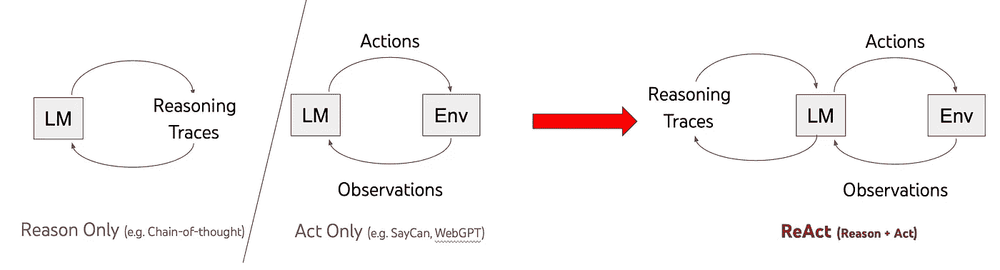
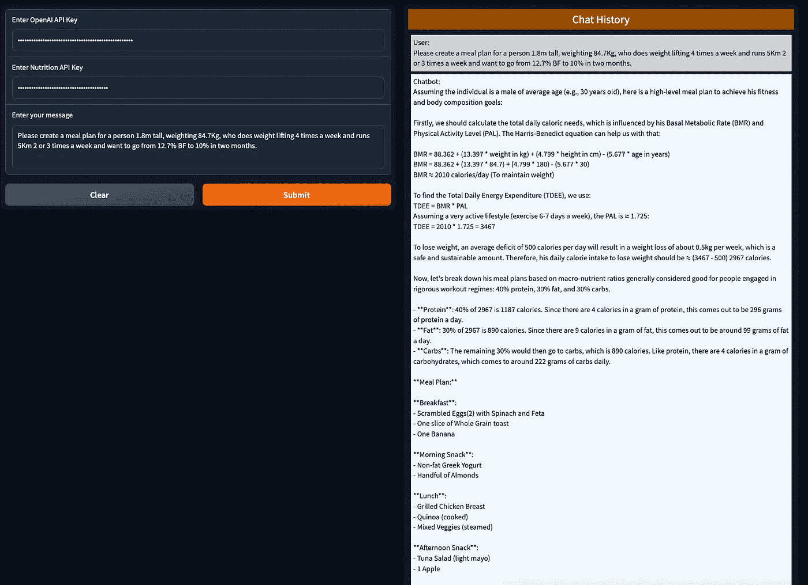

# FitBot — 一款健身聊天机器人代理

> 原文：[`towardsdatascience.com/fitbot-a-fitness-chatbot-agent-dca471710775?source=collection_archive---------3-----------------------#2023-07-28`](https://towardsdatascience.com/fitbot-a-fitness-chatbot-agent-dca471710775?source=collection_archive---------3-----------------------#2023-07-28)

## 如何创建一个利用 OpenAI 函数调用的聊天机器人代理

[](https://solano-todeschini.medium.com/?source=post_page-----dca471710775--------------------------------)[](https://towardsdatascience.com/?source=post_page-----dca471710775--------------------------------) [Solano Todeschini](https://solano-todeschini.medium.com/?source=post_page-----dca471710775--------------------------------)

·

[关注](https://medium.com/m/signin?actionUrl=https%3A%2F%2Fmedium.com%2F_%2Fsubscribe%2Fuser%2F618a52c38c0c&operation=register&redirect=https%3A%2F%2Ftowardsdatascience.com%2Ffitbot-a-fitness-chatbot-agent-dca471710775&user=Solano+Todeschini&userId=618a52c38c0c&source=post_page-618a52c38c0c----dca471710775---------------------post_header-----------) 发布于 [数据科学前沿](https://towardsdatascience.com/?source=post_page-----dca471710775--------------------------------) ·13 分钟阅读·2023 年 7 月 28 日[](https://medium.com/m/signin?actionUrl=https%3A%2F%2Fmedium.com%2F_%2Fvote%2Ftowards-data-science%2Fdca471710775&operation=register&redirect=https%3A%2F%2Ftowardsdatascience.com%2Ffitbot-a-fitness-chatbot-agent-dca471710775&user=Solano+Todeschini&userId=618a52c38c0c&source=-----dca471710775---------------------clap_footer-----------)

--

[](https://medium.com/m/signin?actionUrl=https%3A%2F%2Fmedium.com%2F_%2Fbookmark%2Fp%2Fdca471710775&operation=register&redirect=https%3A%2F%2Ftowardsdatascience.com%2Ffitbot-a-fitness-chatbot-agent-dca471710775&source=-----dca471710775---------------------bookmark_footer-----------)

照片由 [Gary Butterfield](https://unsplash.com/@garybpt?utm_source=medium&utm_medium=referral) 提供，刊登于 [Unsplash](https://unsplash.com/?utm_source=medium&utm_medium=referral)

# 介绍

在健康意识居于前沿的时代，追求平衡生活已成为普遍的愿望，营养无疑是核心支柱。

然而，饮食计划的复杂性和大量的营养数据常常成为我们实现这种平衡的障碍。一个常见的情况是糖尿病患者，他们需要持续和准确的营养指导以有效管理血糖水平。拥有一个个性化的营养助手会不会是一次变革性的体验？

在这种情况下，利用技术来辅助营养指导不仅是有益的，而且是必要的。通过将尖端的人工智能（AI）与全面的营养数据库整合，能够创建一个强大的工具，帮助个人在健康旅程中取得进展。

***该项目的代码在这个 GitHub 仓库中：* [*链接*](https://github.com/solanovisitor/FitBot)****

# 项目概述

项目的核心涉及构建一个名为 FitBot 的聊天机器人，该机器人由 OpenAI 的功能驱动，并基于 ReAct（推理和行动）框架（见图 1）。

它旨在提供营养信息和建议，通过解读用户的饮食习惯并整合营养数据的 API 来实现这一目标。

## 技术方法

通过利用 ReAct 框架，FitBot 保持了对话的互动性质，并能对每条建议提供详细的解释。它还连接到外部营养数据库，确保提供准确且最新的饮食建议。



图 1：ReAct 结合了推理（例如，链式思维提示）和行动。图片来源：[链接](https://react-lm.github.io/)

## FitBot 的幕后

FitBot 将 OpenAI 的 GPT-4 能力与 ReAct 的动态处理结合起来，以理解饮食查询，建议合适的替代方案，并提供个性化建议。它在保持对话语气的同时，使营养建议变得易于获取和引人入胜。

FitBot 的独特之处在于其能够与外部营养数据库接口。这使得 FitBot 能够向用户提供准确和最新的信息，确保所提供的建议是可靠的，并基于准确的数据。

在接下来的部分，我们将深入探讨代码，看看 FitBot 的组件是如何开发和相互作用的，全面了解这个创新项目的内部工作。

# 构建 FitBot：代码解析

这个项目有四个主要脚本，用于处理数据并在用户界面中显示数据：

1.  **fitness_agent.py**：此文件包含 `FitnessAgent` 类，该类利用 OpenAI 功能实现 FitBot 所需的功能。

1.  **chatbot.py**：此文件包含 FitBot 用户界面的代码，使用 Gradio 库实现。

1.  **agents.py**：这个文件包含`Agent`类，用于处理与 OpenAI API 的对话。这段代码基于由[James Briggs](https://github.com/jamescalam)在 funkagent 库中开发的[this script](https://github.com/aurelio-labs/funkagent/blob/main/funkagent/agents.py)。

1.  **parser.py**：这个文件包含将函数文档字符串解析为 OpenAI 函数描述的代码。

## 定义我们的功能

创建能够提供准确和有用的营养和健身建议的聊天机器人时，我们需要考虑什么信息对最终用户最有价值。这就是前面解释的功能实现背后的原因。

1.`**get_nutritional_info**`：这个功能对于任何以健身为导向的聊天机器人都至关重要。人们经常缺乏关于他们所吃食物的营养含量的清晰信息。通过使用[Nutrition endpoint from API Ninjas](https://api-ninjas.com/api/nutrition)来获取各种食物实时营养数据，我们可以帮助用户做出明智的饮食决策。返回的数据可以包括卡路里、蛋白质、碳水化合物、脂肪等详细信息，全面了解食物项的营养概况。

```py
def get_nutritional_info(self, query: str) -> dict:
    """Fetches the nutritional information for a specific food item

    :param query: The food item to get nutritional info for
    :return: The nutritional information of the food item
    """
    api_url = 'https://api.api-ninjas.com/v1/nutrition?query={}'.format(query)
    response = requests.get(api_url, headers={'X-Api-Key': self.nut_api_key})

    if response.status_code == requests.codes.ok:
        return response.json()  # Use json instead of text for a more structured data
    else:
        return {"Error": response.status_code, "Message": response.text}
```

2.`**calculate_bmr**`：基础代谢率（BMR）是理解个体新陈代谢的关键指标。它是在休息时消耗的能量量，与一个人的年龄、体重、身高和性别密切相关。计算 BMR 的能力为聊天机器人提供了一个基准，帮助用户理解他们的身体即使没有任何身体活动也需要多少卡路里。

```py
def calculate_bmr(weight: float, height: float, age: int, gender: str, equation: str = 'mifflin_st_jeor') -> float:
    """Calculates the Basal Metabolic Rate (BMR) for a person

    :param weight: The weight of the person in kg
    :param height: The height of the person in cm
    :param age: The age of the person in years
    :param gender: The gender of the person ('male' or 'female')
    :param equation: The equation to use for BMR calculation ('harris_benedict' or 'mifflin_st_jeor')
    :return: The BMR of the person
    """
    if equation.lower() == 'mifflin_st_jeor':
        if gender.lower() == 'male':
            return (10 * weight) + (6.25 * height) - (5 * age) + 5
        else:  # 'female'
            return (10 * weight) + (6.25 * height) - (5 * age) - 161
    else:  # 'harris_benedict'
        if gender.lower() == 'male':
            return 88.362 + (13.397 * weight) + (4.799 * height) - (5.677 * age)
        else:  # 'female'
            return 447.593 + (9.247 * weight) + (3.098 * height) - (4.330 * age)
```

3.`**calculate_tdee**`：了解一个人的总日能量消耗（TDEE）对于制定个性化的饮食或锻炼计划至关重要。TDEE 不仅考虑了 BMR，还考虑了日常活动和锻炼中消耗的卡路里。了解他们的 TDEE 可以帮助用户更有效地计划他们的饮食和锻炼计划，以维持、减少或增加体重。

```py
def calculate_tdee(bmr: float, activity_level: str) -> float:
    """Calculates the Total Daily Energy Expenditure (TDEE) for a person

    :param bmr: The BMR of the person
    :param activity_level: The activity level of the person
    ('sedentary', 'lightly_active', 'moderately_active', 'very_active', 'super_active')
    :return: The TDEE of the person
    """
    activity_factors = {
        'sedentary': 1.2,
        'lightly_active': 1.375,
        'moderately_active': 1.55,
        'very_active': 1.725,
        'super_active': 1.9,
    }
    return bmr * activity_factors.get(activity_level, 1)
```

4.`**calculate_ibw**`：了解理想体重（IBW）可以为用户提供一个被认为对他们的身高和性别健康的体重目标。虽然 IBW 不是一个完美的衡量标准（它没有考虑肌肉质量等因素），但它确实为用户提供了一个关于他们的体重应该达到的大致想法，以达到最佳健康。

```py
def calculate_ibw(height: float, gender: str) -> float:
    """Calculates the Ideal Body Weight (IBW)

    :param height: The height of the person in inches
    :param gender: The gender of the person ("male" or "female")
    :return: The Ideal Body Weight in kg
    """
    if gender.lower() == 'male':
        if height <= 60:  # 5 feet = 60 inches
            return 50
        else:
            return 50 + 2.3 * (height - 60)
    elif gender.lower() == 'female':
        if height <= 60:
            return 45.5
        else:
            return 45.5 + 2.3 * (height - 60)
    else:
        raise ValueError("Invalid gender. Expected 'male' or 'female'.")
```

4\. `**calculate_bmi**`：身体质量指数（BMI）是使用一个人的身高和体重进行简单计算的。公式是 BMI = kg/m²，其中 kg 是一个人的体重（单位：千克），m² 是他们的身高的平方（单位：米）。BMI 并不直接测量体脂肪，但研究表明 BMI 与更直接的体脂肪测量指标有中等相关性。它提供了一个有用的标准来理解一个人是偏瘦、健康、超重还是肥胖。

```py
def calculate_bmi(weight: float, height: float) -> float:
    """Calculates the Body Mass Index (BMI) for a person

    :param weight: The weight of the person in kg
    :param height: The height of the person in cm
    :return: The BMI of the person
    """
    height_meters = height / 100  # convert cm to meters
    bmi = weight / (height_meters ** 2)
    return round(bmi, 2)  # round to 2 decimal places for readability
```

## 构建代理：包装功能

在建立了必要的功能后，我们的下一步是将这些功能集成到我们的聊天机器人代理中。这种封装使得机器人能够利用这些功能，并根据用户查询提供相关、准确的回应。

以下是如何创建代理的方法：

```py
# Instantiate the agent
fitness_agent = FitnessAgent(openai_api_key, nut_api_key)
```

你可以查看它所增强的功能：

```py
# You can view the processed function instructions
print(fitness_agent.functions)
```

输出：

```py
[
   {
      "name":"get_nutritional_info",
      "description":"Fetches the nutritional information for a specific food item",
      "parameters":{
         "type":"object",
         "properties":{
            "query":{
               "description":"The food item to get nutritional info for",
               "type":"string"
            }
         }
      },
      "required":[
         "query"
      ]
   },
   {
      "name":"calculate_bmr",
      "description":"Calculates the Basal Metabolic Rate (BMR) for a person",
      "parameters":{
         "type":"object",
         "properties":{
            "weight":{
               "description":"The weight of the person in kg",
               "type":"number"
            },
            "height":{
               "description":"The height of the person in cm",
               "type":"number"
            },
            "age":{
               "description":"The age of the person in years",
               "type":"integer"
            },
            "gender":{
               "description":"The gender of the person ('male' or 'female')",
               "type":"string"
            },
            "equation":{
               "description":"The equation to use for BMR calculation ('harris_benedict' or 'mifflin_st_jeor')",
               "type":"string"
            }
         }
      },
      "required":[
         "weight",
         "height",
         "age",
         "gender",
         "equation"
      ]
   },
   {
      "name":"calculate_tdee",
      "description":"Calculates the Total Daily Energy Expenditure (TDEE) for a person",
      "parameters":{
         "type":"object",
         "properties":{
            "bmr":{
               "description":"The BMR of the person",
               "type":"number"
            },
            "activity_level":{
               "description":"The activity level of the person",
               "type":"string"
            }
         }
      },
      "required":[
         "bmr",
         "activity_level"
      ]
   }
]
```

## 与代理互动：用户对话

在将定义的函数封装到 FitnessAgent 中之后，我们现在可以模拟与我们的机器人对话。通过使用 FitnessAgent 类的 `ask()` 方法，我们可以轻松地将用户查询输入到我们的机器人中，并打印出生成的响应。

例如，我们可以询问机器人一些关于常见食物的营养信息：

```py
# Define a question
user_input = "What is the nutritional value of a banana?"

# Get raw chat response
response = fitness_agent.ask(user_input)

# Print final response
print(response['choices'][0]['message']['content'])
```

输出：

```py
A 100-gram serving of banana typically contains:

- Calories: 89.4
- Total Fat: 0.3 grams, of which Saturated Fat is 0.1 grams
- Protein: 1.1 grams
- Sodium: 1 milligram
- Potassium: 22 milligrams
- Cholesterol: 0 milligram
- Total Carbohydrates: 23.2 grams, of which Dietary Fiber is 2.6 grams and Sugars are 12.3 grams

These values may vary based on the exact size and ripeness of the banana. Also note, bananas are a good source of dietary potassium and vitamin C.
```

在这个示例中，FitBot 有效地使用了 `get_nutritional_info()` 函数来获取并显示香蕉的营养价值。

FitBot 也可以处理更复杂的请求。例如，如果提供所需的数据，它可以计算一个人的总每日能量消耗 (TDEE)：

```py
# Define a question
user_input = "What is the TDEE of a 30-year-old man, who is 180 cm tall, weighs 80 kg, and exercises 3 times a week?"

# Get raw chat response
response = fitness_agent.ask(user_input)

# Print final response
print(response['choices'][0]['message']['content'])
```

输出：

```py
The Total Daily Energy Expenditure (TDEE) of a 30-year-old man who is 180 cm tall, weighs 80 kg, and exercises 3 times a week with "moderate" exercise according to the Harris-Benedict equation would be approximately 2574 calories a day. This is a rough estimate and individual results could vary based on multiple factors like metabolism speed, specific physical activity, and more. 

Here's a simple breakdown of the process:

1\. Calculating Basal Metabolic Rate (BMR) - This is the number of calories a person would burn just by existing, without any activity. 

For men, the Harris-Benedict equation to calculate BMR is 
BMR = 88.362 + (13.397 * weight in kg) + (4.799 * height in cm) - (5.677 * age in years)
For the given values, the BMR comes to around 1783 calories.

2\. Adjusting for Activity - The BMR can thus be adjusted for physical activity level using the following multipliers:

- Sedentary (little or no exercise): BMR * 1.2
- Lightly active (light exercise/sports 1-3 days/week): BMR * 1.375
- Moderately active (moderate exercise/sports 3-5 days/week): BMR * 1.55
- Very active (hard exercise/sports 6-7 days a week): BMR * 1.725
- Super active (very hard exercise/physical job & exercise 2x/day): BMR * 1.9

For someone who exercises 3 times a week, we could take the multiplier to be at 1.55 (Moderately active). 

Hence, TDEE = BMR * Activity Multiplier = 1783 * 1.55 = approximately 2764 calories.

Note: The actual total caloric needs may be slightly higher or lower as this calculation doesn't take into account muscle to fat ratio, specific types of activities, etc.
```

让我们将这个输出与基于 GPT-4 的原始 ChatGPT 进行比较：

```py
TDEE, or Total Daily Energy Expenditure, represents the total number of calories a person needs to consume in a day to maintain their current weight, considering their physical activity level.

We first need to calculate the Basal Metabolic Rate (BMR), which is the amount of energy expended while at rest. There are several equations to calculate BMR, one of the commonly used ones is the Mifflin-St. Jeor equation:

For men: BMR = 10 * weight(kg) + 6.25 * height(cm) - 5 * age(y) + 5

So, for your case:

BMR = 10 * 80kg + 6.25 * 180cm - 5 * 30y + 5
BMR = 800 + 1125 - 150 + 5 = 1780 kcal/day

This is the amount of calories needed to keep the body functioning while at rest.

To include physical activity in the equation, we multiply the BMR by the Physical Activity Level (PAL). For someone who exercises 3 times a week, a common PAL is 1.375 (moderate exercise).

So, TDEE = BMR * PAL

TDEE = 1780 kcal/day * 1.375 = 2447.5 kcal/day

So, a 30-year-old man who is 180 cm tall, weighs 80 kg, and exercises 3 times a week would need approximately 2448 calories per day to maintain his current weight. Please note this is just an estimate; actual caloric needs can vary based on many factors, including genetics and body composition. Always consult a healthcare provider or a registered dietitian for personalized advice.
```

# 将聊天机器人与用户界面集成

现在我们已经构建了健身代理并为其配备了有用的功能，我们希望将其展示在一个易于使用的界面中。

为此，我们使用 Gradio，这是一个 Python 库，允许我们迅速便捷地创建可共享的基于网页的用户界面。在本节中，我们将带你了解如何将聊天机器人与 Gradio 用户界面集成。

这是我们界面的整体结构：

```py
def main():

    openai_api_key = gr.components.Textbox(
        lines=1,
        label="Enter OpenAI API Key",
        type="password",
    )

    nut_api_key = gr.components.Textbox(
        lines=1,
        label="Enter Nutrition API Key",
        type="password",
    )

    question = gr.components.Textbox(
        lines=3,
        label="Enter your message",
    )

    output_history = gr.outputs.HTML(
        label="Updated Conversation",
    )

    inputs = [
        openai_api_key,
        nut_api_key,
        question,
    ]

    iface = gr.Interface(
        fn=partial(get_response),
        inputs=inputs,
        outputs=[output_history],
        title="Fitness Agent",
        description="A simple chatbot using a Fitness Agent and Gradio with conversation history",
        allow_flagging=False,
    )

    iface.launch()

if __name__ == "__main__":
    main()
```

这是我们的 `main` 函数，脚本的入口点。我们首先创建文本框，让用户输入他们的 OpenAI API 密钥和 Nutrition API 密钥。这些密钥设置为 `password` 类型以隐藏输入。接着，我们提供一个文本框供用户提问。机器人的回应将以 HTML 格式显示在标记为“Updated Conversation”的区域。

输入和输出随后传递给 Gradio 界面，脚本运行时启动该界面。

`get_response` 函数与健身代理互动：

```py
def get_response(openai_api_key, nut_api_key, user_input, action=None):
    set_openai_api_key(openai_api_key)
    set_nut_api_key(nut_api_key)

    fitness_agent = FitnessAgent(openai_api_key, nut_api_key)

    # Get raw chat response
    fitness_agent.ask(user_input)

    memory = fitness_agent.agent.chat_history

    # Iterate through messages in ChatMessageHistory and format the output
    updated_conversation = '<div style="background-color: hsl(30, 100%, 30%); color: white; padding: 5px; margin-bottom: 10px; text-align: center; font-size: 1.5em;">Chat History</div>'
    logger.info(memory)
    for i, message in enumerate(memory):
        if i != 0:
            if message['role'] == 'user':
                prefix = "User: "
                background_color = "hsl(0, 0%, 40%)"  # Dark grey background
                text_color = "hsl(0, 0%, 100%)"  # White text
            else:
                prefix = "Chatbot: "
                background_color = "hsl(0, 0%, 95%)"  # White background
                text_color = "hsl(0, 0%, 0%)"  # Black text
            updated_conversation += f'<div style="color: {text_color}; background-color: {background_color}; margin: 5px; padding: 5px;">{prefix}{message["content"]}</div>'
    return updated_conversation
```

在 `get_response` 中，我们使用 `set_openai_api_key` 和 `set_nut_api_key` 函数设置 OpenAI 和 Nutrition API 密钥，然后初始化我们的健身代理。接着，我们调用代理的 `ask` 方法，传入用户的问题，并存储对话历史记录。对话历史中的每条消息都被格式化为 HTML 字符串，并添加到 `updated_conversation`。这个 HTML 字符串被返回并显示在 Gradio 界面中。

# 结果界面的概览

在整合了必要的计算和对话逻辑，并将这些内容封装到一个视觉上令人愉悦的 Gradio 用户界面中之后，我们的 FitBot 已经准备好与用户互动了！

最终界面如下所示：



图 2：聊天机器人的 Gradio 用户界面。图片由作者提供。

在界面上，你会看到三个输入框，可以在其中输入 OpenAI 和 API Ninjas 营养端点的必要密钥，以及用户对健身代理的消息。

# 摘要

本文详细描述了 FitBot 的创建，这是一个使用 OpenAI 的 GPT-4 的综合健身代理，一个能够理解和响应复杂用户查询的强大 AI 模型。

我们从构建计算关键健康指标的函数开始，如基础代谢率（BMR）、每日总能量消耗（TDEE）和体重指数（BMI）。这些计算构成了健身代理提供准确和量身定制的健身和营养建议的基础。

接下来，我们集成了 API Ninjas 的营养端点。这使得健身代理能够访问并提供准确的营养信息，这是任何全面健身和饮食计划的关键组成部分。

我们展示了如何构建对话逻辑，使健身代理更加互动。它能够处理对话流程，使其能够回答各种用户查询，并有效地引导用户进行健身之旅。

最后，我们使用 Gradio 将所有这些功能封装到一个视觉上吸引人的用户界面中。结果是一个不仅智能而且用户友好的健身代理，提供清晰且全面的建议，格式易于理解。

***概况****：在这篇文章中，我们构建了 FitBot，一个使用 OpenAI 的 GPT-4 的健身代理，能够提供个性化的健身和营养建议。我们实现了计算关键健康指标（BMR、TDEE、BMI）的功能，集成了一个营养 API，以获取准确的饮食信息，并通过 Gradio 封装了一个用户友好的界面。这个项目展示了 AI 在健康和健身领域的强大功能，简化了复杂的计算，提供了个性化建议，并通过吸引人的用户界面传递所有信息。*

# 感谢阅读！

+   关注我在 [Linkedin](https://www.linkedin.com/in/solano-todeschini/)！
