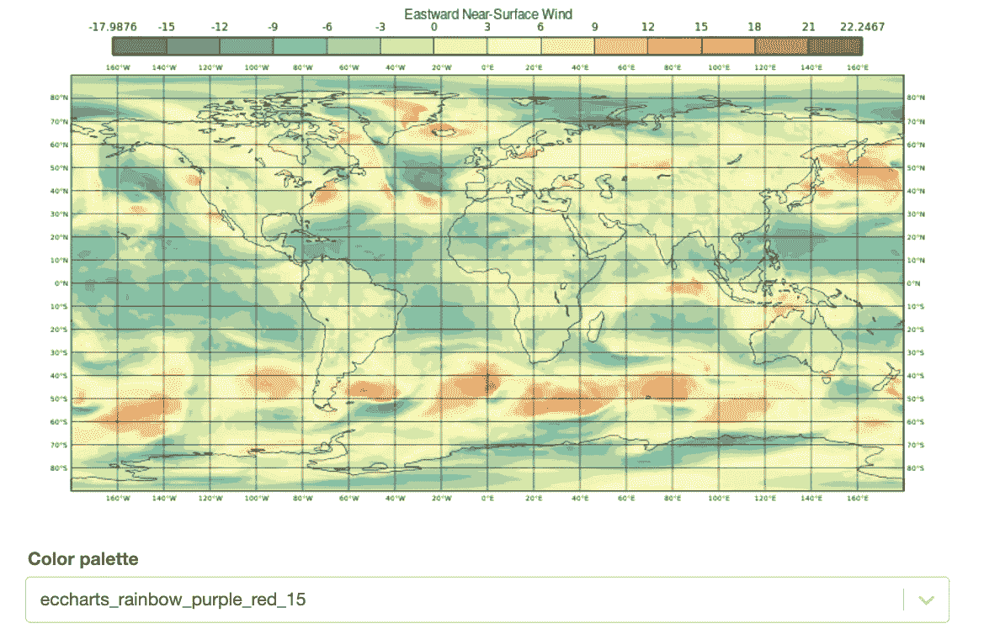
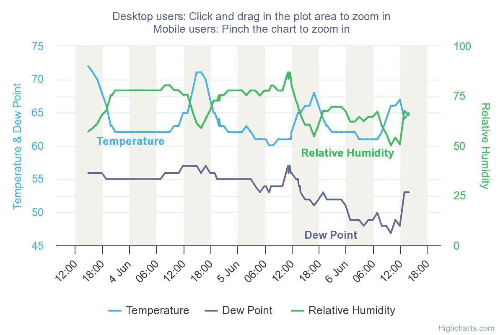

# 五个免费且可靠的天气数据来源

> 原文：[`towardsdatascience.com/five-free-and-reliable-weather-data-sources-20b9ea6afac9`](https://towardsdatascience.com/five-free-and-reliable-weather-data-sources-20b9ea6afac9)

## 高质量数据以改善和增强你的建模过程

 [Anthony Baum](https://medium.com/@anthonybaum?source=post_page-----20b9ea6afac9--------------------------------)

·发表于 [Towards Data Science](https://towardsdatascience.com/?source=post_page-----20b9ea6afac9--------------------------------) ·阅读时间 6 分钟·2023 年 5 月 31 日

--

图片由 NOAA 提供，来自 Unsplash

天气以从明显到微妙和意外的方式影响人类决策。能源供应商需要数据来确保当电网上的成千上万台空调启动时，电力供应能够满足需求。纽约市的 Citibike 骑行需求在开始下雨时急剧下降。零售商甚至使用天气数据在季节性寒冷天气时向消费者推销感冒和流感药物。

大量的天气数据由政府和学术机构收集，这意味着在进行分析和建模时，你所需的数据通常是免费的。在美国尤其如此，因为由国家海洋和大气管理局 (NOAA) 收集的数据，包括国家天气服务 (NWS)，是公共领域数据。

许多高质量的免费数据往往隐藏在难以找到的过时托管区域、FTP 服务器中，或者在 Google 的两页深处，背后有一大堆私人公司。例如，NOAA 的许多数据仅通过购物车流程提供，你可能需要在开始查找之前知道你想要的确切数据集。获取这些数据的难度意味着你最容易的选择通常是具有 API 和高搜索排名的私人数据提供商。这些来源可以很棒，但通常有严格的免费层级限制，如速率限制、历史时间限制、分辨率限制等。因此，为了帮助你寻找数据，我整理了五个高质量且可靠的免费数据来源。

**国家环境信息中心 (NCEI)**

[数据集 | 气候数据在线 (CDO) | 国家气候数据中心 (NCDC) (noaa.gov)](https://www.ncei.noaa.gov/cdo-web/datasets)

NCEI 隶属于国家海洋和大气管理局（NOAA），提供了地球上最重要的环境数据档案之一。他们提供关于大气、沿海、海洋和地球物理参数的综合信息。你可以以各种格式下载历史天气模式、古气候学、太阳事件等数据。

如果你访问上述数据集链接，一个很好的起点是“遗留应用程序”下的全球小时数据。你将能够获取全球大多数主要机场天气站的每小时数据，以及美国的每个官方站点（主要但不总是机场）。如果你试图为特定地点增加数据，可以从最近的机场开始。

另一个有趣的数据集是风暴事件数据库，它不仅提供关于龙卷风和冰雹的信息，还记录了如佛罗里达的雪等异常事件，以及导致人员伤亡的气象相关事件，如雪崩。

风暴报告数据，通过 NCEI 风暴事件数据库以原始形式提供。图片来源：NOAA/NWS 风暴预警中心

气候规范等长期数据可以在气候数据在线下找到，特别适用于基于季节性的项目。在同一部分，你还可以查看天气雷达数据，这是来自 NWS 雷达安装的反射率数据。如果你在寻找像超本地降雨这样的数据，雷达数据是最好的选择，而且无论好坏，都将在使其可用于代码分析方面给你带来重大技术挑战。

如前所述，NOAA 数据属于公共领域，因此在此收集的任何内容都可以用于任何目的，包括商业用途。

**欧洲中期天气预报中心（ECMWF）**

[ECMWF Reanalysis v5 | ECMWF](https://www.ecmwf.int/en/forecasts/dataset/ecmwf-reanalysis-v5)

ECMWF 是一个独立的组织，总部位于英国，由多个欧洲国家支持。它提供中期到长期的天气预报，并通过 ECMWF Web API 允许免费访问其数据集。他们的 ERA5 数据集对于气候研究特别有价值，提供了从 1979 年至今的详细大气、陆地表面和海洋波浪信息。

与 NOAA 观测数据不同，ERA5 是所谓的“再分析数据”。与观测数据相比，再分析数据本质上是模型插值的天气视图。对于 ERA5，数据是全球性的，分辨率为 0.25 度。每个数据点位置都有多个垂直层可用，因此你可以创建自 1979 年以来的任意时刻的大气垂直剖面。

全球东向风速，从 ERA5 数据中得出。来源：*Copernicus 气候变化服务信息 2023*

对我们这些数据人员来说，这些数据通过一个优秀的 API 提供，该 API 访问 ECMWF Copernicus 数据存储（CDS）。使用该服务，你需要注册并获取 API 密钥。使用 API 的一个专业技巧是下载 NetCDF 格式的数据，并使用 xarray Python 模块将其读取到 pandas 数据框中。

ECMWF 在这个列表中排名很高，因为它是一个高质量且受推崇的数据来源。然而，你必须小心理解他们提供的数据的使用条款，因为他们不像美国政府来源那样在公共领域下运营。在公开访问的内容中，有些项目受自身使用条款的限制。这些项目要么标明了谁控制该项目的权利，并在某些情况下提供了点击使用许可的链接，要么在图片说明中列出了使用限制。[开放数据页面](https://www.ecmwf.int/en/forecasts/datasets/open-data)是一个很好的起点，提供了可用数据的摘要、交付方式和明确的许可要求链接。

**国家气象局（NWS）**

[API Web 服务 (weather.gov)](https://www.weather.gov/documentation/services-web-api)

如果你在美国，并且曾经在电视上或手机上看到过天气警报，那是 NWS 的一位气象预报员发布的。如果你需要访问当前数据，例如，你有一个实时运行的模型或仪表板，这就是你需要开始的地方。

该 API 提供了对包括温度、降水、预报和波高在内的当前条件的访问，涵盖了整个美国及其领土水域。全球范围内也可以获得更有限的当前条件报告。文档和访问详情可以在上面链接的 NWS 官方网站上找到。

与 NCEI 数据一样，这属于公共领域，可以自由用于任何目的，但要小心不要违反速率限制。

过去三天的天气观测数据。来源：NWS 洛杉矶，USC/市区 LA 站点的观测数据

**Open-Meteo**

[免费开源天气 API | Open-Meteo.com](https://open-meteo.com/)

Open-Meteo 是一个合作项目，旨在提供开放、免费的天气数据访问。虽然它不是政府来源，但由于其致力于让气象数据免费获取，因此在这里列出。

他们提供了一个 API，提供对众多数据集的访问，包括预报、观测数据、历史数据和雷达图像。该 API 支持多种编程语言，使其成为将数据集成到应用程序中的一个好选择。

你可以将 API 用于个人和学术项目，但不能用于商业项目。

**日本气象厅**

[日本气象厅 | 日本气候 (jma.go.jp)](https://www.data.jma.go.jp/obd/stats/data/en/index.html)

日本气象厅（JMA）免费提供天气、气候和地震数据。虽然这些数据的细致程度和深度不及 NOAA 或 ECMWF 提供的数据，但却是获取日本本地天气和气候信息的最佳来源。

特别值得注意的是，JMA 的日环气象卫星是目前运行中最好的卫星之一，提供了极高质量的日本、东南亚、澳大利亚、新西兰以及太平洋岛屿的影像。

尽管 JMA 没有专用的 API，但包括观测、预报和警告在内的数据集以文本、XML 和图形格式等多种格式提供，可以在上面的链接或网站上相对容易找到。如果你深入挖掘，可能需要使用翻译工具，因为大部分信息是用日语写的。

希望这些资源对你有所帮助，你能找到你所需要的信息。祝你的项目好运！
