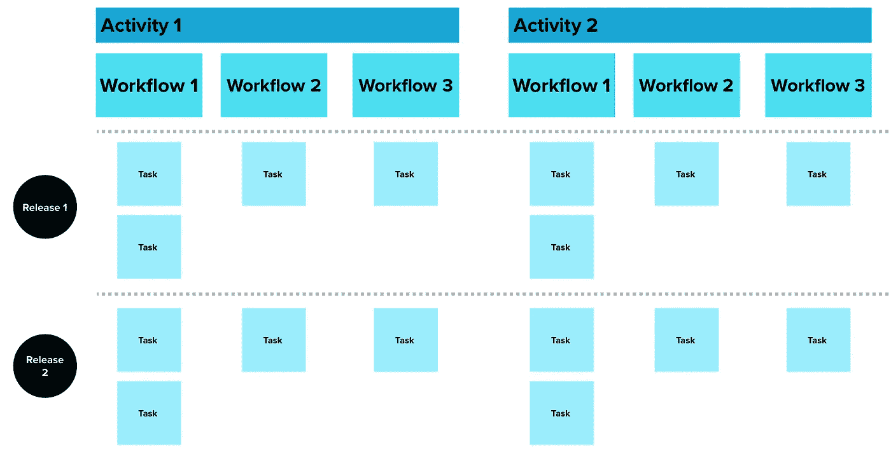
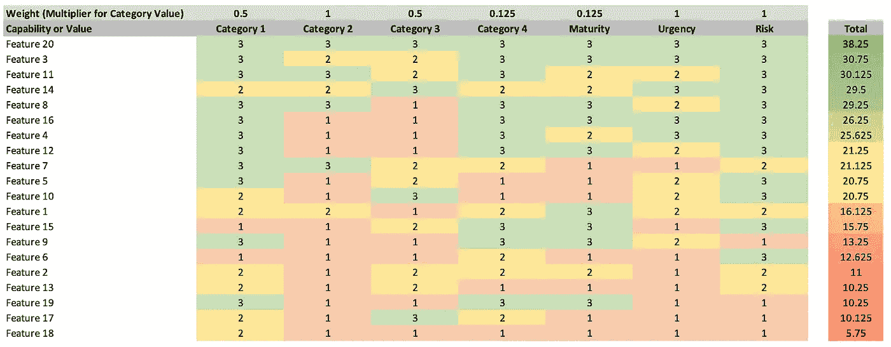
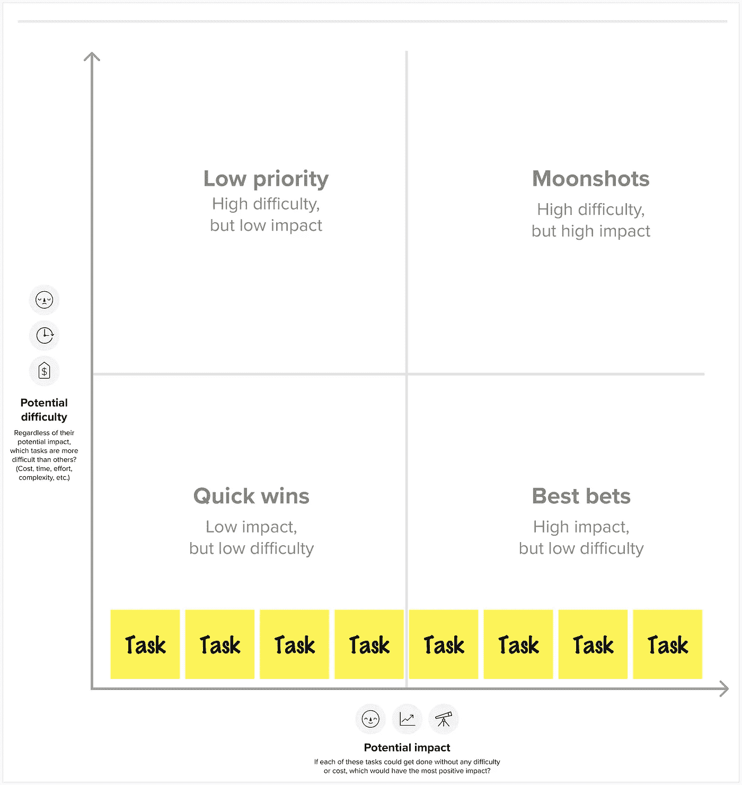
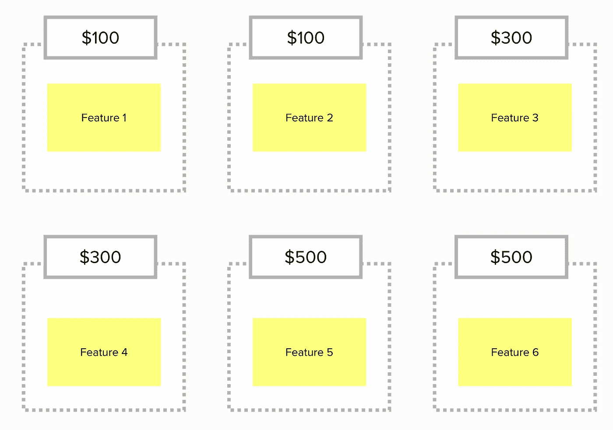

# 产品管理中的五种强大优先级排序技巧

> 原文：[`towardsdatascience.com/five-powerful-prioritization-techniques-from-product-management-c44cd1f7e2f3`](https://towardsdatascience.com/five-powerful-prioritization-techniques-from-product-management-c44cd1f7e2f3)

## 数据科学家如何从产品经理构建产品、关注以客户为中心的思维以及确保产品成功中获得启发。

[](https://medium.com/@broepke?source=post_page-----c44cd1f7e2f3--------------------------------)[](https://towardsdatascience.com/?source=post_page-----c44cd1f7e2f3--------------------------------) [Brian Roepke](https://medium.com/@broepke?source=post_page-----c44cd1f7e2f3--------------------------------)

·发布于 [Towards Data Science](https://towardsdatascience.com/?source=post_page-----c44cd1f7e2f3--------------------------------) ·8 分钟阅读·2023 年 4 月 2 日

--


图片由 [Dayne Topkin](https://unsplash.com/@dtopkin1?utm_source=medium&utm_medium=referral) 提供，来源于 [Unsplash](https://unsplash.com/?utm_source=medium&utm_medium=referral)

作为数据科学家、分析师或任何开发产品或解决方案的人，你可以借鉴产品经理用于优先排序需求的工具。在资源和时间有限的情况下，专注于能够为客户带来最大价值的功能和需求是至关重要的。以下是我最喜欢的五种功能和需求优先级排序技巧：

1.  用户故事映射

1.  加权优先级矩阵

1.  重要性与难度矩阵

1.  购买功能

1.  Kano 模型

每种技巧都有其优点和最适用的情况。尝试所有技巧，了解何时应用每种技巧。让我们逐一了解每种技巧的基本操作以及何时使用它们。

# 用户故事映射

**用户故事映射** 是一种通过地图可视化产品功能和需求的强大技巧。它帮助你理解用户的旅程，并根据功能在实现目标中的重要性来优先排序。

执行用户故事映射：

1.  开始时将产品拆分成较小的用户故事。这些故事应描述用户的目标、需求和痛点。

1.  组织用户故事，将分组表示为不同的活动及用户完成该活动所需执行的工作流程。

1.  根据用户故事对用户旅程的重要性进行优先排序（从上到下）。

**提示**：用户故事映射是一个迭代过程，应根据用户反馈和变化的业务优先级定期更新和修订。此外，涉及你的团队和利益相关者进行映射，以确保对齐和认同。

**何时使用**：当你开始一个新项目并希望了解用户的工作流程时，这种方法效果很好。这种方法帮助你框定问题，你将肯定会发现一些你之前没有考虑到的领域。



作者提供的图片

# 加权优先级矩阵

**加权优先级矩阵**是一种基于多个标准对特性进行优先排序的技术。它涉及为每个标准分配权重，并根据每个特性满足每个标准的程度进行评分。然后，将结果得分乘以权重，以计算每个特性的最终得分。

执行加权优先级矩阵的方法：

1.  确定你想用来评估特性的标准。

1.  根据每个标准的相对重要性为其分配权重。

1.  根据每个标准的符合程度对每个特性进行 1 到 n 的评分。你可以使用任何你想要的评分标准，但要保持一致。

1.  将每个得分乘以其对应的权重，并将结果相加，以计算每个特性的最终得分。作为奖励，你可以平方得分，以给更高的得分更多的权重，例如，平方加权和。

```py
=($B$1*B3*B3)+($C$1*C3*C3)+($D$1*D3*D3)+($E$1*E3*E3)...
```

在这里下载我的 Excel 示例：[加权优先级矩阵](https://www.dataknowsall.com/pdf/weighted_prioritization_matrix.xlsx)。

**提示**：使用加权优先级矩阵时，涉及利益相关者和团队成员的标准选择和权重过程，以确保对齐和认同。此外，要注意你为每个特性打分时尽量客观。你可以将自定义标准（如它如何符合特定业务目标）与传统标准（如风险、收入、紧急程度、努力程度等）混合使用。

**何时使用**：当你想以更有条理的方式为一长串特性打分时，这种方法非常适用。通过最终得分进行排序，给你一个堆叠的排名列表。因为你与团队合作进行评分系统，它可以减少关于优先级的一些主观性。



作者提供的图片

# 重要性与难度矩阵

**重要性难度矩阵**，也称为价值努力矩阵，是一种根据特性的重要性和难度来优先排序的技术。它涉及将特性映射到一个二维矩阵上，一个轴表示特性的优先级，另一个轴表示实施的难度。

执行重要性难度矩阵的方法：

1.  确定你想要优先排序的特性。

1.  将每个特性在水平轴上从最不重要到最重要排序。确保没有两个特性在同一列中。

1.  接下来，将每个特性在垂直轴上按难度从低到高排序。确保没有两个特性在同一行。

**提示**：在使用重要性困难矩阵时，涉及你的团队和利益相关者进行评分，以确保对优先级的对齐和认同。此外，排序过程是最重要的部分，你正在对优先级达成一致。此外，每个特性必须在不同的列或行中，确保没有两个特性被视为同等重要或困难。

**何时使用**：当你有大约十个项目需要排序时，这是一个很好的协作练习。这个减少的集合可以是你已筛选并希望获得绝对优先级的项目列表。



作者提供的图片

# 购买特性

**购买特性**是一种技术，涉及给客户一定数量的**资金**来**购买**他们希望在产品中看到的特性。客户可以将预算分配到他们认为最重要的特性上。这种技术可以帮助产品经理了解客户最需求的特性，并据此进行优先级排序。

要执行“购买特性”：

1.  确定你想要优先考虑的特性。

1.  为每个特性分配一个货币价值，并给客户一个“资金”预算来支出。

1.  你可以使用实物或数字代币来代表资金，让客户实际“购买”他们想要的特性。一旦所有客户花完预算，测试结果以确定哪些特性最受欢迎。

**提示**：为了确保“购买特性”的成功，请为流程设定明确的规则和指导方针。对预算及每个特性的费用保持透明。确保涉及到代表性客户群体以获得广泛的视角。此外，考虑向不同客户群体提供不同的预算，因为某些客户可能对某些特性更看重。

**何时使用**：当你直接与客户或利益相关者合作时，他们坚持认为一切都是高优先级的。“购买特性”技术迫使客户决定他们真正想要什么。它在一个可以设置非常困难的特性值高于一个人分配金额的群体中效果很好，这会强迫一个协作讨论，其中多个人需要将资源汇集在一起。



作者提供的图片

# Kano 模型

**Kano 模型**是一种识别哪些特性将为客户提供最大价值的技术。它将特性分类为不同类型：

+   **必备特性**：这些是客户期望的基本要求。这些特性如你车上的刹车，你不会买没有这些特性的车。

+   **性能特性**：这些为客户提供递增的价值。这些特性可以是更好的燃油效率或更强大的引擎。

+   **令人惊喜的功能**：这些是能够给客户带来惊喜的意外功能。这些功能包括加热方向盘或天窗。

执行 Kano 模型：

1.  确定客户需求：使用 Kano 模型的第一步是识别与您的产品或服务相关的客户需求，这可以通过调查、焦点小组或客户访谈来完成。

1.  分类客户需求：一旦识别出客户需求，你需要将它们分类为三类：基本需求、表现需求和令人惊喜的功能。

1.  确定满意度水平：接下来，你需要确定客户对每个识别出的需求的满意度水平。可以使用李克特量表（例如，1-5）来测量客户满意度。

1.  绘制数据：一旦你有了每个需求的满意度水平，将它们绘制在 Kano 模型图上。在横轴上绘制需求的表现或实施水平，在纵轴上绘制客户的满意度水平。

1.  分析结果：根据绘制的数据，你可以识别出每个类别（基本需求、表现需求和令人惊喜的功能）中的需求。此外，你还可以识别出当前未满足并需要改进的需求。

1.  制定行动计划：根据分析，制定一个行动计划，以满足客户的需求，包括改善基本需求、优化表现需求或投资于令人惊喜的功能。

1.  重复过程：Kano 模型不是一次性的练习。为了确保满足客户需求，定期重复这一过程非常重要，以识别客户需求和满意度水平的变化。

**提示**：请记住，客户需求和期望可能会随时间变化，因此定期重新评估功能的分类非常重要。此外，要小心不要过于关注令人惊喜的功能而忽略基本需求，因为关注基本需求可以带来客户满意度。此外，在进行调查或访谈时，使用足够大的样本量以确保数据能够代表您的客户群体。

**何时使用**：这是优先排序的更全面技术之一，掌握它可能需要一段时间。我建议阅读[Folding Burritos 上的 Kano 模型完整指南](https://foldingburritos.com/blog/kano-model/)。

# 结论

优先级排序是任何构建产品的人都需要掌握的关键技能。优先级排序要求深入了解客户的需求、业务目标和资源。我们讨论的五种技术——用户故事映射、加权优先级矩阵、重要性与难度矩阵、购买功能和卡诺模型——提供了不同的优先级排序方法。尽管如此，它们的终极目标都是最大化客户和业务的价值。记得在优先级排序过程中涉及你的团队和利益相关者，定期重新评估你的优先级，并专注于为客户提供价值。有效运用这些技术，你可以创造出让客户满意并推动业务成功的产品。

*如果你喜欢阅读这样的故事，并希望支持我作为作家，考虑注册成为 Medium 会员。每月 5 美元，享有对数千篇文章的无限访问。如果你使用* [*我的链接*](https://medium.com/@broepke/membership)*注册，我将获得一小笔佣金，但不会额外产生费用。*
