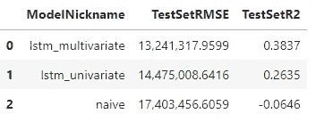

# 五种实际应用 LSTM 模型于时间序列的案例，附代码

> 原文：[`towardsdatascience.com/five-practical-applications-of-the-lstm-model-for-time-series-with-code-a7aac0aa85c0?source=collection_archive---------0-----------------------#2023-09-22`](https://towardsdatascience.com/five-practical-applications-of-the-lstm-model-for-time-series-with-code-a7aac0aa85c0?source=collection_archive---------0-----------------------#2023-09-22)

## 如何在多个不同的时间序列背景下实现高级神经网络模型

[](https://mikekeith52.medium.com/?source=post_page-----a7aac0aa85c0--------------------------------)[](https://towardsdatascience.com/?source=post_page-----a7aac0aa85c0--------------------------------) [Michael Keith](https://mikekeith52.medium.com/?source=post_page-----a7aac0aa85c0--------------------------------)

·

[关注](https://medium.com/m/signin?actionUrl=https%3A%2F%2Fmedium.com%2F_%2Fsubscribe%2Fuser%2F85177a9cbd35&operation=register&redirect=https%3A%2F%2Ftowardsdatascience.com%2Ffive-practical-applications-of-the-lstm-model-for-time-series-with-code-a7aac0aa85c0&user=Michael+Keith&userId=85177a9cbd35&source=post_page-85177a9cbd35----a7aac0aa85c0---------------------post_header-----------) 发表在 [Towards Data Science](https://towardsdatascience.com/?source=post_page-----a7aac0aa85c0--------------------------------) ·11 min read·Sep 22, 2023[](https://medium.com/m/signin?actionUrl=https%3A%2F%2Fmedium.com%2F_%2Fvote%2Ftowards-data-science%2Fa7aac0aa85c0&operation=register&redirect=https%3A%2F%2Ftowardsdatascience.com%2Ffive-practical-applications-of-the-lstm-model-for-time-series-with-code-a7aac0aa85c0&user=Michael+Keith&userId=85177a9cbd35&source=-----a7aac0aa85c0---------------------clap_footer-----------)

--

[](https://medium.com/m/signin?actionUrl=https%3A%2F%2Fmedium.com%2F_%2Fbookmark%2Fp%2Fa7aac0aa85c0&operation=register&redirect=https%3A%2F%2Ftowardsdatascience.com%2Ffive-practical-applications-of-the-lstm-model-for-time-series-with-code-a7aac0aa85c0&source=-----a7aac0aa85c0---------------------bookmark_footer-----------)

图片来源于 [Andrew Svk](https://unsplash.com/@andrew_svk?utm_source=medium&utm_medium=referral) 在 [Unsplash](https://unsplash.com/?utm_source=medium&utm_medium=referral)

当我在 2022 年 1 月写了[探索 LSTM 神经网络模型在时间序列中的应用](https://medium.com/towards-data-science/exploring-the-lstm-neural-network-model-for-time-series-8b7685aa8cf)时，我的目标是展示如何使用我开发的时间序列库[scalecast](https://github.com/mikekeith52/scalecast)在 Python 中轻松实现这个先进的神经网络。我没想到它会被观看超过数万次，并在我发布后超过一年内在 Google 搜索“lstm forecasting python”时排名第一（今天检查时，它仍然是第二）。

我并没有尝试引起对那篇文章的过多关注，因为我从未认为，也仍然认为，它不是很好。它从未打算成为实现 LSTM 模型最佳方法的指南，而只是简单探讨其在时间序列预测中的实用性。我试图回答诸如：当你使用默认参数运行模型时会发生什么，当你以这种或那种方式调整参数时会发生什么，它在某些数据集上被其他模型击败的难易程度等问题。然而，根据博客文章、Kaggle 笔记本，甚至我不断看到的[Udemy 课程](https://www.udemy.com/course/uniform-ml-dl/)，这篇文章的代码被逐字复制，很明显许多人把它当作前者的价值，而不是后者。我现在明白我没有清晰地表达我的意图。

今天，为了扩展那篇文章，我想展示如何应用 LSTM 神经网络模型，或者至少是我如何应用它，以充分发挥其在时间序列预测问题中的价值。自从我写了第一篇文章以来，我们已经能够为 scalecast 库添加许多新的创新功能，使得使用 LSTM 模型更加无缝，我将在这里探讨一些我最喜欢的功能。我认为 LSTM 有五种应用会在这个库中表现得非常出色：**单变量预测、多变量预测、概率预测、动态概率预测和迁移学习**。

在开始之前，请确保在终端或命令行中运行：

```py
pip install --upgrade scalecast
```

为本文开发的完整笔记本位于[这里。](https://github.com/mikekeith52/scalecast-examples/blob/main/lstm/lstm_latest.ipynb)

最后一点：在每个示例中，我可能会将“RNN”和“LSTM”互换使用。或者，RNN 可能会显示在 LSTM 预测的某个图表上。长短期记忆（LSTM）神经网络是一种递归神经网络（RNN），具有额外的记忆相关参数。在 scalecast 中，`rnn`模型类可以用来拟合从[tensorflow](https://www.tensorflow.org/)移植过来的简单 RNN 和 LSTM 单元。

# 1\. 单变量预测

使用 LSTM 模型最常见且最明显的方式是处理简单的单变量预测问题。尽管该模型拟合了许多参数，使其足够复杂以有效学习任何给定时间序列中的趋势、季节性和短期动态，但我发现它在处理平稳数据（即不表现出趋势或季节性的数据显示）时效果更好。因此，使用可在[Kaggle](https://www.kaggle.com/rakannimer/air-passengers)上获取的航空乘客数据集，我们可以仅通过去趋势和去季节性处理数据，使用相当简单的超参数来创建准确可靠的预测：

```py
transformer = Transformer(
    transformers = [
        ('DetrendTransform',{'poly_order':2}),
        'DeseasonTransform',
    ],
)
```

我们还要确保在完成后将结果恢复到其原始水平：

```py
reverter = Reverter(
    reverters = [
        'DeseasonRevert',
        'DetrendRevert',
    ],
    base_transformer = transformer,
)
```

现在，我们可以指定网络参数。在这个示例中，我们将使用 18 个滞后、一个层、一个 tanh 激活函数和 200 个训练周期。随意探索你自己的、更好的参数！

```py
def forecaster(f):
    f.set_estimator('rnn')
    f.manual_forecast(
        lags = 18,
        layers_struct = [
            ('LSTM',{'units':36,'activation':'tanh'}),
        ],
        epochs=200,
        call_me = 'lstm',
    )
```

将所有内容结合成一个管道，运行模型，并从视觉上查看结果：

```py
pipeline = Pipeline(
    steps = [
        ('Transform',transformer),
        ('Forecast',forecaster),
        ('Revert',reverter),
    ]
)

f = pipeline.fit_predict(f)

f.plot()
plt.show()
```


作者提供的图片

足够好，比我在另一篇文章中展示的任何内容都要好得多。要扩展这个应用，你可以尝试使用不同的滞后阶数，将季节性以傅里叶项的形式添加到模型中，寻找更好的序列转换，并通过交叉验证来调整模型的超参数。后续部分将演示其中的一些方法。

# 2\. 多变量预测

假设我们有两个序列，我们预计它们会一起变化。我们可以创建一个 LSTM 模型，在进行预测时考虑这两个序列，希望提高模型的整体准确性。这就是所谓的多变量预测。

在这个示例中，我将使用可在[Kaggle](https://www.kaggle.com/datasets/neuromusic/avocado-prices)上获取的鳄梨数据集。它测量了不同美国地区的鳄梨价格和销售数量。根据经济理论，我们知道价格和需求是密切相关的，因此使用价格作为领先指标，我们可能会比仅使用历史需求更准确地预测鳄梨的销售量。

我们首先要做的是转换每个序列。我们可以通过运行以下代码来搜索一组“最佳”转换（即在样本外得分的转换）：

```py
data = pd.read_csv('avocado.csv')

# demand
vol = data.groupby('Date')['Total Volume'].sum()
# price
price = data.groupby('Date')['AveragePrice'].sum()

fvol = Forecaster(
    y = vol,
    current_dates = vol.index,
    test_length = 13,
    validation_length = 13,
    future_dates = 13,
    metrics = ['rmse','r2'],
)

transformer, reverter = find_optimal_transformation(
    fvol,
    set_aside_test_set=True, # prevents leakage so we can benchmark the resulting models fairly
    return_train_only = True, # prevents leakage so we can benchmark the resulting models fairly
    verbose=True,
    detrend_kwargs=[
        {'loess':True},
        {'poly_order':1},
        {'ln_trend':True},
    ],
    m = 52, # what makes one seasonal cycle?
    test_length = 4,
)
```

从这个过程中推荐的变换是季节调整，假设 52 个周期构成一个季节，以及一个[鲁棒缩放](https://scalecast.readthedocs.io/en/latest/Forecaster/SeriesTransformer.html#src.scalecast.SeriesTransformer.SeriesTransformer.RobustScaleTransform)（对异常值鲁棒的缩放）。然后，我们可以在系列上拟合该变换，并调用单变量 LSTM 模型，以便与多变量模型进行基准对比。这一次，我们将使用超参数调优过程，生成可能的激活函数、层大小和丢弃值的网格。

```py
rnn_grid = gen_rnn_grid(
    layer_tries = 10,
    min_layer_size = 3,
    max_layer_size = 5,
    units_pool = [100],
    epochs = [25,50],
    dropout_pool = [0,0.05],
    callbacks=EarlyStopping(
      monitor='val_loss',
      patience=3,
    ),
    random_seed = 20,
) # creates a grid of hyperparameter values to tune the LSTM model
```

这个函数提供了一种将可管理的网格输入到我们的对象中的良好方式，同时也有足够的随机性，以便有一个好的参数候选集。现在我们拟合单变量模型：

```py
fvol.add_ar_terms(13) # the model will use 13 series lags
fvol.set_estimator('rnn')
fvol.ingest_grid(rnn_grid)
fvol.tune() # uses a 13-period validation set
fvol.auto_forecast(call_me='lstm_univariate')
```

为了将其扩展到多变量背景下，我们可以用与其他系列相同的变换集来转换价格时间序列。然后，将 13 个价格滞后值输入`Forecaster`对象中，并拟合一个新的 LSTM 模型：

```py
fprice = Forecaster(
    y = price,
    current_dates = price.index,
    future_dates = 13,
)

fprice = transformer.fit_transform(fprice)

fvol.add_series(fprice.y,called='price')
fvol.add_lagged_terms('price',lags=13,drop=True)
fvol.ingest_grid(rnn_grid)
fvol.tune()
fvol.auto_forecast(call_me='lstm_multivariate')
```

我们还可以基准化一个简单模型，并在原始系列水平绘制结果，以及样本外测试集：

```py
# naive forecast for benchmarking
fvol.set_estimator('naive')
fvol.manual_forecast()

fvol = reverter.fit_transform(fvol)

fvol.plot_test_set(order_by='TestSetRMSE')
plt.show()
```


由作者提供的图像

从三种模型的视觉聚类来看，这一系列数据的准确性主要得益于所应用的变换——这也是为什么简单模型与 LSTM 模型的表现如此接近的原因。不过，LSTM 模型确实有所改进，多变量模型的得分和 r 平方为 38.37%，单变量模型为 26.35%，而基准为-6.46%。



由作者提供的图像

可能阻碍 LSTM 模型在这一系列数据上表现更好的一个因素是数据集的长度。仅有 169 个观察值，可能不足以让模型充分学习模式。然而，相较于某些简单模型的改进，任何提升都可以被视为成功。

# 3\. 概率预测

概率预测是指模型不仅能够进行点预测，还能够提供预测偏差的估计。概率预测类似于使用[置信区间](https://en.wikipedia.org/wiki/Confidence_interval)进行预测，这一概念已经存在很长时间了。产生概率预测的一个新兴方法是通过将[一致性置信区间](https://en.wikipedia.org/wiki/Conformal_prediction)应用于模型，利用校准集来确定实际未来点的可能分布。这种方法的优点在于可以适用于任何机器学习模型，无论该模型对输入或残差的分布做出什么假设。它还提供了对任何机器学习从业者都非常有用的覆盖保证。我们可以将一致性置信区间应用于 LSTM 模型以产生概率预测。

在这个例子中，我们将使用[FRED](https://fred.stlouisfed.org/series/HOUSTNSA)上提供的月度住房开工数据集，这是一个经济时间序列的开放数据库。我将使用 1959 年 1 月到 2022 年 12 月的数据（768 个观察值）。首先，我们将再次搜索最佳的变换集合，但这次使用一个具有 10 个周期的 LSTM 模型来评分每次变换尝试：

```py
transformer, reverter = find_optimal_transformation(
    f,
    estimator = 'lstm',
    epochs = 10,
    set_aside_test_set=True, # prevents leakage so we can benchmark the resulting models fairly
    return_train_only = True, # prevents leakage so we can benchmark the resulting models fairly
    verbose=True,
    m = 52, # what makes one seasonal cycle?
    test_length = 24,
    num_test_sets = 3,
    space_between_sets = 12,
    detrend_kwargs=[
        {'loess':True},
        {'poly_order':1},
        {'ln_trend':True},
    ],
)
```

我们将再次随机生成一个超参数网格，但这次我们可以将其搜索空间设置得非常大，然后在模型拟合后手动将其限制为 10 次尝试，以便在合理的时间内对参数进行交叉验证：

```py
rnn_grid = gen_rnn_grid(
    layer_tries = 100,
    min_layer_size = 1,
    max_layer_size = 5,
    units_pool = [100],
    epochs = [100],
    dropout_pool = [0,0.05],
    validation_split=.2,
    callbacks=EarlyStopping(
      monitor='val_loss',
      patience=3,
    ),
    random_seed = 20,
) # make a really big grid and limit it manually
```

现在我们可以构建和拟合管道：

```py
def forecaster(f,grid):
    f.auto_Xvar_select(
        try_trend=False,
        try_seasonalities=False,
        max_ar=100
    )
    f.set_estimator('rnn')
    f.ingest_grid(grid)
    f.limit_grid_size(10) # randomly reduce the big grid to 10
    f.cross_validate(k=3,test_length=24) # three-fold cross-validation
    f.auto_forecast()

pipeline = Pipeline(
    steps = [
        ('Transform',transformer),
        ('Forecast',forecaster),
        ('Revert',reverter),
    ]
)

f = pipeline.fit_predict(f,grid=rnn_grid)
```

因为我们在`Forecaster`对象中预留了足够大小的测试集，所以结果自动为每个点估计提供了 90%的概率分布：

```py
f.plot(ci=True)
plt.show()
```


图片由作者提供

# 4\. 动态概率预测

之前的示例提供了一个静态的概率预测，其中预测的每个上界和下界距离点估计的距离与其他点的上界和下界相等。当预测未来时，直观上看，预测越远，误差的扩散范围就越宽——这一细微差别在静态区间中没有体现。通过使用回测，有一种方法可以实现更动态的概率预测。

回测是一个迭代地重新拟合模型、在不同预测范围内进行预测并测试其性能的过程。让我们以最后一个示例中指定的管道为例，对其进行 10 次回测。我们需要至少 10 次回测迭代来构建 90%置信区间：

```py
backtest_results = backtest_for_resid_matrix(
    f,
    pipeline=pipeline,
    alpha = .1,
    jump_back = 12,
    params = f.best_params,
)

backtest_resid_matrix = get_backtest_resid_matrix(backtest_results)
```

我们可以通过可视化分析每次迭代中残差的绝对值：


图片由作者提供

这个特定示例有趣之处在于，最大的误差通常不在预测的最后几个步骤上，而是在步骤 14-17 之间。这种情况可能发生在具有奇特季节性模式的序列中。异常值的存在也可能影响这种模式。不管怎样，我们可以利用这些结果现在用动态区间替换静态置信区间，这些动态区间在每一步都是符合的。

```py
overwrite_forecast_intervals(
    f,
    backtest_resid_matrix=backtest_resid_matrix,
    alpha=.1, # 90% intervals
)
f.plot(ci=True)
plt.show()
```


图片由作者提供

# 5. 转移学习

转移学习在我们希望在模型适配的上下文之外使用模型时很有用。我将演示其实用性的两个具体情景：在给定时间序列中有新数据可用时进行预测，以及对具有类似趋势和季节性的相关时间序列进行预测。

## 情景 1：来自同一序列的新数据

我们可以使用与之前两个示例相同的住房数据集，但假设已经过去了一段时间，我们现在有数据可用到 2023 年 6 月。

```py
df = pdr.get_data_fred(
    'CANWSCNDW01STSAM',
    start = '2010-01-01',
    end = '2023-06-30',
)

f_new = Forecaster(
    y = df.iloc[:,0],
    current_dates = df.index,
    future_dates = 24, # 2-year forecast horizon
)
```

我们将重新制作管道，使用相同的转换，但这次使用转移预测，而不是适配模型的正常尺度预测过程：

```py
def transfer_forecast(f_new,transfer_from):
    f_new = infer_apply_Xvar_selection(infer_from=transfer_from,apply_to=f_new)
    f_new.transfer_predict(transfer_from=transfer_from,model='rnn',model_type='tf')

pipeline_can = Pipeline(
    steps = [
        ('Transform',transformer),
        ('Transfer Forecast',transfer_forecast),
        ('Revert',reverter),
    ]
)

f_new = pipeline_can.fit_predict(f_new,transfer_from=f)
```

尽管相关函数的名称仍然是`fit_predict()`，但实际上在管道中没有拟合，只有预测。这大大减少了我们需要重新拟合和重新优化模型的时间。然后我们查看结果：

```py
f_new.plot()
plt.show('Housing Starts Forecast with Actuals Through June, 2023')
plt.show()
```


图片由作者提供

## 情景 2：具有相似特征的新时间序列

对于第二种情景，我们可以使用一个假设的情况：希望利用在美国住房动态上训练的模型来预测加拿大的住房开工情况。免责声明：我不知道这是否真的一个好主意——这只是我想到的一个场景，用来演示如何完成这一任务。但我认为这可能会有用，而且相关代码可以转移到其他情况（例如，对于那些你拥有的短时间序列，其动态类似于你已经适配了表现良好的模型的较长序列）。在这种情况下，代码实际上与**情景 1**的代码完全相同；唯一的区别是我们加载到对象中的数据：

```py
df = pdr.get_data_fred(
    'CANWSCNDW01STSAM',
    start = '2010-01-01',
    end = '2023-06-30',
)

f_new = Forecaster(
    y = df.iloc[:,0],
    current_dates = df.index,
    future_dates = 24, # 2-year forecast horizon
)

def transfer_forecast(f_new,transfer_from):
    f_new = infer_apply_Xvar_selection(infer_from=transfer_from,apply_to=f_new)
    f_new.transfer_predict(transfer_from=transfer_from,model='rnn',model_type='tf')

pipeline_can = Pipeline(
    steps = [
        ('Transform',transformer),
        ('Transfer Forecast',transfer_forecast),
        ('Revert',reverter),
    ]
)

f_new = pipeline_can.fit_predict(f_new,transfer_from=f)

f_new.plot()
plt.show('Candian Housing Starts Forecast')
plt.show()
```


图片由作者提供

我认为该预测看起来足够可信，作为 LSTM 转移学习的一个有趣应用。

# 结论

对于许多预测用例，LSTM 模型可能是一个有趣的解决方案。在这篇文章中，我演示了如何使用 Python 代码将 LSTM 模型应用于五种不同的目的。如果你觉得这很有用，请在 GitHub 上给[scalecast 点个星](https://github.com/mikekeith52/scalecast)，并务必在 Medium 上关注我，以便及时了解包的最新动态。如果你有反馈、建设性的批评或对这段代码有任何疑问，随时可以通过电子邮件联系我：mikekeith52@gmail.com。
