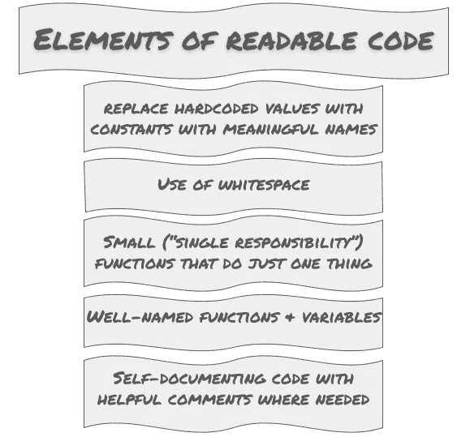

# 五个协作数据科学的软件工程原则

> 原文：[`towardsdatascience.com/five-software-engineering-principles-for-collaborative-data-science-ab26667a311?source=collection_archive---------9-----------------------#2023-01-13`](https://towardsdatascience.com/five-software-engineering-principles-for-collaborative-data-science-ab26667a311?source=collection_archive---------9-----------------------#2023-01-13)

## 可重复的数据科学项目需要项目组织和干净的代码

 [Jo Stichbury](https://stichbury.medium.com/?source=post_page-----ab26667a311--------------------------------)

·

[关注](https://medium.com/m/signin?actionUrl=https%3A%2F%2Fmedium.com%2F_%2Fsubscribe%2Fuser%2F49dd0198b639&operation=register&redirect=https%3A%2F%2Ftowardsdatascience.com%2Ffive-software-engineering-principles-for-collaborative-data-science-ab26667a311&user=Jo+Stichbury&userId=49dd0198b639&source=post_page-49dd0198b639----ab26667a311---------------------post_header-----------) 发表在 [Towards Data Science](https://towardsdatascience.com/?source=post_page-----ab26667a311--------------------------------) ·10 分钟阅读·2023 年 1 月 13 日

--

传统的软件工程师在代码中制定规则。相比之下，数据科学家依赖于学习算法来分析数据中的模式。然而，分析项目仍然需要依赖传统代码，作为数据科学家，你可以从最初由软件工程领域首创的最佳实践中获益。

用一个比喻来说，假设你是一位厨师，正在准备一顿丰盛的晚餐。在厨房里，你有不同的食材和工具，你的工作是使用这些工具，并将食材以正确的方式组合在一起，做出美味的菜肴。你和你的顾客都希望你的菜肴既美味又不被烤焦或生煮。一间杂乱无章的厨房让其他人很难做出你的菜肴，因此一位优秀的厨师会花时间保持厨房整洁，标记食材，并在一套食谱中记录下菜肴的制作过程。

[Louis Hansel](https://unsplash.com/@louishansel?utm_source=unsplash&utm_medium=referral&utm_content=creditCopyText) 的照片，来自 [Unsplash](https://unsplash.com/photos/0sYLBZjgTTw?utm_source=unsplash&utm_medium=referral&utm_content=creditCopyText)

同样，作为数据科学家，你希望我们的输出和洞察是正确且可重复的。在你的“代码厨房”中遵循最佳实践，有助于你创建有序的代码，这样你和其他人在未来可以继续进行分析项目，理解、扩展和重用它。

在这篇文章中，我们将讨论一些方法，以使你的“胶水代码”既可靠又高效且易于理解。当你开始在原型上编写代码时，可能不会优先考虑可维护性和一致性，但采用一种已经被证明有效的文化和工作方式，可以让你的原型更快地准备好投入生产。

> “精心设计的数据科学代码可以帮助你解锁有价值的洞察。”

# 1\. 使用标准且逻辑的项目结构

虽然数据科学旨在生成一系列洞察，如报告和可视化，但考虑生成这些洞察的程序代码的质量也是至关重要的。虽然数据实验可能会有偶然的结果，但你和你的潜在同事需要能够扩展实验并在未来重新运行它。

最好从相同的、一致的、逻辑的项目结构开始每个实验。任何查看项目的人都可以理解布局，而不需要 extensive documentation。组织良好的代码通常具有自我文档化的特点，因为它提供了上下文。

对每个项目使用相同的结构有助于可重复的协作，这意味着你可以对分析得出的结论充满信心。你是否曾尝试重现几个月前做的事情？你可能当时掌握了所有细节，但如果项目被搞得一团糟，返回时几乎要从头开始。

一致且可靠的项目使你更容易回顾和与他人分享，以便你的团队成员可以轻松维护和修改你的项目。

没有唯一的对或错的方法，但你应该采用一种语义文件夹结构，其中位置编码了含义（例如，配置、数据、文档、笔记本和源代码的文件夹）。这种方法使项目导航变得容易，因为对象的位置描述了其用途。

如果你在寻找灵感，可以查看 [DrivenData](https://www.drivendata.org/) 关于 [CookieCutter Data Science](http://drivendata.github.io/cookiecutter-data-science) 的页面，他们描述其为“一个逻辑性强、相对标准化但灵活的数据科学工作和分享的项目结构”。并且看看开源项目 [Kedro](https://www.kedro.org/)，它基于 CookieCutter Data Science 的学习，提供可修改的项目启动模板以自定义你的模板。

图片来源：[Max Komthongvijit](https://unsplash.com/@mcks?utm_source=unsplash&utm_medium=referral&utm_content=creditCopyText) 于 [Unsplash](https://unsplash.com/photos/_RwtD1MrUrw?utm_source=unsplash&utm_medium=referral&utm_content=creditCopyText)

# 2\. 通过依赖管理使你的环境可重复

大多数数据科学 Python 代码会导入第三方包，这些包提供可重用的功能。这些包有不同的版本，通常对其他 Python 包的特定版本有依赖关系。

依赖管理记录了你的项目的确切工作环境，因此可以通过安装等效的包集来在不同的干净环境中轻松重现设置。

一种选择是将每个包依赖和子依赖的列表写入文档中。推荐的方法是使用标准化、可重复、广泛接受的格式来列出这些信息，比如 `pip install` 的输入。

对于你的项目直接依赖的每个包，列出它及其需要的版本以进行“固定”。包可能会频繁更新；固定可以保护你免受更改引入的错误或不兼容变化的影响。

图片来源：[Duane Mendes](https://unsplash.com/@duanemendes?utm_source=unsplash&utm_medium=referral&utm_content=creditCopyText) 于 [Unsplash](https://unsplash.com/photos/JrRoJlGyZwk?utm_source=unsplash&utm_medium=referral&utm_content=creditCopyText)

## 虚拟环境

如果你在使用 Python，始终为你的项目使用虚拟环境，以保护环境免受全局环境潜在更改的影响。例如，如果你依赖于 Pandas 项目中 2021 年引入的一个功能，但另一个项目需要较旧的版本，那么如果你在一个全局空间中工作，就会出现冲突。

为每个项目保持一个独立的干净环境，例如使用 `conda` 或 `venv`，可以确保更好的项目可重复性，因为你可以避免版本冲突。

[了解更多关于为什么你需要虚拟环境](https://realpython.com/python-virtual-environments-a-primer/#why-do-you-need-virtual-environments)

在 YouTube 上了解 Python 虚拟环境工具和工作流：[`youtu.be/YKfAwIItO7M`](https://youtu.be/YKfAwIItO7M)

# 3\. 通过使代码可读来提高其可重用性

[**《代码整洁之道：敏捷软件工艺手册》**](https://learning.oreilly.com/library/view/clean-code-a/9780136083238/)是一本 2008 年的软件工程书籍，提出了无论使用什么编程语言或其目的，都应遵循的最佳实践。它提出了从头开始编写良好代码和改进糟糕代码的几个原则，并描述了“代码异味”，这些异味表明你的代码“出了问题”。

除了阅读书籍，你还可以找到许多[视频](https://youtu.be/7EmboKQH8lM)、[培训课程](https://www.udemy.com/course/writing-clean-code/)和书籍总结，根据你需要的详细程度。我的意图不是在这里复述所有内容，而是考虑书中描述的一个方面：代码可读性。

> “代码被阅读的频率远高于编写的频率。”

虽然似乎没有单一来源的引述，但它常被归于 Python 编程语言的创建者 Guido van Rossum 和里程碑[PEP8 文档](https://www.python.org/dev/peps/pep-0008/)的贡献者，该文档提供了[编写可读代码的指导](https://realpython.com/python-pep8/#why-we-need-pep-8)。

你可以通过遵循常见标准和惯例，并要求你的团队进行代码审查来提高代码的可读性。你可能会在开始时集中精力于代码的功能，但如果你在编写代码时使其可读，你会发现后续工作更简单。清晰有助于调试，如果其他人检查过并确认理解你的方法以及遵循一些基本规则，你会发现维护起来更容易。

在查看你的代码（或别人的代码）时，有几个提示：

可读代码的要素：Jo Stichbury（2023）公有领域

+   初学者常常使用缩写或短名称来命名函数和变量。如果你没有编写这些代码，很难理解它们；即使你编写了，也会发现几个月后很难理解。[**创建有意义的名称**](https://medium.com/@pabashani.herath/clean-code-naming-conventions-4cac223de3c6)。

+   最好的代码是自我文档化的，意味着理解它所需的注释很少，但**注释有助于在函数级别记录非平凡的代码**。只要不要写出重复代码的大块文字即可。

+   **通过使用空白来使代码可读**。如果你使用 Python，你会发现这很简单，因为 Python 给空白赋予了语法意义。

+   [**编写只做一件事的小函数**](https://medium.com/swlh/clean-code-writing-functions-or-methods-4e6e53ff4ac2)，具有单一返回路径和有限数量的参数。

+   **不要使用硬编码的值**；相反，使用精确命名的常量，并将它们全部放入一个配置文件中，以便你可以轻松找到和更新它们。像 [OmegaConf](https://omegaconf.readthedocs.io/en/2.3_branch/)、[python-anyconfig](https://python-anyconfig.readthedocs.io/en/latest/) 或 [PyYAML](https://pyyaml.org/wiki/PyYAML) 这样的配置管理工具旨在帮助实现这一点。

## 不要忘记文档

文档还可以帮助代码的可读性，并且在详细程度上有所不同：

+   基本内联注释

+   来自 docstrings 的 API 文档，解释如何使用/重用函数

+   Markdown 文件，如 GitHub 仓库根目录中的 README 页面，解释项目设置或特定使用细节。

保持你的文档最新，否则它可能会误导人，比没有文档更糟，并投入一些时间学习如何构建你的文档以发布它们，使用像 Jekyll 或 Sphinx 这样的工具。

# 4\. 将笔记本代码重构为管道

到目前为止，这些建议已经足够通用，以至于初级软件工程师和数据科学家都能理解。这一点适用于处理数据摄取、转换、模型训练、评分和评估的顺序。

使用 Python 函数和包来形成管道可以对任务执行的顺序进行编码。有几个开源解决方案可以帮助构建这些类型的管道，例如 [GNU Make](https://www.gnu.org/software/make/)，这是一个通用的遗留工具，仍然满足许多现代数据科学的需求，以及用于 Python 的 [Snakemake](https://snakemake.readthedocs.io/en/stable/)。其他受欢迎的管道工具包括 [Kedro](https://kedro.org/)、[Luigi](https://luigi.readthedocs.io/en/stable/)、[Metaflow](https://metaflow.org/)、[Airflow](https://airflow.apache.org/)、[Prefect](https://www.prefect.io/) 和 [Ploomber](https://ploomber.io/)。选择工具时，你应该考虑学习曲线以及是否需要额外的功能，如能够调度管道运行。

## 管道的好处

**可重复性**：任何人都可以用很少的努力从原始数据中再现结果

**正确性**：结果是可以测试的

**可读性**：新的团队成员可以理解并掌握管道

**扩展性**：你可以将一个小的管道扩展为处理多个数据源、使用不同的模型和生成报告。

**可维护性**：你可以编辑和重新测试。正如我们之前描述的那样，Jupyter 笔记本非常适合快速原型，但它们就像你家门口的桌子或装满杂物的抽屉。无论你的意图多么良好，这里总会堆积杂乱的东西，如硬编码常量、打印语句调试和未使用的代码。笔记本中的代码越多，你就越难确定你编写的代码是否按预期工作。

## 测试，测试

使用管道可以将功能放入 Python 模块中，这样你可以测试、更新并再次测试，避免了“僵尸代码”对解释的干扰。[pytest 框架](https://docs.pytest.org/en/7.2.x/) 可以帮助你完成这些任务。

编写测试！如果你在“完成”的定义中包括编写测试（例如单元测试、集成测试和数据验证测试），你就不能跳过它们，并且在估算工作量时会将其计算在内。而且，良好的测试也可以作为文档，因为阅读测试可以帮助理解代码的功能。

在大多数数据科学项目中，大部分代码用于数据转换，而只有一小部分代码库是实际的机器学习。数据转换代码的管道可以进行测试（按定义，它们对相同输入应返回相同输出）。即使是机器学习代码也可以进行测试，以确认其是否按预期工作。你可以编写功能测试，以检查模型的指标（例如准确度、精确度等）是否超过预期阈值。

> “尽早将代码从笔记本中移到 Python 模块和包中，以形成管道，以管理复杂性。”

图片由 [Josué AS](https://unsplash.com/@yehoshuaas?utm_source=unsplash&utm_medium=referral&utm_content=creditCopyText) 提供，来源于 [Unsplash](https://unsplash.com/photos/giAWrAVF37A?utm_source=unsplash&utm_medium=referral&utm_content=creditCopyText)

# 5\. 投资一些时间掌握版本控制

版本控制系统（VCS）如 [Git](https://git-scm.com/)、[Mercurial](https://www.mercurial-scm.org/) 或 [Subversion](https://subversion.apache.org/) 允许你存储代码的检查点版本，以便你可以修改代码但在以后回滚到先前的版本。这就像拥有一系列备份，更重要的是，你可以与其他开发人员共享这些备份。

投资一些时间学习版本控制的原则，以最大化其带来的价值，这样你可以处理更复杂的场景，例如棘手的合并。还有一些优秀的实践材料可供学习，例如 [Git 快速入门指南](https://docs.github.com/en/get-started/quickstart/set-up-git) 和 [学习 Git 分支教程](https://learngitbranching.js.org/)。

*在 YouTube 上 15 分钟学会 Git:* [`youtu.be/USjZcfj8yxE`](https://youtu.be/USjZcfj8yxE)

一些数据科学家学习了 `commit` 的基础知识，但这里有一些最佳实践需要考虑：

+   经常提交：如果你在大幅修改代码而没有提交更改，你可能会冒着失去已经花费时间的风险，因为不小心添加了一个破坏代码的更改，之后可能无法回滚。此外，喝咖啡时要小心放在笔记本电脑旁边！如果其他人也在进行代码修改，代码库可能会发生变化，而当你进行提交时，你可能会面临冲突和合并地狱。

+   只提交你需要的：如果文件是为了你的个人本地配置、秘密，例如数据库登录凭证或构建结果生成的中间文件，则不应存储所有文件。学习如何使用`.gitignore`。

+   不要在版本控制中存储原始数据。原始数据不会改变，所以你不需要对其进行版本控制。对于可以从原始数据和你的代码生成的中间数据文件也是如此。如果需要跟踪转化后的数据，可以使用不同的数据/工件/工作流版本控制工具，如 DVC（数据版本控制）或 Pachyderm，这些工具可以扩展你的 Git 代码版本控制。

使用版本控制在自己的项目和团队中有诸多好处，你可以大胆尝试任何代码中的风险，因为你可以迅速恢复到一个已知的、可用的状态。将稳固的版本控制系统流程与测试结合起来，提供了一种强大的工作方式。当你的代码产生正确结果时，保存它；然后在下一次更改代码时，重新运行测试。如果测试通过，说明你可能没有破坏任何东西。如果测试不通过，你可以重新工作或恢复。

# 摘要

自从哈佛商业评论 [反映出对数据科学家的日益增长需求](https://hbr.org/2012/10/data-scientist-the-sexiest-job-of-the-21st-century) 已经过去了十多年：那些能够结合编程、分析和实验技能的人。虽然进入数据科学的职业道路仍然没有明确的定义，但现在有很多学习的途径，包括：

+   [硕士学位项目](https://www.mastersindatascience.org/)

+   [本科专业](https://www.discoverdatascience.org/programs/bachelors-in-data-science/)

+   [在线课程](https://www.learndatasci.com/best-data-science-online-courses/)

+   [工作中的实践经验](https://medium.com/quantumblack/how-to-build-a-data-portfolio-without-an-analytics-job-3350e45ad0b1)。

通常，这个角色吸引那些对数学有自信、乐于尝试复杂且凌乱的数据集并且能够编程的人。

数据科学现在可能已经确立了自己的角色，但软件开发已经有了几十年的成熟和经验积累。数据科学家可以学习的一些最有价值的技术是那些几代软件工程师建立的技术，例如结合版本控制、测试、可读的干净代码和良好的文件夹结构。这些可以使生产级项目成功与在原型阶段停滞之间产生差异。

如果你是寻求灵感的数据科学家，可以借鉴这些工程最佳实践以实现长期分析成功。
