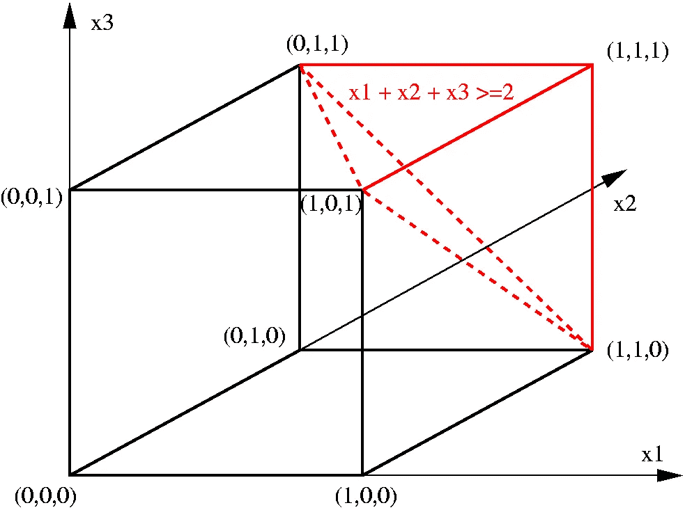

# 处理大型动作空间的五种方法

> 原文：[`towardsdatascience.com/five-ways-to-handle-large-action-spaces-in-reinforcement-learning-8ba6b6ca7472`](https://towardsdatascience.com/five-ways-to-handle-large-action-spaces-in-reinforcement-learning-8ba6b6ca7472)

## 动作空间，尤其是在组合优化问题中，可能会变得庞大无比。本文讨论了处理这些问题的五种策略。

 [Wouter van Heeswijk, PhD](https://wvheeswijk.medium.com/?source=post_page-----8ba6b6ca7472--------------------------------)

·发表于 [Towards Data Science](https://towardsdatascience.com/?source=post_page-----8ba6b6ca7472--------------------------------) ·14 分钟阅读·2023 年 8 月 18 日

--

还有……行动！[照片由 [Jakob Owens](https://unsplash.com/@jakobowens1?utm_source=medium&utm_medium=referral) 提供，来自 [Unsplash](https://unsplash.com/?utm_source=medium&utm_medium=referral)]

处理大型动作空间仍然是强化学习中的一个相当开放的问题。研究人员在处理大型*状态*空间方面取得了重大进展，卷积网络和变压器是一些近期的高调例子。然而，存在三种所谓的**维度诅咒**：状态、结果和动作[1]。到目前为止，后者仍然是相对未被充分研究的。

尽管如此，处理大型动作空间的方法正在不断增长。本文介绍了处理后者的大规模的五种方法，特别关注在组合优化问题中经常遇到的**高维离散动作空间**。

# 回顾一下：维度灾难的三种诅咒

需要快速回顾维度灾难的三种诅咒。假设我们将手头的问题表达为一个 [Bellman 方程](https://medium.com/towards-data-science/why-reinforcement-learning-doesnt-need-bellman-s-equation-c9c2e51a0b7) 系统，请注意有 **三组需要评估**——实际操作中以嵌套循环的形式——每组可能都大得难以承受：

Bellman 方程要求对于每个状态-动作对 (s,a)∈S×A，必须评估所有潜在的结果 s’∈S’，这迅速使得对这个随机优化问题的枚举在计算上变得不可行。

从根本上讲，强化学习是一种蒙特卡罗模拟，通过采样随机过渡而不是枚举所有可能的结果。根据大数法则，样本结果最终应该促进收敛到真实值。通过这种方式，我们将随机问题转化为确定性问题：

值函数近似提供了一个确定性优化问题，在评估状态-动作对时，我们不需要评估整个结果空间，而只是一个单一的下游值。

这种转化使我们能够处理大的*结果*空间。要处理大的*状态*空间，我们必须能够对以前未见过的状态进行概括。常见的方法有特征提取或聚合，这也是研究的主要关注点。

由于我们可以评估一个对应于状态-动作对的单一值——而不是评估所有对应的结果——因此评估数百或数千个动作通常不是问题。对于许多问题（例如象棋、视频游戏），这就足够了，不需要进一步对动作空间进行近似。

尽管如此，*如果*动作空间仍然过大，我们不能使用与结果和状态空间相同的解决方案方法。仅仅对一个动作进行采样——就像我们对结果做的那样——并不能保证它是有效的，而且绕过了学习和使用智能决策策略的概念。像在状态上应用的概括方法也不起作用，因为我们最终需要一个可以应用到环境中的具体动作。因此，我们需要其他的解决方案。

# 什么是“大的”动作空间？

在深入解决方案之前，我们首先需要明确什么是“大的”动作空间。为了概括，我们用一些向量`a=[a_n]_n∈N`表示动作，其中`N`表示动作的维度。

“大的”这个术语可以用多种方式定义：

+   **动作数量：** 一个动作可以假设的值的数量。请注意，这个数量可能是无限的，例如整个整数域。显然，对于基于向量的动作，动作数量增加得比基于标量的动作快得多。考虑一个 9 维向量，其中每个元素可以取 10 个值。那么，总的动作空间已经达到 10⁹ = 10 亿个动作！

+   **连续决策变量：** 如果动作向量包含一个或多个连续变量，则动作的数量在定义上是无限的。连续变量在例如机器人学中很常见，其中关节运动由实值数表示。

+   **维度**：对于[基于向量的决策](https://medium.com/codex/quickly-generate-combinatorial-action-spaces-15962118e508)，维度（元素数量）有巨大的影响——每增加一个元素，复杂性就呈指数级增加。特别是当动作是排列时，基于向量的决策空间会迅速变得非常大。

+   **可枚举的**：按照传统标准，一个有十亿个动作的动作空间可能被认为是‘大’的；你肯定不想在每次迭代时评估十亿个动作。不过，这样的动作空间仍然可以在计算机内存中被枚举和存储。相比之下，其他问题的动作空间巨大到我们根本无从枚举。如果动作空间随着问题规模的增长呈指数级增长，它们会迅速变得不可处理。

本文的重点将放在**多维离散动作空间**上。这些在现实问题中常常出现，导致组合优化问题的规模迅速膨胀。例如，考虑运筹学问题：管理出租车队、大量物品的库存补货政策、在船上堆放集装箱等。

让我们把我们面对的问题的规模变得更加具体。

> 考虑在一个港口管理集装箱运输，每个集装箱的特点包括（i）目的地，（ii）到期日期和（iii）到达日期。假设我们有 10 个潜在的目的地、20 个到期日期和 5 个到达日期。那么就有 10*20*5 种独特的集装箱类型，这转化为一个 1000 维的动作向量。考虑到一些不同的运输选项和一个适度大的集装箱堆场，创建一个比地球上沙粒还多的动作空间并不难，或者任何你想做的类比。

另一个例子？

> 考虑一个包含 1000 个项目的推荐系统，我们向用户推荐两个项目。因此，有 1000*999（即约 100 万）种项目组合可以推荐。显然，推荐 3 个、4 个或 5 个项目会使动作空间呈指数级增长。

基于向量的动作空间通常会随着动作向量维度的增加而呈指数级增长。组合优化问题以生成非常大的动作空间而臭名昭著，即使对于看似简单的实例也是如此。[作者提供的图片]

# I. 基于演员的方法（仅适用于连续动作空间！）

基于价值的方法，如 Q 学习，在连续动作情况下会崩溃，需要计算**无限数量的 Q 值**。可以对动作空间进行离散化，离散化的粒度决定了动作空间大小和准确性之间的权衡。例如，将方向盘的转动（连续空间）表示为 360 个离散度数，或者 36、3600 等。然而，对于基于向量的决策，这种离散化很快就会失效。

进入基于演员的方法[2]。这些方法通常使用神经网络，将状态作为输入，输出使**从概率分布中采样**的参数。例如，输出节点可以是高斯分布的均值和标准差，我们可以从中采样连续动作。

向量化决策的泛化相当简单，每个向量元素由一个单独的分布表示（即，相对于向量维度的线性缩放）。因此，也**高维连续动作空间**可以被高效处理。

关键在于演员网络**直接将状态映射到动作**，无需检查每个状态-动作对的值。如果需要——如为了减少方差——这些演员方法可以扩展为演员-评论员网络，其中评论员网络是一个扩展，输出生成的状态-动作对的值。对于连续动作空间，演员-评论员方法如 PPO 仍然是最先进的。

对于连续动作空间，演员网络高效地生成和评估动作，例如，通过输出高斯分布的均值和标准差来进行采样。扩展到多维动作向量时，统计参数对应于各个向量元素，从而使输出层的规模与动作维度线性相关。[image by author]

不幸的是，**基于演员的模型在离散动作空间中扩展效果不佳**。在这种情况下，每个输出节点代表单个动作的选择概率。显而易见，如果我们有数十亿个离散动作，这种方法不会很好地扩展。因此，对于离散动作空间，我们需要想出其他解决方案。

# II. 数学编程

许多现实世界的决策问题可以通过**凸动作空间**来表达。凸性是一个非常强大的属性。你真的得亲眼见到才能相信。像 CPLEX 和 Gurobi 这样的解算器能够极其高效地处理大型决策问题，即使它们涉及到**数千个决策变量**，涉及到数百万甚至数十亿的动作[1]。

尤其是对于**线性问题**——许多实际问题（大致上）都是如此——解算器在过去几十年中已被高度优化。注意，分段线性函数可以用来近似非线性函数，例如，神经网络中的 ReLUs [3]。连续决策变量也没有问题。事实上，它们通常更容易处理。

数学程序也非常适合**处理约束**。执行显式可行性检查以构建动作掩码可能很繁琐。约束方程有效地筛选出所有缺失/不可行的动作。

尽管通过数学规划的规模提升可能非常显著，但对于不断增长的动作空间**没有理论保证**。计算工作仍可能随着动作空间的增大而呈指数增长。不过，在实践中，相较于优化，扩展性通常非常可观。

根据问题结构，数学规划的效果可能通过**列生成或贝尔曼分解**等方法得到增强。强大的实现可以将性能提升几个数量级。缺点是这些算法需要对问题结构有深入的了解，并且需要大量的设计工作。

 ## 使用线性规划提升强化学习算法

### 大型和高维的动作空间通常是强化学习中的计算瓶颈。制定…

towardsdatascience.com

# III. 启发式方法

启发式方法对动作空间施加搜索或决策规则，绕过对完整动作空间的评估，以提高速度和效率。

## 动作空间缩减

更高效地搜索动作空间的最简单方法之一是切割其部分区域。显然，这存在切割高质量区域的风险。然而，可以利用领域知识**定义合理的决策规则**，例如：

+   永远不要派遣填充率低于 70%的卡车

+   马里奥应该始终向右移动

+   始终建议在有人购买咖啡机时使用咖啡过滤器

可以看出，这很棘手。有时，马里奥可能需要向左移动以进行跳跃。也许我们需要等很久才能在安静的周内达到 70%的填充率。也许客户对咖啡豆研磨机而非过滤器更感兴趣。人类的专业知识、逻辑和直觉非常强大，但也有明显的缺点。

尽管启发式缩减可能显著降低计算负担，但其设计**高度特定于问题**，当问题实例发生变化时不一定具有可扩展性。

通过切割动作空间的区域（例如，添加约束），搜索可能变得不那么繁琐。然而，不恰当的切割可能会删除高质量的动作。[图片由[Sdo](https://commons.wikimedia.org/wiki/User:Sdo)提供，来源于[维基百科](https://en.wikipedia.org/wiki/Cutting-plane_method#/media/File:TSP_cutting_plane.png)]

## 元启发式方法

基础启发式方法通常依赖于人为定义的决策规则，这些规则可能是次优的。实际上，许多问题结构超出了人类的认知极限。为了自动化地寻找好的解决方案，元启发式（例如，模拟退火、遗传算法）**指导动作空间的搜索**，例如通过偶尔接受非改善的动作或重新组合它们[4]。

**元启发式的搜索过程通常是与问题无关的**，尽管不可避免地会有需要用户设计的特定于问题的元素。参数调整也是必要的——而我们在强化学习中已经有了大量这样的参数——同时，理论保证被放弃了（至少在实际应用中）。

尽管有缺点，元启发式方法在许多极具挑战性的优化问题中已证明了它们的实力，而可调搜索和启发式设计的强大组合确保它可以适应几乎任何动作空间。特别是对于**混乱的现实世界问题**，元启发式方法可能是处理大规模动作空间的最佳选择[1]。

## 数学启发式方法

一种特殊的启发式方法**融合了** **元启发式和数学编程** [5]，旨在利用两者的优势。回顾一下，数学程序特别适合利用凸结构和大量决策变量，而启发式方法可以用来控制搜索空间和过程。如果动作空间如此之大，以至于即使是数学编程也不能在可接受的时间内返回解，将其与启发式方法结合可能是一个解决办法。

通用启发式算法实现包括如局部**分支、邻近搜索和变量固定**等技术。例如：我们可以启发式地减少一个动作空间，然后用数学编程搜索该动作空间。或者，我们可能用数学编程解决一个高层次的程序（例如，将客户分配给车辆），并通过启发式方法填充细节（例如，启发式生成路线）。有很多角度和不同的子程序分布。

数学启发式方法可能非常强大，规模远超纯数学编程——但**牺牲了性能保证**——但也可能设计上相当复杂。然而，当做到正确时，数学编程与启发式方法的结合可能是非常富有成效的。

# IV. 连续到离散的映射

如前所述，基于演员的方法可以通过提供**逐元素输出**有效地处理多维连续动作空间。如果我们能对离散空间做到这一点就好了……

幸运的是，许多离散问题都有一些**潜在的连续表示**。例如：我们可能无法运输`5.742…`个集装箱，但如果这样的实数解能给出好的解决方案，那么运输 5 或 6 个集装箱可能效果很好。

如果所需的连续表示存在，我们可以部署一个演员网络来获得所谓的原型动作（离散动作的连续近似），然后将其转换为“类似”的离散动作。这种**从连续原型动作到离散动作的转换**并不一定简单。是时候深入研究一些实现这一目标的映射了。

## MinMax

将连续动作转换为离散动作的最直接方法是**简单地四舍五入元素**。例如，连续的原型动作 `[3.67…,1.22…,2.49…]` 可以转换为 `[4,1,2]`。这样的映射可以稍微调整，但这就是一般的想法[6]。由于我们只需要采样一个连续动作并应用一个转换，这种方法可以扩展到极大的动作空间，超出枚举的范围。

如果连续量与其离散对应量之间有意义的结构关系，那么直接映射可能效果很好。例如，在库存管理中，将订购数量四舍五入到最近的整数是完全合理的。

不幸的是，并非所有离散动作空间都展示出如此干净的连续表示。假设我们训练一个推荐系统，整数表示要推荐的项目。如果 `a=3` 代表冰箱，而 `a=4` 代表搅拌机，最合适的邻居与原型动作 `3.48…` 相距远远不明显。让我们检查一些更先进的映射。

## *k*-最近邻

*k*-最近邻（*k*nn）方法也从一个原型动作开始，但随后**在离散动作的邻域中搜索**[7]。为了有效地做到这一点，整个动作空间被*先验*编码，这样我们可以快速找到我们可能定义的每个连续动作的 `k` 个最近邻。

在识别邻居后，*k*nn 随后**评估它们的 Q 值**以选择最佳邻居。`k` 的值可以调整，更多的邻居可能识别更好的动作，但代价是更多的计算工作和越来越多的离策略动作。

*k*nn 的优点和缺点都在于其对动作空间的*先验*枚举。预处理阶段使得**邻居的高效查找**成为可能，但也要求空间是可枚举的。

## 学习的动作表示

对于连续原型动作，“最接近”的离散邻居可能不是一个明显的选择，它们之间的关系在动作空间中可能有所不同。与其拥有固定的用户定义邻居，我们还可以学习将连续动作映射到离散动作的动作表示。在一个单独的监督学习阶段，神经网络被应用于**学习每个离散动作的量身定制表示**[8]。

学习的动作表示提供了**强大的泛化能力**，消除了对合适邻居的人工推理的需求，允许应用于复杂的动作空间结构。缺点是必须为每个离散动作学习动作表示，给 RL 算法增加了额外的复杂性。每个表示必须存储在内存中，因此该方法也限制在**可枚举的动作空间**中。此外，学习的动作表示可能在处理高维动作向量时遇到困难，因为目标向量变得越来越难以学习。

学习的动作表示尝试学习嵌入，将连续的原型动作映射到最合适的离散邻居，具体取决于动作空间的结构 [照片由 [Michael Busch](https://unsplash.com/@migelon?utm_source=medium&utm_medium=referral) 提供，来自 [Unsplash](https://unsplash.com/?utm_source=medium&utm_medium=referral)]

## 动态邻域搜索

MinMax 方法在其映射中简单直观，但最接近的邻居可能不总是最合适的。像 *k*nn 和学习的动作表示这样的算法处理复杂的动作空间，但需要为每个动作提供显式的嵌入，因此只处理可枚举的动作空间。通过动态邻域构建 [9]，**离散邻域到原型动作被即时生成和评估**，从而扩展到超出枚举的动作空间。遵循以下两个步骤：

+   **扰动**：通过扰动方案有效地生成邻域，每次改变一个元素，使得计算工作量与动作向量的维度成线性关系。

+   **模拟退火**：该扰动方案有效地生成离散动作的邻域，但省略了需要多元素扰动的动作。为了恢复这些动作（如果需要），模拟退火会探索新邻域，针对具有最高 Q 值的动作。

类似于 MinMax，动态邻域搜索需要一个**特定的动作空间结构**，其中小的扰动生成具有相似奖励的邻域。这种结构在许多实际问题中（例如，时空表示）可能存在，但该方法不能推广到所有离散动作空间。最后，每次迭代的运行时间较长，因为需要每次生成和评估动作，尽管它可能找到更优的动作。

# V. 因式分解

因式分解（或称为分解）是一种方法，**将动作分组并为每个分组找到动作表示**，使得这些表示更易于学习。

因式分解方法的一个例子是**二值化**，其中所有行动都以二进制代码表示 [10,11]。对于每一位，学习一个相关的价值函数/子策略，指数性地减少评估次数。对于许多方法来说，完全枚举行动空间是先决条件。

二值化可以在超立方体上表示，我们可以对每一位进行结构化搜索 [图像来源：[Vlad2i](https://commons.wikimedia.org/wiki/User:Vlad2i~commonswiki) 通过 [Wikimedia](https://commons.wikimedia.org/wiki/File:Hypercube.png)]

一种特殊的因式分解变体使用**层次化或多智能体推理**来因式分解行动空间 [12]。考虑管理一队出租车，其中每辆出租车的分配由单独的向量元素表示。对这支车队进行集中控制会产生大量的组合，这些组合都需要进行评估。

相反，我们可以**在个体智能体的层面进行推理**，在其局部环境中解决一个更简单的分配问题。鉴于上下文，这种多智能体视角可能是合理的，因为在城市另一边的出租车决策对当地决策的影响可能微乎其微。

尽管计算上比集中控制要容易得多，但得到的解决方案可能是次优的，例如，两辆出租车可能会接受同一个客户。为了确保行动的可行性并可能使用全局系统知识来改进它，**需要一个事后同步步骤**。

多智能体或层次化 RL 方法的设计可能具有挑战性，其适用性很大程度上取决于具体问题。然而，如果操作得当，分解可能会产生高质量的全局解决方案，同时在局部层面进行更快速的推理。

# TL;DR

这篇文章相当长，因此如果你直接滑到最后，我不会怪你。这张表总结了最突出的要点。

对处理大行动空间的五种策略的简要描述，包括它们的优缺点 [图像来源：作者]

*作者的其他强化学习文章：*

 ## 近端策略优化（PPO）解释

### 从 REINFORCE 到连续控制中的首选算法的旅程

[往数据科学的方向看  ## 强化学习中的策略梯度解释

### 了解基于似然比的策略梯度算法（REINFORCE）：直觉、推导、……

[towardsdatascience.com  ## 强化学习的四种策略类别

[towardsdatascience.com

# 参考文献

[1] Powell, W. B. (2022). *强化学习与随机优化：序列决策的统一框架*。John Wiley & Sons。

[2] Sutton, R. S., & Barto, A. G. (2018). *强化学习：导论*。MIT Press。

[3] Van Heeswijk, W. & La Poutré, H. (2020 年 12 月). 线性离散动作空间中的深度强化学习。在 *2020 IEEE* *冬季模拟会议 (WSC)* (第 1063–1074 页)。

[4] 维基百科贡献者 (2023). 元启发式算法。 [`en.wikipedia.org/wiki/Metaheuristic`](https://en.wikipedia.org/wiki/Metaheuristic)

[5] Fischetti, M., Fischetti, M. (2018). 数学启发式。在: Martí, R., Pardalos, P., Resende, M. (编) 启发式手册。Springer, Cham。

[6] Vanvuchelen, N., Moor, B. de & Boute R. (2022). 使用连续动作表示来扩展用于库存控制的深度强化学习。SSRN, 2022 年 10 月。[`dx.doi.org/10.2139/ssrn.4253600`](https://dx.doi.org/10.2139/ssrn.4253600)。

[7] Dulac-Arnold 等 (2015). 大规模离散动作空间中的深度强化学习。arXiv 预印本 arXiv:1512.07679。

[8] Chandak, Y. 等 (2019). 强化学习的动作表示学习。在国际机器学习会议上，页码 941–950。PMLR, 2019。

[9] Akkerman, F., Luy, J., Van Heeswijk, W., & Schiffer, M. (2023). 通过动态邻域构建处理大规模离散动作空间。*arXiv 预印本 arXiv:2305.19891*。

[10] Dulac-Arnold 等 (2012). 快速强化学习与

使用误差校正输出代码的大动作集的 MDP 分解。在联合欧洲机器学习与数据库知识发现会议上, 180–194。

[11] Pazis J. & Parr, R. (2011). 大动作集的广义价值函数。在第 28 届国际机器学习大会 (ICML-11) 论文集中, 1185–1192。

[12] Enders, T., Harrison, J., Pavone, M., & Schiffer, M. (2023). 用于按需自主移动系统的混合多智能体深度强化学习。在 *动态与控制学习会议* (第 1284–1296 页)。PMLR。
