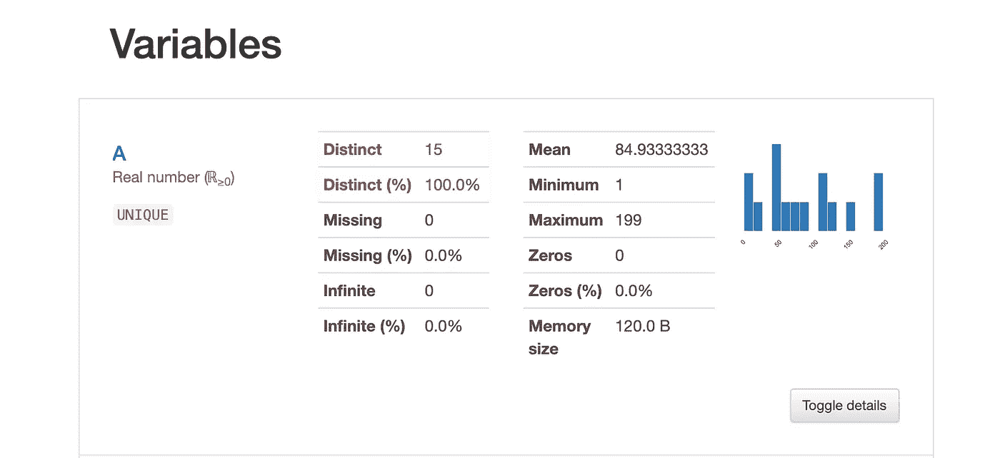

# 遵循此数据验证过程以提高数据科学准确性

> 原文：[`towardsdatascience.com/follow-this-data-validation-process-to-improve-your-data-science-accuracy-99422dfbee72`](https://towardsdatascience.com/follow-this-data-validation-process-to-improve-your-data-science-accuracy-99422dfbee72)

## 当训练数据和推断数据来自不同来源时

[](https://datascience2.medium.com/?source=post_page-----99422dfbee72--------------------------------)[](https://towardsdatascience.com/?source=post_page-----99422dfbee72--------------------------------) [Matt Przybyla](https://datascience2.medium.com/?source=post_page-----99422dfbee72--------------------------------)

·发表于 [Towards Data Science](https://towardsdatascience.com/?source=post_page-----99422dfbee72--------------------------------) ·阅读时间 8 分钟·2023 年 9 月 1 日

--


图片由 [NordWood Themes](https://unsplash.com/@nordwood?utm_source=unsplash&utm_medium=referral&utm_content=creditCopyText) 提供，出处：[Unsplash](https://unsplash.com/photos/E9tFH39iRPE?utm_source=unsplash&utm_medium=referral&utm_content=creditCopyText) [1]。

# 目录

1.  介绍

1.  启用数据收集

1.  设置基准

1.  检测异常值

1.  摘要

1.  参考资料

# 介绍

本文旨在为数据科学家提供数据验证过程的指南，特别是那些刚开始或希望改进现有数据验证流程的人，提供了一些示例作为一般性概述。首先，我想在这里定义数据验证，因为它对其他类似职位的意义可能不同。为了本文的目的，我们将数据验证定义为确保用于模型的训练数据与推断数据一致的过程。对于一些公司和一些用例，如果数据来自同一来源，则无需担心此问题。因此，这个过程必须发生，并且只有在数据来自不同来源时才有用。数据不会来自相同来源的一些原因包括，如果你的训练数据是历史数据和自定义数据（*例如：从现有数据中提取的特征*），和/或你的推断数据来自实时表格，而训练数据是快照数据。总之，这种不匹配的原因有很多，制定一个规模化的过程来确保你在推断时提供给模型的数据是你——即训练好的模型数据所期望的，将极有益处。

# 启用数据收集


照片由 [Dennis Kummer](https://unsplash.com/@dekubaum?utm_source=unsplash&utm_medium=referral&utm_content=creditCopyText) 提供，来自 [Unsplash](https://unsplash.com/photos/52gEprMkp7M?utm_source=unsplash&utm_medium=referral&utm_content=creditCopyText) [2]。

有很多方法可以启用数据收集。但再次强调，我们首先要定义收集的***数据***，即推理数据。我们预计我们的训练数据（*包括训练集和测试集*）已经存储在某处，也许是在 S3、文件存储工具、数据库中的临时表，甚至是 CSV 文件等。

然而，推理数据在预测时使用更为常见，但不一定会被存储。因此，你需要启用其收集。类似于训练数据的示例，你可以将推理数据存储在数据库表、数据湖、CSV 文件、JSON 文件、S3、已存储的 Kafka 流等。选择哪种收集方式将取决于你公司提供的选择。

还有一些工具、库和 Python 函数可以启用推理数据存储。

> 下面是一些可以用来收集推理数据的工具：

+   **Kafka 流入数据库**：调用模型的服务端点可以将数据加载到 Kafka 流中，然后从那里，你可以将数据加载到数据库表中

+   [**Amazon Web Services 捕获内容**](https://docs.aws.amazon.com/sagemaker/latest/dg/model-monitor-data-capture-endpoint.html) **[3]**：这个工具非常用户友好，并允许你在模型代码中添加一个参数。你将需要使用 Amazon SageMaker 来使用这个工具。

代码示例如下，你可以看到如何简单地将参数添加到 AWS SageMaker 模型代码中，如果这是你正在使用的工具：

```py
# Configuration object passed in when deploying Models to SM endpoints
data_capture_config = DataCaptureConfig(
    enable_capture = enable_capture, 
    sampling_percentage = sampling_percentage, # Optional
    destination_s3_uri = s3_capture_upload_path, # Optional
    capture_options = ["REQUEST", "RESPONSE"],
)

# Example code from AWS [3]
```

对于具体工具的详细介绍，我将在下一篇文章中展开，并重点介绍代码。目前，在你的数据验证计划中，你需要确保有一种方法来捕获和存储推理数据，以及你的训练数据。

# 设定基准线



变量示例。截图由作者提供 [4]。

基准线有助于理解你的训练数据。理解你的数据应该如何在视觉上呈现并记住它可能会让人感到困惑，因此最好创建一个从数据中导出描述性统计的自动化过程。

> 基准数据示例

对于**分类列**（*字符串、对象、类别等*），你可以为已知数据和预期缺失的数据创建基准线：

+   唯一的 X 列值，例如：“*八月、九月*”

对于**数值列**（*整数、浮点数*）：

+   列 X 平均值

+   列 Y 标准差

+   列 X、Y 最小值、最大值等，例如：20,000.60

尽管这看起来相当简单，但当你的模型和数据变得更大时，尽早跟踪数据将是有益的，这样你可以理解何时以及为何你的推断数据中会出现异常值。

上述是创建基线统计的一般示例，下面将介绍一个非常易于使用的具体工具

> Pandas Profiling：

这个 [Python 库](https://medium.com/r?url=https%3A%2F%2Fgithub.com%2Fpandas-profiling%2Fpandas-profiling) [5] 为你执行了大量的探索性工作，这将作为你的数据基线信息。总体而言，这个库会查看以下类型的基线统计。

**分位数**：

+   最小值

+   第 5 百分位数

+   Q1，中位数，Q3，第 95 百分位数

+   最大值

+   范围

+   四分位距（IQR）

**描述性**：

+   标准差

+   变异系数（CV）

+   峰度

+   平均值，中位数绝对偏差（MAD）

+   偏度

+   总和

+   方差

+   单调性

```py
# install library 
#!pip install pandas_profiling
import pandas_profiling
import pandas as pd
import numpy as np

# create data 
df = pd.DataFrame(np.random.randint(0,200,size=(15, 6)), columns=list('ABCDEF'))

# run your report!
df.profile_report()
```

# 检测异常值


由 [Will Myers](https://unsplash.com/@will_myers?utm_source=unsplash&utm_medium=referral&utm_content=creditCopyText) 在 [Unsplash](https://unsplash.com/photos/ku_ttDpqIVc?utm_source=unsplash&utm_medium=referral&utm_content=creditCopyText) 拍摄的照片 [6]。

现在你已经收集了训练数据和推断数据，并且有了预期的基线值，你可以知道当推断中的值变为异常值时。

需要记住的是，训练数据本身被假设为 100%准确，因为它被用作真相源。

有了收集的推断数据，你可以使用大量工具、库、模块等，将推断数据与训练数据进行比较。

为了进一步说明这一点，我会给出两个例子，一个没有问题，另一个是异常值。

> 这里是一个分类数据和数值数据的非异常值示例：

+   训练数据分类特征（*months*）→ “*August*”

+   推断数据分类特征（*months*）→ “*September*”

+   训练数据数值特征（*temperature*）→ 100

+   推断数据数值特征（*temperature*）→ 110

> 这里是一个分类数据和数值数据的异常值示例：

+   训练数据分类特征（*months*）→ “*August*”

+   推断数据分类特征（*months*）→ “*AUgust*”

+   训练数据数值特征（*temperature*）→ 100

+   推断数据数值特征（*temperature*）→ 1000000000

再次看似显而易见，但想象一下你有 50+个特征和 100,000 行数据。几乎不可能检查所有数据是否符合预期。

此外，为了更突出这个例子，虽然“*August*”与“*AUgust*”看起来相似，但模型当然不会将它们视为相同的值。对于数值数据，我们也不希望我们的温度读数如此之高。

虽然这些值在推理时显然不正确，但模型仍然可以对它们进行预测（*取决于你的模型*），这使得知道何时发生这种情况变得更加困难。

作为额外内容，你需要设置一个过程以确保你的预测与你的期望一致。

举个具体的例子，你可以使用***Amazon SageMaker Model Monitoring***工具，或者如果你在其他平台，可以使用像[TensorFlow Data Validation](https://www.tensorflow.org/tfx/data_validation/get_started) [7]这样的开源库。

```py
 stats = tfdv.generate_statistics_from_tfrecord(data_location=path)

tfdv.visualize_statistics(stats)

other_stats = tfdv.generate_statistics_from_tfrecord(data_location=other_path)

anomalies = tfdv.validate_statistics(statistics=other_stats, schema=schema)

# You cannot run this code without importing the libraries, however, 
# it is the outline for using the anomlay detection or outlier detection. 

# Code from AWS [7]
```

> 以下是你为什么要使用这个特定库的主要用例[7]，而且正如我之前所说，AWS 在这里很好地解释了原因：

+   “*验证新数据以确保我们没有突然开始接收到不良特征*”

# 总结

了解何时发生离群值可能非常重要，因为你的模型可能会预测出由于数据不准确而可能造成伤害的结果。你不希望在涉及安全的欺诈检测中出现这种问题。

这篇文章作为一个快速大纲和提醒，以确保你的数据不仅对训练模型有用，也适用于预测时。

> 总结一下，我们在这篇文章中讨论了以下内容：

```py
* Enabling Data Collection
* Setting a Baseline
* Detecting Outliers
```

我希望你觉得我的文章既有趣又有用。如果你的数据验证经验相同或不同，请随时在下方评论。为什么会这样？还有哪些其他话题你认为应该更多讨论？这些确实可以进一步澄清，但我希望我能对数据科学家数据验证的常见大纲提供一些见解。如果你希望看到关于这个过程中特定工具的文章，也可以随时评论。

***我与这些公司没有任何关联。***

*请随时查看我的个人资料，* [Matt Przybyla](https://medium.com/u/abe5272eafd9?source=post_page-----99422dfbee72--------------------------------)，*以及其他文章，并通过以下链接订阅以接收我的博客的电子邮件通知，或者通过***点击屏幕顶部的订阅图标****，如有任何问题或评论，请在 LinkedIn 上联系我。*

感谢阅读！

**订阅链接：** [`datascience2.medium.com/subscribe`](https://datascience2.medium.com/subscribe)

**推荐链接：** [`datascience2.medium.com/membership`](https://datascience2.medium.com/membership)

(*如果你在 Medium 上注册会员，我会获得佣金*)

# 参考文献

[1] 图片由 [NordWood Themes](https://unsplash.com/@nordwood?utm_source=unsplash&utm_medium=referral&utm_content=creditCopyText) 提供，在 [Unsplash](https://unsplash.com/photos/E9tFH39iRPE?utm_source=unsplash&utm_medium=referral&utm_content=creditCopyText) 上，（2018）

[2] [Matt Przybyla](https://medium.com/u/abe5272eafd9?source=post_page-----99422dfbee72--------------------------------)，变量示例的截图，（2020）

[3] 2023, 亚马逊网络服务公司或其附属公司。版权所有，[从实时端点捕获数据](https://docs.aws.amazon.com/sagemaker/latest/dg/model-monitor-data-capture-endpoint.html)，（2023）

[4] 由 [Stephen Dawson](https://unsplash.com/@dawson2406?utm_source=unsplash&utm_medium=referral&utm_content=creditCopyText) 拍摄于 [Unsplash](https://unsplash.com/photos/qwtCeJ5cLYs?utm_source=unsplash&utm_medium=referral&utm_content=creditCopyText)，（2018）

[5] pandas-profiling，[GitHub 上的文档和所有贡献者](https://github.com/pandas-profiling/pandas-profiling)，（2020）

[6] 由 [Will Myers](https://unsplash.com/@will_myers?utm_source=unsplash&utm_medium=referral&utm_content=creditCopyText) 拍摄于 [Unsplash](https://unsplash.com/photos/ku_ttDpqIVc?utm_source=unsplash&utm_medium=referral&utm_content=creditCopyText)，（2018）

[7] TensorFlow，除非另有说明，本页面内容按 [知识共享署名 4.0 国际许可证](https://creativecommons.org/licenses/by/4.0/) 许可，代码示例按 [Apache 2.0 许可证](https://www.apache.org/licenses/LICENSE-2.0) 许可。有关详细信息，请参阅 [Google 开发者网站政策](https://developers.google.com/site-policies)。Java 是 Oracle 及/或其附属公司的注册商标，[TensorFlow 数据验证](https://www.tensorflow.org/tfx/data_validation/get_started)，（2023）
