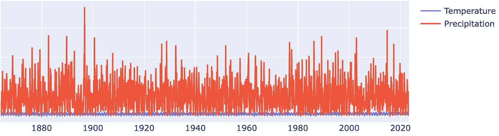
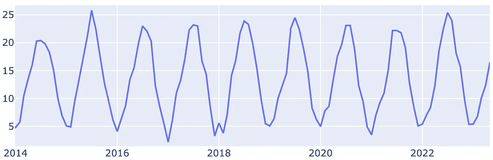
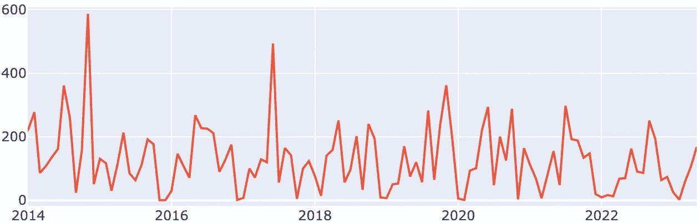
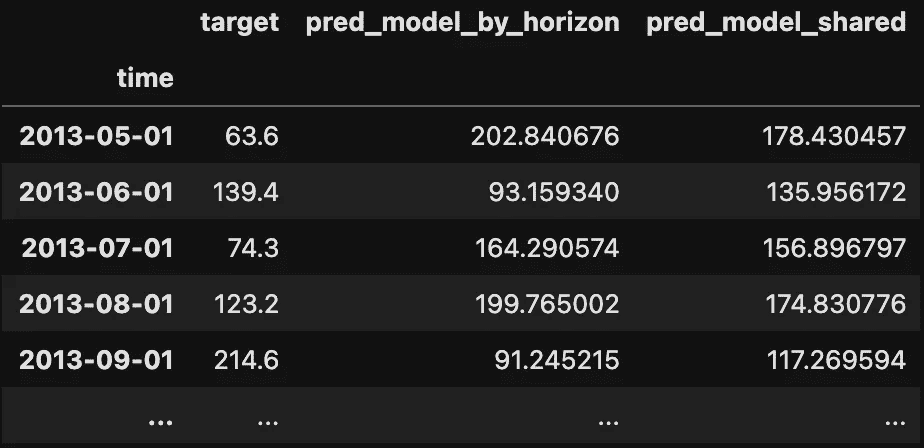
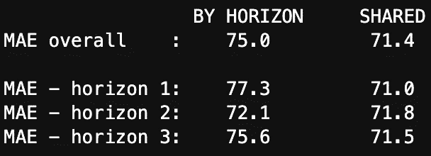
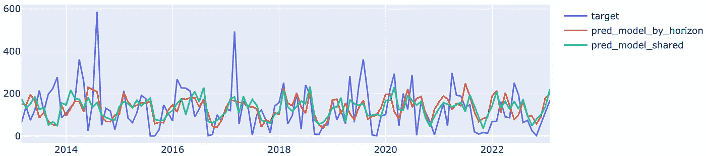

# 预测多个视野：以天气数据为例

> 原文：[`towardsdatascience.com/forecast-multiple-horizons-an-example-with-weather-data-8d5fa4321e07`](https://towardsdatascience.com/forecast-multiple-horizons-an-example-with-weather-data-8d5fa4321e07)

## 使用预测视野作为特征预测瑞士的降水量。

[](https://medium.com/@davide.burba?source=post_page-----8d5fa4321e07--------------------------------)[](https://towardsdatascience.com/?source=post_page-----8d5fa4321e07--------------------------------) [Davide Burba](https://medium.com/@davide.burba?source=post_page-----8d5fa4321e07--------------------------------)

·发表于 [Towards Data Science](https://towardsdatascience.com/?source=post_page-----8d5fa4321e07--------------------------------) ·阅读时长 8 分钟·2023 年 8 月 6 日

--


天气预报，作者：[Giulia Roggia](https://www.instagram.com/giulia_roggia__/)。已获许可使用。

+   介绍

+   示例：瑞士的降水量

# 介绍

## *传统方法*

当我们想要预测时间序列的未来值时，我们通常对多个未来视野感兴趣，例如 1、2 或 3 个月后的情况。预测这些不同视野的传统方法是为每个目标视野训练一个单独的模型。

## *常见替代方案*

一种常见的替代方法是训练一个短期视野的单一模型，然后通过递归应用（即将之前的预测作为输入来产生后续预测）将其扩展到多视野。然而，这种方法可能在生产系统中实施复杂，并且可能导致误差传播：在近视野上的误差可能对后续的视野产生不利影响。

另一种替代方法是用多变量模型同时预测所有视野。然而，支持多变量输出的模型种类有限，并且在数据处理和模型维护上需要额外的努力。

## *视野作为特征*

一种更简单的方法是将为每个视野准备的数据拼接在一起，并添加一个新的“视野”特征。这种方法具有几个**优点**：

1.  它易于理解和实施，因为它只需要训练和维护一个模型。

1.  它可能提高预测准确性，因为模型是在更大的数据集上训练的。它甚至可以作为一种“数据增强”技术使用：如果你只对几个视野感兴趣，你仍然可以在训练阶段添加额外的视野来改善模型估计。

1.  该模型可以用于预测其未经过训练的范围，这在你有多个范围需要预测时可能很有帮助。

这种方法是 [全球模型](https://medium.com/towards-data-science/local-vs-global-forecasting-what-you-need-to-know-1cc29e66cae0) 的另一种表现形式，但在多个预测范围的背景下，而不是多个时间序列。因此，它有类似的 **缺点**：

1.  如果特定预测范围的性能开始下降，更新模型很难而且可能会影响其他范围的预测。

1.  当出现新的预测范围时，可能需要完全重新训练（尽管这不是强制性的）。

1.  你不能使用传统的预测模型（如 ARIMA、指数平滑等）。

# 示例：瑞士的降水量


卢加诺湖，图片由 [Makalu](https://pixabay.com/users/makalu-680451/?utm_source=link-attribution&utm_medium=referral&utm_campaign=image&utm_content=3098927) 提供，来自 [Pixabay](https://pixabay.com//?utm_source=link-attribution&utm_medium=referral&utm_campaign=image&utm_content=3098927)

在本节中，我们展示了“范围作为特征”技术的具体 Python 实现，并将其与每个范围训练一个模型的传统方法进行比较。

我们的目标是预测卢加诺的降水量，这是一座位于瑞士的城市。此示例中使用的数据由 [MeteoSwiss](https://www.meteoswiss.admin.ch/) 提供，数据可以在 [这里](https://www.meteoswiss.admin.ch/climate/climate-change/changes-in-temperature-precipitation-and-sunshine/homogeneous-data-series-since-1864.html) 获得（数据使用已获许可）。

## 数据加载

让我们首先导入必要的库，以便处理数据、可视化数据和训练 LightGBM 模型（如果你对模型的选择感兴趣，可以查看[这篇文章](https://medium.com/towards-data-science/gradient-boosting-a-silver-bullet-in-forecasting-5820ba7182fd)）。

```py
import pandas as pd
import plotly.graph_objects as go
from lightgbm import LGBMRegressor
```

让我们将数据加载到 Pandas 数据框中：

```py
def load_climate_data(path):
    # Load data in a dataframe.
    with open(path,"r", encoding="ISO-8859-1") as f:
        data = f.readlines()
    columns = data[27].split()
    data = [v.split() for v in data[28:]]
    data = pd.DataFrame(data, columns = columns)

    # Fix time
    data["time"] = pd.to_datetime(data.Year + "-" + data.Month.astype(str))
    data = data.drop(columns = ["Year","Month"])
    data = data.set_index("time")

    # Fix types
    data = data.replace("NA",None)
    return data.astype(float)

DATA_PATH = "./data/climate-reports-tables-homogenized_LUG.txt"
data = load_climate_data(DATA_PATH)
```

## 快速数据探索

现在我们可以查看数据：

```py
def show_data(data,title=""):
    trace = [go.Scatter(x=data.index,y=data[c],name=c) for c in data.columns]
    go.Figure(trace,layout=dict(title=title)).show()

# Let's visualize the data.
show_data(data,"Weather Data in Lugano")
```



卢加诺的温度和降水量。图片来源：作者。

我们可以看到，从 1864 年开始，我们有每月的温度和降水量数据（这几乎是 160 年！）。让我们利用 [Plotly](https://plotly.com/) 的交互功能更仔细地查看。



过去 10 年卢加诺的温度。图片来源：作者。



过去 10 年卢加诺的降水量。图片来源：作者。

我们可以看到数据具有季节性，温度比降水量更规律，这符合预期。

由于降水量更难预测，它们也更有趣！让我们尝试预测未来 1、2 和 3 个月的值。

## 数据工程

让我们准备数据以训练预测模型。我们将使用滞后的降水量和温度值来预测未来的降水量：

+   对于降水量，我们考虑最近 3 个滞后值，以及目标月份之前 1 年、2 年和 3 年的滞后值。

+   对于温度，我们考虑最近 2 个滞后值，以及目标月份之前 1 年和 2 年的滞后值。

我们还添加了一个“*month_horizon*”特征，指示我们正在预测哪个月份（例如 1 月或 4 月），以帮助模型学习季节性。注意这与“作为特征的时间跨度”不同，后者取值为 1、2 或 3。

```py
def build_features(data, horizon):
    """Build lagged features.

    We depend on horizon due to relative lags shift. 
    E.g, if the horizon is equal to 1, the target value 
    of 12 months before corresponds to a lag of 11.
    """
    # Here we hardcode values for simplicity, but everything could 
    # (and should) be parametrized.
    precipitation_lags = [0, 1, 2, 12 - horizon, 24 - horizon, 36 - horizon]
    temperature_lags = [0, 1, 12 - horizon, 24 - horizon]

    # Concatenate precipitation and temperature features.
    features = pd.concat(
        [
            build_lagged_features(data.Precipitation, lags=precipitation_lags),
            build_lagged_features(data.Temperature, lags=temperature_lags),
        ],
        axis=1,
    )

    # Add horizon_month as a feature.
    features["horizon_month"] = (features.index.month + horizon - 1) % 12 + 1

    # Trick to later allow concatenation of features for different 
    # target horizons.
    features = features.rename(
        columns={
            f"Precipitation_lag_{12-horizon}": "Precipitation_lag_12_before_target",
            f"Precipitation_lag_{24-horizon}": "Precipitation_lag_24_before_target",
            f"Precipitation_lag_{36-horizon}": "Precipitation_lag_36_before_target",
            f"Temperature_lag_{12-horizon}": "Temperature_lag_12_before_target",
            f"Temperature_lag_{24-horizon}": "Temperature_lag_24_before_target",
        }
    )

    return features

def build_lagged_features(series, lags):
    return pd.concat(
        [series.shift(lag).rename(f"{series.name}_lag_{lag}") for lag in lags],
        axis=1,
    )
```

我们现在可以为每个时间跨度构建目标和特征。

```py
def build_target_features(data, horizon):
    targ = build_target(data.Precipitation, horizon)
    feat = build_features(data, horizon)

    # Drop missing values generated by lags/horizon.
    idx = ~(feat.isnull().any(axis=1) | targ.isnull())
    feat = feat.loc[idx]
    targ = targ.loc[idx]

    return targ, feat

def build_target(series, horizon):
    return series.shift(-horizon)

# Let's build the targets and features for each horizon.
HORIZONS = [1,2,3]
target_features = {h: build_target_features(data, h) for h in HORIZONS}
```

## 拆分训练集和测试集

我们将数据中最近 10 年的部分作为测试集：

```py
def split_train_test(target_features, test_size):
    targ_feat_split = {}
    for horizon, (targ,feat) in target_features.items():
        targ_train = targ.iloc[:-test_size]
        feat_train = feat.iloc[:-test_size]
        targ_test = targ.iloc[-test_size:]
        feat_test = feat.iloc[-test_size:]

        targ_feat_split[horizon] = targ_train, feat_train, targ_test, feat_test

    return targ_feat_split

TEST_SIZE = 10 * 12
targ_feat_split = split_train_test(target_features, test_size=TEST_SIZE)
```

## 模型训练

由于我们只关心比较这两种不同的方法，因此两种情况下我们都保持默认超参数。

让我们开始传统方式训练模型，为每个时间跨度训练一个：

```py
def train_models_by_horizon(targ_feat_split, model_params=None):
    if model_params is None:
        model_params = {}

    # Train one model for each horizon
    models_by_horizon = {}
    for horizon, (targ_train,feat_train,_,_) in targ_feat_split.items():
        model = LGBMRegressor(**model_params)
        model.fit(feat_train, targ_train)
        models_by_horizon[horizon] = model

    return models_by_horizon

models_by_horizon = train_models_by_horizon(targ_feat_split)
```

现在让我们运行另一种方法：使用时间跨度作为特征的单一模型：

```py
def train_model_across_horizons(targ_feat_split, model_params=None):
    if model_params is None:
        model_params = {}

    # Concatenate data across horizons.
    targ_train_all = []
    feat_train_all = []
    for horizon, (targ_train,feat_train,_,_) in targ_feat_split.items():
        # Add horizon as a feature.
        feat_train = feat_train.copy()
        feat_train["target_horizon"] = horizon

        targ_train_all.append(targ_train)
        feat_train_all.append(feat_train)

    targ_train_all = pd.concat(targ_train_all)
    feat_train_all = pd.concat(feat_train_all)

    # Train a single model.
    model = LGBMRegressor(**model_params)
    model.fit(feat_train_all, targ_train_all)

    return model

model_shared = train_model_across_horizons(targ_feat_split)
```

## 在测试集上进行预测

让我们用这两种方法对测试集进行预测：

```py
def predict_models_by_horizon(targ_feat_split, models_by_horizon):
    preds = {}
    for horizon, (_,_,_,feat_test) in targ_feat_split.items():
        preds[horizon] = models_by_horizon[horizon].predict(feat_test)
    return preds

def predict_model_across_horizons(targ_feat_split, model):
    preds = {}
    for horizon, (_,_,_,feat_test) in targ_feat_split.items():
        # Add horizon as a feature.
        feat_test = feat_test.copy()
        feat_test["target_horizon"] = horizon

        preds[horizon] = model.predict(feat_test)
    return preds

preds_by_horizon = predict_models_by_horizon(targ_feat_split, models_by_horizon)
preds_model_shared = predict_model_across_horizons(targ_feat_split, model_shared)
```

## 错误分析

现在让我们评估预测性能。首先，我们将输出合并成便于比较的格式。

```py
# Let's combine the output in a convenient format.
output = {}
for horizon in HORIZONS:
    df = targ_feat_split[horizon][2].rename("target").to_frame()
    df["pred_model_by_horizon"] = preds_by_horizon[horizon]
    df["pred_model_shared"] = preds_model_shared[horizon]
    output[horizon] = df
```

下面您可以看到时间跨度为 1 个月的输出数据框的开头部分。



时间跨度为 1 个月的输出数据框。图片由作者提供。

我们现在计算并打印整体和每个时间跨度的平均绝对误差（MAE）。

```py
def print_stats(output):
    output_all = pd.concat(output.values())
    mae_by_horizon = (output_all.target - output_all.pred_model_by_horizon).abs().mean()
    mae_shared = (output_all.target - output_all.pred_model_shared).abs().mean()
    print("                 BY HORIZON     SHARED")
    print(f"MAE overall    :    {mae_by_horizon:.1f}         {mae_shared:.1f}\n")

    for h,df in output.items():   
        mae_by_horizon = (df.target - df.pred_model_by_horizon).abs().mean()
        mae_shared = (df.target - df.pred_model_shared).abs().mean()
        print(f"MAE - horizon {h}:    {mae_by_horizon:.1f}         {mae_shared:.1f}")

# Let's show some statistics.
print_stats(output)
```

这将产生：



我们看到跨时间跨度共享的模型总是导致较低的误差。这在某种程度上是预期的，因为它是在更大的数据集上训练的。

让我们看看一些预测结果：

```py
# Let's have a look at the predictions.
for horizon, df in output.items():
    show_data(df,f"Predictions at Horizon {horizon}")
```

这里为了简洁，只显示时间跨度为 3 个月的预测：



时间跨度为 3 个月的预测。图片由作者提供。

我们看到模型仍然无法捕捉到极端事件（如 2014 年 8 月）。这并不令人惊讶，因为：

+   我们对系统的实际状态了解非常有限。

+   极端事件很难通过机器学习进行预测，因为定义上在训练集中观察到的实例有限。

## 下一步

我们可以尝试几个方法来提高预测性能。以下是一些非详尽的列表：

+   通过使用 L2 损失来惩罚大误差。

+   目标转换，例如取平方根。

+   包括月内数据。包括额外的数据来源。

+   使用在更多目标上训练的全局模型。

+   更频繁地进行再训练，例如每年。

+   超参数调整。

要评估这些变化是否提高了预测准确性，您应该依赖于一个[可靠的回测策略](https://medium.com/towards-data-science/why-backtesting-matters-and-how-to-do-it-right-731fb9624a)。

*本示例中使用的完整代码可以在* [*这里*](https://github.com/davide-burba/code-collection/) *找到*。

*喜欢这篇文章吗？* [*查看我的其他文章*](https://medium.com/@davide.burba) *并关注我以获取更多内容！* [*点击这里*](https://medium.com/@davide.burba/membership) *阅读无限制的文章，并在不增加您额外成本的情况下支持我* ❤️
