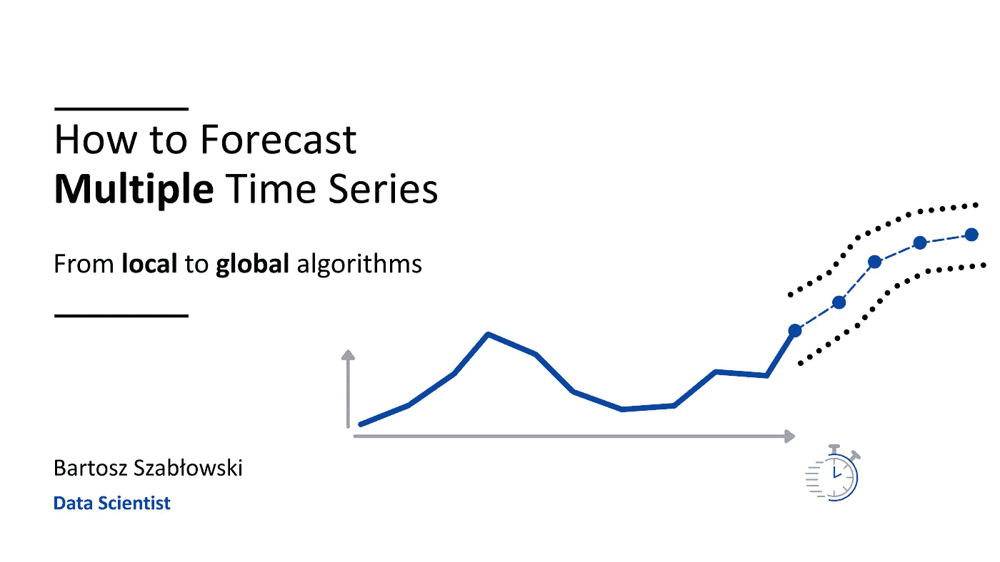

# 像大师一样预测多条时间序列

> 原文：[`towardsdatascience.com/forecast-multiple-time-series-like-a-master-1579a2b6f18d?source=collection_archive---------1-----------------------#2023-04-26`](https://towardsdatascience.com/forecast-multiple-time-series-like-a-master-1579a2b6f18d?source=collection_archive---------1-----------------------#2023-04-26)

## 从局部到全球算法

 [Bartosz Szabłowski](https://medium.com/@zukaschikume?source=post_page-----1579a2b6f18d--------------------------------)

·

[关注](https://medium.com/m/signin?actionUrl=https%3A%2F%2Fmedium.com%2F_%2Fsubscribe%2Fuser%2Fec1c87fce576&operation=register&redirect=https%3A%2F%2Ftowardsdatascience.com%2Fforecast-multiple-time-series-like-a-master-1579a2b6f18d&user=Bartosz+Szab%C5%82owski&userId=ec1c87fce576&source=post_page-ec1c87fce576----1579a2b6f18d---------------------post_header-----------) 发布于 [Towards Data Science](https://towardsdatascience.com/?source=post_page-----1579a2b6f18d--------------------------------) ·30 分钟阅读·2023 年 4 月 26 日

--

图片来源于 [Jesús Rocha](https://unsplash.com/@jjrocha?utm_source=medium&utm_medium=referral) 在 [Unsplash](https://unsplash.com/?utm_source=medium&utm_medium=referral)

我处理多个时间序列的预测工作（更准确地说，是需求预测）。在我之前的文章 [*卖出预测与买入预测*](https://medium.com/towards-data-science/sell-out-sell-in-forecasting-45637005d6ee) 中，我介绍了在雀巢实施的需求预测方法。在这篇文章中，我将向你介绍目前用于预测多个时间序列的通用（这并不意味着理想）算法——例如**最先进**的时间序列算法。对于零售商或制造商来说，需求预测是业务的关键。它使他们能够制定更准确的生产计划并优化库存。不幸的是，许多公司（不包括雀巢 :) ）未能意识到这个问题，他们仍使用带有简单统计功能的电子表格。如果他们改变这种做法，就能显著降低成本。毕竟，仓储和过期产品——这些都是额外的成本。

如何预测多个时间序列，图片来源：作者

很难找到一个不熟悉 [**Scikit-learn**](https://scikit-learn.org/) 的数据科学从业者。对于数据框架，你可以使用**Scikit-learn**来处理机器学习中涉及的大部分元素——从数据预处理到超参数选择、评估和模型预测。我们可以分配线性…
