# 像大师一样预测多个时间序列

> 原文：[`towardsdatascience.com/forecast-multiple-time-series-like-a-master-1579a2b6f18d`](https://towardsdatascience.com/forecast-multiple-time-series-like-a-master-1579a2b6f18d)

## 从局部到全局算法

[](https://medium.com/@zukaschikume?source=post_page-----1579a2b6f18d--------------------------------)[](https://towardsdatascience.com/?source=post_page-----1579a2b6f18d--------------------------------) [Bartosz Szabłowski](https://medium.com/@zukaschikume?source=post_page-----1579a2b6f18d--------------------------------)

·发表于[Towards Data Science](https://towardsdatascience.com/?source=post_page-----1579a2b6f18d--------------------------------) ·阅读时间 30 分钟·2023 年 4 月 26 日

--


图片来源：[Jesús Rocha](https://unsplash.com/@jjrocha?utm_source=medium&utm_medium=referral) 于[Unsplash](https://unsplash.com/?utm_source=medium&utm_medium=referral)

我在商业中处理多个时间序列的预测（准确来说，是需求预测）。在我之前的文章中[*Sell Out Sell In Forecasting*](https://medium.com/towards-data-science/sell-out-sell-in-forecasting-45637005d6ee)，我介绍了我在雀巢实施的需求预测方法。在这篇文章中，我想向你介绍目前用于预测多个时间序列的通用（这并不意味着理想）算法——例如**最先进**的时间序列算法。对于零售商或制造商来说，预测需求对业务至关重要。它允许他们制定更准确的生产计划并优化库存。不幸的是，许多公司（并非雀巢 :) ）并未意识到这个问题，他们仍然使用简单统计的电子表格。如果他们能改变这种情况，他们可以显著降低成本。毕竟，仓储和过时产品——这也是额外的成本。


如何预测多个时间序列，作者提供的图片

很难找到一个数据科学领域的人不熟悉[**Scikit-learn**](https://scikit-learn.org/)。对于数据框架，你可以使用**Scikit-learn**来完成机器学习中涉及的大部分元素——从预处理到超参数选择、评估和模型预测。我们可以将线性回归、决策树或支持向量机（SVM）分配给变量*model*，并每次使用相同的方法，如*fit*和*predict*。我们有很大的灵活性，但也有一种简单的方式来实现解决方案。

对于时间序列来说，情况是不同的。如果你在实验并想比较不同的算法，算法本身不仅仅是一个问题。

如果你开始处理时间序列，你需要对它们进行处理，例如重新采样或填补缺失值——[**Pandas**](https://pandas.pydata.org/)对此非常有用。

如果你想进行分解、可视化 ACF/PACF，或检查平稳性测试，那么[**Statsmodels**](https://www.statsmodels.org/)库将非常有用。

对于可视化，你可能会使用[**Matplotlib**](https://matplotlib.org/)，即使不是这个库，也有许多建立在它之上的库。

当你想使用不同的算法时，乐趣才开始。当你想使用**ARIMA**时，你可能会使用[**pmdarima**](https://alkaline-ml.com/pmdarima)，[**Prophet**](https://facebook.github.io/prophet/)是另一个库。典型的**M**achine **L**earning 算法可以在之前提到的**Scikit-learn**中找到，但你也可能想使用像[**LightGBM**](https://lightgbm.readthedocs.io/)或[**CatBoost**](https://catboost.ai/)这样的提升模型。对于**D**eep **N**eural **N**etworks 和最新论文中的架构，[**PyTorch Forecasting**](https://pytorch-forecasting.readthedocs.io/)值得使用。

WOW🤯 你可能需要的库非常多。如果你想能够使用上述提到的库，这将是一个大量的工作，因为大多数库使用不同的 API、数据类型，并且对于每个库中的模型，你都必须准备自己的回测和超参数选择函数。

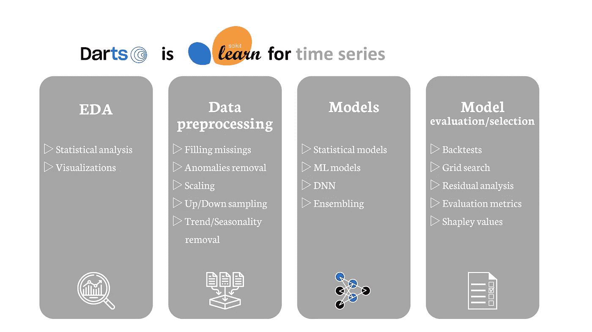

Library Darts，由作者提供的图片，灵感来自于图书馆文档

这里我们得到帮助的是[**Darts**](https://unit8co.github.io/darts/)，它试图成为时间序列的**Scikit-learn**，其目的是简化时间序列的工作。它的功能通常基于其他库，例如，它使用**Statsmodels**进行分解。如果某些功能在其他库中没有实现，**Darts**也能很好地与其他库协作，你可以将其与**Matplotlib**和**Seaborn**互相配合使用进行比较。

在必要的地方，它们有自己的实现，但它们不想重新发明轮子，而是使用其他流行时间序列库中已经存在的东西。

这一概念在时间序列领域并不新鲜，还有其他很好的库，例如[**sktime**](https://www.sktime.org/)、[**GluonTS**](https://ts.gluon.ai/)或[**nixtla**](https://www.nixtla.io/)，但在我看来，**Darts**的入门门槛最低，功能也更为完善。这不是对这个库的广告，归根结底，你的预测应该为你工作的企业带来价值。你也可以从头开始用代码编写这些模型。我将使用 Darts 进行以下示例，但你也可以在上述提到的库中找到这些模型（全部或部分）。如果我们想训练多个本地模型，我认为 Darts 库在**优化计算**方面还有改进的空间——可以尝试**nixtla**库，它提供与 Spark、Dask 和 Ray 的兼容性。

从我的角度来看，Darts 已经是一个成熟的库，并且仍在不断开发中，只需查看[**变更日志**](https://github.com/unit8co/darts/blob/master/CHANGELOG.md)即可。现在你可以按照标准方式进行安装：

```py
pip install darts
```

一旦我们在环境中安装了库，就可以导入并在实践中使用它。

```py
import darts
```

# 单变量与多变量时间序列

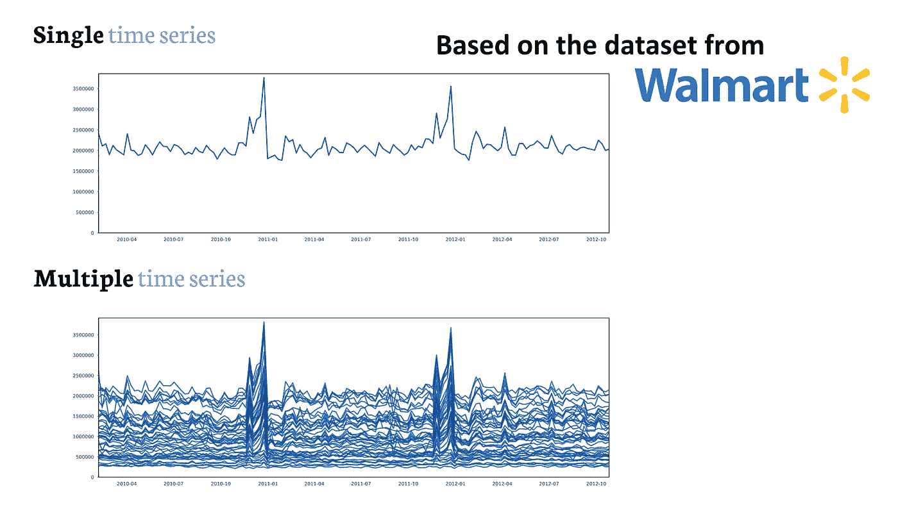

单变量与多变量时间序列，作者提供的图像

如上图所示，基于[**Walmart 数据集**](https://www.kaggle.com/datasets/yasserh/walmart-dataset)，你可以看到**单变量**和**多变量**时间序列。现在，许多问题涉及同时处理多个点。这些数据可以来自各种过程，可以是这个例子和我日常工作的需求预测，也可以是能源消耗预测、公司股市收盘价、从车站租用的自行车数量等等许多其他问题。

除了时间序列本身，我们还可能有其他*变量*，其中一些可能已知未来值，而其他仅在过去可用——稍后会详细讲解。

在这篇文章中，我想向你展示预测多个时间序列的不同方法，但我希望它是实用的——以便你不仅仅停留在理论层面。所以让我们导入所有后续使用的库——包括 Darts 和其他数据科学家熟知的库。

```py
# multiprocessing
from joblib import Parallel, delayed

# data manipulation
import numpy as np
import pandas as pd
from darts import TimeSeries
from darts.utils.timeseries_generation import datetime_attribute_timeseries

# data visualization
import matplotlib.pyplot as plt
import seaborn as sns
from tqdm import tqdm

# transformers and preprocessing
from darts.dataprocessing.transformers import Scaler

# models
from darts.models import NaiveSeasonal, StatsForecastAutoARIMA, ExponentialSmoothing, Prophet #local
from darts.models import LightGBMModel, RNNModel, NBEATSModel, TFTModel #global

# likelihood
from darts.utils.likelihood_models import GaussianLikelihood

# evaluation
from darts.metrics import mape

# settings
import warnings
warnings.filterwarnings("ignore")
import logging
logging.disable(logging.CRITICAL)
```

现在让我们加载数据集，这个数据集涉及**需求预测**，并来自[**Kaggle**](https://www.kaggle.com/competitions/demand-forecasting-kernels-only)。如果你同意 Kaggle 上的比赛条款，那么你也可以下载这个数据集。

```py
dataset = pd.read_csv('store_item_demand.csv')

# set the column type for column with date
dataset['date'] = pd.to_datetime(dataset['date'], format='%Y-%m-%d')
# sort values and reset index
dataset.sort_values(by=['date', 'store', 'item'], inplace=True)
dataset.reset_index(drop=True, inplace=True)
# creation of an auxiliary table with hierarchy and aggregated sales totals
hierarchy_df = dataset.groupby(['store', 'item'])[['sales']].sum()
hierarchy_df = hierarchy_df.reset_index(drop=False).sort_values(by=['sales'],
  ascending=False).reset_index(drop=True)
```

共有 10 家商店，每家商店有 50 种商品，总计 500 个时间序列。

让我们来看一下在所有商店商品组合中销售最少、中等和最多的 10 种商品。要找出时间序列中的关系，通常只需观察它，因为这已经能告诉我们很多信息，比如趋势或季节性，但往往还有更多。

```py
fig, ax = plt.subplots(figsize=(30, 10))

for single_ts in list(np.arange(0, 10)) + list(np.arange(245, 255)) + list(np.arange(490, 500)):
    single_ts_df = pd.merge(dataset, hierarchy_df.loc[[single_ts], ['store', 'item']], how='inner', on=['store', 'item'])
    ax.plot(single_ts_df['date'], single_ts_df['sales'], color='black', alpha=0.25)
ax.set_xlim([dataset['date'].min(), dataset['date'].max()])
ax.set_ylim([0, dataset['sales'].max()])
plt.show()
```

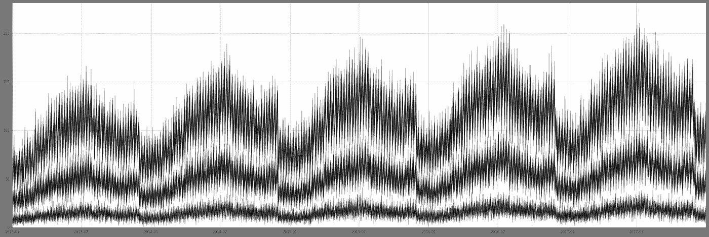

这些时间序列之间有很多相似性。我们将稍后检查是否存在季节性（周几或一年中的周/月）或趋势，但你可以直观地想象，从所有时间序列中学习的模型将比仅从其历史中学习的模型更好地预测单个时间序列。

我为**EDA**（探索性数据分析）创建了数据集的副本。然后，我使用**MinMAXScaler**对时间序列进行缩放，使所有时间序列可以互相比较。最后，我创建箱型图，以检查是否存在趋势和季节性。

```py
# make copy of df
dataset_scaled_EDA = dataset.copy()

# min max value calculation
dataset_scaled_EDA['min_sales'] = dataset_scaled_EDA.groupby(['store', 'item'])['sales'].transform(lambda x: x.min())
dataset_scaled_EDA['max_sales'] = dataset_scaled_EDA.groupby(['store', 'item'])['sales'].transform(lambda x: x.max())
# scale
dataset_scaled_EDA['sales_scaled'] = (dataset_scaled_EDA['sales'] - dataset_scaled_EDA['min_sales'])/(dataset_scaled_EDA['max_sales'] - dataset_scaled_EDA['min_sales'])
# add info about year, week of year and day of week
dataset_scaled_EDA['year'] = dataset_scaled_EDA['date'].dt.year
dataset_scaled_EDA['month'] = dataset_scaled_EDA['date'].dt.month
dataset_scaled_EDA['day_of_week'] = [d.strftime('%A') for d in dataset_scaled_EDA['date']]
dataset_scaled_EDA['day_of_week'] = pd.Categorical(dataset_scaled_EDA['day_of_week'], 
  categories=['Monday', 'Tuesday', 'Wednesday', 'Thursday', 'Friday', 'Saturday', 'Sunday'], 
  ordered=True)

# visualize
fig, ax = plt.subplots(1, 3, figsize=(30, 10))
sns.boxplot(x='year', y='sales_scaled', data=dataset_scaled_EDA, ax=ax[0]).set(
    xlabel='Year', 
    ylabel='Scaled Sales'
)
ax[0].set_title('Box plot for years (trend)')
sns.boxplot(x='month', y='sales_scaled', data=dataset_scaled_EDA, ax=ax[1]).set(
    xlabel='Month', 
    ylabel='Scaled Sales'
)
ax[1].set_title('Box plot for months (seasonality)')
sns.boxplot(x='day_of_week', y='sales_scaled', data=dataset_scaled_EDA, ax=ax[2]).set(
    xlabel='Day of week', 
    ylabel='Scaled Sales'
)
ax[2].set_title('Box plot for day of week (seasonality)')
ax[2].set_xticklabels(ax[2].get_xticklabels(), rotation=30)
plt.show()
```

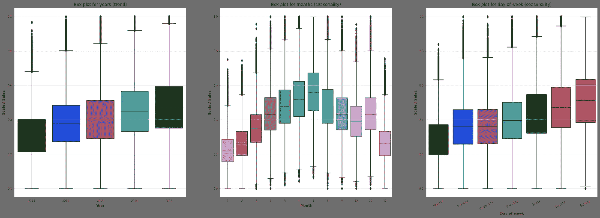

是的，有趋势和两种季节性。如果你认为这些时间序列很容易预测——你是对的。本文的目的是向你展示预测多个时间序列的最流行的方法。数据并不总是像股票市场指数那样简单，但那是另一个话题。

我认为这种探索足以理解模型应该学习哪些关系。

在这里，我们有**多个时间序列**（多个商店中的多个商品销售）。对于每一个**时间序列**，我们从 Pandas DataFrame 中创建一个**TimeSeries**对象。这种类型是 Darts 库中的模型所需的。然后将这些时间序列保存到**列表**中。

```py
dataset_ts = dataset.copy()
dataset_ts = TimeSeries.from_group_dataframe(df=dataset_ts, 
                                             group_cols=['store', 'item'],
                                             time_col='date', 
                                             value_cols='sales')
dataset_ts
```

处理多个时间序列可能很有帮助，但通常也会带来问题。当我们只有一个时间序列时，我们有很多时间来处理它。查看它，验证趋势和季节性，并处理异常。我们可以优化我们的预测。对于多个序列，这种方法变得不可行。我们希望方法尽可能自动化，但这样可能会错过细节，比如异常，或者我们不应该以相同的方式处理每个时间序列。可能还有更多典型的问题：缺失数据、数据漂移和稀有事件（黑天鹅事件）。更多的序列可能对我们有帮助，因为我们的模型可以使用更多的数据，因此会有更多的代表性观察数据来识别特定模式。以我的工作为例——为了预测产品 X 在下周因促销造成的需求，我们的模型还可以利用其他促销的历史效果。

> 所以问题来了——如何预测多个时间序列？

你可能经常会问自己*我是否有一个* ***多变量*** *或* ***多元*** *时间序列？* 这些问题是合理的，但答案并不总是明确的。当你的时间序列来自**单一过程**，**相互关联**、**相关**，并且**相互作用**时，答案将是*我的时间序列是* ***多元***。

当你在**多个商店**预测产品 X 的销售时，你有一个**多时间序列**，但当你有一个额外的产品 Y 时，对于单个商店来说，你有一个**多变量时间序列**，因为一个产品在商店中的销售可能**影响**另一个产品的销售，或者这只是一个假设。

# 如何评估预测结果？

在我们深入讨论不同的方法和模型之前，让我们先讨论如何衡量预测的质量。这是一个回归问题，因此我们仍然会将预测结果与真实值进行比较，这一点毫无疑问。你可以使用回归问题中熟悉的指标，如**RMSE**(*均方根误差*), **MSE**(*均方误差*), **MAE**(*平均绝对误差*)，或者更典型的时间序列指标，如**MAPE**(*平均绝对百分比误差*), **MARRE**(*平均绝对范围相对误差*), 或**MASE**(*平均绝对缩放误差*)。进一步的讨论将使用**MAPE**作为评估指标。本文不是关于需求预测的，但由于数据和我的经验，有很多相关参考。因此，你可以考虑为该问题选择什么指标。始终选择能够反映业务目标的指标。在这篇*文章*中，[Nicolas Vandeput](https://www.linkedin.com/in/vandeputnicolas/) 描述了需求预测中使用的 KPI 指标。

我们可以将这种方法扩展到多个序列，然后一次性计算所有序列的指标，或者分别对每个序列计算指标后再进行汇总。所以让我们继续探讨如何评估单个序列，然后再将其扩展到多个序列。

是的，这是一个回归问题，你可能会想为什么我解释这一点。在时间序列中，时间扮演了关键角色。数据是相对于时间排序的，观测值是相互关联的。因此，分割训练/测试集并使用交叉验证时无法使用随机化，因为这样会导致数据泄漏。

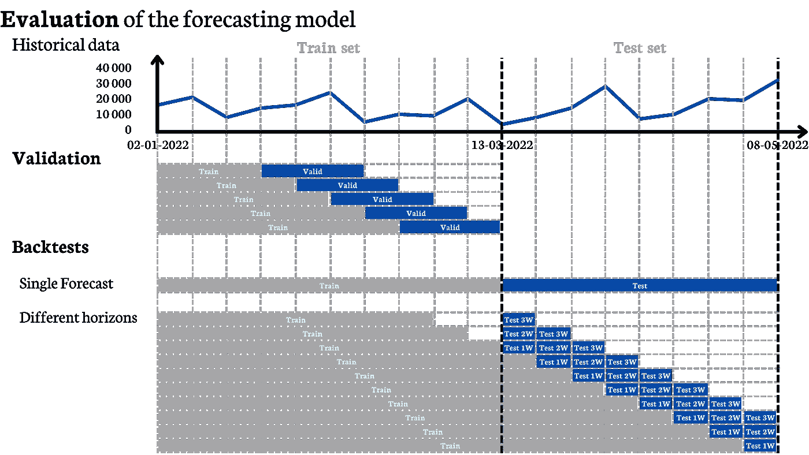

预测模型的评估，图像由作者提供

首先，将数据分为**训练**集和**测试**集，很简单，对吧？模型在训练集上进行拟合，在测试集上进行测试。我们可以按比例划分，例如，测试集包括最后 20% 的数据，或者指定测试集的起始日期——可能由于业务考虑，测试集为过去一年数据会更重要。

在我们的例子中，测试集将是最后一年。

```py
first_test_date = pd.Timestamp('2017-01-01')
train_dataset_ts, test_dataset_ts = [], []

for single_ts in tqdm(dataset_ts):
    # split into train and test tests
    single_train_ts, single_test_ts = single_ts.split_before(first_test_date)
    train_dataset_ts.append(single_train_ts)
    test_dataset_ts.append(single_test_ts)
```

从**训练**集分离**验证**子集，用于选择**超参数**。对于在 Darts 中实现的模型，我们可以使用*gridsearch*方法，但对于基于神经网络的模型，推荐使用[**Optuna**](https://optuna.org/)。gridsearch 方法实际上具备了我们所需的一切，无论选择哪个模型都能正常工作。

重要的是：

+   parameters ➜ 一个包含待检查超参数的字典

+   series ➜ TimeSeries 对象或包含 TimeSeries 对象的列表（如果算法是全局的）

+   start ➜ *Pandas Timestamp* 定义第一次预测发生的时间，或者 *float* 作为第一次预测之前观察值的比例。

+   forecast_horizon ➜ 模型预测的时间范围数量（*int*）

+   stride ➜ 下一次预测之间的偏移量。为了使一切符合数据科学的艺术，并最能反映算法的实际操作，stride 应该等于 1。但请记住，在每一步之后你的算法都会重新训练，而且你的超参数网格可能有很多组合，这通常需要很长时间。因此，出于常识考虑，stride 可以大于 1，尤其是因为此目的在于选择最佳超参数，结果可能（但不一定）在 stride 等于 1 时与 stride 等于 5 时相同。

+   metric ➜ 函数，用于比较真实值和预测值。然后根据这个指标选择最佳超参数。

```py
model.gridsearch(
  parameters={}, 
  series= ,
  start= , 
  forecast_horizon= ,
  stride= ,
  metric= 
)
```

那么如何在测试集上评估模型呢？我们有两种方法。

**第一种**方法是我们在训练集上拟合模型，并做一个覆盖测试集的预测。在以下示例中，我们将使用这个选项——计算速度更快，因为我们为每个时间序列生成一个预测。

**第二种**方法是我们测试不同的预测时间范围。我们拟合模型，做一个预测，重新训练，再做一个预测，以此类推，但我们必须在训练集结束之前开始训练算法，这样我们才能在相同的数据上比较时间范围——我们在比较相同的苹果。如果你从整个训练集开始训练，那么较远的时间范围有较少的观察值。在这种方法中，我们应该重新训练（特别是在局部模型中），因此这种方法中我们肯定会有更多的计算。

这也很简单，因为 darts 中的模型具有根据上述可视化返回历史预测的能力。你已经学习了一些在 gridsearch 方法中使用的变量，这些变量在这里也适用。然而，这里会有新的变量：

+   retrain ➜ 如果等于 *True*，则在每一步之后模型会重新训练，这最能反映现实情况。

+   overlap_end ➜ 如果等于 *True*，则预测可能超出测试集中的日期。如果我们对多个时间范围进行预测，而较远的时间范围超出测试集，而较近的时间范围不超出，这样的设置很有用。

+   last_points_only ➜ 如果等于 *False*，则返回所有时间范围的预测。

```py
backtests_results = model.historical_forecasts(
  series= , 
  start= ,
  forecast_horizon= ,
  retrain=True,
  overlap_end=True,
  last_points_only=False,
)
```

然而，我们希望从感兴趣的时间范围中获取预测，并且在变量 backtests_results 中，有来自不同时间点的预测。要从特定的时间范围中获取预测，你可以使用我的函数 *take_backtest_horizon*。

backtests_5W ➜ 有针对测试集每个点的预测，这些预测是在 5 周前做出的。

```py
def take_backtest_horizon(backtests, horizon, last_horizon, observations):
    backtests_horizon_dates = [i.time_index[-1+horizon] for i in backtests[last_horizon-horizon:][:observations]]
    backtests_horizon_values = [i.values()[-1+horizon] for i in backtests[last_horizon-horizon:][:observations]]

    backtests_horizon = TimeSeries.from_times_and_values(times=pd.DatetimeIndex(backtests_horizon_dates), values=np.array(backtests_horizon_values))
    return backtests_horizon

backtests_5W = take_backtest_horizon(
  backtests=backtests_results, 
  horizon=5, # for which horizon we want a forecast, the number must be less than forecast_horizon
  last_horizon=forecast_horizon, # forecast_horizon from historical_forecasts method
  observations=len(test_series))
```

# 使用的变量

实际上，时间序列本身并不能完全自我解释。时间序列通常依赖于其他变量。这里我们没有这些变量，但了解如何在项目中遇到这些变量时进行区分是很有帮助的。如果我们没有通知模型即将到来的促销/降价，那么它将无法预测销售额的增加。如果你想预测股票公司的价格变化，添加来自技术分析或基本面分析的变量可能会有所帮助。这些变量依赖于价格，即你只能知道这些指标的过去值，毕竟，我们无法知道未来的公司财务报告或价格——我们希望进行预测 :)

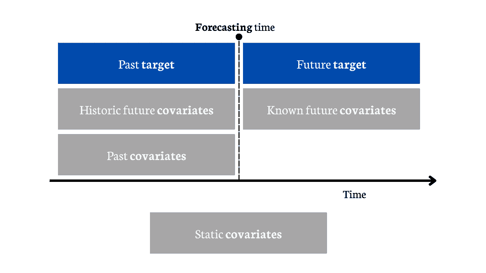

时间序列算法使用的变量，图源作者

我们可以有也是时间序列的变量，即在不同时间点有不同的值，同时我们也可以有**静态协变量**（随时间保持不变），通常是分类变量。在我们的例子中，这将是商店 ID 和商品 ID。它们对全局模型非常重要。因为在每 100 个时间序列中，可能会有不同的关系，借助这些变量，你的模型可以区分不同的时间序列。

至于时间序列变量，我们可以区分**协变量**，其中有些**已知未来**（例如，我们可以知道未来的促销机制，也知道过去的促销机制）和**仅已知过去的协变量**（我们可以知道竞争产品的价格，但不知道它们未来的价格）。

# 使用的模型

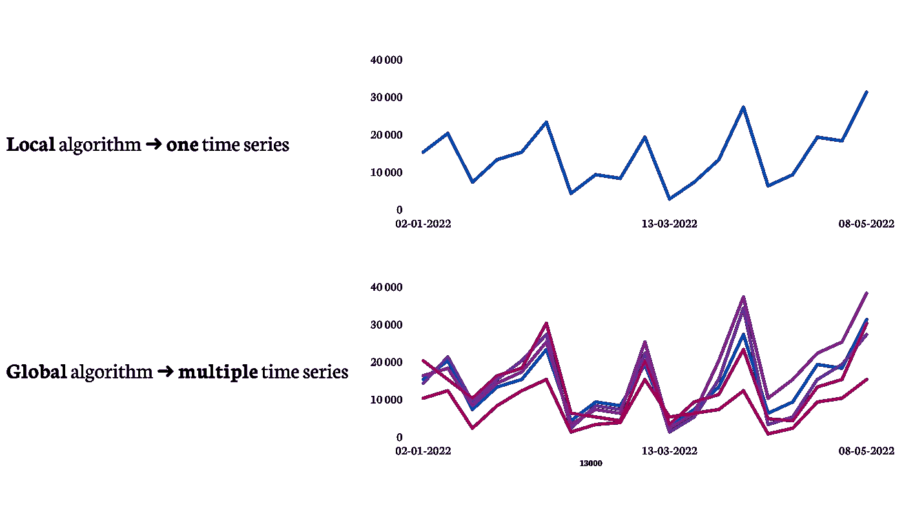

局部算法与全局算法对比，图源作者

我们可以将机器学习分为监督学习、无监督学习和强化学习。进入详细内容后，我们可以将监督学习分为回归和分类。我们可以对时间序列预测进行类似的划分，即使用**局部**或**全局**算法来预测这些时间序列。

**局部算法**是针对**单一时间序列**进行拟合的，模型仅能预测这一时间序列。更多的时间序列意味着更多的模型。在这里我们看到优缺点，模型简单，但对于许多时间序列来说，这种方法变得难以维护。

**全局算法**则是**一个模型**可以拟合**多个时间序列**。所以如果我们有**多个时间序列**，我们可以有**一个**模型来预测所有这些序列。这种方法显然更灵活，例如，你可以使用迁移学习。对于时间序列，这意味着你在一个不同的时间序列上拟合模型，而不是进行预测。[这里](https://unit8co.github.io/darts/examples/14-transfer-learning.html)有一个使用示例。另一个与全局模型相关的重要点，因为我可能会忘记，并且这非常重要——那就是**时间序列缩放**。最常见的方法是*MinMaxScaler*，但你可以使用更适合你数据的东西。然而，我不会在这里详细说明如何缩放时间序列，这肯定是另一个文章的话题。我们来考虑一下为什么我们应该缩放时间序列。答案可能很简单，许多全局算法是神经网络，这就是我们缩放数据的原因，就像我们对卷积神经网络的像素进行处理一样。然而，这还不是全部。然而，我们可以使用像随机森林这样的模型（非参数模型），我们仍然应该缩放它们。但停下来，为什么？毕竟，对于这些类型的模型，你不需要缩放变量。我们应该缩放时间序列的原因是为了让模型学习关系，而不是尺度。例如，对于季节性关系，可能是在夏季月份，值比冬季月份平均高 150%。另一个例子是，3 次显著增加后跟随一次下降。如果我们不缩放时间序列，模型很难学习这些关系。这是一种与表格数据中变量缩放略有不同的方法，因为在这里我们单独缩放每个时间序列。如果我们使用前面提到的*MinMaxScaler*，那么对于训练集中的每个时间序列，最大值是 1。所以让我们缩放我们的数据，这将被全局模型使用。

```py
scaler = Scaler() # MinMaxScaler
train_dataset_ts_prepared = scaler.fit_transform(train_dataset_ts)
test_dataset_ts_prepared = scaler.transform(test_dataset_ts)
dataset_ts_prepared = scaler.transform(dataset_ts)
```

一会儿你将阅读到最受欢迎的**局部**和**全局**算法。虽然不可能描述所有可能的算法，但有一些算法常被专家使用，并且通常能满足预期。

> 没有免费的午餐定理

没有一个答案——这个模型是最好的，不要使用其他模型。然而，如果你正在创建一个 MVP——最好从简单的东西开始。

在以下示例中，我没有在验证集上选择最佳超参数，而是使用了默认模型。所以如果你告诉我模型可能有更好的结果——**我已经同意你的观点**。

# 局部模型

在我们深入具体的局部模型之前，我为你准备了函数，以便使用多处理来加快所有核心的计算速度。

```py
forecast_horizons = len(test_dataset_ts[0])

def _backtests_local_estimator(_estimator, _ts_set, _split_date, _horizons, _single_forecast):
    model = _estimator
    if _single_forecast:
        model.fit(_ts_set.split_before(_split_date)[0])
        backtests_single_ts = model.predict(_horizons)

    else:
        backtests_single_ts = model.historical_forecasts(series=_ts_set, 
                                                         start=_split_date - np.timedelta64(_horizons-1, 'D'), 
                                                         verbose=False, 
                                                         overlap_end=False,
                                                         last_points_only=True, 
                                                         forecast_horizon=_horizons,
                                                         retrain=True)

    return backtests_single_ts

def backtests_multiple_local_estimators(estimator, multiple_ts_sets=dataset_ts, split_date=first_test_date, horizons=forecast_horizons, single_forecast=True):
    backtests_multiple_ts = Parallel(n_jobs=-1,
                                     verbose=5, 
                                     backend = 'multiprocessing',
                                     pre_dispatch='1.5*n_jobs')(
            delayed(_backtests_local_estimator)(
                _estimator=estimator,
                _ts_set=single_ts_set,
                _split_date=split_date,
                _horizons=horizons,
                _single_forecast=single_forecast
            )
        for single_ts_set in multiple_ts_sets
    )

    return backtests_multiple_ts
```

我将使用这个函数为本地模型生成测试集的单个预测。此外，你可以用它生成多个历史预测（第二种方法，变量***single_forecast***应设置为***False***）。不过，我在这里不这样做，因为这会花费很多时间。

如果你使用 Cluster 和 Spark，那么你可以使用 Spark UDF 来显著加快计算速度。

我知道，你可能想跳到模型部分。最后但同样重要的是——一个评估我们预测结果的函数。我将使用**MAPE**作为评估指标，然而，如果你在做需求预测项目，**WMAPE**或**MAE**无疑更接近业务预期。

```py
def get_overall_MAPE(prediction_series, test_series=test_dataset_ts):
    return np.round(np.mean(mape(actual_series=test_series, 
                                 pred_series=prediction_series, n_jobs=-1)),
                    2)
```

## 基准线

好吧，但为什么要做神经网络，如果一个更好的主意是从一年前预测值呢？这正是我们首先创建这样一个模型的原因。当你处理实际数据时，你最好也从这样的方式开始（它也可以是训练集中的最后一个值，NaiveDrift 如果有趋势，或几种简单方法的组合）。然后如果你转向更高级的方法，你可以评估它比简单方法好多少，因为例如，如果你从神经网络开始，其 MAPE 为 10%，那么我的问题（可能也是利益相关者的问题）是——*这好吗？*

我们的模型（一个时间序列=一个模型）将重复一年前的值。

```py
backtests_baseline_model = backtests_multiple_local_estimators(estimator=NaiveSeasonal(K=365))
print(f'overall MAPE: {get_overall_MAPE(backtests_baseline_model)}%')
```

**整体 MAPE: 22.42%**

现在让我们在测试集中可视化时间序列的预测值和实际值，这些时间序列具有最高的总销售额。

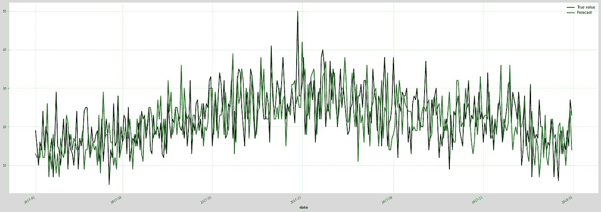

这看起来还不错。

## ARIMA

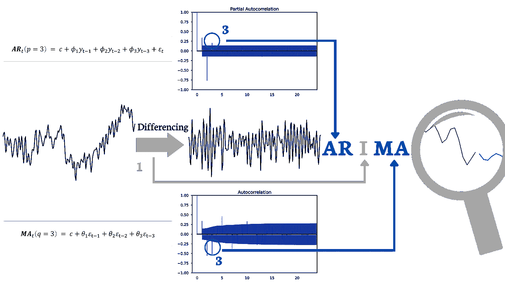

视觉化 ARIMA 算法的工作原理，图像来源于作者

**ARIMA** 是一个统计模型，以其简单性而广受欢迎且强大。当你听到**ARIMA**时，它可能指的是这个模型，但也可能是**ARIMA**的扩展集合。这个集合包括**ARIMAX**（考虑额外变量）、**SARIMA**（考虑季节性）或**VARIMA**（用于多变量时间序列）。但让我们回到**ARIMA**（**A**uto**R**egressive **I**ntegrated **M**oving **A**verage），这就是一切的起点。如果你理解得很好，那么使用之前提到的模型应该不会有问题。

许多文章已经对此算法进行了阐述。我想给你这个模型背后的直观理解。我希望最终你能轻松地在代码中实现它，并理解它是如何工作的。我打算从最后开始。我自己记得在招聘过程中有过一个关于这个问题的疑问，当时我还没有理解它。**ARMA 模型只能与平稳时间序列一起使用**，因此我们有一个组件——**积分**（**I**），它通常（但不总是）**将非平稳时间序列转换为平稳时间序列**。**ARMA**是模型，而**I**部分负责为建模准备数据（当然，如果需要的话）。你应该知道几个问题的答案，那就是时间序列平稳或非平稳的含义，以及**积分**（**I**）组件进行的转换类型。所以让我们从平稳性开始。

> 如果值的分布（均值和方差）在时间上是不变的，那么时间序列就是平稳的。

因此，如果存在趋势和/或季节性，那么时间序列就是非平稳的。要检查时间序列是否平稳，最简单的方法是将其可视化，并在图上添加移动平均和移动标准差。如果它们随时间保持不变（或接近不变），那么你可以得出你的时间序列是平稳的结论。这种方法可能显得天真，并且并不总是有效，因为如果对滚动统计数据使用过大的窗口，你可能会认为时间序列是平稳的，而实际上并非如此。另一种方法是将时间序列拆分成随机分区，对每个分区计算上述统计数据。最后一种方法是计算**扩展的迪基-福勒**（**ADF**）检验。如果我们的时间序列仍然不是平稳的，我们需要使用**积分**（**I**）组件怎么办？它通过**差分**来使时间序列平稳，即计算观察值之间的差异。如果我们的时间序列仍然不是平稳的呢？我们可以选择**d**的阶数，这表示我们对时间序列进行差分的次数。

这个长段落是关于**积分**（**I**），它准备数据以供**自回归**（**AR**）和**移动平均**（**MA**）组件使用。**AR**是对最后**p**个值的线性回归，这些值被称为滞后。当前值与最后的值相关联，并且依赖于这些值。**MA**是补充性的，考虑了预测中**q**个最后的误差（假设为白噪声），以更好地预测当前的时间点。

选择**AR**的阶数**p**时，我们使用[**PACF**](https://en.wikipedia.org/wiki/Partial_autocorrelation_function)（**P**artial **A**uto**C**orrelation **F**unction），而选择**MA**的阶数**q**时，我们使用[**ACF**](https://en.wikipedia.org/wiki/Autocorrelation)（**A**uto**C**orrelation **F**unction）。在大学课程之外，我们在实际操作中不太可能这样做，因为我们有[**AutoARIMA**](https://unit8co.github.io/darts/generated_api/darts.models.forecasting.auto_arima.html)可以为我们选择**p**、**d**和**q**。

让我们回到实践中，按照与基线模型相似的方式来实现。正如你可能已经了解到的，由于 Darts 库，这个过程非常简单。

```py
backtests_arima = backtests_multiple_local_estimators(estimator=StatsForecastAutoARIMA())
print(f'overall MAPE: {get_overall_MAPE(backtests_arima)}%')
```

**总体 MAPE: 28.18%**

```py
fig, ax = plt.subplots(figsize=(30, 10))
test_dataset_ts[0].plot(label='True value', color='black')
backtests_arima[0].plot(label='Forecast', color='green')
plt.show()
```

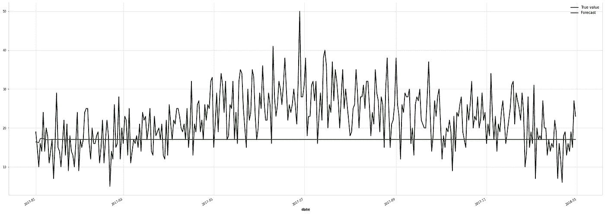

如果我选择参数*m*（季节性差分的周期），结果可能会更好。你可以尝试一下，并告诉我结果的变化情况。

## 指数平滑

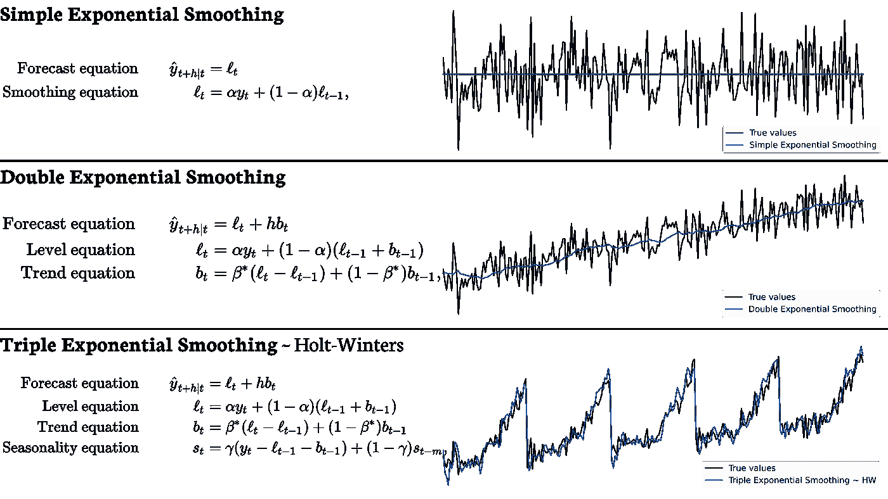

可视化指数平滑（ETS）算法的工作原理，图片由作者提供

**指数平滑**是另一种用于单变量时间序列的**模型家族**。你可以在术语**ETS**（**E**-误差，**T**-趋势，**S**-季节性）下找到“这个家族”。在这种方法中，观察值被赋予权重，较旧的观察值权重较低，因为它们按指数衰减。我们可以区分三种类型：一种简单的类型假设未来将类似于近期值，一种扩展类型处理趋势，最后一种还处理季节性。我将会在稍后描述这三种类型，不过现在先插一个小插曲。在**M**-4 **比赛**（[Makridakis 比赛](https://en.wikipedia.org/wiki/Makridakis_Competitions)，这是最著名的时间序列预测比赛）中，Slawek Smyl 获胜，他提出了[**ES-RNN**](https://www.sciencedirect.com/science/article/abs/pii/S0169207019301153)，这是**指数平滑**与**递归神经网络**的混合体。

现在我们回到话题的第一个类型，即**简单指数平滑**。作为基线模型，我们可以选择一个总是预测训练集中的最后一个值的模型，这是一种稍显天真的方法，但可以给我们带来不错的结果。另一种方法是计算整个训练集的平均值，但这样的话，最近的观察值和最古老的观察值会被赋予同等的重要性。指数平滑结合了这两种方法，赋予最近的观察值更大的权重，权重会随着观察值的古老程度呈指数下降，这意味着最古老的观察值将拥有最小的权重。它使用**α**参数，其范围在 0 到 1 之间。值越高，最新值对预测的影响越大。请查看上面的图形，那里也有公式。这些公式非常容易理解，通常这些模型能给出不错的结果。在我们进入更高级的模型之前，我们应该在这里稍作停留，因为如果一个简单的模型给出的结果与非常先进的模型（例如深度神经网络）相同，那么我们应该保持使用更简单的模型，因为它们的操作对我们来说更可预测，并且更多的人能够理解它们的运作。

SES 本质上无法处理数据中的趋势。如果存在上升趋势，则预测会低估，因为它没有包含这种增加。因此，我们有另一种模型，即**双重指数平滑**。它有一个额外的因素，用于考虑趋势的影响。我们使用**β**参数，它控制趋势变化的影响。因此我们有两个公式，一个用于**水平**（水平方程），另一个用于**趋势**（趋势方程）。

**三重指数平滑**也考虑了季节性。你可以将它称为 Holt-Winters 的季节性方法。这里另一个参数**γ**进入了公式。这种方法允许**水平**、**趋势**和**季节性**的模式随时间变化。像趋势一样，季节性可以是加法的或乘法的，但在这里我不会描述详细信息，假设你知道区别或可以轻松找到它们。我只是不想把这篇文章写成一本书，现在我希望你能顺利阅读整个文章。😉

```py
backtests_exponential_smoothing  = backtests_multiple_local_estimators(estimator=ExponentialSmoothing())
print(f'overall MAPE: {get_overall_MAPE(backtests_exponential_smoothing)}%')
```

**总体 MAPE: 31.88%**

```py
fig, ax = plt.subplots(figsize=(30, 10))
test_dataset_ts[0].plot(label='True value', color='black')
backtests_exponential_smoothing[0].plot(label='Forecast', color='green')
plt.show()
```


至于 ARIMA，我没有添加季节性信息。现在轮到你了，使用*seasonal_periods*参数为[**指数平滑**](https://unit8co.github.io/darts/generated_api/darts.models.forecasting.exponential_smoothing.html)添加这些信息。

## Prophet

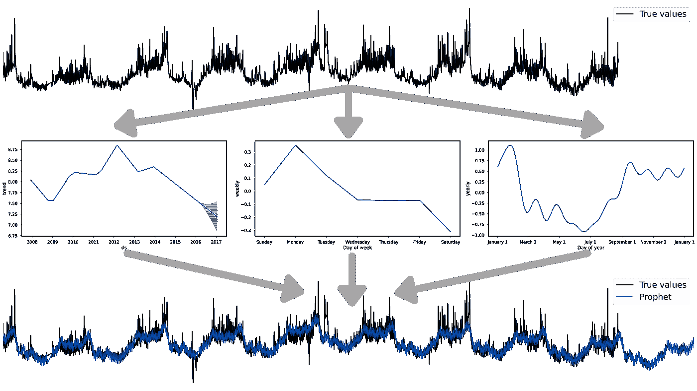

可视化 Prophet 算法的工作原理，作者提供的图片

[**Prophet**](https://facebook.github.io/prophet/) 是 Facebook 在 2017 年的 [*大规模预测*](https://peerj.com/preprints/3190.pdf) 论文中提出的。它既是一个模型，又是一个同名库。与之前的模型一样，你可以在 Darts 中找到它。该算法是**G**eneralized **A**dditive **M**odel，因此预测是各个组件的总和。这些组件是**g(*t*)** — 趋势，**s(*t*)** — 季节性（每年、每周和每日），以及**h(*t*)** — 假期效应。

> y(t) = g(t) + s(t) + h(t) + error(t)

第一个是**趋势**，它可以随着时间的变化而变化，并且不必始终保持不变。当学生开始学习时间序列分析课程时，他们通常处理的是简单的时间序列。在时间序列中，他们可以看到一个连续增长的趋势。然而，在实际数据中，趋势可能会发生多次变化。Prophet 实现了**拐点**（可以将其视为超参数，例如它们的数量、范围和先验尺度）。这些点是趋势的变化，例如，增加趋势 -> 拐点 -> 减少趋势 -> 拐点 -> 更强的减少趋势，等等。这种方法更接近我们通常在数据中看到的情况。这些拐点的位置是 Prophet 在你之前设置的。拐点之间的趋势函数可以是简单的回归。

接下来，我们有**季节性**函数，它是**傅里叶级数**。

另一个功能是**假期**效应，它会对我们的预测值进行加减调整。你可以使用 Prophet 库提供的日期，或者定义你自己的事件。你可以想象，黑色星期五效应会显著影响销售额。此外，你可以考虑假期影响预测的日期范围，例如，圣诞节不会影响假期当天的销售，但会影响之前的几天（很多天）。

```py
backtests_prophet = backtests_multiple_local_estimators(estimator=Prophet())
print(f'overall MAPE: {get_overall_MAPE(backtests_prophet)}%')
```

**总体 MAPE：14.38%**

```py
fig, ax = plt.subplots(figsize=(30, 10))
test_dataset_ts[0].plot(label='True value', color='black')
backtests_prophet[0].plot(label='Forecast', color='green')
plt.show()
```

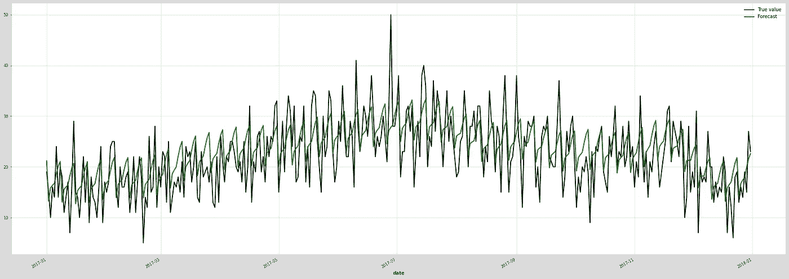

# 全球模型

现在我们转向一个模型用于所有时间序列的方法。这也被称为**跨学习**，因为该模型为了对时间序列 A 做出良好的预测，从时间序列 A 以及 B、C、D 等中学习了关系。

## 监督模型 ~ 时间序列作为回归问题

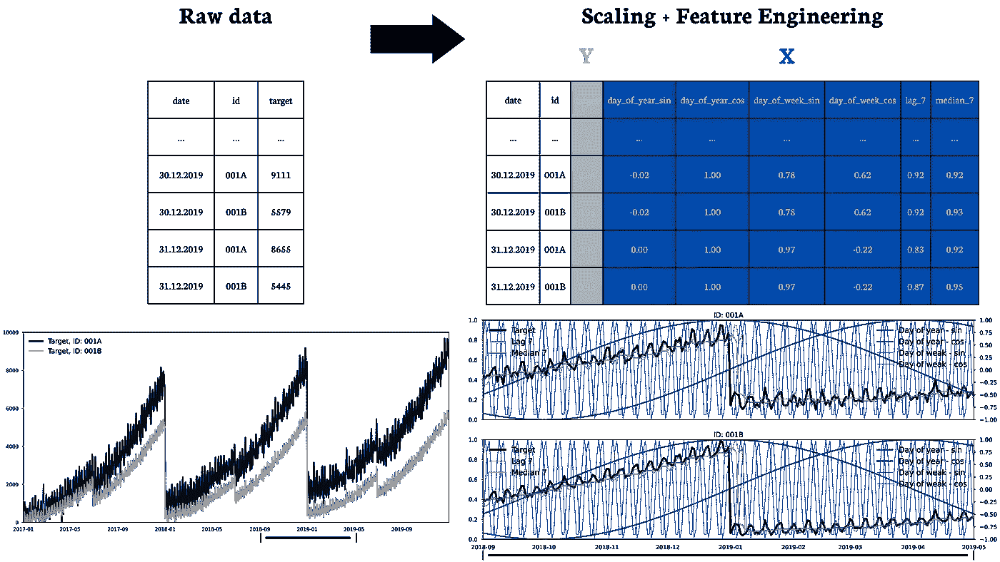

可视化如何为监督学习模型创建特征，图像来源于作者

现在让我们尝试将监督学习模型应用于时间序列预测。这并不新鲜，但它们往往能给出很好的结果，且比神经网络效果更佳（参见 M-5 竞赛中的最佳解决方案）。然而，回归模型并非专门针对时间序列，因此如果我们想使用它们，就需要**将时间序列问题转换为机器学习问题**。我在之前的文章中已经详细介绍了这一点，**卖出与买入预测**中有更多内容，但我也将描述如何使用众所周知的回归算法来解决这个问题。

在我开始之前提到的转换之前，我们首先需要**缩放**数据。之前我描述了这种转换对于全局模型的必要性。在这种情况下，我使用了*MinMaxScaler*。

下一步是**特征工程**，这是一个重复了几次的转换过程。基于时间序列的历史，我们创建有助于模型更好地预测未来的特征。这些变量可以指代所选时间序列的近期历史，例如**滞后**值（对于每周数据，t-1W，t-2W，t-3W，等等）。另一个例子是**滚动统计**的计算，如中位数（可以是最近 4 周的中位数）、均值、最小值、最大值、标准差以及你将在窗口上计算的其他内容。如果数据中存在**季节性**，那么最好给模型一个关于时间点 t 的提示。我经常使用**周期变量的正弦和余弦**（在上面的可视化中是年份中的一天和一周中的一天）。

最后一步是选择一个**模型**，你有很多选择，包括线性回归、线性混合效应模型、随机森林、LightGBM 等。模型的选择取决于时间序列的性质和问题的复杂性。另一个问题可能是你想要一个模型还是和预测期数一样多的模型。当你选择一个模型时，需要考虑其弱点。例如，当你选择随机森林时，记住叶子节点计算的是均值，因此它不能超出训练范围。LightGBM 没有这个问题，因为它不计算朴素均值，而是在后台进行回归计算。

现在是时候回到实际操作部分并在代码中实现模型了。我选择了[**LightGBM**](https://lightgbm.readthedocs.io/en/v3.3.2/)作为模型。使用它在 Darts 中比我希望在没有这个库的情况下使用要简单得多。正如你在代码中看到的，我们使用了过去 14 天的滞后数据。我还添加了编码器，添加了模型使用的协变量，这些变量会自动添加，并且所有计算都在内部完成。

+   *周期性* — 添加 2 列，基于周期变量（如月份）的正弦余弦编码

+   *日期时间属性* — 基于日期时间变量添加标量

+   *position* — 基于时间序列索引，将相对索引位置添加为整数值，其中 0 设置在预测点。

```py
model_lightGBM = LightGBMModel(lags=14, 
                               output_chunk_length=365, 
                               random_state=0,
                               multi_models=False, 
                               add_encoders={"cyclic": {"future": ["month"]}, 
                                             'datetime_attribute': {'future': ['dayofweek']},
                                             'position': {'past': ['relative'], 'future': ['relative']}, 
                                             'transformer': Scaler()
                 })

model_lightGBM.fit(series=train_dataset_ts_prepared)
backtests_lightGBM = model_lightGBM.predict(n=forecast_horizons, series=train_dataset_ts_prepared)
# The model predicts scaled values, but then we have to reverse the transformation
backtests_lightGBM = scaler.inverse_transform(backtests_lightGBM) # 
print(f'overall MAPE: {get_overall_MAPE(backtests_lightGBM)}%')
```

**总体 MAPE: 15.01%**

```py
fig, ax = plt.subplots(figsize=(30, 10))
test_dataset_ts[0].plot(label='True value', color='black')
backtests_lightGBM[0].plot(label='Forecast', color='green')
plt.show()
```

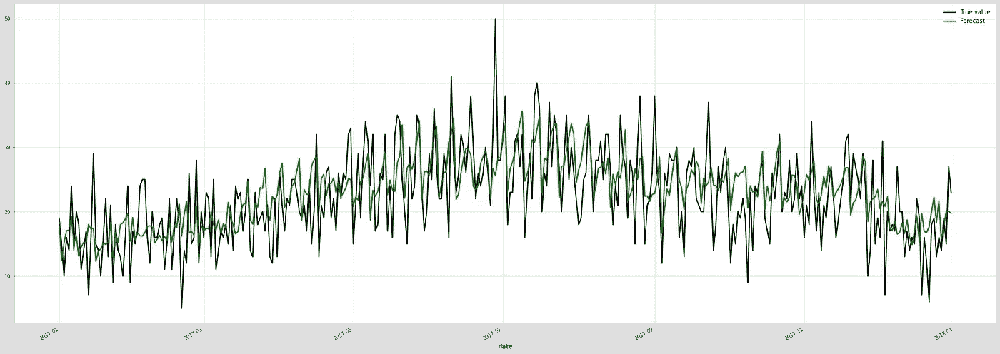

结果非常有前景，尤其是因为这是一个适用于所有时间序列的模型。然而，基于我的经验，我想提醒你。这些类型的模型在特征工程上表现良好，这既是优势也是大缺陷。假设你使用了滞后和移动平均。现在你将预测一个时间序列的值，但它中有异常值——在预测点之前有几个大值。你的模型肯定会高估。当你创建变量时，尽量想象它们对模型的影响。

## DeepAR

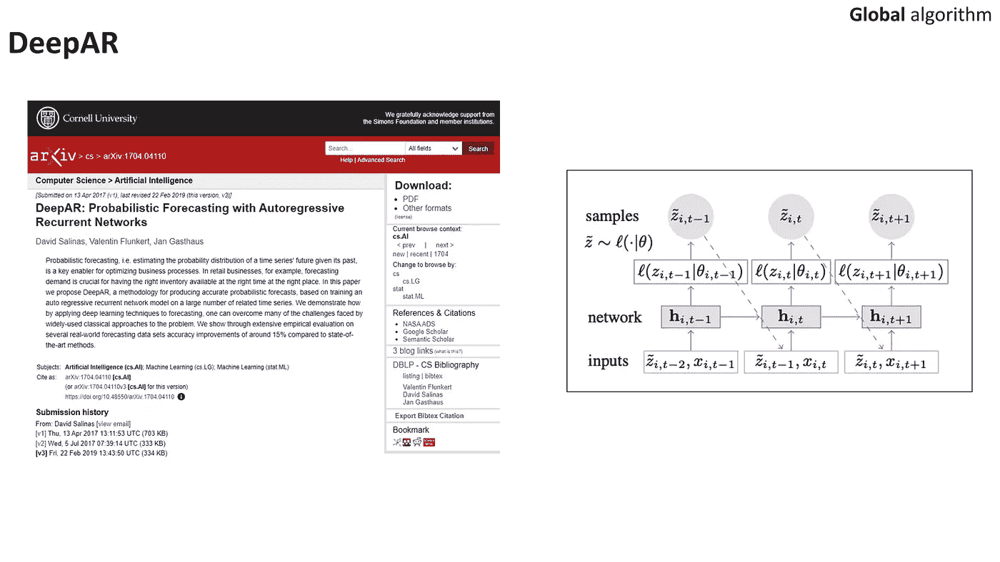

基于论文的 arxiv 和模型架构的截图

[**DeepAR**](https://arxiv.org/abs/1704.04110) 是由 Amazon 团队开发的一种深度学习算法。它旨在使用递归神经网络（RNNs）对时间序列数据中的复杂依赖关系进行建模。

正如我们在摘要中阅读到的（这与我非常接近）：

> 例如，在零售业务中，预测需求对于在正确的时间和地点提供合适的库存至关重要。

该模型是自回归的，并使用蒙特卡洛样本生成概率预测。神经网络架构基于 LSTM 层。通过概率方法，我们不关心单一的良好预测，而是整个预测分布，来确定真实值可能出现的位置。DeepAR 不是直接使用 LSTMs 进行预测，而是利用 LSTMs 来参数化高斯似然函数。即，估计高斯函数的均值和标准差（θ = (μ, σ) 参数）。

DeepAR 支持未来已知协变量，我们没有这样的数据，但可以创建它们。作为这些特征，我创建了带有星期几和月份的独热编码（OHE）。可能更好的方法是使用正弦和余弦函数，我鼓励你进行实验，并将反馈意见告诉我。

```py
day_series = datetime_attribute_timeseries(
    dataset_ts[0], attribute="weekday", one_hot=True, dtype=np.float32
)
month_series = datetime_attribute_timeseries(
    dataset_ts[0], attribute="month", one_hot=True, dtype=np.float32
)

day_month_series = day_series.concatenate(month_series, axis=1, ignore_static_covariates=True)

model_deepar = RNNModel(
    model="LSTM",
    hidden_dim=10,
    n_rnn_layers=2,
    dropout=0.2,
    batch_size=32,
    n_epochs=5,
    optimizer_kwargs={"lr": 1e-3},
    random_state=0,
    training_length=21,
    input_chunk_length=14,
    likelihood=GaussianLikelihood(),
    pl_trainer_kwargs={
        "accelerator": "gpu",
        "devices": [0]
    }
)

model_deepar.fit(series=train_dataset_ts_prepared, future_covariates=[train_day_month]*len(train_dataset_ts_prepared), verbose=True)

backtests_deepar = model_deepar.predict(n=forecast_horizons, series=train_dataset_ts_prepared, 
                                        future_covariates=[day_month_series]*len(train_dataset_ts_prepared), 
                                        num_samples=1000, verbose=True)
backtests_deepar = scaler.inverse_transform(backtests_deepar)
print(f'overall MAPE: {get_overall_MAPE(backtests_deepar)}%')
```

**总体 MAPE: 19.35%**

```py
fig, ax = plt.subplots(figsize=(30, 10))
test_dataset_ts[0].plot(label='True value', color='black')
backtests_deepar[0].plot(label='Forecast', color='green')
plt.show()
```

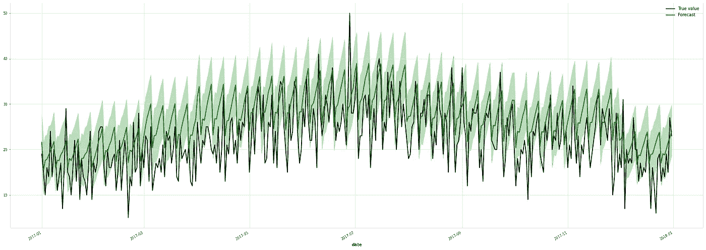

## N-BEATS

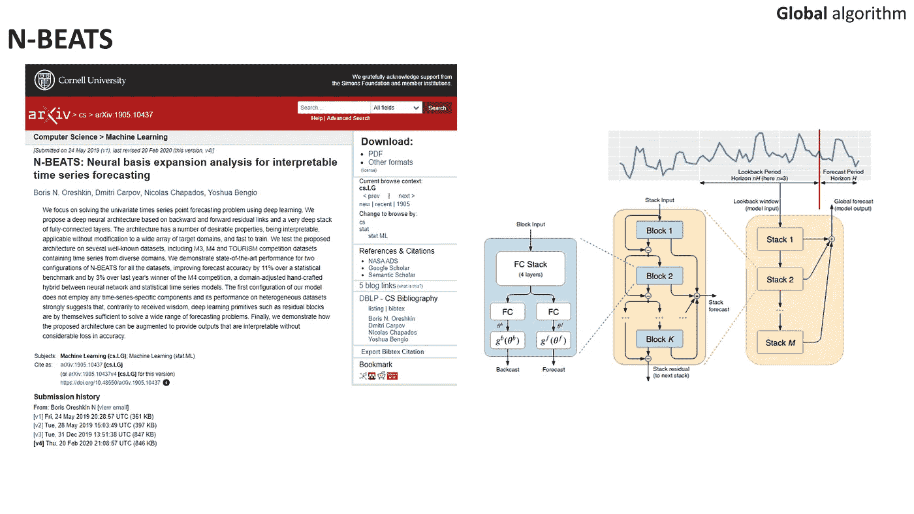

基于论文的 arxiv 和模型架构的截图

[**N-BEATS**](https://arxiv.org/abs/1905.10437)（用于可解释时间序列预测的神经基础扩展分析）是一种深度学习算法，但它不包含递归层，如 LSTM 或 GRU。

架构可能看起来复杂，但一旦你深入了解细节，它实际上非常简单，是由块组合而成，所有层都是前馈的。

我们从最小的元素——块开始，每个块有一个输入并生成两个输出。输入是回顾期。输出是预测和回溯。我想你对预测的概念很容易理解。回溯是预测，但对于回顾期，它是拟合值，并展示了块在回顾期窗口上的关系好坏。

让我们转到堆栈，或多个块的组合。如你所读，每个块有两个输出和一个输入。接下来的块负责预测残差——类似于提升森林模型中发生的情况，如 AdaBoost。在每一步中，块生成的回溯从前一个块的输入中减去。最后，所有块的预测结果都会聚合。此外，它是一个可解释的模型，你可以分解并查看趋势和季节性的影响。

现在让我们转到组合堆栈。这部分增加了模型的深度，并提供了更多了解复杂性的机会。

```py
model_nbeats = NBEATSModel(
    input_chunk_length=178,
    output_chunk_length=356,
    generic_architecture=False,
    num_blocks=3,
    num_layers=4,
    layer_widths=512,
    n_epochs=10,
    nr_epochs_val_period=1,
    batch_size=800,
    model_name="nbeats_interpretable_run",
    random_state=0,
    pl_trainer_kwargs={
      "accelerator": "gpu",
      "devices": [0]
    }
)

model_nbeats.fit(series=train_dataset_ts_prepared, verbose=True)

backtests_nbeats = model_nbeats.predict(n=forecast_horizons, series=train_dataset_ts_prepared, verbose=True)
backtests_nbeats = scaler.inverse_transform(backtests_nbeats)
print(f'overall MAPE: {get_overall_MAPE(backtests_nbeats)}%')
```

**整体 MAPE：13.18%**

```py
fig, ax = plt.subplots(figsize=(30, 10))
test_dataset_ts[0].plot(label='True value', color='black')
backtests_nbeats[0].plot(label='Forecast', color='green')
plt.show()
```

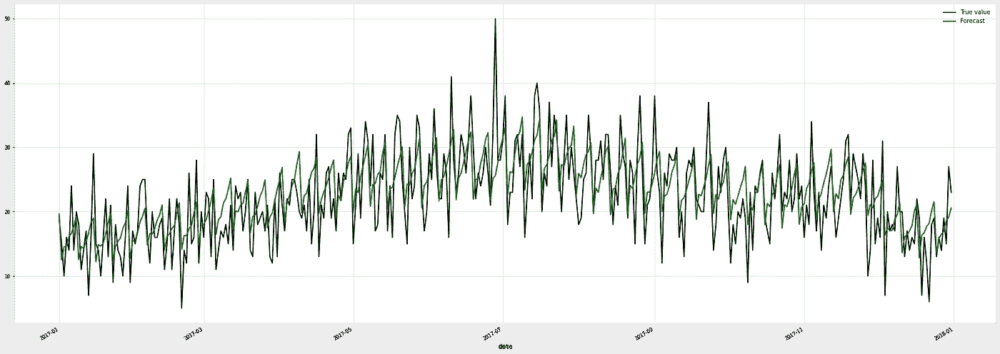

## TFT

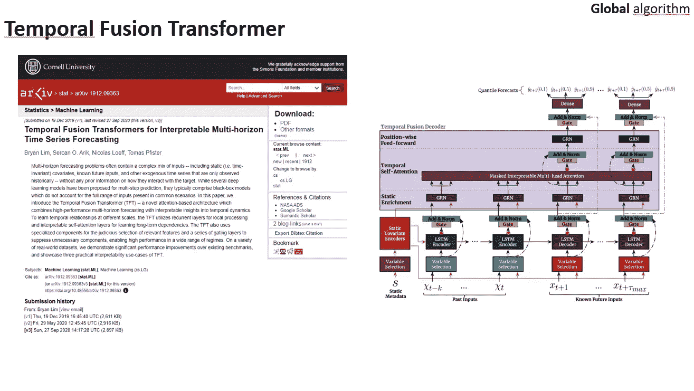

arxiv 和模型架构的截图，基于论文

[**时间融合变换器**](https://arxiv.org/abs/1912.09363)（TFT）是谷歌开发的用于时间序列预测的深度学习算法。它旨在通过结合变换器网络和自回归建模来建模时间序列数据中的复杂依赖关系和关系。

TFT 是最复杂的架构，使用了各种底层技术。它像洋葱一样，由多层组成。此外，根据我的经验，它相比上述模型学习时间最长。TFT 使用多头注意力块来寻找长期模式，但使用 LSTM 序列到序列编码器/解码器来寻找这些较短的模式。

```py
model_tft = TFTModel(
    input_chunk_length=28,
    output_chunk_length=356,
    hidden_size=16,
    lstm_layers=1,
    num_attention_heads=3,
    dropout=0.1,
    batch_size=32,
    n_epochs=5,
    add_encoders={"cyclic": {"future": ["month"]}, 
                  'datetime_attribute': {'future': ['dayofweek']},
                  'position': {'past': ['relative'], 'future': ['relative']}, 
                  'transformer': Scaler()
                 },
    add_relative_index=False,
    optimizer_kwargs={"lr": 1e-3},
    random_state=0,
    pl_trainer_kwargs={
      "accelerator": "gpu",
      "devices": [0]
    }
)

model_tft.fit(series=train_dataset_ts_prepared, verbose=True)

backtests_tft = model_tft.predict(n=forecast_horizons, series=train_dataset_ts_prepared, 
                                  num_samples=1000, verbose=True)
backtests_tft = scaler.inverse_transform(backtests_tft)
print(f'overall MAPE: {get_overall_MAPE(backtests_tft)}%')
```

**整体 MAPE：13.37%**

```py
fig, ax = plt.subplots(figsize=(30, 10))
test_dataset_ts[0].plot(label='True value', color='black')
backtests_tft[0].plot(label='Forecast', color='green')
plt.show()
```

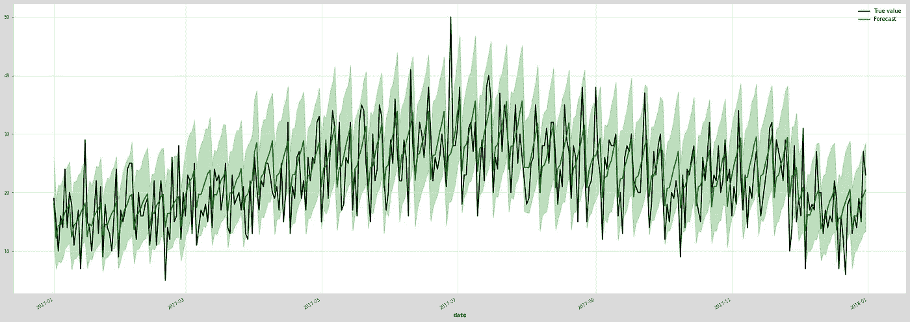

# 总结

在这篇文章中，我想向你展示你可以选择哪些方法来预测多个时间序列。我提供了完全实用的代码，随意使用它们，不要犹豫与我联系。

这只是对主题的介绍。我认为数据科学家在供应链公司工作的相关主题还包括以下内容：

- **层级预测**及随后合并来自不同层级的预测，即层级调整。我们可以在商店级别进行预测，也可以在国家级别进行预测，但当我们将商店级别的预测聚合时，作为总和，我们希望得到与国家级别预测显示的相同结果。这就是层级调整重要的原因。

- 另一个话题是 **库存优化**，即我们应该在库存中拥有多少产品，以避免没有产品库存的情况，但另一方面，我们也不希望某一产品库存数月。

# 有问题吗？


问题，图片由作者提供

我意识到在这篇文章中我触及了许多主题。我想给你一个可以采取的方向的指示。也许其中一些应该在这里更详细地描述，而其他的则在新文章中详细描述。请不要犹豫，**你可以在** [**Linkedin**](https://www.linkedin.com/in/bartosz-szablowski/) **找到我**。在未来的文章中，我希望它们能够涵盖详细的主题，并展示如何使用 PyTorch 库从头开始实现时间序列模型。

感谢你的时间！

数据集来源：

> 杂项{仅限需求预测内核，
> 
> 作者 = {inversion},
> 
> 标题 = {商店商品需求预测挑战},
> 
> 出版商 = {Kaggle},
> 
> 年份 = {2018},
> 
> 网址 = {https://kaggle.com/competitions/demand-forecasting-kernels-only},
> 
> 许可证 = CC
> 
> }
