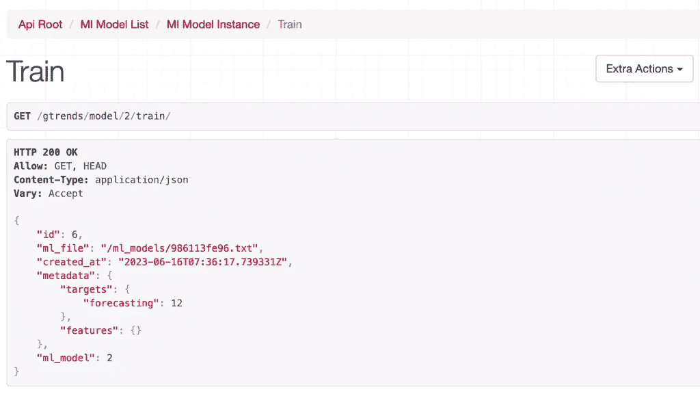
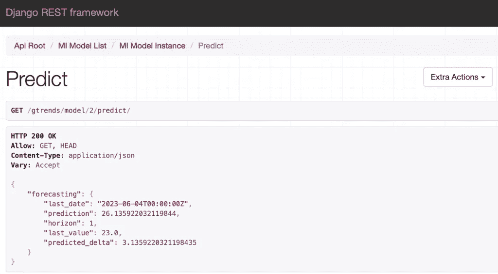

# 预测 API：一个使用 Django 和 Google Trends 的示例

> 原文：[`towardsdatascience.com/forecasting-api-an-example-with-django-and-google-trends-9b55046bd578`](https://towardsdatascience.com/forecasting-api-an-example-with-django-and-google-trends-9b55046bd578)

## 构建一个 web 应用程序以预测 Google Trends 的发展趋势。

[](https://medium.com/@davide.burba?source=post_page-----9b55046bd578--------------------------------)[](https://towardsdatascience.com/?source=post_page-----9b55046bd578--------------------------------) [Davide Burba](https://medium.com/@davide.burba?source=post_page-----9b55046bd578--------------------------------)

·发布于 [Towards Data Science](https://towardsdatascience.com/?source=post_page-----9b55046bd578--------------------------------) ·阅读时间 14 分钟·2023 年 8 月 1 日

--


“Google Trends”，由 [Giulia Roggia](https://www.instagram.com/giulia_roggia__/)。经许可使用。

+   简介

+   Django 模型

+   服务：数据源，预处理，机器学习，任务

+   交互层：序列化器，视图，端点

+   结论

# 简介

## 什么是 Django？

[Django](https://www.djangoproject.com) 是一个高级 Python 网络框架。它设计得快速、安全、可扩展，因此是开发预期会增长复杂性的强大 web 应用程序的热门选择。有关 Django 的介绍，请参阅 [这个教程](https://docs.djangoproject.com/en/4.2/intro/tutorial01/)。

在这个示例中，我们将使用 [Django Rest Framework](https://www.django-rest-framework.org)（DRF），这是 Django 的一个扩展，旨在简化 [REST API](https://www.redhat.com/en/topics/api/what-is-a-rest-api) 的开发。有关 DRF 的介绍，请参阅 [这个教程](https://www.django-rest-framework.org/tutorial/quickstart/)。

## 需求

我们将通过列出一些假设的需求来开始设计我们的应用：

+   **总体目标**：实现一个系统来预测未来时间序列的值。

+   **数据**： [Google Trends](https://trends.google.com/trends/) 的周频数据，包含特征和目标，未来可能会扩展。数据应根据需求下载。

+   **预处理**：仅使用滞后值。

+   **机器学习模型**：一个全球 LightGBM 模型（如果你想了解更多关于全球与本地模型的区别，可以查看 [这篇文章](https://medium.com/towards-data-science/local-vs-global-forecasting-what-you-need-to-know-1cc29e66cae0)）。

+   **推断**：生成在线预测（与批量预测相对），但不需要提供输入特征。

*本教程中使用的完整代码可在* [*这里*](https://github.com/davide-burba/code-collection/)*获取*。

## 设置环境

让我们从列出所需的依赖项开始。

```py
python = "³.8"
Django = "⁴.2.1"
lightgbm = "³.3.5"
pandas = "².0.1"
djangorestframework = "³.14.0"
pytrends = "⁴.9.2"
drf-extensions = "⁰.7.1"
```

我们将使用[poetry](https://python-poetry.org)来管理依赖项，使用[Docker](https://www.docker.com)来容器化项目。你可以在[这里](https://github.com/davide-burba/code-collection/tree/main/examples/api-example-django)查看本项目中使用的 poetry 和 docker 文件。

## 快速开始

如果你想跳过前面的内容，直接开始使用应用程序，你可以运行以下命令：

```py
# Clone the project.
git clone git@github.com:davide-burba/code-collection.git

# Move to the right folder.
cd code-collection/examples/api-example-django

# Launch the app.
docker compose up -d

# Apply the migrations.
docker compose exec django ./manage.py migrate

# Interactively create a (super)user for your app.
docker compose exec django ./manage.py createsuperuser 
```

并连接到`localhost:8000/gtrends`！

# Django 模型

在本节中，我们列出了示例中使用的 Django 模型。

## 时间序列

对于一个预测系统，我们需要处理时间序列数据。通常我们只需要两个模型：一个用于识别每个时间序列，另一个用于存储其值。但由于**Google Trends 的历史数据可能会因为归一化而每天发生变化**，我们还需要对数据进行版本控制，这会导致额外的一个模型。

我们还创建了一个模型，用于列出不同的数据源（目前只有 Google Trends）。

```py
class TimeSeries(models.Model):
    name = models.CharField(unique=True, max_length=64)
    source = models.CharField(max_length=32, choices=DataSource.choices)

class TSVersion(models.Model):
    timeseries = models.ForeignKey(TimeSeries, on_delete=CASCADE)
    created_at = models.DateTimeField(auto_now_add=True)
    expired = models.BooleanField(default=False)

class TSValue(models.Model):
    version = models.ForeignKey(TSVersion, on_delete=CASCADE)
    time = models.DateTimeField()
    value = models.FloatField()

class DataSource(models.TextChoices):
    GOOGLE_TRENDS = "GOOGLE_TRENDS"
```

## 配置

要训练一个监督模型，我们需要一组特征和目标。我们可以将这些信息存储在一个“数据配置”中。这个过程通过以下模型完成。

```py
class DataConfig(models.Model):
    name = models.CharField(unique=True, max_length=64)

class DataFeatures(models.Model):
    config = models.ForeignKey(
        DataConfig, on_delete=CASCADE, related_name="features"
    )
    timeseries = models.ForeignKey(TimeSeries, on_delete=PROTECT)

class DataTargets(models.Model):
    config = models.ForeignKey(
        DataConfig, on_delete=CASCADE, related_name="targets"
    )
    timeseries = models.ForeignKey(TimeSeries, on_delete=PROTECT)
```

同样，我们需要存储预处理和机器学习（ML）模型的配置。为了简化，我们将这些存储在一个`JSONField`中：

```py
class PreprocessingConfig(models.Model):
    name = models.CharField(unique=True, max_length=64)
    params = models.JSONField()

class MLConfig(models.Model):
    params = models.JSONField()
```

## ML 模型

在这里，我们区分了 ML 配置和 ML 模型。ML 配置包含关于 LightGBM 参数的数据，而 ML 模型包含所有关于数据、预处理和 ML 配置的信息。

一个 ML 模型可以在不同的数据集上进行估计（由于新数据的到来），因此我们还需要对 ML 模型进行版本控制。这会导致以下两个模型：

```py
class MLModel(models.Model):
    name = models.CharField(unique=True, max_length=64)
    ml_config = models.ForeignKey(MLConfig, on_delete=PROTECT)
    data_config = models.ForeignKey(DataConfig, on_delete=PROTECT)
    preprocess_config = models.ForeignKey(
        PreprocessingConfig, on_delete=PROTECT
    )

class MLModelVersion(models.Model):
    ml_model = models.ForeignKey(MLModel, on_delete=CASCADE)
    ml_file = models.FileField(upload_to="ml_models")
    created_at = models.DateTimeField(auto_now_add=True)
    metadata = models.JSONField()
```

`MLModelVersion`保存了指向 LightGBM 工件的链接在`ml_file`中，以及关于它所训练数据的信息在`metadata`中。工件存储在 django 设置模块中指定的位置：例如，可能是文件系统中的一个文件夹或云中的一个 S3 桶。

# 服务

在本节中，我们描述了包含应用逻辑的服务。根据[Django-StyleGuide](https://github.com/HackSoftware/Django-Styleguide/tree/master#overview)，将其与视图分开是最佳实践。

## 数据源

由于数据源预计将来会增长，我们将使用灵活的设计：

+   一个抽象的`DataSource`类，定义了一个接口。

+   一个`GTrendSource`类，继承自`DataSource`并实现下载 Google Trends 数据的细节。

+   一个`download_data`工厂用来构建`DataSource`子类。

这会产生以下模块：

```py
import datetime as dt
from abc import ABC, abstractmethod

import pandas as pd
from gtrends.models import TimeSeries
from pytrends.request import TrendReq

def download_data(timeseries: TimeSeries) -> pd.DataFrame:
    return DATASOURCE_MAPtimeseries.source.download()

class DataSource(ABC):
    def __init__(self, timeseries: TimeSeries):
        self.timeseries = timeseries

    @abstractmethod
    def download(self) -> pd.DataFrame:
        """Returns a dataframe with time as index and value as column."""

class GTrendSource(DataSource):
    START_DATE = "2022-01-01"

    def download(self) -> pd.DataFrame:
        # Download data.
        name = self.timeseries.name
        data = self.download_interest_over_time(name)
        # Format new data.
        data = (
            data[~data.isPartial]
            .reset_index()
            .rename(columns={name: "value", "date": "time"})
            .set_index("time")
        )[["value"]]
        data["value"] = data["value"].astype(float)
        return data

    @classmethod
    def download_interest_over_time(cls, search_term: str) -> pd.DataFrame:
        """Download Google Trends data."""
        pytrends = TrendReq()
        timeframe = (
            cls.START_DATE + " " + dt.datetime.now().strftime("%Y-%m-%d")
        )
        pytrends.build_payload([search_term], timeframe=timeframe)
        return pytrends.interest_over_time()

DATASOURCE_MAP = {
    "GOOGLE_TRENDS": GTrendSource,
}
```

## 预处理

一旦数据加载完成，我们希望预处理数据以便后续训练模型或推断未来值。让我们从定义一个接口类开始。

```py
class BasePreprocessor(ABC):
    @abstractmethod
    def build_x_y(self, data: Dict) -> Tuple[pd.DataFrame, pd.Series]:
        """Return features and target ready for training."""

    @abstractmethod
    def build_x_latest(self, data: Dict) -> pd.DataFrame:
        """Return only latest values of features, useful for inference"""
```

目前我们只考虑用于特征工程的滞后值。让我们创建一个实现滞后逻辑的辅助函数。

```py
def _build_lags(
    df: pd.DataFrame, column: str, lags: List[int], prefix: str
) -> pd.DataFrame:
    return pd.concat(
        [
            df[[column]]
            .shift(lag)
            .rename(columns={column: f"{prefix}_lag_{lag}"})
            for lag in lags
        ],
        axis=1,
    )
```

现在我们需要创建一个实现基类抽象方法的类。让我们首先定义它的属性。

```py
@dataclass
class Preprocessor(BasePreprocessor):
    horizon: int
    target_lags: List[int]
    feature_lags: List[int]
```

请注意，目标本身可以作为特征使用。对于作为特征使用的目标，我们分配一个通用前缀“target”。当有多个目标时，这可能是有益的，因为它们将堆叠在相同的列中，从而减少特征的数量。

这里是构建滞后目标和特征的实现：

```py
def _build_x_lags_targets(
        self, target_data: Dict
    ) -> Optional[pd.DataFrame]:
        if not self.target_lags:
            return None

        x = []
        for df in target_data.values():
            x.append(
                _build_lags(
                    df=df,
                    column="value",
                    lags=self.target_lags,
                    prefix="target",
                )
            )
        return pd.concat(x, axis=1)

def _build_x_lags_features(
        self, feature_data: Dict, target_data: Dict
    ) -> Optional[pd.DataFrame]:
        if not self.feature_lags:
            return None

        x = []
        for name, df in feature_data.items():
            x.append(
                _build_lags(
                    df=df,
                    column="value",
                    lags=self.feature_lags,
                    prefix=name,
                )
            )

        # Concat features on axis 1.
        x = pd.concat(
            [df.reset_index().drop(columns=["ts_name"]) for df in x], axis=1
        )

        # Use target to "reindex" on axis 0.
        for_reindex = pd.concat(target_data.values(), axis=1).reset_index()
        x = pd.merge(for_reindex, x, how="left", on="time")

        return x.drop(columns=["value"]).set_index(["time", "ts_name"])
```

现在我们可以将它们封装在一个`build_x`方法中：

```py
def build_x(self, data: Dict) -> pd.DataFrame:
    target_data = data["targets"]
    feature_data = data["features"]

    # Build x_target and x_features.
    x_targ = self._build_x_lags_targets(target_data)
    x_feat = self._build_x_lags_features(feature_data, target_data)
    # Combine x_target and x_features.
    if x_feat is None and x_targ is None:
        raise ValueError("Cannot have no target lags and no feature lags.")
    elif x_feat is None:
        return x_targ
    elif x_targ is None:
        return x_feat
    return pd.merge(
        x_targ, x_feat, left_index=True, right_index=True, how="left"
    )
```

为了构建目标，我们只需将其移动`horizon`时间步：

```py
def build_y(self, target_data: Dict) -> pd.DataFrame:
    y = {}
    for name, df in target_data.items():
        y[name] = (
            df["value"]
            .shift(-self.horizon)
            .rename(f"horizon_{self.horizon}")
        )
    return pd.concat(y.values())
```

现在我们可以为所需的抽象方法提供实现：

```py
def build_x_y(self, data: Dict) -> Tuple[pd.DataFrame, pd.Series]:
    # Build x and y.
    x = self.build_x(data)
    y = self.build_y(data["targets"])
    # Align x indexes with y indexes.
    x = pd.merge(y, x, left_index=True, right_index=True, how="left")
    x = x.iloc[:, 1:]
    # Drop missing values generated by lags/horizon.
    idx = ~(x.isnull().any(axis=1) | y.isnull())
    x = x.loc[idx]
    y = y.loc[idx]
    return x, y

def build_x_latest(self, data: Dict) -> pd.DataFrame:
    x = self.build_x(data)
    return x[x.index == x.index.max()]
```

## ML

让我们定义一个非常简单的 ML 模块，提供两个函数用于转储和加载 LightGBM 模型（如果你想知道我们为何选择使用 LightGBM，你可以查看[这篇文章](https://medium.com/towards-data-science/gradient-boosting-a-silver-bullet-in-forecasting-5820ba7182fd)）。

```py
import lightgbm

def save_engine(model, path):
    model.booster_.save_model(path)

def load_engine(path):
    return lightgbm.Booster(model_file=path)
```

# 任务

在定义 API 接口之前，让我们定义一些将在端点中使用的`tasks`。

## **更新时间序列**

我们首先需要存储一些时间序列数据。我们不希望每次下载一个新的数据点时都增加一个新版本到数据库中，因为这样会快速增长并产生大量重复数据。相反，我们希望将新下载的数据与最新版本进行比较，**只有当数据历史不匹配时才创建新版本**。这是在以下代码片段中完成的：

```py
from typing import Tuple
import pandas as pd
from gtrends.services.data_sources import download_data
from gtrends.models import TimeSeries, TSValue, TSVersion

def update_timeseries(timeseries: TimeSeries) -> Tuple[bool, int]:
    """Update timeseries values.

    Either add the new values (if past values are the same) to the latest
    version, or create a new version.

    Args:
        timeseries: A timeseries object.

    Returns:
        A pair with:
            - bool: True if it created a new version, False otherwise
            - int: The number of new values added.
    """
    new_data = download_data(timeseries)

    # Assign version.
    new_version = True
    versions = timeseries.tsversion_set.order_by("created_at")
    if versions:
        version = versions.last()
        old_data = _build_old_data(version)

        if _is_old_data_in_new_data(old_data, new_data):
            # If old values match, just keep the new values.
            new_version = False
            new_data = new_data.loc[~new_data.index.isin(old_data.index)]
        else:
            # Else, set the old version to expired.
            version.expired = True
            version.save()

    if new_version:
        version = TSVersion(timeseries=timeseries)
        version.save()

    # Store new data.
    objs = [
        TSValue(version=version, time=d[0], value=d[1].value)
        for d in new_data.iterrows()
    ]
    TSValue.objects.bulk_create(objs)
    return new_version, len(objs)

def _build_old_data(version: TSVersion) -> pd.DataFrame:
    old_data = pd.DataFrame(
        version.tsvalue_set.values("time", "value")
    ).set_index("time")
    old_data.index = old_data.index.tz_localize(None)
    return old_data

def _is_old_data_in_new_data(
    old_data: pd.DataFrame, new_data: pd.DataFrame
) -> bool:
    if old_data.index.isin(new_data.index).all() and new_data.loc[
        old_data.index
    ].equals(old_data):
        return True
    return False
```

我们还可以添加一个包装器，以方便地更新数据库中的所有时间序列：

```py
def update_all_timeseries():
    """Update all time-series values."""
    for ts in TimeSeries.object.all():
        update_timeseries(ts)
```

## 加载数据

现在我们已经存储了一些时间序列数据，我们希望能够加载它以便进行预处理。

```py
from typing import Dict, List
import pandas as pd
from gtrends.models import TimeSeries

def load_data(
    target_ts: List[TimeSeries], feature_ts: List[TimeSeries]
) -> Dict[str, Dict[str, pd.DataFrame]]:
    targ_feat = {
        "targets": target_ts,
        "features": feature_ts,
    }
    data = {"targets": {}, "features": {}}
    metadata = {"targets": {}, "features": {}}
    for key, items in targ_feat.items():
        for item in items:
            ts = item.timeseries
            version = ts.tsversion_set.last()
            values = version.tsvalue_set.all().values("time", "value")

            df = pd.DataFrame(values)
            df["ts_name"] = ts.name
            df = df.set_index(["time", "ts_name"])

            data[key][ts.name] = df
            metadata[key][ts.name] = version.id

    return data, metadata
```

## 预处理

让我们将预处理封装成几个任务。为了简化，我们直接使用`Preprocessor`类；如果以后想添加另一个预处理类，我们可以使用与数据源相同的工厂模式。

```py
def preprocess(data: Dict, prep_params: Dict) -> Tuple[pd.DataFrame, pd.Series]:
    return Preprocessor(**prep_params).build_x_y(data)

def build_x_latest(data: Dict, prep_params: Dict) -> pd.DataFrame:
    return Preprocessor(**prep_params).build_x_latest(data)
```

## 训练

现在我们已经有了预处理的数据，我们终于可以训练我们的 LightGBM 模型了。请注意，这是更简单的步骤！

```py
from lightgbm import LGBMRegressor

def train(x, y, model_params):
    model = LGBMRegressor(**model_params)
    model.fit(x, y)
    return model
```

## 存储 ML 模型

现在我们可以创建一个任务，将 LightGBM 引擎保存以创建一个新的`MLModelVersion`。注意，我们首先将引擎转储到一个临时文件中。这只是一个技巧，以避免在任务中硬编码存储类型，而是通过 Django 设置动态处理。有关此主题的更多信息，请查看[FileField 文档](https://docs.djangoproject.com/en/4.2/ref/models/fields/#filefield)。

```py
import os
from typing import Dict
from uuid import uuid4

from django.core.files import File
from gtrends import models
from gtrends.ml import save_engine
from lightgbm import LGBMRegressor

def save_mlmodelversion(
    engine: LGBMRegressor, ml_model: models.MLModel, metadata: Dict
) -> models.MLModelVersion:
    filename = str(uuid4()).replace("-", "")[:10] + ".txt"
    tmp_path = "/tmp/" + filename
    save_engine(engine, tmp_path)

    with open(tmp_path, "r") as f:
        ml_model_file = File(f, filename)
        ml_model_version = models.MLModelVersion(
            ml_model=ml_model,
            ml_file=ml_model_file,
            metadata=metadata,
        )
        ml_model_version.save()

    os.remove(tmp_path)
    return ml_model_version
```

## 管道

我们现在可以完成训练和推断管道。由于这些管道速度较快，可以将它们简单地封装在一个函数中。然而，对于长时间运行的管道或高流量的情况，建议使用任务管理器，如 [AirFlow](https://airflow.apache.org) 或 [Celery](https://docs.celeryq.dev/en/stable/index.html)。

这是训练管道：

```py
from gtrends.models import MLModel, MLModelVersion
from gtrends.services.tasks import (
    load_data,
    preprocess,
    save_mlmodelversion,
    train,
)

def train_pipeline(ml_model: MLModel) -> MLModelVersion:
    target_ts = ml_model.data_config.targets.all()
    feature_ts = ml_model.data_config.features.all()
    prep_params = ml_model.preprocess_config.params
    model_params = ml_model.ml_config.params

    data, metadata = load_data(target_ts, feature_ts)
    x, y = preprocess(data, prep_params)
    engine = train(x, y, model_params)
    ml_model_version = save_mlmodelversion(engine, ml_model, metadata)

    return ml_model_version
```

这是推断管道：

```py
from typing import Dict
from gtrends.models import MLModel
from gtrends.services.ml import load_engine
from gtrends.services.tasks import build_x_latest, load_data

def inference_pipeline(ml_model: MLModel) -> Dict:
    if ml_model.mlmodelversion_set.count() == 0:
        raise ValueError("No model has been trained yet!")

    target_ts = ml_model.data_config.targets.all()
    feature_ts = ml_model.data_config.features.all()
    prep_params = ml_model.preprocess_config.params

    data, _ = load_data(target_ts, feature_ts)
    x = build_x_latest(data, prep_params)
    engine = load_engine(ml_model.mlmodelversion_set.last().ml_file.path)
    y_pred = engine.predict(x)

    # Format predictions.
    horizon = ml_model.preprocess_config.params["horizon"]
    preds = {
        name: {"last_date": time, "prediction": pred, "horizon": horizon}
        for time, name, pred in zip(
            x.index.get_level_values("time"),
            x.index.get_level_values("ts_name"),
            y_pred,
        )
    }
    for k, v in preds.items():
        last_value = data["targets"][k].loc[v["last_date"]]["value"].item()
        preds[k]["last_value"] = last_value
        preds[k]["predicted_delta"] = v["prediction"] - last_value

    return preds
```

# 交互层

序列化器、视图和端点代表应用程序的“交互”层，这是最外部的层，并定义了用户如何与应用程序交互。

# 序列化器

序列化器负责序列化和反序列化数据。以下是一个简单的示例：

```py
class TSVersionSerializer(serializers.ModelSerializer):
    class Meta:
        model = models.TSVersion
        fields = "__all__"
```

为了简洁起见，我们只讨论那些非平凡的视图。

## 时间序列

对于时间序列，我们重写默认的创建方法，以便在创建 `TimeSeries` 对象时下载第一个版本。

```py
class TimeSeriesSerializer(serializers.ModelSerializer):
    class Meta:
        model = models.TimeSeries
        fields = "__all__"

    def create(self, validated_data):
        ts = super().create(validated_data)
        # Download data for the newly created timeseries.
        update_timeseries(ts)
        return ts
```

## 数据配置

对于数据配置，我们添加了特征和目标的链接，以便以后从单个端点创建数据配置。

```py
class DataConfigSerializer(serializers.ModelSerializer):
    features = DataFeaturesSerializer(many=True)
    targets = DataTargetsSerializer(many=True, allow_null=False)

    class Meta:
        model = models.DataConfig
        fields = ("id", "name", "features", "targets")

    def validate_targets(self, value):
        if len(value) == 0:
            raise serializers.ValidationError("Must have at least one target.")
        return value

    def create(self, validated_data):
        config = models.DataConfig.objects.create(**validated_data)

        features_data = validated_data.pop("features")
        targets_data = validated_data.pop("targets")
        for feature_data in features_data:
            models.DataFeatures.objects.create(config=config, **feature_data)
        for target_data in targets_data:
            models.DataTargets.objects.create(config=config, **target_data)

        return config
```

## 预处理

让我们在预处理配置上添加一个验证步骤，以检查是否具有预期的参数：

```py
class PreprocessingConfigSerializer(serializers.ModelSerializer):
    class Meta:
        model = models.PreprocessingConfig
        fields = "__all__"

    def validate_params(self, value):
        expected_keys = {"horizon", "target_lags", "feature_lags"}
        if set(value.keys()) != expected_keys:
            raise serializers.ValidationError(f"Expected keys: {expected_keys}")

        if not isinstance(value["horizon"], int):
            raise serializers.ValidationError("Horizon must be an int.")

        for key in ["target_lags", "feature_lags"]:
            if not isinstance(value[key], list) or not all(
                isinstance(lag, int) for lag in value[key]
            ):
                raise serializers.ValidationError(f"{key} must be a list[int].")

        return value
```

## ML 配置

同样，让我们检查为 ML 配置提供的参数是否有效：

```py
class MLConfigSerializer(serializers.ModelSerializer):
    class Meta:
        model = models.MLConfig
        fields = "__all__"

    def validate_params(self, value):
        # At the moment we only support LightGBM model.
        valid_params = LGBMRegressor().get_params()
        invalid_params = [k for k in value if k not in valid_params]
        if invalid_params:
            raise serializers.ValidationError(f"Invalid: {invalid_params}")
        return value
```

# 视图

现在让我们定义用户如何与 API 交互。我们将定义一些动作来触发数据检索或 ML 模型训练。同样，这种做法是可以接受的，因为这些动作执行速度很快，并且我们希望在项目开始时保持简单（如果你对这种哲学感兴趣，可以查看 [YAGNI](https://en.wikipedia.org/wiki/You_aren%27t_gonna_need_it)）。然而，随着项目的增长，可能需要将这些动作异步化并使用任务管理器。

请注意，为了保持版本控制，我们不允许使用 `put` 和 `patch` 方法。

## 时间序列

让我们为时间序列建立一个视图。我们希望能够：

+   创建时间序列并列出它们

+   获取最新版本的值

+   更新值

```py
class TimeSeriesViewSet(viewsets.ModelViewSet):
    queryset = models.TimeSeries.objects.prefetch_related("tsversion_set").all()
    serializer_class = serializers.TimeSeriesSerializer
    http_method_names = ["get", "post", "head", "delete"]

    @action(detail=True, url_path="latest-values")
    def latest_values(self, request, pk):
        """Get timeseries values for the last version."""
        versions = self.queryset.get(pk=pk).tsversion_set.order_by("created_at")
        if not versions:
            return Response([])
        return Response(versions.first().tsvalue_set.values("time", "value"))

    @action(detail=True, url_path="update-values")
    @transaction.atomic
    def update_values(self, request, pk):
        """Update values for one timeseries."""
        timeseries = self.queryset.get(pk=pk)
        try:
            new_version, how_many = update_timeseries(timeseries)
        except ResponseError:
            return Response(
                "Data download failed!", status=status.HTTP_400_BAD_REQUEST
            )
        msg = f"Data updated, {how_many} new values. "
        if new_version:
            msg += " New version created."
        else:
            msg += " Updated latest version."
        return Response(msg)

    @action(detail=False, url_path="update-all-values")
    @transaction.atomic
    def update_all_values(self, request):
        """Update values for all timeseries."""
        try:
            for timeseries in self.queryset:
                update_timeseries(timeseries)
        except ResponseError:
            return Response(
                "Data download failed!", status=status.HTTP_400_BAD_REQUEST
            )
        msg = f"Data updated, {len(self.queryset)} timeseries updated."
        return Response(msg)
```

我们还希望列出一个时间序列的不同版本，并检查其值。

```py
class TSVersionViewSet(viewsets.ModelViewSet):
    queryset = models.TSVersion.objects.prefetch_related("tsvalue_set").all()
    serializer_class = serializers.TSVersionSerializer
    http_method_names = ["get", "head"]

    @action(detail=True)
    def values(self, request, pk, **kwargs):
        """Get timeseries values."""
        values = self.queryset.get(pk=pk).tsvalue_set.values("time", "value")
        return Response(values)
```

## 配置

我们希望列出、添加和删除配置。它们的视图是直接的。

```py
class MLConfigViewSet(viewsets.ModelViewSet):
    queryset = models.MLConfig.objects.all()
    serializer_class = serializers.MLConfigSerializer
    http_method_names = ["get", "post", "head", "delete"]

class DataConfigViewSet(viewsets.ModelViewSet):
    queryset = models.DataConfig.objects.all()
    serializer_class = serializers.DataConfigSerializer
    http_method_names = ["get", "post", "head", "delete"]

class PreprocessingConfigViewSet(viewsets.ModelViewSet):
    queryset = models.PreprocessingConfig.objects.all()
    serializer_class = serializers.PreprocessingConfigSerializer
    http_method_names = ["get", "post", "head", "delete"]
```

## ML 模型

对于 ML 模型，我们希望能够创建和列出它们，并执行训练和推断。

```py
class MLModelViewSet(viewsets.ModelViewSet):
    queryset = (
        models.MLModel.objects.select_related("preprocess_config", "ml_config")
        .prefetch_related(
            "data_config__targets",
            "data_config__features",
            "mlmodelversion_set",
        )
        .all()
    )
    serializer_class = serializers.MLModelSerializer
    http_method_names = ["get", "post", "head", "delete"]

    @action(detail=True)
    def train(self, request, pk, **kwargs):
        ml_model = self.queryset.get(pk=pk)
        ml_model_version = train_pipeline(ml_model)
        return Response(
            serializers.MLModelVersionSerializer(ml_model_version).data
        )

    @action(detail=True)
    def predict(self, request, pk, **kwargs):
        ml_model = self.queryset.get(pk=pk)
        if ml_model.mlmodelversion_set.count() == 0:
            return Response(
                "No model has been trained yet!",
                status=status.HTTP_404_NOT_FOUND,
            )

        predictions = inference_pipeline(ml_model)
        return Response(predictions)
```

我们还希望列出特定 `MLModel` 的所有版本。

```py
class MLModelVersionViewSet(viewsets.ModelViewSet):
    queryset = models.MLModelVersion.objects.all()
    serializer_class = serializers.MLModelVersionSerializer
    http_method_names = ["get", "head"]
```

# 端点

最后，我们可以将刚创建的视图链接到一组端点：

+   `timeseries` 用于时间序列

+   `timeseries/<id>/versions` 用于时间序列版本

+   `model-config`、`data-config`、`preprocessing-config` 用于配置对象

+   `model` 用于 ML 模型

+   `model/<id>/versions` 用于 ML 模型版本

这在以下模块中完成：

```py
from django.urls import include, path
from gtrends import views
from rest_framework_extensions.routers import ExtendedDefaultRouter

router = ExtendedDefaultRouter()

router.register("model-config", views.MLConfigViewSet)
router.register("data-config", views.DataConfigViewSet)
router.register("preprocessing-config", views.PreprocessingConfigViewSet)

models = router.register("model", views.MLModelViewSet)
models.register(
    "versions",
    views.MLModelVersionViewSet,
    basename="version",
    parents_query_lookups="model_id",
)

timeseries = router.register("timeseries", views.TimeSeriesViewSet)
timeseries.register(
    "versions",
    views.TSVersionViewSet,
    basename="version",
    parents_query_lookups="timeseries_id",
)

urlpatterns = [
    path("", include(router.urls)),
]
```

请注意，我们不需要为数据检索或训练定义端点，因为这些会自动添加为“额外操作”。例如，训练模型的端点是 `model/<id>/train`。

# 结论

我们在 Django 中看到了一个预测系统的示例实现。你现在可以开始玩玩这个系统了！要开始，请按照文章开头的说明进行操作，以便你可以连接到 `localhost:8000/gtrends` 并玩转这个应用。

完成设置并训练好模型后，你应该会看到类似于这样的结果（这里我们预测的是术语 *"forecasting"*）：



当你预测未来值时，你应该会看到类似这样的结果：



就这些，你现在可以根据需要实现不同的变体！

这里是可能改进的非详尽列表：

+   实现任务调度

+   添加更多数据源

+   添加一个 [回测](https://medium.com/towards-data-science/why-backtesting-matters-and-how-to-do-it-right-731fb9624a) 端点

+   添加更多预处理选项

+   集成 [MLFlow](https://mlflow.org/) 用于跟踪和版本控制

+   允许用一个模型训练多个预测视角

+   设置适当的网络服务器（生产环境所需）

*喜欢这篇文章吗？* [*查看我的其他文章*](https://medium.com/@davide.burba) *并关注我以获取更多内容！* [*点击这里*](https://medium.com/@davide.burba/membership) *以无限阅读文章，并且对你没有额外费用的情况下支持我*❤️
