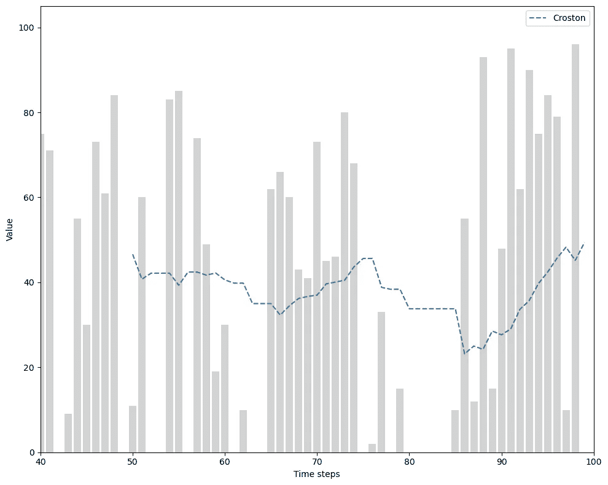
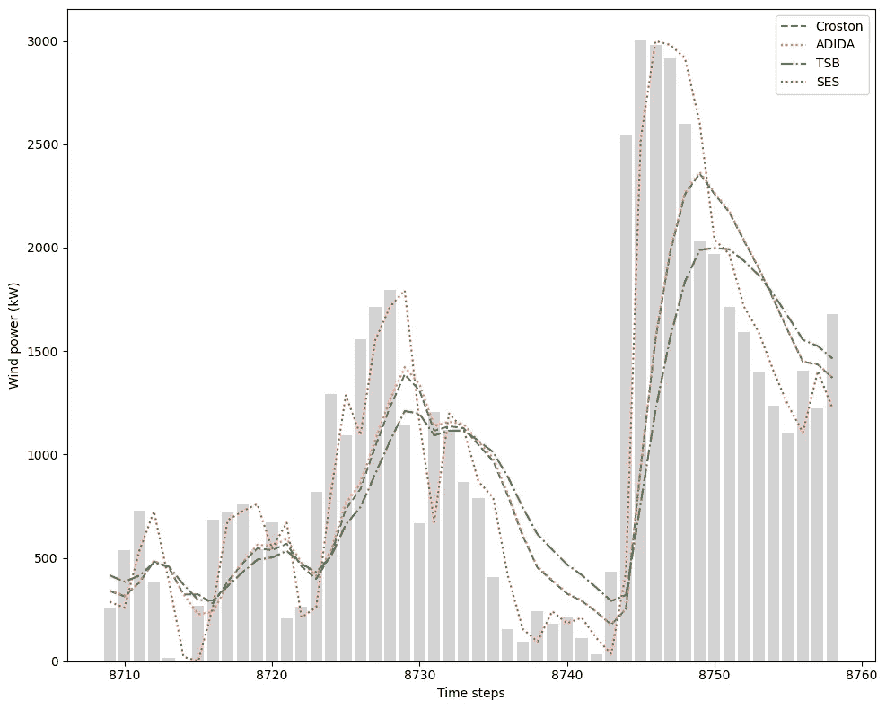

# 用 Python 预测间歇时间序列

> 原文：[`towardsdatascience.com/forecasting-intermittent-time-series-in-python-9fd028a0c9ee`](https://towardsdatascience.com/forecasting-intermittent-time-series-in-python-9fd028a0c9ee)

## Python 中间歇时间序列预测的完整指南及其重点项目

[](https://medium.com/@marcopeixeiro?source=post_page-----9fd028a0c9ee--------------------------------)[](https://towardsdatascience.com/?source=post_page-----9fd028a0c9ee--------------------------------) [Marco Peixeiro](https://medium.com/@marcopeixeiro?source=post_page-----9fd028a0c9ee--------------------------------)

·发表于[Towards Data Science](https://towardsdatascience.com/?source=post_page-----9fd028a0c9ee--------------------------------) ·15 分钟阅读·2023 年 8 月 7 日

--


照片由[Wexor Tmg](https://unsplash.com/@wexor?utm_source=medium&utm_medium=referral)拍摄，来源于[Unsplash](https://unsplash.com/?utm_source=medium&utm_medium=referral)

间歇时间序列或稀疏时间序列是一种特殊情况，其中非零值在时间上偶尔出现，而其余的值都是 0。

一个常见的稀疏时间序列示例是降雨量随时间的变化。可能会有连续很多天没有降雨，而降雨时，降雨量会有所不同。

另一个实际的间歇序列示例是对缓慢移动或高价值物品的需求，例如航空航天或重型机械中的备件。

一些时间序列的间歇性特征在预测中带来了真正的挑战，因为传统模型对间歇性处理不佳。因此，我们必须转向为稀疏时间序列量身定制的替代预测方法。

在这篇文章中，我们将探讨预测间歇时间序列的不同方法。和往常一样，我们首先从理论上探讨每个模型，然后在 Python 中实现它们。

和往常一样，完整的源代码可在[GitHub](https://github.com/marcopeix/intermittent_time_series)上获得。

> **通过我的** [**免费时间序列备忘单**](https://www.datasciencewithmarco.com/pl/2147608294) **在 Python 中学习最新的时间序列分析技术！获取统计和深度学习技术的实现，全部使用 Python 和 TensorFlow！**

让我们开始吧！

# Croston 方法

Croston 方法是预测稀疏时间序列最常见的方法之一。它通常作为基准模型来评估更复杂的方法。

使用 Croston 方法，从原始序列中构建两个序列：

+   包含只有零值的时间序列

+   包含非零值时间段的时间序列

让我们考虑一个示例来说明这一点。考虑下面的稀疏时间序列：


一个模拟的稀疏时间序列。图片由作者提供。

然后，根据 Croston 方法，我们创建两个新的序列：一个包含非零值，另一个包含分隔非零值的时间周期。


构建两个新的序列。第一个序列只有非零值。第二个序列是非零值之间的周期。请注意，我们在两个连续值之间分配了周期为 1。图片由作者提供。

从上表中，我们可以看到我们将非零值表示为 ***qᵢ***，两个连续非零值之间的周期表示为 ***aᵢ***。

还要注意 ***aᵢ*** 的第一个值是 1，因为我们在 *t=1* 处有一个非零值。此外，两个连续值之间的周期也被认为是 1。

从那里，我们使用简单指数平滑根据下面的方程预测每个序列：


预测非零值。图片由作者提供。


预测连续非零值之间的时间间隔。图片由作者提供。

当然，平滑参数 *alpha* 在 0 和 1 之间，因为我们使用的是简单指数平滑。请注意，两条方程中使用的是相同的平滑参数。

然后，最终预测是 ***q*** 和 ***a*** 的比率，如下方的方程所示：


使用 Croston 方法的一步预测。图片由作者提供。

现在，由于使用简单指数平滑来预测每个序列，预测将是一个平坦的水平线。这就是为什么我们通常将其作为基线模型的原因。

此外，大多数基本 Croston 方法的实现使用平滑参数值为 0.1。

再次强调，这是预测间歇性时间序列的最基本方法，但有办法轻松改进它，我们将在接下来讨论。

## 改进 Croston 方法

正如我们之前看到的，经典的 Croston 方法使用相同的平滑参数 0.1 来预测两个构建的序列，这似乎并不理想。

提出了 Croston 方法的优化版本，其中平滑参数在 0.1 和 0.3 之间变化。此外，每个序列都是单独优化的。

一切保持不变，但现在我们为每个序列都有唯一的优化平滑参数，这些参数构成了最终预测。

## Croston 方法的应用

让我们在一个模拟数据集上实现 Croston 方法，看看我们可以用这个模型做出什么样的预测。

首先，我将导入所需的库并读取数据。

```py
import pandas as pd
import numpy as np
import matplotlib.pyplot as plt

sim_df = pd.read_csv('intermittent_time_series.csv')
```

然后，我们使用 *statsforecast* 中的实现。现在，让我们使用经典版本的 Croston 方法，该方法使用平滑因子 0.1。

```py
from statsforecast import StatsForecast
from statsforecast.models import CrostonClassic

models = [CrostonClassic()]

sf = StatsForecast(
    df=sim_df,
    models=models,
    freq='H',
    n_jobs=-1
)
```

然后，为了将模型的预测与我们模拟数据集中的实际数据进行比较，我们运行交叉验证函数。在这里，我们将预测范围设置为 1，因此我们的预测曲线会在数据集的最后 50 个时间步上每个时间步进行更新。

```py
cv_df = sf.cross_validation(
    df=sim_df,
    h=1,
    step_size=1,
    n_windows=50
)
```

然后，我们可以绘制实际值和模型预测值。

```py
fig, ax = plt.subplots(figsize=(10,8))

ax.bar(sim_df.index, sim_df['y'], color='lightgray')
ax.plot(cv_df.index, cv_df['CrostonClassic'], ls='--', label='Croston')
ax.set_ylabel('Value')
ax.set_xlabel('Time steps')
ax.legend(loc='best')
plt.xlim(40, 100)

plt.tight_layout()
```



使用 Croston 方法预测下一个时间步。图片由作者提供。

从上图中，我们可以直观地看到，Croston 方法实际上是间歇时间序列的加权平均。

仔细观察，如果过去的值较大，那么下一个预测值会增加；如果过去的值较小，那么下一个预测值会减少。

还要注意一段时间内我们有连续的零值，这意味着预测曲线没有更新，保持平坦。

最后，请记住我们的预测曲线变化很大，因为我们只预测下一个时间步。如果我们设定一个更长的预测范围，曲线将更像一个楼梯，因为 Croston 方法输出的是一个恒定值。

## 优化的 Croston 方法在实际操作中

现在，让我们重复上面的练习，但使用优化版本的 Croston 方法，其中平滑参数分别针对非零值序列和零值序列进行优化。

```py
from statsforecast.models import CrostonOptimized

models = [CrostonOptimized()]

sf = StatsForecast(
    df=sim_df,
    models=models,
    freq='H',
    n_jobs=-1
)

cv_df = sf.cross_validation(
    df=sim_df,
    h=1,
    step_size=1,
    n_windows=50
)

cv_df.index = np.arange(50, 100, 1)
```

绘制结果生成了下图。


使用优化后的 Croston 方法进行预测。在这种情况下，它与之前的方法基本相同。图片由作者提供。

从图中可以看到，优化平滑参数导致的预测与经典方法对我们模拟数据的预测几乎相同。

现在我们了解了 Croston 方法，让我们继续学习另一种预测技术。

# 汇总-拆分间歇性需求方法（ADIDA）

汇总-拆分间歇性需求方法（ADIDA）旨在通过在较低频率下汇总序列来去除间歇性。

例如，如果每小时数据有零值，那么对 24 小时数据求和以获得每日数据可能会去掉零值。同样的逻辑也适用于间歇性的日数据，我们可以将其汇总为周数据，以去除零值期间。


用五个时间步的滚动总和来汇总我们的模拟数据。注意底部图（汇总值）如何有效去除了系列中的间歇性。图片由作者提供。

在上图中，我们可以看到汇总对模拟数据的影响。这里，我们对五个时间步进行了汇总。结果汇总序列如底部图所示，不再是间歇性的，因为我们去除了所有零值。

一旦数据被汇总，简单的指数平滑再次用于预测汇总后的序列。

然后，我们将预测值拆解回原始频率。例如，如果每小时数据被聚合到每日数据，那么每个预测值将除以 24（因为一天有 24 小时）来得到拆解后的预测值。

## 如何选择聚合水平

当然，聚合水平对预测和模型性能有很大影响。

如果聚合过大，例如从每小时数据聚合到每周数据，那么可能会丢失很多信息。

如果聚合过小，则结果系列也可能是间歇性的，此时传统的预测方法将无法适用。

尽管没有明确的答案来选择聚合水平，但在*statsforecast*中实现的一种方法是计算非零值之间所有间隔的长度，并取间隔的平均值作为聚合水平。

例如，如果您的间歇性系列中非零值之间的间隔为[3, 5, 4]，则聚合水平将为 4。

在最佳情况下，这种方法可以完全消除间歇性。否则，只有少数零值会残留，这不会对指数平滑产生很大影响。

## ADIDA 的实际应用

现在，让我们在模拟数据上实现 ADIDA，并查看我们获得的预测结果。

使用*statsforecast*，实现仍然简单明了，我们只需更改模型，但管道保持不变。

```py
from statsforecast.models import ADIDA

models = [CrostonOptimized(), ADIDA()]

sf = StatsForecast(
    df=sim_df,
    models=models,
    freq='H',
    n_jobs=-1
)

cv_df = sf.cross_validation(
    df=sim_df,
    h=1,
    step_size=1,
    n_windows=50
)

cv_df.index = np.arange(50, 100, 1)
```

然后，我们绘制预测图，查看其与 Croston 方法的比较表现如何。


使用 ADIDA（虚线）和 Croston 方法（虚线）进行预测。我们可以看到，ADIDA 对零值期间的反应更为明显，通过降低预测值来应对。图片由作者提供。

在上图中，我们可以看到 ADIDA 对零值期间的反应明显更强。尽管 Croston 的预测在观察到零值时保持不变，但 ADIDA 将逐渐降低预测曲线，因此更接近实际数据。

虽然 ADIDA 考虑了单一的聚合水平，但模型中提出了一次迭代来考虑多个聚合水平。这是我们在下一节中研究的内容。

# 间歇性多重聚合预测算法（IMAPA）

如前所述，ADIDA 只考虑一个聚合水平。

然而，信息可能会从不同聚合水平的系列中恢复。

例如，给定每小时数据，如果我们将数据聚合到每日、每周或每月，不同的模式会出现。

这就是间歇性多重聚合预测算法或 IMAPA 的基本思想。

数据再次被聚合，但在多个水平上。然后，就像 ADIDA 一样，使用简单指数平滑来生成每个聚合水平上的预测值。之后，每个预测值被拆解，就像在 ADIDA 中一样。

最终预测是通过在每个聚合级别上取每个预测值的平均值得到的。

因此，我们可以将 IMAPA 看作是在不同聚合级别上多次运行 ADIDA，然后简单地平均预测值以获得最终预测。

记住这些，让我们看看 IMAPA 在我们模拟数据上的表现。

## IMAPA 的实际应用

仍然使用*statsforecast*，我们只需将 IMAPA 算法添加到我们的管道中。

```py
from statsforecast.models import IMAPA

models = [ADIDA(), IMAPA()]

sf = StatsForecast(
    df=sim_df,
    models=models,
    freq='H',
    n_jobs=-1
)

cv_df = sf.cross_validation(
    df=sim_df,
    h=1,
    step_size=1,
    n_windows=50
)

cv_df.index = np.arange(50, 100, 1)
```

然后，我们可以绘制预测图。


使用 IMAPA 进行预测。在这种情况下，它给出了与 ADIDA 相同的结果。图片来源于作者。

看上面的图，我们注意到两条曲线重叠，这意味着 IMAPA 和 ADIDA 在这种情况下给出了相同的预测结果。

尽管这有些令人失望，但请记住，我们正在使用模拟数据，很快我们将处理实际数据集。

在此之前，我们还有一种方法需要探索。

# Teunter-Syntetos-Babai 模型（TSB）

Teunter-Syntetos-Babais 模型，或 TSB，提出了对 Croston 方法的改进。

正如我们之前所见，Croston 方法的预测在零值期间保持不变。这意味着在多个零值期间，预测可能会过时。

换句话说，Croston 方法忽略了过时的风险，这种风险发生在非零值被越来越长的零需求期隔开时。

这在低需求产品的库存管理中尤其重要，因为公司可能会持有多年未使用的库存，这会带来成本。因此，他们必须评估过时的风险，以确定是否可以处理过时库存。

这就是 TSB 模型的作用。它不会考虑需求间隔（即零值期间），而是考虑需求概率，定义为：


需求概率的定义。图片来源于 R. Teunter、A. Syntetos、M. Babai，来自[间歇性需求：将预测与库存过时性联系起来](https://www.sciencedirect.com/science/article/abs/pii/S0377221711004437)

尽管这似乎是一个小差异，但实际上可能会产生很大的影响。使用 Croston 方法时，需求间隔只能在观察到非零值后进行更新。

另一方面，需求概率在每个时间步长上都会更新，使模型更具灵活性。

为了进行预测，模型还会从原始序列中创建两个序列：

+   一个包含仅非零值的序列（也称为**需求**）

+   另一个是需求概率

每个序列的预测是通过简单的指数平滑完成的。然后，通过将需求量与需求概率相乘，得到最终预测。

记住这些，让我们将 TSB 模型应用于我们的模拟数据。

## TSB 的实际应用

与 Croston 方法的优化版本不同，*statsforecast* 中的 TSB 实现需要我们为每个序列指定平滑参数。

这意味着我们需要手动优化这些参数。现在，我们只使用 0.1 作为两个参数，只是为了看看模型在我们模拟数据上的表现。

```py
from statsforecast.models import TSB

models = [TSB(0.1, 0.1), CrostonClassic()]

sf = StatsForecast(
    df=sim_df,
    models=models,
    freq='H',
    n_jobs=-1
)

cv_df = sf.cross_validation(
    df=sim_df,
    h=1,
    step_size=1,
    n_windows=50
)

cv_df.index = np.arange(50, 100, 1)
```

然后，我们可以绘制预测图。


使用 TSB 进行预测。我们可以看到，在零需求期间，使用需求概率更新预测曲线，与 Croston 方法不同。图片由作者提供。

看上面的图，我们可以看到使用需求概率的效果很大，因为预测在无需求期间下降，而不是保持不变。

现在我们已经涵盖了许多间歇性时间序列的预测模型，让我们在一个小的 capstone 项目中应用我们的知识。

# Capstone 项目 — 预测风力发电机的功率输出

风力发电机是可再生能源的来源，但由于风的不可预测性，它们不幸地不可靠。

有时，功率输出可能非常大，而其他时候，它可能非常小。

也可能有风速过强的天，因此风力发电机停机，不产生电力。此外，风速不足也会导致没有电力产生。

因此，我们可以看到风力发电机的功率输出是一个间歇性时间序列。

提醒一下，你可以在[GitHub](https://github.com/marcopeix/intermittent_time_series)上查看这个项目的完整源代码。

## 数据准备

我们首先读取数据并将其格式化，以便我们可以使用*statsforecast*。我们删除不必要的列，并将时间格式化为时间戳。最后，我们创建一个*unique_id*列，并适当地重命名列。

```py
df = pd.read_csv('TexasTurbine.csv')

df = df.drop(['Wind speed | (m/s)', 'Wind direction | (deg)', 'Pressure | (atm)', "Air temperature | ('C)"], axis=1)

start_date = pd.to_datetime('2023-01-01 00:00:00')
end_date = pd.to_datetime('2023-12-31 23:00:00')
date_range = pd.date_range(start=start_date, end=end_date, freq='H')

df['ds'] = date_range

df = df.rename(columns={'System power generated | (kW)': "y"})

df = df.drop(['Time stamp'], axis=1)

df['unique_id'] = 1
df = df[['unique_id', 'ds', 'y']]
```


格式化数据集的前五行。图片由作者提供。

这样，我们的数据就按照*statsforecast*的期望格式化了。请记住，*unique_id*列用于识别同一数据集中不同的时间序列。在我们的案例中，我们只有一个序列，所以*unique_id*对所有行都是恒定的。

然后，我们可以可视化我们的数据。在这里，我们仅关注前 200 个时间步骤，因为我们有一个相当大的数据集。

```py
fig, ax = plt.subplots( figsize=(10,8))

ax.bar(df.index, df['y'], color='grey', width=0.1)
ax.set_ylabel('Wind power (kW)')
ax.set_xlabel('Time steps')

plt.xlim(0, 200)
plt.tight_layout()
```


德克萨斯州风力发电机的功率输出。图片由作者提供。

从上图中，我们可以看到数据的间歇性。我们确实注意到零值期间，并且还注意到高功率输出和低功率输出之间的非常大波动。

现在，让我们尝试预测风力发电机的功率输出。我们将考虑三个不同的预测周期：

+   一小时

+   一天

+   一周

对于每个预测周期，我们将使用平均绝对误差（MAE）来评估每个模型的性能，并选择最佳模型。我们的基准模型将是简单指数平滑。

## 预测下一小时

要测试不同的模型，我们只需将它们列出在 Python 列表中。

在这里，我们立即使用了优化后的 Croston 方法，以获得平滑参数的最佳值。

```py
from statsforecast.models import SimpleExponentialSmoothingOptimized as SESOpt

models = [CrostonOptimized(), ADIDA(), IMAPA(), TSB(0.2, 0.2), SESOpt()]
```

完成这些操作后，我们可以初始化 *Statsforecast* 对象以传入我们的数据集，并指定数据的频率。

```py
sf = StatsForecast(
    df=df,
    models=models,
    freq='H',
    n_jobs=-1 # use all computing power available
)
```

然后，我们进行交叉验证，将预测值与已知值进行比较。由于我们正在预测下一个小时，我们将预测期设置为 1。此外，我们在 50 次预测中评估我们的模型。

```py
h_cv_df = sf.cross_validation(
    df=df,
    h=1, # Horizon is 1, since we forecast the next hour
    step_size=1, # Move the window by 1 time step
    n_windows=50 # Make 50 windows of cross-validation
)

h_cv_df.index = np.arange(8709, 8759, 1)
```

这会生成一个包含每个模型的预测值和实际值的 DataFrame。这使我们能够将预测值与实际值进行绘图。

```py
fig, ax = plt.subplots( figsize=(10,8))

ax.bar(h_cv_df.index, h_cv_df['y'], color='lightgrey')
ax.plot(h_cv_df.index, h_cv_df['CrostonOptimized'], ls='--', label='Croston')
ax.plot(h_cv_df.index, h_cv_df['ADIDA'], ls=':', label='ADIDA')
ax.plot(h_cv_df.index, h_cv_df['TSB'], ls='-.', label='TSB')
ax.plot(h_cv_df.index, h_cv_df['SESOpt'], ls=':', label='SES')

ax.set_ylabel('Wind power (kW)')
ax.set_xlabel('Time steps')

ax.legend(loc='best')

plt.tight_layout()
```



预测风力涡轮机下一小时的功率输出。图片由作者提供。

从上图中，我们注意到两件事。

首先，我没有绘制 IMAPA 的曲线，因为它与 ADIDA 给出的预测完全相同。

其次，简单指数平滑在预测下一个时间步时似乎做得非常好，因为它的曲线比其他模型更接近实际值。

为了验证这一点，让我们计算每个模型的 MAE，并创建一个条形图以识别最佳模型。

```py
from sklearn.metrics import mean_absolute_error

mae_croston_h = mean_absolute_error(h_cv_df['y'], h_cv_df['CrostonOptimized'])
mae_adida_h = mean_absolute_error(h_cv_df['y'], h_cv_df['ADIDA'])
mae_tsb_h = mean_absolute_error(h_cv_df['y'], h_cv_df['TSB'])
mae_ses_h = mean_absolute_error(h_cv_df['y'], h_cv_df['SESOpt'])

y = [mae_croston_h, mae_adida_h, mae_tsb_h, mae_ses_h]
x = ['Croston', 'ADIDA', 'TSB', 'SES']

fig, ax = plt.subplots()

ax.bar(x, y, width=0.4)
ax.set_xlabel('Models')
ax.set_ylabel('MAE (kW)')
ax.set_xlabel('Models')
ax.set_ylim(0, 500)

for index, value in enumerate(y):
    plt.text(x=index, y=value + 5, s=str(round(value,2)), ha='center')

plt.tight_layout()
```


每个模型在预测下一个小时时的 MAE。这里，SES 是最佳模型。图片由作者提供。

毫不意外，简单指数平滑是最佳模型，因为它获得了最低的 MAE。在这种情况下，我们的基线似乎在预测下一个时间步时表现最佳。

让我们看看模型在预测下一天时的表现。

## 预测下一天

为了预测下一天，*Statforecast* 对象保持不变。

现在，我们只需将预测期设置为 24 小时，并将交叉验证窗口移动 24 个时间步。这里，我们进行了五轮交叉验证。

```py
d_cv_df = sf.cross_validation(
    df=df,
    h=24,
    step_size=24,
    n_windows=5
)

d_cv_df.index = np.arange(8639, 8759, 1)
```

然后，我们可以绘制预测值和实际值。


预测接下来的 24 小时的功率输出。图片由作者提供。

在上图中，我们注意到我们的预测在整个预测期内保持平稳，这很正常，因为每个模型输出的是一个常数值。

我们还可以看到，当预测时间跨度较长时，简单指数平滑的表现迅速下降。显然，简单指数平滑对零值周期处理不好。

使用 MAE 评估每个模型会得到以下结果。


每个模型在预测下一天时的 MAE。这里，Croston 是最佳模型。图片由作者提供。

从上图中，我们可以看到优化后的 Croston 方法是表现最佳的模型，获得了最低的 MAE。我们还发现，简单指数平滑在较长预测期的表现不如 Croston 和 TSB。

另外，请记住，由于我们增加了预测范围，误差也增加，这是可以预期的。我们预测的时间越长，离实际值就越远。

最后，让我们将预测范围设置为一周。

## 预测下周

为了预测下周，我们将预测范围设置为 168 个时间步长，因为一周有 168 小时，我们的数据是按小时记录的。

```py
w_cv_df = sf.cross_validation(
    df=df,
    h=168,
    step_size=168,
    n_windows=2
)

w_cv_df.index = np.arange(8423, 8759, 1)
```

再次，我们可以绘制每个模型的预测图。


预测下周的电力输出。图像由作者提供。

上图稍显平淡，因为我们可以清楚地看到我们的模型与实际值相距甚远。这是可以预期的，因为我们的预测范围相当长。

评估我们的模型得到了以下结果。


预测下周每个模型的 MAE。再次强调，Croston 是最好的模型。图像由作者提供。

从上图来看，我们再次看到 Croston 的方法是最好的模型，因为它达到了最低的 MAE。

有趣的是，我们还注意到，与预测次日相比，尽管预测期是原来的七倍，MAE 并没有显著增加。

不过，在实践中，我怀疑预测一个常数值一周真的能帮助做决策或计划未来。

# 结论

我们已经看到，间歇性时间序列提出了有趣的预测挑战，因为传统模型处理零值期间的能力较差。

我们探索了不同的预测模型，如 Croston 方法、ADIDA、IMAPA 和 TSB，每种方法都提供了预测稀疏时间序列的新方法。

恭喜你看到最后，非常感谢你的阅读！希望你喜欢，并且学到了新的东西！

想掌握时间序列预测吗？那就查看[Python 中的应用时间序列预测](https://www.datasciencewithmarco.com/offers/zTAs2hi6/checkout?coupon_code=ATSFP10)。这是唯一一个使用 Python 在 15 个引导的实际项目中实现统计、深度学习和最先进模型的课程。

干杯 🍻

# 支持我

喜欢我的工作吗？通过[买杯咖啡](http://buymeacoffee.com/dswm)来支持我，这是一种简单的方式来鼓励我，同时我也能享用一杯咖啡！如果你愿意，只需点击下面的按钮 👇


