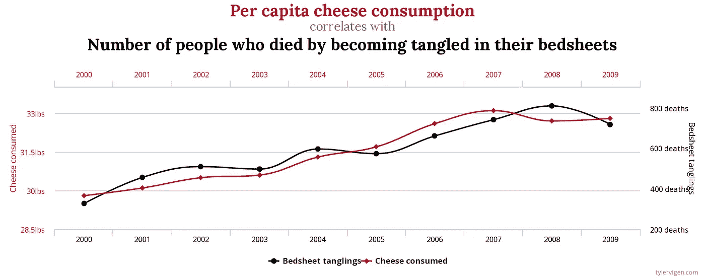

# 使用格兰杰因果检验进行预测：检查时间序列中的虚假相关性

> 原文：[`towardsdatascience.com/forecasting-with-granger-causality-checking-for-time-series-spurious-correlations-5faed62c3604?source=collection_archive---------8-----------------------#2023-04-06`](https://towardsdatascience.com/forecasting-with-granger-causality-checking-for-time-series-spurious-correlations-5faed62c3604?source=collection_archive---------8-----------------------#2023-04-06)

## 使用机器学习方法破解格兰杰因果检验

 [Marco Cerliani](https://medium.com/@cerlymarco?source=post_page-----5faed62c3604--------------------------------)

·

[关注](https://medium.com/m/signin?actionUrl=https%3A%2F%2Fmedium.com%2F_%2Fsubscribe%2Fuser%2Fc843902314c7&operation=register&redirect=https%3A%2F%2Ftowardsdatascience.com%2Fforecasting-with-granger-causality-checking-for-time-series-spurious-correlations-5faed62c3604&user=Marco+Cerliani&userId=c843902314c7&source=post_page-c843902314c7----5faed62c3604---------------------post_header-----------) 发布于 [Towards Data Science](https://towardsdatascience.com/?source=post_page-----5faed62c3604--------------------------------) ·6 分钟阅读·2023 年 4 月 6 日

--

图片由 [Phoenix Han](https://unsplash.com/@phienix_han?utm_source=medium&utm_medium=referral) 提供，来源于 [Unsplash](https://unsplash.com/?utm_source=medium&utm_medium=referral)

在时间序列预测中，图形化地检查数据通常是有帮助的。这有助于我们理解我们所分析现象的动态，并据此做出决策。尽管拥有一张多彩的时间序列图可能很吸引人，但它可能导致错误的结论。**时间序列很棘手，因为通常不相关的事件仍可能在视觉上被认为是相关的**。

伪相关性的一个例子 [[SOURCE](https://www.tylervigen.com/spurious-correlations)]

作为理性个体，我们可以轻易地否定*因床单缠绕而导致的死亡人数*与*人均奶酪消费量*之间的任何关系。**我们可以断言存在虚假的（伪造的）相关性，因为没有任何东西能够将这两个事件联系起来**，即使我们对这两个领域都不是专家。

从事数据工作的人知道，这些模式可能经常发生，特别是在我们难以解释背景和区分真实与虚假相关性的情况下。因此，需要有助于区分这些…
