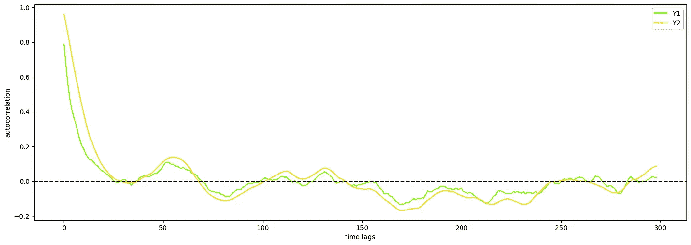

# 使用 Granger 因果关系进行预测：检查时间序列的虚假相关

> 原文：[`towardsdatascience.com/forecasting-with-granger-causality-checking-for-time-series-spurious-correlations-5faed62c3604`](https://towardsdatascience.com/forecasting-with-granger-causality-checking-for-time-series-spurious-correlations-5faed62c3604)

## 使用机器学习方法破解 Granger 因果关系测试

[](https://medium.com/@cerlymarco?source=post_page-----5faed62c3604--------------------------------)[](https://towardsdatascience.com/?source=post_page-----5faed62c3604--------------------------------) [Marco Cerliani](https://medium.com/@cerlymarco?source=post_page-----5faed62c3604--------------------------------)

·发表于 [Towards Data Science](https://towardsdatascience.com/?source=post_page-----5faed62c3604--------------------------------) ·6 分钟阅读·2023 年 4 月 6 日

--


[Phoenix Han](https://unsplash.com/@phienix_han?utm_source=medium&utm_medium=referral)的照片，来源于 [Unsplash](https://unsplash.com/?utm_source=medium&utm_medium=referral)

在时间序列预测中，通常通过图形化数据进行检查是非常有帮助的。这有助于我们理解我们所分析现象的动态，并据此做出决策。尽管拥有一个色彩斑斓的时间序列图可能非常迷人，但它可能会导致不正确的结论。**时间序列很棘手，因为无关事件往往会在视觉上看起来有关联**。


虚假相关的一个示例 [[来源](https://www.tylervigen.com/spurious-correlations)]

作为理性个体，我们可以轻易否定*因被床单缠绕而死亡的人数*与*人均奶酪消费量*之间的任何关系。**我们可以断言存在虚假的（虚假）相关，因为没有任何东西可以将这两个事件联系起来**，即使我们在这两个领域都不是专家。

从事数据工作的人知道这些模式可能经常发生，尤其是在我们难以解释上下文和区分真实与虚假相关时。因此，开发能够帮助识别这些情况的方法是至关重要的。

**用于检测虚假相关的最著名技术之一是 Granger 因果关系测试**。

Granger 因果关系建立在这样一种直觉上：**如果信号 Y1 *“Granger 引起”* 另一个信号 Y2，那么 Y1 的滞后（即过去的观察）应包含有助于预测 Y2 的信息**，以及 Y2 过去观察中包含的信息。


可能的 Granger 因果关系示例 [图片由作者提供]

测试 Granger 因果关系并不意味着 Y1 必须是 Y2 的原因。这仅仅意味着 Y1 的过去值足够好，可以改善对 Y2 未来值的预测。由此，我们可能得出一个朴素的因果关系定义。

采用 Granger 因果关系检验意味着对基础数据有严格的假设（即平稳性和线性依赖），这些假设在现实世界应用中可能难以满足。因此，在本文中，**我们提出了一种 Granger 因果关系检验的泛化方法，采用了简单的机器学习方法，并涉及预测算法的使用**。

# 实验设置

本文的范围内，我们模拟了两个不同的时间序列，这些序列是自回归过程的结果。


模拟的 AR 过程 [图片由作者提供]

两个序列与其过去的某些时间步长存在相关性（自相关）。



AR 过程的自相关 [图片由作者提供]

时间序列表现出整体皮尔逊相关系数为 0.637，且在时间上保持离散的正相关关系。


AR 过程的皮尔逊相关性 [图片由作者提供]

初看之下，这似乎表明我们面对的是两个具有正相关的事件。**我们用皮尔逊相关系数来表示两个变量之间的相关性**。这是测量变量之间线性关系的最常用统计量。如此常见，以至于人们常常错误地将其解释为因果关系。这可能是一个错误！**皮尔逊相关仅涉及两个变量的均值和标准差。我们不能据此得出关于它们依赖关系的任何结论**。


皮尔逊相关公式 [图片由作者提供]

在我们模拟的场景中，正相关仅仅是数学结果，因为我们知道这两个序列仅在一个方向上有关联。更确切地说，Y1 的过去值与 Y2 的实际值线性相关（反之则不成立）。我们的目标是对此声明进行实际演示。

# Granger 预测

**以经典方式进行 Granger 因果关系检验，意味着验证时间序列（Y1）的过去值是否对另一时间序列（Y2）的当前值有统计学上显著的影响**。这是通过在滞后序列值上运行线性模型来完成的。

检验的零假设是 Y1 的过去值对应的系数为零。如果 p 值低于特定阈值，我们将拒绝零假设。在这种情况下，Y1 不会 Granger 引起 Y2。

**如果我们对预测模型的残差进行相同的检查会怎么样？**

换句话说，**我们验证了添加 Y1 的过去值是否能改善仅使用目标（Y2）滞后观察值的模型的性能**。

作为第一步，我们对 Y1 和 Y2 进行两个自回归模型的拟合，不添加额外的外生变量，并存储在测试数据上获得的预测结果。

```py
forecaster = ForecastingCascade(
    RandomForestRegressor(30, random_state=42, n_jobs=-1),
    lags=lags,
    use_exog=False,
)

model_y1 = clone(forecaster).fit(None, df_train['y1'])
model_y2 = clone(forecaster).fit(None, df_train['y2'])

y1_pred = np.concatenate([
    model_y1.predict(
        [[0.]],
        last_y=df['y1'].iloc[:i]
    ) for i in range(len(df_train), len(df_train) + len(df_test))
])
y2_pred = np.concatenate([
    model_y2.predict(
        [[0.]],
        last_y=df['y2'].iloc[:i]
    ) for i in range(len(df_train), len(df_train) + len(df_test))
])
```

其次，我们重复相同的预测过程，但添加了滞后的外生变量（即在预测 Y1 时使用 Y2 的过去值加上 Y1 的过去值）。

```py
forecaster = ForecastingCascade(
    make_pipeline(
        FunctionTransformer(
            lambda x: x[:,1:]  # remove current values of exog series
        ),
        RandomForestRegressor(30, random_state=42, n_jobs=-1)
    ),
    lags=lags,
    use_exog=True,
    exog_lags=lags,
)

model_y1y2 = clone(forecaster).fit(df_train[['y2']], df_train['y1'])
model_y2y1 = clone(forecaster).fit(df_train[['y1']], df_train['y2'])

y1y2_pred = np.concatenate([
    model_y1y2.predict(
        pd.DataFrame({'y2': [0.]}),
        last_y=df['y1'].iloc[:i],
        last_X=df[['y2']].iloc[:i]
    ) for i in range(len(df_train), len(df_train) + len(df_test))
])
y2y1_pred = np.concatenate([
    model_y2y1.predict(
        pd.DataFrame({'y1': [0.]}),
        last_y=df['y2'].iloc[:i],
        last_X=df[['y1']].iloc[:i]
    ) for i in range(len(df_train), len(df_train) + len(df_test))
])
```

在预测阶段结束时，我们存储了 4 种不同模型的预测结果（两个用于预测 Y1，另外两个用于预测 Y2）。现在是结果比较的时间。

对所有预测类型的样本级别计算平方残差。对相同预测目标的平方残差分布进行综合分析。我们使用标准的 Kolmogorov-Smirnov 检验来检查分布差异。


平方残差分布的比较 [图片由作者提供]

对于 Y1 的预测在添加和不添加 Y2 特征的情况下似乎是一样的。


平方残差分布的比较 [图片由作者提供]

相反，Y2 的预测在添加和不添加 Y1 特征的情况下有显著差异。这意味着 Y1 对预测 Y2 有正面影响，即 Y1 格兰杰导致 Y2（反之则不成立）。

# 总结

在这篇文章中，我们提出了一种替代标准格兰杰因果检验的方法，以验证时间序列领域中的因果动态。我们没有仅仅依赖于皮尔逊相关系数来得出数据结论。我们以经验的方式分析了可用事件的相互影响的可能性，识别出虚假的关系。所提出的方法易于使用且具有适应性，假设较少，适合用于任何时间序列分析过程。

[**查看我的 GitHub 仓库**](https://github.com/cerlymarco/MEDIUM_NoteBook)

保持联系: [Linkedin](https://www.linkedin.com/in/marco-cerliani-b0bba714b/)
