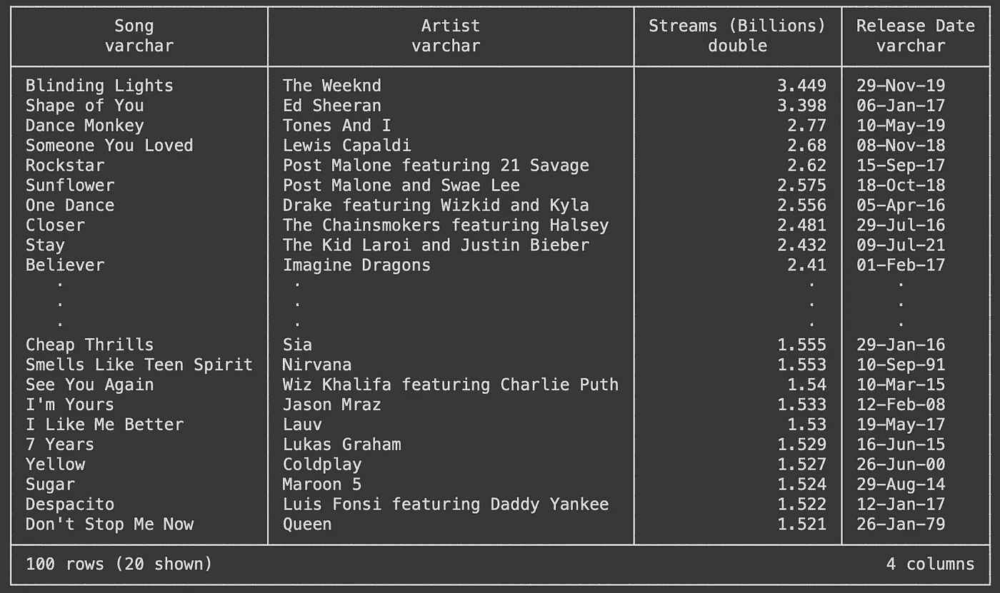
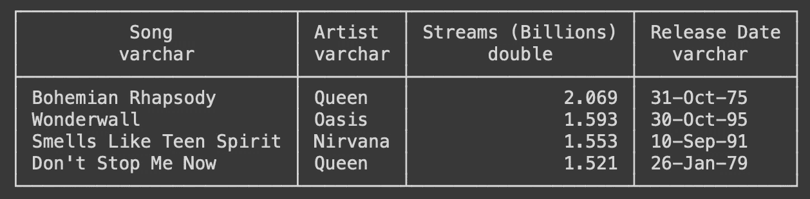

# 忘掉 SQLite，改用 DuckDB——然后感谢我

> 原文：[`towardsdatascience.com/forget-about-sqlite-use-duckdb-instead-and-thank-me-later-df76ee9bb777`](https://towardsdatascience.com/forget-about-sqlite-use-duckdb-instead-and-thank-me-later-df76ee9bb777)

## DuckDB 及其 Python 集成介绍

[](https://polmarin.medium.com/?source=post_page-----df76ee9bb777--------------------------------)[](https://towardsdatascience.com/?source=post_page-----df76ee9bb777--------------------------------) [Pol Marin](https://polmarin.medium.com/?source=post_page-----df76ee9bb777--------------------------------)

·发表于 [Towards Data Science](https://towardsdatascience.com/?source=post_page-----df76ee9bb777--------------------------------) ·8 分钟阅读·2023 年 3 月 16 日

--


图片来源 [Krzysztof Niewolny](https://unsplash.com/@epan5?utm_source=medium&utm_medium=referral) 于 [Unsplash](https://unsplash.com/?utm_source=medium&utm_medium=referral)

我们程序员往往在需要在本地环境中使用嵌入式数据库时默认选择 SQLite。虽然大多数时候这工作得很好，但就像骑自行车旅行 100 公里：可能不是最佳选择。

介绍 DuckDB。

我第一次了解到 DuckDB 是在 2022 年 9 月，在格拉纳达的 PyCon 西班牙上。现在，经过 6 个月的使用，我已经离不开它了。我希望通过为我的程序员和数据相关专业人士提供对这个出色分析数据库系统的介绍来回馈社区。

在这篇文章中，我将讨论以下主要点：

+   DuckDB 简介：它是什么，为什么你应该使用它以及何时使用。

+   DuckDB 集成到 Python 中。

准备好！

> 如果你无法看到整个故事，考虑使用我的推荐链接以获得对所有 Medium 故事的无限访问：[`medium.com/@polmarin/membership`](https://medium.com/@polmarin/membership)

## 什么是 DuckDB？

如果你查看 DuckDB 的官网[1]，你会在首页看到的第一件事是：*DuckDB 是一个内嵌 SQL OLAP 数据库管理系统。*

让我们尝试解读这句话，因为其中包含相关信息。

+   *内嵌 SQL* 意味着 DuckDB 的功能在你的应用程序中运行，而不是在你的应用程序连接的外部进程中。换句话说：没有客户端发送指令，也没有服务器来读取和处理它们。SQLite 的工作方式相同，而 PostgreSQL、MySQL 等则不然。

+   *OLAP* 代表在线分析处理，微软将其定义为一种组织大型业务数据库并支持复杂分析的技术。它可以用于执行复杂的分析查询而不会对事务系统产生负面影响[2]。另一个 OLAP 数据库管理系统的例子是 Teradata。

所以基本上，如果你在寻找一个无服务器的数据分析数据库管理系统，DuckDB 是一个很好的选择。我强烈建议你查看 Dr. Mark Raasveldt 和 Dr. Hannes Mühleisen [3]— 两位最重要的 DuckDB 开发者 — 的出色同行评审论文，以了解 DuckDB 试图填补的空白。

此外，它是一个支持 SQL 的关系数据库管理系统（DBMS）。这就是为什么我们将它与其他具有相同特征的 DBMS（如 SQLite 或 PostgreSQL）进行比较的原因。

## 为什么选择 DuckDB？

我们现在知道 DuckDB 在数据库行业中的作用。但为什么我们应该选择它，而不是其他许多可能的选项呢？

在数据库管理系统中，没有一刀切的解决方案，DuckDB 也不例外。我们将讨论它的一些特性，以帮助你决定何时使用它或不使用它。

总而言之，它是一个高性能的工具。如他们的 GitHub 页面[4]所示：“*它被设计为快速、可靠且易于使用*。” 进一步了解…

+   **它是为了支持分析查询工作负载**（OLAP）而创建的。他们的做法是通过向量化查询执行（面向列），而其他之前提到的 DBMS（SQLite、PostgreSQL…）则按顺序处理每一行。这就是为什么其性能会提高。

+   **DuckDB 采用了 SQLite 最好的特性：简洁性**。简洁的安装和嵌入式进程操作是 DuckDB 开发者在看到 SQLite 的成功后，为这个 DBMS 选择的特点。

    此外，DuckDB 没有外部依赖项，也不需要安装、更新或维护服务器软件。如前所述，它完全嵌入，这具有数据在数据库之间高效传输的额外优势。

+   **技术娴熟的创建者**。他们是一个研究小组，创建它是为了开发一个稳定且成熟的数据库系统。这是通过密集而彻底的测试来实现的，测试套件目前包含了数百万个查询，改编自 SQLite、PostgreSQL 和 MonetDB 的测试套件。

+   **它是完整的**。它支持 SQL 中的复杂查询，提供事务保证（你肯定听说过的 ACID 特性），支持二级索引以加快查询速度……而且，更重要的是，它与 Python 和 R 深度集成，以便进行高效的交互式数据分析。

    它还提供了 C、C++、Java 等语言的 API。

+   **免费且开源**。再好不过了。

这些是官方优势。

但还有更多，我想强调一点：**DuckDB 不一定要替代 Pandas**。它们可以协同工作，如果你像我一样是 Pandas 的粉丝，你可以在 Pandas 中使用 DuckDB 进行高效的 SQL 操作。

这真是太棒了。

> 你可以在 DuckDB 的网站[1]上找到更完整的解释。

## 什么时候使用 DuckDB？

这确实取决于你的个人偏好，但让我们回到其共同创始人发布的论文[3]（我强烈推荐你阅读，它只有 4 页，内容非常宝贵）。

他们解释说，嵌入式分析数据管理有着明显的需求。SQLite 是嵌入式的，但如果我们想用它进行全面的数据分析，它太慢了。他们继续说：“这种需求来自两个主要来源：交互式数据分析和‘边缘’计算。”

所以这是 DuckDB 的前两大用例：

+   **交互式数据分析**。大多数数据专业人士现在在本地环境中使用 R 或 Python 库，如*dplyr*或*Pandas*来处理他们从数据库中检索的数据。DuckDB 提供了在本地开发中利用 SQL 效率的可能性，而不会影响性能。你可以在不放弃你喜欢的编程语言的情况下享受这些好处（稍后会详细介绍）。

+   **边缘计算**。根据维基百科的定义，“边缘计算是一种分布式计算范式，将计算和数据存储更接近数据源。” [5] 使用嵌入式 DBMS，它可以更接近这一点！

DuckDB 可以在不同的环境中安装和使用：Python、R、Java、node.js、Julia、C++……在这里，我们将重点关注 Python，你很快会看到它的使用是多么简单。

## 使用 DuckDB 与 Python（入门）

打开你的终端并导航到所需的目录，因为我们马上就要开始了。创建一个新的虚拟环境——或者不创建——并安装 DuckDB：

```py
pip install duckdb==0.7.1
```

*如果你需要另一个版本，请删除或更新。*

现在进入有趣的部分。为了使事情更有趣，我将使用我在 Kaggle 上找到的关于 Spotify 最流行歌曲的真实数据[6]。我将使用典型的 Jupyter Notebook 进行操作。

> 许可证： [CC0: 公共领域](https://creativecommons.org/publicdomain/zero/1.0/)

由于我们获得的数据是两个 CSV 文件——Features.csv 和 Streams.csv——，我们需要创建一个新数据库并将其加载：

```py
import duckdb

# Create DB (embedded DBMS)
conn = duckdb.connect('spotiStats.duckdb')
c = conn.cursor()

# Create tables by importing the content from the CSVs
c.execute(
  "CREATE TABLE features AS SELECT * FROM read_csv_auto('Features.csv');"
)
c.execute(
  "CREATE TABLE streams AS SELECT * FROM read_csv_auto('Streams.csv');"
)
```

就这样，我们创建了一个全新的数据库，添加了两个新表，并用所有数据填充它们。仅用 4 行简单的代码（如果考虑到导入，则为 5 行）。很酷吧？

让我们展示一下流媒体表中的内容：

```py
c.sql("SELECT * FROM streams")
```



所有时间流媒体前 100 首歌曲的可视化— 作者截图。

让我们开始进行一些分析任务。例如，我想知道前 100 首歌曲中有多少首是在 2000 年之前的。这是其中一种方法：

```py
c.sql('''
SELECT * 
FROM streams 
WHERE regexp_extract("Release Date", '\d{2}$') > '23'
''')
```



所有时间流媒体前 100 首歌曲中的 2000 年之前的歌曲 — 作者截图。

我之前提到过，使用 DuckDB 和 Pandas 同时工作是多么简单。这里有一种使用 Pandas 做到相同的方式：

```py
df = c.sql('SELECT * FROM streams').df()
df[df['Release Date'].apply(lambda x: x[-2:] > '23')]
```

我所做的只是将初始查询转换成 DataFrame，然后以 Pandas 的方式应用过滤器。结果是一样的，但它们的性能如何呢？

```py
>>> %timeit df[df['Release Date'].apply(lambda x: x[-2:] > '23')]
434 µs ± 25.6 µs per loop (mean ± std. dev. of 7 runs, 1000 loops each)

>>> %timeit c.sql('SELECT * FROM streams WHERE regexp_extract("Release Date", \'\d{2}$\') > \'23\'')
112 µs ± 25.3 µs per loop (mean ± std. dev. of 7 runs, 10000 loops each)
```

你看到了吗？操作相当简单：我们只对一个 100 行的表应用了一个简单的过滤器。但如果我们将其与 DuckDB 实现进行比较，使用 Pandas 的执行时间几乎是其 4 倍。

想象一下，如果我们尝试一个更为详尽的分析操作……改进可能会非常巨大。

我认为再提供更多的示例意义不大，因为这将使 DuckDB 的介绍变成 SQL 入门。这并不是我想要的。

但请随意使用你可能拥有的任何数据集，并开始在 DuckDB 数据库上使用 SQL。你会很快看到它的好处。

为了结束这个简短的介绍，让我们将最后的结果（2000 年前的歌曲）导出为 parquet 文件——因为它们始终是比传统 CSV 更好的替代品。同样，这将是非常简单的：

```py
c.execute('''
COPY (
    SELECT 
        * 
    FROM 
        streams 
    WHERE 
      regexp_extract("Release Date", '\d{2}$') > '23'
) 
TO 'old_songs.parquet' (FORMAT PARQUET);
''')
```

我所做的只是将之前的查询放在括号内，DuckDB 只会将查询结果复制到 `old_songs.parquet` 文件中。

*瞧瞧。*

## 结论

DuckDB 对我来说是一次生活的改变，我认为它也可以对很多人产生影响。

希望这篇文章既有趣又有信息量。它并不打算成为教程或指南，所以我没有详细讲解代码示例，但我相信已经有足够的信息来理解主要观点。

```py
 **Thanks for reading the post!** 
            I really hope you enjoyed it and found it insightful.

          Follow me for more content like this one, it helps a lot!
                                  **@polmarin**
```

如果你想进一步支持我，请考虑通过下面的链接订阅 Medium 的会员：这不会花费你额外的钱，但将帮助我完成这个过程。非常感谢！

[](https://medium.com/@polmarin/membership?source=post_page-----df76ee9bb777--------------------------------) [## 使用我的推荐链接加入 Medium — Pol Marin

### 阅读 Pol Marin 的每一篇故事（以及 Medium 上其他成千上万的作者的故事）。你的会员费用直接支持 Pol……

medium.com](https://medium.com/@polmarin/membership?source=post_page-----df76ee9bb777--------------------------------)

## 资源

[1] [DuckDB](https://duckdb.org/)

[2] [在线分析处理 (OLAP) — Azure 架构中心](https://learn.microsoft.com/en-us/azure/architecture/data-guide/relational-data/online-analytical-processing)

[3] Mark Raasveldt 和 Hannes Mühleisen. 2019\. DuckDB: an Embeddable Analytical Database. In 2019 International Conference on Management of Data (SIGMOD ’19), June 30-July 5, 2019, Amsterdam, Netherlands. ACM, New York, NY, USA, 4 pages. [`doi.org/10.1145/3299869.3320212`](https://doi.org/10.1145/3299869.3320212)

[4] [DuckDB — GitHub](https://github.com/duckdb/duckdb)

[5] [边缘计算 — 维基百科](https://en.wikipedia.org/wiki/Edge_computing)

[6] [历史上最流行的歌曲 — Kaggle](https://www.kaggle.com/datasets/amaanansari09/most-streamed-songs-all-time)
