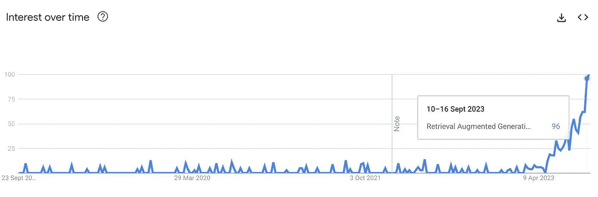
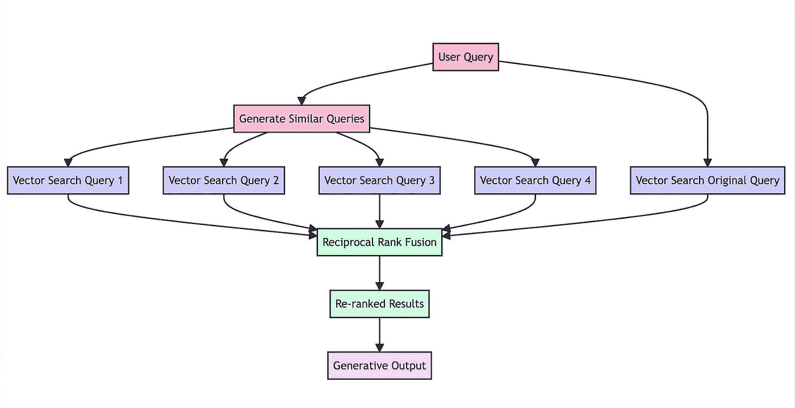
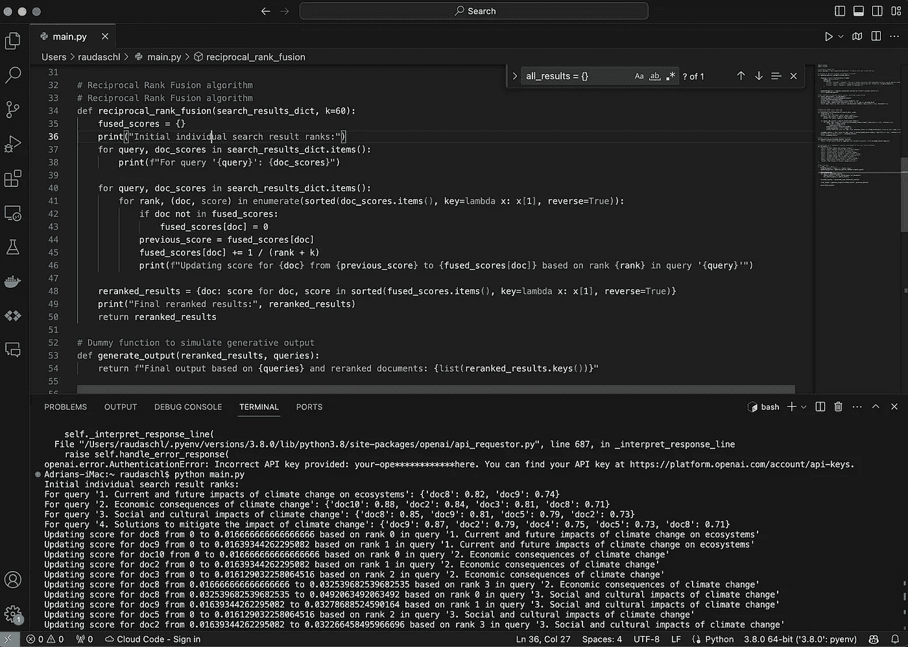
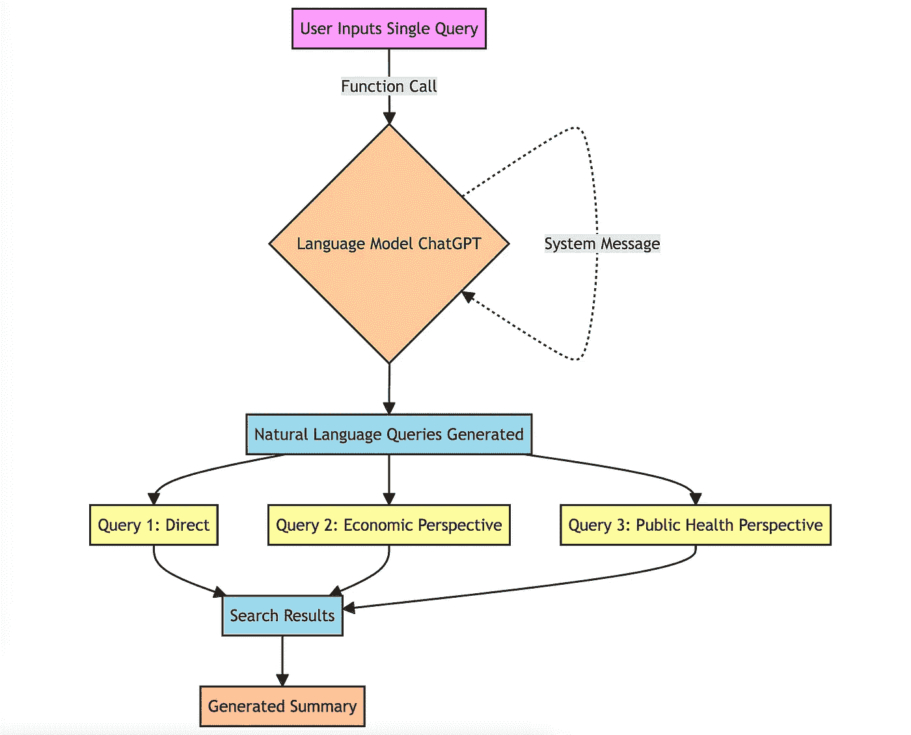
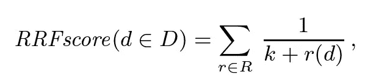
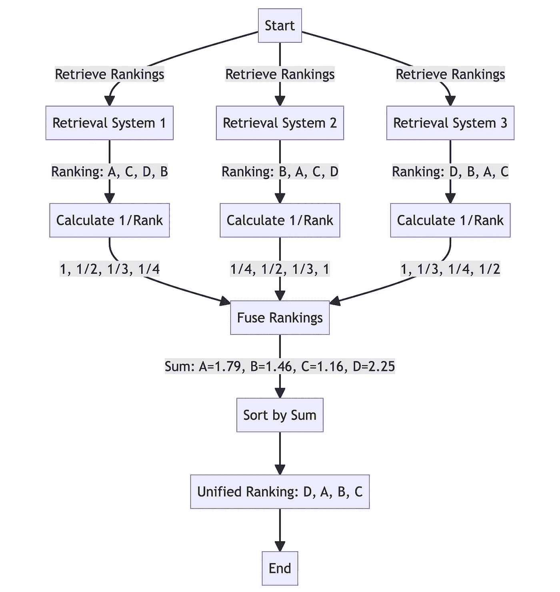

# 忘掉 RAG，未来是 RAG-Fusion

> 原文：[`towardsdatascience.com/forget-rag-the-future-is-rag-fusion-1147298d8ad1`](https://towardsdatascience.com/forget-rag-the-future-is-rag-fusion-1147298d8ad1)

## 搜索的下一前沿：检索增强生成遇上互惠排名融合和生成查询

 [Adrian H. Raudaschl](https://araudaschl.medium.com/?source=post_page-----1147298d8ad1--------------------------------)

·发表于 [Towards Data Science](https://towardsdatascience.com/?source=post_page-----1147298d8ad1--------------------------------) ·阅读时间 10 分钟·2023 年 10 月 6 日

--

RAG 融合的奇妙世界。图示由作者提供。

探索搜索技术近十年后，我可以诚实地说，没有什么比检索增强生成（RAG）的崛起更具颠覆性。这一系统通过使用生成 AI 的向量搜索来基于可信的数据生成直接答案，正在彻底改变搜索和信息检索。

在我的搜索项目中，实验使用 RAG 让我考虑了其潜在的增强功能；我相信 RAG 仍然过于有限，无法满足用户的需求，需要升级。

*我的个人搜索系统（Project Ramble），其中我在 2022 年将我的 Obsidian 笔记与 GPT-3 结合的向量搜索连接起来。图像由作者提供。*

别误解我的意思，RAG 非常出色，绝对是信息检索技术向正确方向迈进的一步。我自 2021 年 GPT-2 出现以来一直在使用 RAG，它在寻找有价值的信息时显著提高了我的生产力。RAG 有许多**优点**：

+   **向量搜索融合：** RAG 通过将向量搜索功能与生成模型结合，介绍了一种新颖的范式。这种融合使得从大型语言模型（LLM）生成更丰富、更具上下文感知的输出成为可能。

+   **减少幻觉：** RAG 显著减少了 LLM 的幻觉倾向，使生成的文本更加基于数据。

+   **个人和职业效用：** 从个人应用如筛选笔记到更专业的集成，RAG 展示了提升生产力和内容质量的多功能性，同时基于可信的数据源。

然而，我发现 RAG 有越来越多的**局限性**：

+   **当前搜索技术的限制：** RAG 受到与我们检索基础的词汇和向量搜索技术相同的限制。

+   **人工搜索的低效：** 人们在将他们想要的内容输入搜索系统时表现不佳，如拼写错误、模糊查询或词汇有限，这往往导致错过那些隐藏在明显顶级搜索结果之外的大量信息。虽然 RAG 提供了帮助，但并未完全解决这个问题。

+   **搜索的过度简化：** 我们现有的搜索范式将查询线性映射到答案，缺乏理解人类查询多维特性的深度。这种线性模型通常无法捕捉更复杂用户询问的细微差别和背景，导致结果相关性较低。

*2023 年 RAG（检索增强生成）的搜索激增。截图由作者提供，来源于 2023 年 9 月 Google Trends。*

那么，我们能做些什么来解决这些问题呢？我们需要一个不仅能检索我们所问内容，还能理解我们查询背后细微差别的系统，而不必依赖越来越高级的 LLM。认识到这些挑战，并受到可能性的启发，我开发了一个更精细的解决方案：RAG-Fusion。

**为什么选择 RAG-Fusion？**

+   **填补空白：** 通过生成多个用户查询并重新排名结果，解决 RAG 固有的局限性。

+   **增强搜索：** 利用互惠排序融合和自定义向量分数加权，以获取全面、准确的结果。

RAG-Fusion 致力于弥合用户明确询问的内容与他们实际意图之间的差距，逐步揭示那些通常隐藏的变革性知识。

多年前开始这段旅程时，我遗憾未能分享那些初期实验。但现在是时候弥补了。让我们深入探讨 RAG-Fusion 的技术细节。

# 深入探讨 RAG-Fusion 的机制

## 工具和技术栈

供那些只想查看代码并直接玩 RAG-Fusion 的人，[请查看这里的 GitHub 仓库](https://github.com/Raudaschl/rag-fusion)。

RAG Fusion 的基础三要素与 RAG 相似，涉及相同的三项关键技术：

+   一种通用编程语言，通常是 Python。

+   一个专用的向量搜索数据库，如 Elasticsearch 或 Pinecone，指导文档检索。

+   一个强大的大型语言模型，如 ChatGPT，用于生成文本。

RAG-Fusion 工作机制的示意图。图像由作者提供。

然而，与 RAG 不同，RAG-Fusion 通过几个额外步骤——查询生成和结果的重新排序，来区分自己。

**RAG-Fusion 的工作流程：**

1.  **查询复制的新方法：** 通过 LLM 将用户的查询转换为类似但又不同的查询。

1.  **向量搜索的释放：** 执行对原始查询及其新生成的查询兄弟的向量搜索。

1.  **智能重新排序：** 使用互惠排名融合方法汇总和优化所有结果。

1.  **优雅的结局：** 将精心挑选的结果与新的查询配对，引导大型语言模型生成考虑所有查询和重新排序结果列表的输出。

RAG-Fusion 代码 [示例](https://github.com/Raudaschl/rag-fusion)。图像来源于作者。

让我们更详细地了解这些步骤。

## 多查询生成

**为什么使用多个查询？**

在传统的搜索系统中，用户通常输入一个查询来寻找信息。虽然这种方法简单直接，但它也有其局限性。单一的查询可能无法捕捉用户感兴趣的全部范围，或者可能过于狭窄，导致结果不全面。这时，从不同角度生成多个查询就显得尤为重要。

**技术实施（提示工程）**

多查询生成的流程图：利用提示工程和自然语言模型来扩展搜索视野并提升结果质量。图像来源于作者。

使用提示工程来生成多个不仅与原始查询相似而且提供不同角度或视角的查询至关重要。

工作原理如下：

1.  **调用语言模型：** 这个方法调用了一个语言模型（在这里是 chatGPT）。这种方法需要一组特定的指令，通常被称为“系统消息”，以指导模型。例如，这里的系统消息指示模型作为“AI 助手”进行操作。

1.  **自然语言查询：** 模型根据原始查询生成多个查询。

1.  **多样性和覆盖范围：** 这些查询不仅仅是随机变体。它们经过精心生成，以提供原始问题的不同视角。例如，如果原始查询是关于“气候变化的影响”，生成的查询可能包括“气候变化的经济后果”、“气候变化与公共健康”等角度。

这种方法确保了搜索过程考虑了更广泛的信息，从而提高了生成总结的质量和深度。

## 互惠排名融合（RRF）

**为什么使用 RRF？**

互惠排名融合（RRF）是一种将多个搜索结果列表的排名结合起来以生成单一统一排名的技术。[与滑铁卢大学（加拿大）和 Google 合作开发](https://plg.uwaterloo.ca/~gvcormac/cormacksigir09-rrf.pdf)，RRF 的作者表示，“比任何单独系统产生的结果更好，比标准的重新排序方法更好”。

RRF 算法，其中 k=60。图像来自 — [互惠排名融合优于 Condorcet 和单独的排名学习方法](https://plg.uwaterloo.ca/~gvcormac/cormacksigir09-rrf.pdf)

通过结合来自不同查询的排名，我们增加了最相关文档出现在最终列表顶部的机会。RRF 特别有效，因为它不依赖于搜索引擎分配的绝对分数，而是依赖于相对排名，使其特别适合结合来自可能具有不同规模或分数分布的查询的结果。

通常，RRF 已被用于混合词汇和向量结果。尽管这种方法可以弥补向量搜索在查找特定术语（如首字母缩略词）时的特异性不足，但我对结果并不满意，因为结果往往更像是多个结果集的拼凑，因为相同的查询很少在词汇和向量搜索中得到相同的结果。

可以把 RRF 想象成那个在做决定前坚持听取每个人意见的人。只不过在这种情况下，它并不令人烦恼，而是有帮助的。更多的意见更好——在这种情况下，更准确。

**技术实施**

互惠排序融合位置重新排序系统。图片来源于作者。

函数 `reciprocal_rank_fusion` 接受一个搜索结果字典，每个键是一个查询，相应的值是按其与该查询的相关性排序的文档 ID 列表。然后，RRF 算法基于文档在不同列表中的排名计算一个新的分数，并对其进行排序，以创建最终的重新排名列表。

在计算融合分数后，该函数按这些分数的降序对文档进行排序，以获得最终的重新排名列表，然后返回。

## 生成输出

**用户意图保留**

使用多个查询的挑战之一是可能会稀释用户的原始意图。为了缓解这一点，我们指示模型在提示工程中给予原始查询更多权重。

**技术实施**

最后，重新排名的文档和所有查询被输入到一个 LLM 提示中，以典型的 RAG 方式生成输出，例如请求回应或摘要。

通过层叠这些技术和方法，RAG Fusion 提供了一种强大且细致的文本生成方法。它利用搜索技术和生成 AI 的最佳优势，产生高质量、可靠的输出。

# RAG-Fusion 的优缺点

## 优势

**1\. 优越的源材料质量**

使用 RAG Fusion 时，你的搜索深度不仅仅是‘增强’了——它被放大了。重新排名的相关文档列表意味着你不仅仅是在表面获取信息，而是深入到各种观点的海洋中。结构化的输出更易读，感觉直观上更值得信赖，这在一个对 AI 生成内容持怀疑态度的世界中至关重要。

**2\. 增强的用户意图对齐**

从根本上说，RAG Fusion 设计为一种富有同理心的人工智能，它能够揭示用户努力表达但可能无法清晰表达的内容。利用多查询策略捕捉用户信息需求的多方面表现，从而提供全面的输出，与用户意图产生共鸣。

**3\. 结构化、深刻的输出**

通过从多样化的来源汲取信息，模型可以提供组织良好且深刻的回答，预见后续问题并预先解决它们。

**4\. 自动更正用户查询**

系统不仅能够解读，还能优化用户查询。通过生成多个查询变体，RAG Fusion 执行隐式的拼写和语法检查，从而提高搜索结果的准确性。

**5\. 处理复杂查询**

人类语言在表达复杂或专业思想时常常会有所欠缺。系统作为语言催化剂，生成可能包含所需术语或专有名词的变体，以获得更具针对性和相关性的搜索结果。它还可以将更长、更复杂的查询拆解成更小、更易处理的部分，用于向量搜索。

**6\. 搜索中的意外发现**

考虑“未知的未知”——你不知道自己需要的信息，直到你遇到它。RAG Fusion 允许这种意外发现。通过采用更广泛的查询范围，系统增加了发现信息的可能性，虽然这些信息并非明确寻求，但会成为用户的灵光一现。这使得 RAG Fusion 与其他传统搜索模型有所不同。

## 挑战

**1\. 过于冗长的风险**

RAG-Fusion 的深度有时会导致信息泛滥。输出可能详细到让人不堪重负。可以把 RAG-Fusion 想象成那个喜欢过度解释的朋友——信息丰富，但有时你可能希望他们直接切入重点。

**2\. 平衡上下文窗口**

包括多查询输入和多样化文档集可能会对语言模型的上下文窗口造成压力。想象一个舞台上挤满了演员，使得跟随剧情变得困难。对于上下文约束严格的模型，这可能导致输出不连贯甚至被截断。

# 道德与用户体验考量

大权在握带来大责任。使用 RAG Fusion 的强大能力来操控用户查询以改进结果，感觉像是跨越了一些道德灰色地带。平衡改善搜索结果与用户意图的完整性至关重要，我有一些你在实施此解决方案时应考虑的想法：

## 道德问题：

+   **用户自主性：** 操控用户查询有时可能偏离原意。必须考虑我们将多少控制权交给 AI，以及付出的代价。

+   **透明度：** 这不仅仅是关于更好的结果；用户应当知道他们的查询是否以及如何被调整。这种透明度对维持信任和尊重用户意图至关重要。

## 用户体验（UX）提升：

+   **保留原始查询：** RAG 融合优先考虑最初的用户查询，确保其在生成过程中的重要性。这是防止误解的一种保护措施。

+   **过程可见性：** 显示生成的查询和最终结果可以让用户透明地看到搜索的范围和深度。这有助于建立信任和理解。

## UX/UI 实施技巧：

+   **用户控制：** 提供用户一个选项来切换 RAG 融合，使他们可以在手动控制和增强 AI 辅助之间进行选择。

+   **指导与清晰度：** 一个关于 RAG 融合工作原理的工具提示或简要说明可以帮助设定明确的用户期望。

如果要概括 RAG 融合的价值，那就是：它使我们更接近于 AI 本应做到的目标——增强人类潜力。

RAG 融合不仅仅是一个进步；它是对所有创新者的号召。它促使我们超越传统框架，重新构想“搜索”的全景。

对于搜索领域的从业者，我提出一个挑战：让我们不仅仅创建搜索系统，而是设计查询的解读者。

希望 RAG-Fusion 能激励你与我一起接受这个挑战。

深入了解[GitHub 仓库](https://github.com/Raudaschl/rag-fusion)，亲自动手实践代码，加入这场革命。

> 你必须从客户体验开始，然后逆向思考技术。—— 史蒂夫·乔布斯

## 参考文献

+   如果你想深入了解这个话题，我强烈推荐阅读 Trey Grainger、Doug Turnbull 和 Max Irwin 合著的《[AI-Powered Search](https://www.manning.com/books/ai-powered-search)》。
