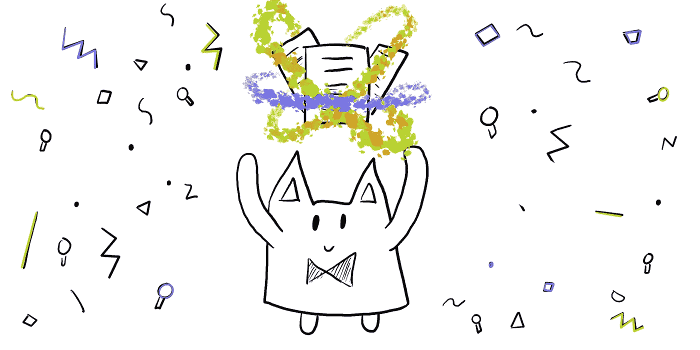
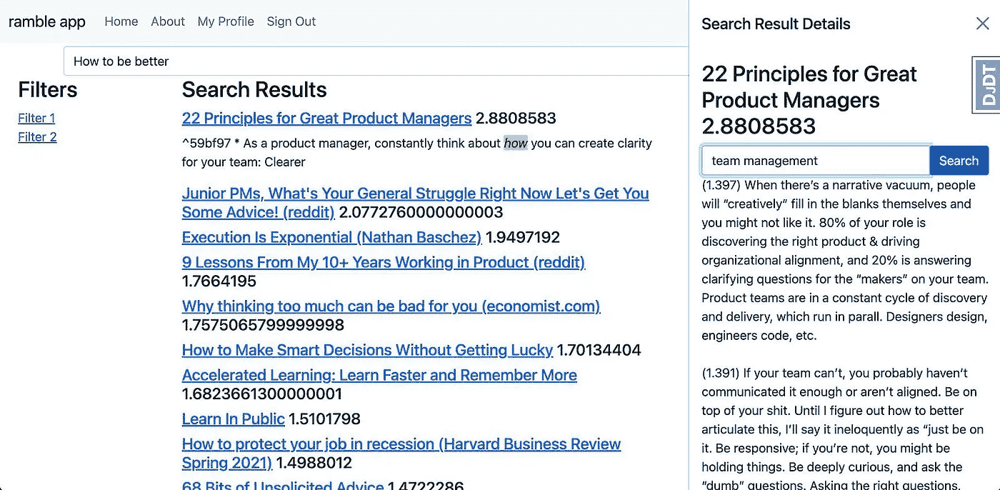

# 忘记 RAG 吧，未来是 RAG 融合

> 原文：[`towardsdatascience.com/forget-rag-the-future-is-rag-fusion-1147298d8ad1?source=collection_archive---------0-----------------------#2023-10-06`](https://towardsdatascience.com/forget-rag-the-future-is-rag-fusion-1147298d8ad1?source=collection_archive---------0-----------------------#2023-10-06)

## 搜索的下一个前沿：检索增强生成遇见互惠排序融合与生成查询

 [Adrian H. Raudaschl](https://araudaschl.medium.com/?source=post_page-----1147298d8ad1--------------------------------)

·

[关注](https://medium.com/m/signin?actionUrl=https%3A%2F%2Fmedium.com%2F_%2Fsubscribe%2Fuser%2F921c5fccdb85&operation=register&redirect=https%3A%2F%2Ftowardsdatascience.com%2Fforget-rag-the-future-is-rag-fusion-1147298d8ad1&user=Adrian+H.+Raudaschl&userId=921c5fccdb85&source=post_page-921c5fccdb85----1147298d8ad1---------------------post_header-----------) 发表在 [Towards Data Science](https://towardsdatascience.com/?source=post_page-----1147298d8ad1--------------------------------) ·10 min read·2023 年 10 月 6 日

--

RAG 融合的奇妙世界。作者插图。

在探索搜索技术近十年之后，我可以诚实地说，没有什么比最近兴起的**检索增强生成（RAG）**更具颠覆性了。该系统通过使用生成式 AI 的向量搜索来直接基于可信数据生成答案，从而彻底改变了搜索和信息检索方式。

在我的搜索项目中，实验 RAG 让我考虑到它的潜在增强；我认为 RAG 仍然过于有限，无法满足用户需求，需要升级。

*我的个人搜索系统（Ramble 项目），我将我的 Obsidian 笔记与 2022 年结合了 GPT-3 的向量搜索系统。图片由作者提供。*

别误会，RAG 非常出色，绝对是信息检索技术的正确方向。我自 2021 年 GPT-2 问世以来就一直使用 RAG，这大大提高了我在查找有价值的信息时的工作效率，无论是从我的笔记还是工作文档中。RAG 有许多**优点**：

+   **向量搜索融合：** RAG 通过将向量搜索功能与生成模型结合，提出了一种新颖的范式。这种融合使得…
