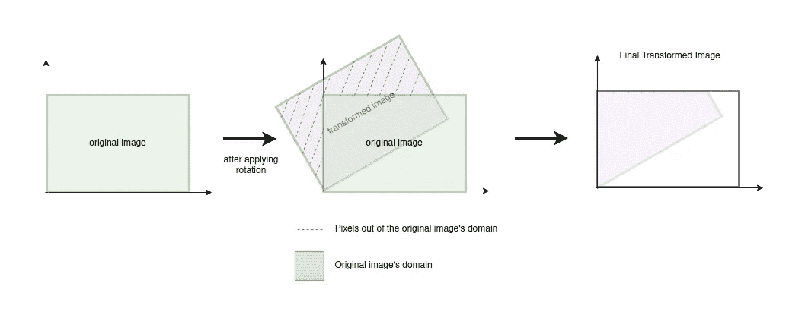
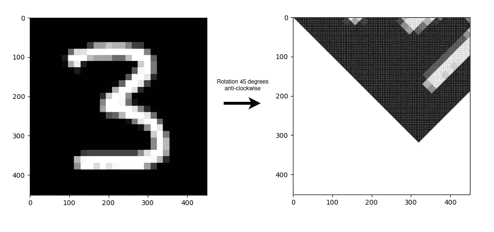
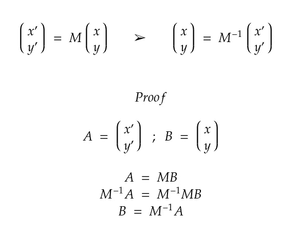
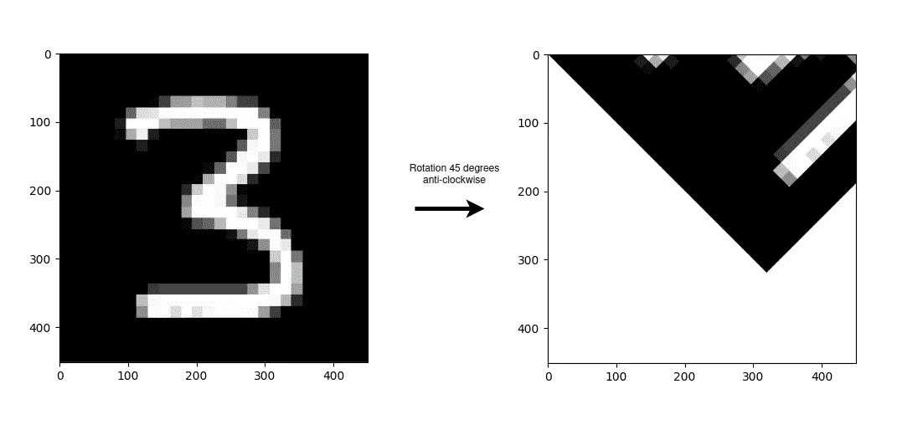

# 计算机视觉中的前向映射和后向映射

> 原文：[`towardsdatascience.com/forward-and-backward-mapping-for-computer-vision-833436e2472`](https://towardsdatascience.com/forward-and-backward-mapping-for-computer-vision-833436e2472)

## 前向映射和后向映射在图像变换中的应用

[](https://medium.com/@JavierMtz5?source=post_page-----833436e2472--------------------------------)[](https://towardsdatascience.com/?source=post_page-----833436e2472--------------------------------) [哈维尔·马丁内斯·奥赫达](https://medium.com/@JavierMtz5?source=post_page-----833436e2472--------------------------------)

·发表于[Towards Data Science](https://towardsdatascience.com/?source=post_page-----833436e2472--------------------------------) ·阅读时间 8 分钟·2023 年 5 月 25 日

--


照片由[Vadim Bogulov](https://unsplash.com/@franku84?utm_source=medium&utm_medium=referral)拍摄，来源于[Unsplash](https://unsplash.com/?utm_source=medium&utm_medium=referral)

> 如果你想在没有 Premium Medium 账户的情况下阅读本文，可以通过这个好友链接访问 :)
> 
> [`www.learnml.wiki/forward-and-backward-mapping-for-computer-vision/`](https://www.learnml.wiki/forward-and-backward-mapping-for-computer-vision/)

本文将介绍和解释两种图像扭曲算法：**前向映射**和**后向映射**。除了在理论层面介绍这些算法之外，还将它们应用于实际图像，以查看每种算法的结果和能力。

为了充分理解本文解释的内容，需要熟悉 2D 变换矩阵，这些内容在[上一篇文章](https://medium.com/@JavierMtz5/2d-matrix-transformations-for-computer-vision-80b4a4f2120f)中进行了介绍和解释。

[](https://medium.com/@JavierMtz5/2d-matrix-transformations-for-computer-vision-80b4a4f2120f?source=post_page-----833436e2472--------------------------------) [## 2D 矩阵变换在计算机视觉中的应用

### 通过变换矩阵进行计算机视觉中的缩放、旋转和平移

medium.com](https://medium.com/@JavierMtz5/2d-matrix-transformations-for-computer-vision-80b4a4f2120f?source=post_page-----833436e2472--------------------------------)

# 介绍

如前一篇文章所示，对图像应用变换的方法是遍历图像的每个像素，并对每个像素单独应用变换。然而，在某些用例中，变换不能直接应用，例如，某些像素的新位置可能超出了图像范围。另一个可能的问题是新图像可能会有空白像素（白条），因为在变换后很难将原始图像的所有像素映射到新图像的所有像素。

为了避免这些问题，本文将介绍的两个算法，**前向映射**和**后向映射**，采用了不同的技术来正确转换图像。

# 前向映射

前向映射过程包括在引言和上一篇文章中讨论的简单图像变换过程：它遍历图像的所有像素，并对每个像素单独应用相应的变换。然而，必须考虑到那些变换后像素的新位置超出图像范围的情况，如下例所示。



转换后的图像像素超出了原始图像的范围。**图像由作者提供**

要执行前向映射过程，首先定义一个函数，该函数以像素的原始坐标作为参数。这个函数会对原始像素坐标应用转换，并返回转换后的新坐标。以下代码示例展示了旋转变换的函数。

```py
def apply_transformation(original_x: int, original_y: int) -> Tuple[int, int]:
    # Define the rotation matrix   
    rotate_transformation = np.array([[np.cos(np.pi/4), -np.sin(np.pi/4), 0],
                                      [np.sin(np.pi/4),  np.cos(np.pi/4), 0],
                                      [0, 0, 1]])
    # Apply transformation after setting homogenous coordinate to 1 for the original vector.
    new_coordinates = rotate_transformation @ np.array([original_x, original_y, 1]).T
    # Round the new coordinates to the nearest pixel   
    return int(np.rint(new_coordinates[0])), int(np.rint(new_coordinates[1]))
```

一旦你拥有这个函数，你只需遍历图像的每个像素，应用变换，并检查新像素坐标是否在原始图像的范围内。如果新坐标在范围内，新图像的新坐标上的像素将采用原始图像中原始像素的值。如果超出图像范围，该像素将被忽略。

```py
def forward_mapping(original_image: np.ndarray) -> np.ndarray:
    # Create the new image with same shape as the original one
    new_image = np.zeros_like(original_image)
    for original_y in range(original_image.shape[1]):
        for original_x in range(original_image.shape[0]):
            # Apply rotation on the original pixel's coordinates
            new_x, new_y = apply_transformation(original_x, original_y)
            # Check if new coordinates fall inside the image's domain
            if 0 <= new_y < new_image.shape[1] and 0 <= new_x < new_image.shape[0]:
                new_image[new_x, new_y, :] = original_image[original_x, original_y, :]

    return new_image
```

旋转变换应用前向映射的结果可以在下图中看到，左侧是原始图像，右侧是转换后的图像。需要注意的是，对于这张图像，坐标原点在左上角，因此图像围绕该点逆时针旋转。



应用前向映射的结果。**左图摘自 MNIST 数据集 [1]。完整图像由作者提供**

关于变换结果，可以看到变换后的图像不像原始图像那样有完全黑色的背景，而是有许多白色条纹。正如引言中提到的，这种情况发生是因为原始图像的像素并不总是映射到新图像的所有像素上。由于新坐标是通过四舍五入到最近的像素计算的，这导致许多中间像素没有获得值。在这种情况下，由于新图像初始化时所有像素为空，因此在变换过程中没有赋值的像素将保持为空，生成了变换图像中的白色条纹。

此外，还应注意另一个显著问题：重叠。当原始图像的两个像素被变换到新图像的同一像素时，就会出现这个问题。对于本文使用的代码，如果有两个原始图像的像素映射到新图像的同一像素，新像素将取最后一个已变换的原始像素的值，覆盖第一个已设置的值。

# 反向映射

反向映射算法产生的原因是需要消除由于变换而在图像中生成的白色条纹以及可能的重叠。正如前面所提到的，这些条纹出现的原因是由于在前向映射过程中计算新坐标时四舍五入的缘故，导致不是所有的变换图像像素都有值，而重叠发生在原始图像的两个或多个像素映射到新图像的同一像素时。

这个算法背后的逻辑很简单：不是将原始图像的每个像素转换到新图像中的新坐标（前向），而是将新图像中的所有像素逆向转换到原始图像的像素（反向）。这样，新图像中就不会有没有值的像素，因为它们都会采用原始图像中单个像素的值，从而解决了两个问题。

幸运的是，使用变换矩阵对像素坐标进行的变换可以通过应用逆变换矩阵来撤销。变换矩阵的这个属性以及其证明可以在下图中看到。



使用逆变换矩阵的变换及证明。**作者提供的图像**

考虑到这一属性，算法的组成包括对新图像的每个像素进行迭代，并对每个像素的坐标应用逆变换，以知道它们需要从原始图像的哪个像素获取值。

```py
def apply_inverse_transformation(new_x: int, new_y: int) -> Tuple[int, int]:
    # Define the inverse rotation matrix
    rotate_transformation = np.array([[np.cos(np.pi/4), -np.sin(np.pi/4), 0],
                                      [np.sin(np.pi/4),  np.cos(np.pi/4), 0],
                                      [0, 0, 1]])
    inverse_rotate_transformation = np.linalg.inv(rotate_transformation)

    # Apply transformation after setting homogenous coordinate to 1 for the position vector.
    original_coordinates = inverse_rotate_transformation @ np.array([new_x, new_y, 1]).T
    # Round the original coordinates to the nearest pixel
    return int(np.rint(original_coordinates[0])), int(np.rint(original_coordinates[1]))
```

注意，***apply_inverse_transformation()*** 函数接受新图像中的坐标作为输入，并返回原始图像中的坐标，而不是像正向映射那样接受原始坐标并返回新坐标。

```py
def backward_mapping(original_image: np.ndarray) -> np.ndarray:
    # Create the new image with same shape as the original one
    new_image = np.zeros_like(original_image)
    for new_y in range(new_image.shape[1]):
        for new_x in range(new_image.shape[0]):
            # Apply inverse rotation on the new pixel's coordinates
            original_x, original_y = apply_inverse_transformation(new_x, new_y)
            # Check if original coordinates fall inside the image's domain
            if 0 <= original_y < original_image.shape[1] and 0 <= original_x < original_image.shape[0]:
                new_image[new_x, new_y, :] = original_image[original_x, original_y, :]

    return new_image
```

应用反向映射的旋转变换结果可以在下图中看到，左侧是原始图像，右侧是变换后的图像。如前所述，图像围绕坐标原点旋转，坐标原点位于左上角。



反向映射的应用结果。**左侧图像摘自 MNIST 数据集 [1]。完整图像由作者提供**

在图像中你可以看到，应用正向映射时出现的那些白色条纹，在应用反向映射时都消失了。实际上，你可以看到变换后的图像质量相当好（我们必须考虑到原始图像的质量不是很高），因此我们可以认为，在出现白色条纹的情况下，反向映射算法明显优于正向映射。

# 结论

正向映射是一个简单易实现且易于理解的算法，因为它直接将原始图像的每个像素转换到新图像。然而，该算法存在重叠问题以及留下一些像素没有值的问题，这些问题会显著降低变换图像的质量。反向映射算法，其实现与正向映射一样简单，结果要好得多，并且解决了这两个问题，因为它为新图像的所有像素提供了一个唯一的值。

关于算法的执行时间，两者具有相同的复杂度，因此一般来说，使用反向映射算法通常是一个更好的选择，因为它的结果更佳。在理想情况下，负责对每个像素应用个体变换的函数（在本文中称为***apply_transformation()***和***apply_inverse_transformation()***）不会构造变换矩阵，而是将其作为参数传入。这将节省正向映射算法构建变换矩阵所需的执行时间，同时也节省反向映射算法构建和反转矩阵的时间。

总之，反向映射算法相比于正向映射算法取得了非常好的结果，两者的执行时间几乎相同。然而，需要注意的是，两种算法都需要较长时间来处理高分辨率图像，尽管如此，它们仍然非常有用，为构建其他更强大的变换算法奠定了基础。

# 数据

本文中使用的图像摘自 MNIST 数据集 **[1]**。该数据集在[创作共用署名-相同方式共享 3.0 许可协议](https://creativecommons.org/licenses/by-sa/3.0/)下提供。

# 参考资料

**[1]** [`yann.lecun.com/exdb/mnist/`](http://yann.lecun.com/exdb/mnist/)
