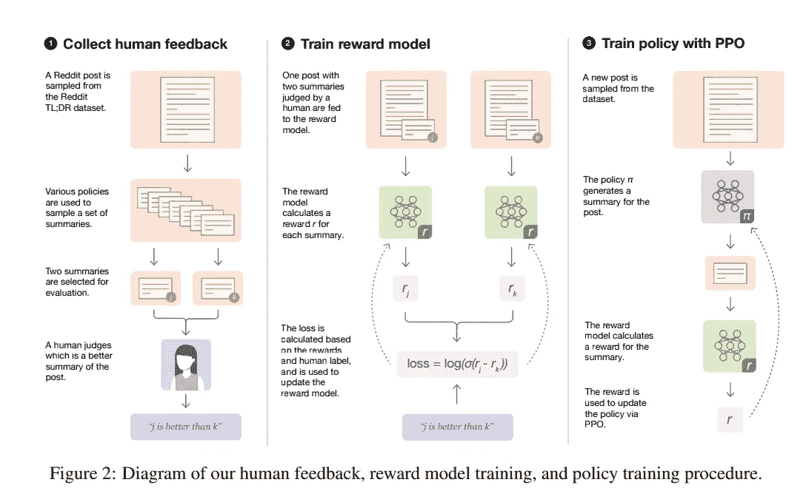
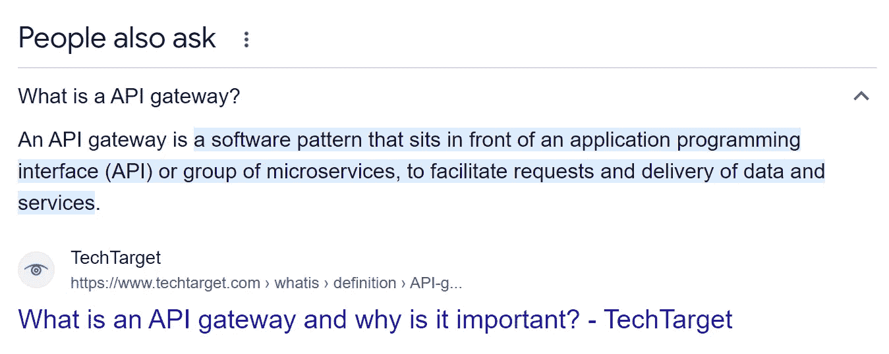

# 四种构建在生成式人工智能基础模型之上的方法

> 原文：[`towardsdatascience.com/four-approaches-to-build-on-top-of-generative-ai-foundational-models-43c1a64cffd5?source=collection_archive---------1-----------------------#2023-03-21`](https://towardsdatascience.com/four-approaches-to-build-on-top-of-generative-ai-foundational-models-43c1a64cffd5?source=collection_archive---------1-----------------------#2023-03-21)

## 每种方法的优缺点、有效性以及示例代码

[](https://lakshmanok.medium.com/?source=post_page-----43c1a64cffd5--------------------------------)[](https://towardsdatascience.com/?source=post_page-----43c1a64cffd5--------------------------------) [Lak Lakshmanan](https://lakshmanok.medium.com/?source=post_page-----43c1a64cffd5--------------------------------)

·

[关注](https://medium.com/m/signin?actionUrl=https%3A%2F%2Fmedium.com%2F_%2Fsubscribe%2Fuser%2F247b0630b5d6&operation=register&redirect=https%3A%2F%2Ftowardsdatascience.com%2Ffour-approaches-to-build-on-top-of-generative-ai-foundational-models-43c1a64cffd5&user=Lak+Lakshmanan&userId=247b0630b5d6&source=post_page-247b0630b5d6----43c1a64cffd5---------------------post_header-----------) 发表在 [Towards Data Science](https://towardsdatascience.com/?source=post_page-----43c1a64cffd5--------------------------------) · 11 分钟阅读 · 2023 年 3 月 21 日[](https://medium.com/m/signin?actionUrl=https%3A%2F%2Fmedium.com%2F_%2Fvote%2Ftowards-data-science%2F43c1a64cffd5&operation=register&redirect=https%3A%2F%2Ftowardsdatascience.com%2Ffour-approaches-to-build-on-top-of-generative-ai-foundational-models-43c1a64cffd5&user=Lak+Lakshmanan&userId=247b0630b5d6&source=-----43c1a64cffd5---------------------clap_footer-----------)

--

[](https://medium.com/m/signin?actionUrl=https%3A%2F%2Fmedium.com%2F_%2Fbookmark%2Fp%2F43c1a64cffd5&operation=register&redirect=https%3A%2F%2Ftowardsdatascience.com%2Ffour-approaches-to-build-on-top-of-generative-ai-foundational-models-43c1a64cffd5&source=-----43c1a64cffd5---------------------bookmark_footer-----------)

*如果我在这里使用的术语对你来说不熟悉，我鼓励你先阅读我的* [*关于大型语言模型的早期文章*](https://becominghuman.ai/why-large-language-models-like-chatgpt-are-bullshit-artists-c4d5bb850852) *。*

确实*有*团队在实际应用中使用 ChatGPT 或其竞争者（如 Anthropic、Google 的 Flan T5 或 PaLM、Meta 的 LLaMA、Cohere、AI21Labs 等），而不是仅仅用于炫酷的演示。不幸的是，关于他们如何做到这一点的信息在市场营销噱头和技术术语中被掩盖。因此，我看到刚开始接触生成式 AI 的人们采取了一些领域专家会告诉你不会奏效的方法。本文尝试组织这个领域并展示哪些方法有效。


图片由 [Sen](https://unsplash.com/es/@sen7?utm_source=unsplash&utm_medium=referral&utm_content=creditCopyText) 提供，来源于 [Unsplash](https://unsplash.com/s/photos/lego?utm_source=unsplash&utm_medium=referral&utm_content=creditCopyText)

## 要跨越的标准

许多关于生成式 AI 的炫酷演示和充满噱头的帖子存在的问题在于它们 [击中了训练数据集](https://aisnakeoil.substack.com/p/gpt-4-and-professional-benchmarks) ——它们并没有真正告诉你在应用于真实用户和实际新输入的混乱情况下效果如何。典型软件预计要达到 99% 以上的可靠性 ——例如，只有当语音识别技术在短语上跨越了这一准确度标准时，语音 AI 市场才得以起飞。自动字幕、翻译等情况也是如此。

我看到团队在其生产系统中解决这一问题有两种方式：

+   如果用户体验在他们已经预期需要纠正错误的情况下，人类用户会更宽容（这似乎是 GitHub Copilot 帮助的原因），或者如果它被定位为互动和有帮助但尚未准备好使用（如 ChatGPT、Bing Chat 等）。

+   目前，生成式 AI 的完全自动化应用大多处于受信测试阶段，是否能够真正达到这一标准仍有待观察。尽管如此，结果令人鼓舞，并且趋势向上发展，最终达到标准只是时间问题。

就个人而言，我一直在尝试 GPT 3.5 Turbo 和 Google Flan-T5，并针对特定的生产使用案例进行实验，并了解了许多有效和无效的方面。*我的*模型都没有跨越 99% 的标准。到写作时（2023 年 3 月），我也尚未获得 GPT-4 或 Google 的 PaLM API 的访问权限。我基于我的实验、已发布的研究和公开宣布的项目撰写了这篇文章。

在所有生成式 AI 的应用中，牢记预训练模型是基于互联网内容进行训练的，并可能存在多种偏见。这些偏见在你的应用层面上要加以防范。

## 方法 1：直接使用 API

第一个方法是最简单的，因为许多用户通过 ChatGPT 提供的交互式界面遇到了 GPT。尝试各种提示直到得到你想要的输出似乎非常直观。这就是为什么你会看到许多 LinkedIn 影响者发布了 [适用于销售邮件的 ChatGPT 提示](https://www.linkedin.com/posts/mkosoglow_i-see-sdrs-aes-csms-and-execs-consistently-activity-7024033440933007360-CCmn) 或其他内容。

当涉及到自动化这个工作流时，自然的方法是使用服务的 [REST API 端点](https://platform.openai.com/docs/api-reference/completions/create) 并用最终有效的提示直接调用它：

```py
import os
import openai
openai.api_key = os.getenv("OPENAI_API_KEY")
openai.Edit.create(
  model="text-davinci-edit-001",
  input="It was so great to meet you .... ",
  instruction="Summarize the text below in the form of an email that is 5 sentences or less."
)
```

然而，这种方法不适合操作化。原因有几个：

1.  **脆弱性**。底层模型持续改进。部署模型的突然变化 [破坏了](https://twitter.com/rishdotblog/status/1626273042472271872) 许多生产工作负载，人们从这些经验中学到了很多。机器学习工作负载已经很脆弱了；在特定模型的提示中添加额外的失败点是不明智的。

1.  **注入**。像上述示例中那样，指令和输入通常不是简单的字符串。它们大多包括来自用户的变量。这些变量必须被纳入提示和输入中。正如任何程序员所知道的那样，通过字符串连接进行注入充满了安全问题。当你这样做时，你将自己置于生成式 AI API 周围的保护措施的摆布之下。像防御 SQL 注入一样，使用一个处理变量注入的 API 更为妥当。

1.  **多个提示**。很少能在一次尝试中让一个提示奏效。更常见的做法是向模型发送多个提示，并让模型根据这些提示修改其输出。这些提示本身可能会在工作流中嵌入一些人工输入（例如后续输入）。提示提供一些期望输出的示例（称为少量示例学习）也是很常见的。

解决这三个问题的一种方法是使用 langchain。

## 方法二：使用 langchain

Langchain 正迅速成为一个首选库，允许你调用来自不同供应商的 LLM，处理变量注入，并进行少量示例训练。 [这是一个使用 langchain 的示例](https://langchain.readthedocs.io/en/latest/modules/prompts/examples/few_shot_examples.html)：

```py
from langchain.prompts.few_shot import FewShotPromptTemplate

examples = [
  {
    "question": "Who lived longer, Muhammad Ali or Alan Turing?",
    "answer": 
"""
Are follow up questions needed here: Yes.
Follow up: How old was Muhammad Ali when he died?
Intermediate answer: Muhammad Ali was 74 years old when he died.
Follow up: How old was Alan Turing when he died?
Intermediate answer: Alan Turing was 41 years old when he died.
So the final answer is: Muhammad Ali
"""
  },
  {
    "question": "When was the founder of craigslist born?",
    "answer": 
"""
Are follow up questions needed here: Yes.
Follow up: Who was the founder of craigslist?
Intermediate answer: Craigslist was founded by Craig Newmark.
Follow up: When was Craig Newmark born?
Intermediate answer: Craig Newmark was born on December 6, 1952.
So the final answer is: December 6, 1952
"""
...
]

example_prompt = PromptTemplate(input_variables=["question", "answer"], 
                                template="Question: {question}\n{answer}")

prompt = FewShotPromptTemplate(
    examples=examples, 
    example_prompt=example_prompt, 
    suffix="Question: {input}", 
    input_variables=["input"]
)

print(prompt.format(input="Who was the father of Mary Ball Washington?"))
```

我强烈推荐使用 langchain 而不是直接使用供应商的 API。然后，确保你所做的一切与至少两个 API 兼容，或者使用一个不会在你使用期间改变的 LLM 检查点。这两种方法都能避免你的提示/代码对底层 LLM 的变化过于脆弱。（这里，我使用 API 指代一个托管的 LLM 端点）。

Langchain 目前 [支持来自](https://langchain.readthedocs.io/en/latest/reference/integrations.html) Open AI、Cohere、HuggingFace Hub（因此包括 Google Flan-T5）等的 API，以及 [来自](https://langchain.readthedocs.io/en/latest/reference/modules/llms.html) AI21、Anthropic、Open AI、HuggingFace Hub 等的 LLM。

## 方法 3：微调生成 AI 链

这是前沿的方法，因为这是我看到大多数复杂生成 AI 生产应用程序所使用的方法。仅举一个例子（并非 endorsement），[微调就是](https://techcrunch.com/2023/03/20/numbers-station-raises-17-5m-to-bring-ai-to-your-data-stack/) 一家由斯坦福博士组成的初创公司如何接近像 SQL 生成和记录匹配这样的标准企业用例。

要理解这种方法背后的理由，了解支撑 ChatGPT（或其竞争者）的四个机器学习模型是有帮助的：

1.  大型语言模型（LLM）被训练以预测给定前一个词后的下一个词。它通过学习在大量文档中的词汇关联和模式来实现这一点。模型足够大，可以在不同的上下文中学习这些模式。

1.  基于人类反馈的强化学习模型（RL-HF）通过向人类展示生成的文本示例，并要求他们批准令人愉悦的文本来进行训练。之所以需要这样做，是因为 LLM 的输出是概率性的——它不会预测一个单一的下一个词，而是预测一组词，每个词都有一定的概率会出现。RL-HF 使用人类反馈来学习如何选择生成对人类有吸引力的文本的延续。

1.  指令模型是一个监督模型，通过显示提示（“生成一封向工程领导提议演示的销售邮件”）并在销售邮件的示例上训练模型来进行训练。

1.  上下文模型被训练以与用户进行对话，使他们能够通过连续的提示来制定输出。

此外，还有保护机制（对输入和输出的过滤器）。模型会拒绝回答某些类型的问题，并撤回某些答案。在实际应用中，这些都是不断更新的机器学习模型。



步骤 2：RL-HF 如何工作。图片来自 [Stiennon et al, 2020](https://proceedings.neurips.cc/paper/2020/file/1f89885d556929e98d3ef9b86448f951-Paper.pdf)

有一些开源生成 AI 模型（[Meta 的 LLaMA](https://ai.facebook.com/blog/large-language-model-llama-meta-ai/)，Google 的 [Flan-T5](https://ai.googleblog.com/2021/10/introducing-flan-more-generalizable.html)）允许您从上述任意步骤开始（例如，使用发布的检查点中的步骤 1-2，自行在您的数据上训练第 3 步，不执行第 4 步）。请注意，LLaMA 不允许商业使用，而 Flan-T5 已经有一年时间（因此您需要在质量上做出妥协）。了解每个阶段的成本/收益有助于您决定从哪里开始。

+   如果您的应用程序使用的术语和词汇非常不同，可能有必要从头开始在您的数据上构建一个 LLM（即，从第 1 步开始）。问题是您可能没有足够的数据，即使有足够的数据，训练成本也会很高（每次训练运行的费用在 300 万到 500 万美元之间）。这似乎是 Salesforce 对 [他们为开发人员使用的生成 AI](https://www.salesforce.com/news/press-releases/2023/03/07/einstein-generative-ai/) 所做的。

+   RL-HF 模型经过训练，旨在吸引那些可能不是主题专家或代表您自己用户的测试人员。如果您的应用程序需要主题专业知识，您可能更适合从 LLM 开始，然后从第 2 步分支出去。所需的数据集要小得多——Stiennon 等人在 2020 年使用了 125k 文档，并在每次迭代中为每个输入文档呈现一对输出（见图示）。因此，您需要人类标注者随时待命，以对约 100 万个输出进行评分。假设一个标注者需要 10 分钟来评分每对文档，那么每次训练的人工成本大约是 250 人月。我估计费用在 25 万美元到 200 万美元之间，具体取决于地点和技能水平。

+   ChatGPT 被训练来响应成千上万的不同提示。另一方面，您的应用程序可能只需要一两个特定的提示。将 Google Flan-T5 训练到您的特定指令和输入上可能会很方便。这样的模型可以更小（因此部署成本更低）。这种服务成本上的优势解释了为什么第 3 步是最常见的分支点。您可以使用 [HuggingFace](https://www.philschmid.de/fine-tune-flan-t5) 和/或 [Keras](https://keras.io/examples/nlp/t5_hf_summarization/) 对 Google Flan-T5 进行针对您特定任务的微调。您可以在常用的 ML 框架如 Databricks、Sagemaker 或 Vertex AI 上进行，并使用相同的服务来部署训练后的模型。由于 Flan-T5 是 Google 的模型，GCP 通过在 Vertex AI 中提供 [预构建容器](https://medium.com/google-cloud/finetuning-flan-t5-base-and-online-deployment-in-vertex-ai-bf099c3a4a86) 使训练和部署变得非常简单。费用可能在 50 美元左右。

+   理论上，有可能通过不同的方法来保持对话上下文。然而，我在实际应用中没有看到这种做法。大多数人做的是使用像 Dialogflow 这样的对话代理框架，它已经内置了 LLM，并为他们的应用设计一个定制的聊天机器人。基础设施成本微不足道，你只需要领域知识，无需任何 AI 专业知识。

可以在这些阶段中的任何一个进行中断。以下例子仅限于公开发布的医学研究：

1.  这篇[Nature 文章](https://www.nature.com/articles/s41746-022-00742-2)从从医学记录中提取的 90 亿字中构建了一个自定义的 89 亿参数 LLM（即，它们从第 1 步开始）。作为比较，下文第 3 种方法中使用的 Flan-PaLM 具有[5400 亿参数](https://huggingface.co/google/flan-t5-base)，而“小型/高效”PaLM 为 620 亿参数。显然，成本是定制语言模型变得更大的一个限制因素。

1.  这项[MIT CSAIL 研究](https://news.mit.edu/2022/large-language-models-help-decipher-clinical-notes-1201)要求模型严格遵循现有文本，并进行指令微调（即，它们从第 2 步开始）。

1.  [Deep Mind 的 MedPaLM](https://arxiv.org/abs/2212.13138)从一种指令调优的 PaLM 变体 Flan-PaLM 开始（即，它从第 3 步开始）。他们报告称，93%的医疗专业人员认为该 AI 的回答与人类回答相当。

我的建议是，根据你的应用领域与基础模型训练所用的通用互联网文本的差异，选择中断的位置。你应该微调哪个模型？目前，Google Flan T5 是最先进的可微调模型，且开放用于商业用途。对于非商业用途，Meta 的 LLaMA 是最先进的模型。

但需要注意的是：当你使用开源模型进行链式操作时，保护过滤器不会存在，因此**你需要设置毒性安全措施**。一个选项是使用[detoxify](https://github.com/unitaryai/detoxify)库。确保在生产环境中的任何 API 端点周围都实施毒性过滤，否则你会发现自己不得不[撤下它](https://www.theregister.com/2023/03/21/stanford_ai_alpaca_taken_offline/)。API 网关可以是确保你对所有 ML 模型端点进行此操作的便捷方式。

## 方法 4：简化问题

有一些聪明的方法可以重新定义你所解决的问题，以便可以使用生成式 AI 模型（如第 3 种方法），但避免出现幻觉等问题。

例如，假设你想做问答系统。你可以从一个强大的 LLM 开始，然后努力“驯服”这个“野兽”，使其不出现幻觉。一个更简单的方法是重新定义问题。将模型从一个预测输出文本的模型改为一个有三个输出的模型：文档的 URL、文档中的起始位置和文本长度。这就是谷歌搜索在这里做的：



谷歌的问答模型预测一个 URL、起始位置和文本长度。这避免了幻觉问题。

最糟糕的情况下，模型会显示不相关的文本。它不会出现幻觉，因为你不允许它真正预测文本。

一个 [遵循此方法的 Keras 示例](https://keras.io/examples/nlp/question_answering/) 将输入和上下文（你要在其中找到答案的文档）进行标记化：

```py
from transformers import AutoTokenizer

model_checkpoint = "google/flan-t5-small"
tokenizer = AutoTokenizer.from_pretrained(model_checkpoint)
...
examples["question"] = [q.lstrip() for q in examples["question"]]
examples["context"] = [c.lstrip() for c in examples["context"]]
tokenized_examples = tokenizer(
        examples["question"],
        examples["context"],
        ...
)
...
```

然后将这些令牌传递给一个 Keras 回归模型，其第一层是 Transformer 模型，该模型接收这些令牌并输出答案在“上下文”文本中的位置：

```py
from transformers import TFAutoModelForQuestionAnswering
import tensorflow as tf
from tensorflow import keras

model = TFAutoModelForQuestionAnswering.from_pretrained(model_checkpoint)
optimizer = keras.optimizers.Adam(learning_rate=5e-5)
model.compile(optimizer=optimizer)
model.fit(train_set, validation_data=validation_set, epochs=1)
```

在推理过程中，你会得到预测的位置：

```py
inputs = tokenizer([context], [question], return_tensors="np")
outputs = model(inputs)
start_position = tf.argmax(outputs.start_logits, axis=1)
end_position = tf.argmax(outputs.end_logits, axis=1)
```

你会注意到，样本并没有预测 URL——上下文假定是典型搜索查询的结果（例如由匹配引擎或向量数据库返回），样本模型只进行提取。然而，你可以通过在 Keras 中添加一个单独的层来将搜索功能也构建到模型中。

## 总结

我见到的四种在生成 AI 基础模型之上构建生产应用程序的方法：

1.  使用像 GPT-4 这样的全能模型的 REST API 进行单次提示。

1.  使用 langchain 来抽象化 LLM、输入注入、多轮对话和少样本学习。

1.  利用一组模型来对你的自定义数据进行微调，这些模型构成了一个端到端的生成 AI 模型。

1.  将问题重新定义为一种避免生成 AI（偏见、毒性、幻觉）风险的形式。

方法 #3 是我见过的最常被成熟团队使用的方法。
