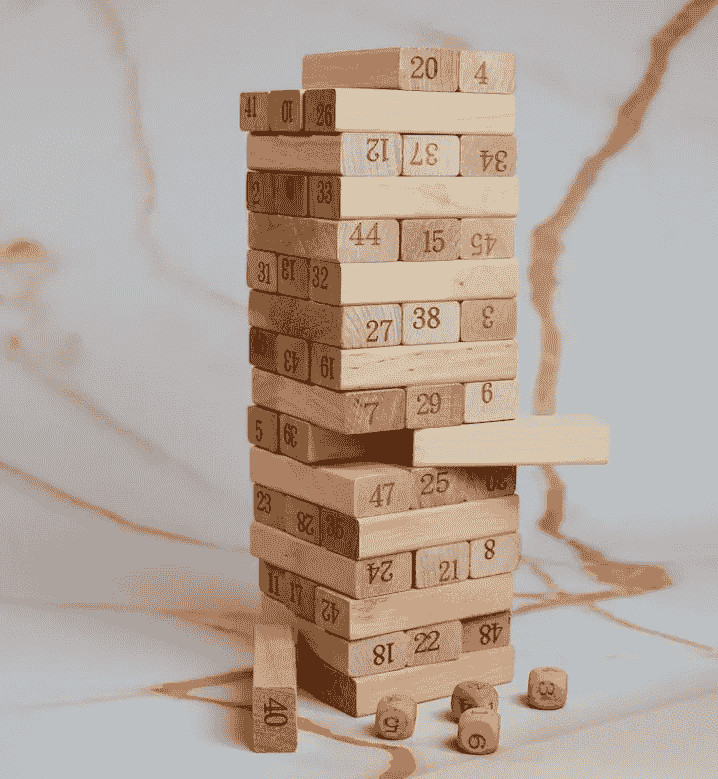

# A/B 测试中的四个常见错误及其解决方法

> 原文：[`towardsdatascience.com/four-common-mistakes-when-a-b-testing-and-how-to-solve-them-384072b57d75?source=collection_archive---------12-----------------------#2023-06-29`](https://towardsdatascience.com/four-common-mistakes-when-a-b-testing-and-how-to-solve-them-384072b57d75?source=collection_archive---------12-----------------------#2023-06-29)

## 提升您的 A/B 测试技能：解决四个关键错误以获得更好的结果

 [Terence Shin, MSc, MBA](https://terenceshin.medium.com/?source=post_page-----384072b57d75--------------------------------)

·

[关注](https://medium.com/m/signin?actionUrl=https%3A%2F%2Fmedium.com%2F_%2Fsubscribe%2Fuser%2F360a9d4d19ab&operation=register&redirect=https%3A%2F%2Ftowardsdatascience.com%2Ffour-common-mistakes-when-a-b-testing-and-how-to-solve-them-384072b57d75&user=Terence+Shin%2C+MSc%2C+MBA&userId=360a9d4d19ab&source=post_page-360a9d4d19ab----384072b57d75---------------------post_header-----------) 发表于 [Towards Data Science](https://towardsdatascience.com/?source=post_page-----384072b57d75--------------------------------) · 7 min read · 2023 年 6 月 29 日 

--

照片由 [Oscar Ivan Esquivel Arteaga](https://unsplash.com/@oscaresquivel?utm_source=unsplash&utm_medium=referral&utm_content=creditCopyText) 拍摄，来源于 [Unsplash](https://unsplash.com/photos/iT15xdxmLxw?utm_source=unsplash&utm_medium=referral&utm_content=creditCopyText)。

A/B 测试就像 Jenga 游戏，是一项复杂的实验基础，相互连接的各个部分构成了成功实验的基础。就像在 Jenga 游戏中，移除错误的块可能导致整个塔楼倒塌一样，A/B 测试也依赖于多个组件的协作。每个部分都代表了测试的一个关键元素，如果其中任何一个失败了，实验的完整性就会受到威胁，可能导致不准确的结果或错失机会。

在我的经验中，我曾看到许多优秀的实验创意因为一些非常常见的错误而崩溃，这些错误很多数据科学家都会犯，包括我自己！因此，我想和你分享 A/B 测试中最常见的四个错误（以及如何解决它们！）。

*如果你对 A/B 测试不太熟悉，并且你有兴趣追求数据科学领域的职业，我强烈建议你至少了解一下这个概念。*

*如果你想了解 A/B 测试的基础知识，可以查看我下面的内容：*
