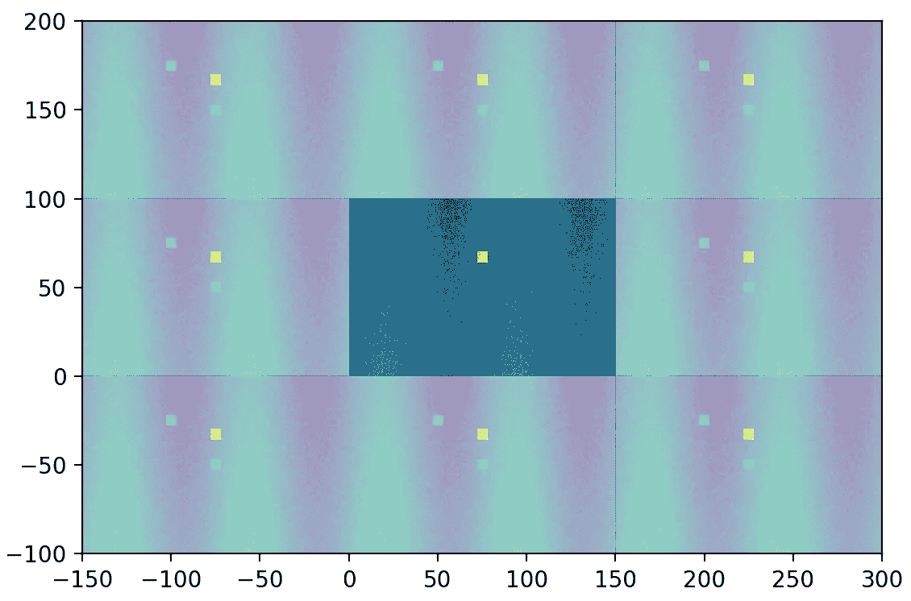
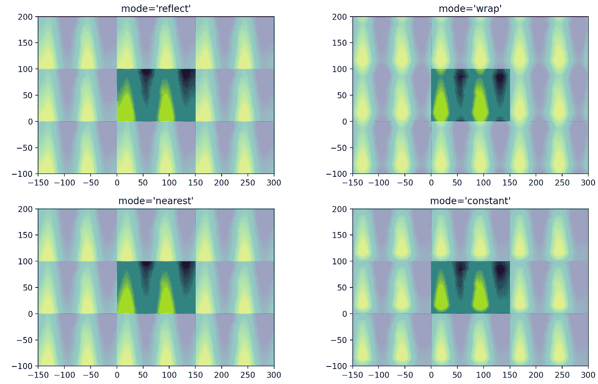
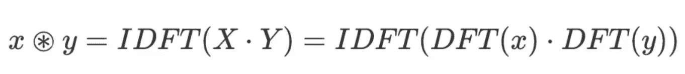
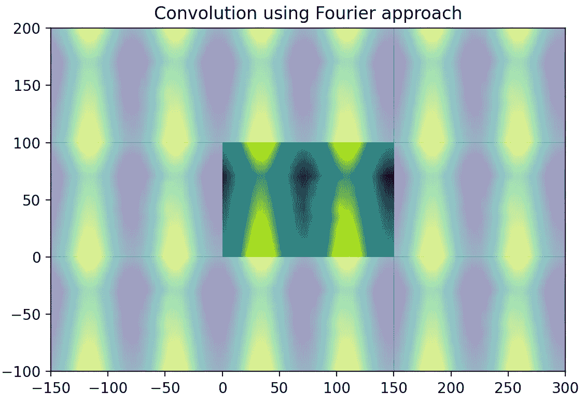
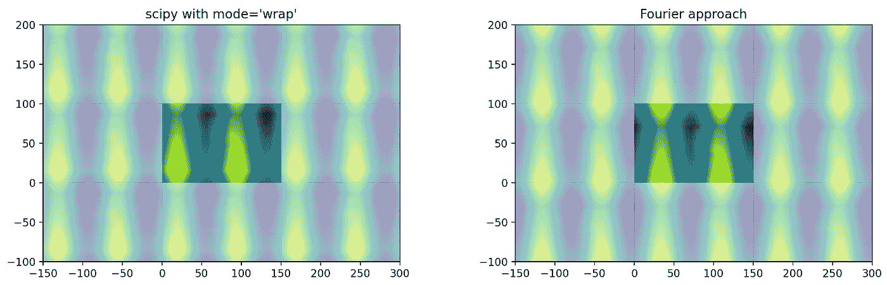
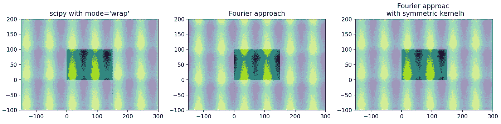
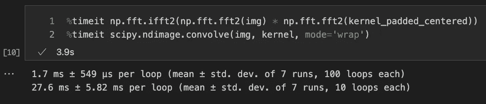

# 傅里叶变换在时间序列中的应用：关于图像卷积和 SciPy

> 原文：[`towardsdatascience.com/fourier-transform-for-time-series-about-image-convolution-and-scipy-5e8fa1279603`](https://towardsdatascience.com/fourier-transform-for-time-series-about-image-convolution-and-scipy-5e8fa1279603)

## 傅里叶变换卷积同样适用于图像

 [Yoann Mocquin](https://mocquin.medium.com/?source=post_page-----5e8fa1279603--------------------------------)

·发表在 [Towards Data Science](https://towardsdatascience.com/?source=post_page-----5e8fa1279603--------------------------------) ·阅读时间 5 分钟·2023 年 7 月 21 日

--

本文是傅里叶变换在时间序列中的第二篇文章，第一篇文章可以在这里查看：

[傅里叶变换在时间序列中的应用：用 numpy 解释快速卷积](https://towardsdatascience.com/fourier-transform-for-time-series-fast-convolution-explained-with-numpy-5a16834a2b99?source=post_page-----5e8fa1279603--------------------------------) [## 傅里叶变换在时间序列中的应用：用 numpy 解释快速卷积

### 使用傅里叶变换实现的卷积速度提高了 10000 倍

[傅里叶变换在时间序列中的应用：用 numpy 解释快速卷积](https://towardsdatascience.com/fourier-transform-for-time-series-fast-convolution-explained-with-numpy-5a16834a2b99?source=post_page-----5e8fa1279603--------------------------------)

# **上一篇文章的快速回顾**

在上一篇文章中，我解释了傅里叶变换如何**非常高效**地卷积信号。我展示了使用傅里叶变换的卷积在*numpy*中比标准代数方法快了多个数量级，并且它对应于一种叫做**循环卷积**的卷积类型。

在这篇文章中，我想强调循环卷积的含义以及它如何应用于图像。图像也是将一维直观扩展到二维的一个好方法。

*所有图像均由作者制作。*

# **使用 scipy 的图像卷积**

如果你曾经处理过图像处理中的图像，你很可能遇到过用于应用卷积的函数。图像卷积在各个领域都被广泛应用——图像增强、去噪、分割、特征提取、压缩——并且是卷积神经网络的基础，卷积神经网络是处理视觉数据的深度学习模型的黄金标准。

在*Python*中，图像卷积可以通过使用*scipy*及其*ndimage*子包来简单实现。此时，我建议快速查看一下[`convolve`函数的文档](https://docs.scipy.org/doc/scipy/reference/generated/scipy.ndimage.convolve.html)，然后再回来继续阅读。

[## scipy.ndimage.convolve - SciPy v1.11.1 手册

### 多维卷积。数组与给定的内核进行卷积。参数：输入数组。数组…

[docs.scipy.org](https://docs.scipy.org/doc/scipy/reference/generated/scipy.ndimage.convolve.html?source=post_page-----5e8fa1279603--------------------------------)

使用方法非常简单：你可以传递两个图像以进行卷积。让我们看一个例子：

[注意*scipy*提供了几种使用参数‘*mode*’处理边界的方法](https://docs.scipy.org/doc/scipy/reference/generated/scipy.ndimage.convolve.html)：如下面所示，模式‘*wrap*’对应于循环卷积，因此对应于使用傅里叶变换的方法。还存在其他方法，如‘*reflect*’，它将图像内外翻转，或‘*constant*’，它重复最外层的值。还要注意‘*wrap*’的工作方式：它重复整个信号，就好像它是周期性的。

# 2D 图像的卷积

我们开始编码以查看不同卷积模式之间的差异。

首先，我们创建一个类来表示 2D 周期性图像：记住在上一篇文章中，当使用傅里叶变换工具时，信号被认为是周期性的。这个类只是用于绘制这种 2D 周期数组的语法糖。

我们在[0, V, 0, H]矩形中展示了“*基*”图像，以及其周围的前 8 个复制品。如前一篇文章所述，信号被视为周期性的，因此具有无限支持，但我们只需要并使用一个周期。

现在我们创建一个样本图像进行测试：它应包含随机噪声、正弦波模式、斜坡模式和几个方形斑点。我们还创建了此样本图像的周期版本：它表示傅里叶变换在应用其算子时所考虑的周期图像。

我们要进行卷积的输入图像，以周期数组表示。中心是“基”图像，其复制品围绕四周。

现在我们创建一个用于卷积的内核：我们将使用一个简单的常量内核，也称为平均内核，因为与此内核的卷积仅给出输入图像的局部平均值。

然后我们开始使用*scipy*的卷积函数及其不同的*modes*来处理边界，并将结果包装为周期数组以便于绘图：注意卷积图像的中间部分总是相同的，无论使用何种*mode*，但边界会有所不同。

使用 scipy 卷积函数处理边界的 4 种不同“模式”的结果。每个结果图像都显示为周期数组。

现在我们可以使用傅里叶变换方法来计算卷积：如前一篇文章所示，我们只需要对两个信号的傅里叶变换的乘积进行逆傅里叶变换，即图像和内核：

计算两个信号的卷积的基本方程，使用傅里叶变换方法。

使用傅里叶变换方法的卷积结果，而不是 scipy。

与 scipy 的“wrap”模式结果进行比较，我们可以看到结果非常相似，只是有一点偏移：

scipy 卷积模式=’wrap’和傅里叶变换方法的比较。它们几乎是相同的。使用周期数组表示，我们可以看到这只是一个偏移的问题。

这只是一个索引的问题，我们可以使用移位中心化内核得到完全相同的结果：

使用 scipy 模式=’wrap’（左侧）的卷积与两种傅里叶变换方法的比较：在两侧填充内核（中间）和中心化内核（右侧）。左侧和右侧的图像是相同的。

使用适当的中心化，我们得到了*scipy*的卷积与模式=’*wrap*’以及傅里叶变换方法之间的相同结果。

出于好奇，我们来看看哪种方法更快：

scipy 和傅里叶变换计算两个图像之间卷积的时间比较：傅里叶变换比 scipy 快约 15 倍。

再次，傅里叶变换方法更快，并且在这种情况下**比 scipy 函数更快**，这很棒。

# 总结

我们在这篇文章中看到圆形卷积如何转换为图像，以及它如何等同于使用模式=’wrap’的 scipy 卷积函数。

在下一篇文章中，我们将深入探讨在傅里叶变换的背景下使用窗口函数，以减少谱泄漏并改善谱分析。

# 订阅以直接在您的动态中获取有关傅里叶变换的未来帖子！

另外，请查看我的其他帖子，如果您喜欢其中的任何帖子，请订阅，这对我实现 100 名订阅者的目标帮助很大：

 [## 傅里叶变换在时间序列中的应用：使用 numpy 解释的快速卷积

### 使用傅里叶变换实现的卷积速度快 10000 倍

[## PCA/LDA/ICA: 组件分析算法比较](https://towardsdatascience.com/fourier-transform-for-time-series-fast-convolution-explained-with-numpy-5a16834a2b99?source=post_page-----5e8fa1279603--------------------------------)

### 复习这些著名算法的概念和区别。

[## PCA-whitening vs ZCA-whitening: 一个 numpy 2d 可视化](https://towardsdatascience.com/pca-lda-ica-a-components-analysis-algorithms-comparison-c5762c4148ff?source=post_page-----5e8fa1279603--------------------------------)

### 数据的 whitening 过程包括一个变换，使得变换后的数据具有单位矩阵作为…

[## 比有限差分法快 300 倍的分辨率使用 numpy](https://towardsdatascience.com/pca-whitening-vs-zca-whitening-a-numpy-2d-visual-518b32033edf?source=post_page-----5e8fa1279603--------------------------------)

### 有限差分法是一种强大的技术，用于解决复杂问题，而 numpy 使其变得更快！

[## 在 Jupyter 中交互式绘制知名的 RC 电路](https://towardsdatascience.com/300-times-faster-resolution-of-finite-difference-method-using-numpy-de28cdade4e1?source=post_page-----5e8fa1279603--------------------------------)

### 另一阶段的 ipywidgets 和 matplotlib

[## 封装 numpy 的数组](https://towardsdatascience.com/interactive-plotting-the-well-know-rc-circuit-in-jupyter-d153c0e9d3a?source=post_page-----5e8fa1279603--------------------------------)

### 容器方法。

[## 封装 numpy 的数组](https://towardsdatascience.com/wrapping-numpys-arrays-971e015e14bb?source=post_page-----5e8fa1279603--------------------------------)

如果这些文章对你感兴趣，记得关注我，新文章会出现在你的信息流中。
