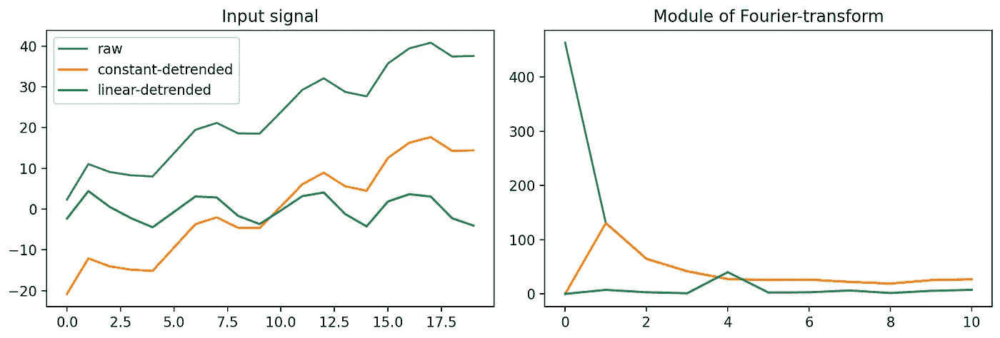

# 时间序列的傅里叶变换：去趋势

> 原文：[`towardsdatascience.com/fourier-transform-for-time-series-detrending-f0f470f4bf14?source=collection_archive---------5-----------------------#2023-08-11`](https://towardsdatascience.com/fourier-transform-for-time-series-detrending-f0f470f4bf14?source=collection_archive---------5-----------------------#2023-08-11)

## 对时间序列进行去趋势处理可能会改变游戏规则

 [Yoann Mocquin](https://mocquin.medium.com/?source=post_page-----f0f470f4bf14--------------------------------)

·

[关注](https://medium.com/m/signin?actionUrl=https%3A%2F%2Fmedium.com%2F_%2Fsubscribe%2Fuser%2F173731d06320&operation=register&redirect=https%3A%2F%2Ftowardsdatascience.com%2Ffourier-transform-for-time-series-detrending-f0f470f4bf14&user=Yoann+Mocquin&userId=173731d06320&source=post_page-173731d06320----f0f470f4bf14---------------------post_header-----------) 发布在 [Towards Data Science](https://towardsdatascience.com/?source=post_page-----f0f470f4bf14--------------------------------) · 8 分钟阅读 · 2023 年 8 月 11 日 

--

**在计算傅里叶变换之前对信号进行去趋势处理是一种常见的做法，尤其是在处理时间序列时。**

在这篇文章中，我想从数学和视觉上展示去趋势处理如何影响信号的傅里叶变换。

*所有图片均由作者提供。*

这篇文章是我的傅里叶变换时间序列系列中的第四篇：我使用非常简单的例子和一些数学公式来解释傅里叶变换的各种概念。你不需要按下面的顺序阅读，我更推荐你在每篇文章之间来回查看。

**查看之前的帖子：**

+   **回顾卷积如何与傅里叶变换相关以及它有多快**：

 ## 时间序列的傅里叶变换：使用 numpy 解释快速卷积

### 使用傅里叶变换进行的卷积比传统方法快 10000 倍

[towardsdatascience.com

+   **通过图像示例加深对卷积的理解：**
