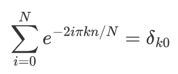
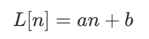

# 时间序列的傅里叶变换：去趋势

> 原文：[`towardsdatascience.com/fourier-transform-for-time-series-detrending-f0f470f4bf14`](https://towardsdatascience.com/fourier-transform-for-time-series-detrending-f0f470f4bf14)

## 对你的时间序列进行去趋势处理可能会改变游戏规则

[](https://mocquin.medium.com/?source=post_page-----f0f470f4bf14--------------------------------)[](https://towardsdatascience.com/?source=post_page-----f0f470f4bf14--------------------------------) [Yoann Mocquin](https://mocquin.medium.com/?source=post_page-----f0f470f4bf14--------------------------------)

·发表于[Towards Data Science](https://towardsdatascience.com/?source=post_page-----f0f470f4bf14--------------------------------) ·8 分钟阅读·2023 年 8 月 11 日

--


**在计算傅里叶变换之前对信号进行去趋势处理是一种常见做法，尤其是在处理时间序列时。**

在这篇文章中，我想从数学和视觉上展示去趋势处理如何影响信号的傅里叶变换。

*所有图像均由作者提供。*

这篇文章是我关于时间序列傅里叶变换系列的第四篇：我使用非常简单的示例和少量数学公式来解释傅里叶变换的各种概念。你无需按照下面的顺序阅读，建议在每篇文章之间来回翻阅。

**查看之前的帖子：**

+   **回顾卷积与傅里叶变换的关系及其速度：**

[](/fourier-transform-for-time-series-fast-convolution-explained-with-numpy-5a16834a2b99?source=post_page-----f0f470f4bf14--------------------------------) ## 时间序列的傅里叶变换：使用 numpy 解释快速卷积

### 10000 倍速度提升的卷积使用傅里叶变换

towardsdatascience.com

+   **通过图像示例深入理解卷积：**

[](/fourier-transform-for-time-series-about-image-convolution-and-scipy-5e8fa1279603?source=post_page-----f0f470f4bf14--------------------------------) ## 时间序列的傅里叶变换：关于图像卷积和 SciPy

### 傅里叶变换卷积也适用于图像

towardsdatascience.com

+   **了解如何通过向量视觉方法直观理解傅里叶变换：**

[](/fourier-transform-for-time-series-plotting-complex-numbers-9743ffe8a8bb?source=post_page-----f0f470f4bf14--------------------------------) ## 傅里叶变换在时间序列中的应用：绘制复数

### 绘制傅里叶变换算法以理解它。

towardsdatascience.com

在本帖中，我们将探讨 2 种去趋势：我们将其称为 ‘*常数*’ 和 ‘*线性*’ 去趋势。

**本帖的最终目标是让你理解什么是常数和线性去趋势，为什么使用它们，以及它们如何影响信号的傅里叶变换。**

# **傅里叶变换快速回顾**

在本帖中，我们将使用以下傅里叶变换定义：对于输入序列 x[n]，从 n=0 到 N，傅里叶变换的第 k 个系数是以下复数：


本帖使用的傅里叶变换。

# **常数去趋势**

让我们分析输入信号。序列 x[n] 可以分解如下：与其将 x 视为整体，不如将其写作 2 个信号的总和：一个是等于信号均值的“恒定部分”，另一个是给出实际信号与其均值之间差异的“均值周围的变异性”部分：


将 x 分解为 2 部分的总和：一个是常数部分（均值），另一个是“剩余部分”，即均值周围的变异性

因此，对于所有样本 n，我们有：


x 的每个值被分解为 2 部分：均值，加上该值与均值之间的差异。

首先，让我们对 x 的均值进行傅里叶变换：


常数值等于 x 的均值的傅里叶变换：在所有地方都为 0，除了 k=0 处等于输入值。

这是一个简单的序列，在采样 k=0 时其值为 x 的均值，其余地方为 0。使用之前帖子的代码，我们可以轻松理解为什么以下是正确的：



指数的总和为 0，除了 k=0。这可以在下图中图示。

```py
import numpy as np
import matplotlib.pyplot as plt

N = 10
ns = np.arange(N)

fig, axes = plt.subplots(1, N//2+1, figsize=(18,8), sharex=True, sharey=True)

for k in range(0, N//2+1):
    eiks = np.exp(-2*1J*np.pi*ns/N*k)
    pretty_ax(axes[k])
    plot_sum_vector(eiks, axes[k])
    axes[k].set_title(f'k={k}')
    axes[k].set_aspect('equal')
fig.suptitle(f'Complex plot of the $e^{{-2i\pi kn/N}}$ families')
```


绘制所有指数的总和可以显示为什么它们总是加起来为 0（除了 k=0）。

现在让我们对 x 进行傅里叶变换，如我们所写的，有其 2 个部分：


对分解后的 x 进行傅里叶变换，得到 2 个傅里叶变换的总和：一个是“变异性”部分的傅里叶变换，另一个是 k=0 时等于均值的系数。

换句话说，x 的傅里叶变换是其均值周围的傅里叶变换的总和，加上一个在所有地方都为 0 但在 k=0 时等于 x 均值的序列。

**这就是常数去趋势的含义：即在进行傅里叶变换之前去除信号的均值**。在傅里叶系数方面，这相当于将 k=0 的系数设置为 0。

另一种理解方式如下：可以很容易地证明，当 k=0 时的系数总是等于信号的均值：


证明 0-th 系数等于 x 的均值。

# **线性去趋势**

方法与之前相同：将输入信号写成 2 部分的和：一个“线性”部分，以及围绕该线性部分的其他变异：


将 x 分解为 2 部分：一个“线性部分”和“其余部分”。

其中线性部分通常是通过最小二乘拟合计算出来的。使用索引，我们可以将线性部分写为：



线性部分的表达。

其中 b 是信号的均值。

现在我们已经写出了 x 的分解，接下来进行傅里叶变换：


将 x 的傅里叶变换分解为 2 个傅里叶变换的和。

线性部分的傅里叶变换，由于傅里叶变换的线性特性：


线性部分的傅里叶变换分解。

**因此，线性去趋势的过程就是在进行傅里叶变换之前去除 x 的线性部分**：这会从结果中去除项 aFT(n)+b，其中 a 是一个常数因子（对应于线性拟合的斜率），FT(n)是线性序列[0, 1, …]的傅里叶变换，而 b 是信号的均值（因此第一个傅里叶系数将为 0，就像常数去趋势一样）。

# **在 python 中进行去趋势**

让我们看看如何在 python 中简单地去趋势信号并进行傅里叶变换。使用 numpy 和 scipy 来实现非常直接。

Scipy 在其**signal**包中提供了一个**detrend**函数，并且有一个**type**参数来指定是否要对信号进行常数去趋势或线性去趋势。

在下面的示例中，我们创建了一个长度为 20 样本的信号，其中包含一个主系数为 2 的线性部分、一点噪声、一个 4 的偏移量和一个正弦部分。

```py
import numpy as np
from scipy.signal import detrend
import matplotlib.pyplot as plt

N = 20
# create a sample signal, with linear, offset, noise and sinus parts
ys = np.arange(N) * 2 + 4 + np.random.randn(N) + 4*np.sin(2*np.pi*np.arange(N)/5)
# constant and linear detrend
ys_c = detrend(ys, type='constant')
ys_l = detrend(ys, type='linear')

fig, axes = plt.subplots(1, 2)

ax = axes[0]
ax.plot(ys, label='raw')
ax.plot(ys_c, label='constant-detrended')
ax.plot(ys_l, label='linear-detrended')
ax.legend()
ax.set_title('Input signal')

ax = axes[1]
# we use rfft since our input signals are real
ax.plot(np.abs(np.fft.rfft(ys)))
ax.plot(np.abs(np.fft.rfft(ys_c)))
ax.plot(np.abs(np.fft.rfft(ys_l)))
ax.set_title('Module of Fourier-transform')
```


左侧：输入信号、常数去趋势和线性去趋势。右侧：它们的傅里叶变换的幅度。

**让我们回顾这些图表。**

**左侧是原始输入信号**，以及它的常数去趋势和线性去趋势版本。

常数去趋势有效地去除了信号的均值，使其中心围绕 0。线性去趋势不仅去除信号的均值，还去除其线性趋势（即“直线斜率”）。在视觉上，在线性去趋势信号上比在原始信号上更容易识别出正弦部分。

**右侧是每个信号的傅里叶变换的模**：如果没有进行去趋势处理，我们会得到蓝色的模。通过常量去趋势处理去除均值实际上将 0 阶系数设为 0，这通常使得图形更容易分析。但最好的部分来自线性去趋势处理：正如你所看到的，输出的傅里叶系数很好地显示了输出谱中的正弦频率。

**所以，假设你正在分析时间序列并使用傅里叶谱查找季节性模式：如果你的信号已经进行了线性去趋势处理，这将更容易。**

更进一步，**线性去趋势的主要优点是它大大减少了*谱泄漏*。** 我们将在另一篇文章中详细讨论什么是谱泄漏以及为什么我们要去除它。

# 关于线性信号的傅里叶变换

我们可以很容易地绘制线性信号 Kn 的傅里叶变换，其中 K 是斜率，针对不同的 K 值：

```py
import numpy as np
import matplotlib.pyplot as plt

N = 10
ns = np.arange(N)
Ks = [-5, 2, 5]

fig, axes = plt.subplots(len(Ks), N//2+1, figsize=(18,8), sharex=True, sharey=True, gridspec_kw={'hspace':0, 'wspace':0})

for i, K in enumerate(Ks):
    xs = K*np.arange(N)
    for k in range(0, N//2+1):
        Zs = xs * np.exp(-2*1J*np.pi*ns/N*k) / N
        ax = axes[i, k]
        pretty_ax(ax)
        plot_sum_vector(Zs, ax)
        ax.set_aspect('equal')
        ax.set_xlabel(f'k={k}')
    axes[i, 0].set_ylabel(f'K={K}')
fig.tight_layout()
```


线性信号的傅里叶系数 K*n。第一行：K=-5。第二行：K=2。第三行：K=5。

正如你所见，对于给定的 k 值，傅里叶系数（由红色箭头表示）总是对齐的，并且相等，只是尺度不同。因此，输出谱中去除的部分始终是序列 [0, 1, …N] 的傅里叶变换，其缩放因子由线性拟合的斜率给出。

# **总结**

在这篇文章中，我们了解了常量去趋势和线性去趋势的概念：它们分别是去除输入信号的均值或线性拟合。这一步骤在计算傅里叶变换之前有助于使输出谱更容易解释。

**去除信号的均值将 0 阶系数设为 0**。结果图形更易于检查，因为大多数情况下，均值相对于谱的其他部分可能非常大。因此，如果去除该系数，y 轴的尺度更容易设置。

**去除线性部分，除了去除均值外，还去除了信号中的整体趋势**，这通常是原始信号中主导的部分，并且可能掩盖了你真正感兴趣的其他组件/季节性行为。

**如果你喜欢这篇文章并想阅读更多内容，请订阅 :) !**

[## 每当我发布时获取电子邮件！](https://mocquin.medium.com/subscribe?source=post_page-----f0f470f4bf14--------------------------------)

### 每当我发布时获取电子邮件！新的出版物将包括数据转换、先进的绘图和模拟……

[mocquin.medium.com](https://mocquin.medium.com/subscribe?source=post_page-----f0f470f4bf14--------------------------------)

**确保查看我其他与傅里叶变换无关的文章：**

+   **使用 numpy 的有限差分法：**

[](/300-times-faster-resolution-of-finite-difference-method-using-numpy-de28cdade4e1?source=post_page-----f0f470f4bf14--------------------------------) ## 使用 numpy 300 倍更快的有限差分法解析度

### 有限差分法是一种强大的技术来解决复杂问题，而 numpy 使其更快！

towardsdatascience.com

+   **PCA、ICA 和 LDA 算法的比较：**

[](/pca-lda-ica-a-components-analysis-algorithms-comparison-c5762c4148ff?source=post_page-----f0f470f4bf14--------------------------------) ## PCA/LDA/ICA：组件分析算法比较

### 回顾这些著名算法的概念和差异。

towardsdatascience.com

+   **比较 PCA 白化和 ZCA 白化：**

[](/pca-whitening-vs-zca-whitening-a-numpy-2d-visual-518b32033edf?source=post_page-----f0f470f4bf14--------------------------------) ## PCA 白化 vs ZCA 白化：一个 numpy 2d 可视化

### 数据白化的过程包括一种变换，使得变换后的数据具有单位矩阵作为…

towardsdatascience.com
