# 时间序列的傅里叶变换：使用 numpy 解释快速卷积

> 原文：[`towardsdatascience.com/fourier-transform-for-time-series-fast-convolution-explained-with-numpy-5a16834a2b99`](https://towardsdatascience.com/fourier-transform-for-time-series-fast-convolution-explained-with-numpy-5a16834a2b99)

## 从头实现与 numpy

 [Yoann Mocquin](https://mocquin.medium.com/?source=post_page-----5a16834a2b99--------------------------------)

·发布于 [Towards Data Science](https://towardsdatascience.com/?source=post_page-----5a16834a2b99--------------------------------) ·7 分钟阅读·2023 年 7 月 3 日

--

傅里叶变换算法被认为是所有数学领域的伟大发现之一。法国数学家让-巴蒂斯特·约瑟夫·傅里叶在 1822 年的著作《热的解析理论》中奠定了谐波分析的基础。今天，傅里叶变换及其所有变种构成了我们现代世界的基础，支持着压缩、通信、图像处理等技术。

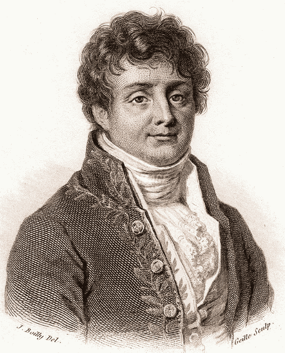

法国数学家让·巴蒂斯特·约瑟夫·傅里叶（1768–1830）的雕刻肖像，19 世纪早期。[来源：[wikipedia](https://commons.wikimedia.org/wiki/File:Fourier2.jpg?uselang=fr#Conditions%20d%E2%80%99utilisation)，图片来自公有领域]

这个出色的框架还提供了分析时间序列的优秀工具……这就是我们在这里的原因！

本文是傅里叶变换系列的一部分。今天我们将讨论卷积以及傅里叶变换如何提供最快的实现方法。

*所有图形和方程均由作者制作。*

# **离散傅里叶变换（DFT）的定义**

让我们从基本定义开始。离散时间序列 x 的离散傅里叶变换是：

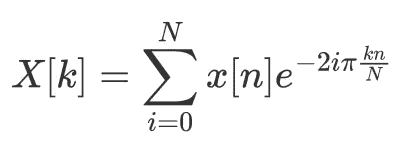

离散傅里叶变换（DFT）的定义。还有其他定义，你只需选择一种并坚持（由作者提供）

其中 k 表示 x 的频谱的第 k 个频率。注意，一些作者在该定义中添加了 1/N 的缩放因子，但对于这篇文章来说并不重要——总的来说，这只是定义的问题，并且要坚持定义。

然后逆傅里叶变换是（给定傅里叶变换的定义）：

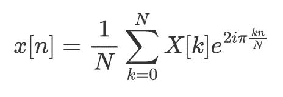

离散傅里叶变换，基于上述正向定义（作者制作）。

也就是说，傅里叶变换中最重要的定理之一是空间中的卷积等同于另一空间中的乘法。换句话说，乘积的傅里叶变换是各自傅里叶谱的卷积，而卷积的傅里叶变换是各自傅里叶谱的乘积。

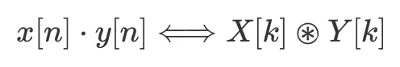

时间域中的乘法对应于傅里叶域中的循环卷积（作者制作）。

和

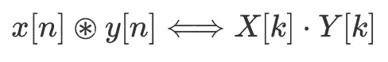

时间域的循环卷积对应于傅里叶域的乘法（作者制作）。

其中点表示标准乘法（乘法），而圈中的星号表示**循环卷积**。

**两个重要的注意事项：**

+   **周期信号**：傅里叶分析框架认为我们处理的信号是**周期性**的。换句话说，它们从负无穷到正无穷重复。然而，用有限内存的计算机处理这种信号并不总是实际的，因此我们只“处理”一个周期，正如我们接下来将看到的那样。

+   **循环卷积**：卷积定理指出乘法等同于**循环**卷积，这与我们更熟悉的**线性卷积**稍有不同。正如我们将看到的，它并没有那么不同，也不那么复杂。

# **循环卷积与线性卷积**

如果你对线性卷积（通常简单称为‘卷积’）比较熟悉，你不会对循环卷积感到困惑。基本上，**循环卷积只是处理周期性信号的一种方式**。正如你可以猜测的，线性卷积仅对有限长度的信号有意义，这些信号从负无穷到正无穷延展。在我们的案例中，在傅里叶分析的背景下，我们的信号是周期性的，因此不满足这个条件。我们不能讨论（线性）卷积。

然而，我们仍然可以直观地感受到周期信号上的线性卷积类似操作：只需在一个周期长度上卷积周期信号。这就是循环卷积的作用：它在一个周期跨度内卷积两个相同长度的周期信号。

为了进一步确认这些差异，请比较离散线性卷积和离散循环卷积的公式：

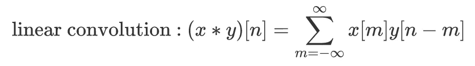

线性卷积的公式：在信号处理过程中，大多数时候使用这个公式，通过零填充（作者制作）。

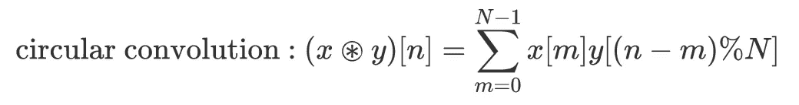

循环卷积：这是在处理周期性信号时使用的卷积，如在傅里叶分析中（作者制作）。

注意差异：

- **边界**：线性卷积使用从负无穷到正无穷的样本——如前所述，在这种情况下，x 和 y 具有有限的能量，因此求和是有意义的。对于循环卷积，我们只需要在一个周期范围内发生的情况，因此求和仅跨越一个周期。

- **循环索引**：在循环卷积中，我们使用模运算“包裹”y 的索引，模的长度为 N。这只是确保 y 被视为周期为 N 的周期性序列的一种方法：当我们想知道位置 k 处 y 的值时，我们只需使用位置 k%N 处 y 的值——由于 y 是 N 周期性的，我们得到正确的值。同样，这只是处理周期性无限长度样本序列的数学方法。

# **numpy 中的实现**

Numpy 为有限长度信号提供了很好的工具：这真是个好消息，因为正如我们刚才看到的，我们的无限长度周期信号只需用一个周期表示。

让我们创建一个简单的类来表示这些信号。我们添加一个方法来快速绘制数组，并在“基本”数组的前后添加额外的周期，以便记住我们处理的是周期序列。

让我们看两个例子：首先是采样的正弦序列，然后是线性序列。两者都被认为是 N 周期性（此例中 N=10）。

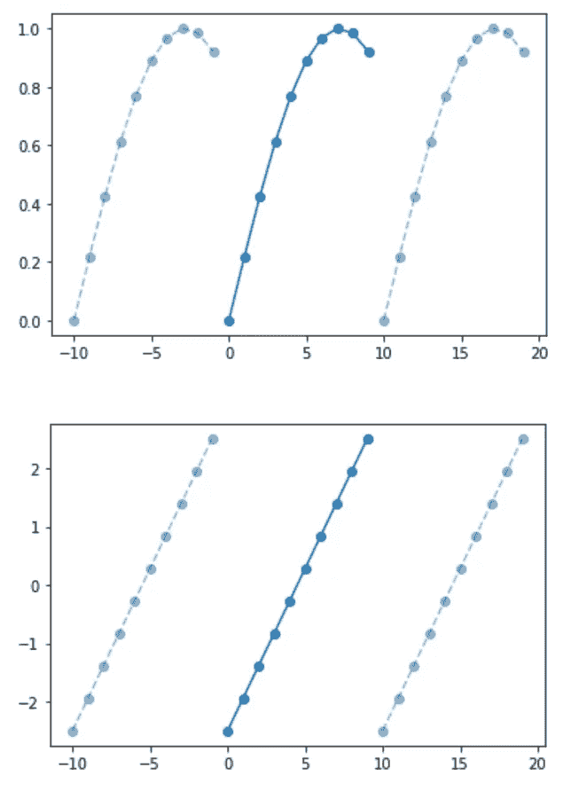

PeriodicArray 的两个例子：“基本”周期从 0 到 N 用深蓝色绘制，同时在前后添加了 2 个其他周期，以表示我们正在处理周期序列（作者制作）。

# **缓慢方式的循环卷积**

现在让我们实现上述循环卷积方程。使用索引和模运算符，这非常简单：

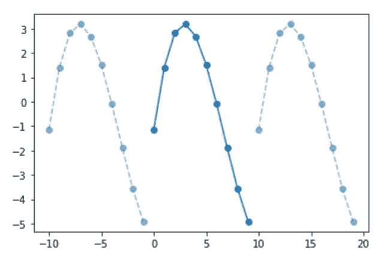

上述两个周期序列之间的循环卷积（作者制作）。

太棒了，我们现在可以看到两个信号之间的循环卷积是什么样的。将所有内容放在一个图中：

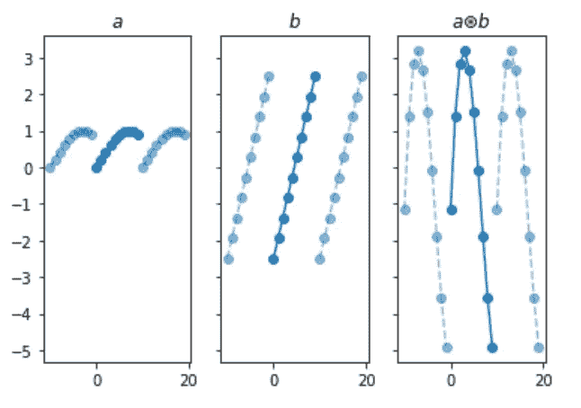

左侧：第一个周期性数组。中间：第二个周期性数组。右侧：两个周期性数组的循环卷积，它也是一个周期性数组（作者制作）。

现在这个解决方案工作得很好，但它有一个主要缺陷：它很慢。如您所见，我们必须通过两个嵌套的循环来计算结果：一个用于结果数组中的每个位置，另一个用于计算该位置的结果：我们称该算法为 O(N²)，随着 N 的增加，操作数量将增加到 N 的平方。

对于像示例中的这些小数组，这不是问题，但随着数组的增长，它将成为一个主要问题。

此外，对数值数据进行循环通常被认为是 Python 中的不良实践。一定有更好的方法……

# **傅里叶方式的循环卷积**

这就是傅里叶变换和卷积定理发挥作用的地方。由于离散傅里叶变换以非常快速和优化的方式实现（使用快速傅里叶变换 FFT），操作是****非常**** 快的（我们说 FFT 是 O(N log N)，这比 O(N²) 好得多）。

利用卷积定理，我们可以使用 2 个序列的离散傅里叶变换（DFT）的乘积，当通过逆 DFT 转换回时间域时，我们得到输入时间序列的卷积。换句话说，我们有：

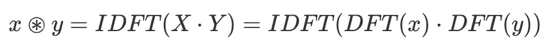

使用直接和逆傅里叶变换进行 x 和 y 的循环卷积（由作者制作）。

其中 DFT 代表离散傅里叶变换，IDFT 代表逆变换操作。

我们可以实现这个算法，使用 numpy 很容易地计算 x 和 y 的卷积：

# **数值和时间比较**

最后，让我们验证这两种方法是否得到相同的结果，并比较 Python 计算循环卷积所需的时间：

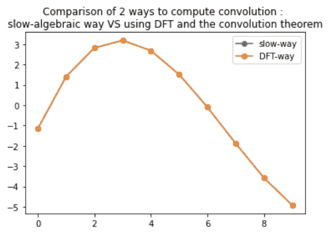

比较计算两个周期序列之间的循环卷积的两种方法： “慢方法” 是使用蓝色的循环和加法进行简单代数运算，叠加在橙色的“傅里叶方法”上。这两种方法给出的结果完全相同（数值精度一致）（由作者制作）。

这是一个完美的匹配！两者在数值值上严格等价。

现在进行时间比较：

结果是：

+   对于 N=10 个样本，DFT 快了 6 倍

+   **对于 N=1000 个样本，DFT 快了大约 10000 倍**

这真是太棒了！现在考虑一下，当你用数以千计的样本分析时间序列时，这将为你带来什么！

# **总结**

我们在这篇文章中看到，傅里叶变换是一个强大的工具，特别是得益于卷积定理，它允许我们以非常高效的方式计算卷积。我们看到线性和循环卷积并不是完全相同的操作，但都是基于卷积的。

## **订阅以便直接在你的信息流中获取关于傅里叶变换的未来文章！**

另外，查看我其他的文章，如果你喜欢其中的任何一篇，请订阅，这对我达到 100 名订阅者的目标帮助很大：

[使用 NumPy 实现有限差分法的 300 倍加速 | Yoann Mocquin | Towards Data Science (medium.com)](https://medium.com/towards-data-science/300-times-faster-resolution-of-finite-difference-method-using-numpy-de28cdade4e1)

[PCA/LDA/ICA : 组件分析算法比较 | Yoann Mocquin | Towards Data Science (medium.com)](https://medium.com/towards-data-science/pca-lda-ica-a-components-analysis-algorithms-comparison-c5762c4148ff)

[包装 numpy 数组。容器方法。 | Yoann Mocquin | Towards Data Science (medium.com)](https://medium.com/towards-data-science/wrapping-numpys-arrays-971e015e14bb)

[深入探讨 Seaborn：颜色调色板 | 作者：Yoann Mocquin | Analytics Vidhya | Medium](https://medium.com/analytics-vidhya/deep-dive-into-seaborn-palettes-7b5fae5a258e)
