# 时间序列的傅里叶变换：绘制复数

> 原文：[`towardsdatascience.com/fourier-transform-for-time-series-plotting-complex-numbers-9743ffe8a8bb`](https://towardsdatascience.com/fourier-transform-for-time-series-plotting-complex-numbers-9743ffe8a8bb)

## 绘制傅里叶变换算法以理解它

[](https://mocquin.medium.com/?source=post_page-----9743ffe8a8bb--------------------------------)[](https://towardsdatascience.com/?source=post_page-----9743ffe8a8bb--------------------------------) [Yoann Mocquin](https://mocquin.medium.com/?source=post_page-----9743ffe8a8bb--------------------------------)

·发表于 [Towards Data Science](https://towardsdatascience.com/?source=post_page-----9743ffe8a8bb--------------------------------) ·12 分钟阅读·2023 年 7 月 28 日

--

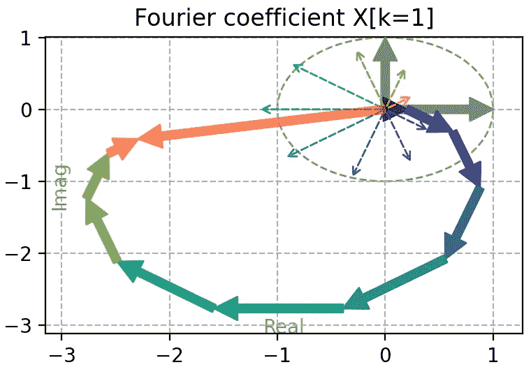

大多数时候，人们在处理信号的傅里叶变换时会遇到困难，因为其形式复杂。除非在非常特定的情况下，时间序列的傅里叶变换通常是复数序列——而复数并不总是容易掌握，尤其是当你不习惯处理这些数字时。

**在本文中，我想展示几种可视化 1D 实数序列的傅里叶变换的方法**，这正是你 99%的时间处理的内容，特别是在数据分析和时间序列中。

*所有图像均由作者提供。*

本文是我的《时间序列的傅里叶变换》系列的第三篇。查看之前的文章请访问这里：

+   回顾卷积如何与傅里叶变换相关以及其速度：

[](/fourier-transform-for-time-series-fast-convolution-explained-with-numpy-5a16834a2b99?source=post_page-----9743ffe8a8bb--------------------------------) ## 时间序列的傅里叶变换：使用 numpy 解释快速卷积

### 使用傅里叶变换进行 10000 倍更快的卷积

towardsdatascience.com

+   通过图像示例加深对卷积的理解：

[](/fourier-transform-for-time-series-about-image-convolution-and-scipy-5e8fa1279603?source=post_page-----9743ffe8a8bb--------------------------------) ## 时间序列的傅里叶变换：关于图像卷积和 SciPy

### 傅里叶变换卷积也适用于图像

towardsdatascience.com

在深入实际计算和绘制一维傅里叶变换之前，我们将回顾一些对接下来的内容至关重要的复杂数基本概念。正如你将看到的，复杂数实际上非常简单：可以将它们视为两个数字的向量。

**本文的最终目标是让你对傅里叶变换背后的实际数字更加熟悉。**

# **复杂数的快速回顾**

任何复杂数都可以用其标准形式表示，使用两个实值 a 和 b，分别称为其“**实部**”和“**虚部**”：

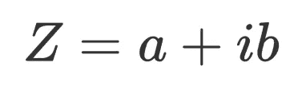

其中 ***i*** 是单位复数，具有著名的属性，即其平方等于 -1：

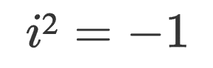

我们还可以将上述方程重新写作如下：

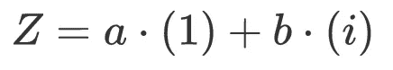

或者再次使用向量的点积：

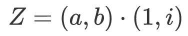

如果我们在 (x, y) 平面上表示 Z，x 轴为实部 (1)，y 轴为虚部 (i)，我们将 Z 绘制为从 (0, 0) 到 (a, b) 的向量。

让我们使用 NumPy 和 Matplotlib 来绘制一个示例。

```py
%matplotlib qt
import numpy as np
import matplotlib.pyplot as plt

# We start by defininf helper functions
# one to pretify an axes
def pretty_ax(ax, b: float=8):
    """Prettify an Axes for plotting complex numbers: 
        - Add labels
        - Set aspect to 'equal'
        - Add grid
        - Add unit circle with canonical vectors
        - Set custom value for boundaries of axes
    """
    ax.set_aspect('equal')
    ax.set_xlabel("Real", color="gray")
    ax.set_ylabel("Imag", color="gray")
    ax.xaxis.set_label_coords(0.5,0.05)
    ax.yaxis.set_label_coords(0.05,0.5)

    ax.grid(ls='--')
    c = plt.Circle((0,0), 1, ls='--', facecolor=None, edgecolor="gray", fill=False)
    ax.add_patch(c)
    ax.set_xlim(-b, b)
    ax.set_ylim(-b, b)
    plot_vector(1, ax, color="gray")
    plot_vector(1j, ax, color="gray")

# one to plot complex numbers to a 2D ax
def plot_vector(
        Z, ax, 
        color=None, decomp=False, txt=False, 
        orig=0+0J, ls=None, alpha=1, 
        arrowstyle=None, width=None, 
        headwidth=None, frac=None
    ):
    """Plot a complex number as vector.

    """
    x = Z.real
    y = Z.imag

    arrow_props = dict(
        color=color,
        ls=ls,
        edgecolor=None,
        alpha=alpha,
    )
    if arrowstyle is None:
        if width is not None:
            arrow_props["width"] = width   # width of the arrow in points
        if headwidth is not None:
            arrow_props["headwidth"] = headwidth   #  width of the base of the arrow head in points
        arrow_props['shrink'] = 0.0 # move the tip and base some percent away from the annotated point and text
        if frac is not None:
            arrow_props['frac'] = frac  # fraction of the arrow length occupied by the head
    else:
        arrow_props['arrowstyle'] = arrowstyle

    ann = ax.annotate("", 
                    xy=((Z+orig).real, (Z+orig).imag),
                    xytext=(orig.real, orig.imag),
                    arrowprops=arrow_props,
                    annotation_clip=False)
    ann.arrow_patch.set_clip_box(ax.bbox)
    if decomp:
        ann = ax.annotate('', xy=(x, 0), xytext=(orig.real, orig.imag), arrowprops=dict(arrowstyle="->", color=color), annotation_clip=False)
        ann.arrow_patch.set_clip_box(ax.bbox)
        ann = ax.annotate('', xy=(x, y), xytext=(x,0), arrowprops=dict(arrowstyle="->", color=color), annotation_clip=False)
        ann.arrow_patch.set_clip_box(ax.bbox)
    if txt:
        ax.text(x/2, y/2, f'Z={Z}', ha='center', va='bottom', rotation=np.angle(Z)*180/np.pi, color=color)

fig, ax = plt.subplots()
# prettify the ax for plotting complex numbers
pretty_ax(ax)

# define 2 complex numbers
Z1 = 5 + 3J
Z2 = 1 + 6J

plot_vector(Z1, ax, color="red", txt=True)  # plot Z1
plot_vector(Z2, ax, color="blue", txt=True) # plot Z2
plot_vector(Z2, ax, orig=Z1, color="blue")  # plot Z2 at the end of Z1
plot_vector(Z1+Z2, ax, txt=True, color="green") # plot Z1+Z2
```

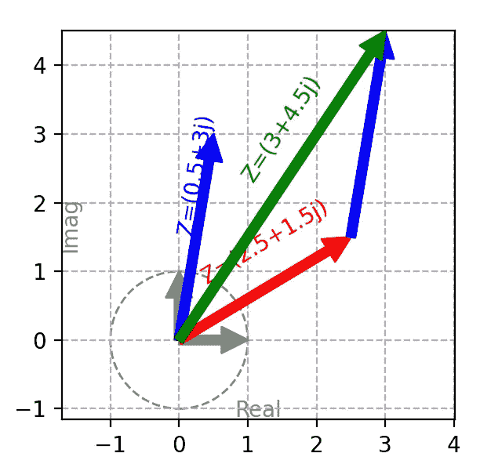

绘制两个复杂数作为向量（红色和蓝色），以及它们的和（绿色）。

如你所见，表示复杂数 Z1​ 和 Z2​ 在二维平面上作为向量是很简单的。因此，我们可以轻松地计算和绘制两个复杂数的和：我们只需将向量相加。这就是所有需要记住的内容；接下来的一切只是花哨的符号和绘图，以及一些有用的数学性质。

另一种表示相同向量的方法是使用极坐标表示法：

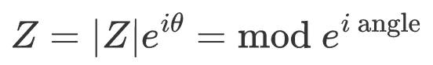

其中 ∣Z∣ 被称为 Z 的“模”，θ 被称为“幅角”（我通常称这个变量为“相位角”）。在几何上，模表示向量的长度，而其相位角表示向量相对于 Ox 轴的角度，也称为方向。

标准表示法 (a, b) 与极坐标表示法（模，幅角）之间存在直接对应关系；这只是另一种书写相同向量的方式。确实，请记住，复杂指数就是一个余弦加上一个虚数正弦的和：

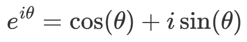

因此，如果我们绘制这个复杂数，实部是 cos⁡(θ)，虚部是 sin⁡(θ)；在复杂平面上的坐标是 (cos⁡(θ),sin⁡(θ))。将这个概念扩展到任何复杂数，我们得到实部 ∣Z∣cos⁡(θ) 和虚部 ∣Z∣sin⁡(θ)。

使用 NumPy，我们可以轻松计算复杂数的实部、虚部、模和相位分量。我们甚至可以检查两种表示法是否得到完全相同的复杂数。确实：

```py
Z = 1+3J

real = Z.real
imag = Z.imag
mod = np.abs(Z)
angle = np.angle(Z)

print(Z.real, Z.imag, mod, angle)
# check that both representation are equivalent
print(real+imag*1J == mod * np.exp(1J*angle))
```

```py
1.0 3.0 3.1622776601683795 1.2490457723982544
True
```

现在我们知道复数的行为就像向量一样，我们可以利用关于向量的知识来应用于复数。例如，当我们加两个复数时，它们的和只是对应于底层向量和的复数。让我们再次使用 Python 来查看一个示例：

```py
fig, axes = plt.subplots(1, 2, sharex=True, sharey=True)
pretty_ax(axes[0])
pretty_ax(axes[1])

# define 2 complex numbers
Z1 = 2.5 + 2J
Z2 = 0.5 + 1.5J

# compute their sum
Z_sum = Z1 + Z2
plot_vector(Z1, axes[0], color="red")            # plot Z1 alone
plot_vector(Z2, axes[0], orig=Z1, color="blue")   # plot Z2 after Z1
plot_vector(Z_sum, axes[0], color="green")         # plot their sum
axes[0].set_title('Sum of 2 complex numbers')

# same for the mean
Z_mean = np.mean([Z1, Z2])
plot_vector(Z1, axes[1], color="red")    # plot Z1 alone
plot_vector(Z2, axes[1], color="blue")    # plot Z2 alone
plot_vector(Z_mean, axes[1], color="green")# plot their mean
axes[1].set_title('Mean of 2 complex numbers')
```

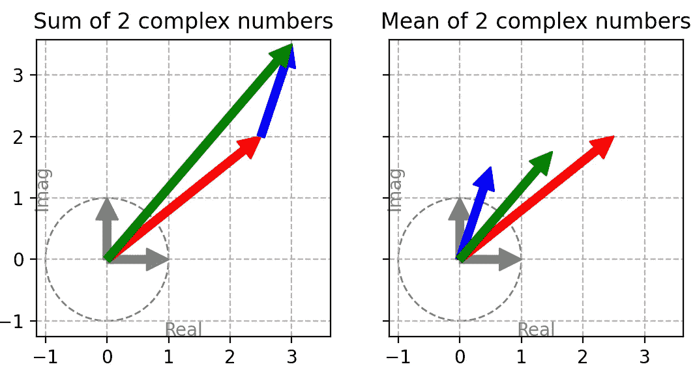

2 个复数的和（左）与均值（右）的图示。

同样，复数的均值就是向量的和，沿其方向缩放向量的数量。缩放向量对应于增减其长度，但不改变其方向。对于缩放因子 K：

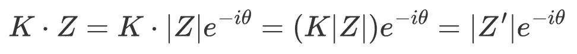

这是一个新的复数，具有新的长度 ∣Z′∣=K∣Z∣（即我们缩放了模），但相位角相同（即向量具有相同的方向）。

**所以请记住：**

+   **相同的复数 Z 可以表示为 Z=a+ib 或 Z=∣Z∣e^(−iθ)，其中 ∣Z∣ 代表向量的长度，θ 代表其方向。**

+   **对复数进行求和/平均的行为与对向量进行求和/平均的行为完全一样。**

# **傅里叶变换的向量方法**

让我们在离散样本序列的背景下回顾傅里叶变换的公式，这称为离散傅里叶变换（DFT）：

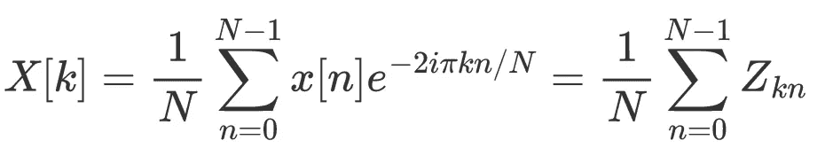

其中

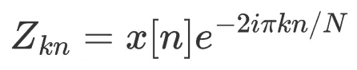

请注意，存在使用无缩放系数、1/N​ 或 1/N**0.5 的几种定义。我通常更喜欢使用无缩放因子，但在此帖中，我将使用上述方程中的 1/N​ 缩放因子。

让我们描述一下这个方程告诉我们的内容：

> 傅里叶变换的第 k 个元素（X[k]）是一个复数，由一组复数（Zkn​s）的均值给出。

利用我们现在对复数和向量的理解，我们可以通过绘制所有的小复数 Zkn​，将它们相加（像常规的向量和一样），并将结果缩小 1/N​ 来获得傅里叶变换的第 k 个系数。

让我们使用 Python 绘制一个示例：

```py
from matplotlib.cm import viridis

N = 10
colors = viridis(np.linspace(0, 1, N))

x_n = np.sin(np.linspace(0, 3, N)) +0.2
ns = np.arange(0, N)

k = 1
Z_ks = x_n * np.exp(-2*1J*np.pi*k*ns/N)

fig, axes = plt.subplots(1, 2)
axes[0].scatter(ns, x_n, marker='o', c=colors)
axes[0].set_title('Input sequence, \neach sample has a specific color')
for i, x in enumerate(x_n):
    _Zx = 1J * x
    plot_vector(_Zx, axes[0], arrowstyle="->", ls='--', color=colors[i], orig=i)

pretty_ax(axes[1], b=2)

def plot_sum_vector(Z_ks, ax, colors=colors):
    cumsum = 0
    for Zk, color in zip(Z_ks, colors):
        plot_vector(Zk, ax=ax, color=color, arrowstyle='->', ls='--')
        plot_vector(Zk, orig=cumsum, ax=ax, color=color)
        cumsum += Zk
    plot_vector(cumsum, ax=ax, color="red", alpha=0.5)

plot_sum_vector(Z_ks, axes[1])
axes[1].set_title('Fourier coefficient X[k=1]')

fig.tight_layout()
```

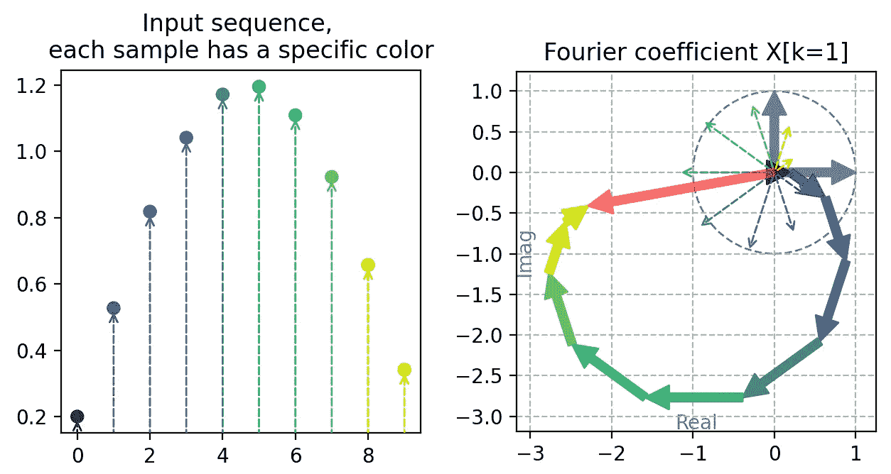

我们想要计算傅里叶变换的输入序列（左）和傅里叶系数 X[k=1] 的视觉计算（右）。

**左侧**是我们想要计算傅里叶变换系数的输入序列，X[k] 对于 k=0 到 N−1。为了更好地理解发生了什么，每个样本都使用了颜色。

**右侧**显示了所有的向量 Zkn​，每个向量都有一个对应的颜色。注意向量 Zkn​ 的长度由 x[n] 给出。这些向量被绘制了两次：一次从 (0,0) 开始，另一次则是累积地加和。总和对应于黄色箭头的末端，这个末端等于红色向量。这个红色向量表示傅里叶变换系数 X[k=1]。

这样，我们得到了表示傅里叶变换第 k 个系数的向量：换句话说，我们刚刚计算了 X[k] 的值。我们可以使用相同的步骤计算每个系数，循环遍历 k。

**在下面的示例中**，我们计算了所有 k=0 到 N−1 的小向量系列。对于每个 k 值，我们绘制了所有小向量 Zks​，累积向量和，以及最终的总和（用红色表示）。这样，最终的红色箭头表示该 k 值的傅里叶变换值：它只是一个具有特定模和相位角的复数。**换句话说，任何 k 的红色箭头只是 X[k] 的向量表示。**

最后，我们检查了傅里叶系数的“手动”计算是否与 numpy 的结果一致。

```py
fig, axes = plt.subplots(2, 5, figsize=(17,9), sharex=True, sharey=True)
#fig.subplots_adjust(top=0.95, bottom=0.3, left=0.05, right=0.95)
#ax_X = fig.add_axes([0.17, 0.05, 0.7, 0.2])
ks = np.arange(N)
X_ks = []
for k, ax in zip(ks, axes.flat):
    Z_ks = x_n * np.exp(-2*1J*np.pi*k*ns/N)

    pretty_ax(ax, b=6)
    plot_sum_vector(Z_ks, ax)
    ax.set_title(f'k={k}')
    # store the average all of the Zks for that value of k : this IS the fourier
    # coefficient for index k
    X_ks.append(Z_ks.mean())

X_ks = np.array(X_ks)
fig.tight_layout()

# Finaly, we can check that the Fourier-coefficients we computed are identical 
# to those computed by numpy. We use norm='forward' so numpy uses the 1/N scale
# convention.
assert np.allclose(X_ks, np.fft.fft(x_n, norm='forward'))
```

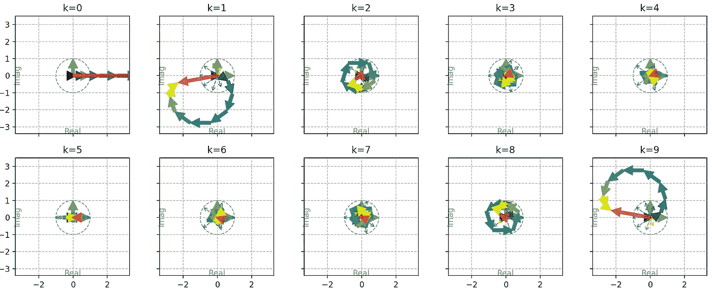

所有傅里叶系数的视觉计算表示，对于 k=0 到 N-1。最终 X[k] 的值表示为该 k 值所有彩色向量的总和。

就这样：**傅里叶系数 X[k] 由红色箭头表示，对于每个 k 值。**

几点需要注意：

+   **对于 k=0**，所有向量都在 x 轴上对齐，因此它们正好加在一起，作为实值的和。

+   **对于 k=1 和 k=9**，彩色向量整齐地加在一起，得到一个复数和向量。

+   **对于其他 k 值**，小向量基本上会相互抵消。

现在我们知道如何直观地计算傅里叶变换的每个元素，最终结果是整个离散傅里叶变换序列，这是另一系列复数。在下一部分，我们将绘制整个复数序列。

# **绘制傅里叶变换序列**

现在我们知道傅里叶变换系数 X[k] 如何通过数学和视觉方法计算，结果是复数序列 X[k]，我们可以用多种方式绘制：

+   绘制实部和虚部。

+   绘制模和相位角。

+   绘制 2D 向量，沿第三轴表示索引 kk。

使用上面看到的 numpy 函数，我们可以轻松提取所有这些特征并绘制它们。

```py
fig = plt.figure()
ax = fig.add_subplot(121, projection='3d', proj_type = 'ortho')

Zs = ks
Xs = X_ks.real
Ys = X_ks.imag

ax.plot(Xs, Ys, Zs, "--", color='red')
ax.scatter(Xs, Ys, Zs, '-o', color='red')#colors)
ax.set_xlabel('Real')
ax.set_ylabel('Imag')
ax.set_zlabel('k')
ax.set_title("Fourier coefficients X[k]")
ax.quiver(np.zeros_like(Xs), np.zeros_like(Xs), ks,
            Xs, Ys, np.zeros_like(Xs),
            colors='red',#colors, 
            arrow_length_ratio = 0.3, lw=3)
zmin, zmax = ax.get_zlim()
ax.plot([0,0], [0,0], [zmin, zmax], color="r", alpha=0.5, ls="--")

ax = fig.add_subplot(322)
ax.plot(x_n, '-o')
ax.set_title("Input sequence")

ax = fig.add_subplot(324)
ax.plot(ks, X_ks.real, '--o', color="r", label="real")
ax.plot(ks, X_ks.imag, '--o', color="g", label='imag')
ax.set_title('Real and imaginary parts')
ax.set_xlabel("k")
ax.legend()

ax = fig.add_subplot(326)
ax.plot(ks, np.abs(X_ks), '--o', color="r", label="mod")
ax.plot(ks, np.angle(X_ks), '--o', color="g", label='angle')
ax.set_title('Module and phase angle')
ax.set_xlabel("k")    
ax.legend()
fig.tight_layout()
```

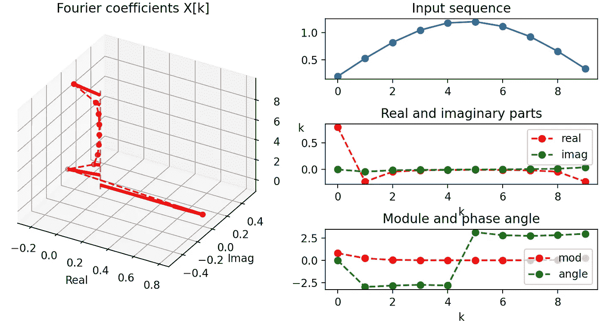

输入序列（右上角），以及表示其傅里叶变换的三种方式。

+   **首先是 3D 图**：z 轴表示傅里叶变换序列中 X[k] 的每个索引 k。在每个 z=k 的 XY 平面上，绘制了 X[k] 向量，实部在 x 轴上，虚部在 y 轴上。也就是说，请注意 X[k] 系数几乎完全是实数，向量几乎与 y 轴对齐，表示虚部非常小。这是因为我们的输入序列几乎完全对称，因此其傅里叶变换几乎完全是实数（这是我们将来会深入探讨的一个属性）。

+   **其次是实部和虚部图**：另一种可视化傅里叶变换序列的方式是绘制其实部和虚部。这与对齐 3D 图视图到 x 轴或 y 轴时看到的值基本相同。虽然这种方式在直观理解和与 3D 图比较时更容易，但使用的频率不高。

+   **最后是模长和相位角图**：记住，模长实际上是每个向量的长度，而相位角表示它们的方向。从 3D 图中更容易理解模长，因为它简单地给出向量的长度，而在实部/虚部图中不那么明显。关于相位角，

# **总结**

这里是你绝对应该记住的关键点：

+   复数只是向量，实部在 x 轴上，虚部在 y 轴上。

+   它们像向量一样表现：你知道向量的加法和缩放意味着什么，因此你也知道它们在复数上的作用。

+   你可以使用复数的各种表示/分解方式：作为 2D 向量，或提取其实部/虚部，其长度及其模，以及其方向和相位角。

+   傅里叶变换是一个复数序列：每个复数本身是其他复数序列的和（或平均值），这些复数具有模长（即长度）x[n]x[n] 和相位角（即方向）−2πkn/N。

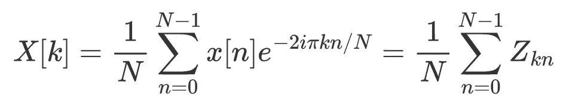

with


如果你喜欢这篇文章，查看我的其他文章：我通常尝试使用简单的 numpy 和 matplotlib 代码来解释概念：

[](https://mocquin.medium.com/one-sample-t-test-visually-explained-415c31744e14?source=post_page-----9743ffe8a8bb--------------------------------) [## 单样本 t 检验，直观解释

### 介绍其中一个最著名的统计检验

mocquin.medium.com](https://mocquin.medium.com/one-sample-t-test-visually-explained-415c31744e14?source=post_page-----9743ffe8a8bb--------------------------------) [](/pca-lda-ica-a-components-analysis-algorithms-comparison-c5762c4148ff?source=post_page-----9743ffe8a8bb--------------------------------) ## PCA/LDA/ICA：组件分析算法比较

### 复习这些著名算法的概念和差异。

towardsdatascience.com [](/pca-whitening-vs-zca-whitening-a-numpy-2d-visual-518b32033edf?source=post_page-----9743ffe8a8bb--------------------------------) [## PCA 白化与 ZCA 白化：一个 numpy 2D 可视化

### 数据白化过程包括一个变换，使得变换后的数据具有单位矩阵作为…

有限差分法是一种强大的技术，用于解决复杂问题，而 numpy 使得这一过程变得快速！

### [深入探讨 seaborn 调色板](https://medium.com/analytics-vidhya/deep-dive-into-seaborn-palettes-7b5fae5a258e?source=post_page-----9743ffe8a8bb--------------------------------)

[深入了解 seaborn 调色板](https://medium.com/analytics-vidhya/deep-dive-into-seaborn-palettes-7b5fae5a258e?source=post_page-----9743ffe8a8bb--------------------------------)

### 沉浸在 seaborn 调色板中吗？

[互动绘制知名 RC 电路](https://towardsdatascience.com/interactive-plotting-the-well-know-rc-circuit-in-jupyter-d153c0e9d3a?source=post_page-----9743ffe8a8bb--------------------------------)

### 进一步探索 ipywidgets 和 matplotlib

[300 倍速的有限差分法分辨率使用 numpy](https://towardsdatascience.com/300-times-faster-resolution-of-finite-difference-method-using-numpy-de28cdade4e1?source=post_page-----9743ffe8a8bb--------------------------------)
