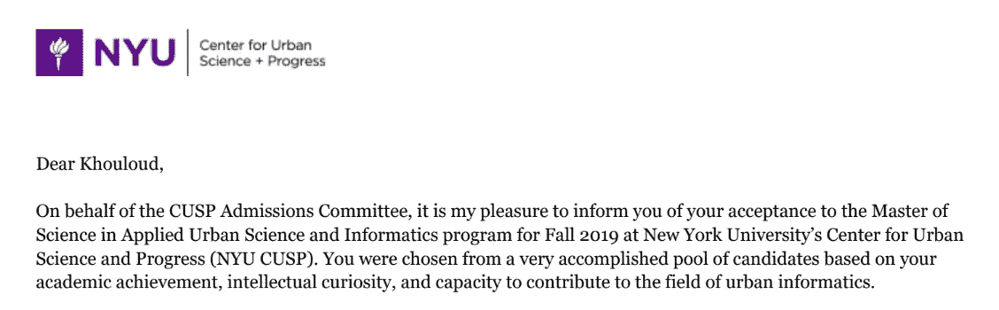
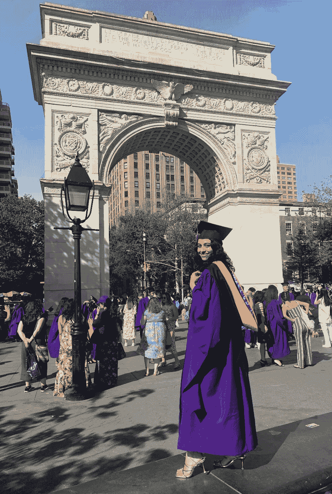

# 从商业学生到 Spotify 的数据科学家

> 原文：[`towardsdatascience.com/from-business-student-to-data-scientist-in-tech-eb7bbaab1784`](https://towardsdatascience.com/from-business-student-to-data-scientist-in-tech-eb7bbaab1784)

## 数据科学家在科技行业的初年历程

## 从对数学感到害怕到成为著名科技公司全职数据科学家的时间线

 [Khouloud El Alami](https://medium.com/@elalamik?source=post_page-----eb7bbaab1784--------------------------------)

·发布于 [Towards Data Science](https://towardsdatascience.com/?source=post_page-----eb7bbaab1784--------------------------------) ·阅读时间 10 分钟·2023 年 7 月 3 日

--

在我经常收到的 [LinkedIn](https://www.linkedin.com/in/khouloud-elalami/) 上最常见的问题中，有一个问题始终突出：

**我如何一夜之间从商业转到工程，并成为数据科学家的？**

在这个故事中，我将深入讲述我的个人历程，并与大家分享我所遵循的步骤、面临的挑战和获得的宝贵经验，这些都推动我直接成为了科技行业的数据科学家。

图片来源：[Carolyn Christine](https://unsplash.com/@carolynchristine?utm_source=medium&utm_medium=referral) 在 [Unsplash](https://unsplash.com/?utm_source=medium&utm_medium=referral)

成为数据科学家没有一种特定的方式。正如俗话所说，条条大路通罗马。然而，我在这里分享 *其中* 一种方法，**特别是对于那些从商业学位背景开始并且几乎没有科学背景的人。**

在就业市场上，前景模糊，知道你想成为哪种类型的数据科学家将影响你需要具备的技能。

你在外面常见的数据科学家的最常见原型有：

**1\. 数据/决策科学家：** 利用数据生成洞察和价值，以推动决策。通常需要了解机器学习。

**2\. 研究数据科学家：** 作为产品开发机器学习模型。强大的数学背景是高度要求的。这通常是科技领域博士们的角色（但不限于此）。

3\. **数据科学家/机器学习工程师：** 这是一个处于决策和研究数据科学家交汇处的角色。

在我的文章中，我将主要关注我成为科技领域数据/决策科学家的旅程，在我的经验中，这似乎是最主要的数据科学家类型。

# 为什么

在深入探讨 *如何* 之前，我们首先需要奠定 *为什么* 的基础。相信我，如果你从一开始就没有把 *为什么* 理清楚，你不会走得太远。

成为数据科学家的旅程是充满挑战的，但无疑也是最值得的之一。事实上，数据科学家今天有着最酷、最令人羡慕的工作之一的理由清单很长。现在，我将重点关注在 *我* 的清单上排名第一的那个。

对于任何问我 *为什么选择数据科学？* 的人，无论是在面试中还是好奇的朋友，我的回答总是一样的。**我想成为一名侦探，所以我决定成为一名数据科学家。**

你可能会想这两者之间有什么关系？

我遇到的第一批数据科学家立刻让我觉得他们体现了现代福尔摩斯的形象。

数据科学家每天通过知识来解决难题。最终，他们花费大部分时间在**调查**数字，以找到只有敏锐的分析思维才能解决的**复杂问题**。这正是侦探所做的。

有时我对自己的想法 — 照片由 [Alexey Turenkov](https://unsplash.com/@2renkov?utm_source=medium&utm_medium=referral) 在 [Unsplash](https://unsplash.com/?utm_source=medium&utm_medium=referral) 上拍摄

我一直感到对 *福尔摩斯* 冒险故事的深切兴奋。他不顾一切地追踪线索，直到谜团被揭开。我想成为像他一样的冒险家。但我几乎没想到自己会放弃学业去与警察一起破案。我想这对我来说有点过于极端，我有点希望不要在生命早期就与坏人对抗。所以，成为数据科学家感觉像是两全其美。

只是需要一些时间来触发那个顿悟。到那时，成为数据科学家感觉与我当时追求的商业学位有很大的距离。

回顾过去，我与福尔摩斯唯一的共同点就是我对看似不可能的任务的执着。这些任务非常脱离现实，考虑到我对编程几乎没有任何经验。但我没想到的是，接受这种跳跃的信念竟然成了我追求生命中最大激情——音乐的金钥匙。

图片来源：作者（Midjourney）

# 如何

## ***第 1 步 —* 面对并接受数学怪物**

尽管我对科学有着长期的迷恋，但上帝还没有认为我配得上轻松解读科学术语的高度独特的礼物。我也没有天赋音准，但这与此无关。

所以，不管怎样，毕业后，我自然地趋向于这个世界上大多数对科学科目一无所知的高中生所选择的——商业学科。

我与数学的关系一直颇为波折。我在高中时主修经济学。物理让我感觉像是在平行宇宙中，数学概念听起来像是外星文明的秘密代码。课程需要时间才能理解，但… 它们迟早会理解。有时，可能会晚得多。

图片来源：作者（Midjourney）

我很早就知道，数学在我的包袱中将会派上用场。因此，我不会让我的科学不足阻止我超越自己的能力去追求梦想。

在高中最后一年，我决定彻底面对数学怪兽。我把所有精力投入到驯服这个怪兽上，直到它最终屈服。

**这是一个改变游戏规则的时刻。**

这给了我必要的信心，后来在大学期间可以同时主修商业和辅修数学。

在我追求的所有数学课程中，这些是为解决数据科学和机器学习问题奠定基础的基本课程：

1.  **微积分**

1.  **线性代数**

1.  **统计与概率论**

对于所有数学恐惧者来说，请记住，我们之所以讨厌某件事，往往是因为我们在其中表现不佳。我们越早提高和精通一门学科，我们的看法就会改变得越多。

所以，如果你的目标是成为一名厉害的数据科学家，是时候正面迎接数学怪兽，告诉他谁才是老板了！

商业显然不是我的真正召唤。我太享受被数学怪兽的诱惑折磨了。所以在我最后一个学期，我深入探索了与数学相关的职业道路。

最终，我的搜索将我引向了数据科学领域。我抓住了一个作为数据分析师实习的机会，同时进入了 NYU 的城市信息学硕士课程（这是智能城市领域应用数据科学的花哨说法）。

这是漫长系列中的第一个里程碑

## 第 2 步——建立对编程的直觉需要时间

你可能会想，一个没有任何编程经验的商业毕业生是如何成功进入工程学校的？嗯，还记得我在本科时上的那些数学课程吗？

事实上，你开始进行机器学习（ML）不需要超出这三门课程的知识。

NYU 的学位是一个沉浸式但紧张的 12 个月课程，我从一开始就直接投入到**使用 Python 进行 ML 建模、用 SQL 构建数据库**和**在 Spark 上处理大数据**（或者至少尝试）中。

我必须在这里坦白。从商业到工程的突然转变是一段忙碌的经历。那一年几乎感觉像是一场濒临死亡的经历。

第一次学习多种编程语言意味着要培养对每一种语言的不同直觉，这需要时间。在一个紧凑的时间框架内同时掌握所有这些语言，并承担高昂的学费（还有门口的疫情），这并不是我会建议胆小者尝试的。

对于一个在此之前从未写过一行代码的人来说，这感觉就像是对我的大脑造成了巨大的冲击波，完全超负荷。可怜的大脑不知道我们是如何从管理原则一下子转到全力运行机器学习模型的。

**事后看来，我会做得不同的一件事是：在深入机器学习之前就学习编码，而不是同时进行。**

作者提供的图片（Midjourney）

玩弄机器学习很有趣，但远远不够。我仍未完全理解那些 Python 包背后的运作机制。

**除非你能够深入挖掘，否则你永远不会被视为科技行业的真正数据科学家。** 你必须**熟练解释**那些预打包的机器学习算法背后的基本机制。

所以我知道我**必须**理解这些机制，但从那么远的地方过来，一年时间能达到的也有限。

那时候，COVID-19 爆发了，美国的工作机会就像我之前的编码技能一样几乎不存在。所以我想，我可以在学术界多待一年（或者两年）。我申请并被录取到法国的一个独特双学位项目，该项目结合了数据科学的两个最佳领域：商业与机器学习。

## 第三步——从库导入器到解释者：释放内在的真正数据科学家

追求这个学位结果证明是我一生中最好的决定之一。它让我在法国顶尖的商业与工程学院学习，这曾经是不可想象的成就。

我在学校从未是最聪明的，但我总是有一种在最艰难的道路上找到出路的天赋。决心和固执是我最重要的资产，所以我早早地将它们发挥到极致。

在这两年转型的过程中，我学到了许多自己甚至不知道需要学习的数据科学知识。我在这过程中获得的武器至今仍在指导我，我在这里与你分享：

1.  **理解机器学习算法背后的数学将专业人士与 Python 库用户区分开来。** 我学会了如何展示数学证明，但我相信掌握理论背后的关键概念就足够了。无需直接处理方程式本身。

1.  **精通 Python 和 SQL 是“数据科学技术”入门包中的基本技能。** 提取和构建数据管道需要停留在像 BigQuery 这样的数据仓库上，而这些数据仓库通常由 SQL 支持。同时，掌握 Python 基础将帮助你进行数据准备和分析。

1.  **你需要学习线性代数和微积分来帮助你理解机器学习理论的基础，但没有什么能比得上将统计学和概率论概念纳入你的工具箱。** 统计学在数据科学家的日常工作中有直接应用，因此最好尽早掌握*统计显著性*和*概率分布*的基础知识。

1.  **如果你不能将数据洞察传达给非技术人员，那它们将毫无价值。** 提升你的讲故事技巧是数据科学家的持续旅程，因此最好尽早上船。

1.  **培养在与聪明才智和经验丰富的同行共事时的韧性和耐心。** 冒名顶替综合症很容易出现，特别是当你来自不同背景时。自我怀疑是个讨厌的家伙，所以最好尽早熟悉它并摆脱它。

从很远的地方开始，我花了两年的训练才*敢于*称自己为数据科学家。

我的个人故事并不是成为数据科学家的绝对指南，因为每个人的旅程都是独特的。相反，它是实现这一目标的各种方式之一的见证。我希望我的经验能够激励你，引导你在自己的冒险中前行。

通过接受这些经验教训，我作为数据科学家的水平提升了。它们为我提供了启动科技职业所需的工具。

最优秀的程序员不一定是最优秀的数据科学家。要在技术领域中作为数据科学家蓬勃发展，来自商业背景的我学到了一些必须具备的条件：

1.  **接受数学的不适。** 掌握线性代数、微积分和统计学与概率论的基础知识。

1.  **花时间彻底学习 Python 和 SQL。** 避免让自己被过多的编程框架压垮。

1.  **深入研究机器学习的数学基础，以揭示预包装算法的奥秘。** 准备好解释它们的机制。

1.  **从一开始就磨练你的讲故事技巧。** 掌握以引人入胜和易于理解的方式传达复杂概念的艺术。

1.  **将商业概念与之前获得的知识相结合**，创造出强大的组合。

过去，我低估了自己商业学士学位的价值。它常常让我觉得自己花了多年时间追寻错误的道路。

但在加入 Spotify 后，我发现商业与数据科学专长的融合创造了最优秀的数据科学家。真正的力量在于那些能够无缝导航两个领域的人。你完全有理由成为其中之一！

成为紫色的体验真是刺激无比

# 我有礼物要送给你🎁！

订阅我的[**新闻通讯**](https://levelupwithk.substack.com/) **K’s DataLadder**，你将自动获得我的**终极 SQL 备忘单**，其中包含我在大科技公司工作中每天使用的所有查询，以及另一个秘密礼物！

我每周分享作为技术数据科学家的经历，以及实用的技巧、技能和故事，旨在帮助你提升自我——因为没有人真正知道，直到他们亲身经历！

## 如果你还没有做这件事

+   订阅我的[**YouTube**](https://rebrand.ly/tdf62uv)频道。新视频马上就来！

+   关注我的[**Instagram**](https://www.instagram.com/elalamikhouloud/)、[**LinkedIn**](https://www.linkedin.com/in/elalamik/)、[**X**](https://twitter.com/elalamik)，随你喜欢

再见啦！
