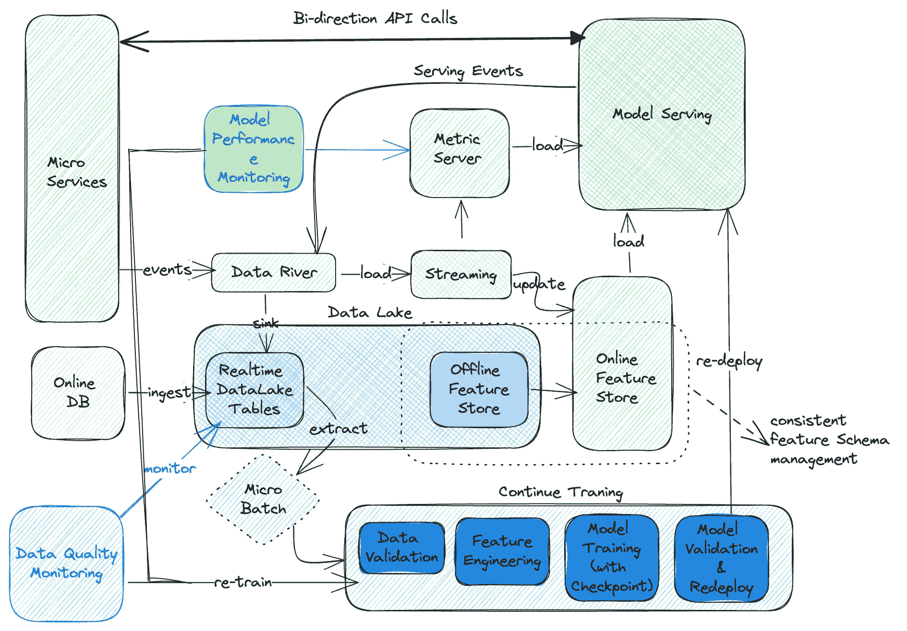

# 从数据平台到机器学习平台

> 原文：[`towardsdatascience.com/from-data-platform-to-ml-platform-4a8192edab5d?source=collection_archive---------0-----------------------#2023-10-22`](https://towardsdatascience.com/from-data-platform-to-ml-platform-4a8192edab5d?source=collection_archive---------0-----------------------#2023-10-22)

## 数据/机器学习平台如何演变并支持复杂的 MLOps 实践

 [ming gao](https://medium.com/@ming.gao.gm?source=post_page-----4a8192edab5d--------------------------------)

·

[关注](https://medium.com/m/signin?actionUrl=https%3A%2F%2Fmedium.com%2F_%2Fsubscribe%2Fuser%2F56b61a38427c&operation=register&redirect=https%3A%2F%2Ftowardsdatascience.com%2Ffrom-data-platform-to-ml-platform-4a8192edab5d&user=ming+gao&userId=56b61a38427c&source=post_page-56b61a38427c----4a8192edab5d---------------------post_header-----------) 发表在[Towards Data Science](https://towardsdatascience.com/?source=post_page-----4a8192edab5d--------------------------------) · 9 分钟阅读 · 2023 年 10 月 22 日

--

数据/机器学习（Data/ML）一直是我们技术领域中最受欢迎的话题。我想分享一下我对数据/机器学习平台的理解，以及这些平台如何从基础发展到复杂。最后，我会尽力涵盖 MLOps，即管理机器学习项目的原则。

关于我，这里是[我的 LinkedIn](https://www.linkedin.com/in/ming-gao-57509a101/)。

# 旅程的开始：在线服务 + OLTP + OLAP

在最开始时，数据基础设施可能相当简单。分析查询可能会发送到在线[OLTP 数据库](https://en.wikipedia.org/wiki/Online_transaction_processing)的只读副本，或者设置 OLAP 数据库作为数据仓库。

这里是可能的基础设施：

图片来源：作者

只要系统能够满足业务需求，就没有问题。满足我们业务需求的所有系统都是好的系统。如果它们简单，那就更好。

在这个阶段，有多种数据分析方法：

1.  仅向 OLTP 数据库的副本节点提交查询。（不推荐）

1.  启用 OLTP 数据库的 CDC（变更数据捕捉）并将这些数据导入到 OLAP 数据库。关于 CDC 日志的导入服务选项，你可以根据所选择的 OLAP 数据库来选择。例如，[Flink 数据流与 CDC 连接器](https://github.com/ververica/flink-cdc-connectors) 是处理此问题的一种方式。许多企业服务提供自己的建议解决方案，例如 [Snowpipe](https://quickstarts.snowflake.com/guide/CDC_SnowpipeStreaming_DynamicTables/index.html?index=..%2F..index#0) 适用于 Snowflake。也建议从副本节点加载数据，以保持主节点的 CPU/IO 带宽用于在线流量。

在这个阶段，ML 任务可能在本地环境中运行。你可以在本地设置一个 [Jupyter](https://jupyter.org/install) 笔记本，从 OLAP 数据库加载结构化数据，然后在本地训练 ML 模型。

这种架构的潜在挑战包括但不限于：

+   使用 OLAP 数据库管理非结构化或半结构化数据是困难的。

+   当处理海量数据时，OLAP 可能会出现性能回退。（单个 ETL 任务需要 TB 以上的数据）

+   对各种计算引擎的支持不足，例如 Spark 或 Presto。大多数计算引擎确实支持通过 JDBC 端点连接到 OLAP，但并行处理会受到 JDBC 端点自身的 IO 瓶颈严重限制。

+   存储海量数据在 OLAP 数据库中的成本很高。

你可能已经知道解决此问题的方向。建立一个数据湖！引入数据湖并不一定意味着你需要完全淘汰 OLAP 数据库。公司中有两种系统共存以满足不同用例仍然很常见。

# 数据湖：存储计算分离 + 写时模式

数据湖允许你持久化非结构化和半结构化数据，并执行按需模式。它允许你通过使用专门的存储解决方案存储大量数据来降低成本，并根据需求启动计算集群。它还允许你通过扩展计算集群轻松管理 TB/PB 数据集。

你的基础设施可能如下所示：

作者提供的图片

这确实是一个过于简化的图示。数据湖的实际实现可能要复杂得多。

现在许多云服务提供商已经有相当成熟的数据湖存储解决方案，例如 AWS S3 和 Azure ADLS。在这些存储解决方案之上仍然需要完成许多任务。例如，应该有一个 Hive metastore 来管理你的表元数据，以及一个 [Datahub](https://github.com/datahub-project/datahub) 提供数据可视性。还有一些具有挑战性的话题，如 *数据湖中的精细权限控制* 和 *数据血缘分析（例如* [spline](https://absaoss.github.io/spline/)*)*。

为了最大化你的数据湖的价值和效率，我们应该仔细选择每个数据湖层的文件格式和平均文件大小。

作者提供的图片

一般建议包括：

+   避免小文件：小文件是数据湖中高存储成本和性能差的主要原因之一。

+   在 *延迟*、*压缩* *比率* 和 *性能* 之间的平衡：具有文件格式如 [Hudi](https://hudi.apache.org/blog/2021/07/21/streaming-data-lake-platform/) 的低延迟数据湖表可能不会给你最佳的压缩比，而大容量的 ORC 文件高压缩比可能会带来性能噩梦。你可能需要根据表的使用模式、延迟要求和表大小来明智地选择文件格式。

一些成熟的 SaaS/PaaS 提供商如 [Databricks](https://www.databricks.com/) 提供了相当不错的数据湖（或现在的 LakeHouse）解决方案。你也可以探索 [ByteHouse](https://bytehouse.cloud/) 以获得统一的大数据分析体验。

在机器学习方面，团队可能会开始在远程环境中探索成熟的机器学习框架，如 Tensorflow 和 Pytorch。此外，训练好的机器学习模型可以部署到生产环境中进行在线模型推理。Tensorflow 和 Pytorch 都提供了服务解决方案，例如 TensorFlow Serving 和 Pytorch Serving。

然而，我们的旅程不会就此停止。我们现在可能面临以下挑战：

+   缺乏实时指标和特征管理，这对在线机器学习模型服务至关重要。

+   缺乏模型性能监控。

让我们进一步提升我们的游戏水平。

# 实时数据/机器学习基础设施：数据流 + 数据流媒体 + 特征存储 + 指标服务器

通常，构建实时数据基础设施是公司多个部门的共同努力。构建数据流的初衷通常不是为了数据/机器学习系统，而是通过消除同步调用来允许微服务进一步扩展。相反，微服务将通过与像 [Kafka](https://kafka.apache.org/) 这样的消息中间件进行通信而提高效率（代价是较低的一致性水平）。

整体架构可能如下所示。

作者提供的图片

有了在数据河流（例如[Kafka](https://kafka.apache.org/)）中的数据，我们可以构建数据流管道来处理实时数据。这些数据可以直接用于在线特征存储或同步到像[Pinot](https://github.com/apache/pinot)这样的度量服务器。度量服务器可以进一步处理/聚合这些度量点，形成更有用的模型性能度量和业务度量。你也可以采用像[RisingWave](https://www.risingwave.com/)这样的流数据库，它可以用 SQL 语法对流数据进行连接/聚合。

对于数据流构建，[Flink](https://flink.apache.org/)相当受欢迎。你也可以使用[带有 CDC 连接器的 Flink](https://ververica.github.io/flink-cdc-connectors/release-2.1/content/about.html)从 OLTP 数据库提取数据，并将数据发送到消息中间件和数据湖。

应该有一个在线特征存储，支持如[ScyllaDB](https://www.scylladb.com/)或 AWS Dynamo DB 等键值数据库。在线特征存储可以帮助你用与特定参考 ID（用户 ID、产品 UUID）相关联的特征向量丰富发送给模型服务的请求。这可以极大地解耦构建微服务的后台服务团队与构建 ML 模型的 ML 工程师团队之间的依赖关系。它允许 ML 工程师独立推出新的 ML 特征与新 ML 模型（*当你更新特征向量时，你的模型服务 API 签名对微服务的暴露将保持不变*）。

作者提供的图片

在书中，[设计机器学习系统](https://www.oreilly.com/library/view/designing-machine-learning/9781098107956/)提到了模型堆叠（[Jen Wadkin 的](https://threnjen.medium.com/) medium 帖子关于模型堆叠）。在模型服务中使用模型堆叠是相当常见的。当你想将异构模型堆叠在一起时，例如将 pytorch 和 tensorflow 模型堆叠在一起时，需要一个协调器。你还可以通过在路由请求到不同模型时根据模型性能动态调整权重，使你的协调器变得更加复杂。

现在我们有了一个复杂的系统。它看起来很酷，但带来了新的挑战：

+   如果不加以管理，系统的债务将迅速增加。

+   对 ML 工程师而言认知负担很重。

这时你可能需要思考 MLOps 如何帮助你。

# MLOps：抽象、可观察性和可扩展性

MLOps 从来不是一个具体的解决方案。它更像是一组用于管理 ML 系统的原则。与典型的软件项目不同，ML 系统受数据变化的影响很大，数据依赖管理并非易事。论文[机器学习系统中的隐性技术债务](https://proceedings.neurips.cc/paper_files/paper/2015/file/86df7dcfd896fcaf2674f757a2463eba-Paper.pdf)详细描述了这些挑战。因此，一个由 MLOps 驱动的 ML 平台必须能够：

+   数据变化监控和数据质量监控。

+   管理离线和在线环境中的 ML 特征。

+   可重复的 ML 管道，满足实验-操作对称性。

+   简洁的 ML 管道配置，可以抽象出基础设施的细节。

本文，[MLOps: 机器学习中的持续交付和自动化管道](https://cloud.google.com/architecture/mlops-continuous-delivery-and-automation-pipelines-in-machine-learning)，强调了[实验-操作对称性](https://cloud.google.com/architecture/mlops-continuous-delivery-and-automation-pipelines-in-machine-learning#characteristics_2)的重要性。它还描述了 MLOps 的自动化级别，从 level-0、level-1 到最终的 level-2。我非常喜欢这份文档中的图表，将借用它来解释 level-1 MLOps 的样子。

作者提供的图像。描述了[MLOps: 机器学习中的持续交付和自动化管道](https://cloud.google.com/architecture/mlops-continuous-delivery-and-automation-pipelines-in-machine-learning)中的 MLOps Level-1。

为了在您的组织中扩展这种 MLOps 实践，您需要提供简洁的 ML 管道配置，以便为 ML 工程师抽象出基础设施实现细节。这样，平台工程师也能在不对平台用户造成过多干扰的情况下灵活地升级 ML 平台。您可以考虑使用像 yaml 这样的配置文件来描述 ML 管道，并依靠您的 ML 管道控制器将其转换为实际的工作负载。

因此，让我们通过以下图表重新组织实时数据/ML 基础设施，以突出 MLOps 如何塑造我们的平台。

作者提供的图像

为了给您更好的了解 ML 管道可能的样子，这里是每个阶段的可能抽象示例。以下图表仅帮助您进一步理解配置的可能样子，并不代表任何实际实现，也不涵盖所有所需的方面。

ML 管道配置的一般概念。作者提供的图像

Kubernetes 是一种流行的解决方案，用于编排机器学习工作负载（或如今的所有工作负载）。你可以使用 CRD 提供用户与平台之间的简洁接口。在文章[我对 Kubebuilder 的思考](https://towardsdev.com/my-thinking-about-kubebuilder-443a9d45f1e)中，我分享了在使用 kubebuilder 构建 CRD 时的一些想法。

图片来源于作者

当然，我没有涵盖许多重要的子主题，包括但不限于：

+   超参数优化

+   分布式训练架构

# 接下来做什么

你可以看到***MLOps 只是给已知任务一个合适的名称***。这远不是任务完成。我分享的是一个有观点的机器学习操作平台实施策略。即便如此，创建高质量机器学习产品的门槛仍然很高，收集、处理和挖掘数据的工作量仍然很大。

除了这些挑战之外，我还想分享我观察到的机器学习领域的趋势。鉴于这个领域发展的如此快速，这绝对不是一个完整的列表。

+   无服务：我们将机器学习的价值抛在了很远的后面，因为机器学习平台通常建立在数据平台的基础上。这就像在移动时代强迫用户购买计算机来参与社交媒体平台一样。无服务的数据服务和数据引擎正在应对这个挑战。许多服务提供商探索自己的***无服务***解决方案，以降低采用门槛，例如[Databricks](https://docs.databricks.com/en/serverless-compute/index.html)、Snowflake、Bytehouse。公司可以在启动数据仓库、数据湖或湖仓后开始构建他们的机器学习产品。

+   AI 驱动的特征工程：好吧，AI 现在可以做一切，对吗？

+   MaaS 趋势：更强大的模型即服务（Model-as-a-Service）将会出现。公司可以直接利用机器学习的力量，而无需自己构建机器学习服务，从而极大地提升他们的业务。

正如我们都注意到的，机器学习领域发展如此迅速。在我打字的此刻，这篇文章可能已经过时。更多的想法已经出现并转化为现实。请告诉我你对机器学习操作的看法，或者我应该在哪些方面进一步学习。让我们一起保持进度！
