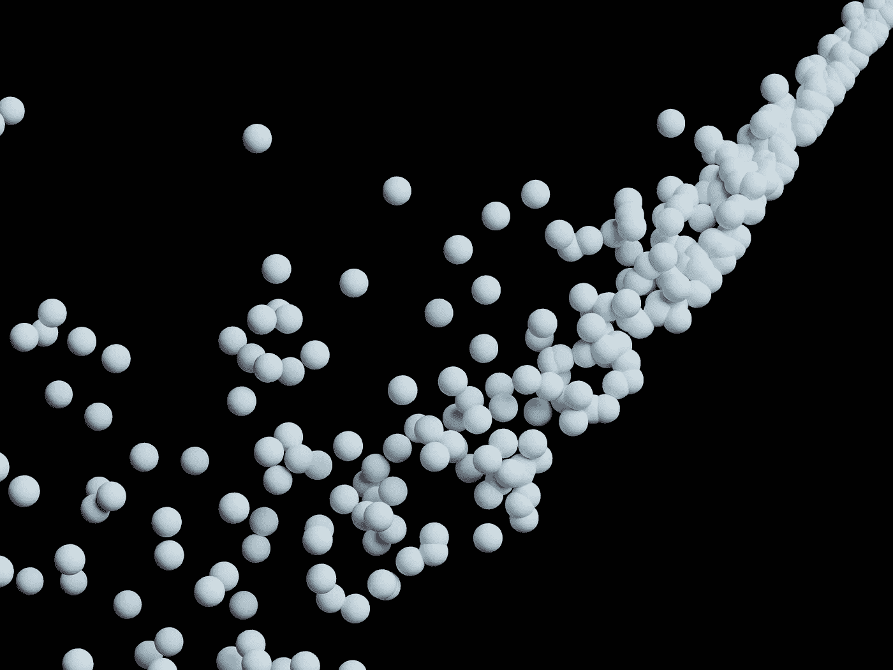

# 从数据到聚类：你的聚类方法什么时候才足够好？

> 原文：[`towardsdatascience.com/from-data-to-clusters-when-is-your-clustering-good-enough-5895440a978a?source=collection_archive---------5-----------------------#2023-04-26`](https://towardsdatascience.com/from-data-to-clusters-when-is-your-clustering-good-enough-5895440a978a?source=collection_archive---------5-----------------------#2023-04-26)

## 隐藏的宝藏可以通过聚类方法找到，但你需要正确的聚类方法和评估方法来创建合理的聚类。学习如何在四个步骤中找到它们。

 [Erdogan Taskesen](https://erdogant.medium.com/?source=post_page-----5895440a978a--------------------------------)

·

[关注](https://medium.com/m/signin?actionUrl=https%3A%2F%2Fmedium.com%2F_%2Fsubscribe%2Fuser%2F4e636e2ef813&operation=register&redirect=https%3A%2F%2Ftowardsdatascience.com%2Ffrom-data-to-clusters-when-is-your-clustering-good-enough-5895440a978a&user=Erdogan+Taskesen&userId=4e636e2ef813&source=post_page-4e636e2ef813----5895440a978a---------------------post_header-----------) 发表在 [Towards Data Science](https://towardsdatascience.com/?source=post_page-----5895440a978a--------------------------------) · 17 分钟阅读 · 2023 年 4 月 26 日 

--

图片来源：[Shubham Dhage](https://unsplash.com/@illustratiions?utm_source=unsplash&utm_medium=referral&utm_content=creditCopyText) 于 [Unsplash](https://unsplash.com/photos/3nwYFtexa4o?utm_source=unsplash&utm_medium=referral&utm_content=creditCopyText)

通过无监督聚

# 无监督聚类。

在无监督聚类中，我们旨在确定“*自然*”或“*数据驱动*”的分组…
