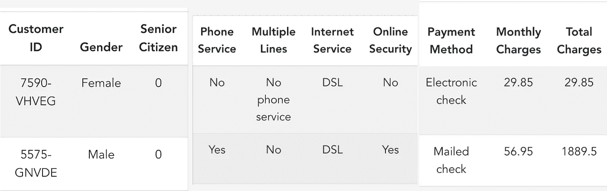
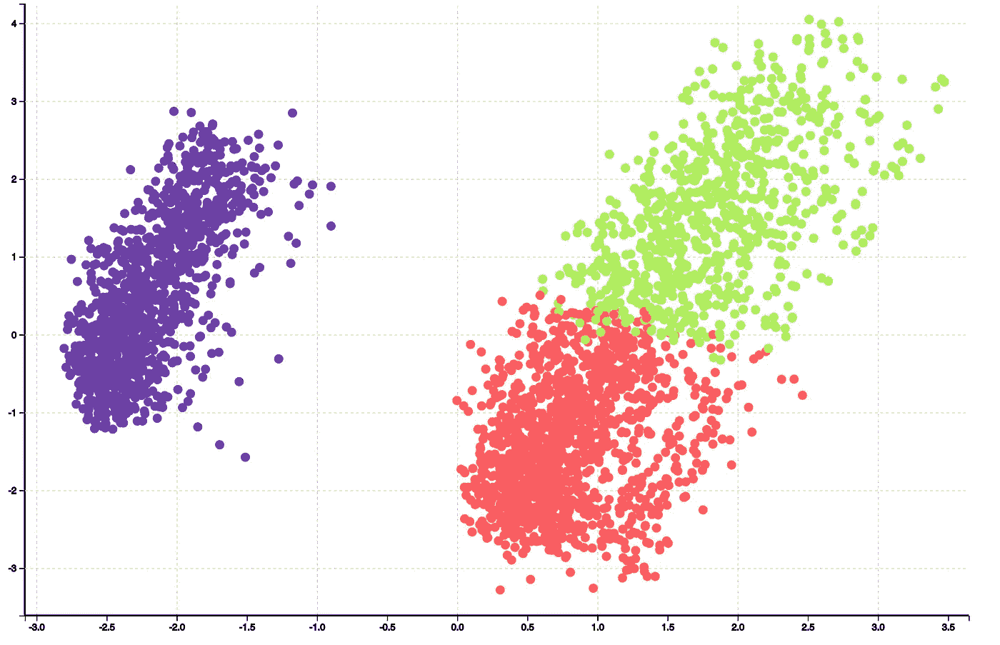
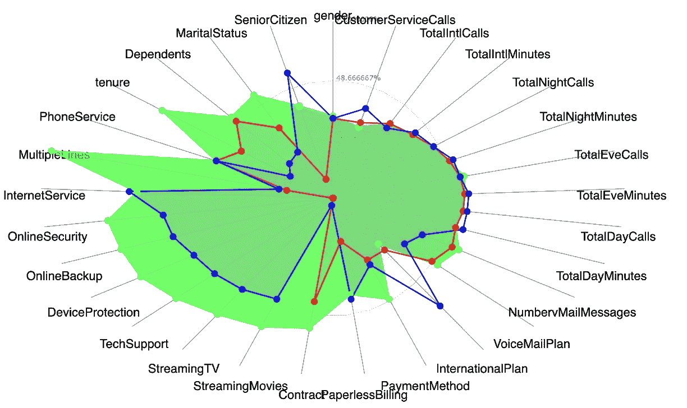
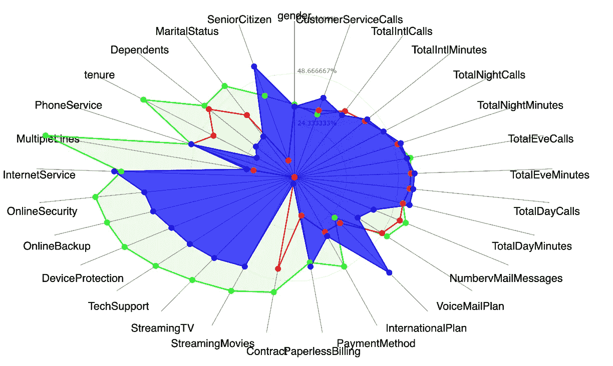
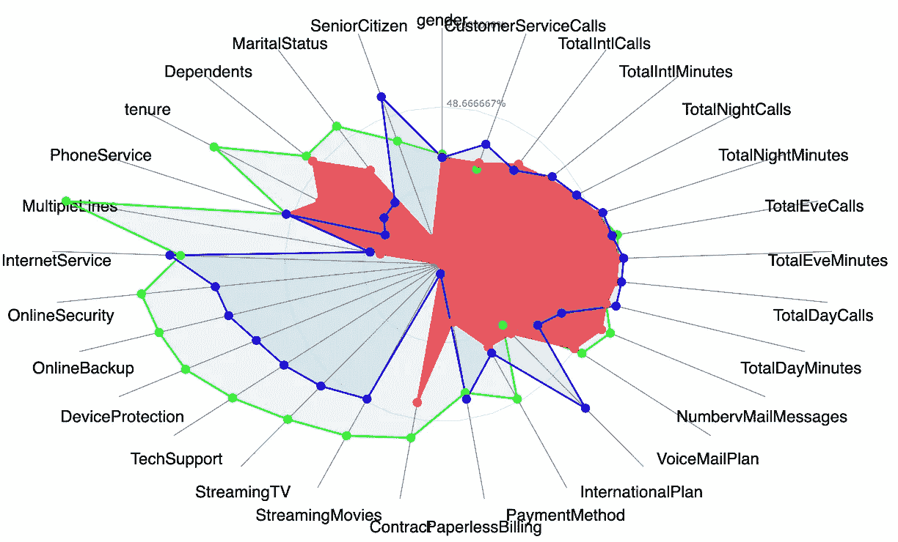

# 从数据到市场策略：利用行为分割

> 原文：[`towardsdatascience.com/from-data-to-market-strategy-using-behavior-segmentation-d065da224262`](https://towardsdatascience.com/from-data-to-market-strategy-using-behavior-segmentation-d065da224262)

## 如何为业务增长个性化你的产品

 [Pranay Dave](https://pranay-dave9.medium.com/?source=post_page-----d065da224262--------------------------------)

·发表于 [Towards Data Science](https://towardsdatascience.com/?source=post_page-----d065da224262--------------------------------) ·4 分钟阅读·2023 年 1 月 10 日

--

图片由 [Belinda Fewings](https://unsplash.com/@bel2000a?utm_source=unsplash&utm_medium=referral&utm_content=creditCopyText) 提供，发布在 [Unsplash](https://unsplash.com/s/photos/behaviour?utm_source=unsplash&utm_medium=referral&utm_content=creditCopyText)

74%的客户在你的产品服务没有个性化时感到沮丧（来源 [Forbes](https://www.forbes.com/sites/blakemorgan/2020/02/18/50-stats-showing-the-power-of-personalization/?sh=24c18e152a94)）。行为分割可以帮助解决这个问题。简单来说，行为分割就是了解客户行为——他们如何与您的产品或网站互动，他们的使用频率，他们花费多少，以及他们购买了哪些产品。

一旦你了解了客户行为，就可以个性化你的产品。这可以带来更高的客户满意度以及业务增长。在这篇博客中，你将看到如何利用行为分割从数据到市场策略的过程。

行为分割过程（作者提供的图像）

# 数据收集和特征创建

行为分割需要从各种来源收集数据，如网站导航数据、账单数据、产品购买数据等。数据越多，你就越能深入理解客户行为。

为了说明这一过程，让我们以一家电信公司为例。这里展示的是在客户层面创建的样本特征。它包含了人口统计信息、客户使用的服务以及账单信息。下图仅显示了 40 多个特征中的部分样本特征。

样本数据（作者提供的图像）

# **使用聚类进行分段**

我们可以使用聚类算法创建分段，并将每个客户分配到一个分段。下面展示的是聚类算法的结果。显示了三种分段，分别用蓝色、红色和绿色表示。每个点对应一个客户。

使用聚类进行分段（图像由作者提供）

# 分段解释

那么这些分段意味着什么？雷达图可以帮助我们解释这些分段。

例如，绿色聚类包含了那些服务时间最长的客户，他们使用所有服务，如互联网服务、在线备份、技术支持和流媒体电影。

解释绿色聚类（图像由作者提供）

蓝色聚类是服务时间最短、所有服务使用程度适中的客户。

解释蓝色聚类（图像由作者提供）

红色聚类对应的是只有电话服务且没有数字互联网服务的客户。

解释红色聚类（图像由作者提供）

# 市场策略

一旦解释完分段，下一步就是制定市场策略。

**绿色分段是数字互动客户。**

一种市场策略可以是创建数字忠诚卡，并根据数字服务的使用情况奖励客户。这也将增加公司的收入。

**蓝色分段是互动适中但服务时间较短的客户。**

一种市场策略可以是提供折扣并将他们转化为长期合同。

**红色分段是只有电话服务的基本客户。**

一种市场策略可以是向他们介绍数字服务的优势，然后推销数字产品。

# 结论

行为分段可以帮助制定个性化的市场策略。在这篇博客中，你看到了开发这种个性化市场策略的过程。

## **数据源引用**

本博客使用的数据集来自于这里提供的电信数据集。[**允许商业和非商业用途**](https://www.ibm.com/community/terms-of-use/download/)**。**

 [## 电信客户流失 (11.1.3+)

### 编辑描述

community.ibm.com](https://community.ibm.com/community/user/businessanalytics/blogs/steven-macko/2019/07/11/telco-customer-churn-1113?source=post_page-----d065da224262--------------------------------)

请通过我的推荐链接**加入 Medium**。

 [## 通过我的推荐链接加入 Medium - Pranay Dave

### 阅读 Pranay Dave（以及 Medium 上的其他成千上万的作者）的每一个故事。你的会员费用直接支持……

[pranay-dave9.medium.com](https://pranay-dave9.medium.com/membership?source=post_page-----d065da224262--------------------------------)

请**订阅**以保持更新，每当我发布新故事时您将会知晓

[## 每当 Pranay Dave 发布内容时，获取电子邮件通知](https://pranay-dave9.medium.com/subscribe?source=post_page-----d065da224262--------------------------------)

### 每当 Pranay Dave 发布内容时，您将收到一封电子邮件。通过注册，如果您还没有 Medium 账户，系统将为您创建一个……

[pranay-dave9.medium.com](https://pranay-dave9.medium.com/subscribe?source=post_page-----d065da224262--------------------------------)

## **进一步阅读**

请查看我的相关博客。

[## 从数据到营销策略：使用交易细分](https://pranay-dave9.medium.com/from-data-to-marketing-strategy-using-transactional-segmentation-640b527a677b?source=post_page-----d065da224262--------------------------------)

### 如何有效利用细分市场实现商业增长

towardsdatascience.com

## YouTube 频道

您也可以在我的 YouTube 频道观看有关行为细分的视频

## 网站

您可以访问我的网站，这是一个无代码平台，用于学习数据科学。[**https://experiencedatascience.com**](https://experiencedatascience.com/)
