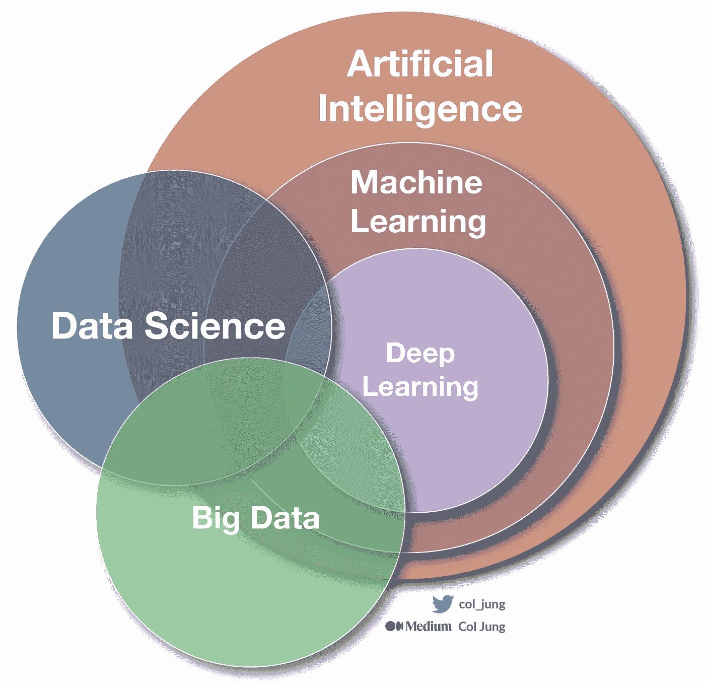

# 从数据仓库和数据湖到数据网格：企业数据架构指南

> 原文：[`towardsdatascience.com/from-data-warehouses-and-lakes-to-data-mesh-a-guide-to-enterprise-data-architecture-e2d93b2466b1`](https://towardsdatascience.com/from-data-warehouses-and-lakes-to-data-mesh-a-guide-to-enterprise-data-architecture-e2d93b2466b1)

## 了解大型公司中的数据运作方式

 [Col Jung](https://col-jung.medium.com/?source=post_page-----e2d93b2466b1--------------------------------)

·发布于 [Towards Data Science](https://towardsdatascience.com/?source=post_page-----e2d93b2466b1--------------------------------) ·19 min 阅读·2023 年 5 月 12 日

--

图片： [Headway](https://unsplash.com/photos/5QgIuuBxKwM) (Unsplash)

数据科学课程与现实世界中处理数据的*现实*之间存在脱节。

当我在半年前进入澳大利亚四大银行之一的第一个分析岗位时，我面临着一个复杂的数据环境，其特征为…

+   **查找**、**访问**和**使用**数据的挑战；

+   **竞争**的业务优先级将人们拉向不同的方向；

+   难以维护和升级的**遗留**系统；

+   对数据驱动洞察力有抵触的传统**文化**；

+   **孤立**的团队彼此之间没有沟通。

**更新**：我现在在 [YouTube](https://www.youtube.com/@col_builds) 上发布分析内容。

一段时间，我踏实地工作，接受了这样一个想法：也许这就是企业数据领域的现实。我相信，虽然我们的技术堆栈以非常快的速度发展，但用户体验最终会赶上…

我接受了数据科学培训，但实际上进行*数据科学*并非易事。在线课程并未为此做好准备。

但问题在这里。

经过一些挖掘，我意识到我的组织并不是唯一面临这些数据挑战的——这些挑战在整个行业中都是**普遍存在的**。

我们正处于技术创新的熔炉中，事物以惊人的速度发展。计算能力正在[快速增长](https://generativeai.pub/cloud-computing-unleashed-how-to-harness-the-power-of-cloud-for-your-business-f72e8e23be9)，机器学习应用已经[无处不在](https://medium.com/geekculture/ai-revolution-your-fast-paced-introduction-to-machine-learning-914ce9b6ddf)，前沿的[生成式 AI](https://generativeai.pub/the-road-to-chatgpt-gpt-4-how-deep-learning-revolutionised-natural-language-processing-835d89560577)和[AI 艺术](https://col-jung.medium.com/generative-ai-art-the-road-to-dall-e-midjourney-stable-diffusion-3b3219d97f02)正在[颠覆各个行业](https://col-jung.medium.com/future-of-work-is-your-career-safe-in-the-age-of-chatgpt-gpt-4-122d5996bd57)，且[没有停止的迹象](https://medium.com/geekculture/from-chatgpt-to-singularity-the-search-for-a-truly-intelligent-machine-856c8f4c5e63)，消费者的期望也在[不断变化](https://medium.com/swlh/power-of-storytelling-in-business-data-analytics-your-data-is-only-half-the-story-f50fadf9712b)。

所有参与分析行业的人都在努力找到自己的立足点。我们都在一起跌跌撞撞地前行。快速失败，迅速前进。

这就是我撰写这篇文章的原因。

我想分享我的见解，并帮助像毕业生、新业务分析师和自学的数据科学家这样的专业人士快速了解企业级数据格局，并设定期望。

# 1\. 数据是数字化的命脉

首先，让我们对数据在今天竞争激烈、节奏迅速的商业环境中扮演的关键角色达成一致。

各行各业的公司都在朝着[数据驱动](https://generativeai.pub/modern-enterprise-data-strategy-a-guide-for-analysts-data-scientists-engineers-2d4b45a31427)的决策方式迈进。

与此同时，消费者越来越期望**超个性化的数字产品和服务**，这些产品和服务利用[像 AI 和机器学习这样的强大分析工具](https://medium.com/geekculture/ai-revolution-your-fast-paced-introduction-to-machine-learning-914ce9b6ddf)，这些工具在公司能掌握的所有优质数据上进行训练。

[AI 和机器学习的世界](https://medium.com/geekculture/ai-revolution-your-fast-paced-introduction-to-machine-learning-914ce9b6ddf)如何与企业分析交汇。图片由作者提供

它使你能够按需观看个性化的电视节目（*娱乐*），订购食物并在一小时内送到（*食品杂货与购物*），以及在几分钟内获得预批准的抵押贷款（*住房*）。

这意味着一个前瞻性的*数据堆栈*对于生存和发展至关重要，因为**数据是数字化的命脉**。

正如英国数学家克莱夫·汉比在[2006 年](https://www.thedrum.com/opinion/2022/12/12/data-isn-t-the-new-oil-it-s-way-more-valuable)所说：

> “数据是新的石油。”

IT 部门和数据平台不再是地下室里的“宅男”——它们现在是[企业战略](https://generativeai.pub/modern-enterprise-data-strategy-a-guide-for-analysts-data-scientists-engineers-2d4b45a31427)的**核心部分**。

**数据现在是一个一流公民。**

因为数据驱动一切。

所以不再废话，让我们深入探讨大型公司如何组织、处理和存储数据。

从我们的直升机俯瞰，你会看到景观被划分为**操作数据**和**分析数据**。

企业数据景观的 30,000 英尺视图。来源：Z. Dehghani 于[MartinFowler.com](https://martinfowler.com/articles/data-mesh-principles.html)，作者进行了修订

阅读我的*解释 101*，了解[企业数据战略](https://generativeai.pub/modern-enterprise-data-strategy-a-guide-for-analysts-data-scientists-engineers-2d4b45a31427)。

# 2\. 操作（和事务）数据

**操作数据**通常以个别记录的形式出现，这些记录代表特定事件，例如销售、购买或客户互动，并且是企业依赖于其日常运营的信息。

操作数据存储在数据库中，并由*微服务*访问，微服务是帮助管理数据的小软件程序。数据不断更新，代表了业务的当前状态。

**事务数据**是一种重要的操作数据类型。银行中的*事务*示例包括：

+   银行账户之间的资金流动；

+   商品和服务的付款；

+   客户与我们某个渠道的互动，例如：分支机构或在线。

从应用程序中‘热出’的事务数据称为*源数据*，或*记录系统（SOR）*。源数据没有经过转换，它是……

+   *数据科学家*所偏好的数据格式；

+   进入*数据湖*的数据格式；

+   任何*数据溯源*的开始。

更多这些想法稍后会讲到。

称为**在线事务处理（OLTP）**系统的事务数据处理系统，必须快速处理许多事务。它们依赖于可以快速存储和检索数据的数据库，并通过实施称为[*ACID 语义*](https://www.databricks.com/glossary/acid-transactions)的规则确保数据的准确性：

+   *原子性 —* 每个事务被视为一个单独的单位。我们不想把两个电汇或购买混在一起！

+   *一致性 —* 事务要么全部成功，要么全部失败。我购买的烤猪肉要么成功，要么失败！

+   *隔离性 —* 多个事务可以同时发生而不会互相干扰。这是可扩展性的核心原则。

+   *持久性 —* 即使系统关闭，数据变更也会被保存。丢失操作数据会使你的业务陷入困境。

OLTP 系统用于重要的业务应用程序，这些应用程序需要准确、快速且规模化地工作。

在银行业，OLTP 系统处理存款、取款、转账和余额查询，包括在线银行应用程序、信用卡和借记卡授权系统、支票处理器和在银行间转账的电汇系统。

正如你所见，OLTP 系统通常是企业与其客户之间的基本接口。

# 3. 分析数据

**分析数据**是公司运营或事务数据的时间（基于时间）和汇总（合并）视图。这提供了组织*事实*的汇总视图，旨在：

+   获得对**过去**业务表现的洞察（*描述性*和*诊断*分析）；

+   为**未来**做出数据驱动的决策（*预测*和*处方*分析）。

从描述性分析到预测建模。作者提供的图片。

分析数据经常用于[创建仪表板和报告](https://col-jung.medium.com/intro-to-power-bi-from-data-modelling-to-stunning-reports-b34aac43d8a1)（通常由**数据分析师**构建）和[训练机器学习模型](https://medium.com/@col-jung/ai-revolution-your-fast-paced-introduction-to-machine-learning-914ce9b6ddf)（**数据科学家**）。

查看我的逐步指南，了解如何训练回归和分类模型，使用 Python —— 当代数据科学的基本技能。

企业正朝着越来越强大的商业智能（BI）工具和无代码机器学习平台迈进，以努力***实现数据和分析能力的民主化***。

这个观点是，许多公司今天只拥有少量或*孤岛*的高级分析技能。游戏的改变者在于赋能全组织的 10,000 名非技术同事，提供合适的技能和工具，提升*整体*生产力，这超越了对一个 20 人数据科学团队进行微调的边际收益。（对不起，我的数据科学朋友们！）

所以关注**数据民主化** —— 这现在是一个重要话题。

总体而言，分析*处理*不同于事务处理，因为前者专注于*分析*数据，而后者则专注于*记录*特定事件。

分析处理*系统*通常利用只读系统，这些系统存储大量的历史数据或业务指标。分析可以在某一时间点的数据快照上进行。

现在，让我们连接运营数据和分析数据之间的点。

操作数据通过**数据管道**转换为分析数据，这些管道通常由**数据工程师**构建。

这些“管道”通常是**ETL 管道**——涉及***提取***操作系统中的数据，***转换***以满足业务需求，并***加载***到数据仓库或数据湖中，以便分析。

ETL 管道连接操作数据存储和分析数据存储。图片由作者提供

阅读我的*解释者 101* 关于数据民主化。

# 4. 数据仓库与数据湖

整个分析数据层——企业存储其分析数据的地方——已分化为两种主要架构和技术栈：

+   数据仓库；

+   数据湖。

不同的用户可能在企业架构的不同阶段执行数据工作。

+   **数据分析师**通常在数据仓库中查询表格和聚合数据，以生成有效的仪表板、报告和可视化，这些[业务用户和决策者会使用](https://medium.com/swlh/power-of-storytelling-in-business-data-analytics-your-data-is-only-half-the-story-f50fadf9712b)。

+   **数据科学家**通常在数据湖中工作，以探索在***影子*生产环境**中的数据。这意味着在*开发*（即非生产）环境中对数据处理和建模进行原型设计，使用由**数据工程师**精心准备的*实时*（即生产）数据。一旦业务确认模型的价值，**ML 工程师**将其投入生产，以便模型可以在 24/7 运营团队（MLOps）的监督下为内部和外部客户提供服务。

数据仓库与数据湖。来源：Z. Dehghani 于 [MartinFowler.com](https://martinfowler.com/articles/data-mesh-principles.html) 由作者修订

对于那些新接触企业 IT 的人来说，你需要掌握两种主要的*环境*：

+   **非生产环境**，你可以在其中构建和尝试各种东西。变化代价低，破坏不会影响你的业务。也称为**开发者**环境。项目由组织的**资本支出（CapEx）**资助。

+   **生产环境**是你将最终完成并签署的应用程序、数据、管道和系统部署给真实客户的地方。你的工作现在是**在线**的。确保它很好，因为改变是昂贵的。*生产环境*——如口语中所称——是高度安全的封闭环境，由一个*运维*或*运行团队*负责，该团队的资金来自于组织的**运营支出（OpEx）**。我在[这里](https://generativeai.pub/cloud-computing-unleashed-how-to-harness-the-power-of-cloud-for-your-business-f72e8e23be9)写过有关资本支出与运营支出的更多内容。

简而言之，在非生产环境中构建东西，然后将其部署到生产环境中。明白了！

好的，让我们现在深入了解这两种数据架构的一些细节。

## 4.1 数据仓库

**数据仓库**是一种成熟的方式来存储**结构化数据**，采用**关系模式**，并且优化了读取操作——主要是 SQL 查询，用于支持 BI、报告和可视化。

数据仓库的一些特点：

+   **历史分析**：数据仓库几十年来一直是描述性分析的主力，提供了快速查询和连接大量历史数据的能力。

+   **写时模式**：数据仓库传统上采用*写时模式*的方法，其中表的结构或**模式**在前期就已定义。

一个常见的星型模式。图片由作者提供

+   **数据建模**：虽然数据分析师和数据科学家可以直接在分析数据存储中处理数据，但通常会创建**数据模型**来预先汇总数据，以便更容易生成报告、仪表板和交互式可视化。一个常见的数据模型——称为**星型模式**——基于包含你想要分析的数值的**事实**表（例如，某些与***销售***相关的金额），这些表与代表你想要测量的实体（例如***客户***或***产品***）的**维度**表*相关*——因此被称为*关系型*数据库。

+   **快速查询**：数据仓库中的数据可能会被汇总并加载到一个**在线分析处理（OLAP）**模型中，也称为**立方体**。来自事实表的数值（**度量**）会在一个或多个维度上预先汇总——例如，通过维度***客户***、***产品***和***时间***汇总的总收入（来自事实***销售***表）。从视觉上看，这就像是一个三维立方体中的三个维度的交集。从收益方面来看，OLAP/立方体模型捕捉了支持“钻取/上钻”分析的关系，查询速度很快，因为数据是预先汇总的。

“立方体”。度量（例如，销售）按时间、客户和产品维度进行汇总。图片由作者提供

+   **文件类型**：结构化数据文件包括可读格式如*CSV*和*XLSX*（Excel），以及优化格式如*Avro*、*ORC*和*Parquet*。关系数据库也可以存储半结构化数据，如*JSON*文件。

阅读我的*Explainer 101*关于数据仓库和数据建模。

## 4.2 数据湖

数据湖是存储大量基于文件的数据以支持数据科学和大规模分析数据处理场景的行业事实标准方法。

+   **分布式计算与存储**：数据湖使用分布式计算和分布式存储来处理和存储大量可能的**非结构化数据**。这意味着数据被存储和处理在可能数千台机器上，称为**大数据集群**。这种技术在 2010 年代兴起，由**Apache Hadoop**推动，这是一组开源大数据软件，使组织能够将大量数据分布到多台机器上（*HDFS*分布式存储）并对存储在这些机器上的表进行类似 SQL 的查询（*Hive*和*Spark*分布式计算）。*Cloudera*和*Hortonworks*等公司后来将 Apache 软件商业化，推出了简化全球组织入门和维护的软件包。

+   **按需模式**：数据湖使用*按需模式*，即只有在读取数据时才创建模式。这意味着数据可以批量存储在数据湖中，而不需要立即定义模式，从而允许在后续的特定用例中创建模式——这正是数据科学家进行建模所需的灵活性。

+   **文件类型**：数据湖是**非结构化数据**的家园——这包括像*txt*和*doc*这样的文本文件，像*MP3*和*WAV*这样的音频文件，像*JPEG*和*PNG*这样的图像文件，像*MP4*这样的视频文件，甚至包括整个 PDF 文件、社交媒体帖子、电子邮件、网页和传感器数据。数据湖（以及 NoSQL 数据库）也允许你按原样存储**半结构化数据**，如*JSON*和*XML*文件。

+   **云计算**：数据湖越来越多地托管在像*Amazon Web Services*、*Microsoft Azure*和*Google Cloud*这样的公共云提供商上。这种*弹性*和*可扩展*的基础设施使组织能够自动快速地调整计算和存储资源的变化需求，同时保持性能，并仅为实际使用的部分付费。有[三种常见的云计算类型](https://generativeai.pub/cloud-computing-unleashed-how-to-harness-the-power-of-cloud-for-your-business-f72e8e23be9)，它们在云提供商和客户端之间有不同的共享责任划分。最灵活的**基础设施即服务（IaaS）**允许你本质上租用数据中心中的空白空间。云提供商维护物理基础设施和互联网访问。相比之下，**软件即服务（SaaS）**模型中，客户端租用一个通过互联网运行的完全开发的软件解决方案（比如*Microsoft Office*）。对于企业数据，最受欢迎的云计算模型是中间地带的**平台即服务（PaaS）**，其中提供商选择操作系统，客户端可以在其上构建数据架构和企业应用程序。

云计算类型与共享责任模型。作者提供的图片

+   **实时分析与流处理**：像*Apache Kafka*这样的技术使数据能够近乎实时地处理，作为持续的*数据流*，使公司能够解锁*即时*的洞察和趋势，或者对事件发生时采取*立即*响应的行动。例如，将及时的产品和服务推荐无缝地传递到客户的手机上，*准确*地在他们最可能受益的时间和地点——就像我的银行在我到达机场时为我提供旅行保险一样。或者考虑在客户即将向骗子转账时，能够实时主动地警告他们，从而保护他们的财务安全。这种**大数据**、**快速低延迟计算**和**机器学习**的全能融合是全球各行业超个性化服务的关键推动力。

阅读我的*Explainer 101*文章，了解[云计算](https://generativeai.pub/cloud-computing-unleashed-how-to-harness-the-power-of-cloud-for-your-business-f72e8e23be9)和[企业生成式 AI](https://generativeai.pub/how-big-companies-are-scrambling-to-adopt-generative-ai-d52456fb4c69)。还可以查看我关于[Azure Synapse & Fabric](https://generativeai.pub/azure-synapse-analytics-in-action-7-real-world-use-cases-explored-c73ef231b408)的文章——微软试图将数据仓库和大数据整合到一个平台下。

Ps…喜欢这个故事吗？当我发布类似的文章时，获取一份[电子邮件](https://col-jung.medium.com/subscribe)。

# 数据网格与数据产品

架构师 Zhamek Dehghani [概述](https://martinfowler.com/articles/data-monolith-to-mesh.html) 了企业数据领域在三个代际中的演变——挑战、进展和失败：

> **第一代**：*专有的企业数据仓库和商业智能* 平台；这些解决方案价格昂贵，导致公司积累了同样**大量的技术债务 [以数千个不可维护的 ETL 作业的形式]**，以及只有少数专业人员理解的表格和报告，从而导致对业务的积极影响未得到充分发挥。
> 
> **第二代**：*大数据生态系统，以数据湖作为灵丹妙药*；复杂的大数据生态系统和由中央团队操作的长期批处理作业，创造了**数据湖怪兽**，这些怪兽最多只是支持了局部的研发分析；承诺过多而实现不足。
> 
> **第三代（当前代）数据平台**：与前一代类似，具有现代化的流式处理特点，支持实时数据可用性，架构统一批处理和流处理以进行数据转换，以及全面采用云管理服务来处理存储、数据管道执行引擎和机器学习平台。

当前的数据湖架构可以总结为：

+   **集中式**。所有分析数据都存储在一个地方，由一个没有数据领域知识的中央数据工程团队管理，这使得难以发挥数据的全部潜力或修复源头的数据质量问题。与*去中心化*架构相对，后者将数据摄取分散到整个业务团队。

+   **与领域无关**。一种力求服务所有人而不特别迎合任何人的架构。一个全能的平台。与*领域驱动*架构相对，后者中数据由不同的业务领域拥有。

+   **单体**。数据平台构建为一个难以更改和升级的大块。与*模块化*架构相对，后者允许调整和修改单个部分或微服务。

一个中央数据团队管理着一个单体的与领域无关的数据湖（还是数据怪兽？）。来源：[数据网格架构](https://www.datamesh-architecture.com/)（经许可）

问题很明显，某些解决方案似乎也已经显现。

进入 **数据网格**。

数据网格是 [下一代](https://martinfowler.com/articles/data-mesh-principles.html) [数据架构](https://www.datamesh-architecture.com/)，它从单一的集中式数据团队转向*去中心化*的设计，其中数据由整个组织中最了解它的团队拥有和管理，这被称为**领域驱动的拥有权**。

重要的是，每个业务单元或领域都致力于注入*产品思维*，以创建高质量和可重用的**数据产品**——一个被数据的*生产者*[视为产品](https://generativeai.pub/data-products-why-your-organisation-needs-them-4ac7bf2e5953)的自包含和可访问的数据集——然后可以发布和分享给网格中其他领域和业务单元的*消费者*——这些被称为网格中的**节点**。

数据网格：各个业务单元共享精心构建的数据，符合‘产品标准’。来源：[数据网格架构](https://www.datamesh-architecture.com/)（已获许可）

数据网格使团队能够在更大的自主权和灵活性下独立工作，同时确保数据的一致性、可靠性和良好的治理。

这是我工作中的一个例子。

目前，我们客户的交易、产品、收入和负债数据都存放在我们集中式的数据湖中。（也包括我们的数据仓库。）

未来，随着我们在整个银行内联合能力和所有权，***信用风险***领域的自有数据工程师可以独立创建和管理他们的数据管道，而不依赖于一个远离业务并缺乏信用专业知识的集中式数据接收团队。

这个信用团队将**自豪**地构建和优化高质量、战略性和可重用的数据产品，这些产品可以分享给网格中的不同节点（业务领域），为***抵押贷款***团队提供可靠的信用信息，以便更好地决策批准住房贷款。

同样，这些数据产品也可以被***消费者信用***领域利用，开发机器学习模型，更好地了解我们的信用卡客户的行为，从而提供更好的服务并识别风险客户。

这些是利用数据产品在网格中发挥战略价值的例子。

网格的四个原则：领域所有权、数据即产品、自助平台、联合治理。来源：[数据网格架构](https://www.datamesh-architecture.com/)（已获许可）

数据网格培育了一种数据拥有和协作的文化，在这种文化中，数据被视为**一级公民**，并且进一步**产品化**，在团队和部门之间无缝共享，而不是在孤立团队为特定临时任务打造的经常重复的 ETL 管道中滞留。

数据网格促使组织从成本高昂且效率低下的**基于项目的思维方式**转向可扩展和前瞻性的**基于产品的思维方式**。

阅读我的*Explainer 101*文章，了解[数据产品](https://generativeai.pub/data-products-why-your-organisation-needs-them-4ac7bf2e5953)和数据网格。

# 6\. 数据治理

数据治理就像一场大规模的*谁是老板*游戏，但针对数据。就像这个节目一样，有很多复杂的关系需要处理。

这涉及到确定谁负责哪些数据，谁可以访问数据，谁需要保护数据，以及有什么控制和监控措施来确保事情不会出错。

在我的工作场所，有 40,000 名员工，众多流程和竞争的优先事项，这使得维持秩序和确保每个人步调一致似乎是一项真正的挑战。

对于数据分析师、数据科学家和开发人员来说，数据治理可能像那个总是想知道你在干什么的烦人朋友。但对于组织，特别是那些受监管良好的组织，它们是绝对必要的。否则，这就像没有马戏团总指挥的马戏团——混乱、难以管理，并且**非常危险**。

数据治理组件。作者提供的图片

数据治理的一些核心考虑因素是：

**数据隐私**。这就像试图将你尴尬的童年照片藏起来不让世界看到。但对于企业来说，这比糟糕的发型严重得多。假设一家银行意外泄露了所有客户的财务信息。这将花费他们大量的现金，更重要的是，失去信任。

**数据安全**。你需要确保客户的数据不受外部威胁（如黑客）和内部威胁（如不良员工）的影响。这意味着要有强大的认证系统、容错的防火墙、坚不可摧的加密技术和全天候的网络安全监控。没有人愿意他们的数据被拍卖到黑暗网络上，落入罪犯之手。

**数据质量**。想象制作三明治——使用腐烂的食材，你会得到一顿糟糕的餐点。如果你的数据质量很差，你会得到没人愿意品尝的不可靠洞察。如果你处于受监管的行业，你最好确保你的三明治用的是新鲜的食材，否则你的数据可能无法满足合规要求。

维护有关数据在企业中流动的可靠信息——即**数据血缘**——对于确保数据质量和在出现问题时进行故障排除至关重要。

数据隐私、数据安全和/或数据质量薄弱意味着更多的**数据风险**。

这就是**数据所有权**的作用。谁来决定数据的使用和管理？谁*承担了风险*，以防出现问题？

在实践中，这有点像热土豆游戏，没人真正想长时间握住那个土豆。但总得有人负责，这样我们才能避免数据问题，并保持我们的土豆热乎、新鲜和安全。

向 mesh 的转变旨在：

+   提升全方位的数据质量（通过可重用的数据产品）；

+   优化数据所有权（让适当的领域拥有他们的数据）。

+   简化数据血缘（告别分散的 ETL，转向集中化的数据湖）。

请参阅我的*解释员 101*文章，了解数据治理。

# 7\. 最后的话

企业级数据领域常常令人困惑，技术债务的积累源于实验周期后的过度修正，类似于股市的波动。

尽管大型公司的故事各不相同，但它们有一些共同点。其中之一是有机扩展至一个庞大而令人畏惧的企业数据仓库，随后是热切接受一个*集中式*数据湖，旨在节省成本、集中专业知识并放大数据价值。

这种方法带来了全新的问题。因此我们再次回到了起点——这一次大幅度地向*去中心化*数据堆栈转变，将数据管理下放到最了解自己数据的团队。

呼！就像一群企鹅在不断变化的冰面上缓慢移动。

以个人背景为例，我所在的银行经历了本文中描述的所有数据架构时代。

我们花了几十年时间在数据仓库上。然后，我们开始了现在已经持续了 7 年的旅程，旨在建立一个战略数据湖，成为我们数据基础设施的基石。

长话短说，我们的数据仓库和数据湖现在依然存在，且以一种有些尴尬的方式共存。（这仍在持续改进中……）

我们已经开始了自己的旅程，将数据湖去中心化向网状架构。我们正在通过利用[可重用数据产品](https://generativeai.pub/data-products-why-your-organisation-needs-them-4ac7bf2e5953)的力量，破解我们数据领域的意大利面般复杂性。

目前，大公司专注于解决在其数据领域积累的几十年的技术债务。图片由作者提供

我很自豪地说，在澳大利亚的*四大银行*中，我们显然领先。这非常令人高兴，因为大型蓝筹公司通常不在技术创新的前沿。

像许多公司一样，我们面临着巨大的挑战，因为这些技术债务是数百个项目的副产品，由多年来进进出出的数千位同事推动。

我的在线数据科学课程——由公司慷慨赞助——教会了我如何处理数据和训练逻辑回归模型及梯度提升树，但对在大型组织中处理数据的现实准备不足。

在我第一天上班时，我以为会被直接提供一些美味的数据，然后立即开始模型训练。

希望我已经走得很远了，远离达宁-克鲁格曲线？来源：[维基百科](https://en.wikipedia.org/wiki/Dunning%E2%80%93Kruger_effect)

就像福雷斯特·甘普发现的那样，生活并不像想象中那么简单。

通过尝试和失败——我亲身体验到，作为数据科学家，有许多技能决定了你的影响力，远超课程所能提供的——从业务参与到[数据讲述](https://medium.com/swlh/power-of-storytelling-in-business-data-analytics-your-data-is-only-half-the-story-f50fadf9712b)，再到政治博弈和不断演变的企业数据环境中的所有复杂细节。

通过撰写这篇文章，我希望能让你避免一些我自己曾经遇到的绊脚石。

告诉我你是否在自己的旅程中也有类似的经历！

在 [Twitter](https://twitter.com/col_jung) 和 YouTube 上找到我，[在这里](https://youtube.com/@col_builds)、[在这里](https://youtube.com/@col_invests) 和 [在这里](https://youtube.com/@col_shoots)。

# 我的热门 AI、ML 和数据科学文章

+   AI 和机器学习：快速入门——[在这里](https://col-jung.medium.com/ai-revolution-your-fast-paced-introduction-to-machine-learning-914ce9b6ddf)

+   机器学习与机制建模——[在这里](https://medium.com/swlh/differential-equations-versus-machine-learning-78c3c0615055)

+   数据科学：现代数据科学家所需的新技能——在这里

+   生成性 AI：大公司如何争相采用——[在这里](https://generativeai.pub/how-big-companies-are-scrambling-to-adopt-generative-ai-d52456fb4c69)

+   ChatGPT & GPT-4: OpenAI 如何赢得 NLU 战争——[在这里](https://col-jung.medium.com/the-road-to-chatgpt-gpt-4-how-deep-learning-revolutionised-natural-language-processing-835d89560577)

+   生成性 AI 艺术：DALL-E、Midjourney 和 Stable Diffusion 解析——[在这里](https://col-jung.medium.com/generative-ai-art-the-road-to-dall-e-midjourney-stable-diffusion-3b3219d97f02)

+   超越 ChatGPT：寻找真正智能的机器——[在这里](https://col-jung.medium.com/from-chatgpt-to-singularity-the-search-for-a-truly-intelligent-machine-856c8f4c5e63)

+   现代企业数据战略解析——[在这里](https://generativeai.pub/modern-enterprise-data-strategy-a-guide-for-analysts-data-scientists-engineers-2d4b45a31427)

+   从数据仓库与数据湖到数据网格——在这里

+   从数据湖到数据网格：最新架构指南——在这里

+   Azure Synapse Analytics 实战：7 个用例解析——[在这里](https://generativeai.pub/azure-synapse-analytics-in-action-7-real-world-use-cases-explored-c73ef231b408)

+   云计算 101：为您的业务利用云——[在这里](https://generativeai.pub/cloud-computing-unleashed-how-to-harness-the-power-of-cloud-for-your-business-f72e8e23be9)

+   数据仓库与数据建模 — 快速入门课程 — 这里

+   数据产品：为分析建立坚实的基础 — [这里](https://generativeai.pub/data-products-why-your-organisation-needs-them-4ac7bf2e5953)

+   数据民主化：5 个‘数据为所有人’策略 — 这里

+   数据治理：分析师的 5 大常见痛点 — 这里

+   数据讲故事的力量 — 销售故事，而非数据 — [这里](https://medium.com/swlh/power-of-storytelling-in-business-data-analytics-your-data-is-only-half-the-story-f50fadf9712b)

+   数据分析简介：谷歌方法 — 这里

+   Power BI — 从数据建模到惊艳报告 — 这里

+   回归分析：使用 Python 预测房价 — 这里

+   分类：使用 Python 预测员工流失 — 这里

+   Python Jupyter 笔记本与 Dataiku DSS — 这里

+   流行的机器学习性能指标解释 — 这里

+   在 AWS 上构建 GenAI — 我的第一次体验 — [这里](https://generativeai.pub/how-big-companies-are-scrambling-to-adopt-generative-ai-d52456fb4c69)

+   数学建模与 COVID-19 的机器学习 — [这里](https://medium.com/swlh/math-modelling-and-machine-learning-for-covid-19-646efcbe024e)

+   工作的未来：在人工智能时代你的职业安全吗 — [这里](https://col-jung.medium.com/future-of-work-is-your-career-safe-in-the-age-of-chatgpt-gpt-4-122d5996bd57)
