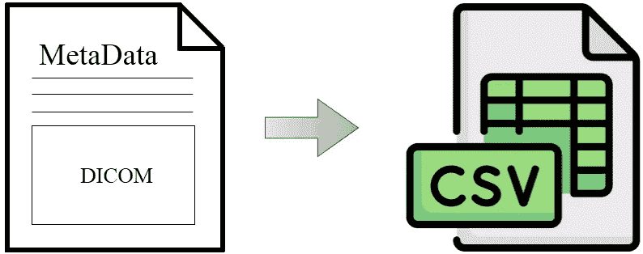
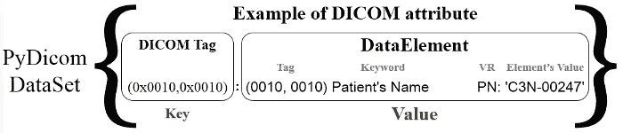
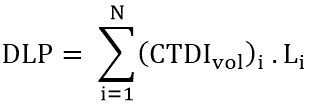

# 从 DICOM 头到 CSV 文件

> 原文：[`towardsdatascience.com/from-dicom-header-to-csv-file-e2e442505651?source=collection_archive---------11-----------------------#2023-01-17`](https://towardsdatascience.com/from-dicom-header-to-csv-file-e2e442505651?source=collection_archive---------11-----------------------#2023-01-17)

## DICOM 元数据 → CSV 数据集

[](https://medium.com/@omar.ok1998?source=post_page-----e2e442505651--------------------------------)[](https://towardsdatascience.com/?source=post_page-----e2e442505651--------------------------------) [Omar Alkousa](https://medium.com/@omar.ok1998?source=post_page-----e2e442505651--------------------------------)

·

[关注](https://medium.com/m/signin?actionUrl=https%3A%2F%2Fmedium.com%2F_%2Fsubscribe%2Fuser%2Ff8302b9534b5&operation=register&redirect=https%3A%2F%2Ftowardsdatascience.com%2Ffrom-dicom-header-to-csv-file-e2e442505651&user=Omar+Alkousa&userId=f8302b9534b5&source=post_page-f8302b9534b5----e2e442505651---------------------post_header-----------) 发表在 [Towards Data Science](https://towardsdatascience.com/?source=post_page-----e2e442505651--------------------------------) ·7 min read·2023 年 1 月 17 日[](https://medium.com/m/signin?actionUrl=https%3A%2F%2Fmedium.com%2F_%2Fvote%2Ftowards-data-science%2Fe2e442505651&operation=register&redirect=https%3A%2F%2Ftowardsdatascience.com%2Ffrom-dicom-header-to-csv-file-e2e442505651&user=Omar+Alkousa&userId=f8302b9534b5&source=-----e2e442505651---------------------clap_footer-----------)

--

[](https://medium.com/m/signin?actionUrl=https%3A%2F%2Fmedium.com%2F_%2Fbookmark%2Fp%2Fe2e442505651&operation=register&redirect=https%3A%2F%2Ftowardsdatascience.com%2Ffrom-dicom-header-to-csv-file-e2e442505651&source=-----e2e442505651---------------------bookmark_footer-----------)

将 DICOM 元数据转换为 CSV 文件。[作者提供的图像]

DICOM，即数字成像和通信医学，是医学图像的原生格式。DICOM 文件不仅包含像素数据，还将其存储为 DICOM 头。此类数据包括患者的年龄和体重、模态、图像维度等。在这篇文章中，我们将使用 PyDicom 包来构建一个 Python 函数，提取特定元数据以用于进一步的数据分析工作。

# 背景

如上所述，DICOM 文件包含元数据。这些数据对任何 DICOM 用户都很有用，从患者到医生以及成像系统的各种模态。此外，这些数据是数据科学家/分析师可以用来进行有益洞察的宝贵资源。

这项元数据的一个好处是它以标准化的方法表示，其中每个 DICOM 属性都有一个唯一的标签和关键字，以便用户以特定的值表示来获取信息。

让我们开始编写代码，并查看 DICOM 头部的示例…

# 让我们开始编写代码

我们将从一个简单的示例开始，读取 DICOM 文件以查看元数据表示。然后，我们会构建一个函数来提取数据。

互联网上有很多 DICOM 样本。你也可以使用自己的 DICOM 文件。对于这篇文章，我选择了一个包含 99 个胸部 CT 扫描切片的数据集。你可以在 Kaggle 上找到它（[数据集](https://www.kaggle.com/datasets/dmisky/dlwptvolumetricdicomlung)，由 [Kosarevsky Dmitry](https://www.kaggle.com/dmisky) 提供。许可证：“数据库：开放数据库，内容：数据库内容”，DbCL v1.0）。我将数据集保存到我的 [Drive](https://drive.google.com/drive/folders/1dbJpXVUBn0mSUxgJIqKZj4d_0thSeTW3?usp=sharing) 中，以便我可以通过 GoogleColab 方便地访问。

## 使用 PyDicom 读取 DICOM

在这个示例中，我们读取了第一个切片，并仅展示 DICOM 属性的一部分，因为完整的输出非常长。你可以参考这个 [GitHub Gist](https://gist.github.com/OmarAlkousa/53b35934cd3fac3d381f0448b8e27073) 查看完整的输出。

```py
# Install and import the package
!pip install pydicom
import pydicom

# Reading a DICOM file from a specific path
dcm_data = pydicom.dcmread('/content/drive/MyDrive/Datasets/Kaggle/DICOM/dicom_lung/000000.dcm')
dcm_data
```

```py
Dataset.file_meta -------------------------------
(0002, 0000) File Meta Information Group Length  UL: 196
(0002, 0001) File Meta Information Version       OB: b'\x00\x01'
(0002, 0002) Media Storage SOP Class UID         UI: CT Image Storage
(0002, 0003) Media Storage SOP Instance UID      UI: 1.3.6.1.4.1.14519.5.2.1.7085.2626.214140401149739061368142942055
(0002, 0010) Transfer Syntax UID                 UI: Explicit VR Little Endian
(0002, 0012) Implementation Class UID            UI: 1.2.40.0.13.1.1.1
(0002, 0013) Implementation Version Name         SH: 'dcm4che-1.4.35'
-------------------------------------------------
(0008, 0005) Specific Character Set              CS: 'ISO_IR 100'
(0008, 0008) Image Type                          CS: ['ORIGINAL', 'PRIMARY', 'AXIAL', 'CT_SOM5 SPI']
(0008, 0016) SOP Class UID                       UI: CT Image Storage
(0008, 0018) SOP Instance UID                    UI: 1.3.6.1.4.1.14519.5.2.1.7085.2626.214140401149739061368142942055
(0008, 0020) Study Date                          DA: '20100227'
(0008, 0021) Series Date                         DA: '20100227'
(0008, 0022) Acquisition Date                    DA: '20100227'
(0008, 0023) Content Date                        DA: '20100227'
(0008, 0030) Study Time                          TM: '161937.171'
(0008, 0031) Series Time                         TM: '162536.14'
(0008, 0032) Acquisition Time                    TM: '162203.028699'
...
```

PyDicom 封装了一个 DataSet 类，对于每个 DICOM 属性，它以标签作为 DataSet 的键，以数据元素作为值。下面的图片描述了 DataSet 和 DataElement 类的内容。



PyDicom DataSet 类的内容。[图片由作者提供]

PyDicom 包提供了许多方法和属性，可以与 DataSet 和 DataElement 类一起使用。我们不会深入讨论这些细节。如果你想了解更多，请参考之前的文章。

[](/introducing-pydicom-its-classes-methods-and-attributes-518c1d71162?source=post_page-----e2e442505651--------------------------------) ## 介绍 PyDicom、它的类、方法和属性。

### PyDicom… 超越像素数据！

[towardsdatascience.com

# 提取元数据

我们将依赖的主要思想是我们可以遍历特定文件夹中的 DICOM 文件。然后，我们将遍历每个文件中的所有属性，只提取事先指定的属性。我们将使用 DICOM 属性的关键字，因为这是最好的选择，因为：

+   每个 DICOM 属性都有其独特的关键字。

+   关键字比标签更好，因为它们是人类可读的。

有数十个属性可以表征 DICOM 文件。所以，你不能只读取所有属性。您需要只关注在工作中可能遇到的属性。为此，我强烈推荐这款优秀的[DICOM 标准浏览器](https://dicom.innolitics.com/ciods)，该浏览器由[Innolitics](https://innolitics.com/)构建，您只需搜索您想了解的属性。确保您输入的关键词正确无误。

**现在我们知道我们要做什么了，让我们提取一些 DICOM 元数据 :)**

我们将需要 **glob** 包来操作 DICOM 文件的路径。此外，还需要 **Pandas** 包来从 pandas 数据框架中写入 CSV 文件。glob 模块会根据 Unix shell 使用的规则找到所有匹配指定模式的路径名，尽管结果以任意顺序返回。

唯一剩下的就是设置我们的 Python 环境，导入包并构建我们的函数。将添加函数文档，解释参数和函数输出。

**dicom2csv() 函数。参考**[**GitHub gist**](https://gist.github.com/OmarAlkousa/8d62a6751eaf860a37c4ba2e437512c8)**。**

让我们试试上面的函数。首先，我们决定我们感兴趣的 DICOM 属性是什么。例如，我想从一系列胸部 CT 扫描中计算 DLP 指数。**DLP 指数，剂量长度乘积**是一种常用的指数，因为它能够显示出整体的剂量输出。它通常在现代设备的控制台上使用并表示，因为它能提前给出对有效剂量（ED）的粗略估计。

DLP 可以从 CTDIvol 计算出来，这是另一个 CT 指数，描述了所选 CT 运行条件下单张图像的平均剂量，单位为毫格（mGy）。剂量长度乘积（DLP）用于计算一系列扫描或完整检查的剂量，并由以下方程定义：



其中 i 用于每张图像对应的第 i 个 CTDIvol。对于 Li，我们将使用每两个连续图像之间的重建间隔，因为这实际上决定了对给定扫描长度对应的图像数。**Slice Location** 将帮助我们计算以毫米为单位的重建间隔。

因此，我们需要计算 DLP 的元数据是以毫格（mGy）表示的**CTDIvol**和每个轴向切片的以毫米表示的**SliceLocation**。让我们使用上面构建的函数来提取它们。

```py
# Extract the SliceLocation and CTDIvol from DICOM files of Chest-CT
df = dicom2csv(extract = ['SliceLocation', 'CTDIvol'],
          folder_path = '/content/drive/MyDrive/Datasets/Kaggle/DICOM/dicom_lung',
          csv_file_name = 'data.csv', 
          return_dataframe = True)
```

**注意**，读取 DICOM 文件是任意的。所以，我们需要根据切片位置来对数据进行排序。

```py
# Sort the data frame to get the slices in order
df.sort_values(by='SliceLocation', inplace=True, ignore_index=True)
df
```

```py
 SliceLocation  CTDIvol
0          -288.0    8.550
1          -285.0    8.450
2          -282.0    8.250
3          -279.0    8.025
4          -276.0    7.850
..            ...      ...
94           -6.0   12.450
95           -3.0   12.325
96            0.0   12.125
97            3.0   11.925
98            6.0   11.575

[99 rows x 2 columns]
```

从“SliceLocation”列的视角来看，重建间隔为 3.0 毫米，与切片厚度相同。您可以尝试以下行代码，以确保所有切片的重建间隔相同。

```py
# Calculate the reconstruction interval from SliceLocation
[df['SliceLocation'][i+1] - df['SliceLocation'][i] for i in range(0,len(df)-1)]
```

回到 DLP 方程，Li 对所有切片都是相同的，为 0.3 cm。我们最终的步骤是将每个 CTDIvol 乘以 0.3，并将变量相加。

```py
import numpy as np
# Calculating DPL = sum(CTDIvol * 0.3)
print('DLP = ',np.sum(df['CTDIvol'].values * 0.3), 'mGy*cm')
```

```py
DLP =  239.90999999999994 mGy*cm
```

重要的是要记住，CTDIvol 或其衍生物 DLP，如在控制台上看到和在 DICOM 图像中输出的，不代表患者实际吸收的或有效的剂量。它们应被视为系统辐射输出的指数，用于比较目的。基于 DLP 计算的有效剂量仅为粗略估算。

DLP 计算只是从 DICOM 头部提取数据的一个单一示例，其用途非常广泛。我们构建的 Python 函数使处理指定的元数据变得容易。

# 结论

+   我们已经看到了如何使用 PyDicom 包读取 DICOM 文件，以及在分析工作中使用 DICOM 元数据的强大功能。

+   我们构建了一个函数，可以将 DICOM 头部的特定数据转换为 CSV 文件，以便进行进一步分析。

+   我们使用该函数计算了剂量长度乘积，这是 CT 模态剂量估算中常用的参数。

***感谢阅读…***

# 推荐

+   ***DICOM 元数据 — 大数据分析的有用资源：***

    这篇[文章](https://healthmanagement.org/c/healthmanagement/issuearticle/dicom-metadata-a-useful-resource-for-big-data-analytics)概述了通过结合患者访问和 DICOM 信息来表示数据的新方法，包括医学影像元数据的高级应用、辐射剂量分析、图像分割以及用于特征工程的深度学习，以丰富数据。

+   有关 DICOM 的更多细节，请参阅前一篇博客，[***什么是 DICOM？***](https://medium.com/@omar.ok1998/what-is-dicom-a28c5fe24c9d)

+   **从计算机断层扫描剂量指数计算 DLP**，CTDIvol。

[## CT 中有效剂量的简单计算器 (DLP -> Eff Dose)：放射科技师指南](https://howradiologyworks.com/dlp-calculator/?source=post_page-----e2e442505651--------------------------------)

### 这里有一个简单的计算器，可以从 CT 检查的剂量长度乘积 (mGy cm) 计算有效剂量 (mSv)。

[howradiologyworks.com](https://howradiologyworks.com/dlp-calculator/?source=post_page-----e2e442505651--------------------------------)

# 参考文献

[1] 99 个 CT 切片的数据集，[dlwpt-volumetric-dicom-lung](https://www.kaggle.com/datasets/dmisky/dlwptvolumetricdicomlung)，Kaggle，[Kosarevsky Dmitry](https://www.kaggle.com/dmisky)，许可证：“数据库：开放数据库，内容：数据库内容”，DbCL v1.0。

[2] PyDicom 文档，[**用户指南**](https://pydicom.github.io/pydicom/stable/old/pydicom_user_guide.html)，[访问时间：2022 年 12 月 25 日]

[3] PyDicom 文档，[**元素 VR 和 Python 类型**](https://pydicom.github.io/pydicom/stable/guides/element_value_types.html)，[访问时间：2022 年 12 月 25 日]

[4] PyDicom 文档，[**API 参考**](https://pydicom.github.io/pydicom/stable/reference/index.html)，[访问时间：2022 年 12 月 25 日]

[5] Innolitics，DICOM 标准浏览器，（2022），[**CTDIvol 属性**](https://dicom.innolitics.com/ciods/ct-image/ct-image/00189345)，[访问日期 2023 年 10 月 1 日]

[6] I. A. Tsalafoutas 和 S. I. Metallidis，“一种从 CT DICOM 图像计算剂量长度乘积的方法，” *BJR*，第 84 卷，第 999 期，页码 236–243，2011 年 3 月，doi: [10.1259/bjr/37630380](https://doi.org/10.1259/bjr/37630380)。
