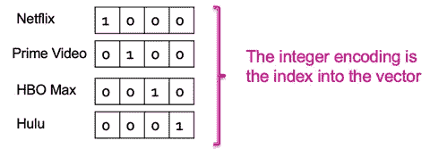
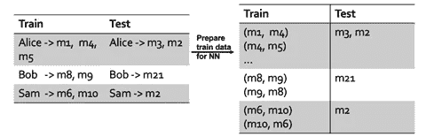

# 从编码到嵌入

> 原文：[`towardsdatascience.com/from-encodings-to-embeddings-5b59bceef094`](https://towardsdatascience.com/from-encodings-to-embeddings-5b59bceef094)

## **概念与基础：从 SVD 到神经网络**

[](https://medium.com/@mina.ghashami?source=post_page-----5b59bceef094--------------------------------)[](https://towardsdatascience.com/?source=post_page-----5b59bceef094--------------------------------) [Mina Ghashami](https://medium.com/@mina.ghashami?source=post_page-----5b59bceef094--------------------------------)

·发表于 [Towards Data Science](https://towardsdatascience.com/?source=post_page-----5b59bceef094--------------------------------) ·16 分钟阅读·2023 年 9 月 7 日

--


版权: [`unsplash.com/`](https://unsplash.com/)

在本文中，我们将讨论数据表示和机器学习领域中的两个基本概念：**编码**和**嵌入**。本文的内容部分来源于我在[斯坦福大学的 CS246 矿大数据集（MMDS）课程](https://web.stanford.edu/class/cs246/)中的讲座。希望你觉得有用。

# 引言

所有机器学习（ML）方法都处理输入特征向量，几乎所有方法都要求输入特征是*数值型*的。从 ML 的角度来看，有四种类型的特征：

1.  *数值型（连续或离散）*：数值数据可以分为连续数据或离散数据。连续数据可以在一个范围内取任意值，而离散数据有明显的值。连续数值变量的例子是*`身高`*，离散数值变量的例子是*`年龄`*。

1.  *分类数据（有序或无序）*：分类数据表示诸如眼睛颜色和家乡等特征。分类数据可以是有序的或无序的。在有序变量中，数据被分到按特定方式排序的类别中。例如*`技能水平`*，其值为*[`初级`，`中级`，`高级`]。无序变量在其值之间没有顺序。例如*`眼睛颜色`*，其值为*[`黑色`，`棕色`，`蓝色`，`绿色`]。

1.  *时间序列*：时间序列是一个在一定时间段内以规则间隔收集的数字序列。这些数据按时间排序，与之前的变量不同。一个例子是*`美国多年房屋销售价格的平均值`*。

1.  *文本*：任何文档都是文本数据，我们通常将其表示为“词袋”。

要将任何变量输入到 ML 模型中，我们必须将其转换为数值。编码和嵌入技术都可以实现这一点。

# 编码

编码是将原始数据（如文本、图像或音频）转换为结构化的数值格式，使计算机能够轻松处理。编码类别变量有两种方法：

1️⃣ 整数编码

2️⃣ 一热编码

3️⃣ 多热编码（这是对一热编码的扩展）

为了解释每种方法，我们通过以下示例来说明：

🎬 设想一个只有 4 部电影和 5 个特征的小型电影数据集。


图 1：电影数据集 — 图片由作者提供

正如我们所见，两个特征（发行年份、IMDB 评分）是数值型的，一个特征（标题）是文本型的，剩下的两个（提供者、IMDB 类型）是类别型的。让我们来看看编码方法如何应用于这些特征。

1️⃣ **整数编码：**

这种方法为每个类别值分配一个整数。例如，如果 *提供者* 变量有四个不同的值 *`[Netflix, Prime Video, HBO Max, Hulu]`*，我们分别将其分配整数 1、2、3 和 4：

*Netflix -> 1, Prime Video -> 2, HBO Max -> 3, Hulu -> 4*

这种方法的优点是提供了紧凑的表示。缺点是它暗示了不同类别之间的顺序，即

*Netflix < Prime Video < HBO Max < Hulu.*

因此，对于序数变量（例如 *`教育`* 取值为 *‘[文凭, 本科, 硕士, 博士]`*），使用整数编码可能更有意义。然而，这仍然意味着值是均匀间隔的 🙊!! 显然，这并不理想，因此我们将转向下一种方法。

💻 在 Python 中，你可以使用各种库（如 scikit-learn 或 TensorFlow/Keras）执行整数编码。在这里，我们使用 scikit-learn 的 `LabelEncoder` 将类别标签编码为整数：

```py
from sklearn.preprocessing import LabelEncoder

# Sample list of categorical labels
labels = ["netflix", "prime video", "hbo max", "hulu"]

# Initialize the LabelEncoder
label_encoder = LabelEncoder()

# Fit and transform the labels to integer values
integer_encoded = label_encoder.fit_transform(labels)

# Print the encoded labels
print(integer_encoded)
```

2️⃣ **一热编码：**

这种方法首先应用整数编码，然后创建一个二进制向量来表示数值，例如，对于 *`提供者`* 变量，我们首先分配整数：*Netflix -> 1, Prime Video -> 2, HBO Max -> 3, Hulu -> 4*。然后我们为每个值创建一个长度为 4 的二进制向量，如下所示：



图 2：提供者变量的一热编码向量 — 图片由作者提供

如你所见，这种方法将特征向量的维度扩展到类别特征的取值数量 🙈!! 这可能迅速变得难以控制。

💻 在 Python 中，你可以使用像 scikit-learn 或 pandas 这样的库来执行一热编码。以下是使用 scikit-learn 的 `OneHotEncoder` 进行一热编码的方法：

```py
from sklearn.preprocessing import OneHotEncoder
import numpy as np

# Sample categorical data (list of categories)
categories = ["netflix", "prime video", "hbo max", "hulu"]

# Initialize the OneHotEncoder
onehot_encoder = OneHotEncoder(sparse=False)

# Reshape the data into a 2D array (required for scikit-learn)
categories = np.array(categories).reshape(-1, 1)

# Fit and transform the categories into one-hot encoded vectors
onehot_encoded = onehot_encoder.fit_transform(categories)

# Print the one-hot encoded vectors
print(onehot_encoded)
```

接下来，我们也来看看这种方法的扩展。

3️⃣ **多热编码：**

多热编码是对一热编码的扩展，当类别变量可以同时取多个值时。例如，有 28 种不同的 IMDB 类型，而一部电影可以同时属于多个类型，例如电影 `*怪奇物语*` 同时属于 *剧情、奇幻、恐怖* 类型。


图 3：IMDB 类型及其整数编码 — 图片由作者提供

将多热编码应用于电影类型，会得到 28 维的编码向量：


图 4：每部电影的类型的多热编码 — 作者提供的图片

我们可以明显看到，多热编码与 one-hot 编码有相同的缺点，即维度爆炸。

💻 我们可以使用 scikit-learn 或 pandas 在 Python 中实现多热编码。以下是使用 scikit-learn 的 `MultiLabelBinarizer` 进行操作的方法：

```py
from sklearn.preprocessing import MultiLabelBinarizer

# Sample data: List of sets representing categories for each data point
data = [{'drama', 'fantasy', 'horror'}, {'comedy', 'animation', 'family'},\
        {'sport'}, {'documentary'}, {'comedy', 'drama', 'biography'}]

unique_categories = ['action','comedy','short','western','drama','horror',\
                     'music','thriller','animation','adventure','family',\
                     'fantasy','sport','romance','crime','sci-fi','biography',\
                     'musical','mystery','history','documentary','film-noir',\
                     'news','game-show','reality-tv','war','talk-show','adult']

# Initialize the MultiLabelBinarizer
mlb = MultiLabelBinarizer(classes=sorted(unique_categories))

# Fit and transform the data into multi-hot encoded vectors
multi_hot_encoded = mlb.fit_transform(data)

# Print the multi-hot encoded vectors
print(multi_hot_encoded)
```

现在，将以上所有编码应用于电影数据集，会得到以下结果：


图 5：包含所有编码的电影数据集 — 作者提供的图片

如我们所见，在应用所有编码后，数据维度从 5 增加到 35 🙊!! 实际上，如果我们对 *`title`* 变量也进行多热编码，它将膨胀到数千或一百万！

📓要点是，对于具有大量值集的特征，one-hot 和 multi-hot 编码并不实用。在一个包含一百万个不同单词的文档语料库中，通过多热编码表示每个文档会生成如下向量：

+   高维：多热编码将生成 100 万维的向量！

+   稀疏：由于一个平均文档包含 500 个词，因此多热编码向量将会有 99.95% 的稀疏度

+   语义短缺：‘good’ 和 ‘great’ 的编码与 ‘good’ 和 ‘bad’ 的编码一样不同！

✏️ 简而言之，当类别数量较少时，使用 one-hot/multi-hot 编码；通常少于 15 个。对于类别数量以百万计的文本数据（每个单词作为一个类别），我们必须使用更高效的方法。

在本文的其余部分，我们将处理 *`计算词嵌入`* 的问题。通过这个例子，我们将研究几种基本的嵌入方法。

# **嵌入**

为了解决上述问题，我们从高维稀疏向量转向短的稠密向量；这些向量被称为 ***嵌入***。嵌入是将高维向量转换为低维空间的过程，并捕捉语义相似性。

*“使用稠密且低维向量的一个好处是计算上的：大多数神经网络工具包与非常高维的稀疏向量兼容性差。” [5]*

首先让我们来看一种非常简单的嵌入方法，称为 SVD。

## 奇异值分解 (SVD)

最简单的嵌入方法可能是 *奇异值分解 (SVD)*，它将输入矩阵 *A* 分解为以下三个矩阵：


图 6：SVD 分解 — 作者提供的图片

***U, V*** 分别是左奇异向量和右奇异向量。它们是列正交的，这意味着它们中的每一列的范数为 1，并且 U 中的每两列（以及 V 中的每两列）是正交的。用数学语言表示为


*U* 和 *V* 定义了一个 r 维子空间，因此将***A***投影到它们上面产生 r 维嵌入：


🗒 **让我们一起看一个例子** 🗒**：**

给定一个文档语料库，我们可以使用 SVD 来计算文档嵌入和词嵌入。步骤如下：

**步骤 1**：将其转换为词袋（BOW）向量，并获得词-文档矩阵。我们可以使用词频（tf），或使用 tf-idf 技术进行归一化。


图 7：词频矩阵 — 作者提供的图片

**步骤 2**：对词-文档矩阵应用 SVD，并选择一个值*r < rank(A)*。这将创建三个矩阵，每个矩阵的秩为 r。


图 8：矩阵 A 的 SVD 分解 — 作者提供的图片

**步骤 3**：计算文档的嵌入，如下所示

*emb = [<doc, v1> , <doc, v2> , <doc, v3>]*

下图显示了前两个点积。


图 9：第一个文档的嵌入 — 仅显示了两个点积操作 — 作者提供的图片

一旦我们计算了所有三个向量的点积，文档的嵌入就是：


图 10：第一个文档的嵌入 — 作者提供的图片

类似地，我们可以计算词（术语）嵌入为*emb = [<term, u1> , <term, u2> , <term, u3>]。*


图 11：第一个术语的词嵌入 — 作者提供的图片

我们可以证明，这些表示将相似的术语和文档分组在三维空间中。相关或具有相似上下文的术语和文档在这个降维空间中往往具有相似的表示。

💻 在 Python 中，我们使用 scikit-learn 将文档语料库转换为 tf-idf 矩阵，然后对其应用 SVD。以下是一个示例：

```py
from sklearn.feature_extraction.text import TfidfVectorizer
from sklearn.decomposition import TruncatedSVD
import numpy as np

# Sample documents (corpus)
documents = [
    "This is the first document.",
    "This document is the second document.",
    "And this is the third one.",
    "Is this the first document?",
]

# Step 1: Apply TF-IDF
tfidf_vectorizer = TfidfVectorizer()
tfidf_matrix = tfidf_vectorizer.fit_transform(documents)

# Step 2: Perform SVD on TF-IDF matrix
n_components = 2  # Number of components (adjust as needed)
svd = TruncatedSVD(n_components=n_components)
svd_matrix = svd.fit_transform(tfidf_matrix)

# Print the TF-IDF matrix and SVD results
print("TF-IDF Matrix:")
print(tfidf_matrix.toarray())
print("\n")
print("SVD Matrix:")
print(svd_matrix)
```

总的来说，SVD 是一种简单且强大的技术，用于保持语义信息，但在实际数据集上并不实用。它计算量大，并且完全没有利用输入矩阵的稀疏性。让我们看看如何在另一种方法中避免这些缺陷。

## **神经网络作为嵌入器**

🌟 目前最先进的嵌入器之一是神经网络（NN）。有许多神经网络技术可以计算词嵌入：Word2Vec、Glove、BERT、fastText 等。本文讨论了*Word2Vec*，该方法由[托马斯·米科洛夫](https://scholar.google.com/citations?user=oBu8kMMAAAAJ&hl=en)及其在谷歌的同事们开发，并在 2013 年至 2014 年间发表的一系列论文中介绍了该方法（[论文](https://proceedings.neurips.cc/paper/2013/file/9aa42b31882ec039965f3c4923ce901b-Paper.pdf)）。

*Word2Vec* 是一种统计、自监督、与任务无关的方法。它有两种变体：连续词袋模型（CBOW）和 Skip Gram。这两种变体非常相似，都使用一个只有一层隐藏层且没有激活函数的浅层神经网络来学习词语表示。在本文中，我们研究 skip-gram 模型。

🔑 Word2Vec 的关键思想是具有相似上下文的词语具有相似的含义。一个词在某些其他词的***上下文***中出现得越频繁，它们的含义就越接近。一个词的*上下文*是它左边和右边的几个词。形式上，给定一个文档，我们设置一个窗口大小（例如，window_size = 2）。那么对于文档中的任何给定词（称为*`目标`*词），它左边的*`window_size`* 个词和右边的*`window_size`* 个词就是它的*上下文*。例如：


图 12：目标词和上下文词（窗口大小 = 2） — 图片由作者提供

给定一个文档，我们可以从左到右滑动窗口，找到所有的*(目标词, 上下文词)* 对。考虑以下文档：

文档：*“我读科幻书籍并喝橙汁”*，

设窗口大小 = 2。那么 (目标词, 上下文词) 的集合如下图所示。图片中高亮的词是`目标`词，框中的其他词是`上下文`词。


图 13：在文档上滑动窗口以提取（目标词，上下文词） — 图片由作者提供

现在，我们知道了目标词和上下文词的含义，让我们看看 Word2vec 如何使用它们。Word2vec 是一个 2 层神经网络，它以目标词作为输入，并预测窗口中的所有上下文词。以下是窗口大小 = 2 的架构示意图：


图 14：窗口大小 = 2 的 skip-gram 架构 — 图片由作者提供

现在，我们可以猜测为什么这个架构被称为 skip-gram🙂… 这是因为它预测上下文中的所有词组，除了目标词，因为目标词是模型的输入，所以这个名字叫做 skip-gram。

现在，让我们专注于只预测一个上下文词，并深入细节。设*V = 词汇表的大小*和*N = 嵌入维度*，即唯一隐藏层的大小。则用于预测一个上下文词的架构是：


图 15：用于预测一个上下文词的 skip-gram 架构 — 图片由作者提供

🧬输入层是目标词的 one-hot 编码，即 w(t)；由于我们在词汇表中有 V 个词，输入层是 V 维的。隐藏层是 N 维的，并生成嵌入。通常 *N << V*，例如在一个网页文档的语料库中，我们有数百万个词汇（V 级别为百万级），而 N 在 256 到 512 之间。隐藏层的目的是将词映射到一个更低的维度，同时保持不同词之间的分离。这个层不使用任何激活函数。原因是大多数激活函数涉及在一个区域“压缩”空间，而在另一个区域“扩展”空间，例如 sigmoid/tanh 会将所有值 < -1“压缩在一起”，所有值 >1 同样如此。RELU 会将所有值 <0“压缩在一起”，从而消除了代表能力的一半。如你所见，这实际上会 *损害* 分离质量，减少可用的“词映射空间”量。输出层是 V 维的，softmax 函数作用于此层，因此输出层中的每个神经元都是一个概率，所有神经元的总和为 1。输出层的第 j 个神经元，即 y_j，表示第 j 个词是上下文词的概率。我们可以看到，这里涉及两个权重矩阵：


给定网络的拓扑结构，如果 ***x*** 是输入，***y*** 是输出，则


网络训练完成后，我们通过将其 one-hot 向量 *x* 与权重矩阵 *W* 相乘来获得词的嵌入。

🔁**网络是如何训练的？** 由于没有标签，我们将创建一个虚拟任务 😃！这个虚拟任务是：

📑*虚拟任务：`给定一个目标词，预测其上下文词`*

现在，有两个问题：1）如何生成训练数据，2）选择什么损失函数来训练网络？

🗒**如何生成训练数据？** 我们取我们的语料库 *data = {d1, d2, ….}*，可能会收集到数百万篇文档、维基页面、博客文章等。然后，我们对所有文档进行分词，并建立词汇表。可用的分词方法有很多，例如 workpiece、BytePairEncoding (BPE)、k-gram。最简单的方法是 k-gram。如果你取 *k=1* 并按词进行分词（而不是按字符），那么 1-gram 相当于按空格分割句子！分词后，我们得到一个分词文档的列表。然后，我们在分词文档上滑动窗口，并将训练数据收集为 (target, context) 的对。请参见下面的示例：


图 16：从文档中收集训练数据 — 作者提供的图像

📈**选择什么损失函数？** 我们使用交叉熵损失函数。原因是我们针对目标-上下文对 (w_t, w_c) 进行训练，其中 w_t 是目标词，w_c 是上下文词。上下文词 w_c 表示给定目标词 w_t 的理想预测。注意 W_c 以独热编码表示，即在某个位置 j 的值为 1，其他位置为 0：


图 17：上下文词的独热编码 — 作者提供的图片

损失函数需要在相同位置 j 评估输出层，即 y_j。（记住 y 是一个概率分布；y_j 的理想值为 1）。交叉熵损失函数定义为


对于上述示例，


图 17：示例中的交叉熵损失 — 作者提供的图片

🔥**训练神经网络**：既然损失函数和训练数据已经明确，我们将训练网络以学习权重。我们希望找到使损失函数最小的 ***W*** 和 ***W′*** 的值。我们通过反向传播运行并根据损失的导数更新参数来实现这一点。这就结束了 word2vec 算法。

📊**词嵌入的结果：** 下面，我们看到四个词 *“man,” “woman,” “king,” “queen”* 的向量表示示例，这些示例说明了 Word2Vec 如何捕捉语义。在 Word2Vec 的背景下，词之间的关系可以表示为向量运算。算法捕捉到像 *“king — man + woman = queen”* 这样的关系。这是因为“king”的向量表示减去“man”的向量表示再加上“woman”的向量表示，结果是一个非常接近“queen”的向量表示。


图 18：词嵌入捕捉语义 — 作者提供的图片

重要的是要注意，Word2Vec 是在大型文本语料库上训练的，学习到的嵌入质量取决于训练数据的数量和质量。此外，虽然 Word2Vec 可以捕捉许多语义关系，但它可能无法捕捉语言和意义的所有可能细微差别。之后还开发了其他词嵌入算法和模型，以进一步增强对词关系的理解。

## **物品-物品神经协同过滤**

在本节中，我们将深入探讨通过神经网络学习嵌入的另一个示例。该网络建模了物品-物品协同过滤算法。我们将通过视频推荐的用例来研究这个网络。

🎥**视频推荐用例**：考虑一个视频推荐的用例，我们有 100 万个视频和 50 万名用户，这些用户观看了一些这些视频，我们的任务是向用户推荐视频。我们想用神经网络解决这个问题，因此我们将其表述为多类分类，每个视频就是一个类别。我们设计一个神经网络来学习视频的嵌入，使得相似的视频具有相似的嵌入。首先让我们构建训练数据，然后设计网络架构。

🗒**构建训练数据：** 给定包含用户观看视频的日志，我们按时间升序排列每个用户观看的视频。然后按固定比例将其分割。我们将第一次分割作为训练数据，第二次分割作为测试数据。请注意，如果我们的分割比例是 70-30，则每个用户的数据按这个比例进行分割。通过这种基于时间的分割，我们的任务隐式地变成了*‘预测用户接下来观看什么’*。

另一种分割方式是避免排序，随机保留每个用户的一些视频作为测试数据，使用其余的视频构建训练数据。然而，这种方法有泄露从训练到测试的信息的风险。


图 19：视频推荐训练-测试分割 — 图片由作者提供

数据分割后，我们将训练数据构建为(movie1, movie2)对，其中两个电影都由同一个用户观看。



图 20：构建训练数据和测试数据 — 图片由作者提供

然后，我们构建一个执行项目-项目协同过滤的神经网络，同时学习 3 维嵌入！！（三维虽然太小，但为了说明目的我们继续使用它。）


图 21：项目-项目神经协同过滤 — 图片来源于[1]，由作者修改

对于训练数据中的每一对(m1, m2)，我们在蓝色的输入层中输入 m1 的独热向量，并在黄色输入层中输入 m1 的特征向量（包含如类型、演员、导演、受欢迎程度等元数据）。m2 的独热向量将用于计算损失函数。我们希望模型学习 m1 和 m2 之间的关联。m1 和 m2 在训练数据中出现得越频繁，它们的嵌入就会越接近。

**如何向用户推荐电影？** 假设 Alice 观看了 m1、m4、m5。为了向她推荐电影，我们可以找到与 m1 具有相似嵌入的电影。对于任何电影 v，我们计算相似度分数为*score= <emb(m1), emb(v)>*。我们找到相似度分数最高的前 5 部电影，并推荐给 Alice。更好的推荐是对 m1、m4 和 m5 重复上述过程，并推荐这些集合的交集中的电影。

这部分内容结束了关于项目-项目协同过滤的讨论。如果你想深入了解神经协同过滤，请查看[这篇论文](https://arxiv.org/abs/1708.05031)。

# 概述

在这篇文章中，我们讨论了编码和嵌入方法。我们了解到，编码指的是将原始数据（如文本、图像或音频）转换为一种结构化格式的过程，以便计算机能够轻松处理。这种转换通常涉及降低数据的维度，同时保留其本质特征。另一方面，嵌入则是将数据点映射到一个低维空间，其中每个点由一个连续值的向量表示。嵌入旨在捕捉数据点之间的语义关系和相似性，使算法能够有效地学习模式并做出有意义的预测。编码和嵌入在各种应用中发挥着关键作用，从自然语言处理和计算机视觉到推荐系统和异常检测，提升了数据分析和机器学习任务的效率和有效性。

如果你有任何问题或建议，请随时联系我：

电子邮件：mina.ghashami@gmail.com

LinkedIn: [`www.linkedin.com/in/minaghashami/`](https://www.linkedin.com/in/minaghashami/)

# 参考文献

1.  [关于嵌入的谷歌博客文章](https://developers.google.com/machine-learning/crash-course/embeddings/video-lecture#:~:text=An%20embedding%20is%20a%20relatively,like%20sparse%20vectors%20representing%20words.)

1.  [词汇和短语的分布式表示及其组合性](https://proceedings.neurips.cc/paper/2013/file/9aa42b31882ec039965f3c4923ce901b-Paper.pdf)

1.  [学习嵌入 — CS246，斯坦福大学](https://web.stanford.edu/class/cs246/slides/14-emb.pdf)

1.  [神经协同过滤](https://arxiv.org/abs/1708.05031)

1.  [自然语言处理中的神经网络方法](http://amzn.to/2wycQKA)，2017
