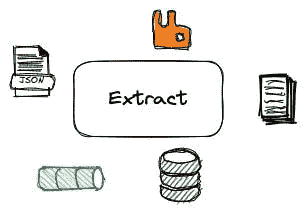
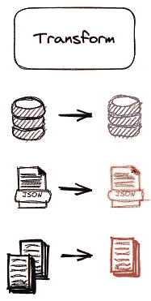
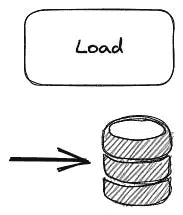
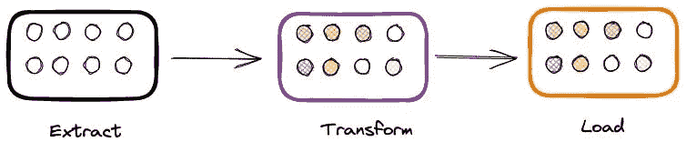
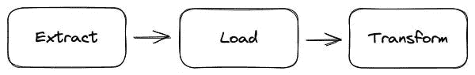
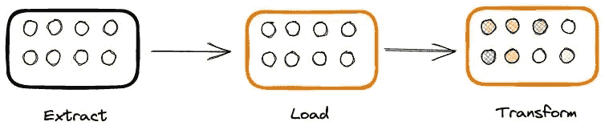

# 从 ETL 过渡到 ELT

> 原文：[`towardsdatascience.com/from-etl-to-elt-908ce414e39e`](https://towardsdatascience.com/from-etl-to-elt-908ce414e39e)

## 云计算和分析工程如何促使从 ETL 到 ELT 的过渡

 [Giorgos Myrianthous](https://gmyrianthous.medium.com/?source=post_page-----908ce414e39e--------------------------------)

·发表于 [Towards Data Science](https://towardsdatascience.com/?source=post_page-----908ce414e39e--------------------------------) ·7 分钟阅读·2023 年 12 月 6 日

--

图片由 [DALL-E](https://labs.openai.com/s/R6GmBJ0EmCXudKsPuIGJBBjC) 生成

ETL（提取-转换-加载）和 ELT（提取-加载-转换）是数据工程领域中常用的两个术语，特别是在数据摄取和转换的背景下。

虽然这些术语常常可以互换使用，但它们指的是略有不同的概念，并对数据管道的设计有不同的影响。

在这篇文章中，我们将澄清 ETL 和 ELT 过程的定义，概述两者之间的差异，并讨论它们对工程师和数据团队所提供的优缺点。

更重要的是，我将描述现代数据团队组成的近期变化如何影响 ETL 与 ELT 之间的竞争格局。

# 理解提取（Extract）、加载（Load）和转换（Transform）的独立性

比较 ETL 和 ELT 时，主要关注的点显然是数据管道中提取（Extract）、加载（Load）和转换（Transform）步骤的执行顺序。

目前，让我们忽略这个执行顺序，专注于实际的术语，并讨论每个步骤应该做什么。

**提取**：这一步指的是从持久化数据源中提取数据的过程。这个数据源可以是数据库、API 端点、文件，甚至是任何包含数据的事物，无论是结构化还是非结构化数据。

提取步骤从各种来源中提取数据 — 来源：作者

**转换**：在这一步骤中，管道需要对数据的结构或格式进行一些更改，以实现特定目标。转换可以是属性选择、记录修改（例如，将 `'United Kingdom'` 转换为 `'UK'`）、数据验证、连接到另一个来源或任何更改输入原始数据格式的操作。

转换步骤对输入的原始数据执行多项转换 — 来源：作者

**加载**：加载步骤指的是将数据（无论是原始版本还是转换版本）复制到目标系统的过程。通常，目标系统是数据仓库（即用于分析目的的 OLAP 系统）或应用程序数据库（即 OLTP 系统）。

将数据加载到目标系统中 — 来源：作者

不可避免地，我们执行这三个步骤的顺序很重要。随着需要处理的数据量的增加，执行顺序**非常重要**。让我们讨论一下原因！

# 提取 转换 加载 (ETL)

ETL 代表提取-转换-加载，该术语本身指的是一个过程，其中数据提取步骤之后是转换步骤，最后是加载步骤。

提取 > 转换 > 加载 — 来源：作者

**ETL 过程中的数据转换步骤发生在目标系统之外的阶段环境中**，数据在加载到目标系统之前进行转换。

在 ETL 中，转换步骤发生在阶段环境/服务器中，转换后的数据然后被加载到目标系统中 — 来源：作者

# 提取 加载 转换 (ELT)

另一方面，ELT，代表提取-加载-转换，指的是一个过程，其中提取步骤之后是加载步骤，最终的数据转换步骤发生在最后。

提取 > 加载 > 转换 — 来源：作者

相比于 ETL，在 ELT 中不需要阶段环境/服务器，因为数据转换是在目标系统内进行的，该系统通常是托管在云端的数据仓库或数据湖。

在 ELT 中，转换步骤发生在目标系统内 — 来源：作者

# 如何在 ETL 和 ELT 之间做选择

ETL 和 ELT 各有利弊，鉴于它们通常用于不同的用例，您很可能会在日常工作中遇到这两者。

**ETL** 最适合用于数据存储在本地并需要在加载到目标数据库或数据仓库之前进行结构化的用例。因此，当涉及较小的数据量和/或需要执行复杂转换时，通常更倾向于使用 ETL 过程。

此外，由于 ETL 在加载步骤之前转换数据，因此敏感数据可以在加载之前被掩码、加密或完全删除。ETL 的这一方面可以帮助公司和团队更容易地强制执行和实施各种法规（如 GDPR）。

由于转换发生在中间（暂存）服务器上，因此需要额外的开销将转换后的数据移动到目标系统。此外，目标系统不会包含原始数据（即转换前的数据形式）。这意味着每当需要额外的转换时，我们必须再次提取原始数据。

另一方面，**ELT** 提供了比 ETL 更多的灵活性，因为后者历史上是为了结构化（关系型）数据而设计的。现代云架构和数据仓库使得 ELT 能够处理结构化和非结构化数据。

如前所述，ETL 应用于小规模的数据。ELT 提供了更快的转换速度，因为它不依赖于数据大小，通常根据需要进行。

另外，当数据在 ELT 过程中的转换之前被加载时，这意味着用户和系统仍然可以访问原始数据。这意味着如果在后续阶段需要更多的转换，我们已经在数据仓库中拥有可以随时访问的原始数据。唯一的缺点是需要额外的存储来存储这些原始数据，但考虑到存储成本不断下降，我认为这不是一个主要问题。

现在我们对 ETL 和 ELT 过程的技术影响有了充分的了解，让我提一个问题。当选择一个而不是另一个时，仅仅是技术实施的问题吗？

## 这不仅仅是关于何时进行转换

此外，数据领域一直在不断发展，数据角色也不例外。**ETL 与 ELT 不仅仅关乎转换步骤发生的地点——它（还）关乎谁应该执行这些步骤**。

转换步骤通常涉及某种**业务逻辑**。传统的 ETL 过程通常由数据仓库工程师执行（不确定现在是否仍然如此），这意味着这些人也负责制定业务逻辑。

另一方面，ELT 过程的演变是由于现代数据团队的性质和形成。EL（Extract-Load）步骤通常由数据工程师执行，而转换步骤则由所谓的分析工程师执行。

对我来说，这非常有意义。数据工程师是一个纯技术人员，关注效率、可扩展性、准备性和可用性（还有其他一百万件事）。另一方面，分析工程师仍然是技术人员，但对业务的理解更好。因此，让分析工程师负责数据转换更有意义，因为（通常）转换与业务价值相关。

现代云架构、数据堆栈（包括基于云的 OLAP 系统）以及团队组建使得 ELT 流程变得更加相关和有效。根据我的个人经验，我认为尽管 ETL 仍然相关且有用，但正在经历从 ETL 到 ELT 的转变。

# 现代数据堆栈和团队更倾向于 ELT 流程

尽管 ETL 并没有消亡，但在我看来，现代数据堆栈和技术更倾向于 ELT 流程。例如，让我们考虑一下 dbt（数据构建工具），它是数据领域中最热门的新增工具之一，并且已经成为分析师和工程师的事实上的转换工具。

通常，我们希望将来自外部或内部数据源的原始数据（即未应用任何转换的）引入数据仓库。然后在这些数据模型的基础上（在 dbt 中我们通常称之为阶段模型），我们构建额外的模型（中间模型和数据集市），这些模型是数据仓库内某些转换过程的结果。

在这样的工作流程中，因此在转换数据之前将数据加载到仓库中更有意义。这还使得可以随时访问原始数据，以便支持未来的用例。

如果你有兴趣深入了解 dbt 是如何工作的，以及不同组件如何协同工作以转换原始数据并构建有意义的数据模型以支持决策，我推荐阅读以下文章。

# 最后的思考

设计数据管道是一项具有挑战性的任务，在进行时，需要仔细考虑许多因素。在将数据从数据源导入数据仓库时，通常可以采用两种方法。

在本文中，我们讨论了 ETL 和 ELT 如何执行一系列步骤，以便将数据转换和加载（或加载和转换）到目标系统中。

根据组织的情况和具体用例，你可能需要选择其中一个。我希望本教程提供了你选择最佳和最有效的数据摄取和转换方法所需的所有细节。
