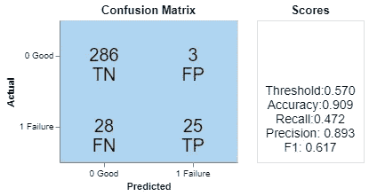

# 从评估到启示：深入了解交叉验证中的样本外预测

> 原文：[`towardsdatascience.com/from-evaluation-to-enlightenment-delving-into-out-of-sample-predictions-in-cross-validation-2db0850463c8`](https://towardsdatascience.com/from-evaluation-to-enlightenment-delving-into-out-of-sample-predictions-in-cross-validation-2db0850463c8)

## 通过折叠外预测揭示洞察和克服局限性。

 [宁佳](https://medium.com/@ning.jia?source=post_page-----2db0850463c8--------------------------------)

·发表于 [Towards Data Science](https://towardsdatascience.com/?source=post_page-----2db0850463c8--------------------------------) ·6 分钟阅读·2023 年 6 月 28 日

--

理解交叉验证并将其应用于实际工作是每个数据科学家的必备技能。虽然交叉验证的主要目的是评估模型性能和微调超参数，但它还提供了额外的输出值得注意。通过获取和结合每个折叠的预测，我们可以生成整个训练集的模型预测，这通常被称为**样本外预测或折叠外预测**。

不应忽视这些预测，因为它们包含了关于建模方法和数据集本身的宝贵信息。通过深入探索这些预测，你可能会发现诸如模型为何无法按预期工作、如何提升特征工程、以及数据中是否存在固有的局限性等问题的答案。

总体方法很简单：调查模型在高置信度下却犯错误的样本。在本文中，我将展示这些预测如何帮助我在三个实际项目中。

## 查找数据局限性

我曾参与一个预测性维护项目，其目标是提前预测车辆故障。我探索的一种方法是训练一个二分类器。这是一种相对简单直接的方法。

在使用时间序列交叉验证进行训练后，我检查了样本外预测。具体而言，我关注了假阳性和假阴性，即模型难以学习的样本。这些错误预测并不总是由模型自身的缺陷引起的。也有可能是某些样本之间存在冲突，导致模型混淆。

我发现几个标记为故障的假阴性案例，模型很少将它们视为故障。这一观察引起了我的好奇心。经过进一步调查，我发现许多与这些假阴性样本几乎相同的准确负样本。

下面的图 1 通过数据可视化比较了假阴性和真阴性。我不会详细讲解。这个想法是基于欧几里得距离或马氏距离在原始数据空间中运行最近邻算法；我发现与这些假阴性样本非常接近的样本都是实际的真阴性。换句话说，这些故障实例被许多好的实例所包围。

图 1\. 一个假阴性与一个真阴性的比较。（图像来源于作者）

我们现在面临数据集的一个典型限制：混淆样本。要么标签错误，要么我们需要更多信息（更多维度）来进行区分。还有可能的第三种方法：将整个空间转换到一个新的空间，在那里混淆样本可以更容易地区分？在这里行不通。首先，混淆发生在原始输入数据中。就像在图像分类数据集中，一张图像标记为狗，另一张几乎相同的图像标记为猫。其次，这种思维方式是以模型为中心的，通常会增加模型的复杂性。

在向客户提出这些问题后，他们确认了标签是正确的。然而，他们也承认一些看似运行良好的车辆可能会在没有任何前兆的情况下突然出现故障，这很难预测。我发现的假阴性样本完美地展示了这些意外故障。

通过对交叉验证中样本外预测的分析，我不仅对问题和数据有了更深刻的理解，还为客户提供了展示数据集局限性的具体例子。这对我和客户都是宝贵的见解。

## 启发性特征工程

在这个项目中，客户希望使用车辆的道路数据来分类某些事件，例如车辆本身的变道或前方车辆的加速和变道。数据主要是从不同声呐传感器收集的时间序列数据。一些关键的信息是周围物体的相对速度和自车与周围车辆及车道的距离（在 x 和 y 方向上的距离）。还有通过摄像机录制的事件，由标注人员进行标注。

在对前方车辆变道事件进行分类时，我遇到了几个有趣的情况：模型将事件标记为正在发生，但实际情况却不一致。从数据科学的角度来看，它们是具有非常高概率预测的假阳性。

为了向客户提供模型预测的可视化表示，我向他们展示了短动画，如图 2 所示。模型会错误地将前方车辆标记为‘换车道’的时间段大约是 19:59 到 20:02。

图 2\. 事件检测的动画。 （图片由作者提供）

为了解决这个谜题，我观看了与这些实例相关的视频。结果发现道路在那些时刻是弯曲的！假设车道是直的，那么模型就是正确的。模型做出错误预测是因为它从未学习过车道可能是弯曲的。

数据中没有包含有关周围车辆与车道之间距离的信息。因此，模型被训练使用周围车辆到自身车辆的距离以及自身车辆到车道的距离来确定它们相对于车道的位置。为了修复这些情况，模型必须知道车道的曲率。与客户沟通后，我在数据集中发现了曲率信息，并基于几何公式构建了测量周围车辆和车道距离的显式特征。现在，模型性能提升，不会再产生这种误报。

## 纠正标签错误

在第三个示例中，我们旨在预测特定的机器测试结果（通过或失败），这可以被框定为一个二分类问题。

我开发了一个性能非常高的分类器，表明数据集应该有足够的相关信息来预测目标。为了改进模型并更好地理解数据集，让我们关注交叉验证中的样本外预测，其中模型会犯错误。假阳性和假阴性是值得深入探索的宝贵资源。

图 3\. 混淆矩阵。 （图片由作者提供）

图 3 是一个阈值相对较高的混淆矩阵。这三个假阳性意味着模型会将它们标记为失败，但实际情况是它们是好的。我们可以像上述示例那样通过改进特征工程来修复它们，或者提出这个问题：如果给定的标签是错误的，而模型实际上是正确的呢？人们会犯错。就像其他列的值可能是异常值或缺失值一样，目标列本身也可能嘈杂并容易出现不准确。

我不能轻易地通过最近邻方法的证据来展示这三个样本是错误的，因为数据空间很稀疏。于是我与客户讨论了数据标注的问题。我们一致认为，用于确定测试结果的一些标准存在缺陷，并且一些样本的标签可能是错误的或未知的。经过清理后，这三个样本的标签得到了修正，模型性能得到了提升。

我们不能总是责怪数据质量。但请记住，这两个方面**对于你的数据科学工作同样重要：改善模型和修正数据**。不要把所有精力都放在建模上，假设所有提供的数据都是无误的。相反，关注这两个方面是至关重要的。来自交叉验证的样本外预测是发现数据问题的强大工具。

欲了解更多信息，[labelerrors.com](https://labelerrors.com/)列出了流行基准数据集中的标签错误。

## 结论

交叉验证不仅仅提供一个评分，它还有多个用途。除了数值评估外，它还提供了从预测结果中提取有价值见解的机会。通过仔细分析成功的预测，我们可以更好地理解模型的优势，并识别出最具影响力的特征。同样，分析失败的预测可以揭示数据和模型的局限性，并激发潜在的改进思路。

我希望这个工具能在提升你的数据科学技能方面发挥重要作用。

如果你认为这篇文章值得点赞，我会非常开心。如果你喜欢，可以多点几次；谢谢！

[宁佳](https://medium.com/@ning.jia?source=post_page-----2db0850463c8--------------------------------)

## 时间序列的数据科学

[查看列表](https://medium.com/@ning.jia/list/data-science-for-time-series-7691e7b85020?source=post_page-----2db0850463c8--------------------------------)6 个故事！
