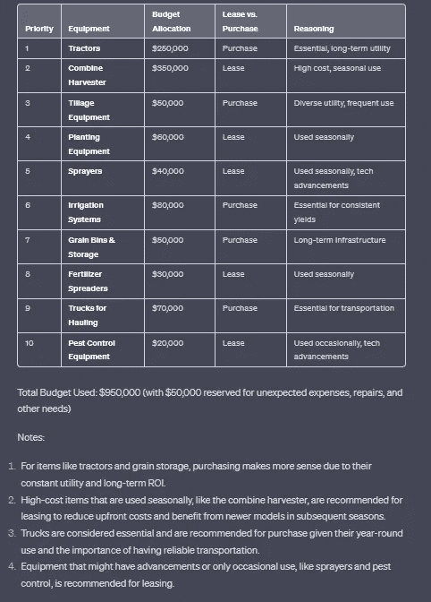
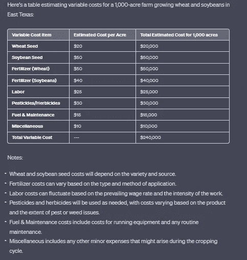
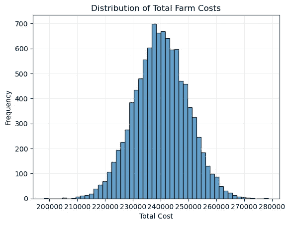
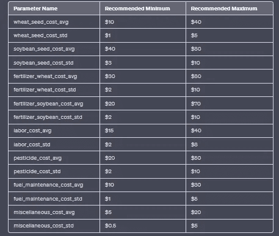
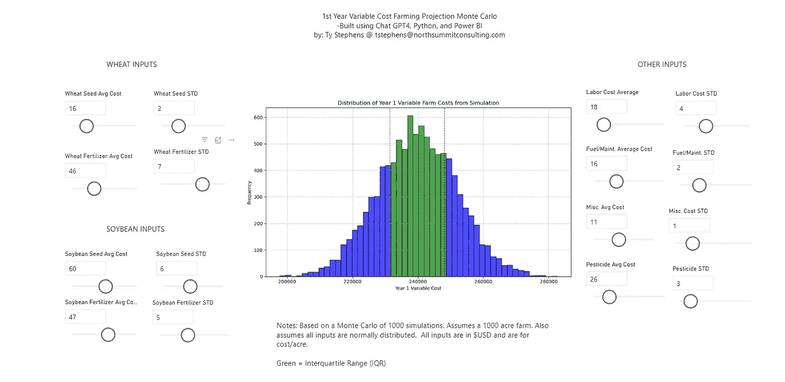

# 从穿孔卡到 ChatGPT

> 原文：[`towardsdatascience.com/from-punch-cards-to-chatgpt-42c2a09ac01a?source=collection_archive---------1-----------------------#2023-11-01`](https://towardsdatascience.com/from-punch-cards-to-chatgpt-42c2a09ac01a?source=collection_archive---------1-----------------------#2023-11-01)

## 我祖父的生成式人工智能一瞥

[](https://medium.com/@ty.stephens2011?source=post_page-----42c2a09ac01a--------------------------------)[](https://towardsdatascience.com/?source=post_page-----42c2a09ac01a--------------------------------) [Ty Stephens](https://medium.com/@ty.stephens2011?source=post_page-----42c2a09ac01a--------------------------------)

·

[关注](https://medium.com/m/signin?actionUrl=https%3A%2F%2Fmedium.com%2F_%2Fsubscribe%2Fuser%2Fe75d657968df&operation=register&redirect=https%3A%2F%2Ftowardsdatascience.com%2Ffrom-punch-cards-to-chatgpt-42c2a09ac01a&user=Ty+Stephens&userId=e75d657968df&source=post_page-e75d657968df----42c2a09ac01a---------------------post_header-----------) 发布在[Towards Data Science](https://towardsdatascience.com/?source=post_page-----42c2a09ac01a--------------------------------) ·9 分钟阅读·2023 年 11 月 1 日[](https://medium.com/m/signin?actionUrl=https%3A%2F%2Fmedium.com%2F_%2Fvote%2Ftowards-data-science%2F42c2a09ac01a&operation=register&redirect=https%3A%2F%2Ftowardsdatascience.com%2Ffrom-punch-cards-to-chatgpt-42c2a09ac01a&user=Ty+Stephens&userId=e75d657968df&source=-----42c2a09ac01a---------------------clap_footer-----------)

--

[](https://medium.com/m/signin?actionUrl=https%3A%2F%2Fmedium.com%2F_%2Fbookmark%2Fp%2F42c2a09ac01a&operation=register&redirect=https%3A%2F%2Ftowardsdatascience.com%2Ffrom-punch-cards-to-chatgpt-42c2a09ac01a&source=-----42c2a09ac01a---------------------bookmark_footer-----------)

我的母亲的父亲，Skip，在我眼中一直是一名农夫。不幸的是，我母亲在 1988 年我的出生后仅一个月就因白血病去世。作为家庭中的第一个孙子，我和 Skip 非常亲密。小时候，我常常坐在拖拉机和联合收割机的扶手上度过我的一天，后来成为青少年时，我也在农场做了一个夏季工作。


在夏季小麦收割期间，从空中俯瞰一台约翰迪尔联合收割机。在 20 世纪 90 年代末/21 世纪初，我和我的祖父在我们自己的小麦收割季节中使用了两台这样的机器。那是我的第一份“工作”。照片由[Scott Goodwill](https://unsplash.com/@scottagoodwill?utm_source=medium&utm_medium=referral)拍摄，来源于[Unsplash](https://unsplash.com/?utm_source=medium&utm_medium=referral)。

然而，Skip 早期的生活与我认识的农业世界大相径庭。在我进入这个场景之前，他已经深入学术领域，1972 年完成了德州农工大学（Texas A&M, College Station）的统计学博士课程。不久之后，他接受了马里兰大学的教授职位，并于 1974 年完成了他的论文。他开创性的研究旨在预测和定位工业环境中的安全和材料风险。这项艰巨的任务需要数年的努力。他不得不手动从不同公司收集十年的事故报告，手工处理统计数据，然后将这些见解转换为[大学计算机系统的打孔卡指令](https://en.wikipedia.org/wiki/Computer_programming_in_the_punched_card_era)。获取计算机使用时间*并非*立即可得；这需要提前几周甚至几个月预约。一个编码错误可能意味着从头开始，可能会使他的研究延迟几个月。

他在 1980 年代离开了那种生活，回到东德州接管家族农场，并开始了创业生涯。但在他作为农民的所有工作中，运用统计推断的愿望始终存在——只是我小时候并没有意识到。对我孩子的理解来说，Skip 在做他所称的“办公室工作”——但实际上他是在利用 IT 来预测和确保融资以应对运营开支，优化化肥中的化学成分以提高作物产量，通过在芝加哥商品交易所交易期货来降低现金流的不确定性，这些都是在他用 16 KB RAM 的[Radio Shack 购买的 TRS 80](https://en.wikipedia.org/wiki/TRS-80)上完成的，连接了一台点阵打印机。农业可以是一个利润微薄的行业——而 Skip 的赌注是他可以利用统计数据稍微拉平竞争环境。

多年来，这个农场没有经受住时间的考验。事实证明，当代际农业被迫跳过一代时，其效果并不好——而且今天的投入成本比以往任何时候都更为严苛——规模经济成为了唯一可以盈利竞争的方式——因此，Skip 一代的大多数中小型农场被收购和整合——但这是一种逐步发生的过程——一点一点地（至少我们是这样经历的）。

我当然逐渐欣赏到统计学与农业之间的紧密联系。我仍然记得来自[美国农业部](https://www.usda.gov/topics/data)的年度访问，他们详细采样作物产量（包括我们的农场），作为他们[国家农业统计服务](https://www.nass.usda.gov/)的一部分。在我看来，这是历史上一个伟大的未被充分重视的持续数据项目——帮助一代代农民做出“数据驱动”的决策——在那个词还未成为流行词之前。但我对 Skip 几十年来所做的一切有了更深的理解，因为我开始了自己的分析与数据科学事业——这是我在 20 多岁和 30 多岁时作为美国陆军军官服务和环球旅行后的第二幕。我经常通过电话与他联系，询问他们如何进行回归分析或模拟，或他们如何在“那时候”控制随机抽样。然后偶尔告诉他现在的做法，以评估他对我描述机器学习、深度学习、强化学习等概念的兴奋——对他来说，这有些像科幻小说——但他*喜欢*听这些——即使这在他晚年并不完全*真实*。


当我看到[约翰·迪尔在 2023 年 1 月 CES 上进行的主题演讲](https://www.youtube.com/watch?v=1kjZMHZl538)——展示了新设备，例如[上图所示的喷雾器](https://www.deere.com/en/sprayers/see-spray-ultimate/)，它使用 36 台相机、计算机视觉和神经网络实时检测杂草与作物，并最小化除草剂的使用。图像由作者提供。

实验开始了。

我决定在周末做出一个*展示而不是讲述*的决定。我希望 Skip 亲自体验新技术，而不仅仅是听我谈论它。如果我们能在不到 40 分钟内制定一个启动虚拟新农场的商业计划呢？我可以使用启用了高级数据分析的 ChatGPT 4，通过屏幕分享给他的 iPhone——我们一起合作完成它。

我们简要讨论了我们的假设：

1.  我们在东德克萨斯州有 1000 英亩的农田。

1.  我们有 100 万美元的启动资金用于购买设备。

1.  我们需要从银行获得一笔信用额度，以支付第一年的运营费用以启动项目。

1.  我们有兴趣种植小麦和大豆（Skip 曾经种植的作物）。

我们从简单开始：

**提示 1：** “为我写一个商业计划大纲，以启动东德克萨斯州的新农场，种植小麦和大豆”。

Skip 立刻对详细结果留下了深刻的印象。但等等，我们才刚刚开始……

**提示 2：** “给我一个我需要开始的设备清单”

**提示 3：** “将其放入表格中，并根据最紧急的到最不紧急的按数字优先级排序”。

**提示 4：** “现在创建一个新的预算分配列，假设我将使用租赁和购买的组合，创建一个额外的列来推荐租赁与购买，假设我有 100 万美元的启动资金。”

（时间耗时 4 分钟）

结果：



数据由 GPT-4 生成，图片由作者提供。

**提示 5：** “我应该留出多少资金来申请一条用于变动成本（种子、肥料、劳动力等）的信用额度，假设为 1000 英亩。创建一个新的表格。”

结果：



数据由 ChatGPT 4 生成，图片由作者提供

到了这个时候，我感觉 Skip 就像是再次目睹了阿波罗 11 号。他几乎抑制不住他的兴奋。但我们还没完成……

**提示 6：** “给我写一个 Monte Carlo 模拟，我可以调整输入假设并测试我的预算结果”

结果：

```py
import numpy as np
import matplotlib.pyplot as plt

# Define number of simulations
n_simulations = 10000

# Assumptions with [mean, std deviation]
wheat_seed_cost = [20, 2]  # Cost per acre
soybean_seed_cost = [50, 5]
fertilizer_wheat_cost = [50, 5]
fertilizer_soybean_cost = [40, 4]
labor_cost = [25, 3]
pesticide_cost = [30, 3]
fuel_maintenance_cost = [15, 2]
miscellaneous_cost = [10, 1]

def simulate_farm_costs():
    wheat_seed = np.random.normal(wheat_seed_cost[0], wheat_seed_cost[1])
    soybean_seed = np.random.normal(soybean_seed_cost[0], soybean_seed_cost[1])
    fertilizer_wheat = np.random.normal(fertilizer_wheat_cost[0], fertilizer_wheat_cost[1])
    fertilizer_soybean = np.random.normal(fertilizer_soybean_cost[0], fertilizer_soybean_cost[1])
    labor = np.random.normal(labor_cost[0], labor_cost[1])
    pesticide = np.random.normal(pesticide_cost[0], pesticide_cost[1])
    fuel_maintenance = np.random.normal(fuel_maintenance_cost[0], fuel_maintenance_cost[1])
    miscellaneous = np.random.normal(miscellaneous_cost[0], miscellaneous_cost[1])

    total_cost = (wheat_seed + soybean_seed + fertilizer_wheat + fertilizer_soybean + 
                  labor + pesticide + fuel_maintenance + miscellaneous) * 1000  # for 1000 acres

    return total_cost

results = [simulate_farm_costs() for _ in range(n_simulations)]

# Visualization
plt.hist(results, bins=50, edgecolor='black', alpha=0.7)
plt.title('Distribution of Total Farm Costs')
plt.xlabel('Total Cost')
plt.ylabel('Frequency')
plt.grid(True, alpha=0.2)
plt.show()
```

现在是关键时刻——代码会运行吗？我们跳到 Jupyter notebook 运行代码。第一次尝试就成功了：



数据由 ChatGPT 4 生成，图片由 Python 生成，图片由作者提供

到了这个时候，我们仅用了 10-15 分钟。还有一些时间……我们可以使它具有互动性吗？

我们需要创建一个参数列表，允许用户在滑块上动态调整假设。我们再次向 ChatGPT 寻求一些关于这些参数的建议，基于我们之前构建的 Monte Carlo 模拟：



数据由 GPT 4 生成，图片由作者提供

一旦我们建立了参数列表，我们在 Power BI 中创建了一个“度量”表，连接到 16 个切片器视觉效果，允许用户手动选择他们的输入并动态更新 Monte Carlo 模拟。为此，我们在 Power BI 中创建了一个“Python 视觉”，将所有度量拖入其中，然后更新代码如下：

```py
# The following code to create a dataframe and remove duplicated rows is always executed and acts as a preamble for your script: 

# dataset = pandas.DataFrame(fertilizer_soybean_cost_avg Value, fertilizer_soybean_cost_std Value, fertilizer_wheat_cost_avg Value, fertilizer_wheat_cost_std Value, fuel_maintenance_cost_avg Value, fuel_maintenance_cost_std Value, labor_cost_avg Value, labor_cost_std Value, miscellaneous_cost_avg Value, miscellaneous_cost_std Value, pesticide_cost_avg Value, pesticide_cost_std Value, soybean_seed_cost_avg Value, wheat_seed_cost_avg Value, wheat_seed_cost_std Value)
# dataset = dataset.drop_duplicates()

# Paste or type your script code here:

import numpy as np
import pandas as pd
import matplotlib.pyplot as plt

# Assuming the data from Power BI is passed as 'dataset'
df = dataset

# Fetch values from the dataset
wheat_seed_cost_avg = df['wheat_seed_cost_avg Value'].iloc[0]
wheat_seed_cost_std = df['wheat_seed_cost_std Value'].iloc[0]
soybean_seed_cost_avg = df['soybean_seed_cost_avg Value'].iloc[0]
soybean_seed_cost_std = df['soybean_seed_cost_std Value'].iloc[0]
fertilizer_wheat_cost_avg = df['fertilizer_wheat_cost_avg Value'].iloc[0]
fertilizer_wheat_cost_std = df['fertilizer_wheat_cost_std Value'].iloc[0]
fertilizer_soybean_cost_avg = df['fertilizer_soybean_cost_avg Value'].iloc[0]
fertilizer_soybean_cost_std = df['fertilizer_soybean_cost_std Value'].iloc[0]
labor_cost_avg = df['labor_cost_avg Value'].iloc[0]
labor_cost_std = df['labor_cost_std Value'].iloc[0]
pesticide_cost_avg = df['pesticide_cost_avg Value'].iloc[0]
pesticide_cost_std = df['pesticide_cost_std Value'].iloc[0]
fuel_maintenance_cost_avg = df['fuel_maintenance_cost_avg Value'].iloc[0]
fuel_maintenance_cost_std = df['fuel_maintenance_cost_std Value'].iloc[0]
miscellaneous_cost_avg = df['miscellaneous_cost_avg Value'].iloc[0]
miscellaneous_cost_std = df['miscellaneous_cost_std Value'].iloc[0]

# Define number of simulations
n_simulations = 10000

# Assumptions with [mean, std deviation]
wheat_seed_cost = [wheat_seed_cost_avg, wheat_seed_cost_std]
soybean_seed_cost = [soybean_seed_cost_avg, soybean_seed_cost_std]
fertilizer_wheat_cost = [fertilizer_wheat_cost_avg, fertilizer_wheat_cost_std]
fertilizer_soybean_cost = [fertilizer_soybean_cost_avg, fertilizer_soybean_cost_std]
labor_cost = [labor_cost_avg, labor_cost_std]
pesticide_cost = [pesticide_cost_avg, pesticide_cost_std]
fuel_maintenance_cost = [fuel_maintenance_cost_avg, fuel_maintenance_cost_std]
miscellaneous_cost = [miscellaneous_cost_avg, miscellaneous_cost_std]

def simulate_farm_costs():
    wheat_seed = np.random.normal(wheat_seed_cost[0], wheat_seed_cost[1])
    soybean_seed = np.random.normal(soybean_seed_cost[0], soybean_seed_cost[1])
    fertilizer_wheat = np.random.normal(fertilizer_wheat_cost[0], fertilizer_wheat_cost[1])
    fertilizer_soybean = np.random.normal(fertilizer_soybean_cost[0], fertilizer_soybean_cost[1])
    labor = np.random.normal(labor_cost[0], labor_cost[1])
    pesticide = np.random.normal(pesticide_cost[0], pesticide_cost[1])
    fuel_maintenance = np.random.normal(fuel_maintenance_cost[0], fuel_maintenance_cost[1])
    miscellaneous = np.random.normal(miscellaneous_cost[0], miscellaneous_cost[1])

    total_cost = (wheat_seed + soybean_seed + fertilizer_wheat + fertilizer_soybean +
                  labor + pesticide + fuel_maintenance + miscellaneous) * 1000  # for 1000 acres

    return total_cost

results = [simulate_farm_costs() for _ in range(n_simulations)]

# Convert results into a dataframe
df_simulated_results = pd.DataFrame(results, columns=['Total Cost'])

# Calculate the Interquartile Range (IQR)
Q1 = df_simulated_results['Total Cost'].quantile(0.25)
Q3 = df_simulated_results['Total Cost'].quantile(0.75)

# Plotting the histogram
plt.figure(figsize=(10, 6))
n, bins, patches = plt.hist(df_simulated_results['Total Cost'], bins=50, color='blue', edgecolor='black', alpha=0.7)
plt.title('Distribution of Year 1 Variable Farm Costs from Simulation')
plt.xlabel('Year 1 Variable Cost')
plt.ylabel('Frequency')
plt.grid(True, which='both', linestyle='--', linewidth=0.5)

# Shade the IQR
for i in range(len(bins)):
    if bins[i] > Q1 and bins[i] < Q3:
        patches[i].set_facecolor('green')

plt.axvline(Q1, color='red', linestyle='dashed', linewidth=1)
plt.axvline(Q3, color='red', linestyle='dashed', linewidth=1)
plt.tight_layout()
plt.savefig('simulated_costs_histogram.png')  # This will save the figure as an image file
plt.show()
```

只是为了好玩，我们提示 ChatGPT 定义四分位距（IQR）并将其着色为不同的颜色，我们还手动更新了图表标签和 x 轴。其余的只是稍微清理一下 Power BI 中的视觉效果，使其更用户友好。最终结果：



数据由用户选择的参数输入生成的 Monte Carlo 模拟，Python 代码由 ChatGPT 4 生成，仪表板在 MS PowerBI 中构建，图片由作者提供

现在我们有了一个动态的 Monte Carlo 模拟，可以用来测试不同的输入成本假设并预测我们启动农业运营所需的变动运营费用。借助 ChatGPT 4，我们几乎没有编写代码，只是稍微调整了一下，大部分工作通过屏幕共享在 iPhone 上完成，最后一部分在 Power BI desktop 中构建，并通过 Power BI iPhone 应用程序屏幕共享。总共花费了大约 30-40 分钟。

我祖父的评判？“我们在 40 分钟内完成了他自己‘过去’需要 2 年才能完成的工作。” 是的，我意识到我们还有很多*可以做的——*而且“模拟”远非完美。（例如，我们没有区分投入大豆与小麦的作物百分比。）但 40 分钟呢？即使是我也感到印象深刻。这就是生成 AI 的承诺——使数据科学民主化，鼓励实验，并加快在你手掌之间开发的能力。让祖父和孙子有机会通过一些统计数据重新建立联系，并以新的、出乎意料的方式利用技术。
