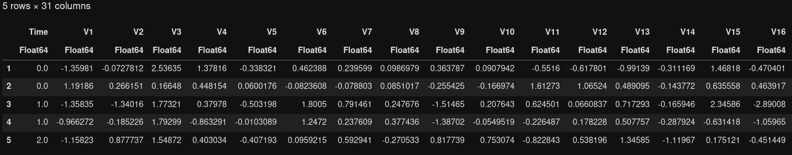

# 从 Python 到 Julia：基本数据操作和探索性数据分析

> 原文：[`towardsdatascience.com/from-python-to-julia-basic-data-manipulation-and-eda-51171b34f685`](https://towardsdatascience.com/from-python-to-julia-basic-data-manipulation-and-eda-51171b34f685)

图片由作者提供

 [王晟昊](https://medium.com/@wangshenghao1993?source=post_page-----51171b34f685--------------------------------)

·发表于 [Towards Data Science](https://towardsdatascience.com/?source=post_page-----51171b34f685--------------------------------) ·阅读时间 7 分钟·2023 年 6 月 20 日

--

作为统计计算领域的一种新兴编程语言，Julia 近年来获得了越来越多的关注。Julia 有两个特性使其优于其他编程语言。

+   Julia 是一种像 Python 一样的高级语言。因此，它易于学习和使用。

+   Julia 是一种编译语言，设计目标是与 C/C++ 一样快速。

当我第一次了解 Julia 时，我被它的计算速度吸引了。所以我决定尝试一下 Julia，看看我是否可以在日常工作中实际使用它。

作为一名数据科学从业者，我使用 Python 开发各种用途的原型 ML 模型。为了快速学习 Julia，我将模拟我在 Python 和 Julia 中构建简单 ML 模型的常规过程。通过将 Python 和 Julia 代码并排比较，我可以轻松捕捉这两种语言的语法差异。这就是本博客将按以下章节安排的原因。

# 设置

在开始之前，我们需要先在工作站上安装 Julia。Julia 的安装分为以下 2 步骤。

+   从 [官方网站](https://julialang.org/downloads/) 下载安装程序文件。

+   解压安装程序文件并创建指向 Julia 二进制文件的符号链接。

以下博客提供了安装 Julia 的详细指南。

 [## 在 Ubuntu 上安装 Julia

### 关于如何在 Ubuntu 上安装 Julia 并将内核添加到 Jupyter 的快速教程

medium.com](https://medium.com/coffee-in-a-klein-bottle/install-julia-1-5-on-ubuntu-bb8be4b2571d?source=post_page-----51171b34f685--------------------------------)

# 数据集

我将使用从 Kaggle 获得的[信用卡欺诈检测数据集](https://www.kaggle.com/mlg-ulb/creditcardfraud)。该数据集包含 492 个欺诈交易，出现在 284,807 个交易中。共有 30 个特征，包括交易时间、金额，以及通过 PCA 获得的 28 个主成分。交易的“Class”是待预测的目标变量，表示交易是否为欺诈。

类似于 Python，Julia 社区开发了各种包以支持 Julia 用户的需求。这些包可以通过 Julia 的包管理器 `Pkg` 安装，相当于 Python 的 `pip`。

我使用的欺诈检测数据采用典型的 .csv 格式。要在 Julia 中将 csv 数据加载为数据框，需要导入 `CSV` 和 `DataFrame` 包。DataFrame 包可以视为 Julia 中 Pandas 的等价物。

将结构化数据加载为数据框 — Julia 实现

下面是导入的数据的样子。

作者提供的图片

在 Jupyter 中，加载的数据集可以如上图所示。如果您希望查看更多列，一种快速的解决方案是指定环境变量 `ENV["COLUMNS"]`。否则，最多只会显示不到 10 列。

相应的 Python 实现如下。

将结构化数据加载为数据框 — Python 实现（作者提供的图片）

# 探索性数据分析（EDA）

探索性分析允许我们检查数据质量并发现特征之间的模式，这对特征工程和训练 ML 模型非常有用。

## 基本统计

我们可以从计算特征的一些简单统计数据开始，例如均值、标准差。类似于 Python 中的 Pandas，Julia 的 DataFrame 包提供了 `describe` 函数来实现这一目的。

使用 Julia 中的 describe 函数生成基本统计数据（作者提供的图片）

`describe` 函数允许我们生成 12 种基本统计数据。我们可以通过更改 `:all` 参数来选择生成哪一种，例如 `describe(df, :mean, :std)`。令人有些烦恼的是，如果不指定 `:all`，即使设置了显示列的上限，`describe` 函数也会不断遗漏统计数据的显示。这是 Julia 社区未来可以改进的地方。

Julia 遗漏了指定统计数据的打印 :-/（作者提供的图片）

## 类别平衡

欺诈检测数据集通常存在极端的类别不平衡问题。因此，我们希望了解两个类别之间的数据分布。在 Julia 中，这可以通过应用[“split-apply-combine”](https://dataframes.juliadata.org/stable/man/split_apply_combine/)函数来实现，这等同于 Python 中 Pandas 的“groupby-aggregate”函数。

检查类别分布——Julia 实现（图像由作者提供）

在 Python 中，我们可以使用`value_counts()`函数实现相同的目的。

检查类别分布——Python 实现（图像由作者提供）

## 单变量分析

接下来，让我们通过直方图深入了解特征的分布。特别是，我们以交易金额和时间为例，因为它们是数据集中唯一可解释的特征。

在 Julia 中，有一个名为[StatsPlots](https://github.com/JuliaPlots/StatsPlots.jl)的实用库，允许我们绘制各种常用的统计图表，包括直方图、条形图、箱形图等。

以下代码在两个子图中绘制了交易金额和时间的直方图。可以观察到交易金额高度偏斜。对于大多数交易，交易金额低于 100。交易时间遵循双峰分布。

绘制交易时间和交易金额的分布图——Julia 实现

绘制交易时间和交易金额的分布图——Julia 实现（图像由作者提供）

在 Python 中，我们可以使用 matplotlib 和 seaborn 创建相同的图表。

绘制交易时间和交易金额的分布图——Python 实现（图像由作者提供）

## 双变量分析

虽然上述单变量分析展示了交易金额和时间的一般模式，但它并未告诉我们这些与待预测的欺诈标志如何相关。为了快速了解特征与目标变量之间的关系，我们可以创建一个相关矩阵并通过热图进行可视化。

在创建相关矩阵之前，我们需要注意到数据高度不平衡。为了更好地捕捉相关性，需要对数据进行下采样，以避免特征的影响因数据不平衡而被“稀释”。这个过程需要数据框的切片和连接。以下代码演示了 Julia 中下采样的实现。

Julia 中的数据下采样（图像由作者提供）

上述代码统计了欺诈交易的数量，并将这些欺诈交易与相同数量的非欺诈交易结合起来。接下来，我们可以创建热图来可视化相关矩阵。

绘制热图以可视化相关矩阵——Julia 实现

结果热图如下所示。

由 Julia 绘制的特征相关性热图（图像由作者提供）

这里是 Python 中的下采样和热图绘制的等效实现。

下采样和绘制相关性热图 — Python 实现（图片由作者提供）

在对特征相关性进行概述后，我们希望深入研究与目标变量（在本例中为“Class”）显著相关的特征。从热图中可以观察到，以下经过 PCA 转换的特征与“Class”具有正相关关系：V2、V4、V11、V19，而具有负相关关系的特征包括 V10、V12、V14、V17。我们可以使用箱线图来检查这些突出特征对目标变量的影响。

在 Julia 中，可以使用上述的 [StatsPlots](https://github.com/JuliaPlots/StatsPlots.jl) 包来创建箱线图。在这里，我使用与“Class”正相关的 4 个特征作为示例来说明如何创建箱线图。

创建箱线图以可视化特征对“Class”的影响 — Julia 实现

`@df` 作为宏，用于表示在目标数据集上创建箱线图，即 `balanced_df`。结果图如下所示。

特征与“Class”之间的正相关箱线图（图片由作者提供）

以下代码可以用来在 Python 中创建相同的箱线图。

创建箱线图以可视化特征对“Class”的影响 — Python 实现（图片由作者提供）

# 插曲

在此，我将暂停，并简要评论一下我迄今为止使用 Julia 的“用户体验”。就语言语法而言，Julia 似乎介于 Python 和 R 之间。Julia 包提供了对数据处理和探索性数据分析（EDA）各种需求的全面支持。然而，由于 Julia 的发展仍处于早期阶段，这种编程语言仍然缺乏资源和社区支持。寻找某些数据处理练习的 Julia 实现，如 [展开类似列表的数据框列](https://pandas.pydata.org/docs/reference/api/pandas.DataFrame.explode.html)，可能需要花费很多时间。此外，Julia 的语法远未稳定，如 Python 3。此时，我不会说 Julia 是大型企业和企业的良好编程语言选择。

我们还未完成构建欺诈检测模型的工作。我将在下一篇博客中继续，敬请关注！

Jupyter notebook 可以在 [Github](https://github.com/Shenghao1993/shenghao-blogs-work/tree/main/julia-traditional-ml) 上找到。

## 参考文献

+   [布鲁塞尔自由大学机器学习小组](http://mlg.ulb.ac.be)。 (无日期)。*信用卡欺诈检测* [数据集]。 [`www.kaggle.com/datasets/mlg-ulb/creditcardfraud`](https://www.kaggle.com/datasets/mlg-ulb/creditcardfraud)
