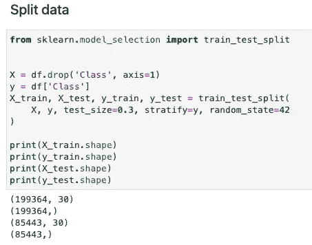
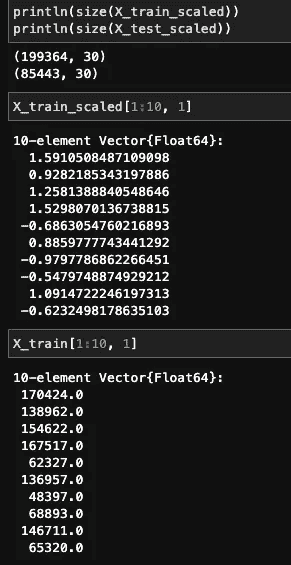
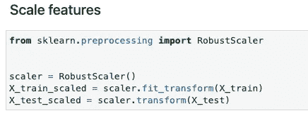
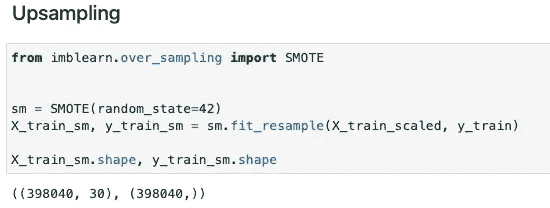
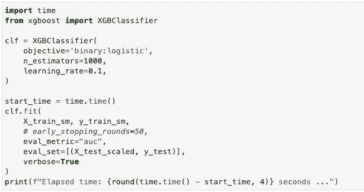
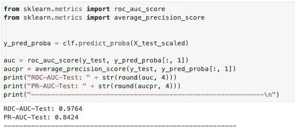

# 从 Python 到 Julia：特征工程与机器学习

> 原文：[`towardsdatascience.com/from-python-to-julia-feature-engineering-and-ml-d55e8321f888?source=collection_archive---------11-----------------------#2023-06-26`](https://towardsdatascience.com/from-python-to-julia-feature-engineering-and-ml-d55e8321f888?source=collection_archive---------11-----------------------#2023-06-26)

图片由 [CardMapr.nl](https://unsplash.com/ja/@cardmapr?utm_source=unsplash&utm_medium=referral&utm_content=creditCopyText) 提供，[Unsplash](https://unsplash.com/s/photos/credit-cards?utm_source=unsplash&utm_medium=referral&utm_content=creditCopyText) 上的

## 基于 Julia 的欺诈检测模型构建方法

 [王胜浩](https://medium.com/@wangshenghao1993?source=post_page-----d55e8321f888--------------------------------)

·

[关注](https://medium.com/m/signin?actionUrl=https%3A%2F%2Fmedium.com%2F_%2Fsubscribe%2Fuser%2F75535ec0f14c&operation=register&redirect=https%3A%2F%2Ftowardsdatascience.com%2Ffrom-python-to-julia-feature-engineering-and-ml-d55e8321f888&user=Wang+Shenghao&userId=75535ec0f14c&source=post_page-75535ec0f14c----d55e8321f888---------------------post_header-----------) 发表在 [Towards Data Science](https://towardsdatascience.com/?source=post_page-----d55e8321f888--------------------------------) ·6 分钟阅读·2023 年 6 月 26 日

--

这是我关于如何使用 Julia 进行应用数据科学的两部分系列中的第二部分。在 [第一篇文章](https://medium.com/towards-data-science/from-python-to-julia-basic-data-manipulation-and-eda-51171b34f685) 中，我们回顾了几个简单的数据操作示例以及使用 Julia 进行的探索性数据分析。在本博客中，我们将继续构建一个欺诈检测模型以识别欺诈性交易。

简要回顾，我们使用了从 Kaggle 获取的 [信用卡欺诈检测数据集](https://www.kaggle.com/datasets/mlg-ulb/creditcardfraud)。该数据集包含 30 个特征，包括交易时间、金额和 28 个通过 PCA 获得的主成分特征。下面是数据集前 5 个实例的截图，以数据框的形式加载到 Julia 中。请注意，交易时间特征记录了当前交易与数据集中第一笔交易之间的经过时间（以秒为单位）。

# 特征工程

在训练欺诈检测模型之前，让我们准备好供模型使用的数据。由于本博客的主要目的是介绍 Julia，因此我们不会在此进行特征选择或特征合成。

## 数据划分

在训练分类模型时，数据通常以分层的方式进行训练和测试划分。主要目的是在训练数据和测试数据中保持数据相对于目标类变量的分布。这在处理极度不平衡的数据集时尤其必要。[MLDataUtils](https://mldatautilsjl.readthedocs.io/en/latest/index.html#) 包在 Julia 中提供了一系列预处理函数，包括数据划分、标签编码和特征归一化。以下代码展示了如何使用 [MLDataUtils](https://mldatautilsjl.readthedocs.io/en/latest/index.html#) 的 `stratifiedobs` 函数进行分层抽样。可以设置随机种子以便重现相同的数据划分。

数据划分用于训练和测试 — Julia 实现

`stratifiedobs` 函数的使用与 Python 中 sklearn 库的 `train_test_split` 函数非常相似。请注意，输入特征 X 需要经过两次转置以恢复数据集的原始维度。这对于像我这样的 Julia 新手来说可能会令人困惑。我不确定 [MLDataUtils](https://mldatautilsjl.readthedocs.io/en/latest/index.html#) 的作者为何这样开发这个函数。

等效的 Python sklearn 实现如下。

数据划分用于训练和测试 — Python 实现（图片来源于作者）

## 特征缩放

作为机器学习中的推荐实践，特征缩放将特征调整到相同或类似的值范围或分布。特征缩放有助于提高训练神经网络时的收敛速度，并且避免了在训练过程中某个特征的主导地位。

尽管我们在这项工作中没有训练神经网络模型，但我仍然想了解如何在 Julia 中进行特征缩放。不幸的是，我找不到一个同时提供缩放器拟合和特征变换功能的 Julia 库。[特征归一化函数](https://mldatautilsjl.readthedocs.io/en/latest/data/feature.html)由 MLDataUtils 包提供，允许用户推导特征的均值和标准差，但不能方便地应用于训练/测试数据集以进行特征变换。由于特征的均值和标准差可以在 Julia 中轻松计算，我们可以手动实现标准缩放过程。

以下代码创建了 X_train 和 X_test 的副本，并在循环中计算每个特征的均值和标准差。

标准化特征 — Julia 实现

变换后的特征和原始特征如下所示。

缩放后的特征与原始特征 — Julia 实现（图像作者提供）

在 Python 中，sklearn 提供了多种特征缩放选项，包括归一化和标准化。通过声明一个特征缩放器，可以用两行代码完成缩放。以下代码展示了如何使用一个[RobustScaler](https://scikit-learn.org/stable/modules/generated/sklearn.preprocessing.RobustScaler.html)的示例。

对特征进行鲁棒缩放 — Python 实现（图像作者提供）

## 过采样（通过 PyCall）

欺诈检测数据集通常严重不平衡。例如，我们的数据集中负样本与正样本的比例超过了 500:1。由于无法获取更多的数据点，欠采样将导致多数类数据点的大量丢失，在这种情况下，过采样成为最佳选择。在这里，我使用了流行的 SMOTE 方法来为正类创建合成样本。

目前，没有可用的 Julia 库提供 SMOTE 的实现。[ClassImbalance](https://github.com/bcbi/ClassImbalance.jl) 包已经有两年未维护，无法与最近的 Julia 版本兼容。幸运的是，Julia 允许我们使用一个名为[PyCall](https://github.com/JuliaPy/PyCall.jl)的包装库来调用现成的 Python 包。

要将 Python 库导入 Julia，我们需要安装 PyCall 并将 PYTHONPATH 指定为环境变量。我尝试创建一个 Python 虚拟环境，但没有成功。由于某种原因，Julia 无法识别虚拟环境的 Python 路径。因此，我不得不指定系统默认的 Python 路径。之后，我们可以导入由[imbalanced-learn](https://github.com/scikit-learn-contrib/imbalanced-learn)库提供的 Python 实现的 SMOTE。PyCall 提供的 `pyimport` 函数可以用于在 Julia 中导入 Python 库。以下代码展示了如何在 Julia 内核中激活 PyCall 并寻求 Python 的帮助。

使用 SMOTE 进行上采样训练数据 — Julia 实现

相应的 Python 实现如下。我们可以看到，`fit_resample` 函数在 Julia 中的用法是相同的。

使用 SMOTE 进行上采样训练数据 — Python 实现（图片由作者提供）

# 模型训练

现在我们进入模型训练阶段。我们将训练一个二分类器，这可以通过多种机器学习算法完成，包括逻辑回归、决策树和神经网络。目前，Julia 中的机器学习资源分布在多个 Julia 库中。让我列出几个最受欢迎的选项及其专业化的模型。

+   [MLJ](https://github.com/alan-turing-institute/MLJ.jl)：传统机器学习算法

+   [ScikitLearn](https://github.com/cstjean/ScikitLearn.jl)：传统机器学习算法

+   [Mocha](https://github.com/pluskid/Mocha.jl)：神经网络

+   [Flux](https://github.com/FluxML/Flux.jl)：神经网络

在这里，我选择了[XGBoost](https://github.com/dmlc/XGBoost.jl)，考虑到它的简洁性和在传统回归及分类问题上的卓越表现。训练 XGBoost 模型的过程在 Julia 中与 Python 相同，尽管语法上有一些小的差异。

使用 XGBoost 训练欺诈检测模型 — Julia 实现

相应的 Python 实现如下。

使用 XGBoost 训练欺诈检测模型 — Python 实现（图片由作者提供）

# 模型评估

最后，让我们通过查看在测试数据上获得的精度、召回率，以及训练模型所花费的时间来评估模型的表现。在 Julia 中，精度、召回率指标可以通过[EvalMetrics](https://github.com/VaclavMacha/EvalMetrics.jl)库计算。另一个可以实现相同目的的包是[MLJBase](https://github.com/JuliaAI/MLJBase.jl)。

进行预测和计算指标 — Julia 实现

在 Python 中，我们可以使用 sklearn 来计算指标。

进行预测和计算指标 — Python 实现（图片由作者提供）

那么 Julia 和 Python 哪个是赢家？为了公平比较，两种模型都使用默认超参数进行训练，学习率 = 0.1，估算器数量 = 1000。性能指标总结在下面的表格中。

可以观察到，Julia 模型在训练时间稍长的情况下，达到了更好的精确度和召回率。由于用于训练 Python 模型的 [XGBoost](https://github.com/dmlc/xgboost) 库底层是用 C++ 编写的，而 [Julia XGBoost](https://github.com/dmlc/XGBoost.jl) 库完全用 Julia 编写，Julia 的运行速度确实与 C++ 一样快，就像它所声称的那样！

用于上述测试的硬件：第 11 代 Intel® Core™ i7–1165G7 @ 2.80GHz — 4 核心。

Jupyter notebook 可以在 [Github](https://github.com/shenghaowang/shenghao-blogs-work/tree/main/julia-traditional-ml) 找到。

# 收获

我想以对不同数据科学任务的 Julia 库的总结结束这一系列内容。

由于缺乏社区支持，目前 Julia 的可用性无法与 Python 相比。然而，鉴于其优越的性能，Julia 仍然在未来具有很大的潜力。

## **参考文献**

+   [布鲁塞尔自由大学机器学习小组 (Université Libre de Bruxelles)](http://mlg.ulb.ac.be/)。 (无日期)。*信用卡欺诈检测* [数据集]。[H](https://www.kaggle.com/datasets/mlg-ulb/creditcardfraud)i i (数据库内容许可证 (DbCL))

+   Akshay Gupta. 2021 年 5 月 13 日。*使用 Julia 开始机器学习：顶级 Julia 机器学习库*。[`www.analyticsvidhya.com/blog/2021/05/top-julia-machine-learning-libraries/`](https://www.analyticsvidhya.com/blog/2021/05/top-julia-machine-learning-libraries/)
