# 统计学基础：所有数据科学家和分析师应知——带代码——第一部分

> 原文：[`towardsdatascience.com/fundamentals-of-statistics-all-data-scientists-analysts-should-know-with-code-part-1-d6ac0f4b99b5`](https://towardsdatascience.com/fundamentals-of-statistics-all-data-scientists-analysts-should-know-with-code-part-1-d6ac0f4b99b5)

## 本文是对数据科学家和数据分析师统计学基础的全面概述

[](https://zoumanakeita.medium.com/?source=post_page-----d6ac0f4b99b5--------------------------------)[](https://towardsdatascience.com/?source=post_page-----d6ac0f4b99b5--------------------------------) [Zoumana Keita](https://zoumanakeita.medium.com/?source=post_page-----d6ac0f4b99b5--------------------------------)

·发表于 [Towards Data Science](https://towardsdatascience.com/?source=post_page-----d6ac0f4b99b5--------------------------------) ·阅读时间 8 分钟·2023 年 1 月 31 日

--

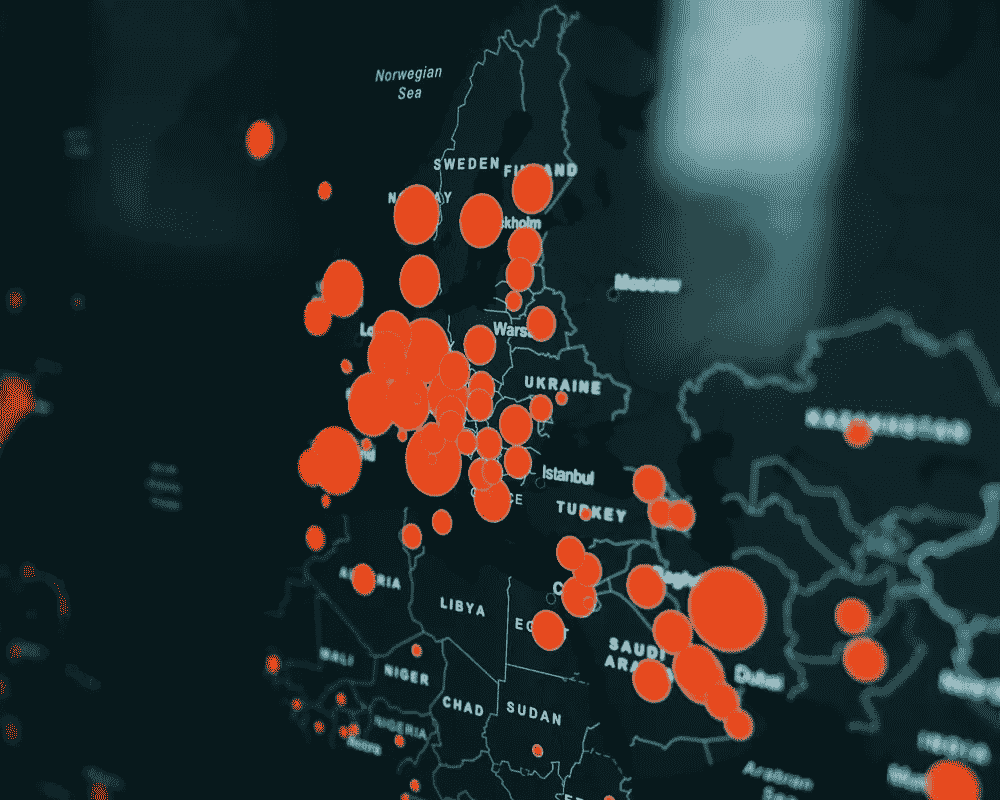

图片来源：[Clay Banks](https://unsplash.com/@claybanks) 在 [Unsplash](https://unsplash.com/photos/no2blvVYoJw)

# 动机

构建机器学习模型对于做出预测很酷。然而，当涉及到更好地理解业务问题时，它们并不适用，这需要在统计建模中投入最多的时间。

本文将首先帮助你建立统计学基础的理解，这对数据科学家和数据分析师的日常活动是有益的，以帮助业务做出可操作的决策。它还将指导你通过实际操作，使用 Python 练习这些统计概念。

如果你喜欢视频而不是阅读文章，那么这适合你 👇🏽

# 总体和样本之间有什么区别？

在开始处理数据之前，让我们首先了解总体和样本的概念。

→ 一个**总体**是你感兴趣的所有项目的集合（事件、人物、物体等）。在下面的图片中，总体由七个人组成。

→ 一个**样本**则是总体的一个子集。图片中的样本包含两个人。

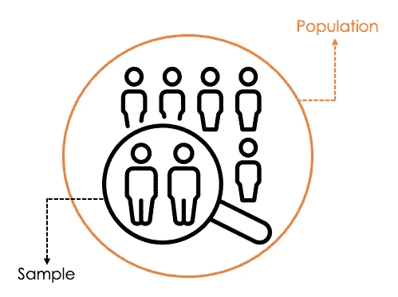

样本和总体的示意图（图片来源：作者）

在现实生活中，很难找到和观察总体。然而，收集样本的时间更少，成本更低。这些是我们更喜欢处理样本的主要原因，大多数统计测试也设计为处理不完整的数据，即样本。

样本需要满足以下两个标准以确保有效性：`(1) 随机` 和 `(2) 代表性`。

→ **随机样本**意味着样本中的每个元素都是从总体中严格随机选择的。

→ 当样本准确地反映总体时，它是**代表性的**。例如，当总体包括男性和女性时，样本不应仅包含男性。

# 数据有哪些不同类型？

现实生活中的数据由不同类型组成。了解它们很重要，因为不同类型的数据具有不同的特征，并且以不同的方式收集和分析。

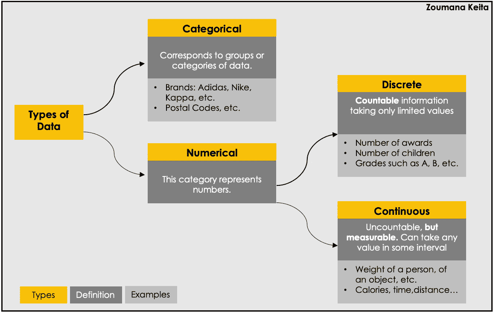

数据的不同类型（作者提供的图片）

# 中心趋势的主要度量有哪些？

中心趋势的主要度量有三个：***均值***、***中位数***和***众数***。在探索数据时，应同时应用这三种度量，以便得出更好的结论。然而，仅使用其中一个可能会导致对数据提供不准确的信息。

本节重点定义它们的每一个，包括其优缺点。

## **均值**

也称为平均值 (**µ** 对于总体，**x** 带有上标对于样本)。它对应于有限数字集的中心。均值通过将所有数字除以元素的总数来计算。考虑一个数字集合 `*x1, x2, …, xn*`，均值定义如下：

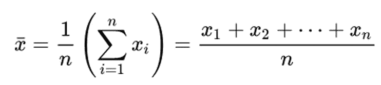

[维基百科](https://en.wikipedia.org/wiki/Mean)中的均值公式

+   `*x*`带有上标表示样本均值。

+   `*n*`表示样本集中的观察总数。

以下是 Python 中的实现。

```py
# Import the mean function from statistics module
from statistics import mean

# Define the set of numbers
data = [5, 53, 4, 8, 6, 9, 1]

# Compute the mean
mean_value = mean(data)

print(f"The mean of {data} is {mean_value} ")
```

之前的代码应生成以下结果：

```py
The mean of [5, 53, 4, 8, 6, 9, 1] is 12.28
```

尽管均值主要被使用，但它确实存在一个问题，就是容易受到异常值的影响，因此可能不是得出相关结论的最佳选择。

## **中位数**

中位数表示数据在按升序或降序排列后的中间值，公式如下。

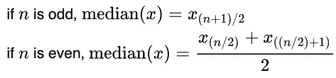

[维基百科](https://en.wikipedia.org/wiki/Median)中的中位数公式

与均值相对，中位数不受异常值的影响，因此可以是更好的中心趋势度量。然而，中位数和均值仅适用于数值数据。

使用上述相同的数据，我们可以如下计算中位数：

```py
# Import the median function from statistics module
from statistics import median

# Compute the median
median_value = median(data)

print(f"The median of {data} is {median_value} ")
```

执行结果如下：

```py
 The median of [5, 53, 4, 8, 6, 9, 1] is 6 
```

让我们详细分析数据的中位数计算过程。

+   第 1 步：将数据按升序排列：[1, 4, 5, 6, 8, 9, 53]

+   第 2 步：在我们的例子中，`n = 7`是奇数。

+   第 3 步：中间值是 `(n + 1)/2` 项，即 `(7+1)/2 = 4`，因此为 6。

## **众数**

它对应于数据中出现频率最高的值，可以应用于数值和分类变量。

类似于中位数，模式对异常值不敏感。然而，当数据中的所有值出现的次数相同时，模式不存在。大多数情况下，我们在数据中最多可以观察到三种模式。

让我们使用一个不同的数据集来说明模式的使用。

```py
# Define the data
data = [5, 9, 4, 9, 7, 9, 1]

# Compute the mode
mode_value = mode(data)

print(f"The mode of {data} is {mode_value} ")
```

数据中所有值只出现一次，除了 9 出现了三次。由于模式对应于出现次数最多的值，上述代码的结果如下：

```py
The mode of [5, 9, 4, 9, 7, 9, 1] is 9
```

# 形状的度量指标是什么？

`Skewness`和`Kurtosis`是可以更好地描述给定数据集形状的两种主要技术。本节将详细介绍每一种技术，包括使用 Python 的示例。

在深入解释每个概念之前，让我们导入必要的 Python 库。

+   `Numpy`用于处理数组。

+   `scipy`模块用于统计分析。

+   为了可视化，我们使用`matplotlib`库。

```py
import numpy as np
import scipy.stats as stats
import matplotlib.pyplot as plt
from scipy.stats import beta, kurtosis
```

## **偏斜度**

当数据的概率分布在均值周围不对称时，数据被称为偏斜。根据偏斜度的值，可以出现三种主要情况。

以下辅助函数用于示例和绘制每种情况。

```py
# Use the seed to get the same results for randomization
np.random.seed(2023)

def plot_skewness(data, label):

    plt.hist(data, density=True, color='orange', alpha=0.7, label=label)
    plt.axvline(data.mean(), color='green', linestyle='dashed', linewidth=2, label='Mean')
    plt.axvline(np.median(data), color='blue', linestyle='dashed', linewidth=2, label='Median')
    plt.legend()
    plt.show()
```

+   当数据符合正态分布时，偏斜度是对称的。在这种情况下，`Mean = Median = Mode.`

```py
# Normal distribution
normal_data = np.random.normal(0, 1, 1000)
label = 'Normal: Symetric Skewness'
plot_skewness(normal_data, label)
```

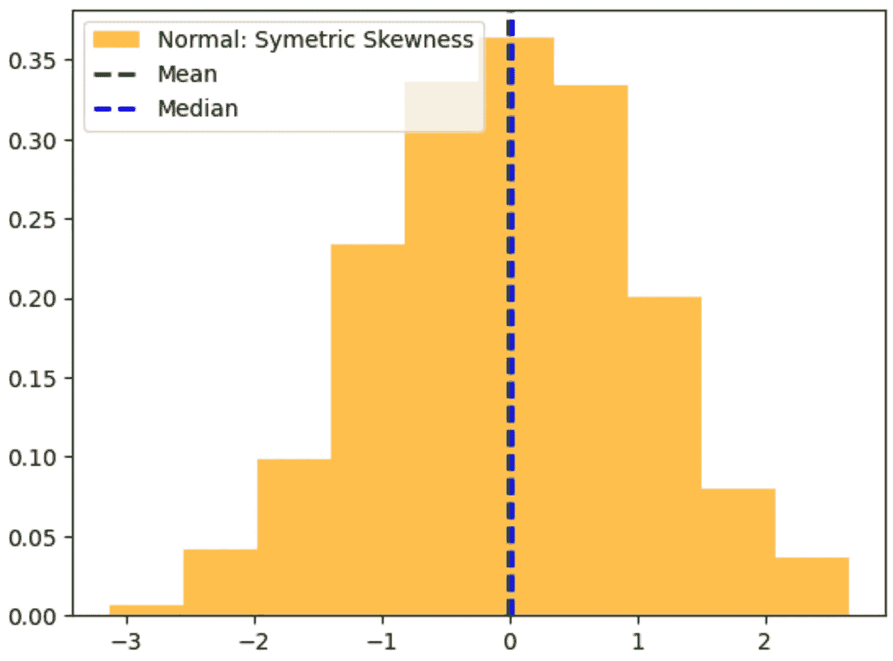

正态分布或对称偏斜（图像来源于作者）

+   当值大于零时，存在正偏斜或右偏。这意味着均值右侧的值较多，均值位于中位数的右侧。在这种情况下，我们有`Mean > Median > Mode.`

```py
# Exponential distribution
exp_data = np.random.exponential(1, 1000)
label = 'Exponential: Positive Skewness'
plot_skewness(exp_data, label)
```

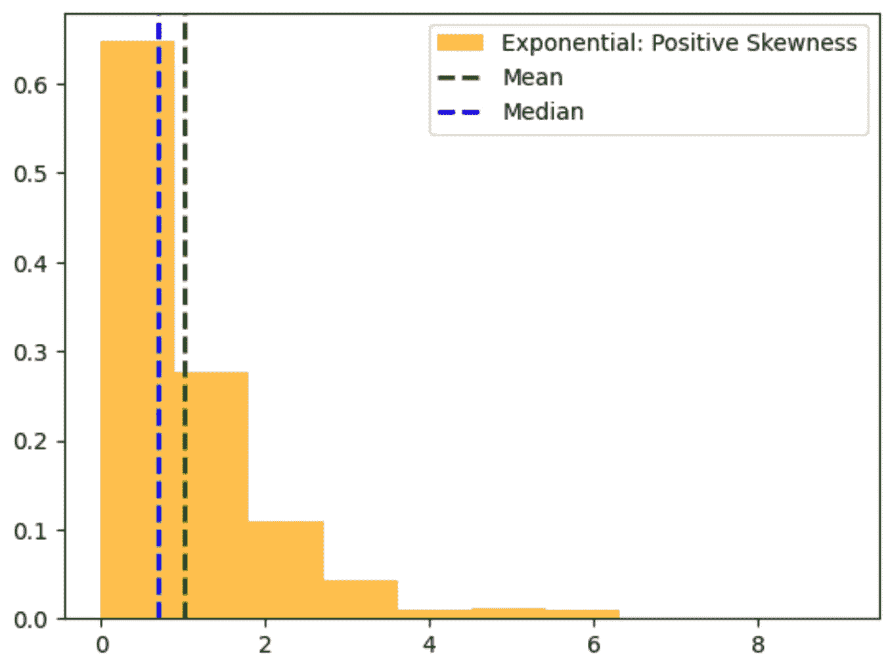

正偏斜的示意图（图像来源于作者）

+   当值小于零时，存在负偏斜或左偏。在这种情况下，左侧的值较多，我们通常发现均值位于中位数的左侧。在这种情况下，`Mean < Median < Mode.` 

```py
# Beta 
beta_data = beta.rvs(5, 2, size=10000)
label = 'Beta: Negative Skewness'
plot_skewness(beta_data, label)
```

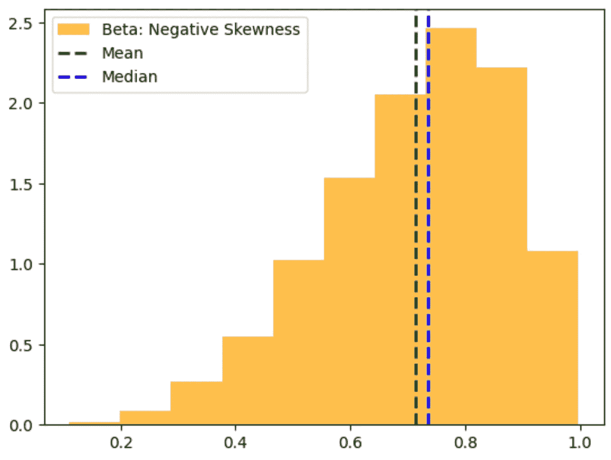

负偏斜的示意图（图像来源于作者）

## **峰度**

峰度度量量化了分布尾部的权重与分布其余部分的比例。它告诉我们数据是分散还是集中在均值附近。

具有较高均值集中度的分布被称为具有高峰度。低峰度与更平坦的分布相关，该分布中较少的数据集中在均值附近。

此外，峰度用于检查数据是否符合正态分布，也用于检测数据中的异常值。

数据可以展示三种主要类型的峰度：`(1) Mesokurtic`、`(2) Leptokurtic`和`(3) Platykurtic`。除了说明每个概念外，还将展示如何计算每一种类型的 Python 代码。

`**(1) Mesokurtic**`在这种情况下，`kurtosis=3`。这意味着峰度类似于正态分布，主要用作与现有分布的基准。

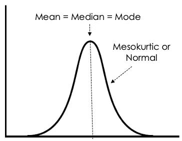

Mesokurtic 分布的插图（图像作者提供）

`**(2) Leptokurtic**`，也称为正峰度，其`kurtosis>3`。通常被称为“尖峰”分布，`Leptokurtic`在均值周围的数据集中的浓度高于正态分布。

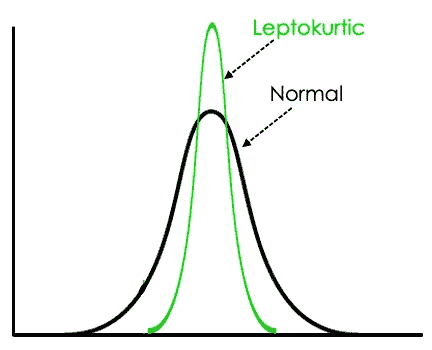

Leptokurtic 分布的插图（图像作者提供）

`**(3) Platykurtic**`，也称为负峰度，其`kurtosis<3`。通常被称为“平坦”分布，`Leptokurtic`在均值周围的数据集中度低于`Platykurtic`峰度，且尾部较短。


Platykurtic 分布的插图（图像作者提供）

以下代码来自[scipy](https://docs.scipy.org/doc/scipy/reference/generated/scipy.stats.kurtosis.html)的官方文档，完美演示了如何计算峰度。

```py
x = np.linspace(-5, 5, 100)
ax = plt.subplot()
distnames = ['laplace', 'norm', 'uniform']

for distname in distnames:
    if distname == 'uniform':
        dist = getattr(stats, distname)(loc=-2, scale=4)
    else:
        dist = getattr(stats, distname)
    data = dist.rvs(size=1000)
    kur = kurtosis(data, fisher=True)
    y = dist.pdf(x)
    ax.plot(x, y, label="{}, {}".format(distname, round(kur, 3)))
    ax.legend()
```

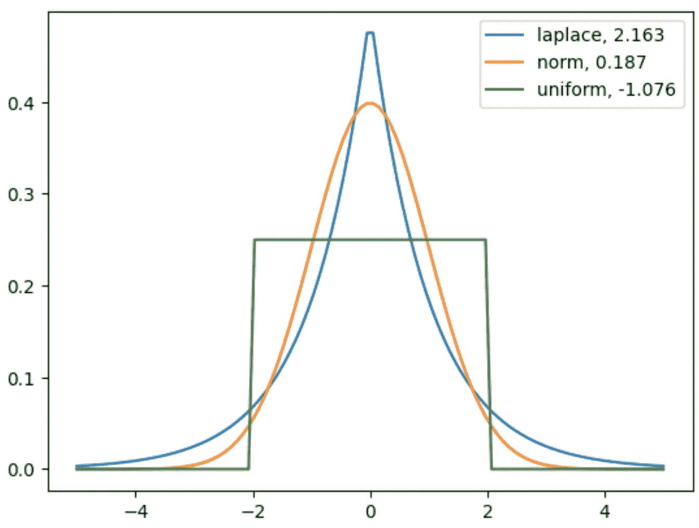

三种主要峰度及其值的插图（图像来自代码）

+   拉普拉斯分布具有`Leptokurtic`峰度的特性。它的尾部比正态分布的尾部更为明显。

+   均匀分布由于其负峰度（`Platykurtic`）具有最不明显的尾部。

# 结论

本系列的第一部分涵盖了不同类型的数据、样本与总体之间的差异、主要的集中趋势度量以及最终的偏度度量。

敬请关注下一部分，我们将讨论更多主题，帮助你获得相关的统计技能。

如果你喜欢阅读我的故事并希望支持我的写作，考虑[成为 Medium 会员](https://zoumanakeita.medium.com/membership)。每月$5 的承诺，你将解锁 Medium 上无限制访问故事的权限。

想请我喝咖啡☕️吗？→ [点击这里](http://www.buymeacoffee.com/zoumanakeig)!

随时在[Medium](https://zoumanakeita.medium.com/)、[Twitter](https://twitter.com/zoumana_keita_)和[YouTube](https://www.youtube.com/channel/UC9xKdy8cz6ZuJU5FTNtM_pQ)上关注我，或者在[LinkedIn](https://www.linkedin.com/in/zoumana-keita/)上打招呼！讨论 AI、ML、数据科学、NLP 和 MLOps 总是令人愉快的！

源代码可在[GitHub](https://github.com/keitazoumana/Medium-Articles-Notebooks/blob/main/Statistics_Fundamental_Part1.ipynb)上获取。
