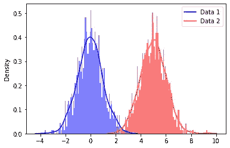
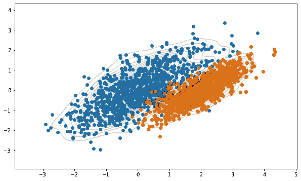
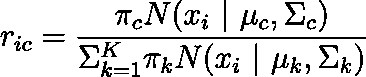
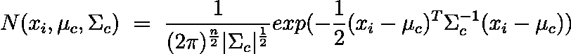
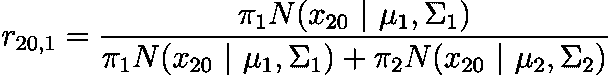
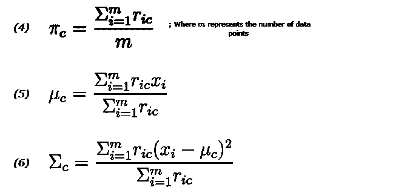
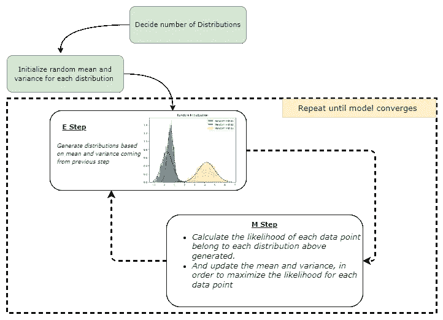
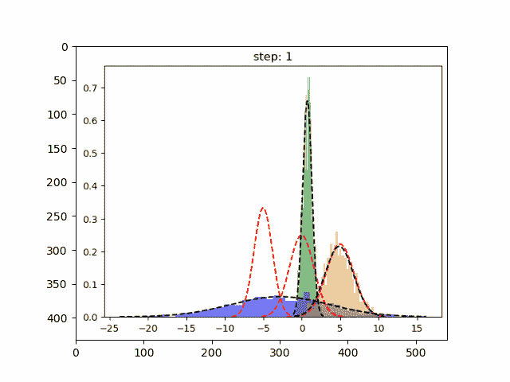
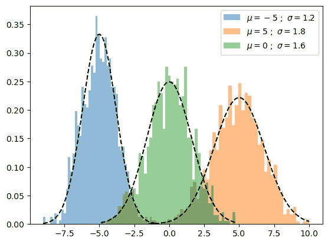
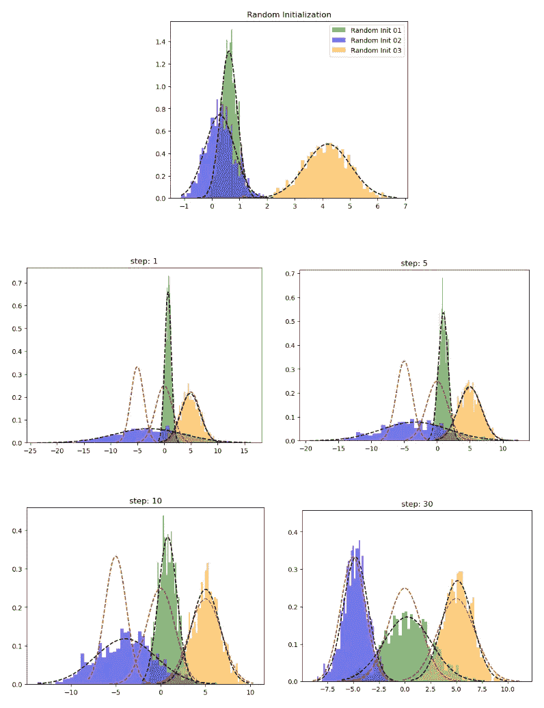

# 高斯混合模型清晰解释

> 原文：[`towardsdatascience.com/gaussian-mixture-model-clearly-explained-115010f7d4cf`](https://towardsdatascience.com/gaussian-mixture-model-clearly-explained-115010f7d4cf)

## 学习 GMM 所需的唯一指南

[](https://ransakaravihara.medium.com/?source=post_page-----115010f7d4cf--------------------------------)[](https://towardsdatascience.com/?source=post_page-----115010f7d4cf--------------------------------) [Ransaka Ravihara](https://ransakaravihara.medium.com/?source=post_page-----115010f7d4cf--------------------------------)

·发布于[数据科学前沿](https://towardsdatascience.com/?source=post_page-----115010f7d4cf--------------------------------) ·阅读时间 9 分钟·2023 年 1 月 10 日

--


图片由[Planet Volumes](https://unsplash.com/@planetvolumes?utm_source=medium&utm_medium=referral)提供，来源于[Unsplash](https://unsplash.com/?utm_source=medium&utm_medium=referral)

当我们谈论高斯混合模型（以下简称 GMM）时，了解 KMeans 算法的工作原理是至关重要的。因为 GMM 与 KMeans 非常相似，实际上它是 KMeans 的概率版本。这种概率特性使 GMM 可以应用于 KMeans 无法适应的许多复杂问题。

总结来说，KMeans 具有以下限制：

1.  它假设簇是球形且大小相等，这在大多数现实世界场景中并不成立。

1.  这是一种硬聚类方法，意味着每个数据点被分配到一个单独的簇中。

由于这些限制，当我们进行机器学习项目时，应了解 KMeans 的替代方案。本文将探讨 KMeans 聚类的最佳替代方案之一，即高斯混合模型。

在本文中，我们将涵盖以下要点。

1.  高斯混合模型（GMM）算法的工作原理——通俗易懂。

1.  GMM 背后的数学。

1.  从零开始使用 Python 实现 GMM。

## 高斯混合模型（GMM）算法的工作原理——通俗易懂

正如我之前提到的，我们可以将 GMM 称为概率 KMeans，因为 KMeans 和 GMM 的起点和训练过程是相同的。然而，KMeans 使用基于距离的方法，而 GMM 使用概率方法。GMM 有一个主要的假设：数据集由多个高斯分布组成，换句话说，是高斯混合。



高斯混合模型的混合体 | 作者图像

上述分布通常称为[多模态分布](https://en.wikipedia.org/wiki/Multimodal_distribution)。每个峰值代表数据集中的不同高斯分布或簇。但问题是，

> 我们如何估计这些分布？

在回答这个问题之前，让我们先创建一些高斯分布。请注意，我生成的是[多变量正态分布](https://en.wikipedia.org/wiki/Multivariate_normal_distribution)；它是[单变量正态分布](https://en.wikipedia.org/wiki/Normal_distribution)的高维扩展。

让我们定义数据点的均值和协方差。使用均值和[协方差](https://en.wikipedia.org/wiki/Covariance)，我们可以生成如下分布。

```py
# Set the mean and covariance
mean1 = [0, 0]
mean2 = [2, 0]
cov1 = [[1, .7], [.7, 1]]
cov2 = [[.5, .4], [.4, .5]]

# Generate data from the mean and covariance
data1 = np.random.multivariate_normal(mean1, cov1, size=1000)
data2 = np.random.multivariate_normal(mean2, cov2, size=1000)
```

让我们绘制数据。

```py
plt.figure(figsize=(10,6))

plt.scatter(data1[:,0],data1[:,1])
plt.scatter(data2[:,0],data2[:,1])

sns.kdeplot(data1[:, 0], data1[:, 1], levels=20, linewidth=10, color='k', alpha=0.2)
sns.kdeplot(data2[:, 0], data2[:, 1], levels=20, linewidth=10, color='k', alpha=0.2)

plt.grid(False)
plt.show()
```



如您所见，我们使用均值和协方差矩阵生成了随机的高斯分布。那么反转这一过程呢？这正是 GMM 在做的。但怎么做呢？

> 因为一开始我们对簇及其相关的均值和协方差矩阵没有任何见解。

好吧，按照以下步骤进行，

1.  决定簇的数量（为此，我们可以使用领域知识或其他方法，如[BIC/AIC](https://stats.stackexchange.com/questions/368560/elbow-test-using-aic-bic-for-identifying-number-of-clusters-using-gmm)）以适应给定数据集。假设我们有 1000 个数据点，并将组数设置为 2。

1.  为每个簇初始化均值、协方差和权重参数。（我们将在后面的部分进一步探讨）

1.  使用[期望最大化](https://en.wikipedia.org/wiki/Expectation%E2%80%93maximization_algorithm)算法完成以下任务，

+   期望步骤（E 步骤）：计算每个数据点属于每个分布的概率，然后使用当前参数估计值评估似然函数。

+   最大化步骤（M 步骤）：更新之前的均值、协方差和权重参数，以最大化在 E 步骤中找到的期望似然。

+   重复这些步骤直到模型收敛。

有了这些信息，我将结束对 GMM 算法的无数学解释。

# GMM 背后的数学

GMM 的核心在于前一部分描述的期望最大化（EM）算法。

让我们演示 EM 算法如何应用于 GMM。

***步骤 01：初始化均值、协方差和权重参数***

1.  均值（μ）：随机初始化。

1.  协方差（Σ）：随机初始化

1.  权重（混合系数）（π）：每类的比例表示特定数据点属于每个类别的可能性。一开始，这对于所有簇都是相等的。假设我们拟合一个具有三个组件的 GMM。在这种情况下，权重参数可能被设置为 1/3，对应于概率分布（1/3，1/3，1/3）。

**步骤 02：期望步骤（E 步骤）**

+   对于每个数据点𝑥𝑖：

+   使用以下方程计算数据点属于集群(𝑐)的概率。*k*是我们需要找到的分布数量。



方程 01 | 作者提供的图片

其中𝜋_𝑐是高斯分布 c 的混合系数（有时称为权重），在上一个阶段初始化，**𝑁**(𝒙 | 𝝁,𝚺)描述了具有均值𝜇和协方差Σ的高斯分布的概率密度函数（PDF），相对于数据点*x*；我们可以如下表示它。



方程 02 | 作者提供的图片

E 步使用当前模型参数的估计值计算这些概率。这些概率通常被称为高斯分布的“责任”。它们由变量*r_ic****,***表示，其中***i***是数据点的索引，***c***是高斯分布的索引。责任度量***c***-th 高斯分布对生成***i***-th 数据点的责任。这里使用了条件概率，更具体地说，是*贝叶斯定理*。

让我们举个简单的例子。假设我们有 100 个数据点，并且需要将它们聚类为两个组。我们可以将*r_ic(i=20,c=1)*写作如下。这里***i***表示数据点的索引，***c***表示我们考虑的集群的索引***.***

请注意，在开始时，𝜋_𝑐初始化为每个集群 c = 1,2,3,..,k 相等。在我们的例子中，𝜋_1 = 𝜋_2 **=** 1/2**.**



方程 03 | 作者提供的图片

E 步的结果是每个数据点和混合模型中每个高斯分布的责任集合。这些责任在 M 步中用于更新模型参数的估计值。

**步骤 03：最大化步骤（M 步）**

在这一步骤中，算法使用高斯分布的责任（在 E 步中计算得出）来更新模型参数的估计值。

M 步更新参数的估计值如下：



作者提供的图片

1.  使用上述方程 4 更新*πc*（混合系数）。

1.  使用上述方程 5 更新*μc*。

1.  然后使用第 6 个方程更新*Σc*。

更新后的估计值在下一次 E 步中用于计算数据点的新责任。

依此类推，这个过程会重复进行，直到算法收敛，通常在模型参数在一次迭代到下一次迭代之间变化不大时实现。

*很多丑陋且复杂的方程，对吧？ :)*

> 让我们将上述事实总结为一个简单的图表，



GMM 的 EM 步骤总结 | 作者提供的图片

不用担心；在编码时，每个方程只有一行代码。让我们开始使用 Python 从零开始实现 GMM。

# 使用 Python 从零开始实现 GMM。



动画 GMM | 作者提供的图像

首先，让我们创建一个虚假的数据集。在这一部分，我将为 1-D 数据集实现 GMM。

```py
import numpy as np

n_samples = 100
mu1, sigma1 = -5, 1.2 
mu2, sigma2 = 5, 1.8 
mu3, sigma3 = 0, 1.6 

x1 = np.random.normal(loc = mu1, scale = np.sqrt(sigma1), size = n_samples)
x2 = np.random.normal(loc = mu2, scale = np.sqrt(sigma2), size = n_samples)
x3 = np.random.normal(loc = mu3, scale = np.sqrt(sigma3), size = n_samples)

X = np.concatenate((x1,x2,x3))
```

让我们创建一个辅助函数来绘制我们的数据。

```py
from scipy.stats import norm

def plot_pdf(mu,sigma,label,alpha=0.5,linestyle='k--',density=True):
    """
    Plot 1-D data and its PDF curve.

    """
    # Compute the mean and standard deviation of the data

    # Plot the data

    X = norm.rvs(mu, sigma, size=1000)

    plt.hist(X, bins=50, density=density, alpha=alpha,label=label)

    # Plot the PDF
    x = np.linspace(X.min(), X.max(), 1000)
    y = norm.pdf(x, mu, sigma)
    plt.plot(x, y, linestyle)
```

并按照如下方式绘制生成的数据。请注意，我绘制的是每个样本的概率密度，而不是数据本身。

```py
plot_pdf(mu1,sigma1,label=r"$\mu={} \ ; \ \sigma={}$".format(mu1,sigma1))
plot_pdf(mu2,sigma2,label=r"$\mu={} \ ; \ \sigma={}$".format(mu2,sigma2))
plot_pdf(mu3,sigma3,label=r"$\mu={} \ ; \ \sigma={}$".format(mu3,sigma3))
plt.legend()
plt.show()
```



原始分布 | 作者提供的图像

让我们构建前面部分描述的每一步，

*步骤 01: 初始化均值、协方差和权重*

```py
def random_init(n_compenents):

    """Initialize means, weights and variance randomly 
      and plot the initialization
    """

    pi = np.ones((n_compenents)) / n_compenents
    means = np.random.choice(X, n_compenents)
    variances = np.random.random_sample(size=n_compenents)

    plot_pdf(means[0],variances[0],'Random Init 01')
    plot_pdf(means[1],variances[1],'Random Init 02')
    plot_pdf(means[2],variances[2],'Random Init 03')

    plt.legend()
    plt.show()

    return means,variances,pi
```

*步骤 02: 期望步骤 (E 步骤)*

```py
def step_expectation(X,n_components,means,variances):
    """E Step

    Parameters
    ----------
    X : array-like, shape (n_samples,)
        The data.
    n_components : int
        The number of clusters
    means : array-like, shape (n_components,)
        The means of each mixture component.
    variances : array-like, shape (n_components,)
        The variances of each mixture component.

    Returns
    -------
    weights : array-like, shape (n_components,n_samples)
    """
    weights = np.zeros((n_components,len(X)))
    for j in range(n_components):
        weights[j,:] = norm(loc=means[j],scale=np.sqrt(variances[j])).pdf(X)
    return weights
```

在这个函数之后，我们涵盖了我们在*E 步骤*中讨论的前两个方程。这里我们为当前模型参数*均值*和*方差*生成了高斯分布。我们通过使用 scipy 的 stat 模块完成了这一点。之后，我们使用 pdf 方法计算每个数据点在每个集群中的归属可能性。

*步骤 03: 最大化步骤 (M 步骤)*

```py
def step_maximization(X,weights,means,variances,n_compenents,pi):
    """M Step

    Parameters
    ----------
    X : array-like, shape (n_samples,)
        The data.
    weights : array-like, shape (n_components,n_samples)
        initilized weights array
    means : array-like, shape (n_components,)
        The means of each mixture component.
    variances : array-like, shape (n_components,)
        The variances of each mixture component.
    n_components : int
        The number of clusters
    pi: array-like (n_components,)
        mixture component weights

    Returns
    -------
    means : array-like, shape (n_components,)
        The means of each mixture component.
    variances : array-like, shape (n_components,)
        The variances of each mixture component.
    """
    r = []
    for j in range(n_compenents):  

        r.append((weights[j] * pi[j]) / (np.sum([weights[i] * pi[i] for i in range(n_compenents)], axis=0)))

        #5th equation above
        means[j] = np.sum(r[j] * X) / (np.sum(r[j]))

        #6th equation above
        variances[j] = np.sum(r[j] * np.square(X - means[j])) / (np.sum(r[j]))

        #4th equation above
        pi[j] = np.mean(r[j])

    return variances,means,pi
```

让我们实现训练循环。

```py
def train_gmm(data,n_compenents=3,n_steps=50, plot_intermediate_steps_flag=True):
    """ Training step of the GMM model

    Parameters
    ----------
    data : array-like, shape (n_samples,)
        The data.
    n_components : int
        The number of clusters
    n_steps: int
        number of iterations to run
    """

    #intilize model parameters at the start
    means,variances,pi = random_init(n_compenents)

    for step in range(n_steps):
        #perform E step
        weights = step_expectation(data,n_compenents,means,variances)
        #perform M step
        variances,means,pi = step_maximization(X, weights, means, variances, n_compenents, pi)

    plot_pdf(means,variances)
```

当我们开始模型训练时，我们将根据我们设置的*n_steps*参数进行 E 步骤和 M 步骤。

但在实际使用中，你会更常使用 scikit-learn 版本的 GMM。在那里，你可以找到额外的参数，例如

> ***tol***: 定义模型的停止标准。当下界平均增益低于*tol*参数时，EM 迭代将停止。
> 
> **init_params:** 用于初始化权重的方法

你可以参考[这里](https://scikit-learn.org/stable/modules/generated/sklearn.mixture.GaussianMixture.html)的文档。

好的，让我们看看我们手工制作的 GMM 的表现。



在上述图中，红色虚线代表原始分布，而其他图表示学习到的分布。在第 30 次迭代之后，我们可以看到我们的模型在这个玩具数据集上的表现良好。

如果你想跟随本文，你可以在这个[GitHub 仓库](https://github.com/Ransaka/GMM-from-scratch)中找到代码。

## *结论*

本文旨在提供高斯混合模型的全面指南；然而，鼓励读者尝试不同的机器学习算法，因为***没有一种最佳*** ***算法*** 能够适用于所有问题。此外，我们选择的机器学习算法的复杂性也是值得注意的。GMM 的一个常见问题是它对大数据集的扩展性较差。

感谢阅读！在[LinkedIn](https://www.linkedin.com/in/ransaka/)上与我联系。
