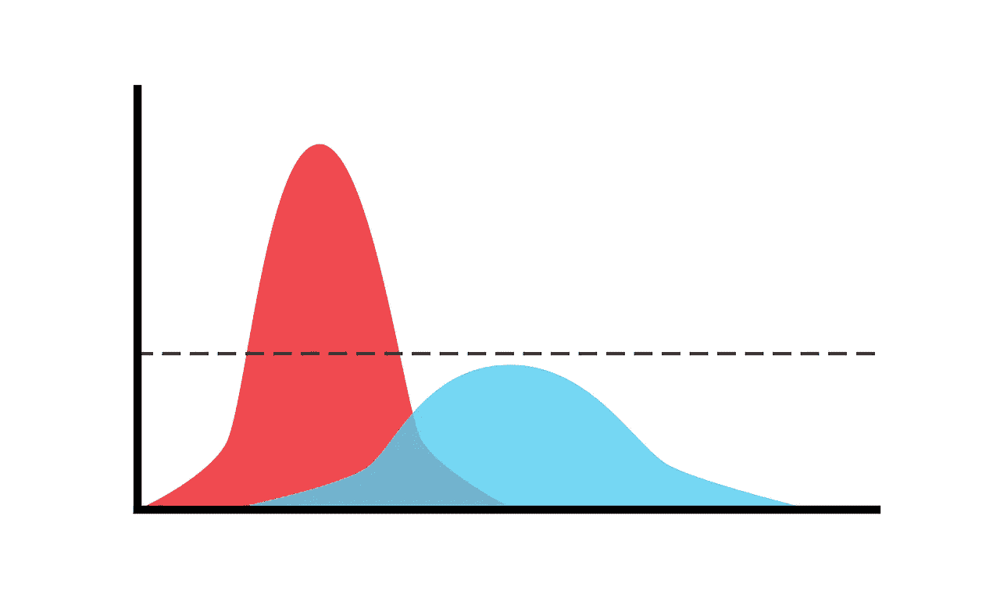

# **高斯混合模型（GMMs）**：从理论到实现

> 原文：[`towardsdatascience.com/gaussian-mixture-models-gmms-from-theory-to-implementation-4406c7fe9847?source=collection_archive---------4-----------------------#2023-11-28`](https://towardsdatascience.com/gaussian-mixture-models-gmms-from-theory-to-implementation-4406c7fe9847?source=collection_archive---------4-----------------------#2023-11-28)

## 对 GMMs 及其训练所使用的期望最大化算法的深入解释

 [Dr. Roi Yehoshua](https://medium.com/@roiyeho?source=post_page-----4406c7fe9847--------------------------------)

·

[关注](https://medium.com/m/signin?actionUrl=https%3A%2F%2Fmedium.com%2F_%2Fsubscribe%2Fuser%2F3886620c5cf9&operation=register&redirect=https%3A%2F%2Ftowardsdatascience.com%2Fgaussian-mixture-models-gmms-from-theory-to-implementation-4406c7fe9847&user=Dr.+Roi+Yehoshua&userId=3886620c5cf9&source=post_page-3886620c5cf9----4406c7fe9847---------------------post_header-----------) 发表在 [Towards Data Science](https://towardsdatascience.com/?source=post_page-----4406c7fe9847--------------------------------) ·17 分钟阅读·2023 年 11 月 28 日

--

高斯混合模型（GMMs）是统计模型，将数据表示为高斯（正态）分布的混合。这些模型可用于识别数据集中的群体，并捕捉数据分布的复杂、多模态结构。

GMMs 被用于各种机器学习应用，包括 [聚类](https://medium.com/ai-made-simple/introduction-to-clustering-2ffc22673b5a)、密度估计和模式识别。

在本文中，我们将首先探讨混合模型，重点介绍高斯混合模型及其基本原理。然后，我们将研究如何使用一种称为期望最大化（EM）的强大技术来估计这些模型的参数，并提供从头开始在 Python 中实现它的逐步指南。最后，我们将演示如何使用 Scikit-Learn 库进行 GMM 聚类。

图片来源：[Markéta Klimešová](https://pixabay.com/users/maky_orel-436253/?utm_source=link-attribution&utm_medium=referral&utm_campaign=image&utm_content=5029714)来自[Pixabay](https://pixabay.com//?utm_source=link-attribution&utm_medium=referral&utm_campaign=image&utm_content=5029714)

# 混合模型

**混合模型**是一种概率模型，用于表示可能来自多个不同来源或类别的数据，每个来源或类别都由一个独立的概率分布建模。例如，金融回报通常在正常情况下表现不同……
