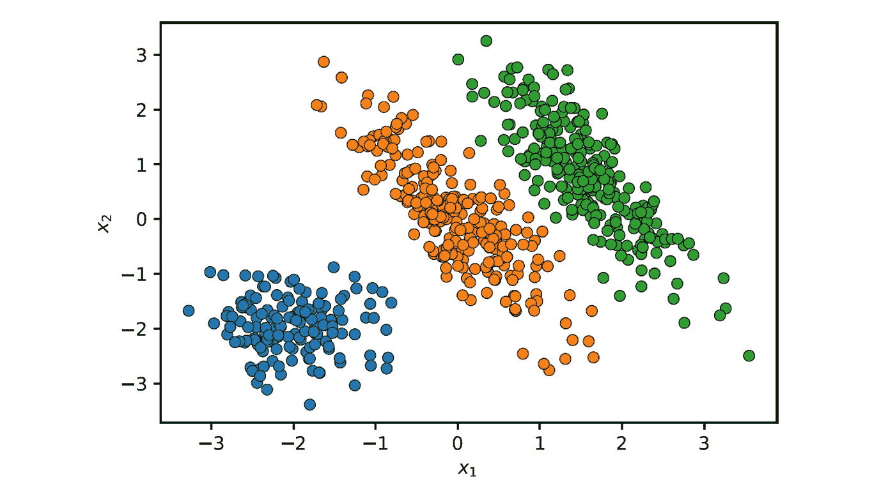

# 高斯混合模型（GMMs）：从理论到实现

> 原文：[`towardsdatascience.com/gaussian-mixture-models-gmms-from-theory-to-implementation-4406c7fe9847`](https://towardsdatascience.com/gaussian-mixture-models-gmms-from-theory-to-implementation-4406c7fe9847)

## 对 GMMs 和用于训练它们的期望最大化算法的深入解释

[](https://medium.com/@roiyeho?source=post_page-----4406c7fe9847--------------------------------)[](https://towardsdatascience.com/?source=post_page-----4406c7fe9847--------------------------------) [Dr. Roi Yehoshua](https://medium.com/@roiyeho?source=post_page-----4406c7fe9847--------------------------------)

·发表于 [Towards Data Science](https://towardsdatascience.com/?source=post_page-----4406c7fe9847--------------------------------) ·17 分钟阅读·2023 年 11 月 28 日

--

高斯混合模型（GMMs）是统计模型，将数据表示为高斯（正态）分布的混合。这些模型可以用于识别数据集中的群体，并捕捉数据分布的复杂、多模态结构。

GMMs 在各种机器学习应用中得到使用，包括 [聚类](https://medium.com/ai-made-simple/introduction-to-clustering-2ffc22673b5a)、密度估计和模式识别。

在本文中，我们将首先探讨混合模型，重点关注高斯混合模型及其基本原理。然后，我们将介绍如何使用一种强大的技术——期望最大化（EM）——来估计这些模型的参数，并提供一个从头开始在 Python 中实现的逐步指南。最后，我们将展示如何使用 Scikit-Learn 库通过 GMM 进行聚类。


图片来源：[Markéta Klimešová](https://pixabay.com/users/maky_orel-436253/?utm_source=link-attribution&utm_medium=referral&utm_campaign=image&utm_content=5029714) 来自 [Pixabay](https://pixabay.com//?utm_source=link-attribution&utm_medium=referral&utm_campaign=image&utm_content=5029714)

# 混合模型

**混合模型** 是一种概率模型，用于表示可能来源于多个不同来源或类别的数据，每个来源或类别都由单独的概率分布建模。例如，金融回报在正常市场条件下和危机期间的表现通常不同，因此可以建模为两个不同分布的混合。

正式地，如果 *X* 是一个随机变量，其分布是 *K* 个组件分布的混合，那么 *X* 的概率密度函数（PDF）或概率质量函数（PMF）可以写为：


一个混合模型

其中：

+   *p*(*x*) 是混合模型的整体密度或质量函数。

+   *K* 是混合中组件分布的数量。

+   *fₖ*(*x*; *θₖ*) 是第 *k* 个组件分布的密度或质量函数，由 *θₖ* 参数化。

+   *wₖ* 是第 *k* 个组件的混合权重，0 ≤ *wₖ* ≤ 1，权重的总和为 1。*wₖ* 也被称为组件 *k* 的先验概率。

+   *θₖ* 代表第 *k* 个组件的参数，例如高斯分布中的均值和标准差。

混合模型假设每个数据点来自 *K* 个组件分布之一，具体的分布是根据混合权重 *wₖ* 选择的。模型不需要知道每个数据点属于哪个组件。

**高斯混合模型**（GMM）是常见的混合模型，其中概率密度由高斯分布的混合给出：


一个高斯混合模型

其中：

+   **x** 是一个 *d* 维向量。

+   *μₖ* 是第 *k* 个高斯组件的均值向量。

+   Σ*ₖ* 是第 *k* 个高斯组件的协方差矩阵。

+   *N*(**x**; *μₖ*, Σ*ₖ*) 是第 *k* 个组件的多元正态密度函数：


在单变量高斯分布的情况下，概率密度可以简化为：


单变量高斯分布的混合模型

其中：

+   *μₖ* 是第 *k* 个高斯组件的均值。

+   *σₖ* 是第 *k* 个高斯组件的协方差矩阵。

+   *N*(*x*; *μₖ*, *σₖ*) 是第 *k* 个组件的单变量正态密度函数：


例如，下面的 Python 函数绘制了两个单变量高斯分布的混合分布：

```py
from scipy.stats import norm

def plot_mixture(mean1, std1, mean2, std2, w1, w2):
    # Generate points for the x-axis
    x = np.linspace(-5, 10, 1000)

    # Calculate the individual nomral distributions
    normal1 = norm.pdf(x, mean1, std1)
    normal2 = norm.pdf(x, mean2, std2)

    # Calculate the mixture
    mixture = w1 * normal1 + w2 * normal2

    # Plot the results
    plt.plot(x, normal1, label='Normal distribution 1', linestyle='--')
    plt.plot(x, normal2, label='Normal distribution 2', linestyle='--')
    plt.plot(x, mixture, label='Mixture model', color='black')
    plt.xlabel('$x$')
    plt.ylabel('$p(x)$')
    plt.legend()
```

我们使用这个函数来绘制两个高斯分布的混合，其中参数为 *μ*₁ = -1, *σ*₁ = 1, *μ*₂ = 4, *σ*₂ = 1.5，以及混合权重 *w*₁ = 0.7 和 *w*₂ = 0.3。

```py
# Parameters for the two univariate normal distributions
mean1, std1 = -1, 1
mean2, std2 = 4, 1.5
w1, w2 = 0.7, 0.3

plot_mixture(mean1, std1, mean2, std2, w1, w2)
```


两个单变量高斯分布的混合模型

虚线表示各个正态分布，实线黑色线条展示了最终的混合。这张图展示了混合模型如何结合这两个分布，每个分布都有其自身的均值、标准差和在整体混合中的权重。​

# 学习 GMM 参数

我们的目标是找到 GMM（均值、协方差和混合系数）的参数，这些参数能最好地解释观察到的数据。为此，我们首先定义给定输入数据的模型的似然性。

对于一个具有 *K* 个成分的 GMM 和一个数据集 *X* = {**x**₁, …, **x**ₙ}，其中有 *n* 个数据点，似然函数 *L* 由每个数据点的概率密度的乘积给出，如 GMM 所定义：


GMM 模型的似然性

其中 *θ* 表示模型的所有参数（均值、方差和混合权重）。

在实际应用中，处理对数似然更为方便，因为对于大型数据集，概率的乘积可能会导致数值下溢。对数似然由以下公式给出：


GMM 的参数可以通过最大化相对于 *θ* 的对数似然函数来估计。然而，由于以下原因，我们不能直接应用 [最大似然估计](https://medium.com/@roiyeho/maximum-likelihood-855b6df92c43)（MLE）来估计 GMM 的参数：

1.  对数似然函数高度非线性，且在分析上很复杂。

1.  模型具有潜在变量（混合权重），这些变量在数据中不可直接观察。

为了克服这些问题，通常使用期望最大化（EM）算法。该算法将在下一节中描述。

# 期望最大化（EM）

EM 算法是一个强大的方法，用于在依赖于未观察的潜在变量的统计模型中寻找最大似然估计。

该算法从随机初始化模型参数开始。然后在两个步骤之间迭代：

1.  **期望步骤（E 步骤）**：计算模型的期望对数似然，考虑到观测数据和当前模型参数的估计。此步骤涉及对潜在变量概率的估计。

1.  **最大化步骤（M 步骤）**：更新模型的参数，以最大化观察数据的对数似然，给定 E 步骤中估计的潜在变量。

这两个步骤会重复进行，直到收敛，通常通过对数似然的变化阈值或最大迭代次数来确定。

让我们制定用于估计高斯混合模型参数的 EM 步骤中的更新方程。在 GMM 中，潜在变量表示每个数据点的未知成分隶属关系。设 *Zᵢ* 为随机变量，表示数据点 **x**ᵢ 是从哪个成分生成的。*Zᵢ* 可以取 {1, …, *K*} 中的一个值，对应于 *K* 个成分。

## **E 步骤**

在 E 步骤中，我们计算给定当前模型参数估计的潜在变量 *Zᵢ* 的概率分布。换句话说，我们计算每个数据点在每个高斯成分中的隶属概率。

*Zᵢ* = *k* 的概率，即 **x**ᵢ 属于 *k* -th 成分的概率，可以使用贝叶斯规则计算：


设该概率为变量*γ*(*zᵢₖ*)。因此，我们可以写成：


变量*γ*(*zᵢₖ*)通常被称为*责任值*，因为它们描述了每个成分对每个观测值的责任程度。这些责任值作为关于潜在变量缺失信息的代理。

相对于潜在变量分布的期望对数似然现在可以写为：


函数*Q*是所有数据点在每个高斯成分下对数似然的加权和，其中权重是责任值。请注意，*Q*与前面显示的对数似然函数*l*(*θ|X*)不同。对数似然*l*(*θ|X*)表示在混合模型下观测数据的可能性，没有明确考虑潜在变量，而*Q*表示对观测数据和估计的潜在变量分布的期望对数似然。

## M 步

在 M 步中，我们更新 GMM（均值、协方差和混合权重）的参数*θ*，以最大化使用 E 步计算的责任值的期望似然*Q*(*θ*)。

参数更新如下：

1.  更新每个成分的均值：


即，第*k*个成分的新均值是所有数据点的加权平均，其中权重是这些点属于成分*k*的概率。

此更新公式可以通过最大化期望对数似然函数*Q*相对于均值*μₖ*来推导。我将在这里展示单变量高斯分布情况的证明。

*证明：*

单变量高斯分布的期望对数似然为：


对该函数关于*μₖ*求导并设其为 0 可得：


2\. 更新每个成分的协方差：


即，第*k*个成分的新协方差是每个数据点与该成分均值的平方偏差的加权平均，其中权重是分配给该成分的点的概率。

对于单变量正态分布，此更新简化为：


3\. 更新混合权重：


即，第*k*个成分的新权重是点属于该成分的总概率，经过点数*n*的归一化。

重复这两个步骤可以确保收敛到似然函数的局部最大值。由于最终达到的最优值依赖于初始的随机参数值，因此通常的做法是多次运行 EM 算法，使用不同的随机初始化，并保留获得最高似然的模型。

## Python 中的实现

我们现在将实现 EM 算法，以从给定数据集中估计两个单变量高斯分布的 GMM 参数。

我们从导入所需的库开始：

```py
import numpy as np
import matplotlib.pyplot as plt
import seaborn as sns

from scipy.stats import norm

np.random.seed(0)  # for reproducibility
```

接下来，让我们编写一个函数来初始化 GMM 的参数：

```py
def init_params(x):    
    """Initialize the parameters for the GMM
    """    
    # Randomly initialize the means to points from the dataset
    mean1, mean2 = np.random.choice(x, 2, replace=False)

    # Initialize the standard deviations to 1
    std1, std2 = 1, 1

    # Initialize the mixing weights uniformly
    w1, w2 = 0.5, 0.5

    return mean1, mean2, std1, std2, w1, w2
```

均值从数据集中随机数据点初始化，标准差设置为 1，混合权重均匀设置为 0.5。

现在我们实现 E 步，其中我们计算每个数据点属于每个高斯组件的责任（概率）：

```py
def e_step(x, mean1, std1, mean2, std2, w1, w2):
    """E-Step: Compute the responsibilities
    """    
    # Compute the densities of the points under the two normal distributions  
    prob1 = norm(mean1, std1).pdf(x) * w1
    prob2 = norm(mean2, std2).pdf(x) * w2

    # Normalize the probabilities
    prob_sum = prob1 + prob2 
    prob1 /= prob_sum
    prob2 /= prob_sum

    return prob1, prob2
```

在 M 步中，我们根据 E 步计算的责任来更新模型参数：

```py
def m_step(x, prob1, prob2):
    """M-Step: Update the GMM parameters
    """    
    # Update means
    mean1 = np.dot(prob1, x) / np.sum(prob1)
    mean2 = np.dot(prob2, x) / np.sum(prob2)

    # Update standard deviations
    std1 = np.sqrt(np.dot(prob1, (x - mean1)**2) / np.sum(prob1))
    std2 = np.sqrt(np.dot(prob2, (x - mean2)**2) / np.sum(prob2))

    # Update mixing weights
    w1 = np.sum(prob1) / len(x)
    w2 = 1 - w1

    return mean1, std1, mean2, std2, w1, w2
```

最后，我们编写主函数来运行 EM 算法，在 E 步和 M 步之间进行迭代，直到指定的迭代次数：

```py
def gmm_em(x, max_iter=100):
    """Gaussian mixture model estimation using Expectation-Maximization
    """    
    mean1, mean2, std1, std2, w1, w2 = init_params(x)

    for i in range(max_iter):
        print(f'Iteration {i}: μ1 = {mean1:.3f}, σ1 = {std1:.3f}, μ2 = {mean2:.3f}, σ2 = {std2:.3f}, ' 
              f'w1 = {w1:.3f}, w2 = {w2:.3f}')

        prob1, prob2 = e_step(x, mean1, std1, mean2, std2, w1, w2)
        mean1, std1, mean2, std2, w1, w2 = m_step(x, prob1, prob2)     

    return mean1, std1, mean2, std2, w1, w2
```

为了测试我们的实现，我们将创建一个合成数据集，通过从已知混合分布中采样数据，并使用 EM 算法估计分布的参数，然后将估计的参数与原始参数进行比较。

首先，让我们编写一个函数，从两个单变量正态分布的混合中采样数据：

```py
def sample_data(mean1, std1, mean2, std2, w1, w2, n_samples):    
    """Sample random data from a mixture of two Gaussian distribution.
    """
    x = np.zeros(n_samples)
    for i in range(n_samples):
        # Choose distribution based on mixing weights
        if np.random.rand() < w1:
            # Sample from the first distribution
            x[i] = np.random.normal(mean1, std1)
        else:
            # Sample from the second distribution
            x[i] = np.random.normal(mean2, std2)

    return x
```

现在我们将使用这个函数从之前定义的混合分布中采样 1,000 个数据点：

```py
# Parameters for the two univariate normal distributions
mean1, std1 = -1, 1
mean2, std2 = 4, 1.5
w1, w2 = 0.7, 0.3

x = sample_data(mean1, std1, mean2, std2, w1, w2, n_samples=1000)
```

我们现在可以在这个数据集上运行 EM 算法：

```py
final_dist_params = gmm_em(x, max_iter=30)
```

我们得到如下输出：

```py
Iteration 0: μ1 = -1.311, σ1 = 1.000, μ2 = 0.239, σ2 = 1.000, w1 = 0.500, w2 = 0.500
Iteration 1: μ1 = -1.442, σ1 = 0.898, μ2 = 2.232, σ2 = 2.521, w1 = 0.427, w2 = 0.573
Iteration 2: μ1 = -1.306, σ1 = 0.837, μ2 = 2.410, σ2 = 2.577, w1 = 0.470, w2 = 0.530
Iteration 3: μ1 = -1.254, σ1 = 0.835, μ2 = 2.572, σ2 = 2.559, w1 = 0.499, w2 = 0.501
...
Iteration 27: μ1 = -1.031, σ1 = 1.033, μ2 = 4.180, σ2 = 1.371, w1 = 0.675, w2 = 0.325
Iteration 28: μ1 = -1.031, σ1 = 1.033, μ2 = 4.181, σ2 = 1.370, w1 = 0.675, w2 = 0.325
Iteration 29: μ1 = -1.031, σ1 = 1.033, μ2 = 4.181, σ2 = 1.370, w1 = 0.675, w2 = 0.325
```

算法已收敛到接近原始混合参数的参数：*μ*₁ = -1.031，*σ*₁ = 1.033，*μ*₂ = 4.181，*σ*₂ = 1.370，以及混合权重 *w*₁ = 0.675 和 *w*₂ = 0.325。

让我们使用之前编写的 `plot_mixture()` 函数绘制最终分布。我们还将更新该函数，以绘制采样数据的直方图：

```py
def plot_mixture(x, mean1, std1, mean2, std2, w1, w2):
    # Plot an histogram of the input data
    sns.histplot(x, bins=20, kde=True, stat='density', linewidth=0.5, color='gray')

    # Generate points for the x-axis
    x_ = np.linspace(-5, 10, 1000)

    # Calculate the individual nomral distributions
    normal1 = norm.pdf(x_, mean1, std1)
    normal2 = norm.pdf(x_, mean2, std2)

    # Calculate the mixture
    mixture = w1 * normal1 + w2 * normal2

    # Plot the results
    plt.plot(x_, normal1, label='Normal distribution 1', linestyle='--')
    plt.plot(x_, normal2, label='Normal distribution 2', linestyle='--')
    plt.plot(x_, mixture, label='Mixture model', color='black')
    plt.xlabel('$x$')
    plt.ylabel('$p(x)$')
    plt.legend()
```

```py
plot_mixture(x, *final_dist_params)
```

结果显示在下图中：


使用 EM 算法从数据集中估计的混合分布

如所示，估计的分布与数据点的直方图紧密对齐。

> 练习：扩展上述代码以处理多变量正态分布和任意数量的分布 K。
> 
> 提示：你可以使用函数 `scipy.stats.multivariate_normal` 来计算多变量正态分布的 PDF。

# Scikit-Learn 中的 GMM

Scikit-Learn 在类 `[sklearn.mixture.GaussianMixture](https://scikit-learn.org/stable/modules/generated/sklearn.mixture.GaussianMixture.html)` 中提供了高斯混合模型的实现。该类的重要参数包括：

+   `n_components`：混合组件的数量（默认为 1）。

+   `covariance_type`：要使用的协方差参数类型。可以是以下选项之一：

    - `'full'`：每个组件有自己的协方差矩阵。

    - `'tied'`：所有组件共享相同的协方差矩阵。

    - `'diag'`：每个组件都有自己的协方差矩阵，该矩阵必须是对角的。

    - `'spherical'`：每个组件有自己的单一方差。

+   `tol`：收敛阈值。当对数似然的平均改善低于此阈值时，EM 算法将停止（默认为 0.001）。

+   `max_iter`：执行的 EM 迭代次数（默认为 100）。

+   `n_init`：执行的随机初始化次数（默认为 1）。

+   `init_params`：用于初始化模型参数的方法。可以选择以下选项之一：

    `'kmeans'`：参数使用 *k*-均值初始化（默认）。

    `'k-means++'`：参数使用 *k*-均值++ 初始化。

    `'random'`：参数被随机初始化。

    `'random_from_data'`：初始均值从给定的数据点中随机选择。

此外，此类提供了以下属性：

+   `weights_`：混合权重。

+   `means_`：每个组件的均值。

+   `covariances_`：每个组件的协方差。

+   `converged_`：一个布尔值，指示 EM 算法是否已达到收敛。

+   `n_iter_`：EM 算法达到收敛所用的步骤数。

注意，与 Scikit-Learn 中的其他聚类算法不同，此类不提供 `labels_` 属性。因此，要获取数据点的簇分配，您需要在拟合模型上调用 `predict()` 方法（或调用 `fit_predict()`）。

例如，使用此类对以下数据集进行聚类，该数据集包含两个椭圆形簇和一个球形簇：

```py
from sklearn.datasets import make_blobs

X, y = make_blobs(n_samples=500, centers=[(0, 0), (4, 4)], random_state=0)

# Apply a linear transformation to make the blobs elliptical
transformation = [[0.6, -0.6], [-0.2, 0.8]]
X = np.dot(X, transformation) 

# Add another spherical blob
X2, y2 = make_blobs(n_samples=150, centers=[(-2, -2)], cluster_std=0.5, random_state=0)
X = np.vstack((X, X2))
```

让我们绘制数据集：

```py
def plot_data(X):
    sns.scatterplot(x=X[:, 0], y=X[:, 1], edgecolor='k', legend=False)
    plt.xlabel('$x_1$')
    plt.ylabel('$x_2$')

plot_data(X)
```

接下来，我们用 `n_components=3` 实例化 `GMM` 类，并调用其 `fit_predict()` 方法以获取簇分配：

```py
from sklearn.mixture import GaussianMixture

gmm = GaussianMixture(n_components=3)
labels = gmm.fit_predict(X)
```

我们可以检查 EM 算法收敛所需的迭代次数：

```py
print(gmm.n_iter_)
```

```py
2
```

在这种情况下，EM 算法只需两次迭代即可收敛。

我们还可以检查估计的 GMM 参数：

```py
print('Weights:', gmm.weights_)
print('Means:\n', gmm.means_)
print('Covariances:\n', gmm.covariances_)
```

```py
Weights: [0.23077331 0.38468283 0.38454386]
Means:
 [[-2.01578902 -1.95662033]
 [-0.03230299  0.03527593]
 [ 1.56421574  0.80307925]]
Covariances:
 [[[ 0.254315   -0.01588303]
  [-0.01588303  0.24474151]]

 [[ 0.41202765 -0.53078979]
  [-0.53078979  0.99966631]]

 [[ 0.35577946 -0.48222654]
  [-0.48222654  0.98318187]]]
```

我们可以看到，估计的权重非常接近三个簇的原始比例，球形簇的均值和方差也非常接近其原始参数。

让我们绘制簇：

```py
def plot_clusters(X, labels):    
    sns.scatterplot(x=X[:, 0], y=X[:, 1], hue=labels, palette='tab10', edgecolor='k', legend=False)
    plt.xlabel('$x_1$')
    plt.ylabel('$x_2$')

plot_clusters(X, labels)
```



GMM 聚类的结果

GMM 已正确识别出所有三个簇。

此外，我们可以使用方法 `predict_proba()` 获取每个数据点在每个簇中的归属概率。

```py
prob = gmm.predict_proba(X)
```

例如，数据集中的第一个点非常可能属于绿色簇：

```py
print('x =', X[0])
print('prob =', prob[0])
```

```py
x = [ 2.41692591 -0.07769481]
prob = [3.11052582e-21 8.85973054e-10 9.99999999e-01]
```

我们可以通过将每个点的大小与其归属簇的概率成比例来可视化这些概率：

```py
sizes = prob.max(axis=1)
sns.scatterplot(x=X[:, 0], y=X[:, 1], hue=labels, size=sizes, palette='tab10', edgecolor='k', legend=False)
plt.xlabel('$x_1$')
plt.ylabel('$x_2$')
plt.savefig('figures/elliptical_blobs_gmm_prob.pdf')
```


簇分配的概率

我们可以看到，位于两个椭圆簇边界上的点的概率较低。概率显著低的数据点（例如，低于预定义的阈值）可以被识别为异常值或离群点。

为了进行比较，下图展示了应用于相同数据集的其他聚类算法的结果：


可以看出，其他聚类算法未能正确识别椭圆形簇。

# 模型评估

对数似然度是评估 GMM 的主要度量。它在训练过程中也被监控以检查 EM 算法的收敛性。然而，有时我们需要比较具有不同组件数量或不同协方差结构的模型。

为此，我们有两个额外的度量，它们在模型复杂性（参数数量）与拟合优度（由对数似然度表示）之间进行平衡：

1.  赤池信息准则 (AIC)：


其中：

+   *p* 是模型中的参数数量（包括所有均值、协方差和混合权重）。

+   *L* 是模型的最大似然估计（具有最佳参数值的模型的似然度）。

较低的 AIC 值表示更好的模型。AIC 奖励那些对数据拟合良好的模型，但也惩罚参数更多的模型。

2\. 贝叶斯信息准则 (BIC)：


其中 *p* 和 *L* 的定义如前所述，*n* 是数据点的数量。

类似于 AIC，BIC 平衡模型拟合和复杂性，但对参数更多的模型处以更大的惩罚，因为 *p* 被乘以 log(*n*) 而不是 2。

在 Scikit-Learn 中，你可以使用 `GMM` 类的 `aic()` 和 `bic()` 方法计算这些度量。例如，blobs 数据集的 GMM 聚类的 AIC 和 BIC 值是：

```py
print(f'AIC = {gmm.aic(X):.3f}')
print(f'BIC = {gmm.bic(X):.3f}')
```

```py
AIC = 4061.318
BIC = 4110.565
```

这些度量可以用来通过将不同组件数的 GMM 拟合到数据集中，然后选择具有最低 AIC 或 BIC 值的模型来寻找最优的组件数。

# 总结

让我们总结一下 GMM 相对于其他聚类算法的优缺点：

**优点**：

+   与假设球形簇的 *k* 均值不同，GMM 由于协方差成分，可以适应椭圆形的形状。这使得 GMM 能够捕捉更广泛的簇形状。

+   可以处理具有不同大小的簇，因为它们使用协方差矩阵和混合系数，考虑了每个簇的扩展和比例。

+   GMM 提供了每个点属于每个簇的概率（软分配），这在理解数据方面可能更具信息性。

+   可以处理重叠簇，因为它根据概率而不是硬性边界将数据点分配到簇中。

+   聚类结果易于解释，因为每个簇由具有特定参数的高斯分布表示。

+   除了聚类，GMM 还可以用于密度估计和异常检测。

**缺点**：

+   需要提前指定组件（簇）的数量。

+   假设每个簇中的数据遵循高斯分布，这对实际数据可能并不总是有效的假设。

+   当簇中仅包含少量数据点时，模型可能效果不好，因为模型依赖于足够的数据来准确估计每个组件的参数。

+   聚类结果可能对初始参数选择非常敏感。

+   GMM 中使用的 EM 算法可能会陷入局部最优，并且收敛速度可能较慢。

+   条件不良的协方差矩阵（即，接近奇异或具有非常高条件数的矩阵）可能导致 EM 计算过程中的数值不稳定。

+   计算上比简单算法如*k*-均值更为复杂，尤其是在数据集较大或组件数量较高时。

感谢阅读！

所有图像均由作者提供，除非另有说明。

你可以在我的 GitHub 上找到本文的代码示例：[`github.com/roiyeho/medium/tree/main/gmm`](https://github.com/roiyeho/medium/tree/main/gmm)
