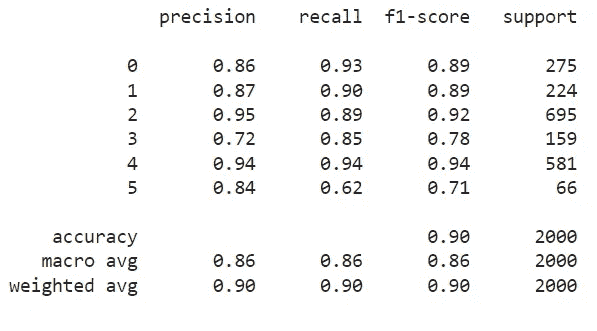
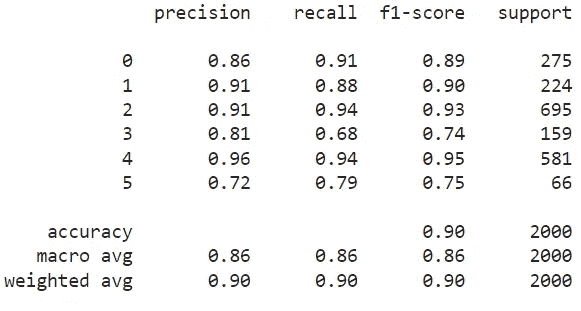

# GenAI 提升 NLP 系统 I：生成合成数据的工具

> 原文：[`towardsdatascience.com/genai-for-better-nlp-systems-i-a-tool-for-generating-synthetic-data-4b862ef3f88a`](https://towardsdatascience.com/genai-for-better-nlp-systems-i-a-tool-for-generating-synthetic-data-4b862ef3f88a)

## 使用 GenAI 生成和扩充合成数据的实验，基于 Python 的提示工程

 [Nabanita Roy](https://nroy0110.medium.com/?source=post_page-----4b862ef3f88a--------------------------------)

·发表于 [Towards Data Science](https://towardsdatascience.com/?source=post_page-----4b862ef3f88a--------------------------------) ·阅读时间 7 分钟·2023 年 9 月 29 日

--

图片来源：[SR](https://unsplash.com/@lemonmelon?utm_source=medium&utm_medium=referral) 于 [Unsplash](https://unsplash.com/?utm_source=medium&utm_medium=referral)

机器学习（ML）的一个主要挑战是数据不平衡及其引入的模型偏差。随着强大生成式人工智能（GenAI）模型的出现，我们可以轻松地用合成数据来扩充不平衡的训练数据，特别是在自然语言处理（NLP）任务中。因此，我们可以使用经典的 ML 算法来训练模型，以在深度学习模型或直接使用大语言模型（LLMs）不可行的情况下获得更好的性能，例如计算成本、内存、基础设施的可用性或模型可解释性。此外，尽管 LLMs 展现出了极大的效能，但我们仍然没有完全信任它们。然而，我们可以利用 LLMs 来辅助我们的数据专业工作，克服在构建 NLP 系统时遇到的障碍。

在这篇文章中，我展示了如何利用 GenAI 和 Python 生成合成数据来改善不平衡数据集中少数类的模型性能，以及如何通过迭代优化提示词来生成期望的结果。

# 平衡之道

图片来源：[Tingey Injury Law Firm](https://unsplash.com/@tingeyinjurylawfirm?utm_source=medium&utm_medium=referral) 于 [Unsplash](https://unsplash.com/?utm_source=medium&utm_medium=referral)

长话短说，机器学习模型需要足够的示例来学习模式和准确预测。如果数据包含较少的示例，模型则无法泛化，表现也会较差。在这种情况下，模型可能会对样本较多的类别过拟合，而对样本较少的类别欠拟合。为了应对不平衡的数据，我们传统上使用统计采样方法，如过采样或欠采样，通常使用[SMOTE](https://www.geeksforgeeks.org/ml-handling-imbalanced-data-with-smote-and-near-miss-algorithm-in-python/)。

# 为什么平衡 NLP 中的数据很困难？

在 NLP 中，有几个分类任务的数据是不平衡的，我们不得不采用欠采样来克服这一挑战。欠采样的根本问题是信息丢失。尽管 SMOTE 为数值数据集实施了高效的过采样策略，但它不适用于文本或任何形式的文本向量化表示或嵌入。这是因为数值数据集可以通过随机采样策略轻松复制，结合特征的概率分布。对于文本而言，由于难以使用这些方法捕捉句法和语义的多样性，因此生成嵌入模式并不简单。

# 生成式 AI：用于 NLP 的现代合成数据工具

今年，GenAI 的力量被释放，提示工程正在革新我们的工作方式，AI 领导者正在重新思考他们的操作策略。下面是 GenAI 如何通过提示工程为 NLP 系统提供合成数据的演示。

## 使用案例：用合成数据丰富情感数据集

1.  **背景**

在我之前关于比较使用 Keras 嵌入层与 Word2vec 嵌入的多分类文本分类和使用 KerasTuner 微调 ANNs 的博客中，我展示了在情感—‘喜悦’和‘悲伤’作为目标类别—上表现良好的模型。这是因为它们在数据集中样本数量相对较多。以下是训练数据的分布，其中‘喜悦’和‘悲伤’（多数类别）的示例数量明显高于‘愤怒’、‘爱’、‘惊讶’和‘恐惧’（少数类别）：

从上图可以得出结论，这些数据在‘喜悦’和‘悲伤’之外的情感上高度不平衡。‘愤怒’和‘恐惧’的样本数量相似，而在这些数据上训练出的模型表现略逊于‘喜悦’和‘悲伤’。表现最差的是‘爱’和‘惊讶’，在最佳选择模型中，其 f1 分数分别为 78% 和 71%。以下是测试数据集的结果供参考。

模型性能的混淆矩阵（没有增强合成数据）| 图片来源：作者

表现最好的模型（笔记本 [这里](https://github.com/royn5618/Medium_Blog_Codes/blob/master/Emotion%20Detection/EmotionClassifier_KerasTuner_2.ipynb)）是一个经过微调的模型，*没有使用 word2vec*，而是直接将令牌表示传递给 Keras 嵌入层。显然，‘惊讶’（类别 5）的精确度为 84%，这是不错的，但召回率为 62%，这相当低。较高的精确度意味着分类器预测情感时更有可能是正确的。换句话说，它最小化了假阳性。另一方面，较高的召回率意味着分类器更擅长捕捉目标情感的所有实例，最小化假阴性。62%的召回率意味着 62%的所有带有‘惊讶’情感的文本被正确识别。在实际应用中，建议在精确度和召回率之间取得平衡，根据业务目标优先考虑其中一个。在这里，精确度和召回率的分数不平衡。

> **目标：提高对情感‘惊讶’的召回率，该情感在这个不平衡的数据集中属于小类，使用由 GPT 生成的合成数据。**

## 2\. 提示工程和合成数据生成

在这个实验中，我将重新编写 572 个‘惊讶’样本，并对其进行扩充，将该情感的样本总数增加到 1200 个。

**提示工程：**

提示工程是为 AI 模型制作指令的艺术，使其能够产生最准确的回应。在这个用例中，我将接下来制作一个提示，使我能够生成合成数据。不仅如此，我还将提供示例和输出结构，以便我可以轻松地将合成数据解析到 Pandas 数据框中。

这个实验使用了以下提示：

这是关于这个实验提示过程的一些经验教训：

+   这是第十五版本左右的提示结构。

+   我要求“生成 X 个样本”而不是重写。由于在生成前 15-20 个合成样本后，模型开始重复使用相同的句法风格，它没有效果特别好，模型停止生成各种句子结构。

+   请注意我如何指示 GPT-4 移除标点符号并转为小写。这对于文本清理任务非常有用。

+   我尝试说“生成带有情感‘恐惧’的文本样本”，GPT-4 方便地在所有样本中添加了‘恐惧’一词。我在尝试生成样本时不得不使用‘潜在的’或‘嵌入的’情感，而不是重写。

+   我已经尝试在指令中添加了‘使用同义词’，但在某些文本中，同义词的匹配效果不好。所以我去掉了这个要求，并添加了保持情感的条款，因为在一些文本中，内容中的情感对我来说显得模糊。

**解决令牌限制和完整代码**

像每个人一样，我也有相同的令牌限制来提示 GPT-4。 我做了什么呢？我将数据集进行了*分块*处理，并运行了所有数据点。以下是完整的代码：

关于这部分实验的提示过程，我学到了几个经验教训：

+   我遇到了“503 — 引擎当前过载，请稍后再试”的错误，未给代码一些休息时间（使用 time.sleep()）

+   我指示模型生成‘;’分隔的样本，以便我可以轻松地将它们解析到数据框中。

+   我将上述说明放在了提示的第一行。 “不要使用任何标点符号”的说明被放在了它所在的位置。这导致生成的样本完全没有分隔。（新手错误，我知道🙄）

现在我已理顺了合成数据生成和增强，这里是调整后的分类器的更新结果（[训练于此](https://github.com/royn5618/Medium_Blog_Codes/blob/master/GenAI_4_NLP_Systems/EmotionClassifier_KerasTuner_2.ipynb)）：

带有增强合成数据的模型性能混淆矩阵 | 图片来源：作者

显然，对于情感‘惊讶’（类别 5），召回率从 62%提高到 79%，但精确率从 84%下降到 72%。然而，平衡精确率和召回率是重要的，这显然比没有合成数据的模型要好。实际上，使用这种策略，f1 分数从 71%提高到 75%。整体模型性能保持不变，但在增强其他类别时可能会得到提升——这是未来的实验方向。

# 结论

这只是一个简要演示，说明我们如何使用生成式 AI 为基于 NLP 的用例生成合成数据，这在其他情况下可能是一个更复杂的任务。

然而，这里有一个关键的挑战。GPT-4 生成的数据可能会在文本中引入模式或偏差，导致模型在合成数据的模式上过拟合，从而阻碍分类器的性能。因此，对生成数据和整体性能的质量测试是至关重要的。

尽管有这个限制，生成式 AI 在加速生成合成数据以平衡不平衡数据集中的类别方面非常有帮助。

希望你喜欢这个博客🙂。以下是我的 GitHub 上的[Google Colab 笔记本](https://github.com/royn5618/Medium_Blog_Codes/tree/master/GenAI_4_NLP_Systems)。

*感谢访问！*

**我的链接：** [Medium](https://medium.com/@nroy0110) | [LinkedIn](https://www.linkedin.com/in/nabanita-roy/) | [GitHub](https://github.com/royn5618)
