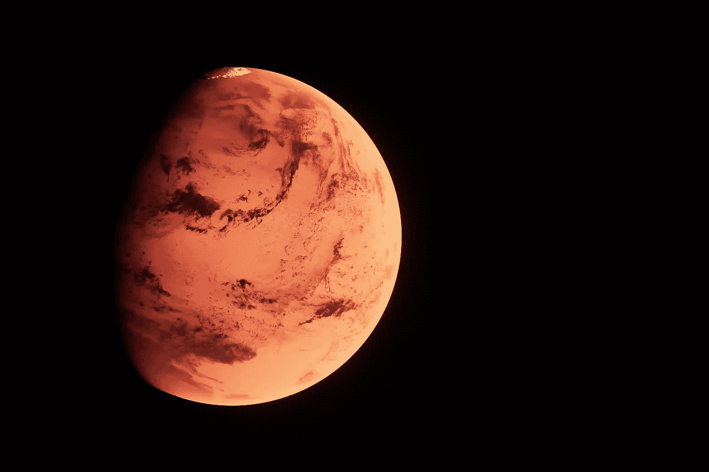
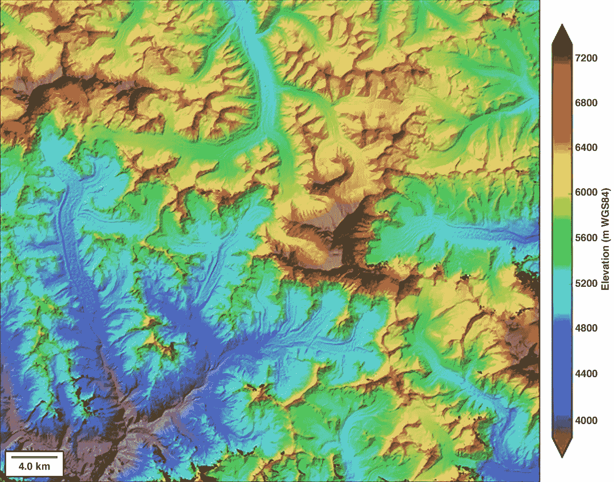
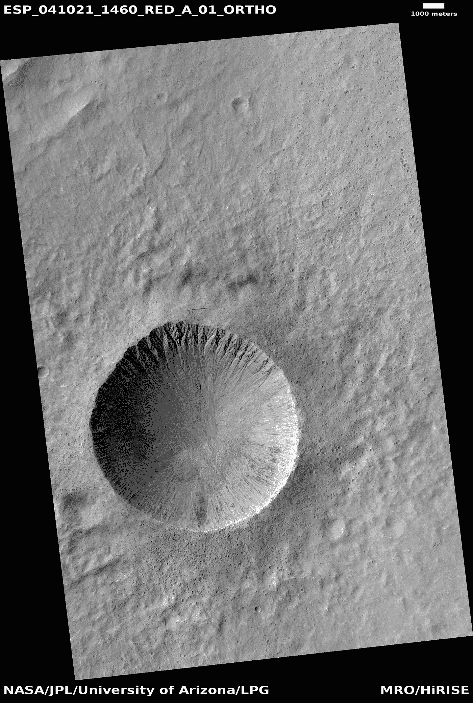
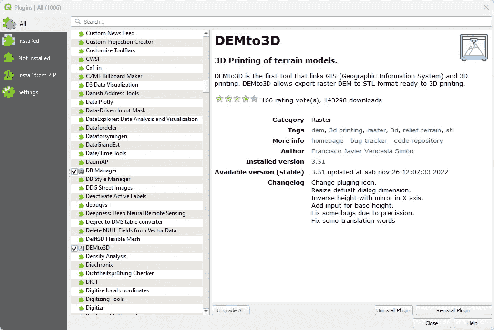
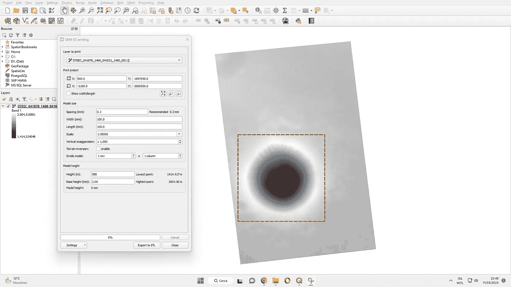
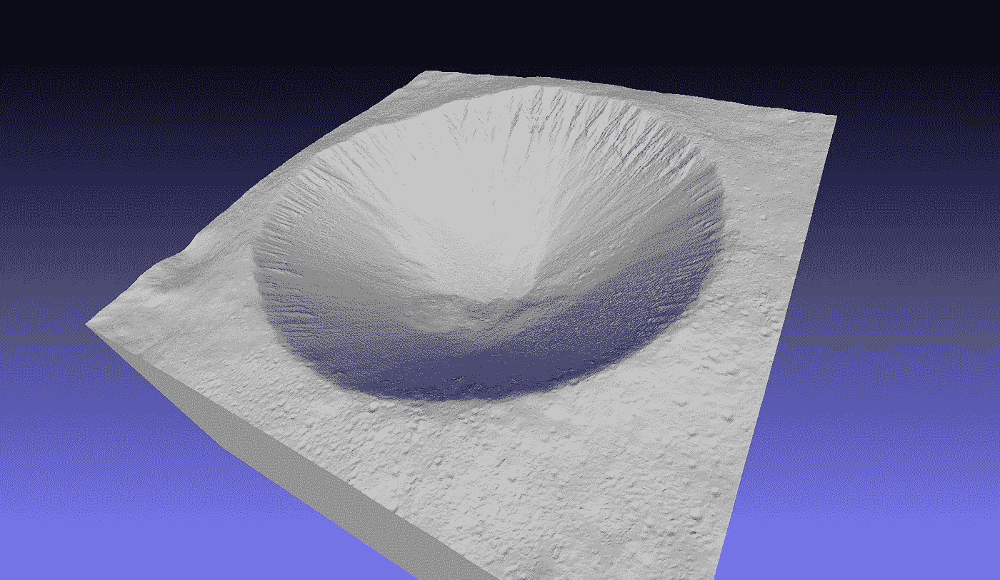
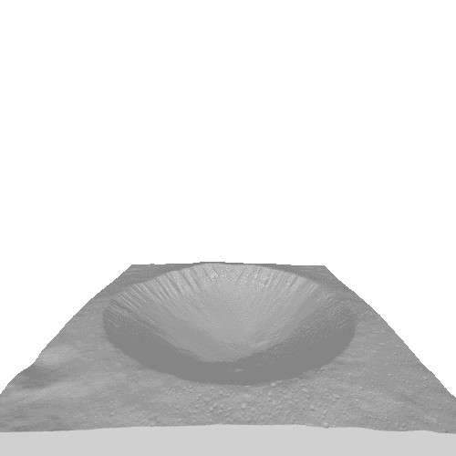

# 生成地理区域的 3D 网格

> 原文：[`towardsdatascience.com/generate-a-3d-mesh-of-a-geographic-area-with-qgis-3844e3f7806a`](https://towardsdatascience.com/generate-a-3d-mesh-of-a-geographic-area-with-qgis-3844e3f7806a)

## 从数字高程模型到 3D 网格

 [Mattia Gatti](https://mattiagatti.medium.com/?source=post_page-----3844e3f7806a--------------------------------)

·发表于 [Towards Data Science](https://towardsdatascience.com/?source=post_page-----3844e3f7806a--------------------------------) ·阅读时间 5 分钟·2023 年 3 月 14 日

--

照片由 [Planet Volumes](https://unsplash.com/@planetvolumes?utm_source=medium&utm_medium=referral) 提供，来源于 [Unsplash](https://unsplash.com/?utm_source=medium&utm_medium=referral)

3D 网格可以用来表示地理数据，如地形、建筑物和其他结构。这些网格可以用于多种目的，如城市规划、环境分析或虚拟现实模拟。然而，创建地理区域的 3D 网格的过程并不总是简单明了，但本指南涵盖了所有必要的步骤。

# 介绍

要生成指定区域的 3D 网格，需要该区域的高程数据。这些数据存储在数字高程模型（DEM）中：

> 数字高程模型（DEM）是一种地理栅格文件，用于表示地表起伏

DEM 基本上是一个高度值的网格。如果你想了解更多信息，我在之前的文章中讨论了 DEMs。

DEM 的图形可视化。 [NSIDC](https://commons.wikimedia.org/wiki/File:Digital_elevation_model_(DEM)_of_the_Mt._Everest_region_-_50090548573.png)，[CC BY 2.0](https://creativecommons.org/licenses/by/2.0)，通过维基媒体共享资源

这些模型是通过以下一种或多种技术创建的：

+   LiDAR — 这种方法使用激光扫描仪测量地形表面的高度。激光发出光束，这些光束反射回地面，返回光的时间用于计算与表面的距离。

+   光测量 — 这种方法分析图像中表面特征投射的阴影，可以提供有关地形的高度和方向的信息。

+   插值 — 这种方法使用来自已知点的高程数据，如测量或 GPS 数据，来估算感兴趣区域其他点的高程。插值技术可以包括克里金插值、样条插值或三角测量等方法。

+   摄影测量法 — 这种方法使用立体对的卫星图像。高程数据是从两张图像之间的视角差异中得出的。摄影测量法通常是生成 DEM 的最准确的方法。

为了帮助你在决定下载哪个 DEM 时做出更好的选择，我们介绍了生成 DEM 的不同技术。我们将使用 [QGIS](https://www.qgis.org/en/site/) 打开 DEM 并生成网格，QGIS 是用于处理地理数据的软件。

现在真正的问题来了：我在哪里可以下载 DEM？

# DEM 数据库

DEM 是栅格文件，通常以 .tif 扩展名保存。对于大面积区域，数字高程模型会被分成几个栅格文件。DEM 的文件名通常包含有关其覆盖区域和分辨率的信息（例如 10m）。显然，10m 的 DEM 比相同区域的 30m DEM 细节更多。

一些数字高程模型的库包括：

+   [Copernicus EU-DEM](https://www.eea.europa.eu/data-and-maps/data/copernicus-land-monitoring-service-eu-dem) — 在这里你可以下载由 Copernicus 制作的欧洲 DEM。Copernicus 是欧盟空间计划的地球观测组成部分。它提供基于地球观测卫星和现场（非空间）数据的信息服务。

+   [Copernicus PANDA](https://panda.copernicus.eu/web/cds-catalogue/panda) — 这个平台允许你下载全球各地的 DEM。行星数据访问（PANDA）是用于搜索/查看/访问 Copernicus 地球观测（EO）产品的用户界面。

+   [Tinitaly DEM](https://tinitaly.pi.ingv.it/) — 对于我的意大利同仁，这里有由意大利国家地球物理与火山学研究所（INGV）制作的意大利表面 DEM。

+   [UAHiRISE](https://www.uahirise.org/dtm/) — 在这个页面上，你可以找到许多通过结合 HiRISE（摄影测量法）拍摄的立体对生成的 DEM。高分辨率成像科学实验（HiRISE）是搭载于火星侦察轨道器上的立体相机，自 2006 年以来一直在轨道上研究火星。

+   [Moon LOLA DEM](https://astrogeology.usgs.gov/search/map/Moon/LRO/LOLA/Lunar_LRO_LOLA_Global_LDEM_118m_Mar2014) — 在这里你可以找到月球的 DEM。月球勘测轨道器（LRO）是目前在月球轨道上运行的机器人航天器。

+   [OpenTopography](https://opentopography.org/)

显然，DEM 的来源很多，这里不可能列举所有。如果你对某个特定国家感兴趣，其研究中心通常会分享该区域的 DEM。

如果你想使用本指南中相同的 DEM 文件，请从[这里](https://www.uahirise.org/dtm/ESP_041878_1460)下载文件 DTEEC_041878_1460_041021_1460_G01。该文件是以下火星表面图像的高程模型：

带陡峭沟壑斜坡的陨石坑。图像由[UAHiRISE](https://www.uahirise.org/dtm/ESP_041878_1460)提供。

# 在 QGIS 中安装 DEMto3D 插件

要从数字高程模型生成网格，你需要在 QGIS 中安装 DEMto3D 插件：

1.  打开 QGIS。

1.  在插件选项卡中选择*管理和安装插件…*。

1.  在搜索栏中输入*DEMto3D*。

1.  打开第一个结果。

1.  点击右下角的*安装插件*。

DEMto3D 插件。

# 如何生成 3D 网格

最后，生成网格非常简单：

1.  在 QGIS 中打开 DEM 文件

1.  转到*栅格* -> *DEMto3D* -> *DEM 3D 打印*

1.  在*打印范围*下，你需要选择生成 3D 网格的区域边界。你可以点击第一个按钮选择整个区域，或者点击第三个按钮绘制边界矩形。坐标表示边界矩形的两个点（左下角和右上角点）。

1.  在*模型尺寸*下，将*间距（mm）*设置为 0.2，*宽度（mm）*和*长度（mm）*设置为你想要的 3D 文件尺寸（例如，100mm x 100mm 用于方形选择）。

1.  在*模型高度*下，将高度（m）设置为*最高点*和*最低点*（右侧找到）之间的差值。将该差值的结果四舍五入到最小整数。

1.  点击*导出为 STL*。

生成 3D 网格时使用的设置。

然后，你可以在[MeshLab](https://www.meshlab.net/)或任何其他 3D 编辑器中打开生成的网格：

火星陨石坑的生成网格。

生成网格的动画。图像使用[这个生成器](https://imagetostl.com/convert/file/stl/to/gif)制作。

# 应用

1.  城市规划：城市区域的 3D 网格可以用来模拟和可视化新建筑、道路和其他基础设施对城市环境的影响。

1.  环境分析：危险区域的 3D 网格可以用来分析自然现象（如洪水或侵蚀）对景观的影响。这可以帮助环境科学家和政策制定者了解这些事件的风险和潜在后果。

1.  军事与防御：一些地理 3D 网格可以用于军事和防御应用，如模拟和培训环境或任务规划。

1.  视频游戏：地理区域的 3D 网格可以用来在虚拟场景中创建相同的环境。

# 结语

在本指南中，你已经概述了 DEM 文件及其生成技术。你也了解到，挑战在于获得感兴趣区域的合适 DEM，因为网格生成部分非常简单。

*除非另有说明，否则所有图片均由作者提供。*
