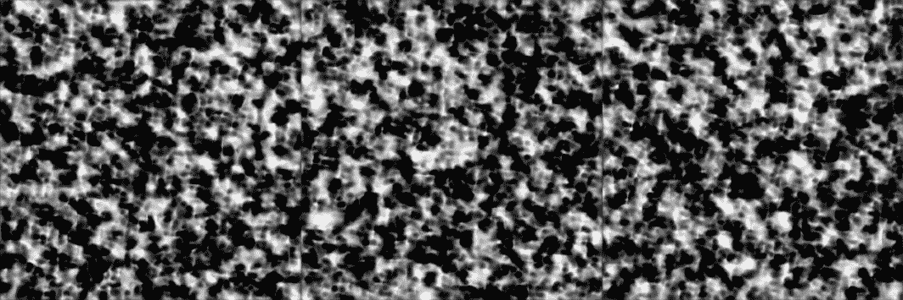
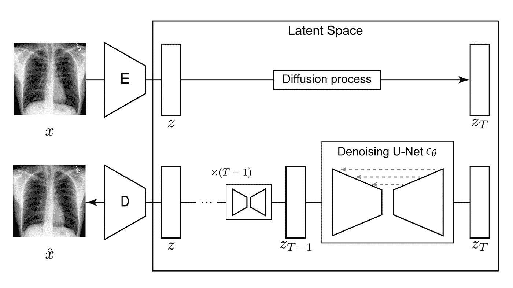
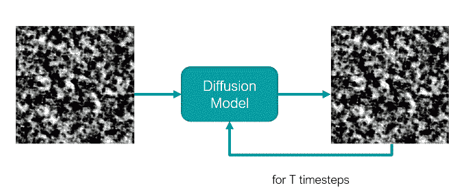
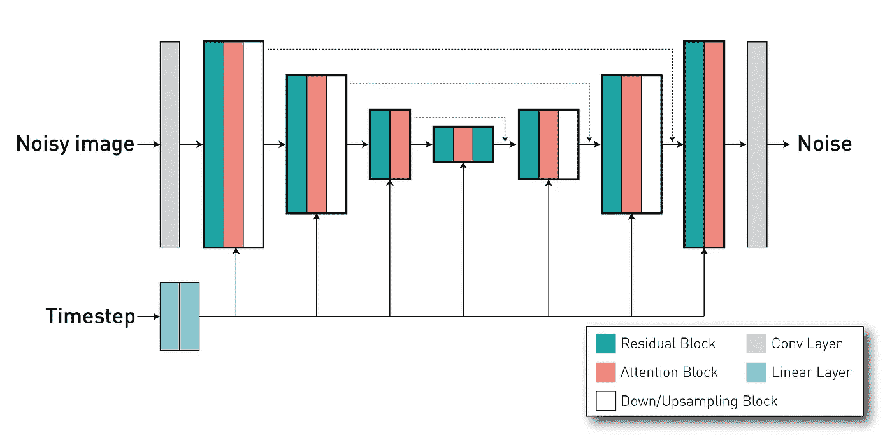
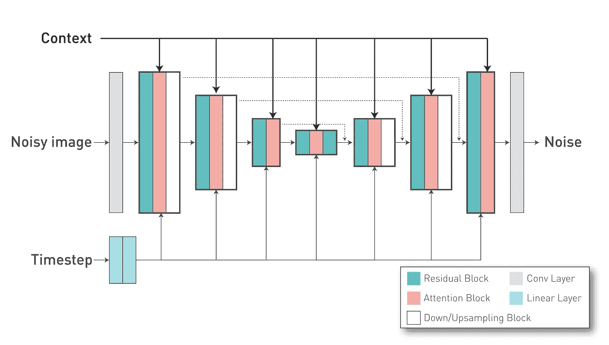
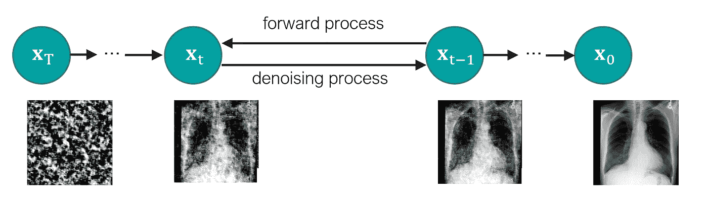
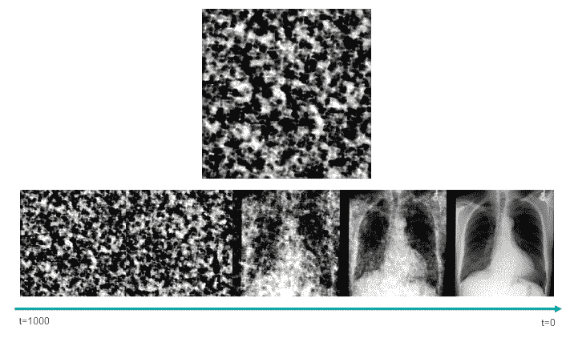
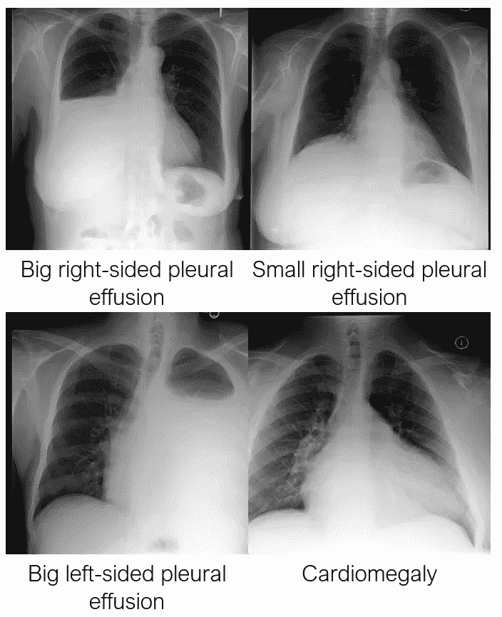
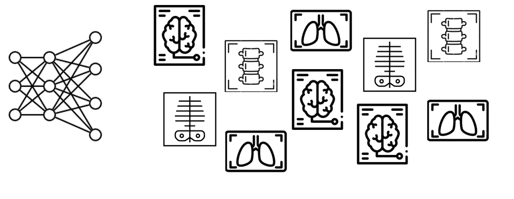

# 使用 MONAI 生成医疗图像

> 原文：[`towardsdatascience.com/generating-medical-images-with-monai-e03310aa35e6`](https://towardsdatascience.com/generating-medical-images-with-monai-e03310aa35e6)

## *一个端到端的开源项目，使用最新的 MONAI 生成模型从放射报告文本生成胸部 X 光图像*

[](https://medium.com/@walhugolp?source=post_page-----e03310aa35e6--------------------------------)[](https://towardsdatascience.com/?source=post_page-----e03310aa35e6--------------------------------) [Walter Hugo Lopez Pinaya](https://medium.com/@walhugolp?source=post_page-----e03310aa35e6--------------------------------)

·发表于 [Towards Data Science](https://towardsdatascience.com/?source=post_page-----e03310aa35e6--------------------------------) ·阅读时间 14 分钟·2023 年 4 月 14 日

--

大家好！在这篇文章中，我们将使用 MONAI 的新开源扩展[**MONAI 生成模型**](https://github.com/Project-MONAI/GenerativeModels)创建一个潜在扩散模型来生成胸部 X 光图像！



# **介绍**

生成式 AI 在医疗领域具有巨大的潜力，因为它允许我们创建学习训练数据集底层模式和结构的模型。这样，我们可以使用这些生成模型创建大量合成数据，这些数据具有真实数据的相同细节和特征，但没有其限制。鉴于其重要性，我们创建了***MONAI 生成模型*，这是对** [**MONAI 平台**](https://monai.io/)的开源扩展，包含最新的模型（如扩散模型、自回归变换器和生成对抗网络）以及帮助训练和评估生成模型的组件。


在这篇文章中，我们将通过一个完整的项目来创建一个潜在扩散模型（与[稳定扩散](https://stability.ai/blog/stable-diffusion-public-release)相同类型的模型），该模型能够**从放射报告中生成胸部 X 光（CXR）图像**。在这里，我们尝试使代码易于理解并适应不同环境，所以尽管它不是最有效的，希望你喜欢！

你可以在这个[**GitHub 仓库**](https://github.com/Warvito/generative_chestxray)找到**完整的开源项目**，在这篇文章中，我们引用的是版本 v0.2。

# 数据集

首先，我们从数据集开始。在这个项目中，我们使用[**MIMIC 数据集**](https://www.nature.com/articles/s41597-019-0322-0)。要访问这个数据集，必须在[Physionet 门户](https://physionet.org/)创建一个账户。我们将使用[**MIMIC-CXR-JPG**](https://physionet.org/content/mimic-cxr-jpg/2.0.0/)（包含 JPG 文件）和[**MIMIC-C**XR](https://physionet.org/content/mimic-cxr/2.0.0/)（包含放射学报告）。这两个数据集都受到[*PhysioNet 认证健康数据许可证 1.5.0*](https://physionet.org/content/mimic-cxr/view-license/2.0.0/)*的约束。完成免费的培训课程后，你可以按照数据集页面底部的说明自由下载数据集。原始的 CXR 图像大约为+1000x1000 像素。因此，这一步可能需要一些时间。

胸部 X 光图像是提供关于胸腔内结构和器官（包括肺部、心脏和血管）宝贵信息的重要工具，下载后我们应该有超过 350k 张这样的图像！这些图像是三种不同投影中的一种：**后前位（PA）、前后位（AP）和侧位（LAT）**。对于这个项目，我们只关注**PA 投影**，这是最常见的一种，可以可视化放射学报告中提到的大多数特征（共计 96,162 张图像）。关于**报告**，我们有 85,882 个文件，每个文件包含多个文本部分。我们将使用**发现**（主要解释图像内容）和**印象**（总结报告内容，如结论）。为了使我们的模型和训练过程更易于管理，我们将图像调整为最小轴 512 像素。自动执行这些初始步骤的脚本列表可以在[这里](https://github.com/Warvito/generative_chestxray#preprocessing)找到。

# **模型**



潜在扩散模型：自编码器将输入图像 x 压缩为潜在表示 z，然后扩散模型估计 z 的概率分布

潜在扩散模型由几个部分组成：

1.  一个**自编码器**，用于将输入图像压缩为更小的潜在表示；

1.  一个**扩散模型**，将学习 CXR 潜在表示的概率数据分布；

1.  一个**文本编码器**，它创建一个嵌入向量，用于条件化采样过程。在这个例子中，我们使用一个预训练的编码器。

使用 MONAI 生成模型，我们可以轻松创建和训练这些模型，因此我们从自编码器开始吧！

## **模型 — 带 KL 正则化的自编码器**

带有 KL 正则化的自编码器（**AE-kl**，或在一些项目中简单称为 VAE）的主要目标是能够创建一个小的潜在表示，并且高保真地重建图像（尽可能保留细节）。在这个项目中，我们创建了一个四层的自编码器，具有 64、128、128、128 个通道，其中在每一层之间应用了一个降采样块，使得特征图在深入层次时变小。尽管我们的自编码器可以有自注意力块，但在这个例子中，我们采用了类似于我们之前在脑部图像研究中的结构，并且不使用注意力以节省内存使用。最后，我们的潜在表示有三个通道。

```py
from generative.networks.nets import AutoencoderKL

...

model = AutoencoderKL(
    spatial_dims=2,
    in_channels=1,
    out_channels=1,
    num_channels=[64, 128, 128, 128],
    latent_channels=3,
    num_res_blocks=2,
    attention_levels=[False, False, False, False],
    with_encoder_nonlocal_attn=False,
    with_decoder_nonlocal_attn=False,
)
```

注意：在我们的[脚本](https://github.com/Warvito/generative_chestxray/blob/83f6c0892c63a1cdbf308ff654d40afc0af51bab/src/python/training/train_aekl.py#L77)中，我们使用了[**OmegaConf 包**](https://omegaconf.readthedocs.io/en/2.3_branch/)来存储我们模型的超参数。你可以在这个[文件](https://github.com/Warvito/generative_chestxray/blob/main/configs/stage1/aekl_v0.yaml)中查看之前的配置。总之，OmegaConf 是一个强大的工具，用于管理 Python 项目的配置，特别是那些涉及深度学习或其他复杂软件系统的项目。OmegaConf 允许我们方便地在 .yaml 文件中组织超参数，并在脚本中读取它们。

## **训练 AE-KL**

接下来，我们定义了我们训练过程中的几个组件。首先，我们有[**KL 正则化**](https://github.com/Warvito/generative_chestxray/blob/731ee63c5fe28353ddeae548fba9286ee4232bd0/src/python/training/training_functions.py#L161)。这部分负责评估扩散模型潜在空间分布与高斯分布之间的距离。正如[Rombach 等人](https://arxiv.org/abs/2112.10752)所提出的，这将用于限制潜在空间的方差，这在我们对其进行扩散模型训练时非常有用（稍后会详细说明）。我们模型的前向方法返回重建结果，以及我们潜在表示的 μ 和 σ 向量，我们用这些来计算 KL 散度。

```py
# Inside training loop
reconstruction, z_mu, z_sigma = model(x=images)

…

kl_loss = 0.5 * torch.sum(z_mu.pow(2) + z_sigma.pow(2) - torch.log(z_sigma.pow(2)) - 1, dim=[1, 2, 3])
kl_loss = torch.sum(kl_loss) / kl_loss.shape[0]
```

其次，我们有我们的[**像素级损失**](https://github.com/Warvito/generative_chestxray/blob/83f6c0892c63a1cdbf308ff654d40afc0af51bab/src/python/training/training_functions.py#L158)，在这个项目中，我们采用 L1 距离来评估 AE-kl 重建与原始图像的差异。

```py
l1_loss = F.l1_loss(reconstruction.float(), images.float())
```

接下来，我们有[**感知级损失**](https://github.com/Warvito/generative_chestxray/blob/731ee63c5fe28353ddeae548fba9286ee4232bd0/src/python/training/train_aekl.py#L79)。感知损失的想法是，不是评估输入图像与重建图像在像素级别的差异，而是将这两张图像通过一个预训练模型。然后，我们测量内部激活和特征图的距离。在 MONAI 生成模型中，我们简化了使用基于在医学图像上预训练的网络的感知网络（可在[此处](https://github.com/Project-MONAI/GenerativeModels/blob/main/generative/losses/perceptual.py)获取）。我们可以使用**RadImageNet**研究中的**2D 网络**（来自[Mei 等](https://pubs.rsna.org/doi/10.1148/ryai.210315)），这些网络在超过**130 万张医学图像**上进行了训练！我们实现了**2.5D 方法**，使用 2D 预训练网络通过评估切片来评估 3D 图像。最后，我们可以访问[**MedicalNet**](https://github.com/Tencent/MedicalNet)来以纯 3D 方法评估我们的**3D 图像**。在这个项目中，我们使用了类似于[Pinaya 等](https://arxiv.org/abs/2209.07162)的方法，并使用了学习到的感知图像块相似度（**LPIPS**）度量（也可在 MONAI 生成模型中找到）。

```py
# Instantiating the perceptual loss
perceptual_loss = PerceptualLoss(
     spatial_dims=2,
     network_type="squeeze",
)

...

# Inside training loop
...
p_loss = perceptual_loss(reconstruction.float(), images.float())
```

最后，我们使用[**对抗损失**](https://github.com/Warvito/generative_chestxray/blob/731ee63c5fe28353ddeae548fba9286ee4232bd0/src/python/training/training_functions.py#L148)来处理重建的细节。对抗网络是[**Patch-Discriminator**](https://github.com/Warvito/generative_chestxray/blob/731ee63c5fe28353ddeae548fba9286ee4232bd0/src/python/training/train_aekl.py#L78)（最初由 Pix2Pix 研究提出），其中我们不仅对整个图像是否真实或虚假做出一个预测，还对图像中的多个块做出预测。

与原始的潜在扩散模型（Latent Diffusion Model）和稳定扩散（Stable Diffusion）不同，我们使用了来自最小二乘生成对抗网络（least square GANs）的鉴别器损失。虽然这不是更先进的对抗损失，但在对 3D 医学图像进行训练时已经显示出了有效性和稳定性（但仍有改进的空间😁）。尽管对抗损失可能相当不稳定，但它们与感知损失的结合也有助于稳定鉴别器和生成器的损失。

我们的训练循环和评估步骤可以在[这里](https://github.com/Warvito/generative_chestxray/blob/83f6c0892c63a1cdbf308ff654d40afc0af51bab/src/python/training/training_functions.py#L129)和[这里](https://github.com/Warvito/generative_chestxray/blob/83f6c0892c63a1cdbf308ff654d40afc0af51bab/src/python/training/training_functions.py#L236)找到。经过 75 轮训练后，我们使用 MLflow 包保存模型。我们使用[MLflow 包](https://mlflow.org/)来更好地监控实验，因为它组织了如 git hash 和参数等信息，并且使得可以用唯一的 ID 在组（称为实验）中存储不同的运行，并且使得比较不同结果变得更容易（类似于其他工具，如 weights and biases）。AE-KL 的日志文件可以在[这里](https://drive.google.com/drive/folders/1Ots9ujg4dSaTABKkyaUnFLpCKQ7kCgdK?usp=sharing)找到。

## **模型 — 扩散模型**

接下来，我们需要训练我们的扩散模型。



扩散模型是类似于 U-Net 的网络，其中通常接收一个噪声图像（或潜在表示）作为输入，并预测其噪声成分。这些模型使用迭代去噪机制，通过具有多个步骤的马尔可夫链从噪声中生成图像。因此，该模型还依赖于时间步，以定义模型在采样过程的哪个阶段。



使用[**DiffusionModelUNet 类**](https://github.com/Project-MONAI/GenerativeModels/blob/02de27c1937f3d9ca3483ab2f4661270c9137641/generative/networks/nets/diffusion_model_unet.py#L1624)，我们可以为我们的扩散模型创建类似于 U-Net 的网络。我们的项目使用在此[配置文件](https://github.com/Warvito/generative_chestxray/blob/main/configs/ldm/ldm_v0.yaml)中定义的配置，其中定义了具有 3 个通道的输入和输出（因为我们的 AE-kl 具有 3 个通道的潜在空间），以及具有 256、512、768 通道的 3 个不同级别。每个级别有 2 个残差块。如前所述，传递时间步对模型很重要，它用于调整这些残差块的行为。最后，我们在网络内部定义注意力机制。在我们的情况下，我们在第二和第三级别（由 attention_levels 参数指示）中有注意力块，每个注意力头有 512 和 768 个通道（换句话说，每个级别有一个注意力头）。这些注意力机制很重要，因为它们允许我们通过**交叉注意力方法**将我们的**外部条件**（放射学报告）应用到网络中。



外部条件（或“上下文”）被应用到 U-Net 的注意力块。

在我们的项目中，我们使用了一个已经**训练好的文本编码器**。为简单起见，我们使用了来自稳定扩散 v2.1 模型（“stabilityai/stable-diffusion-2–1-base”）的相同编码器，将我们的文本标记转换为文本嵌入，这些嵌入将作为 DiffusionModel UNet 交叉注意力层中的 Key 和 Value 向量。我们文本嵌入的每个标记有 1024 个维度，我们在*“with_conditioning”*和“*cross_attention_dim*”参数中定义它。

```py
from generative.networks.nets import DiffusionModelUNet

...

diffusion = DiffusionModelUNet(
    spatial_dims=2,
    in_channels=3,
    out_channels=3,
    num_res_blocks=2,
    num_channels=[256, 512, 768],
    attention_levels=[False, True, True],
    with_conditioning=True,
    cross_attention_dim=1024,
    num_head_channels=[0, 512, 768],
)
```

除了模型定义之外，重要的是定义在训练过程中将噪声添加到输入图像中以及在采样过程中去除噪声的方式。为此，我们为我们的 MONAI 生成模型实现了 Schedulers 类以定义噪声调度器。在这个示例中，我们将使用一个[DDPMScheduler](https://github.com/Warvito/generative_chestxray/blob/83f6c0892c63a1cdbf308ff654d40afc0af51bab/src/python/training/train_ldm.py#L103)，它具有 1000 个时间步长和以下超参数。



```py
from generative.networks.schedulers import DDPMScheduler

...

scheduler = DDPMScheduler(
    beta_schedule="scaled_linear",
    num_train_timesteps=1000,
    beta_start=0.0015,
    beta_end=0.0205,
    prediction_type="v_prediction",
)
```

在这里，我们选择了**“v-prediction”方法**，其中我们的 U-Net 将尝试预测速度分量（原始图像和添加噪声的组合），而不仅仅是添加的噪声。这种方法已被证明具有更稳定的训练和更快的收敛速度（也在[`arxiv.org/abs/2210.02303`](https://arxiv.org/abs/2210.02303)中使用）。

## **扩散模型训练**

在训练扩散模型之前，我们需要找到一个合适的缩放因子。如 Rombach 等人所述，如果潜在空间分布的标准差过高，信噪比可能会影响使用 LDM 获得的结果。如果潜在表示的值过高，我们添加的高斯噪声的最大量可能不足以破坏所有信息。这样，在训练过程中，原始潜在表示的信息可能会存在，而实际上不应该存在，从而使得之后从纯噪声中生成图像变得不可能。KL 正则化可以在一定程度上有所帮助，但最佳实践是使用缩放因子来调整潜在表示的值。在这个[脚本](https://github.com/Warvito/generative_chestxray/blob/main/src/python/training/eda_ldm_scaling_factor.py)中，我们验证了训练集的一个批次中潜在空间分量的标准差的大小。我们发现我们的缩放因子应该至少为**0.8221**。在我们的案例中，我们使用了更为保守的值 0.3（类似于稳定扩散中的值）。

定义了缩放因子后，我们可以训练我们的模型。在[这里](https://github.com/Warvito/generative_chestxray/blob/83f6c0892c63a1cdbf308ff654d40afc0af51bab/src/python/training/training_functions.py#L424)，我们可以查看训练循环。

```py
# Inside training loop
...

with torch.no_grad():
    e = stage1(images) * scale_factor
    prompt_embeds = text_encoder(reports.squeeze(1))[0]

timesteps = torch.randint(0, scheduler.num_train_timesteps, (images.shape[0],), device=device).long()
noise = torch.randn_like(e).to(device)
noisy_e = scheduler.add_noise(original_samples=e, noise=noise, timesteps=timesteps)
noise_pred = model(x=noisy_e, timesteps=timesteps, context=prompt_embeds)

if scheduler.prediction_type == "v_prediction":
    # Use v-prediction parameterization
    target = scheduler.get_velocity(e, noise, timesteps)
elif scheduler.prediction_type == "epsilon":
    target = noise

loss = F.mse_loss(noise_pred.float(), target.float())
```

正如你所见，我们首先从数据加载器中获取图像和报告。为了处理这些图像，我们使用了 [MONAI 的转换工具](https://github.com/Warvito/generative_chestxray/blob/83f6c0892c63a1cdbf308ff654d40afc0af51bab/src/python/training/util.py#L111)，并添加了一些 [自定义转换](https://github.com/Warvito/generative_chestxray/blob/main/src/python/training/custom_transforms.py)，以从放射学报告中提取随机句子并对输入文本进行分词。在大约 10% 的情况下，我们使用一个空字符串（“” — 这是一个包含句子开始标记 (*value = 49406*) 和填充标记 (*value = 49407*) 的向量），以便在采样过程中使用无分类器引导。

接下来，我们获取潜在表示和提示嵌入。我们创建需要添加的噪声、用于本次迭代的随机时间步，以及所需的目标（速度分量）。最后，我们使用均方误差计算损失。

这个训练过程持续 500 个周期，日志可以在 [这里](https://drive.google.com/drive/folders/1Ots9ujg4dSaTABKkyaUnFLpCKQ7kCgdK?usp=sharing) 找到。

# **采样图像**

在我们训练好两个模型之后，我们可以采样合成图像。我们使用 [这个脚本](https://github.com/Warvito/generative_chestxray/blob/main/src/python/testing/sample_images.py)。



这个脚本使用无分类器引导方法，这是 [Ho 等人](https://arxiv.org/abs/2207.12598) 提出的一个方法，用于在图像生成中强制执行文本提示。在这种方法中，我们有一个引导比例，可以用来牺牲生成数据的多样性，以获得与文本提示更高一致性的样本。默认值是 7.0。

在下图中，我们可以看到训练好的模型如何学会了临床特征以及这些特征的位置和严重程度。



# **评估**

在这一部分，我们将展示如何使用 MONAI 的度量标准来评估我们生成模型的多个方面的性能。

## **使用 MS-SSIM 的自编码器重建质量**

首先，我们验证我们的 Autoencoder-kl 如何重建输入图像。这是开发我们模型时一个重要的点，因为压缩和重建数据的质量将定义我们样本质量的上限。如果模型无法很好地从潜在表示中解码图像，或者它无法很好地建模我们的潜在空间，就无法以现实的方式解码合成表示。在[这个脚本](https://github.com/Warvito/generative_chestxray/blob/main/src/python/testing/compute_msssim_reconstruction.py)中，我们使用了来自测试集的 5000 张图像来评估我们的模型。我们可以使用**多尺度结构相似性指标（MS-SSIM）**来验证我们的重建效果。MS-SSIM 是一种广泛使用的图像质量评估方法，用于衡量两张图像之间的相似性。与传统的图像质量评估方法如 PSNR 和 SSIM 不同，MS-SSIM 能够捕捉图像在不同尺度上的结构信息。

在这种情况下，值越高，模型越好。对于我们当前的版本（0.2），我们观察到我们的模型的**MS-SSIM 重建平均值为 0.9789**。

## **样本的 MS-SSIM 多样性**

我们将首先评估我们模型生成的样本的多样性。为此，我们计算不同生成图像之间的**多尺度结构相似性指标**。在这个项目中，我们假设如果我们的生成模型能够生成多样化的图像，那么在比较合成图像对时，它会呈现出较低的平均 MS-SSIM 值。例如，如果我们遇到了模式崩溃问题，我们生成的图像将看起来相似，MS-SSIM 值会比我们在真实数据集中观察到的值低得多。

在我们的项目中，我们使用未条件化的样本（使用“”（空字符串）作为文本提示生成的样本）以保持原始数据集的自然比例。如[这个脚本](https://github.com/Warvito/generative_chestxray/blob/main/src/python/testing/compute_msssim_sample.py)所示，我们选择了 1000 个模型生成的合成样本，并使用 MONAI 的数据加载器来帮助加载所有可能的图像对。我们使用嵌套循环遍历所有可能的图像对，并忽略在两个[数据加载器](https://github.com/Warvito/generative_chestxray/blob/83f6c0892c63a1cdbf308ff654d40afc0af51bab/src/python/testing/compute_msssim_sample.py#L89)中选择相同图像的情况。在这里，我们可以观察到**MS-SSIM 为 0.4083**。我们可以在测试集的真实图像中进行相同的评估作为参考值。使用[这个脚本](https://github.com/Warvito/generative_chestxray/blob/main/src/python/testing/compute_msssim_test_set.py)，我们得到**测试集的 MS-SSIM=0.4046**，这表明我们的模型生成的图像与真实数据中的多样性相似。

然而，多样性并不意味着图像看起来好或真实。因此，我们将在下一步检查图像质量！

## **合成图像质量与 FID**

最后，我们测量生成样本的**Fréchet Inception Distance (FID)**指标（[链接](https://github.com/Warvito/generative_chestxray/blob/main/src/python/testing/compute_fid.py)）。FID 是一个评估两个组之间分布差异的指标，显示它们的相似度。为此，我们需要一个预训练的神经网络，从中提取特征用于计算距离（类似于感知损失）。在这个例子中，我们选择使用[**torchxrayvision 包**](https://github.com/mlmed/torchxrayvision)中的神经网络。我们使用了一个 Dense121 网络（*“densenet121-res224-all”*），并选择了这个网络，以接近文献中用于 CXR 合成图像的网络。通过这个网络，我们得到一个 1024 维的特征向量。根据原始 FID 论文的建议，使用与特征数量相似数量的样本是重要的。因此，我们使用了 1000 张无条件图像，并将其与 1000 张测试集图像进行比较。对于 FID 来说，值越低越好，我们这里得到了一个合理的**FID=9.0237**。

# **结论**

在这篇文章中，我们展示了一种使用**MONAI 生成模型**开发项目的方法，从下载数据到评估生成模型和合成数据。尽管这个项目版本可能更高效并拥有更好的超参数，我们希望它能很好地展示我们扩展所提供的不同功能。如果你有任何改进我们 CXR 模型的想法，或者希望为我们的包做贡献，请在我们的**问题部分**中留下评论，[在这里](https://github.com/Warvito/generative_chestxray/issues)或[在这里](https://github.com/Project-MONAI/GenerativeModels/issues)。

我们训练的模型可以在[**MONAI 模型库**](https://github.com/Project-MONAI/GenerativeModels/tree/main/model-zoo/models)中找到，与我们的 3D 脑部生成器及其他模型一起。我们的模型库使得下载模型权重和执行推理代码更加便捷。



欲获取更多教程并了解我们的功能，请访问我们的教程页面，点击此[链接](https://github.com/Project-MONAI/GenerativeModels/tree/main/tutorials)，并关注我以获取最新更新和更多类似的指南！😁

*注意：所有图片除非另有说明，均由作者提供*
